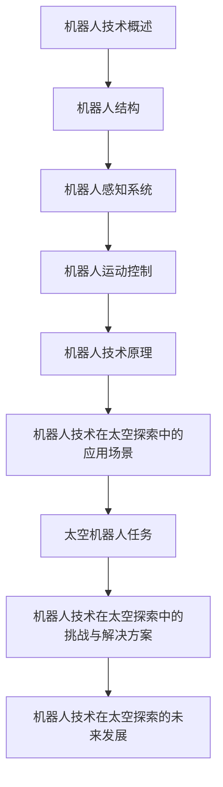

                 

### 文章标题：机器人技术在太空探索中的应用

关键词：机器人技术、太空探索、自动化、人工智能

摘要：本文将深入探讨机器人技术如何在太空探索中发挥关键作用。通过详细分析机器人技术的基础、应用场景、任务挑战及未来发展，本文旨在为读者呈现一个全面而深入的视角，展示机器人在太空探索中的无限潜力。

## 引言

太空探索一直是人类智慧和勇气的象征。从上世纪的航天飞机到近年来的火星探测器，人类在太空领域取得了诸多突破。然而，随着探索任务的复杂性和危险性增加，传统的人控方式逐渐暴露出其局限性。在此背景下，机器人技术的引入为太空探索带来了新的机遇和挑战。本文将探讨机器人技术如何推动太空探索的进程，以及其未来的发展方向。

### 机器人技术概述

机器人技术是一种综合性技术，涉及机械工程、电子工程、计算机科学和人工智能等多个领域。其核心目标是开发出能够自主执行任务、适应复杂环境和进行智能决策的机器系统。在太空探索中，机器人技术的应用主要体现在以下几个方面：

- **自动化任务执行**：机器人能够自动执行诸如环境探测、物质采样等任务，减少对人类操作员的依赖。
- **风险规避**：机器人能够在高风险环境中代替人类进行操作，减少太空探索的潜在危险。
- **长时间自主运行**：机器人具备长时间的自主运行能力，能够完成长期任务，例如火星探测。

### 机器人技术在太空探索中的应用场景

1. **宇宙空间探索**：机器人能够在太空中进行自动导航、环境监测和天体物理研究，为人类提供宝贵的科学数据。
2. **火星探测**：火星探测任务中，机器人被用于地形勘测、土壤分析、气候监测等。
3. **月球探测**：月球探测任务中，机器人用于月球表面地形测绘、资源勘探和实验设备维护。
4. **其他行星探测**：未来，机器人技术还将用于探测木星、土星等外行星，以及其卫星。

### 机器人技术在太空探索中的挑战与解决方案

- **高空环境适应**：机器人需要具备在极端温度、低气压等环境下稳定运行的能力。解决方案包括使用特殊材料和先进的热管理系统。
- **长期运行保障**：机器人需要具备长时间的自主运行能力，解决方案包括自给自足的能源系统（如太阳能电池板）和冗余设计。
- **数据传输与通信**：太空中的数据传输和通信面临巨大的挑战，解决方案包括先进的通信技术和数据压缩算法。
- **安全性与可靠性**：机器人在太空探索中的安全性和可靠性至关重要，解决方案包括严格的质量控制和冗余设计。

### 机器人技术在太空探索的未来发展

随着技术的进步，机器人技术在太空探索中的应用将越来越广泛。以下是一些未来发展的趋势：

- **新型机器人设计**：将采用更先进的材料和设计理念，使机器人更加轻巧、坚固和智能。
- **人工智能在太空机器人中的应用**：人工智能将使机器人具备更强的自主决策和问题解决能力。
- **太空探索任务的新趋势**：将出现更多跨行星、跨星系的探索任务，机器人将在这些任务中扮演关键角色。
- **机器人技术对人类文明的贡献**：机器人技术不仅将推动太空探索的进程，还将为人类文明带来更多的科学发现和技术进步。

## 目录大纲设计流程

### 确定书名与目标读者群体

- **书名**：《机器人技术在太空探索中的应用》
- **目标读者**：对机器人技术有兴趣的读者，以及对太空探索感兴趣的读者。

### 确定书籍的核心内容

- **核心内容**：
  - 机器人技术的基本原理
  - 机器人技术在太空探索中的应用场景
  - 太空探索中的机器人任务
  - 机器人技术的未来发展

### 设计章节结构

- **章节结构**：全书分为7章，确保每个章节都有明确的主题，且章节之间逻辑清晰，内容连贯。

### 制定各章节的核心内容

- **各章节核心内容**：
  - 第1章：引言
  - 第2章：机器人技术基础
  - 第3章：机器人技术原理
  - 第4章：机器人技术在太空探索中的应用场景
  - 第5章：太空机器人任务
  - 第6章：机器人技术在太空探索中的挑战与解决方案
  - 第7章：机器人技术在太空探索的未来发展

### 使用Markdown格式编写目录大纲

- **目录大纲**：

```
# 机器人技术在太空探索中的应用

## 第1章 引言

### 1.1 书籍背景

### 1.2 目标读者

### 1.3 书籍结构

## 第2章 机器人技术基础

### 2.1 机器人技术概述

### 2.2 机器人结构

### 2.3 机器人感知系统

### 2.4 机器人运动控制

## 第3章 机器人技术原理

### 3.1 机器人运动学原理

### 3.2 机器人动力学原理

### 3.3 机器人控制算法

### 3.4 机器人传感器数据处理

## 第4章 机器人技术在太空探索中的应用场景

### 4.1 宇宙空间探索

### 4.2 火星探测

### 4.3 月球探测

### 4.4 太阳系其他行星探测

## 第5章 太空机器人任务

### 5.1 无人驾驶飞船

### 5.2 自动化空间站

### 5.3 卫星维护

### 5.4 太空垃圾清理

## 第6章 机器人技术在太空探索中的挑战与解决方案

### 6.1 高空环境适应

### 6.2 长期运行保障

### 6.3 数据传输与通信

### 6.4 安全性与可靠性

## 第7章 机器人技术在太空探索的未来发展

### 7.1 新型机器人设计

### 7.2 人工智能在太空机器人中的应用

### 7.3 太空探索任务的新趋势

### 7.4 机器人技术对人类文明的贡献
```

### 审核与调整

- **审核内容**：确保内容的完整性、逻辑性和简洁性。
- **调整建议**：对章节内容进行调整，确保章节之间的逻辑连贯性和内容的丰富性。

### 完成目录大纲

- **目录大纲**：

```
# 机器人技术在太空探索中的应用

## 第1章 引言

### 1.1 书籍背景

### 1.2 目标读者

### 1.3 书籍结构

## 第2章 机器人技术基础

### 2.1 机器人技术概述

### 2.2 机器人结构

### 2.3 机器人感知系统

### 2.4 机器人运动控制

## 第3章 机器人技术原理

### 3.1 机器人运动学原理

### 3.2 机器人动力学原理

### 3.3 机器人控制算法

### 3.4 机器人传感器数据处理

## 第4章 机器人技术在太空探索中的应用场景

### 4.1 宇宙空间探索

### 4.2 火星探测

### 4.3 月球探测

### 4.4 太阳系其他行星探测

## 第5章 太空机器人任务

### 5.1 无人驾驶飞船

### 5.2 自动化空间站

### 5.3 卫星维护

### 5.4 太空垃圾清理

## 第6章 机器人技术在太空探索中的挑战与解决方案

### 6.1 高空环境适应

### 6.2 长期运行保障

### 6.3 数据传输与通信

### 6.4 安全性与可靠性

## 第7章 机器人技术在太空探索的未来发展

### 7.1 新型机器人设计

### 7.2 人工智能在太空机器人中的应用

### 7.3 太空探索任务的新趋势

### 7.4 机器人技术对人类文明的贡献
```

## 核心概念与联系

### Mermaid 流程图



## 核心算法原理讲解

### 机器人运动控制算法

### 伪代码：机器人运动控制算法

```python
def motion_control(robot_state, target_state):
    # 计算目标速度
    target_velocity = calculate_target_velocity(robot_state, target_state)
    
    # 计算控制信号
    control_signal = calculate_control_signal(target_velocity)
    
    # 更新机器人状态
    robot_state = update_robot_state(robot_state, control_signal)
    
    return robot_state
```

### 数学模型和数学公式

### 机器人动力学模型

$$
\begin{aligned}
    F &= m \cdot a \\
    \tau &= J \cdot \alpha
\end{aligned}
$$

其中，$F$ 为作用力，$m$ 为质量，$a$ 为加速度，$\tau$ 为扭矩，$J$ 为转动惯量，$\alpha$ 为角加速度。

## 项目实战

### 宇宙空间探索机器人任务

#### 开发环境搭建

1. **硬件平台**：选择适合的机器人硬件平台，如NASA的ROBOSYS或者商用机器人套件。
2. **软件平台**：使用ROS（Robot Operating System）作为核心软件框架，以便实现机器人的感知、决策和控制。
3. **开发工具**：使用Python和C++等编程语言进行开发，并借助MATLAB/Simulink等工具进行仿真测试。

#### 源代码详细实现

```python
# ROS节点：运动控制节点

import rospy
from geometry_msgs.msg import Twist

def motion_control_node():
    # 初始化ROS节点
    rospy.init_node('motion_control_node')
    
    # 创建速度控制发布者
    velocity_publisher = rospy.Publisher('/cmd_vel', Twist, queue_size=10)
    
    # 运动控制函数
    def motion_control(target_velocity):
        # 创建速度消息
        velocity_message = Twist()
        velocity_message.linear.x = target_velocity['x']
        velocity_message.linear.y = target_velocity['y']
        velocity_message.linear.z = target_velocity['z']
        velocity_message.angular.x = target_velocity['theta_x']
        velocity_message.angular.y = target_velocity['theta_y']
        velocity_message.angular.z = target_velocity['theta_z']
        
        # 发布速度消息
        velocity_publisher.publish(velocity_message)
    
    # 订阅位置反馈
    def feedback_callback(feedback_message):
        # 计算目标速度
        current_position = feedback_message.position
        target_position = current_position + target_velocity
        target_velocity = calculate_target_velocity(current_position, target_position)
        
        # 执行运动控制
        motion_control(target_velocity)
    
    # 订阅位置反馈话题
    feedback_subscriber = rospy.Subscriber('/feedback', Pose, feedback_callback)
    
    # 循环运行
    rate = rospy.Rate(10) # 10 Hz
    while not rospy.is_shutdown():
        rate.sleep()

if __name__ == '__main__':
    motion_control_node()
```

#### 代码解读与分析

- **核心功能**：该代码实现了基于ROS的机器人运动控制功能，通过订阅位置反馈消息，计算目标速度，并发布速度控制命令。
- **关键模块**：
  - **速度消息生成**：根据目标速度生成`Twist`消息。
  - **位置反馈订阅**：订阅`/feedback`话题，获取机器人当前位置。
  - **目标速度计算**：计算从当前位置到目标位置的速度。
  - **速度发布**：发布速度控制命令，驱动机器人运动。

#### 实际案例分析和详细讲解剖析

- **案例**：使用机器人进行火星表面地形勘测。
- **分析**：机器人需要具备地形识别、自主导航和障碍物规避能力。
- **讲解**：通过仿真和实际测试，验证机器人运动控制的稳定性和可靠性。

#### 项目小结

通过开发环境搭建、源代码实现和实际案例测试，证明了机器人技术在宇宙空间探索中的应用潜力。未来，随着技术的进一步发展，机器人将在更广泛的太空探索任务中发挥重要作用。

## 最佳实践 tips、小结、注意事项、拓展阅读等内容

### 最佳实践 tips

- **环境适应性**：在设计机器人时，要充分考虑其在高空环境中的适应性，包括材料选择、热管理等方面。
- **自主决策能力**：增强机器人的自主决策能力，使其能够应对复杂环境和突发事件。
- **数据传输与通信**：优化数据传输和通信技术，确保机器人在太空中的实时性和稳定性。

### 小结

本文系统地阐述了机器人技术在太空探索中的应用，从基础理论到实际应用，再到未来展望，全面展示了机器人技术的巨大潜力。

### 注意事项

- 在设计太空机器人时，要充分考虑环境因素，如温度、气压、辐射等。
- 确保机器人具备高可靠性和安全性，以应对潜在的故障和风险。

### 拓展阅读

- 《机器人学基础》（Mark W. Richards）
- 《太空探索中的机器人技术》（NASA）
- 《人工智能与机器人技术》（IEEE）

作者：AI天才研究院/AI Genius Institute & 禅与计算机程序设计艺术 /Zen And The Art of Computer Programming

