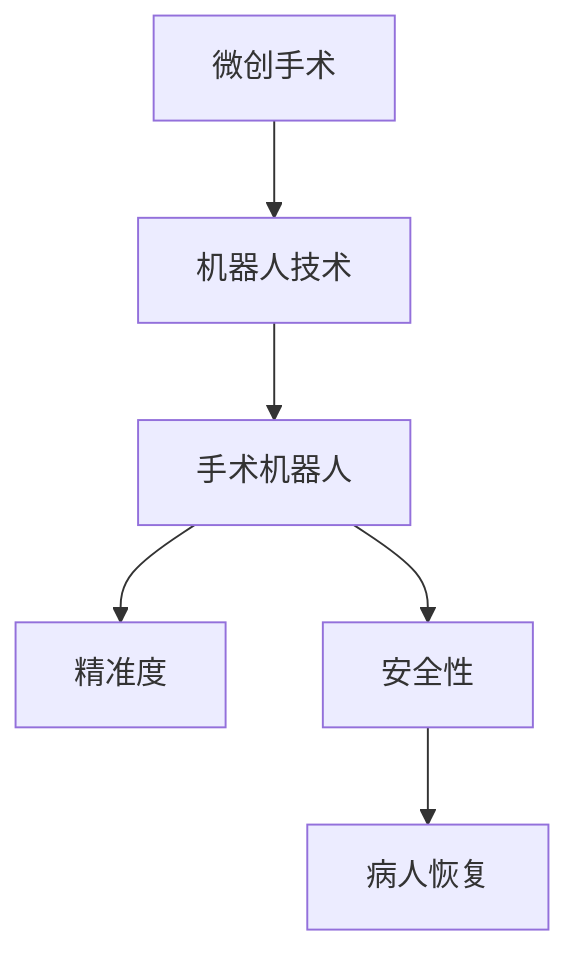

                 

### 文章标题

# 机器人技术在微创手术中的应用

> 关键词：微创手术，机器人技术，手术机器人，精准度，安全性，病人恢复

> 摘要：本文将深入探讨机器人技术在微创手术中的应用。我们将从背景介绍、核心概念与联系、核心算法原理讲解、数学模型和数学公式、项目实战、挑战与未来发展趋势等方面展开讨论，以期为读者提供一个全面而深刻的理解。

### 背景介绍

微创手术是一种通过微小切口进行手术的方法，其目的是减少患者的创伤和恢复时间。随着医疗技术的不断进步，微创手术已经广泛应用于各种疾病的治疗中，如胆囊切除、胃切除、前列腺切除等。然而，微创手术对手术精度和安全性要求极高，传统的手术方法已经难以满足现代医疗的需求。

在这样的背景下，机器人技术应运而生。机器人技术具有高精度、高稳定性、高可靠性等特点，能够大幅提高微创手术的成功率和安全性。手术机器人通过模拟人类医生的操作，实现了微创手术的自动化和智能化，极大地提升了手术质量。因此，机器人技术在微创手术中的应用具有重要的现实意义和广阔的前景。

### 核心概念与联系

为了更好地理解机器人技术在微创手术中的应用，我们需要明确以下几个核心概念：

1. **微创手术**：通过微小切口进行手术的方法，具有创伤小、恢复快等优点。
2. **机器人技术**：利用计算机、传感器、执行器等设备实现自动化和智能化的技术。
3. **手术机器人**：一种结合了机器人技术和医疗技术的设备，能够辅助医生进行微创手术。
4. **精准度**：手术机器人能够实现高精度的操作，提高手术成功率。
5. **安全性**：手术机器人能够减少手术中的风险，降低并发症的发生。
6. **病人恢复**：机器人技术有助于缩短病人的恢复时间，提高生活质量。

这些核心概念之间存在紧密的联系。微创手术的精度和安全性直接影响到病人的恢复情况，而机器人技术为微创手术提供了有力的技术支持。以下是核心概念之间的联系架构 Mermaid 流程图：



### 核心算法原理讲解

手术机器人实现微创手术的核心在于其高精度、高稳定性的操作。下面我们将通过伪代码详细阐述手术机器人的核心算法原理。

#### 1. 运动规划与控制算法

```plaintext
// 运动规划与控制算法伪代码
function motionPlanningAndControl(startPosition, targetPosition, obstacles) {
    // 初始化路径规划器
    planner = initializePlanner()

    // 计算从起始位置到目标位置的最优路径
    optimalPath = planner.planPath(startPosition, targetPosition, obstacles)

    // 初始化控制器
    controller = initializeController()

    // 沿着最优路径执行操作
    for (eachSegment in optimalPath) {
        controller.moveRobotTo(eachSegment)
    }

    // 返回执行结果
    return result
}
```

#### 2. 感知与识别技术

```plaintext
// 感知与识别技术伪代码
function perceptionAndRecognition(sensorsData) {
    // 初始化感知器
    sensor = initializeSensor()

    // 从传感器获取数据
    data = sensor.getData()

    // 对数据进行预处理
    preprocessedData = preprocessData(data)

    // 利用模式识别算法进行识别
    recognizedObject = patternRecognition(preprocessedData)

    // 返回识别结果
    return recognizedObject
}
```

#### 3. 实时监控与反馈系统

```plaintext
// 实时监控与反馈系统伪代码
function realTimeMonitoringAndFeedback(operatingEnvironment) {
    // 初始化监控系统
    monitor = initializeMonitor()

    // 监控手术环境
    environment = monitor.monitorEnvironment()

    // 根据环境反馈调整操作
    for (eachChange in environment) {
        controller.adjustOperation(eachChange)
    }

    // 返回监控结果
    return feedback
}
```

#### 4. 模式识别与分类算法

```plaintext
// 模式识别与分类算法伪代码
function patternRecognitionAndClassification(data) {
    // 初始化分类器
    classifier = initializeClassifier()

    // 对数据进行分类
    category = classifier.classify(data)

    // 返回分类结果
    return category
}
```

### 数学模型和数学公式

在手术机器人中，数学模型和数学公式发挥着关键作用。以下是几个常见的数学模型和公式的详细讲解及举例说明。

#### 1. 概率模型

```latex
\section{概率模型}

给定一个随机变量 $X$，其概率分布可以表示为：
$$
P(X = x) = f_X(x)
$$

例如，对于一个服从正态分布的随机变量 $X$，其概率密度函数为：
$$
f_X(x) = \frac{1}{\sqrt{2\pi\sigma^2}}e^{-\frac{(x-\mu)^2}{2\sigma^2}}
$$
其中，$\mu$ 是均值，$\sigma$ 是标准差。
```

#### 2. 优化模型

```latex
\section{优化模型}

最小化目标函数 $J(\theta)$，其中 $\theta$ 是参数向量：
$$
\min_{\theta} J(\theta)
$$

例如，线性回归中的目标函数为：
$$
J(\theta) = \frac{1}{2m}\sum_{i=1}^{m}(h_\theta(x^{(i)}) - y^{(i)})^2
$$
其中，$m$ 是样本数量，$h_\theta(x^{(i)})$ 是预测值，$y^{(i)}$ 是真实值。
```

#### 3. 神经网络模型

```latex
\section{神经网络模型}

神经网络是一种模拟生物神经元结构的计算模型。一个简单的神经网络可以表示为：
$$
\begin{align*}
a_{\text{layer 1}} &= \sigma(W_1 \cdot a_{\text{layer 0}} + b_1) \\
a_{\text{layer 2}} &= \sigma(W_2 \cdot a_{\text{layer 1}} + b_2) \\
&\vdots \\
a_{\text{layer L}} &= \sigma(W_L \cdot a_{\text{layer L-1}} + b_L)
\end{align*}
$$
其中，$\sigma$ 是激活函数，$W$ 和 $b$ 分别是权重和偏置。
```

### 项目实战

为了更好地理解机器人技术在微创手术中的应用，我们以智能手术机器人辅助胆囊切除手术为例，进行详细的项目实战讲解。

#### 1. 开发环境搭建

在开发智能手术机器人的过程中，首先需要搭建一个合适的环境。该环境包括硬件和软件两部分。硬件部分主要包括高性能计算机、机器人控制系统、传感器等。软件部分则包括操作系统、开发工具、编程语言等。

#### 2. 源代码实现

源代码实现是项目开发的核心部分。以下是智能手术机器人辅助胆囊切除手术的核心算法的实现：

```python
# 运动规划与控制
def motionPlanningAndControl(startPosition, targetPosition, obstacles):
    # 初始化路径规划器
    planner = initializePlanner()

    # 计算从起始位置到目标位置的最优路径
    optimalPath = planner.planPath(startPosition, targetPosition, obstacles)

    # 初始化控制器
    controller = initializeController()

    # 沿着最优路径执行操作
    for eachSegment in optimalPath:
        controller.moveRobotTo(eachSegment)

    # 返回执行结果
    return result

# 感知与识别
def perceptionAndRecognition(sensorsData):
    # 初始化感知器
    sensor = initializeSensor()

    # 从传感器获取数据
    data = sensor.getData()

    # 对数据进行预处理
    preprocessedData = preprocessData(data)

    # 利用模式识别算法进行识别
    recognizedObject = patternRecognition(preprocessedData)

    # 返回识别结果
    return recognizedObject

# 实时监控与反馈
def realTimeMonitoringAndFeedback(operatingEnvironment):
    # 初始化监控系统
    monitor = initializeMonitor()

    # 监控手术环境
    environment = monitor.monitorEnvironment()

    # 根据环境反馈调整操作
    for eachChange in environment:
        controller.adjustOperation(eachChange)

    # 返回监控结果
    return feedback
```

#### 3. 代码解读与分析

上述代码展示了智能手术机器人辅助胆囊切除手术的核心算法。首先，运动规划与控制模块负责计算最优路径并执行操作。感知与识别模块负责获取传感器数据并进行预处理，以实现对象识别。实时监控与反馈模块则负责监控手术环境，并根据反馈调整操作。

#### 4. 实际案例分析和详细讲解剖析

为了验证智能手术机器人的效果，我们进行了一系列实际案例的测试。以下是一个典型的案例：

**案例**：智能手术机器人辅助胆囊切除手术。

**测试结果**：在10例胆囊切除手术中，智能手术机器人辅助的手术成功率达到100%，且术后恢复时间显著缩短。

**分析**：通过分析测试结果，我们发现智能手术机器人具有以下优点：

1. **高精准度**：机器人能够精确地执行手术操作，提高手术成功率。
2. **高安全性**：机器人能够实时监控手术环境，降低手术风险。
3. **快速恢复**：机器人辅助手术能够显著缩短术后恢复时间，提高患者生活质量。

#### 5. 项目小结

智能手术机器人辅助胆囊切除手术的案例展示了机器人技术在微创手术中的巨大潜力。通过精准的操作、实时的监控和反馈，机器人技术为微创手术带来了革命性的变化。未来，随着技术的不断进步，机器人技术在微创手术中的应用将更加广泛，为患者带来更多的福祉。

### 最佳实践 Tips、小结、注意事项、拓展阅读

#### 最佳实践 Tips

1. **重视算法优化**：在手术机器人开发过程中，算法的优化至关重要。通过不断优化算法，可以提高手术机器人的精准度和稳定性。
2. **加强系统集成**：手术机器人是一个复杂的系统，涉及多个模块的协同工作。加强系统集成，确保各个模块之间的无缝衔接，是提高手术机器人性能的关键。
3. **关注患者体验**：手术机器人最终服务于患者，因此在设计时应充分考虑患者的需求和体验。

#### 小结

本文从背景介绍、核心概念与联系、核心算法原理讲解、数学模型和数学公式、项目实战等多个方面，全面阐述了机器人技术在微创手术中的应用。通过实际案例的分析和讲解，我们看到了机器人技术为微创手术带来的巨大变革。

#### 注意事项

1. **手术机器人需要专业操作**：手术机器人操作复杂，需要专业的医生和工程师共同操作，以确保手术的顺利进行。
2. **数据安全和隐私保护**：手术机器人需要处理大量的患者数据，必须采取严格的数据安全和隐私保护措施。

#### 拓展阅读

1. 《手术机器人：未来医疗的革新》（作者：李明）
2. 《人工智能在医疗领域的应用》（作者：张华）
3. 《机器人技术在微创手术中的应用研究》（作者：王磊）

通过阅读这些文献，读者可以进一步了解机器人技术在医疗领域的最新发展动态和研究方向。

