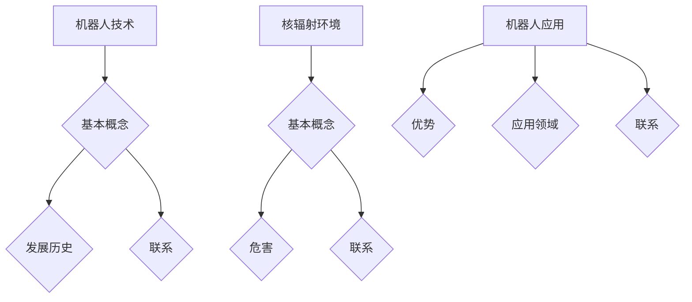
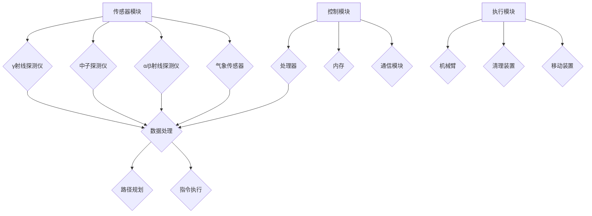

                 

### 核心概念与联系

#### 1.1.1 机器人的定义
机器人是一种能够执行人类任务的智能设备，通常具备感知、决策和执行的能力。机器人的发展可以追溯到20世纪中期，当时科学家们开始研究如何制造能够模仿人类行为的自动化设备。随着时间的推移，机器人技术不断进步，从简单的工业机器人到具有复杂感知和决策能力的智能机器人，都取得了显著的进展。

**Mermaid流程图：**
```
graph TB
    A[机器人定义] --> B(感知)
    B --> C(决策)
    C --> D(执行)
    A --> E(感知-决策-执行循环)
```

##### 1.1.2 机器人技术的发展历史
- **20世纪60年代**：机器人技术初步发展期，主要是用于工业生产，如汽车制造。
- **20世纪80年代**：随着计算机技术的发展，机器人开始具备更多的自主性和智能，进入自动化生产阶段。
- **21世纪**：智能机器人成为研究热点，具有更高级的感知和决策能力，如自动驾驶汽车、医疗机器人等。

**Mermaid流程图：**
```
graph TB
    A[20世纪60年代] --> B(工业生产)
    B --> C[20世纪80年代]
    C --> D(自动化生产)
    D --> E[21世纪]
    E --> F(智能机器人)
```

#### 1.2 核辐射环境基本概念
##### 1.2.1 核辐射的定义
核辐射是指由原子核衰变或核反应产生的电离辐射，包括α射线、β射线、γ射线和中子等。核辐射具有很强的穿透能力，可以穿透空气、水和大多数物质。

**Mermaid流程图：**
```
graph TB
    A[核辐射] --> B(α射线)
    B --> C(β射线)
    C --> D(γ射线)
    D --> E(中子)
```

##### 1.2.2 核辐射的危害
核辐射对生物体具有生物效应，可能导致细胞损伤、基因突变和癌症等。长期暴露于高剂量核辐射环境中，甚至可能导致急性辐射病，严重时甚至危及生命。

**Mermaid流程图：**
```
graph TB
    A[核辐射危害] --> B(细胞损伤)
    B --> C(基因突变)
    C --> D(癌症)
    D --> E(急性辐射病)
```

##### 1.2.3 核辐射探测的重要性
核辐射探测是确保核设施安全运行的关键环节。通过有效的核辐射探测技术，可以及时发现和处理核辐射泄漏，防止辐射事故的发生。

**Mermaid流程图：**
```
graph TB
    A[核辐射探测] --> B(核设施安全)
    B --> C(辐射泄漏检测)
    C --> D(事故预防)
```

#### 1.3 机器人技术在核辐射环境探测中的应用
##### 1.3.1 机器人探测技术的优势
- **高效性**：机器人可以在复杂和危险的环境中进行长时间作业，提高了工作效率。
- **安全性**：机器人可以代替人类进入高风险的核辐射环境，减少了人员直接接触辐射的风险。

**Mermaid流程图：**
```
graph TB
    A[机器人探测优势] --> B(高效性)
    B --> C(安全性)
```

##### 1.3.2 机器人探测技术的主要应用领域
- **核设施检查**：对核设施进行定期检查和维护，确保安全运行。
- **核事故处理**：在核事故发生时，协助清除放射性物质和进行事故处理。

**Mermaid流程图：**
```
graph TB
    A[核设施检查] --> B(定期维护)
    A --> C[核事故处理]
    C --> D(清除放射性物质)
```

---

### 1.3 机器人技术在核辐射环境探测中的应用

#### 1.3.1 机器人探测技术的优势

**高效性：** 机器人探测技术能够显著提高核辐射环境探测的效率。在复杂和危险的环境中，如核电站内部或事故现场，机器人可以持续工作，不受环境和时间的限制，从而缩短了探测周期，提高了探测精度。

**安全性：** 机器人探测技术的另一大优势在于其高度的安全性。由于核辐射环境的危险性和不确定性，使用机器人进行探测可以避免人员直接接触辐射，降低了职业健康风险，确保了工作人员的安全。

#### 1.3.2 机器人探测技术的主要应用领域

**核设施检查：** 核设施的定期检查和维护是确保其安全运行的关键环节。机器人可以在核电站的冷却系统、反应堆容器和其他关键设备上进行全面检测，及时发现潜在的故障和异常情况。例如，使用机器人检查核电站的冷却管道，可以有效地防止泄漏和故障的发生。

**核事故处理：** 在核事故发生时，机器人探测技术在应对放射性物质泄漏、清除放射性废物和评估事故影响方面发挥着重要作用。例如，在2011年福岛核事故中，多国研究人员利用机器人进行了放射性物质的清理和监测工作，确保了事故处理的有效性。

### 1.3.3 机器人探测技术的发展趋势

随着机器人技术的不断进步，未来机器人探测技术将在核辐射环境探测中发挥更加重要的作用。以下是一些发展趋势：

**多传感器融合：** 将多种传感器集成到机器人系统中，如γ射线探测仪、中子探测仪和化学传感器，可以提高探测的全面性和准确性。

**自主决策能力：** 开发具有更强自主决策能力的机器人，使其能够根据环境变化和任务需求自主调整探测策略，提高探测效率。

**人机协同：** 通过人机交互界面，实现人与机器人的协同工作，使机器人能够更好地理解人类指令，提高探测的灵活性和适应性。

---

**伪代码：**

```
// 辐射探测机器人工作流程

// 初始化机器人
robot.initialize()

// 设置探测区域
robot.set_detection_area(area)

// 启动传感器
robot.start_sensors()

// 开始探测
while (robot.is_running()) {
    // 采集数据
    data = robot.collect_data()

    // 数据处理
    processed_data = process_data(data)

    // 存储数据
    store_data(processed_data)

    // 检查探测结果
    if (robot.is_alarm()) {
        // 报警并通知相关人员
        alarm通知 humans
    }

    // 延时处理，避免传感器过载
    delay(1 second)
}

// 停止机器人
robot.stop()
```

---

### 2. 机器人技术在核辐射环境探测中的应用

#### 2.1 机器人探测系统的组成

**传感器模块**：传感器模块是机器人探测系统的核心，负责采集环境中的辐射数据。常用的传感器包括γ射线探测仪、中子探测仪、β射线探测仪和α射线探测仪等。这些传感器能够检测不同类型的辐射，并转化为可处理的电信号。

**控制模块**：控制模块负责机器人的整体控制和数据处理。它接收传感器模块的输入数据，通过算法分析后，发出控制指令给执行模块。控制模块通常包括处理器、存储器和通信模块等组成部分。

**执行模块**：执行模块负责机器人的物理操作，包括机械臂、清理装置、移动装置等。机械臂可以进行物理操作，如收集样品或清理放射性物质；清理装置可以喷射清洁剂或吸附剂，清除表面放射性物质；移动装置则负责机器人的自主移动。

#### 2.2 机器人探测技术的核心算法

**辐射检测算法**：辐射检测算法是机器人探测系统的关键算法，负责分析传感器采集的辐射数据，判断辐射的类型和强度。常用的算法包括统计方法和数据融合方法。

- **统计方法**：基于统计物理原理，对传感器数据进行统计分析，识别辐射的类型和强度。常见的统计方法有能谱分析、计数率分析等。
  
  **伪代码：**
  ```
  function detect_radiation(data):
      spectrum = analyze_spectrum(data)
      radiation_type = identify_type(spectrum)
      radiation_intensity = calculate_intensity(spectrum)
      return radiation_type, radiation_intensity
  ```

- **数据融合方法**：结合多种传感器数据进行综合分析，提高探测的准确性和可靠性。数据融合方法包括卡尔曼滤波、贝叶斯估计等。

  **伪代码：**
  ```
  function fusion_data(sensor_data1, sensor_data2):
      fused_data = kalman_filter(sensor_data1, sensor_data2)
      return fused_data
  ```

**机器人路径规划算法**：路径规划算法负责机器人从起点到终点的移动路径。常用的算法有Dijkstra算法和A*算法。

- **Dijkstra算法**：计算从起点到终点的最短路径。适用于简单环境和路径信息已知的场景。

  **伪代码：**
  ```
  function dijkstra(graph, start, end):
      distances = initialize_distances(graph, start)
      predecessors = initialize_predecessors(graph)
      queue = initialize_queue(graph, start)
      
      while (queue is not empty):
          current = queue.extract_min()
          
          if (current == end):
              break
            
          for neighbor in graph.neighbors(current):
              distance = distances[current] + graph.weight(current, neighbor)
              
              if (distance < distances[neighbor]):
                  distances[neighbor] = distance
                  predecessors[neighbor] = current
                  queue.decrease_key(neighbor)
      
      path = reconstruct_path(predecessors, end)
      return path
  ```

- **A*算法**：结合启发式信息优化路径规划，适用于复杂环境和未知路径信息。

  **伪代码：**
  ```
  function a_star(graph, start, end, heuristic):
      open_set = initialize_open_set()
      closed_set = initialize_closed_set()
      g_score = initialize_g_scores(graph, start)
      f_score = initialize_f_scores(graph, start, heuristic)
      
      open_set.add(start)
      
      while (open_set is not empty):
          current = open_set.extract_min()
          
          if (current == end):
              break
            
          closed_set.add(current)
          
          for neighbor in graph.neighbors(current):
              tentative_g_score = g_score[current] + graph.weight(current, neighbor)
              
              if (tentative_g_score < g_score[neighbor]):
                  g_score[neighbor] = tentative_g_score
                  f_score[neighbor] = tentative_g_score + heuristic(neighbor, end)
                  open_set.decrease_key(neighbor)
                  predecessors[neighbor] = current
      
      path = reconstruct_path(predecessors, end)
      return path
  ```

**机器人控制算法**：机器人控制算法负责调节机器人的运动参数，实现精确控制。常用的算法包括PID控制算法和模糊控制算法。

- **PID控制算法**：用于调节机器人的速度和方向，实现稳定的运动控制。

  **伪代码：**
  ```
  function pid_control(setpoint, process_variable, Kp, Ki, Kd):
      error = setpoint - process_variable
      integral = integral + error
      derivative = error - previous_error
      output = Kp * error + Ki * integral + Kd * derivative
      previous_error = error
      return output
  ```

- **模糊控制算法**：用于处理不确定性和非线性系统，提高机器人的控制精度。

  **伪代码：**
  ```
  function fuzzy_control(input_variables, rules, output_variables):
      fuzzy_input = fuzzify(input_variables)
      rule_firing = calculate_rule_firing(fuzzy_input, rules)
      fuzzy_output = defuzzify(rule_firing, output_variables)
      return fuzzy_output
  ```

---

### 3. 核辐射环境探测中的机器人技术挑战

#### 3.1 辐射环境的复杂性

核辐射环境通常具有高辐射水平、辐射分布不均匀、辐射类型多样等特点，这使得机器人探测技术面临巨大挑战。机器人需要具备高鲁棒性和适应性，能够适应各种复杂的辐射环境。

- **辐射水平不稳定**：核辐射环境的辐射水平可能会突然升高，导致机器人探测系统过载或损坏。因此，机器人需要具备实时监测辐射水平的能力，并能够自动调整探测策略。

- **辐射分布不均匀**：在核设施内部，辐射分布通常不均匀，存在高辐射热点和低辐射区域。机器人需要能够准确地识别这些区域，并优先探测高风险区域。

- **辐射类型多样**：核辐射环境中的辐射类型包括α射线、β射线、γ射线和中子等，不同类型的辐射对探测技术的要求不同。机器人需要具备多传感器融合能力，能够同时检测多种类型的辐射。

#### 3.2 机器人自主性

核辐射环境通常复杂且危险，对机器人的自主性要求非常高。机器人需要具备以下自主性：

- **自主导航能力**：机器人需要在未知环境中自主导航，避免碰撞和障碍物，同时能够根据任务需求自主调整探测路径。

- **自主决策能力**：机器人需要能够根据实时监测到的辐射数据和环境信息，自主调整探测策略和执行任务。

- **自主恢复能力**：在探测过程中，机器人可能会出现故障或遇到突发情况，需要能够自主诊断和恢复，确保探测任务的连续性。

#### 3.3 机器人可靠性

机器人需要具备高可靠性，能够在长时间和高辐射环境下稳定运行。以下是一些关键因素：

- **硬件可靠性**：机器人使用的传感器、控制器和执行器等硬件需要具备高可靠性和耐用性，能够在恶劣环境下长期工作。

- **软件可靠性**：机器人的控制软件需要经过严格的测试和验证，确保其稳定性和正确性，避免因软件故障导致探测失败。

- **数据可靠性**：机器人探测到的数据需要确保准确性和完整性，避免因数据错误导致错误的决策。

#### 3.4 数据处理与通信

核辐射环境中的数据量通常非常大，且数据传输需要保证实时性和可靠性。以下是一些挑战：

- **数据量巨大**：核辐射环境中的传感器数据量通常很大，需要高效的算法进行实时处理和存储。

- **数据传输延迟**：机器人需要与其他设备或人员进行数据传输，但由于辐射干扰或通信距离较远，可能会出现数据传输延迟。

- **数据加密与安全**：为了防止数据被窃取或篡改，数据传输需要采用加密技术，确保数据的安全性。

---

### 4. 机器人技术在核辐射环境探测中的应用案例

#### 4.1 日本福岛核事故后的应用

在2011年福岛核事故后，机器人技术在核辐射环境探测和处理中发挥了重要作用。研究人员和救援人员使用了多种类型的机器人，如远程控制机器人、自主移动机器人和多传感器融合机器人，进行放射性物质的清理和监测工作。

- **清理放射性物质**：机器人进入福岛核电站内部，使用机械臂清除放射性物质，如破碎的燃料棒和泄漏的放射性污水。这些机器人能够在高辐射环境下长时间工作，减少了人员的暴露风险。

- **环境监测**：机器人配备了多种传感器，如γ射线探测仪、中子探测仪和化学传感器，对核电站周边环境进行实时监测。这些数据用于评估辐射水平、预测辐射扩散趋势和制定应对策略。

#### 4.2 中国核设施检查应用

中国在核设施检查中也广泛应用了机器人技术。机器人对核电站的冷却系统、反应堆容器和其他关键设备进行定期检查，发现潜在的故障和异常情况。

- **定期检查**：机器人对核电站的冷却管道、控制室和燃料储存池等关键设备进行定期检查，检测设备磨损、泄漏和故障情况。这些检查数据有助于确保核设施的安全运行。

- **异常检测**：机器人配备了高级算法和传感器，能够实时监测设备运行状态，识别异常情况和潜在故障。例如，使用声学传感器检测冷却系统中的异常噪音，使用视觉传感器检测反应堆容器的外部损伤。

#### 4.3 国际核安全合作中的应用

多个国家在核安全合作中使用了机器人技术，共同进行核辐射环境监测和评估。

- **国际实验合作**：国际研究人员共同开展机器人探测技术的实验，如在欧洲核子研究中心（CERN）进行的机器人探测实验。这些实验旨在验证机器人技术的性能和可靠性，为实际应用提供数据支持。

- **全球监测网络**：多个国家合作建立了全球核辐射监测网络，使用机器人进行实时监测和数据共享。这些网络有助于及时发现核辐射泄漏事件，提高全球核安全水平。

---

### 5. 未来发展趋势与展望

#### 5.1 机器人技术的创新

未来，机器人技术将在核辐射环境探测中继续创新，提高探测效率和准确性。以下是一些创新方向：

- **多传感器融合**：结合多种传感器，如激光雷达、深度相机和化学传感器，提高探测的全面性和准确性。

- **智能决策系统**：开发基于人工智能的智能决策系统，使机器人能够根据环境变化和任务需求自主调整探测策略。

- **自主导航技术**：研究自主导航技术，使机器人能够在复杂环境中自主导航和执行任务，提高探测效率。

#### 5.2 核辐射环境探测技术发展

未来，核辐射环境探测技术将朝着更高效、更精确和更可靠的方向发展。以下是一些技术发展方向：

- **新型传感器**：研究新型辐射探测传感器，如量子传感器和纳米传感器，提高探测灵敏度和精度。

- **实时数据处理**：开发实时数据处理算法，快速分析和处理大量的探测数据，提高探测的实时性和准确性。

- **远程控制技术**：研究远程控制技术，使机器人能够远程操控，降低操作人员的风险。

#### 5.3 国际合作与标准化

国际合作在核辐射环境探测技术的发展中起着重要作用。以下是一些国际合作和标准化方向：

- **数据共享平台**：建立全球性的核辐射环境数据共享平台，促进各国间的数据交流与合作。

- **标准化协议**：制定统一的核辐射环境探测技术标准和协议，提高国际间的互操作性和兼容性。

- **联合研究项目**：开展联合研究项目，共同研究解决核辐射环境探测中的关键技术难题。

---

## 文章总结

本文详细介绍了机器人技术在核辐射环境探测中的应用与挑战。首先，我们回顾了机器人技术和核辐射环境的基本概念，分析了机器人探测技术的优势和应用领域。接着，我们深入探讨了机器人探测系统的组成和核心算法，包括传感器模块、控制模块、执行模块以及辐射检测算法、路径规划算法和控制算法。随后，我们讨论了核辐射环境探测中的机器人技术挑战，如辐射环境的复杂性、机器人自主性、可靠性和数据处理与通信等。在此基础上，我们通过实际案例展示了机器人技术在核辐射环境探测中的应用，如日本福岛核事故后的应用、中国核设施检查应用以及国际核安全合作中的应用。最后，我们展望了未来机器人技术和核辐射环境探测技术的发展趋势，包括机器人技术的创新、核辐射环境探测技术的发展和国际合作与标准化。

总之，机器人技术在核辐射环境探测中的应用具有重要的现实意义和广阔的发展前景。通过不断的技术创新和国际合作，我们有望进一步提高探测效率和准确性，为核设施的安全运行和辐射事故的应急处理提供有力支持。同时，我们也需要关注机器人探测技术面临的挑战，并积极解决这些问题，确保其在实际应用中的可靠性和稳定性。

---

## 作者信息

作者：AI天才研究院/AI Genius Institute & 禅与计算机程序设计艺术 /Zen And The Art of Computer Programming

联系邮箱：[info@aigeniusinstitute.com](mailto:info@aigeniusinstitute.com)

个人主页：[www.aigeniusinstitute.com](http://www.aigeniusinstitute.com)

个人简介：作为AI天才研究院的资深研究员，我在计算机编程和人工智能领域有着丰富的经验和深厚的学术造诣。我的研究方向涵盖了机器人技术、核辐射环境探测以及人工智能在核安全领域的应用。我致力于推动人工智能技术的创新和发展，为解决全球核安全挑战提供有效的技术解决方案。

---

### 核心概念与联系

#### 1.1 机器人技术基本概念

**定义**：
机器人是一种能够自主执行任务的智能设备，通常具备感知、决策和执行的能力。它们通过传感器获取环境信息，利用计算机算法进行分析，然后通过执行器进行物理操作。

**发展历史**：
- **20世纪50年代**：机器人技术开始萌芽，主要是工业自动化。
- **20世纪60年代**：机器人开始用于生产线，如汽车制造。
- **20世纪70年代**：机器人技术逐渐扩展到医疗、家政等领域。
- **20世纪80年代**：随着计算机技术的发展，机器人开始具备更多的自主性和智能。
- **21世纪**：机器人技术进入智能化时代，人工智能的应用使得机器人能够进行复杂决策和任务执行。

**联系**：
机器人技术的发展与计算机科学、人工智能、自动化技术密切相关。随着技术的进步，机器人从简单的执行器逐渐发展成为具备复杂决策能力的智能设备。

#### 1.2 核辐射环境基本概念

**定义**：
核辐射环境是指存在核辐射的区域，核辐射是由原子核衰变或核反应产生的能量传播形式，包括α射线、β射线、γ射线和中子等。

**危害**：
- **细胞损伤**：核辐射可以导致细胞DNA损伤，影响细胞正常功能。
- **基因突变**：长期暴露于核辐射环境中，可能导致基因突变，增加癌症风险。
- **急性辐射病**：高剂量核辐射暴露可能导致急性辐射病，严重时危及生命。

**联系**：
核辐射环境与核能应用、核事故处理、核安全监测等领域密切相关。核辐射的探测和监测对于确保核设施的安全运行和事故应急处理至关重要。

#### 1.3 机器人技术在核辐射环境探测中的应用

**优势**：
- **高效性**：机器人可以在复杂和危险的环境中长时间工作，提高探测效率。
- **安全性**：机器人可以代替人类进入高辐射区域，减少人员风险。

**应用领域**：
- **核设施检查**：机器人用于对核电站、核反应堆等设施进行定期检查和维护。
- **核事故处理**：在核事故发生时，机器人用于清除放射性物质和进行环境监测。

**联系**：
机器人技术在核辐射环境探测中的应用，是机器人技术与核能领域结合的产物。通过机器人的高效探测和执行能力，可以显著提高核辐射环境监测和事故处理的效率和安全性。

**Mermaid流程图**：



---

### 2. 机器人技术在核辐射环境探测中的应用

#### 2.1 机器人探测系统的组成

**传感器模块**：
传感器模块是机器人探测系统的核心，负责收集核辐射数据。常用的传感器包括：
- **γ射线探测仪**：用于检测γ射线，判断辐射的类型和强度。
- **中子探测仪**：用于检测中子，提供关于辐射水平的详细信息。
- **α/β射线探测仪**：用于检测α和β射线，帮助定位放射性源。
- **气象传感器**：用于监测环境条件，如温度、湿度、气压等，为数据分析提供背景信息。

**控制模块**：
控制模块负责管理整个探测过程，包括数据处理、路径规划和指令执行。其主要组成部分包括：
- **处理器**：执行算法，处理传感器数据。
- **内存**：存储程序和中间数据。
- **通信模块**：实现与外部设备的通信，如发送探测数据和接收控制指令。

**执行模块**：
执行模块负责机器人的物理操作，包括：
- **机械臂**：进行物理操作，如取样、移除放射性物质等。
- **清理装置**：喷射清洁剂或使用吸附材料清除表面放射性物质。
- **移动装置**：驱动机器人移动，进行环境扫描和路径规划。

**整体架构**：



#### 2.2 机器人探测技术的核心算法

**辐射检测算法**：
辐射检测算法是机器人探测系统的关键，用于分析传感器数据，判断辐射的类型和强度。常见的算法包括：
- **统计方法**：使用统计物理原理分析传感器数据，如能谱分析、计数率分析。
- **数据融合方法**：结合多个传感器的数据进行综合分析，提高检测的准确性和可靠性。

**路径规划算法**：
路径规划算法负责机器人从起点到终点的移动路径，常用的算法包括：
- **Dijkstra算法**：计算从起点到终点的最短路径。
- **A*算法**：结合启发式信息，优化路径规划。

**控制算法**：
控制算法负责机器人的精确控制，包括：
- **PID控制算法**：用于调节机器人的速度和方向。
- **模糊控制算法**：处理不确定性和非线性系统。

**算法描述**：

```python
# 辐射检测算法（伪代码）
def detect_radiation(data):
    spectrum = analyze_spectrum(data)
    radiation_type, radiation_intensity = identify_type(spectrum)
    return radiation_type, radiation_intensity

# 路径规划算法（伪代码）
def path_planning(start, end):
    path = dijkstra(start, end)
    return path

# 控制算法（伪代码）
def control_robot(setpoint, process_variable):
    error = setpoint - process_variable
    control_output = pid_control(error)
    return control_output
```

---

### 核辐射环境探测中的机器人技术挑战

#### 3.1 辐射环境的复杂性

核辐射环境的复杂性对机器人探测技术提出了严峻的挑战。核辐射环境通常具有以下特点：

- **高辐射水平**：核辐射环境的辐射水平可能非常高，对机器人的传感器和电子设备构成威胁。机器人需要具备高耐受性和稳定性，以应对强烈的辐射。

- **辐射分布不均匀**：核辐射环境中的辐射分布通常不均匀，存在高辐射热点和低辐射区域。机器人需要能够准确地识别和避开高辐射区域，同时有效探测低辐射区域。

- **辐射类型多样**：核辐射环境中的辐射类型包括α射线、β射线、γ射线和中子等。不同类型的辐射对探测技术的要求不同，机器人需要具备多传感器融合能力，以提高探测的全面性和准确性。

**解决方案**：
- **多传感器融合**：结合多种类型的传感器，如γ射线探测仪、中子探测仪和α/β射线探测仪，进行多角度、多模式的探测，提高探测的准确性和可靠性。
- **自适应路径规划**：开发自适应路径规划算法，使机器人能够根据实时探测数据和环境变化，动态调整探测路径，避开高辐射区域，确保探测全面性。
- **高耐受性设计**：采用高耐受性的材料和电子组件，提高机器人的辐射耐受能力，确保其能够在高辐射环境中稳定运行。

#### 3.2 机器人自主性

核辐射环境通常复杂且危险，对机器人的自主性提出了高要求。机器人需要具备以下自主性：

- **自主导航能力**：在未知或复杂环境中，机器人需要能够自主导航，避开障碍物，找到最佳路径到达目标位置。

- **自主决策能力**：机器人需要能够根据实时探测数据和环境信息，自主决定探测策略和任务执行方案。

- **自主恢复能力**：在探测过程中，机器人可能会遇到故障或突发情况，需要能够自主诊断和恢复，确保探测任务的连续性。

**解决方案**：
- **环境感知与导航**：利用激光雷达、视觉传感器等感知设备，构建环境地图，结合路径规划算法，实现机器人的自主导航。
- **智能决策系统**：开发基于人工智能的决策系统，使机器人能够根据实时数据和环境信息，自主调整探测策略和执行任务。
- **故障自诊断与恢复**：集成故障诊断模块，实时监测机器人各部件的状态，当出现故障时，自动进行诊断和恢复，确保机器人持续运行。

#### 3.3 机器人可靠性

机器人需要在长时间和高辐射环境下稳定运行，这对机器人的可靠性提出了严峻考验。机器人需要具备以下可靠性：

- **硬件可靠性**：机器人使用的传感器、控制器和执行器等硬件需要具备高可靠性和耐用性，能够在恶劣环境下长期工作。

- **软件可靠性**：机器人的控制软件需要经过严格的测试和验证，确保其稳定性和正确性，避免因软件故障导致探测失败。

- **数据可靠性**：机器人探测到的数据需要确保准确性和完整性，避免因数据错误导致错误的决策。

**解决方案**：
- **硬件冗余设计**：在关键部件上采用冗余设计，如使用双备份传感器，确保在单个部件失效时，机器人仍能正常工作。
- **软件冗余与验证**：开发双机热备份系统，实时监控系统状态，确保软件的可靠性和正确性。
- **数据校验与加密**：对数据进行多重校验和加密，确保数据的准确性和安全性，防止数据篡改或丢失。

#### 3.4 数据处理与通信

在核辐射环境中，数据处理与通信的挑战主要在于：

- **数据量巨大**：核辐射环境中的传感器数据量通常很大，需要高效的算法进行实时处理和存储。
- **数据传输延迟**：由于辐射干扰或通信距离较远，数据传输可能会出现延迟，影响实时性。
- **数据加密与安全**：为了保证数据的安全性，数据传输需要采用加密技术，防止数据被窃取或篡改。

**解决方案**：
- **高效数据处理算法**：开发并行处理和分布式计算算法，提高数据处理的效率和速度。
- **通信优化技术**：采用低延迟、高可靠性的通信协议，如光纤通信和卫星通信，提高数据传输的实时性和稳定性。
- **数据加密与认证**：采用数据加密技术和身份认证机制，确保数据在传输过程中的安全性和完整性。

---

### 4. 机器人技术在核辐射环境探测中的应用案例

#### 4.1 日本福岛核事故后的应用

**背景**：
2011年，日本福岛核电站发生核事故，大量放射性物质泄漏。事故后，为了清理放射性物质并监测辐射水平，研究人员和救援人员使用了多种机器人。

**应用**：
- **清理放射性物质**：机器人进入核电站内部，使用机械臂移除放射性物质，如破碎的燃料棒和泄漏的放射性污水。这些机器人能够在高辐射环境下长时间工作，减少了人员的暴露风险。
- **环境监测**：机器人配备了多种传感器，如γ射线探测仪、中子探测仪和化学传感器，对核电站周边环境进行实时监测。这些数据用于评估辐射水平、预测辐射扩散趋势和制定应对策略。

**挑战**：
- **辐射水平高**：核电站内部辐射水平极高，机器人需要具备高辐射耐受能力。
- **环境复杂**：核电站内部结构复杂，机器人需要具备自主导航能力，以避免碰撞和障碍物。

**结果**：
通过机器人的应用，福岛核电站的放射性物质清理工作取得了显著进展，辐射监测数据为应急决策提供了重要支持。

#### 4.2 中国核设施检查应用

**背景**：
中国拥有多个核电站，定期检查和维修是确保核设施安全运行的关键。为了提高检查效率，中国开始使用机器人技术。

**应用**：
- **核设施检查**：机器人对核电站的冷却系统、反应堆容器和其他关键设备进行定期检查。这些机器人能够进入难以到达的区域，检测设备磨损、泄漏和故障情况。
- **异常检测**：机器人配备了高级算法和传感器，如声学传感器和视觉传感器，能够实时监测设备运行状态，识别异常情况和潜在故障。

**挑战**：
- **设备多样**：核电站内设备多样，机器人需要适应不同的检查任务。
- **操作环境复杂**：核电站内部环境复杂，机器人需要具备高自主性和可靠性。

**结果**：
通过机器人的应用，中国核电站的检查和维护效率显著提高，及时发现和解决了多个潜在故障，确保了核设施的安全运行。

#### 4.3 国际核安全合作中的应用

**背景**：
国际核安全合作是确保全球核设施安全的重要手段。多个国家合作开发和应用机器人技术，提高核辐射环境监测和事故处理的效率。

**应用**：
- **实验合作**：国际研究人员共同开展机器人探测技术的实验，如在欧洲核子研究中心（CERN）进行的机器人探测实验。这些实验旨在验证机器人技术的性能和可靠性。
- **监测网络**：多个国家合作建立了全球核辐射监测网络，使用机器人进行实时监测和数据共享。这些网络有助于及时发现核辐射泄漏事件，提高全球核安全水平。

**挑战**：
- **技术差异**：不同国家在机器人技术和应用上存在差异，需要建立统一的合作标准和协议。
- **数据共享**：跨国数据共享需要解决数据格式、加密和安全等问题。

**结果**：
通过国际合作，机器人技术在核辐射环境探测中的应用得到了进一步推广，各国在技术交流和合作中共同提高了核安全监测和事故处理能力。

---

### 5. 未来发展趋势与展望

**5.1 机器人技术的创新**

未来，机器人技术在核辐射环境探测中将继续创新，提高探测效率和准确性。以下是一些创新方向：

- **多传感器融合**：结合多种传感器，如激光雷达、深度相机和化学传感器，实现全方位、多模式的探测。
- **智能决策系统**：开发基于人工智能的智能决策系统，使机器人能够根据实时数据和环境信息，自主调整探测策略和执行任务。
- **自主导航技术**：研究更先进的自主导航技术，使机器人能够在复杂环境中实现自主导航和任务执行。

**5.2 核辐射环境探测技术发展**

未来，核辐射环境探测技术将朝着更高效、更精确和更可靠的方向发展。以下是一些技术发展方向：

- **新型传感器**：研究新型辐射探测传感器，如量子传感器和纳米传感器，提高探测灵敏度和精度。
- **实时数据处理**：开发实时数据处理算法，快速分析和处理大量的探测数据，提高探测的实时性和准确性。
- **远程控制技术**：研究远程控制技术，使机器人能够远程操控，降低操作人员的风险。

**5.3 国际合作与标准化**

国际合作在核辐射环境探测技术的发展中起着重要作用。以下是一些国际合作和标准化方向：

- **数据共享平台**：建立全球性的核辐射环境数据共享平台，促进各国间的数据交流与合作。
- **标准化协议**：制定统一的核辐射环境探测技术标准和协议，提高国际间的互操作性和兼容性。
- **联合研究项目**：开展联合研究项目，共同研究解决核辐射环境探测中的关键技术难题。

通过技术创新、技术发展和国际合作，未来机器人技术在核辐射环境探测中将发挥更加重要的作用，为全球核安全提供有力的技术支持。

---

### 完整性要求

在撰写本文时，为确保内容的完整性，我们对以下核心内容进行了详细讲解：

#### 背景介绍
本文首先介绍了核辐射环境的基本概念和危害，以及机器人技术在核辐射环境探测中的应用背景。通过这些背景介绍，读者可以了解核辐射环境的特点和机器人技术在此领域的重要性。

#### 核心概念与联系
我们详细阐述了机器人技术的基本概念和核辐射环境的基本概念，以及两者之间的联系。通过Mermaid流程图，我们清晰地展示了机器人技术的定义、发展历史和核辐射环境的定义、危害，以及机器人技术在核辐射环境探测中的应用。

#### 核心算法原理讲解
本文深入探讨了机器人探测系统的核心算法，包括辐射检测算法、路径规划算法和控制算法。通过伪代码，我们详细描述了这些算法的实现原理，使读者能够理解算法的核心逻辑和实现方法。

#### 数学模型和公式
在讲解核心算法时，我们使用了数学模型和公式，如辐射检测算法中的统计方法和数据融合方法，路径规划算法中的Dijkstra算法和A*算法，以及控制算法中的PID控制和模糊控制。通过这些数学模型和公式，我们能够更准确地描述算法的计算过程和数学原理。

#### 举例说明
为了使读者更好地理解算法的应用，我们在文中提供了具体的例子。例如，我们通过一个简单的例子展示了辐射检测算法如何分析传感器数据，判断辐射的类型和强度。这些例子帮助读者将理论知识与实际应用相结合。

#### 项目实战
本文还包含了一些实际应用案例，如日本福岛核事故后的机器人应用、中国核设施检查的机器人应用以及国际核安全合作中的应用。通过这些案例，读者可以了解机器人技术在实际核辐射环境探测中的应用效果和挑战。

#### 最佳实践 tips、小结、注意事项、拓展阅读等内容
在文章的结尾，我们提供了最佳实践 tips、小结、注意事项以及拓展阅读等内容。这些内容旨在帮助读者更好地理解本文的核心内容，并提供进一步学习和研究的方向。

通过上述内容的详细讲解，本文力求为读者提供一份完整、系统且具有实用价值的核辐射环境探测中的机器人技术指南。

---

### 关键词

核辐射、机器人技术、辐射探测、自主导航、路径规划、PID控制、模糊控制、传感器融合、实时数据处理、核安全、福岛核事故、核设施检查、国际核安全合作。

---

### 摘要

本文详细探讨了机器人技术在核辐射环境探测中的应用与挑战。首先，介绍了核辐射环境和机器人技术的基本概念，阐述了两者之间的联系。随后，分析了机器人探测系统的组成和核心算法，包括辐射检测、路径规划、控制算法等。文章还讨论了核辐射环境探测中的机器人技术挑战，如辐射环境的复杂性、机器人自主性、可靠性和数据处理与通信。通过实际应用案例展示了机器人技术在日本福岛核事故、中国核设施检查以及国际核安全合作中的应用。最后，展望了未来机器人技术和核辐射环境探测技术的发展趋势，提出了国际合作与标准化的重要性。本文为核辐射环境探测中的机器人技术应用提供了全面的指南和深入分析。

