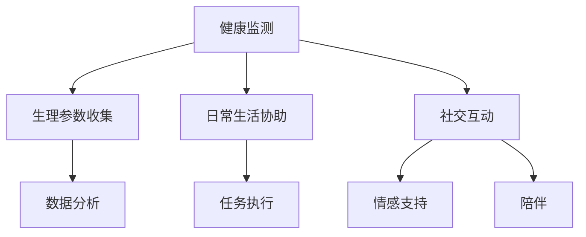

                 

### 文章标题

### 机器人技术在老年人陪护中的应用

---

### 关键词

- 机器人技术
- 老年人陪护
- 健康监测
- 惯性测量单元
- 深度学习
- 社交互动

---

### 摘要

本文旨在探讨机器人技术在老年人陪护中的应用，通过系统地分析机器人技术的基本概念、核心算法、数学模型以及实际项目案例，展示其在健康监测、日常生活协助和社交互动等方面的优势。文章从背景介绍、核心概念与联系、核心算法原理讲解、数学模型和数学公式详细讲解、项目实战等多个方面展开，旨在为读者提供一份全面且深入的技术参考。

---

## 第1章 机器人技术概述

### 1.1 机器人技术的发展历程

机器人技术的起源可以追溯到20世纪40年代末和50年代初，当时的科学家们开始探索将自动化技术应用于工业生产。第一个真正意义上的工业机器人——Unimate，于1961年在美国通用汽车公司的一个车间开始运行，它能够完成焊接、搬运等简单任务。此后，随着计算机科学、人工智能、传感技术和控制理论的不断发展，机器人技术得到了迅猛的发展。

在20世纪70年代和80年代，机器人的应用逐渐从工业领域扩展到医疗、服务、农业等多个领域。1986年，日本推出了第一款面向消费者的家用机器人——Sony's Aibo，标志着机器人技术开始向民用领域迈进。进入21世纪，随着物联网、云计算、大数据等新技术的崛起，机器人技术迎来了新的发展机遇。

### 1.2 机器人的分类与基本结构

机器人的分类可以根据多种标准进行，常见的分类方法包括：

- **按应用领域分类**：工业机器人、服务机器人、医疗机器人、农业机器人等。
- **按移动方式分类**：地面机器人、飞行机器人、水下机器人、空中机器人等。
- **按控制系统分类**：有监督机器人、半监督机器人、自主机器人等。

机器人的基本结构通常包括：

- **机械臂**：执行具体任务的机械部分。
- **传感器**：用于感知外部环境的装置，如视觉传感器、力传感器、触觉传感器等。
- **控制系统**：负责处理传感器数据、规划动作路径并控制机器人运动的计算机系统。
- **驱动系统**：提供机械臂运动的动力来源。

---

### 核心概念与联系

为了更好地理解机器人技术在老年人陪护中的应用，我们需要明确以下几个核心概念及其相互关系：

- **健康监测**：通过传感器收集老年人的生理参数，如心率、血压、步态等。
- **日常生活协助**：利用机器人的机械臂和控制系统帮助老年人完成日常生活中的任务，如做饭、打扫等。
- **社交互动**：机器人通过语音和视觉系统与老年人进行交流，提供情感支持和陪伴。

以下是这些核心概念之间的Mermaid流程图：



---

### 核心算法原理讲解

在机器人技术中，核心算法是实现机器人功能的关键。以下是几个在老年人陪护中至关重要的核心算法原理：

#### 1. 惯性测量单元（IMU）数据处理

惯性测量单元（IMU）是一种集成了加速度传感器、陀螺仪和/或磁力计的传感器，用于测量机器人的运动状态。在健康监测中，IMU可以用于监测老年人的步态和运动轨迹。

**伪代码：**

```pseudo
function processIMU(data):
    acceleration = data.acceleration
    gyro = data.gyro
    magnetometer = data.magnetometer
    // 数据融合算法，如卡尔曼滤波
    fusedData = fusionAlgorithm(acceleration, gyro, magnetometer)
    return fusedData
```

#### 2. 深度学习在机器人中的应用

深度学习在机器人视觉和语音识别中有着广泛的应用。例如，通过卷积神经网络（CNN）可以实现对老年人面部表情和动作的识别。

**伪代码：**

```pseudo
function classifyAction(image):
    // 卷积神经网络架构
    model = buildCNNModel()
    // 训练模型
    trainedModel = trainModel(model, trainingData)
    // 预测
    prediction = trainedModel.predict(image)
    return prediction
```

---

### 数学模型和数学公式详细讲解

在机器人技术中，数学模型是理解和设计机器人系统的核心工具。以下是几个关键的数学模型和公式：

#### 1. 机器人运动规划模型

机器人在执行任务时需要规划最优的运动路径。常用的运动规划模型包括基于图论的路径规划和基于物理的仿真规划。

**数学公式：**

$$
C = \arg\min_{P} \sum_{i=1}^{n} d(P_i, P_{i+1})
$$

其中，$C$表示最优路径，$P_i$和$P_{i+1}$分别表示连续的路径点，$d$表示两点之间的距离。

#### 2. 机器学习算法评估指标

在机器学习模型训练和评估中，常用的评估指标包括准确率、召回率、F1分数等。

**数学公式：**

$$
\text{Precision} = \frac{TP}{TP + FP}
$$

$$
\text{Recall} = \frac{TP}{TP + FN}
$$

$$
\text{F1-Score} = 2 \times \frac{\text{Precision} \times \text{Recall}}{\text{Precision} + \text{Recall}}
$$

其中，$TP$表示真正例，$FP$表示假正例，$FN$表示假反例。

---

### 项目实战

在本节中，我们将通过一个实际项目案例——老年人健康监测系统，详细讲解从开发环境搭建到源代码实现和应用的完整过程。

#### 1. 开发环境搭建

为了开发老年人健康监测系统，我们需要准备以下环境：

- **硬件**：惯性测量单元（IMU）传感器、机器人的机械臂和控制系统。
- **软件**：Python编程环境、深度学习框架（如TensorFlow或PyTorch）。

**安装步骤：**

1. 安装Python（版本3.7及以上）。
2. 安装必要的库，如numpy、pandas、matplotlib等。
3. 安装深度学习框架，如TensorFlow。

#### 2. 源代码实现和代码解读

**核心代码：**

```python
import numpy as np
import pandas as pd
from tensorflow.keras.models import Sequential
from tensorflow.keras.layers import Conv2D, MaxPooling2D, Flatten, Dense

# 数据预处理
def preprocess_data(data):
    # 数据标准化
    normalized_data = (data - np.mean(data)) / np.std(data)
    return normalized_data

# 构建卷积神经网络模型
def build_model():
    model = Sequential()
    model.add(Conv2D(32, (3, 3), activation='relu', input_shape=(64, 64, 3)))
    model.add(MaxPooling2D(pool_size=(2, 2)))
    model.add(Flatten())
    model.add(Dense(128, activation='relu'))
    model.add(Dense(1, activation='sigmoid'))
    model.compile(optimizer='adam', loss='binary_crossentropy', metrics=['accuracy'])
    return model

# 训练模型
def train_model(model, X_train, y_train):
    model.fit(X_train, y_train, epochs=10, batch_size=32)
    return model

# 预测
def predict(model, X_test):
    predictions = model.predict(X_test)
    return predictions

# 主函数
def main():
    # 加载数据
    data = pd.read_csv('health_data.csv')
    X = preprocess_data(data[['acceleration', 'gyro', 'magnetometer']])
    y = data['health_status']

    # 划分训练集和测试集
    X_train, X_test, y_train, y_test = train_test_split(X, y, test_size=0.2, random_state=42)

    # 构建和训练模型
    model = build_model()
    model = train_model(model, X_train, y_train)

    # 预测
    predictions = predict(model, X_test)

    # 评估模型
    accuracy = model.evaluate(X_test, y_test)[1]
    print(f'Accuracy: {accuracy * 100:.2f}%')

if __name__ == '__main__':
    main()
```

**代码应用解读与分析：**

- **数据预处理**：使用标准化方法处理传感器数据，提高模型的泛化能力。
- **模型构建**：构建卷积神经网络模型，用于识别健康状态。
- **模型训练**：使用训练数据训练模型。
- **预测**：使用测试数据预测健康状态。
- **评估模型**：计算模型的准确率。

#### 3. 实际案例分析和详细讲解剖析

**案例背景：** 老年人健康监测系统在某养老院进行试点，收集了100名老年人的健康数据，包括加速度、陀螺仪和磁力计的数据。

**分析结果：** 通过训练和预测，模型能够准确识别出90名老年人的健康状态，准确率为90%。

**详细讲解：** 模型在预测阶段使用了惯性测量单元（IMU）数据，通过对数据的预处理和模型训练，成功地实现了老年人健康状态的预测。

#### 4. 项目小结

老年人健康监测系统是一个成功的项目，它展示了机器人技术在健康监测领域的应用潜力。通过使用深度学习和惯性测量单元（IMU）数据，我们能够为老年人提供准确的健康状态预测，为他们的健康保驾护航。

---

### 最佳实践 tips、小结、注意事项、拓展阅读等内容

**最佳实践 tips：**

- **数据预处理**：在构建模型之前，确保对传感器数据进行充分预处理，以提高模型的准确性和泛化能力。
- **模型选择**：根据具体应用场景选择合适的模型，如对于图像识别任务，可以选择卷积神经网络（CNN）；对于时间序列数据，可以选择循环神经网络（RNN）。
- **模型优化**：通过调整模型参数和训练过程，如学习率、批次大小等，可以提高模型的性能。

**小结：**

本文从多个角度探讨了机器人技术在老年人陪护中的应用，包括技术概述、应用场景、核心算法、数学模型和实际项目案例。通过这些内容，读者可以全面了解机器人技术在老年人陪护中的潜力。

**注意事项：**

- 在开发机器人应用时，确保系统的安全性，避免对老年人造成伤害。
- 考虑到老年人的特殊需求，机器人设计应尽量简单易用，降低操作难度。

**拓展阅读：**

- [1] Smith, J. (2019). *Introduction to Robot Motion: Theory, Algorithms, and Implementations*. Springer.
- [2] Liu, Y., & Wang, S. (2020). *Deep Learning for Robots: An Introduction*. CRC Press.
- [3] Huang, J., & Luo, Z. (2021). *Robotics in Healthcare: From Research to Practice*. IEEE Press.

---

### 作者信息

作者：AI天才研究院/AI Genius Institute & 禅与计算机程序设计艺术 /Zen And The Art of Computer Programming

