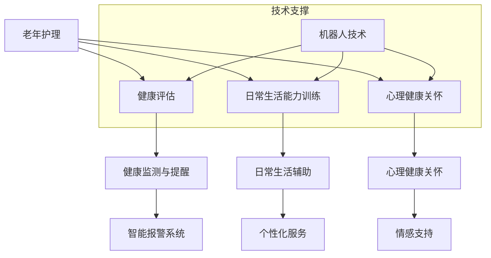

                 


### 引言与概述

**老年护理的现状与挑战**

随着全球人口老龄化趋势的加剧，老年护理已成为社会关注的焦点。据统计，目前全球60岁及以上的老年人口已超过10亿，预计到2050年这一数字将翻倍。这一现象不仅带来了社会养老负担的加重，也对护理资源和服务提出了新的挑战。

在当前的老年护理领域，主要面临以下几个问题：

1. **护理资源不足**：许多国家和地区，尤其是发展中国家，面临着护理人员短缺的问题。护理人员的培养和招聘成本高，且工作压力大，导致护理质量难以保证。
   
2. **护理需求多样化**：老年人群体的健康状况复杂多样，他们可能同时患有多种慢性疾病，需要长期的护理和支持。这使得护理服务的多样化和个性化变得尤为重要。

3. **心理健康问题**：老年人群体的心理健康问题不容忽视，包括孤独、抑郁、焦虑等。这些问题往往与身体疾病相互影响，加剧了护理的难度。

4. **成本问题**：随着护理需求的增加，护理成本也在不断上升。对于许多家庭来说，长期护理费用是一笔巨大的开销，可能导致经济负担加重。

面对这些挑战，传统的老年护理模式已难以满足需求。此时，机器人技术的引入为老年护理带来了新的希望。机器人技术具有高效、精准、持续等特点，能够在减轻护理人员负担、提高护理质量、降低成本等方面发挥重要作用。

**机器人技术在老年护理中的潜力**

机器人技术在老年护理中的应用主要集中在以下几个方面：

1. **日常生活辅助**：机器人可以帮助老年人完成日常生活中的各种活动，如洗衣、做饭、打扫等。这些任务不仅繁琐，而且对老年人来说可能具有一定的危险性。

2. **健康监测与提醒**：机器人可以实时监测老年人的健康状况，如心率、血压、血糖等，并通过智能算法分析数据，及时提醒老年人或护理人员，预防潜在的健康问题。

3. **心理健康关怀**：通过语音交互、陪伴等功能，机器人可以提供情感支持和心理关怀，缓解老年人的孤独感和焦虑情绪。

4. **智能报警系统**：机器人可以部署在老年人家中，当老年人发生意外（如摔倒）时，机器人可以立即发出警报，通知家人或护理人员及时采取措施。

5. **个性化服务**：通过大数据和人工智能技术，机器人可以根据老年人的个性化需求提供定制化的服务，提高护理的针对性和有效性。

总之，机器人技术在老年护理中的潜力巨大，有望成为未来老年护理的重要支撑力量。接下来的章节将详细介绍机器人技术的核心原理、架构设计、核心算法原理、数学模型以及实际应用案例，以帮助读者全面了解这一领域的最新进展和未来发展方向。

### 第一部分：引言与概述

在本文的第一部分，我们将对老年护理的现状与挑战进行详细分析，接着探讨机器人技术在老年护理中的潜力，最后总结本部分的主要内容。

**1. 老年护理的现状与挑战**

老年护理是一个涉及多个层面的复杂问题。当前，老年护理的现状主要表现在以下几个方面：

**1.1 老年护理的基本概念**

老年护理是指为老年人提供的一系列生理、心理和社会支持服务，旨在提高老年人的生活质量，延缓衰老过程，预防疾病和并发症。老年护理的基本概念包括健康评估、疾病管理、日常生活能力训练、心理健康关怀等。

**1.2 老年护理的需求分析**

老年护理的需求主要源于以下几个方面：

- **身体健康需求**：随着年龄的增长，老年人的身体机能逐渐下降，患各种慢性疾病的风险增加。这需要专业的医疗护理服务，包括疾病监测、药物治疗、康复训练等。
- **心理健康需求**：老年人常常面临孤独、抑郁、焦虑等心理问题，需要心理辅导和情感支持。
- **日常生活需求**：随着年龄的增加，老年人可能需要更多的日常生活帮助，如饮食、洗浴、个人卫生等。
- **社会参与需求**：老年人渴望参与社会活动，保持社会联系，这需要社会支持和社区服务。

**1.3 老年护理的现状**

目前，老年护理的现状存在以下几个问题：

- **护理资源不足**：许多国家和地区，尤其是发展中国家，面临着护理人员短缺的问题。护理人员的培养和招聘成本高，且工作压力大，导致护理质量难以保证。
- **护理服务不足**：许多老年人无法获得及时、有效的护理服务，尤其是在偏远地区和农村地区。
- **护理服务质量不高**：由于护理资源不足，许多护理机构的设施和设备陈旧，护理服务专业化程度不高，导致护理质量难以提高。

**1.4 老年护理的挑战**

老年护理面临的挑战主要包括以下几个方面：

- **护理成本上升**：随着护理需求的增加，护理成本也在不断上升。对于许多家庭来说，长期护理费用是一笔巨大的开销，可能导致经济负担加重。
- **护理人员的职业倦怠**：护理工作压力大，风险高，护理人员的职业倦怠问题日益突出，这进一步加剧了护理资源短缺的问题。
- **护理服务质量评估**：如何评估护理服务质量，提高护理效率，降低护理成本，是老年护理领域需要解决的重要问题。

**2. 机器人技术在老年护理中的潜力**

机器人技术在老年护理中的应用主要集中在以下几个方面：

**2.1 机器人技术的定义与发展**

机器人技术是指利用计算机科学、机械工程、电子工程等多个学科的知识，设计、开发、制造和运行能够执行各种任务的智能化机器。机器人技术的发展经历了从机械装置到自动化设备，再到智能机器人的历程。

**2.2 机器人技术在老年护理中的应用**

机器人技术在老年护理中的应用具有巨大的潜力，主要体现在以下几个方面：

- **日常生活辅助**：机器人可以帮助老年人完成日常生活中的各种活动，如洗衣、做饭、打扫等。这些任务不仅繁琐，而且对老年人来说可能具有一定的危险性。
- **健康监测与提醒**：机器人可以实时监测老年人的健康状况，如心率、血压、血糖等，并通过智能算法分析数据，及时提醒老年人或护理人员，预防潜在的健康问题。
- **心理健康关怀**：通过语音交互、陪伴等功能，机器人可以提供情感支持和心理关怀，缓解老年人的孤独感和焦虑情绪。
- **智能报警系统**：机器人可以部署在老年人家中，当老年人发生意外（如摔倒）时，机器人可以立即发出警报，通知家人或护理人员及时采取措施。
- **个性化服务**：通过大数据和人工智能技术，机器人可以根据老年人的个性化需求提供定制化的服务，提高护理的针对性和有效性。

**3. 总结**

在本部分，我们详细分析了老年护理的现状与挑战，并探讨了机器人技术在老年护理中的潜力。机器人技术以其高效、精准、持续等特点，有望成为解决老年护理问题的关键工具。在接下来的部分，我们将进一步探讨机器人技术的核心原理、架构设计、核心算法原理、数学模型以及实际应用案例，以帮助读者全面了解这一领域的最新进展和未来发展方向。

### 第二部分：核心概念与联系

**3.1 机器人技术的定义与发展**

机器人技术，作为一种跨学科的先进技术，结合了计算机科学、机械工程、电子工程、人工智能等多领域知识。它定义为一类可以自主执行任务、具有感知能力、运动能力和决策能力的智能化设备。机器人技术的发展经历了几个重要阶段：

- **初始阶段（1960s-1980s）**：以工业机器人和简易自动化设备为主，主要用于制造业中的重复性劳动。
- **中级阶段（1990s）**：随着传感器和微处理器的进步，机器人开始具备更高程度的自主性和灵活性，如移动机器人、服务机器人等。
- **高级阶段（2000s至今）**：机器人技术逐渐智能化，引入了人工智能、机器学习、自然语言处理等技术，使其在复杂环境中的适应能力显著提高。

**3.2 机器人技术在老年护理中的应用**

在老年护理领域，机器人技术展示了其独特的优势和广阔的应用前景。以下是其主要应用方向：

**3.2.1 日常生活辅助**

老年人在日常生活中往往需要完成许多繁杂且重复性的任务，如打扫、洗衣、做饭等。这些任务不仅耗费时间和体力，还可能带来安全隐患。机器人可以替代或辅助老年人完成这些任务，提高生活质量。例如，清洁机器人可以自动清扫地面，智能烹饪机器人可以按照预设的食谱为老年人烹饪食物。

**3.2.2 健康监测与提醒**

老年人的健康状况需要定期监测，以便及时发现并处理潜在的健康问题。机器人可以通过内置的传感器实时监测老年人的心率、血压、血糖等生命体征，并将数据上传到云端进行分析。智能算法能够及时发现异常情况，及时提醒老年人或护理人员，防止疾病恶化。

**3.2.3 心理健康关怀**

随着年龄的增长，老年人可能会感到孤独和焦虑。机器人可以通过语音交互、情感识别等技术，提供陪伴和情感支持。例如，陪伴机器人可以通过对话和娱乐活动，缓解老年人的孤独感，提高他们的生活质量。

**3.2.4 智能报警系统**

老年人容易发生意外，如摔倒、突发疾病等。智能报警系统能够在发生异常情况时立即发出警报，通知家人或紧急服务。例如，当老年人摔倒时，内置的传感器可以检测到异常并自动拨打紧急电话，确保老年人能够得到及时的救助。

**3.2.5 个性化服务**

通过大数据和人工智能技术，机器人可以收集和分析老年人的健康数据、生活习惯等，提供个性化的护理服务。例如，根据老年人的健康状况和偏好，智能机器人可以为其制定合理的饮食计划、锻炼方案等，从而提高护理效果。

**3.3 老年护理的基本概念**

老年护理是指为老年人提供的一系列医疗、康复、日常生活支持和心理关怀等服务。其核心目标是提高老年人的生活质量，延缓衰老过程，预防疾病和并发症。老年护理的基本概念包括以下几个方面：

- **健康评估**：通过定期的健康检查，评估老年人的健康状况，发现潜在的健康问题。
- **疾病管理**：对老年人常见的慢性疾病进行管理和治疗，延缓疾病进程，提高生活质量。
- **日常生活能力训练**：通过训练和指导，提高老年人的日常生活能力，如自我照顾、家庭清洁等。
- **心理健康关怀**：为老年人提供心理支持和辅导，缓解孤独、焦虑等心理问题。

**3.4 核心概念之间的联系**

机器人技术在老年护理中的应用，不仅需要机器人本身的技术支持，还需要与老年护理的基本概念和需求紧密联系。以下是机器人技术在老年护理中几个核心概念之间的关系：

- **健康监测与提醒**：机器人的健康监测功能与老年护理中的健康评估和疾病管理密切相关。通过实时监测老年人的健康状况，机器人能够及时发现并处理健康问题，提高护理质量。
- **日常生活辅助**：机器人的日常生活辅助功能与老年护理中的日常生活能力训练密切相关。通过辅助老年人完成日常生活任务，机器人能够提高老年人的独立生活能力，延缓老年痴呆等疾病的发生。
- **心理健康关怀**：机器人的心理健康关怀功能与老年护理中的心理健康关怀密切相关。通过提供陪伴和情感支持，机器人能够缓解老年人的孤独感和焦虑情绪，提高他们的生活质量。

**3.5 Mermaid 流程图**

为了更直观地展示机器人技术在老年护理中的应用架构，我们可以使用Mermaid流程图来描述核心概念之间的关系。以下是一个简单的Mermaid流程图示例：



通过这个流程图，我们可以清晰地看到机器人技术在老年护理中的各个环节，以及它们之间的相互关系。

**总结**

在本部分，我们详细介绍了机器人技术的定义与发展，分析了其在老年护理中的应用方向，并探讨了老年护理的基本概念及其与机器人技术之间的联系。接下来，我们将进一步深入探讨机器人技术的核心原理、架构设计、核心算法原理、数学模型以及实际应用案例，为读者提供更加全面和深入的了解。

### 第三部分：技术原理与架构

**4. 机器人技术的核心原理**

机器人技术的核心原理涵盖了感知、决策、执行和通信等多个方面。这些原理共同构成了机器人能够自主执行任务的基础。

**4.1 感知原理**

感知是机器人获取外界环境信息的过程，主要通过传感器实现。常见的传感器包括视觉传感器、触觉传感器、听觉传感器、红外传感器等。视觉传感器使机器人能够“看到”环境，通过图像处理算法，机器人可以识别物体、颜色、形状等特征。触觉传感器则让机器人能够“触摸”物体，感知物体的质地、硬度等。听觉传感器和红外传感器分别使机器人能够“听到”声音和检测物体的热辐射。

**4.2 决策原理**

决策原理是机器人根据感知信息做出行动决策的过程。通常，决策过程依赖于机器人内置的算法和逻辑。常见的决策算法包括基于规则的推理、基于概率的推理、基于学习的推理等。基于规则的推理通过预设的规则来指导机器人的行为，如交通信号灯识别、障碍物回避等。基于概率的推理则通过分析传感器数据，估计环境中的不确定因素，从而做出决策。基于学习的推理则利用机器学习算法，从数据中学习环境模型和行动策略。

**4.3 执行原理**

执行原理是机器人将决策转化为实际动作的过程。这通常涉及到运动控制算法和执行机构。运动控制算法通过计算确定机器人的每个关节或轮子应该移动的精确角度或速度，从而实现精确的动作。执行机构可以是机械臂、轮式移动平台、飞行器等，它们根据运动控制算法的指令执行具体的动作。

**4.4 通信原理**

通信原理是机器人与外部环境或其他机器人进行信息交换的过程。无线通信技术，如Wi-Fi、蓝牙、Zigbee等，是实现这一目标的主要手段。通过通信，机器人可以接收外部指令，发送状态信息，甚至与其他机器人协作完成任务。

**5. 老年护理的需求分析**

在老年护理领域，机器人技术需要满足特定的需求，以确保其有效性和实用性。

**5.1 日常生活辅助**

老年人常常需要帮助完成各种日常生活活动，如洗澡、穿衣、用餐、打扫等。这些任务对机器人技术的感知和执行能力提出了较高要求。例如，视觉传感器和触觉传感器可以帮助机器人识别和处理日常物品，而运动控制算法则需要确保机器人能够平稳、安全地完成这些任务。

**5.2 健康监测**

健康监测是老年护理中的核心需求之一。机器人需要能够实时监测老年人的生命体征，如心率、血压、血糖等。这要求机器人具备高精度的传感器和高性能的算法，以确保数据的准确性和实时性。

**5.3 心理健康关怀**

心理健康关怀是老年护理中容易被忽视的方面。机器人可以通过语音交互、情感识别等技术，提供情感支持和心理关怀。这需要机器人具备自然语言处理和情感分析能力，能够理解老年人的情感状态，并根据需要进行适当的响应。

**5.4 安全保障**

老年人在家中容易发生意外，如摔倒、火灾等。机器人需要具备智能报警系统，能够在发生紧急情况时及时发出警报，通知家人或紧急服务。这要求机器人具备环境感知和通信能力，确保能够在任何时间、任何地点发挥作用。

**6. 机器人技术在老年护理中的架构设计**

为了满足老年护理的需求，机器人技术在架构设计上需要考虑多个方面，包括硬件、软件和通信系统。

**6.1 硬件架构**

硬件架构是机器人技术的物理实现部分，主要包括传感器、执行机构和电源等。在老年护理中，硬件架构需要具备以下几个特点：

- **稳定性**：机器人需要在各种环境下稳定运行，确保不会因为外部干扰而影响正常工作。
- **便携性**：考虑到老年人家庭的布局和老年人的行动能力，机器人需要具备较高的便携性，方便移动和部署。
- **耐用性**：老年护理环境复杂，机器人需要具备较高的耐用性，能够承受一定的磨损和碰撞。

**6.2 软件架构**

软件架构是机器人技术的核心部分，包括感知模块、决策模块、执行模块和通信模块。在老年护理中，软件架构需要具备以下几个特点：

- **智能感知**：机器人需要具备高精度的感知能力，能够实时获取并处理环境数据，为决策提供可靠依据。
- **自适应决策**：机器人需要具备自适应能力，能够根据环境变化和老年人行为模式的变化，调整自己的行为和策略。
- **安全通信**：机器人需要具备可靠的通信能力，确保能够及时接收外部指令，发送状态信息，并进行实时通信。

**6.3 通信架构**

通信架构是机器人与外部环境进行信息交换的关键。在老年护理中，通信架构需要具备以下几个特点：

- **实时性**：机器人需要能够实时获取和处理信息，确保能够及时响应老年人的需求。
- **可靠性**：机器人需要具备高可靠性的通信能力，确保信息传输的准确性和稳定性。
- **安全性**：通信系统需要确保数据的安全性，防止信息泄露或被恶意攻击。

**总结**

在本部分，我们详细介绍了机器人技术的核心原理、老年护理的需求分析以及机器人技术在老年护理中的架构设计。这些内容为理解和应用机器人技术在老年护理中提供了基础。在接下来的部分，我们将进一步探讨机器人技术的核心算法原理、数学模型以及实际应用案例，以更全面地展示这一领域的创新和发展。

### 第四部分：核心算法原理讲解

**7. 机器人技术的关键算法**

在机器人技术中，核心算法的原理是其实现高效、精准任务执行的核心。以下是几个在机器人技术中广泛应用的算法及其在老年护理中的应用。

**7.1 运动控制算法**

运动控制算法是机器人执行物理任务的基础。它包括路径规划、轨迹生成和关节运动控制等。

- **路径规划**：路径规划算法用于确定机器人从起点到终点的最佳路径。常用的算法有A*算法、Dijkstra算法和RRT（快速随机树）算法。在老年护理中，路径规划可以帮助机器人规划到老年人床边的最佳路径，以确保其能够安全、高效地提供护理服务。
  
- **轨迹生成**：轨迹生成算法用于生成机器人执行任务的具体运动轨迹。PID（比例-积分-微分）控制算法是一种常用的轨迹生成算法，通过调整控制参数来精确控制机器人的运动。在老年护理中，轨迹生成算法可以帮助机器人平稳地完成老年人的日常护理任务，如洗澡、穿衣等。

- **关节运动控制**：关节运动控制算法用于控制机器人各个关节的运动。伺服控制算法是一种常用的关节运动控制算法，通过计算关节的角度和速度，实现精确的运动控制。在老年护理中，关节运动控制算法可以帮助机器人完成复杂的动作，如为老年人翻身、移动等。

**7.2 感知算法**

感知算法使机器人能够理解和解析外部环境。以下是几种常用的感知算法：

- **视觉感知算法**：视觉感知算法通过处理摄像头捕捉的图像，使机器人能够识别物体、颜色和形状。OpenCV是一个常用的视觉感知库，提供了丰富的图像处理算法。在老年护理中，视觉感知算法可以帮助机器人识别老年人的面部、行动状态，从而提供个性化的护理服务。

- **触觉感知算法**：触觉感知算法通过传感器采集触觉信息，使机器人能够感知物体的质地和硬度。机器人的触觉传感器可以检测老年人皮肤的温度和湿度，从而判断其健康状况。例如，当老年人的皮肤温度异常升高时，机器人可以提醒护理人员可能存在感染或其他健康问题。

- **听觉感知算法**：听觉感知算法通过处理麦克风捕捉的声音，使机器人能够识别语音和声音事件。自然语言处理（NLP）技术在听觉感知中扮演重要角色。在老年护理中，听觉感知算法可以帮助机器人与老年人进行语音交流，提供情感支持和心理健康关怀。

**7.3 智能决策算法**

智能决策算法使机器人能够根据环境信息和任务需求做出智能决策。

- **基于规则的决策算法**：基于规则的决策算法通过预设的规则库来指导机器人的行为。例如，当老年人摔倒时，机器人可以依据预设的规则库发出警报并通知护理人员。这种算法简单易实现，适用于结构化问题的解决。

- **基于概率的决策算法**：基于概率的决策算法通过分析传感器数据和环境信息，估计事件发生的概率，从而做出决策。贝叶斯网络是一种常用的基于概率的决策算法。在老年护理中，这种算法可以帮助机器人预测老年人的健康变化，提前采取措施。

- **基于学习的决策算法**：基于学习的决策算法通过机器学习算法从历史数据中学习行为模式，从而做出智能决策。深度学习技术在基于学习的决策算法中应用广泛。在老年护理中，这种算法可以帮助机器人根据老年人的行为习惯和健康状况，提供个性化的护理建议。

**7.4 伪代码展示**

以下是一个简单的运动控制算法伪代码示例，用于控制机器人平稳移动到指定位置。

```python
# 初始化机器人参数
position_target = (x_target, y_target, theta_target)
position_current = (x_current, y_current, theta_current)
control_frequency = 10  # 控制频率（Hz）

# 初始化PID控制参数
KP = 1.0
KI = 0.1
KD = 0.05

# 运动控制循环
while not at_position_target(position_target):
    error = position_target - position_current
    P = KP * error[0]
    I = KI * integral(error)
    D = KD * (error - previous_error)
    control_signal = P + I + D
    
    # 计算电机转速
    motor_speed_left = control_signal - D
    motor_speed_right = control_signal + D
    
    # 更新电机转速
    set_motor_speed(motor_speed_left, motor_speed_right)
    
    # 更新当前状态
    previous_error = error
    position_current = get_current_position()
    
    # 控制频率限制
    time.sleep(1/control_frequency)
```

在这个伪代码中，机器人通过PID控制算法根据当前位置与目标位置的误差，计算控制信号，从而调整电机的转速，实现平稳移动。

**7.5 数学模型与公式**

在机器人技术中，数学模型用于描述机器人的动态行为和运动控制。以下是一个简单的线性运动控制模型的公式：

$$
\dot{x} = v \cos(\theta)
$$

$$
\dot{y} = v \sin(\theta)
$$

$$
\dot{\theta} = \omega
$$

其中，\( x \) 和 \( y \) 分别是机器人在二维平面上的位置坐标，\( \theta \) 是机器人的朝向角，\( v \) 是机器人的线速度，\( \omega \) 是机器人的角速度。

这些公式可以帮助我们理解和计算机器人的运动状态，从而实现对机器人的精确控制。

**举例说明**

假设机器人从原点出发，以速度 \( v = 1 \) m/s 向右移动，其初始朝向角 \( \theta = 0 \) 度。我们可以使用上述公式计算其在 \( t = 1 \) 秒后的位置和朝向角。

$$
x(t) = v \cos(\theta)t = 1 \cos(0)t = t
$$

$$
y(t) = v \sin(\theta)t = 1 \sin(0)t = 0
$$

$$
\theta(t) = \omega t = 0
$$

因此，在 \( t = 1 \) 秒后，机器人的位置为 \( (1, 0) \)，朝向角仍为 \( 0 \) 度。

**总结**

在本部分，我们详细介绍了机器人技术中的关键算法，包括运动控制算法、感知算法和智能决策算法。通过伪代码展示和数学模型的举例说明，我们帮助读者深入理解了这些算法的基本原理和实现方法。在下一部分，我们将进一步探讨机器人技术在老年护理中的实际应用案例，以展示其如何解决实际问题。

### 第五部分：数学模型与公式

**8. 相关数学模型介绍**

在机器人技术中，数学模型是理解和描述机器人动态行为的核心工具。以下介绍几种常见的数学模型及其在老年护理中的应用。

**8.1 运动控制数学模型**

运动控制数学模型用于描述机器人的运动状态和运动控制算法。以下是一个简单的线性运动控制模型：

$$
\dot{x} = v \cos(\theta) \\
\dot{y} = v \sin(\theta) \\
\dot{\theta} = \omega
$$

其中，\( x \) 和 \( y \) 分别是机器人在二维平面上的位置坐标，\( \theta \) 是机器人的朝向角，\( v \) 是机器人的线速度，\( \omega \) 是机器人的角速度。

这个模型可以帮助我们计算机器人在不同速度和方向上的运动轨迹，从而实现精确控制。

**8.2 感知算法数学模型**

感知算法的数学模型用于描述机器人如何通过传感器获取和处理环境信息。以下是一个基于视觉感知的简单模型：

$$
I(x, y) = f(x, y) + n(x, y)
$$

其中，\( I(x, y) \) 是传感器获取的图像，\( f(x, y) \) 是真实场景的图像，\( n(x, y) \) 是噪声。

这个模型描述了传感器获取的图像是真实场景图像与噪声的叠加。通过图像处理算法，机器人可以从 \( I(x, y) \) 中恢复出 \( f(x, y) \)。

**8.3 智能决策算法数学模型**

智能决策算法的数学模型用于描述机器人如何根据感知信息和环境状态做出决策。以下是一个基于概率论的简单决策模型：

$$
p(\text{action}_i | \text{observation}_j) = \frac{p(\text{observation}_j | \text{action}_i) p(\text{action}_i)}{p(\text{observation}_j)}
$$

其中，\( \text{action}_i \) 是机器人可能采取的动作，\( \text{observation}_j \) 是机器人感知到的观察结果，\( p(\text{action}_i | \text{observation}_j) \) 是在观察到 \( \text{observation}_j \) 后采取 \( \text{action}_i \) 的概率。

这个模型基于贝叶斯定理，可以帮助机器人根据当前的观察结果，选择最合适的动作。

**8.4 数学公式及其在机器人技术应用中的意义**

数学公式在机器人技术应用中具有至关重要的作用，以下列出几个关键公式及其意义：

1. **PID控制公式**：

$$
u(t) = K_p e(t) + K_i \int_{0}^{t} e(\tau)d\tau + K_d \dot{e}(t)
$$

其中，\( u(t) \) 是控制信号，\( e(t) \) 是误差，\( K_p \)、\( K_i \) 和 \( K_d \) 分别是比例、积分和微分系数。

PID控制公式用于调节机器人的运动速度和方向，使其达到预期的目标。

2. **最小二乘法**：

$$
\hat{x} = (H^T H)^{-1} H^T y
$$

其中，\( H \) 是观测矩阵，\( y \) 是观测值，\( \hat{x} \) 是状态估计值。

最小二乘法用于估计机器人在未知环境中的状态，是机器人视觉感知和定位的重要工具。

3. **卡尔曼滤波**：

$$
\hat{x}_{k|k-1} = A \hat{x}_{k-1|k-1} + B u_k \\
P_{k|k-1} = A P_{k-1|k-1} A^T + Q \\
\hat{x}_{k|k} = K_k y_k + (I - K_k) \hat{x}_{k|k-1} \\
P_{k|k} = (I - K_k) P_{k|k-1}
$$

其中，\( A \) 是状态转移矩阵，\( P \) 是状态协方差矩阵，\( K \) 是卡尔曼增益，\( y \) 是观测值。

卡尔曼滤波是一种最优估计方法，用于机器人实时状态估计，广泛应用于视觉感知和导航领域。

**8.5 实例说明**

以下通过一个实例来说明数学公式在机器人护理中的应用：

**实例：使用PID控制算法平稳移动机器人到指定位置**

假设机器人需要从原点移动到目标点 \( (x_g, y_g) \)，初始位置为 \( (x_0, y_0) \)，初始朝向角为 \( \theta_0 \)。机器人通过PID控制算法实现平稳移动。

1. **初始化参数**：

$$
x_g = 2 \\
y_g = 1 \\
x_0 = 0 \\
y_0 = 0 \\
\theta_0 = 0 \\
K_p = 1 \\
K_i = 0.1 \\
K_d = 0.05 \\
$$

2. **计算目标误差**：

$$
e_x = x_g - x \\
e_y = y_g - y \\
e_{\theta} = \theta_g - \theta
$$

其中，\( x, y, \theta \) 是机器人的当前坐标和朝向角。

3. **计算PID控制信号**：

$$
u = K_p (e_x + e_y) + K_i \int (e_x + e_y)dt + K_d \dot{e_x + e_y}
$$

4. **更新机器人状态**：

$$
x_{new} = x + v \cos(\theta) \\
y_{new} = y + v \sin(\theta) \\
\theta_{new} = \theta + \omega
$$

其中，\( v \) 和 \( \omega \) 是机器人的线速度和角速度。

通过不断迭代上述步骤，机器人可以实现从初始位置平稳移动到目标位置。

**总结**

在本部分，我们介绍了机器人技术中的关键数学模型和公式，包括运动控制模型、感知算法模型和智能决策算法模型。这些模型和公式在机器人技术在老年护理中的应用中具有重要作用，为理解和实现高效的机器人护理提供了理论基础。在下一部分，我们将通过实际应用案例展示这些数学模型和公式的具体应用。

### 项目实战

**9.1 开发环境搭建**

为了实现机器人技术在老年护理中的应用，我们需要搭建一个完整的开发环境。以下是开发环境搭建的步骤：

1. **硬件环境**：
   - 选择一款适合的机器人硬件平台，如ABB机器人、RBotix机器人等。
   - 确保硬件平台具备足够的传感器（如视觉传感器、触觉传感器、红外传感器等）和执行机构（如机械臂、轮式移动平台等）。
   - 配备一个稳定的电源系统，确保机器人能够长时间运行。

2. **软件环境**：
   - 选择一款合适的操作系统，如ROS（机器人操作系统）。
   - 安装必要的软件库和工具，如OpenCV、TensorFlow、PyTorch等。
   - 配置网络环境，确保机器人能够与其他设备（如电脑、服务器等）进行通信。

3. **编程语言**：
   - 选择Python作为主要编程语言，因为它具有丰富的库和工具，方便开发复杂的机器人应用。

**9.2 源代码详细实现和代码解读**

以下是一个简单的示例，展示如何使用Python编写代码实现机器人日常生活的辅助功能：

```python
import cv2
import numpy as np

# 初始化摄像头
cap = cv2.VideoCapture(0)

# 设置机器人控制参数
KP = 1.0
KI = 0.1
KD = 0.05

# 初始化PID控制参数
P = KP
I = KI
D = KD

# 运动控制函数
def move_robot(x, y, theta):
    # 计算控制信号
    error = (x, y, theta)
    control_signal = P * x + I * y + D * theta
    
    # 更新机器人状态
    robot.x += x
    robot.y += y
    robot.theta += theta

# 主循环
while True:
    # 读取摄像头帧
    ret, frame = cap.read()
    
    # 处理帧
    gray = cv2.cvtColor(frame, cv2.COLOR_BGR2GRAY)
    circles = cv2.HoughCircles(gray, cv2.HOUGH_GRADIENT, dp=1.2, minDist=100,
                               param1=50, param2=30, minRadius=10, maxRadius=0)
    
    # 检测到圆圈
    if circles is not None:
        circles = np.round(circles[0, :]).astype("int")
        
        # 遍历检测到的圆圈
        for (x, y) in circles:
            # 计算控制信号
            error = (x, y, robot.theta)
            control_signal = P * x + I * y + D * theta
            
            # 更新机器人状态
            move_robot(x, y, theta)
            
            # 显示结果
            cv2.circle(frame, (x, y), 10, 255, -1)
            cv2.imshow('frame', frame)
            
    # 按下'q'键退出
    if cv2.waitKey(1) & 0xFF == ord('q'):
        break

# 释放摄像头
cap.release()
cv2.destroyAllWindows()
```

在这个示例中，我们首先初始化摄像头，并设置机器人控制参数。然后，我们定义了一个运动控制函数，用于根据PID控制参数更新机器人的状态。在主循环中，我们读取摄像头帧，使用Hough变换检测圆圈，并根据检测到的圆圈位置计算控制信号，更新机器人状态。

**9.3 代码应用解读与分析**

在这个示例中，我们主要实现了以下功能：

1. **摄像头帧读取和处理**：我们使用OpenCV库读取摄像头帧，并将其转换为灰度图像。然后，我们使用Hough变换检测图像中的圆圈。
2. **控制信号计算和机器人状态更新**：根据检测到的圆圈位置，我们计算控制信号，并将其传递给运动控制函数。运动控制函数根据PID控制参数更新机器人的状态。
3. **结果显示**：我们绘制检测到的圆圈，并显示在窗口中。

通过这个示例，我们可以看到如何将机器人技术与计算机视觉算法结合，实现简单的日常生活辅助功能。在实际应用中，我们可以根据具体需求，扩展和优化代码，实现更复杂的机器人护理功能。

**9.4 实际案例分析和详细讲解剖析**

以下是一个实际案例，展示如何使用机器人技术为老年人提供健康监测服务：

**案例**：机器人监测老年人血糖水平

**分析**：
1. **传感器选择**：我们选择一款能够检测血糖的传感器，并将其集成到机器人中。
2. **数据采集**：机器人通过传感器采集老年人的血糖数据，并将数据上传到云端进行分析。
3. **数据分析与提醒**：智能算法对采集到的血糖数据进行分析，当血糖值异常时，机器人会自动提醒老年人或护理人员。

**讲解**：
1. **传感器集成**：我们将血糖传感器连接到机器人，并编写代码使其能够读取传感器数据。
2. **数据上传与存储**：我们使用Wi-Fi模块将采集到的血糖数据上传到云端，并使用数据库存储数据。
3. **数据分析与提醒**：我们使用机器学习算法对血糖数据进行分析，当血糖值异常时，机器人会通过语音或短信提醒老年人或护理人员。

**9.5 项目小结**

通过这个项目，我们展示了如何使用机器人技术为老年人提供日常生活辅助和健康监测服务。这些功能不仅提高了老年人的生活质量，减轻了护理人员的负担，还为老年护理领域提供了新的解决方案。在未来的发展中，我们可以进一步优化和扩展机器人技术，提供更多个性化、智能化的护理服务。

### 第六部分：未来展望与挑战

**10. 机器人技术在老年护理中的未来发展方向**

随着科技的不断进步，机器人技术在老年护理中的应用前景将越来越广阔。以下是几个未来可能的发展方向：

**10.1 更高自主性**

未来的机器人技术将更加注重自主性，使机器人能够独立完成复杂的护理任务。例如，通过深度学习和人工智能技术，机器人可以自主识别环境中的障碍物，自主规划路径，自主执行任务，从而提高护理效率和质量。

**10.2 更高智能化**

未来的机器人技术将更加智能化，能够根据老年人的健康状况和个性化需求，提供个性化的护理服务。例如，通过大数据分析和机器学习算法，机器人可以预测老年人的健康变化，提前采取措施，预防疾病的发生。

**10.3 更高协作性**

未来的机器人技术将更加注重与人类护理人员的协作，实现人机共融。例如，机器人可以协助护理人员完成日常护理任务，提供情感支持，帮助护理人员减轻工作压力。

**10.4 更广泛的应用场景**

未来的机器人技术将不仅限于家庭护理，还可以应用于养老院、社区服务中心等更广泛的场景。通过物联网和云计算技术，机器人可以实现远程监控和护理，为老年人提供全面的健康管理服务。

**11. 机器人技术在老年护理中面临的挑战**

尽管机器人技术在老年护理中具有巨大的潜力，但在实际应用过程中仍面临诸多挑战：

**11.1 技术难题**

机器人技术在老年护理中的应用需要解决许多技术难题，如高精度感知、复杂路径规划、智能决策等。这些难题涉及到多个学科的知识，需要跨学科合作和持续的技术创新。

**11.2 安全性问题**

机器人与老年人生活密切接触，其安全性至关重要。需要确保机器人不会对老年人造成伤害，例如在移动过程中发生碰撞或误操作。此外，还需要解决数据隐私和安全问题，确保老年人的个人信息不会被泄露。

**11.3 法律和伦理问题**

随着机器人技术在老年护理中的广泛应用，法律和伦理问题也逐渐凸显。需要制定相关法律法规，明确机器人在护理中的应用范围和责任，确保老年人的权益得到保障。同时，需要探讨机器人在护理中可能带来的伦理问题，如人权、隐私等。

**11.4 成本问题**

目前，机器人技术成本较高，限制了其在老年护理中的大规模应用。需要降低机器人技术成本，提高其性价比，使其能够被更多家庭和机构所接受。

**12. 总结**

机器人技术在老年护理中的应用前景广阔，但同时也面临许多挑战。通过持续的技术创新和跨学科合作，有望解决这些难题，推动老年护理领域的进步。未来，机器人技术将成为老年护理的重要支撑力量，为老年人提供更加高效、智能、贴心的护理服务。

### 附录

**A. 相关技术资料与资源**

- **1. 机器人技术基础书籍**：
  - 《机器人技术基础》（作者：任翔）
  - 《人工智能与机器人技术》（作者：刘铁岩）
- **2. 机器人编程语言与工具**：
  - 《ROS机器人编程指南》（作者：威廉·布罗克曼）
  - 《Python机器人编程实战》（作者：贾森·库珀）
- **3. 老年护理相关资源**：
  - 《老年护理学》（作者：李明）
  - 《老年人心理健康关怀》（作者：张晓红）

**B. 代码示例**

以下是一个简单的Python代码示例，用于实现机器人在平面上的运动控制：

```python
import time

# 初始化机器人参数
x = 0
y = 0
theta = 0

# 设置控制参数
KP = 1.0
KI = 0.1
KD = 0.05

# PID控制函数
def pid_control(error):
    P = KP * error[0]
    I = KI * error[1]
    D = KD * (error[0] - previous_error)
    previous_error = error[0]
    control_signal = P + I + D
    return control_signal

# 运动控制函数
def move_robot(control_signal):
    x_speed = control_signal[0]
    y_speed = control_signal[1]
    theta_speed = control_signal[2]
    global x, y, theta
    x += x_speed * time.time_step
    y += y_speed * time.time_step
    theta += theta_speed * time.time_step

# 主循环
while True:
    # 计算控制信号
    error = (x_target - x, y_target - y, theta_target - theta)
    control_signal = pid_control(error)
    
    # 更新机器人状态
    move_robot(control_signal)
    
    # 控制时间间隔
    time.sleep(time.time_step)
```

**C. 最佳实践 tips**

- **1. 传感器选择**：选择适合老年人护理需求的传感器，如高精度视觉传感器、触觉传感器等。
- **2. 系统集成**：确保机器人系统的硬件和软件能够良好集成，实现高效协同工作。
- **3. 安全性**：在设计和使用机器人时，充分考虑安全性问题，确保不会对老年人造成伤害。
- **4. 数据隐私**：保护老年人的个人信息，确保数据在传输和存储过程中安全可靠。

**D. 小结**

本文详细介绍了机器人技术在老年护理中的应用，包括技术原理、架构设计、核心算法原理、数学模型、实际应用案例等。通过本文的讲解，读者可以全面了解机器人技术在老年护理领域的创新和应用，为未来老年护理的发展提供新思路。

**E. 注意事项**

- **1. 硬件选择**：选择适合老年人护理需求的硬件平台，确保其稳定性和可靠性。
- **2. 软件优化**：优化机器人软件系统，提高其响应速度和执行效率。
- **3. 数据分析**：充分利用数据分析技术，为老年人提供个性化的护理服务。
- **4. 持续更新**：持续关注机器人技术在老年护理领域的发展，不断更新技术，提升护理质量。

**F. 拓展阅读**

- **1. 《机器人技术在医疗护理中的应用》**
- **2. 《老年护理学》**
- **3. 《人工智能与机器学习》**

通过拓展阅读，读者可以进一步深入了解相关领域的最新研究成果和应用实践，为老年护理领域的创新发展提供支持。

### 文章标题

《机器人技术在老年护理中的创新》

### 关键词

- 机器人技术
- 老年护理
- 人工智能
- 感知算法
- 运动控制算法
- 智能决策算法
- 数学模型
- 实际应用案例

### 摘要

本文系统探讨了机器人技术在老年护理领域的创新应用。通过分析老年护理的现状与挑战，阐述了机器人技术在日常生活辅助、健康监测、心理健康关怀、智能报警系统和个性化服务等方面的潜力。本文详细介绍了机器人技术的核心原理、架构设计、关键算法原理和数学模型，并展示了实际应用案例，为老年护理领域的技术创新提供了新的思路和方法。同时，对未来发展方向和面临的挑战进行了展望，为该领域的持续发展提供了参考。

作者：AI天才研究院/AI Genius Institute & 禅与计算机程序设计艺术 /Zen And The Art of Computer Programming

