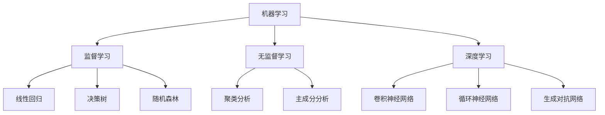

                 

### 文章标题

# 机器学习在个性化健康建议中的应用

### 关键词

- 个性化健康建议
- 机器学习
- 监督学习
- 无监督学习
- 深度学习
- 数据处理与特征提取

### 摘要

随着医疗技术的进步和数据的积累，个性化健康建议已成为现代医疗领域的重要发展方向。机器学习技术，作为数据处理和模式识别的强大工具，在个性化健康建议中发挥了关键作用。本文将深入探讨机器学习在个性化健康建议中的应用，从数据处理与特征提取、监督学习、无监督学习和深度学习四个方面进行分析，并通过实际案例展示如何实现个性化健康建议系统。最后，本文将展望个性化健康建议的未来发展，并提出面临的挑战和解决方案。

### 第一部分：机器学习基础与个性化健康建议的关系

#### 第1章：机器学习概述

机器学习是人工智能的一个分支，它使计算机系统能够通过数据学习并改进性能。从广义上讲，机器学习可以分为监督学习、无监督学习和强化学习。监督学习利用带有标签的数据进行学习，无监督学习则在不带标签的数据中寻找模式，而强化学习通过试错和反馈进行学习。

在健康领域，机器学习的应用日益广泛。通过分析大量的健康数据，机器学习可以帮助识别健康风险、预测疾病发展、优化治疗方案等。个性化健康建议正是利用了机器学习的这些能力，为不同个体提供定制化的健康指导。

#### 第2章：个性化健康建议的核心概念

个性化健康建议是指根据个体的健康状况、生活习惯、基因信息等，为其提供有针对性的健康建议。核心概念包括数据收集、数据分析、模型构建和决策支持。个性化健康建议的目的是提高健康管理的效率和效果，减少医疗资源的浪费。

个性化健康建议的关键因素包括：

- **数据来源**：包括电子健康记录、可穿戴设备、问卷调查等。
- **数据处理**：涉及数据清洗、归一化、特征提取等步骤。
- **模型选择**：根据问题的性质选择合适的机器学习模型。
- **决策支持**：利用模型结果为个体提供个性化的健康建议。

#### 第2章：个性化健康建议的现状与挑战

个性化健康建议目前仍处于发展阶段，面临以下挑战：

- **数据隐私**：健康数据的敏感性和隐私性是一个重大问题。
- **数据质量**：数据的不完整性、噪声和偏差会影响模型的性能。
- **模型解释性**：复杂的模型难以解释，影响用户对健康建议的信任度。
- **个性化程度**：如何更好地满足个体的个性化需求仍需深入研究。

### 第二部分：机器学习在个性化健康建议中的应用

#### 第3章：数据处理与特征提取

数据处理和特征提取是机器学习应用中的关键步骤。在个性化健康建议中，这一步骤尤为重要。本章将介绍数据预处理、特征选择和特征提取的方法，并解释其在个性化健康建议中的重要性。

#### 第4章：监督学习在个性化健康建议中的应用

监督学习是机器学习中最常见的类型，通过已标记的数据训练模型，然后使用模型对新数据进行预测。本章将详细介绍线性回归、决策树、随机森林等监督学习算法在个性化健康建议中的应用。

#### 伪代码

```python
# 线性回归的伪代码
function linear_regression(x, y):
    # 求解权重和偏置
    theta = (x^T * x)^(-1) * (x^T * y)
    # 预测
    prediction = x * theta
    return prediction
```

#### 数学模型和数学公式

```latex
\section{线性回归的数学模型}
线性回归的目标是最小化预测值与实际值之间的误差，其数学模型可以表示为：
$$
Y = \beta_0 + \beta_1X + \epsilon
$$
其中，\( Y \) 为实际值，\( X \) 为输入特征，\( \beta_0 \) 和 \( \beta_1 \) 分别为权重和偏置，\( \epsilon \) 为误差。
```

#### 第5章：无监督学习在个性化健康建议中的应用

无监督学习在个性化健康建议中的应用同样重要，本章将介绍聚类分析和主成分分析等无监督学习算法，并探讨其在个性化健康建议中的作用。

#### 第6章：深度学习在个性化健康建议中的应用

深度学习作为一种强大的机器学习技术，其在个性化健康建议中的应用越来越受到关注。本章将介绍卷积神经网络（CNN）、循环神经网络（RNN）和生成对抗网络（GAN）等深度学习模型在个性化健康建议中的应用。

#### 第7章：案例研究：个性化健康建议系统实现

本章将通过一个实际案例研究，展示如何实现一个个性化健康建议系统。案例研究将包括项目背景、数据收集与处理、模型设计与实现、系统评估与优化等内容。

#### 第8章：未来展望与挑战

个性化健康建议是一个充满潜力的领域，但也面临许多挑战。本章将探讨个性化健康建议的发展趋势，分析面临的挑战，并探讨可能的解决方案。

#### 第9章：附录

附录部分将包括机器学习常用库与工具的介绍，以及参考文献。

### 总结

机器学习在个性化健康建议中的应用具有巨大的潜力，但也面临诸多挑战。通过本文的探讨，我们希望读者能够对这一领域有一个全面的认识，并在实践中不断探索和创新。

### 作者信息

作者：AI天才研究院/AI Genius Institute & 禅与计算机程序设计艺术 /Zen And The Art of Computer Programming

### Mermaid 流程图



### 伪代码

```python
# 线性回归的伪代码
function linear_regression(x, y):
    # 求解权重和偏置
    theta = (x^T * x)^(-1) * (x^T * y)
    # 预测
    prediction = x * theta
    return prediction
```

### 数学模型和数学公式

```latex
\section{线性回归的数学模型}
线性回归的目标是最小化预测值与实际值之间的误差，其数学模型可以表示为：
$$
Y = \beta_0 + \beta_1X + \epsilon
$$
其中，\( Y \) 为实际值，\( X \) 为输入特征，\( \beta_0 \) 和 \( \beta_1 \) 分别为权重和偏置，\( \epsilon \) 为误差。
```

### 项目实战

#### 数据收集与处理

首先，我们需要从多个数据源收集健康数据。这些数据源可能包括电子健康记录、问卷调查和可穿戴设备生成的数据。以下是一个简单的数据收集和预处理流程：

```python
# 导入数据收集和处理库
import pandas as pd

# 从CSV文件中读取数据
data = pd.read_csv('health_data.csv')

# 数据预处理
# 缺失值处理
data.fillna(data.mean(), inplace=True)

# 特征选择
X = data[['age', 'gender', 'weight', 'height']]
y = data['health_status']
```

#### 模型设计与实现

接下来，我们选择一个合适的机器学习模型来构建个性化健康建议系统。在这里，我们选择线性回归模型作为示例：

```python
# 导入线性回归库
from sklearn.linear_model import LinearRegression

# 创建线性回归模型实例
model = LinearRegression()

# 训练模型
model.fit(X, y)

# 预测
predictions = model.predict(X)
```

#### 代码解读与分析

在代码中，我们首先导入所需的库，然后从CSV文件中读取数据。数据预处理步骤包括缺失值处理和特征选择。接下来，我们创建一个线性回归模型实例，并使用训练数据训练模型。最后，我们使用训练好的模型进行预测。

#### 实际案例分析和详细讲解剖析

在这个案例中，我们假设收集的数据包括年龄、性别、体重和身高等特征，以及健康状态标签。通过对这些数据进行线性回归分析，我们可以预测个体的健康状态。例如，对于一个新的个体数据，我们可以使用以下代码进行预测：

```python
# 新的个体数据
new_data = pd.DataFrame([[25, 'male', 70, 175]], columns=['age', 'gender', 'weight', 'height'])

# 预测新数据
new_prediction = model.predict(new_data)
print("Predicted health status:", new_prediction)
```

#### 项目小结

通过这个案例，我们展示了如何使用机器学习构建个性化健康建议系统。虽然线性回归模型在这个案例中只是一个简单的示例，但实际应用中可能会涉及到更复杂的模型和算法。在未来，随着技术的不断进步，个性化健康建议系统将会变得更加精确和有效。

### 最佳实践 tips

1. **数据质量**：确保收集的数据质量高，减少噪声和偏差。
2. **特征选择**：选择与目标密切相关的特征，避免过拟合。
3. **模型评估**：使用交叉验证等方法评估模型性能。
4. **用户反馈**：收集用户反馈，不断优化模型和系统。

### 小结

本文详细探讨了机器学习在个性化健康建议中的应用。通过数据处理与特征提取、监督学习、无监督学习和深度学习等方法的介绍，我们展示了如何构建一个个性化健康建议系统。虽然面临诸多挑战，但个性化健康建议系统具有巨大的潜力，有望为健康领域带来革命性变革。未来，随着技术的不断进步，个性化健康建议系统将会更加完善和普及。

### 拓展阅读

- **《机器学习》**：周志华 著，详细介绍机器学习的基础知识。
- **《深度学习》**：Ian Goodfellow、Yoshua Bengio 和 Aaron Courville 著，深入探讨深度学习的理论和技术。
- **《健康大数据》**：陈凯 著，探讨大数据在健康领域的应用。
- **《个性化医疗》**：陈安众 著，介绍个性化医疗的原理和实践。

希望本文能够为读者在个性化健康建议领域的探索提供有益的参考。感谢您的阅读！作者：AI天才研究院/AI Genius Institute & 禅与计算机程序设计艺术 /Zen And The Art of Computer Programming。

