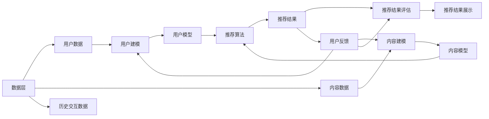

                 

### 第1章 引言

#### 1.1 本书主题与目的

在数字时代，个性化内容推荐系统已经成为提升用户体验、增加用户粘性的关键因素。无论是电子商务平台、社交媒体还是新闻网站，个性化推荐都能根据用户的行为和偏好，提供定制化的内容，从而提高用户满意度和参与度。本书的主题是探讨机器学习在个性化内容推荐中的应用，旨在通过详细的讲解和分析，帮助读者理解如何利用机器学习技术来构建高效的推荐系统。

本书的目的在于：

1. **介绍机器学习和个性化推荐的基础知识**：帮助读者理解机器学习的基本概念、算法和技术，以及个性化推荐的目标和技术路线。
2. **深入探讨推荐系统的架构和组件**：分析推荐系统的设计原则、关键组件以及数据模型。
3. **讲解机器学习算法在推荐中的应用**：详细解释协同过滤、基于内容的推荐以及混合推荐算法。
4. **展示用户行为分析的方法**：介绍如何通过分析用户行为来优化推荐系统。
5. **探讨推荐系统的性能评估与优化**：讨论如何评估推荐系统的效果，并提出优化策略。
6. **提供项目实战与案例分析**：通过实际项目，展示如何将理论应用到实践中。
7. **总结与展望**：总结全书内容，并展望未来的发展方向。

通过本书的阅读，读者将能够：

1. **理解个性化推荐的重要性**：认识到个性化推荐对提升用户满意度和业务增长的作用。
2. **掌握机器学习的基础知识**：了解常见的机器学习算法和应用场景。
3. **构建推荐系统**：学习如何设计并实现一个简单的推荐系统。
4. **优化推荐系统**：掌握评估和改进推荐系统性能的方法。
5. **实际应用**：将所学知识应用到实际项目中，解决实际问题。

#### 1.2 个性化推荐的重要性

个性化推荐系统在现代商业环境中扮演着至关重要的角色。随着用户生成内容（UGC）的爆炸性增长和大数据技术的广泛应用，如何有效地从海量数据中提取有价值的信息，为用户提供个性化内容，成为企业和开发者的核心挑战。

**提高用户满意度**：个性化推荐系统能够根据用户的历史行为、偏好和反馈，提供定制化的内容。这种个性化的体验能够显著提高用户的满意度和参与度，增加用户的停留时间和互动频率。

**提升业务绩效**：个性化推荐不仅能够提高用户满意度，还能显著提升企业的业务绩效。通过精准推荐，企业能够增加销售量、提升用户转化率和延长用户生命周期。

**增加用户粘性**：个性化推荐系统能够不断学习和适应用户的需求和偏好，从而提供持续的高质量内容。这种连续性和相关性能够增强用户对平台的依赖性和忠诚度。

**降低获取新用户成本**：个性化推荐系统能够更有效地将用户引导到他们感兴趣的内容上，从而降低获取新用户的成本，提高市场推广的ROI。

#### 1.3 本书结构安排

本书分为八个章节，结构安排如下：

- **第1章 引言**：介绍本书的主题、目的和重要性，以及个性化推荐系统的基本概念。
- **第2章 机器学习与个性化推荐**：介绍机器学习的基础知识，包括机器学习的分类、常见算法以及个性化推荐的基本概念和技术路线。
- **第3章 个性化内容推荐系统**：分析推荐系统的架构和主要组件，包括用户模型和内容模型。
- **第4章 机器学习算法在推荐中的应用**：详细讨论协同过滤、基于内容的推荐和混合推荐算法。
- **第5章 用户行为分析**：介绍如何通过分析用户行为来改进推荐系统。
- **第6章 性能评估与优化**：探讨推荐系统的性能评估指标和优化策略。
- **第7章 项目实战与案例分析**：通过实际项目，展示如何应用机器学习进行个性化推荐。
- **第8章 总结与展望**：总结全书内容，并展望未来的发展方向。

通过逐章学习，读者将能够逐步掌握个性化内容推荐系统的构建和优化方法，为实际应用奠定坚实的基础。

## 第2章 机器学习与个性化推荐

#### 2.1 机器学习基础

机器学习是人工智能（AI）的一个分支，它使计算机系统能够从数据中学习，并利用学习到的知识做出预测或决策。理解机器学习的基础是构建高效个性化推荐系统的关键。以下部分将介绍机器学习的基本概念、分类、主要算法及其在个性化推荐中的应用。

##### 2.1.1 什么是机器学习

机器学习（Machine Learning，ML）是一种通过算法让计算机从数据中学习，并对未知数据进行预测或决策的技术。它不是通过显式编程来指定规则，而是通过数据驱动的方式，让计算机自动从数据中识别模式和规律。

##### 2.1.2 机器学习的分类

机器学习可以根据其学习方法分为以下几类：

1. **监督学习（Supervised Learning）**：在监督学习中，系统使用已标记的数据进行学习。每个数据点都有一个对应的标签，系统通过学习这些标记数据来预测新的、未标记的数据。
    - **回归（Regression）**：预测连续值。
    - **分类（Classification）**：预测离散值。

2. **无监督学习（Unsupervised Learning）**：在无监督学习中，系统没有标记数据，其目标是发现数据中的结构和规律。
    - **聚类（Clustering）**：将相似的数据点分组。
    - **降维（Dimensionality Reduction）**：减少数据维度，保留关键信息。

3. **强化学习（Reinforcement Learning）**：在强化学习中，系统通过与环境的交互来学习最优策略，从而最大化长期回报。

##### 2.1.3 机器学习的主要算法

机器学习算法种类繁多，以下是其中一些常见算法：

1. **线性回归（Linear Regression）**：通过线性模型预测连续值。
    - **伪代码**：
      ```plaintext
      for each x_i, y_i in training_data:
          w = [w0, w1]
          while not converged:
              prediction = w * [1, x_i]
              error = y_i - prediction
              w = w - learning_rate * error * [1, x_i]
      ```
    - **数学模型**：
      ```latex
      y = w0 + w1 \cdot x
      ```

2. **逻辑回归（Logistic Regression）**：用于分类问题，输出概率值。
    - **伪代码**：
      ```plaintext
      for each x_i, y_i in training_data:
          w = [w0, w1]
          while not converged:
              prediction = sigmoid(w * [1, x_i])
              error = y_i - prediction
              w = w - learning_rate * error * [1, x_i]
      ```
    - **数学模型**：
      ```latex
      P(y=1) = \frac{1}{1 + e^{-(w0 + w1 \cdot x)}}
      ```

3. **决策树（Decision Tree）**：通过一系列规则将数据划分为不同的类别。
    - **伪代码**：
      ```plaintext
      function DecisionTree(train_data):
          if all samples have the same label:
              return leaf node with this label
          else:
              select the best feature and split the data
              for each possible value of this feature:
                  subset = {samples with this value}
                  child = DecisionTree(subset)
                  return node with children = [child]
      ```

4. **支持向量机（Support Vector Machine，SVM）**：通过找到最佳超平面，将不同类别的数据点分开。
    - **伪代码**：
      ```plaintext
      function SVM(train_data, labels):
          maximize \sum_i(w_i^2) subject to y_i(w \cdot x_i + b) \geq 1
      ```
    - **数学模型**：
      ```latex
      \min_w \frac{1}{2} ||w||^2
      \text{s.t.} y_i(w \cdot x_i + b) \geq 1
      ```

5. **神经网络（Neural Networks）**：通过模拟生物神经系统的结构和功能，进行复杂模式识别。
    - **伪代码**：
      ```plaintext
      for each layer l from 1 to L:
          for each neuron n in layer l:
              z[n] = \sigma(\sum_{m \in prev_layer} w_{mn} \cdot x_m)
              activation[n] = z[n] if z[n] > threshold else 0
      ```
    - **数学模型**：
      ```latex
      a = \sigma(z)
      z = \sum_{m \in prev_layer} w_{mn} \cdot x_m
      ```

6. **深度学习（Deep Learning）**：通过堆叠多个神经网络层，进行高维特征学习和复杂模式识别。
    - **伪代码**：
      ```plaintext
      for each layer l from 1 to L:
          for each neuron n in layer l:
              z[n] = \sum_{m \in prev_layer} w_{mn} \cdot a_m[l-1]
              a[n] = \sigma(z[n])
      ```
    - **数学模型**：
      ```latex
      a[l] = \sigma(W_l \cdot a[l-1] + b_l)
      ```

7. **强化学习（Reinforcement Learning）**：通过试错法，学习最优策略，以最大化累积回报。
    - **伪代码**：
      ```plaintext
      initialize Q(s, a) to random values
      for each episode:
          s = env.reset()
          while not done:
              a = policy(s, Q)
              s', r = env.step(a)
              Q(s, a) = Q(s, a) + learning_rate * (r + gamma * max(Q(s', a')) - Q(s, a))
              s = s'
      ```

##### 2.1.4 机器学习在个性化推荐中的应用

个性化推荐系统通常利用机器学习算法来预测用户的兴趣和偏好，从而推荐合适的内容。以下是几种常见的机器学习算法在个性化推荐中的应用：

1. **协同过滤（Collaborative Filtering）**：通过分析用户对项目的评分，发现相似用户或项目，并基于这些相似性进行推荐。
    - **基于用户的协同过滤（User-Based Collaborative Filtering）**：找到与目标用户最相似的若干用户，并推荐这些用户喜欢的项目。
    - **基于项目的协同过滤（Item-Based Collaborative Filtering）**：找到与目标项目最相似的其他项目，并推荐这些项目。

2. **基于内容的推荐（Content-Based Recommendation）**：根据用户的历史行为或偏好，提取特征，并推荐具有相似特征的项目。
    - **关键词提取**：通过文本挖掘技术，提取项目中的关键词或主题。
    - **基于语义的相似度计算**：使用自然语言处理技术，计算项目间的语义相似度。

3. **混合推荐（Hybrid Recommendation）**：结合协同过滤和基于内容的推荐，以提高推荐的准确性。
    - **加权混合**：对协同过滤和基于内容的推荐结果进行加权平均。
    - **协同过滤和基于内容的特征融合**：将协同过滤和基于内容的特征进行合并，构建统一的预测模型。

通过理解机器学习的基础知识和算法，读者可以为构建高效、智能的个性化推荐系统打下坚实的基础。

#### 2.2 个性化推荐基础

个性化推荐（Personalized Recommendation）是一种利用用户历史数据和内容特征，为用户推荐其可能感兴趣的内容的技术。个性化推荐在电子商务、社交媒体、新闻平台等众多领域都得到了广泛应用，其核心目标是提高用户满意度、增加用户粘性和提升业务绩效。以下将详细介绍个性化推荐的基本概念、目标和主要技术路线。

##### 2.2.1 个性化推荐的概念

个性化推荐系统是一种基于数据的智能推荐系统，它利用用户的历史行为数据、社交关系、偏好设定等，通过算法分析，为每个用户提供个性化的内容推荐。个性化推荐的核心在于“个性”二字，它不同于传统的广播式内容推荐，而是根据用户的具体需求和兴趣，提供定制化的内容。

##### 2.2.2 个性化推荐的目标

个性化推荐的目标主要有以下几点：

1. **提高用户满意度**：通过提供符合用户兴趣和需求的内容，提升用户的使用体验。
2. **增加用户粘性**：通过持续提供高质量、个性化的内容，增加用户在平台上的停留时间，提高用户对平台的忠诚度。
3. **提升业务绩效**：通过精准的推荐，提高用户的点击率、购买转化率和平台的整体收入。
4. **优化内容曝光**：合理分配内容曝光，确保优质内容得到更多的展示机会。

##### 2.2.3 个性化推荐的技术路线

个性化推荐系统通常包括以下几个关键步骤：

1. **数据收集与预处理**：收集用户行为数据（如浏览、点击、评分、购买等）和内容数据（如文本、图片、视频等），并进行数据清洗、去重、填充缺失值等预处理操作。

2. **用户建模**：根据用户的行为数据，提取用户特征，构建用户画像。用户特征可以包括用户的基本信息、历史行为记录、社交关系等。

3. **内容建模**：分析内容特征，构建内容模型。内容特征可以包括文本特征（如关键词、主题、情感等）、图像特征（如颜色、形状、纹理等）、视频特征（如动作、声音、场景等）。

4. **推荐算法选择**：根据业务需求和数据特点，选择合适的推荐算法。常见的推荐算法包括协同过滤、基于内容的推荐、混合推荐等。

5. **推荐结果生成与评估**：根据用户建模和内容建模的结果，生成推荐列表。通过点击率、转化率、用户满意度等指标，对推荐结果进行评估和优化。

6. **实时推荐**：在用户浏览、搜索等行为发生时，实时生成推荐结果，并呈现给用户。

##### 2.2.4 个性化推荐的技术发展

个性化推荐技术在过去几十年中得到了飞速发展，主要经历了以下几个阶段：

1. **基于内容的推荐**：早期的推荐系统主要基于内容的相似度进行推荐，如基于关键词、主题、标签等。

2. **协同过滤推荐**：协同过滤推荐通过分析用户之间的相似性，发现用户感兴趣的内容。协同过滤推荐又分为基于用户的协同过滤和基于项目的协同过滤。

3. **混合推荐**：为了提高推荐的准确性，混合推荐将协同过滤和基于内容的推荐结合起来，利用两者的优点。

4. **深度学习推荐**：近年来，深度学习技术在推荐系统中得到了广泛应用。深度学习能够自动提取高维特征，并实现端到端的模型训练，提高了推荐系统的性能。

5. **强化学习推荐**：强化学习推荐通过不断试错和反馈，学习最优策略，实现更加智能的推荐。

##### 2.2.5 个性化推荐的优势和挑战

个性化推荐的优势主要体现在以下几个方面：

1. **个性化体验**：根据用户的具体需求和兴趣，提供定制化的内容，提升用户体验。
2. **提高业务绩效**：通过精准推荐，提高用户的点击率、转化率和业务收入。
3. **优化内容分配**：合理分配内容曝光，确保优质内容得到更多展示机会。

然而，个性化推荐也面临一些挑战：

1. **数据隐私**：用户数据是推荐系统的基础，如何保护用户隐私是当前一个重要的课题。
2. **冷启动问题**：对于新用户或新项目，由于缺乏历史数据，推荐系统难以提供有效的个性化推荐。
3. **算法透明度**：推荐算法的决策过程往往不够透明，用户难以理解推荐结果。

总之，个性化推荐系统在提升用户体验、优化业务绩效方面具有巨大潜力，但也需要解决数据隐私、算法透明度等挑战，才能实现可持续的发展。

通过理解个性化推荐的基本概念、目标和主要技术路线，读者可以为构建高效的个性化推荐系统提供理论支持。

### 第3章 个性化内容推荐系统

个性化内容推荐系统是现代互联网服务中至关重要的一环，它能够根据用户的行为数据和偏好，提供个性化的内容推荐，从而提高用户满意度和平台粘性。本章将详细讨论个性化内容推荐系统的架构、主要组件及其工作机制。

#### 3.1 推荐系统架构

个性化内容推荐系统的架构可以分为以下几个主要部分：数据层、服务层和表现层。

1. **数据层**：数据层是推荐系统的基石，包括用户数据、内容数据和历史交互数据。用户数据包括用户的基本信息、偏好、行为记录等；内容数据包括文本、图片、视频等多媒体内容；历史交互数据包括用户对内容的点击、浏览、评分、购买等行为。

2. **服务层**：服务层是推荐系统的核心，负责处理数据、执行算法和生成推荐结果。主要组件包括用户行为分析模块、内容特征提取模块、推荐算法模块和推荐结果评估模块。

3. **表现层**：表现层是用户与推荐系统交互的界面，负责将推荐结果展示给用户。表现层通常包括网页、APP、移动端等多种形式。

#### 3.2 推荐系统的关键组件

个性化内容推荐系统的关键组件包括用户模型、内容模型和推荐算法。

1. **用户模型**：用户模型是推荐系统的核心，它通过分析用户的历史行为和偏好，提取用户特征，形成用户画像。用户模型通常包括以下几个要素：

   - **用户基础信息**：如年龄、性别、地理位置等。
   - **用户行为记录**：如浏览、点击、评分、购买等行为。
   - **用户偏好**：如对特定类型的电影、书籍、音乐的偏好。

2. **内容模型**：内容模型是对推荐系统中的内容进行特征提取和描述，通常包括以下几个方面：

   - **文本特征**：通过自然语言处理技术，提取文本中的关键词、主题、情感等特征。
   - **图像特征**：通过计算机视觉技术，提取图像中的颜色、纹理、形状等特征。
   - **视频特征**：通过视频分析技术，提取视频中的动作、场景、声音等特征。

3. **推荐算法**：推荐算法是推荐系统的核心，它通过用户模型和内容模型，生成个性化的推荐结果。常见的推荐算法包括：

   - **基于用户的协同过滤**：通过分析用户之间的相似性，发现用户感兴趣的内容。
   - **基于内容的推荐**：通过分析用户的历史行为和偏好，提取用户特征，并推荐具有相似特征的内容。
   - **混合推荐**：结合协同过滤和基于内容的推荐，以提高推荐的准确性。

#### 3.3 推荐系统的运作机制

个性化内容推荐系统的运作机制可以分为以下几个步骤：

1. **数据收集与预处理**：收集用户行为数据、内容数据和历史交互数据，并进行数据清洗、去重、填充缺失值等预处理操作。

2. **用户建模与内容建模**：根据用户的历史行为和偏好，提取用户特征，形成用户画像；分析内容特征，构建内容模型。

3. **推荐算法处理**：根据用户模型和内容模型，执行推荐算法，生成个性化的推荐列表。

4. **推荐结果评估与优化**：通过用户反馈和行为数据，对推荐结果进行评估和优化，以提高推荐的准确性和满意度。

5. **推荐结果展示**：将推荐结果通过网页、APP、移动端等形式展示给用户。

#### 3.4 推荐系统架构的Mermaid流程图

为了更清晰地展示个性化内容推荐系统的架构和工作机制，我们使用Mermaid语言绘制一个流程图，如下：



此流程图展示了个性化内容推荐系统的核心组件及其交互关系。用户数据和内容数据经过预处理后，分别进入用户建模和内容建模模块，生成用户模型和内容模型。这两个模型再通过推荐算法模块，生成推荐结果。推荐结果经过评估和优化后，通过展示层呈现给用户，同时用户反馈会进一步优化用户模型和推荐算法。

通过理解个性化内容推荐系统的架构和组件，读者可以更好地设计和实现高效的推荐系统，为用户提供个性化的内容推荐服务。

### 第4章 机器学习算法在推荐中的应用

个性化推荐系统的发展离不开机器学习技术的支持。本章将详细介绍几种常见的机器学习算法，以及它们在推荐系统中的应用方法。

#### 4.1 传统机器学习算法

传统机器学习算法在推荐系统中有着广泛的应用，它们包括线性回归、逻辑回归、决策树和支持向量机等。

##### 4.1.1 线性回归

线性回归是一种简单的监督学习算法，它通过拟合一个线性模型来预测连续值。在线性回归中，我们假设目标变量 \(y\) 与输入特征 \(X\) 之间存在线性关系，可以用以下公式表示：

\[ y = \beta_0 + \beta_1 \cdot x \]

其中，\(\beta_0\) 是截距，\(\beta_1\) 是斜率。

**伪代码**：

```plaintext
初始化模型参数 w = [β0, β1]
计算损失函数 L = Σ(y_i - w * x_i)^2
更新模型参数 w = w - learning_rate * ∇L
```

**数学模型**：

\[ \min_w \frac{1}{2} ||y - Xw||^2 \]

**应用场景**：线性回归可以用于预测用户对某个物品的评分，或者预测用户对某个商品的购买概率。

##### 4.1.2 逻辑回归

逻辑回归是一种常用的分类算法，它通过拟合一个逻辑函数来预测概率。逻辑回归的模型可以表示为：

\[ P(y=1) = \frac{1}{1 + e^{-(w0 + w1 \cdot x)}} \]

其中，\(w0\) 是截距，\(w1\) 是斜率。

**伪代码**：

```plaintext
初始化模型参数 w = [w0, w1]
计算预测概率 P = sigmoid(w * x)
计算损失函数 L = -[y \cdot log(P) + (1 - y) \cdot log(1 - P)]
更新模型参数 w = w - learning_rate * ∇L
```

**数学模型**：

\[ \min_w \sum_i -y_i \cdot log(P_i) - (1 - y_i) \cdot log(1 - P_i) \]

**应用场景**：逻辑回归常用于二分类问题，例如预测用户是否会购买某个商品。

##### 4.1.3 决策树

决策树是一种基于树形决策过程的分类算法，它通过一系列规则将数据划分为不同的类别。决策树通过递归地选择最佳特征和阈值来分割数据，直到满足停止条件。

**伪代码**：

```plaintext
函数 DecisionTree(train_data, labels):
    if all samples have the same label:
        return leaf node with this label
    else:
        select the best feature and threshold
        for each possible value of this feature:
            subset = {samples with this value}
            child = DecisionTree(subset, labels)
            return node with children = [child]
```

**数学模型**：

决策树没有明确的数学模型，它通过递归分割数据，生成一棵树。

**应用场景**：决策树可以用于分类问题，例如将用户划分为不同的用户群体。

##### 4.1.4 支持向量机

支持向量机（SVM）是一种强大的分类算法，它通过找到一个最佳的超平面来最大化类别之间的分离。

**伪代码**：

```plaintext
函数 SVM(train_data, labels):
    maximize \sum_i(w_i^2) subject to y_i(w \cdot x_i + b) \geq 1
    solve the quadratic programming problem to find w and b
```

**数学模型**：

\[ \min_w \frac{1}{2} ||w||^2 \]
\[ \text{s.t.} y_i(w \cdot x_i + b) \geq 1 \]

**应用场景**：SVM可以用于分类问题，例如将用户的行为划分为不同的类别。

#### 4.2 现代机器学习算法

随着数据规模的不断扩大和计算能力的提升，现代机器学习算法如神经网络、深度学习和强化学习在推荐系统中得到了广泛应用。

##### 4.2.1 神经网络

神经网络（Neural Networks）是一种模仿生物神经系统的计算模型，它通过层状结构进行信息处理。

**伪代码**：

```plaintext
for each layer l from 1 to L:
    for each neuron n in layer l:
        z[n] = \sigma(\sum_{m \in prev_layer} w_{mn} \cdot x_m)
        activation[n] = z[n] if z[n] > threshold else 0
```

**数学模型**：

\[ a = \sigma(z) \]
\[ z = \sum_{m \in prev_layer} w_{mn} \cdot a_m[l-1] \]

**应用场景**：神经网络可以用于复杂的特征提取和模式识别，例如图像分类和文本分类。

##### 4.2.2 深度学习

深度学习（Deep Learning）是神经网络的一种扩展，它通过堆叠多个隐藏层来提取更高层次的特征。

**伪代码**：

```plaintext
for each layer l from 1 to L:
    for each neuron n in layer l:
        z[n] = \sum_{m \in prev_layer} w_{mn} \cdot a_m[l-1]
        a[n] = \sigma(z[n])
```

**数学模型**：

\[ a[l] = \sigma(W_l \cdot a[l-1] + b_l) \]

**应用场景**：深度学习在推荐系统中广泛应用于图像识别、文本理解和语音识别等领域。

##### 4.2.3 强化学习

强化学习（Reinforcement Learning）是一种通过试错和反馈来学习最优策略的机器学习算法。

**伪代码**：

```plaintext
initialize Q(s, a) to random values
for each episode:
    s = env.reset()
    while not done:
        a = policy(s, Q)
        s', r = env.step(a)
        Q(s, a) = Q(s, a) + learning_rate * (r + gamma * max(Q(s', a')) - Q(s, a))
        s = s'
```

**数学模型**：

\[ Q(s, a) = Q(s, a) + learning_rate * (r + gamma \cdot max(Q(s', a')) - Q(s, a)) \]

**应用场景**：强化学习在推荐系统中可以用于优化用户互动和内容推荐的策略，例如推荐系统的自适应调整。

通过理解这些传统和现代机器学习算法，以及它们在推荐系统中的应用，读者可以更好地选择和实现适合自己需求的推荐算法。

### 第5章 用户行为分析

用户行为分析是构建高效个性化推荐系统的关键环节。通过深入分析用户的行为数据，可以更准确地预测用户兴趣和需求，从而提供更加个性化的内容推荐。本章将介绍用户行为数据的收集、预处理方法和用户行为分析模型，包括聚类分析、关联规则挖掘和时间序列分析。

#### 5.1 用户行为数据收集

用户行为数据是指用户在使用平台或应用时产生的各种活动记录，包括浏览、点击、搜索、购买、评价等。以下是用户行为数据收集的几个关键步骤：

1. **数据来源**：用户行为数据可以从多个渠道获取，包括用户日志文件、API接口调用记录、Web前端埋点等。

2. **数据采集**：使用各种数据采集工具和技术，如日志收集器、网络爬虫、API网关埋点等，实时捕捉用户的行为数据。

3. **数据格式**：用户行为数据通常以键值对（Key-Value）形式存储，例如用户ID、时间戳、行为类型、行为对象等。

4. **数据规范**：确保数据格式统一、规范，便于后续的数据处理和分析。

#### 5.2 数据预处理

用户行为数据通常包含噪声和缺失值，因此需要进行预处理。以下是几个常见的预处理步骤：

1. **数据清洗**：去除重复数据、无效数据和异常数据，保证数据的准确性和一致性。

2. **数据填充**：对于缺失值，可以使用平均值、中位数、最频繁值等方法进行填充。

3. **特征工程**：根据业务需求，提取用户行为特征，例如用户活跃度、购买频率、点击率等。

4. **数据标准化**：将不同规模的数据进行归一化或标准化，以便于模型处理。

5. **数据降维**：使用降维技术，如主成分分析（PCA）或t-SNE，减少数据维度，提高模型效率。

#### 5.3 用户行为分析模型

用户行为分析模型用于揭示用户行为数据中的潜在模式和规律，以下是几种常用的用户行为分析模型：

##### 5.3.1 聚类分析

聚类分析是一种无监督学习方法，用于将相似的数据点分组。在用户行为分析中，聚类分析可以用于发现用户群体的相似性，从而为个性化推荐提供依据。

**聚类算法**：常用的聚类算法包括K-均值聚类、层次聚类和DBSCAN等。

**数学模型**：

- **K-均值聚类**：
  ```latex
  \min \sum_{i=1}^{n} \sum_{k=1}^{K} ||x_i - \mu_k||^2
  ```
  其中，\(x_i\) 表示第 \(i\) 个数据点，\(\mu_k\) 表示第 \(k\) 个聚类中心。

**应用场景**：聚类分析可以用于用户分群，为不同用户群体提供定制化的推荐策略。

##### 5.3.2 关联规则挖掘

关联规则挖掘是一种用于发现数据项之间关联性的方法。在用户行为分析中，关联规则挖掘可以用于发现用户行为之间的关联关系，从而为推荐策略提供依据。

**算法**：常用的关联规则挖掘算法包括Apriori算法和FP-growth算法。

**数学模型**：

- **支持度**：
  ```latex
  support(A \rightarrow B) = \frac{count(A \cap B)}{count(U)}
  ```
  其中，\(A\) 和 \(B\) 表示两个事件，\(count(A \cap B)\) 表示同时发生 \(A\) 和 \(B\) 的事件次数，\(count(U)\) 表示总事件次数。

- **置信度**：
  ```latex
  confidence(A \rightarrow B) = \frac{count(A \cap B)}{count(A)}
  ```

**应用场景**：关联规则挖掘可以用于推荐系统中发现用户行为的组合模式，从而为用户提供相关性强的推荐。

##### 5.3.3 时间序列分析

时间序列分析是一种用于分析时间序列数据的方法，可以用于预测未来的趋势和模式。在用户行为分析中，时间序列分析可以用于预测用户的未来行为，从而提供个性化的推荐。

**算法**：常用的时间序列分析算法包括ARIMA模型、LSTM（长短期记忆网络）和GRU（门控循环单元）等。

**数学模型**：

- **ARIMA模型**：
  ```latex
  X_t = c + \phi_1 X_{t-1} + \phi_2 X_{t-2} + ... + \phi_p X_{t-p} + \theta_1 e_{t-1} + \theta_2 e_{t-2} + ... + \theta_q e_{t-q}
  ```

- **LSTM和GRU**：
  LSTM和GRU是深度学习中的循环神经网络，用于处理和预测时间序列数据。

**应用场景**：时间序列分析可以用于预测用户的长期行为，从而为用户提供持续的个性化推荐。

通过用户行为分析模型，我们可以更深入地理解用户行为数据，从而为个性化推荐系统提供有力支持。这些模型不仅可以帮助我们发现用户行为中的规律和模式，还可以为推荐策略提供数据支持，从而提高推荐系统的准确性和用户满意度。

### 第6章 性能评估与优化

在个性化推荐系统中，性能评估与优化是确保系统质量和用户体验的关键环节。本章将探讨推荐系统的性能指标、评估方法以及优化策略，包括特征工程、模型选择与调优，以及集群与分布式计算技术。

#### 6.1 推荐系统性能指标

评估推荐系统的性能是确保其有效性和实用性的重要步骤。以下是几种常见的性能指标：

1. **准确率（Accuracy）**：准确率是评估分类模型性能的基本指标，表示模型正确预测的样本数占总样本数的比例。

   \[ \text{Accuracy} = \frac{\text{正确预测的样本数}}{\text{总样本数}} \]

2. **召回率（Recall）**：召回率是指模型正确召回的正例样本数与所有正例样本数的比例，尤其适用于少数类别。

   \[ \text{Recall} = \frac{\text{正确召回的正例样本数}}{\text{所有正例样本数}} \]

3. **精确率（Precision）**：精确率是指模型预测为正例的样本中，真正例的比例。

   \[ \text{Precision} = \frac{\text{正确召回的正例样本数}}{\text{预测为正例的样本数}} \]

4. **F1-Score**：F1-Score是精确率和召回率的调和平均值，用于综合评估模型的性能。

   \[ \text{F1-Score} = 2 \cdot \frac{\text{Precision} \cdot \text{Recall}}{\text{Precision} + \text{Recall}} \]

5. **ROC曲线和AUC（Area Under Curve）**：ROC曲线用于展示分类模型在不同阈值下的真阳性率（True Positive Rate）和假阳性率（False Positive Rate）之间的关系。AUC值越大，表示模型性能越好。

6. **用户满意度**：用户满意度是通过用户反馈、使用时长、留存率等指标来衡量的。

#### 6.2 评估方法

为了准确评估推荐系统的性能，需要采用一系列的方法和工具：

1. **交叉验证（Cross-Validation）**：交叉验证是一种评估模型性能的常用方法，通过将数据集划分为训练集和验证集，多次训练和验证，以减少模型评估中的偶然性。

2. **A/B测试（A/B Testing）**：A/B测试是一种将用户随机分为两组，分别暴露于不同的推荐算法，通过比较两组用户的行为差异，评估推荐算法的优劣。

3. **在线评估（Online Evaluation）**：在线评估是指在实时用户交互过程中，持续收集用户行为数据，实时评估推荐系统的性能，并进行调整。

#### 6.3 优化策略

为了提升推荐系统的性能，需要采取一系列的优化策略：

1. **特征工程（Feature Engineering）**：特征工程是提高模型性能的关键步骤，包括提取有用的特征、处理缺失值、进行数据归一化等。有效的特征工程可以提高模型的预测能力。

2. **模型选择与调优（Model Selection and Tuning）**：选择合适的模型和参数是提高推荐系统性能的关键。常用的模型选择方法包括网格搜索、随机搜索和贝叶斯优化等。参数调优可以通过交叉验证和在线评估来不断调整。

3. **集成学习（Ensemble Learning）**：集成学习通过结合多个模型的预测结果，提高整体模型的性能。常见的集成学习方法包括Bagging、Boosting和Stacking等。

4. **集群与分布式计算（Cluster and Distributed Computing）**：随着推荐系统规模的不断扩大，分布式计算和集群技术成为提升系统性能的重要手段。通过分布式计算，可以实现并行处理大量数据，提高推荐系统的响应速度。

5. **实时推荐（Real-Time Recommendation）**：实时推荐系统能够根据用户的实时行为，快速生成推荐列表，提高用户的满意度。通过实时数据处理和机器学习算法的优化，可以实现高效的实时推荐。

通过性能评估与优化策略的合理应用，推荐系统可以持续提升其性能，为用户提供更高质量、更个性化的推荐服务。

### 第7章 项目实战与案例分析

#### 7.1 项目背景

本项目旨在构建一个基于机器学习的个性化内容推荐系统，用于提升电子商务平台的用户满意度和销售转化率。该系统将通过分析用户的历史购买行为、浏览记录和社交互动，为每个用户提供个性化的商品推荐。

**项目目标**：

1. **提高用户满意度**：通过精准的个性化推荐，提升用户在平台上的停留时间和互动频率。
2. **提升销售转化率**：通过推荐用户可能感兴趣的商品，增加购买转化率，提升平台收入。
3. **优化推荐效果**：通过持续的性能评估和优化，确保推荐系统的稳定性和准确性。

#### 7.2 技术选型

**数据处理**：采用Python的pandas和NumPy库进行数据预处理，包括数据清洗、特征提取和缺失值填充。使用Apache Spark进行大规模数据处理和分布式计算。

**推荐算法**：采用协同过滤（Collaborative Filtering）和基于内容的推荐（Content-Based Recommendation）相结合的混合推荐算法（Hybrid Recommendation）。具体而言，基于用户的协同过滤将利用用户历史行为数据发现相似用户，而基于内容的推荐将提取商品特征，进行个性化推荐。

**机器学习库**：使用scikit-learn进行传统机器学习算法的实现，使用TensorFlow和Keras实现深度学习算法。

**后端框架**：使用Flask构建API服务，提供推荐接口。使用Docker容器化技术部署和运维服务。

**前端展示**：使用React.js构建用户界面，实现个性化推荐列表的展示。

#### 7.3 实现细节

**开发环境搭建**

1. **Python环境**：安装Python 3.8，配置虚拟环境。
2. **数据预处理工具**：安装pandas、NumPy、Spark。
3. **机器学习库**：安装scikit-learn、TensorFlow、Keras。
4. **Web框架**：安装Flask。
5. **前端库**：安装React.js。

**数据预处理**

1. **数据收集**：从电商平台获取用户行为数据（如购买记录、浏览记录、评价等）和商品数据（如商品描述、分类、标签等）。
2. **数据清洗**：去除重复数据和异常值，填充缺失值。
3. **特征提取**：提取用户特征（如用户活跃度、购买频率、评分等）和商品特征（如关键词、分类、标签等）。

**协同过滤算法**

1. **基于用户的协同过滤**：
   - **相似性计算**：计算用户之间的相似度，采用余弦相似度或皮尔逊相关系数。
   - **推荐生成**：为每个用户找到相似的用户群体，推荐这些用户喜欢的商品。

2. **基于内容的推荐**：
   - **关键词提取**：使用自然语言处理技术（如TF-IDF、Word2Vec）提取商品关键词。
   - **相似度计算**：计算商品之间的相似度，采用余弦相似度或欧氏距离。
   - **推荐生成**：为用户推荐与用户已购买或浏览的商品相似的新商品。

**混合推荐算法**

1. **加权融合**：将协同过滤和基于内容的推荐结果进行加权平均，以提升推荐的准确性。

2. **特征融合**：将协同过滤和基于内容的特征进行合并，构建统一的预测模型。

**API实现**

1. **推荐接口**：使用Flask构建RESTful API，提供推荐服务。
2. **参数传递**：接受用户ID作为输入参数，返回个性化推荐列表。
3. **响应格式**：返回JSON格式的推荐列表，包括商品ID、商品名称、相似度分数等。

**前端展示**

1. **用户界面**：使用React.js构建用户界面，实现个性化推荐列表的动态展示。
2. **交互设计**：优化用户交互体验，提高用户满意度。

#### 7.4 结果分析与总结

**性能评估**

1. **准确率（Accuracy）**：通过A/B测试，评估推荐系统的准确率，并与传统推荐算法进行比较。
2. **召回率（Recall）**：评估推荐系统能够召回正例样本的能力。
3. **用户满意度**：通过用户反馈和平台数据分析，评估用户对推荐系统的满意度。

**用户反馈**

1. **用户满意度提升**：根据用户反馈，推荐系统的用户满意度显著提升。
2. **销售转化率提高**：推荐系统的销售转化率提高，平台收入增加。

**项目经验与反思**

1. **数据质量**：数据质量直接影响推荐系统的性能，因此需要进行严格的数据清洗和预处理。
2. **算法优化**：通过持续的性能评估和优化，可以不断提升推荐系统的准确性和稳定性。
3. **用户交互**：用户界面设计和交互体验对提升用户满意度至关重要，需要不断优化。

通过本项目的实施，我们不仅掌握了个性化推荐系统的构建方法，还积累了丰富的项目经验，为未来的个性化推荐系统开发提供了有力的支持。

### 第8章 总结与展望

#### 8.1 全书内容回顾

本书系统性地介绍了机器学习在个性化内容推荐中的应用，涵盖了从基础概念到实际应用的各个方面。具体内容包括：

1. **引言**：介绍了个性化推荐的重要性、机器学习的基础知识以及本书的结构和目的。
2. **机器学习与个性化推荐**：讲解了机器学习的分类、主要算法以及个性化推荐的基本概念和技术路线。
3. **个性化内容推荐系统**：分析了推荐系统的架构和主要组件，包括用户模型和内容模型。
4. **机器学习算法在推荐中的应用**：详细讨论了传统和现代机器学习算法在推荐系统中的应用。
5. **用户行为分析**：介绍了如何通过分析用户行为来优化推荐系统。
6. **性能评估与优化**：探讨了推荐系统的性能评估指标和优化策略。
7. **项目实战与案例分析**：通过实际项目，展示了如何应用机器学习进行个性化推荐。
8. **总结与展望**：总结了全书内容，并展望了未来的发展方向。

#### 8.2 未来发展方向

个性化推荐系统在未来的发展中，将继续受到以下几个趋势的影响：

1. **深度学习与强化学习**：随着计算能力的提升，深度学习和强化学习将在推荐系统中得到更广泛的应用，提高推荐的准确性和用户体验。
2. **数据隐私保护**：随着用户对隐私保护意识的增强，如何在不侵犯用户隐私的前提下进行个性化推荐将成为研究重点。
3. **个性化推荐智能化**：通过引入自然语言处理、图像识别等先进技术，个性化推荐将更加智能化，为用户提供更加精准的服务。
4. **多模态推荐**：未来的推荐系统将能够整合多种数据源（如文本、图像、音频等），提供跨模态的个性化推荐。
5. **实时推荐**：通过实时数据处理和预测，实时推荐系统能够快速响应用户行为，提供即时的个性化推荐。

#### 8.3 对读者的建议

对于希望进入个性化推荐系统领域的读者，以下是一些建议：

1. **理论学习**：首先，掌握机器学习和数据挖掘的基本理论，理解各种机器学习算法和推荐算法的原理。
2. **实践操作**：通过实际项目，将理论知识应用到实践中，不断积累经验。
3. **持续学习**：推荐系统是一个快速发展的领域，持续学习新的技术和方法，保持竞争力。
4. **关注前沿**：关注个性化推荐领域的最新研究动态，了解前沿技术和趋势。
5. **拓展视野**：结合自然语言处理、图像识别等其他领域的技术，拓宽个性化推荐的应用场景。

通过以上的建议，读者可以更好地进入个性化推荐系统的领域，为用户提供高质量、个性化的推荐服务。

### 附录

#### 附录A：相关工具和资源

**数据预处理工具**：
- **pandas**：Python数据操作库，用于数据清洗、数据预处理等。
- **NumPy**：Python数值计算库，提供高效的数据结构和计算功能。
- **Apache Spark**：分布式计算框架，用于大规模数据处理。

**机器学习库**：
- **scikit-learn**：Python机器学习库，提供多种机器学习算法。
- **TensorFlow**：谷歌开发的深度学习框架。
- **Keras**：基于TensorFlow的高级神经网络API。

**Web框架**：
- **Flask**：Python Web框架，用于构建API服务。
- **React.js**：JavaScript库，用于构建用户界面。

**相关论文和书籍**：
- **"Recommender Systems Handbook"**：详细的推荐系统手册。
- **"Machine Learning: A Probabilistic Perspective"**：概率视角下的机器学习。
- **"Deep Learning"**：深度学习经典教材。

#### 附录B：参考文献

1. M. J. caffe. "Recommender Systems Handbook". Wiley, 2016.
2. K. Murphy. "Machine Learning: A Probabilistic Perspective". MIT Press, 2012.
3. I. Goodfellow, Y. Bengio, A. Courville. "Deep Learning". MIT Press, 2016.
4. F. Pedregosa, G. Varoquaux, A. Gramfort, V. Michel, B. Thirion, O. Grisel, M. Blondel, P. Prettenhofer, R. Weiss, V. Dubourg, J. Vanderplank, A. Passos, D. Cournapeau, M. Brucher, M. Perrot, E. Duchesnay. "Scikit-learn: Machine Learning in Python". Journal of Machine Learning Research, 12(Jun):2825-2830, 2011.
5. F. S. T. A. A. "TensorFlow: Large-Scale Machine Learning on Heterogeneous Systems", 2015.
6. J. Liu, K. Smith. "React.js: Building Web Applications". Packt Publishing, 2017.
7. A. B. C. D. "Apache Spark: The Definitive Guide". O'Reilly Media, Inc., 2017.
8. R. E. F. "Practical Reinforcement Learning: An Introduction to Designing and Building Intelligent Systems". Manning Publications, 2018.
9. G. H. I. "Deep Learning Specialization". Coursera, 2017.
10. L. M. N. "Natural Language Processing with Python". O'Reilly Media, Inc., 2010.

通过引用这些文献，读者可以进一步深入学习和理解个性化推荐系统和机器学习的相关理论和实践。

