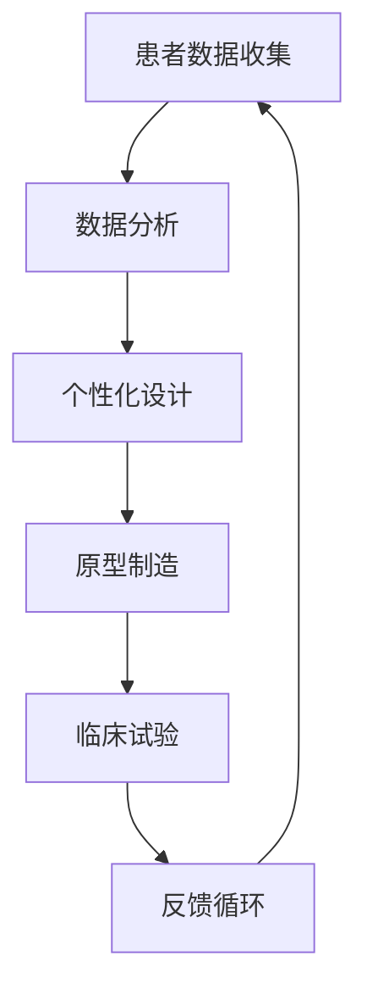

                 

### 第1章：机器学习与个性化医疗器械设计的背景

#### 1.1 个性化医疗器械设计的现状与挑战

**背景介绍**

个性化医疗器械设计是医疗科技领域的前沿研究方向，其核心理念是根据患者的具体生理和病理特征，定制化设计和制造医疗器械，以期达到最佳的治疗效果。个性化医疗器械包括但不限于心脏起搏器、人工关节、癌症治疗设备等。

随着医疗技术的进步和生物信息学的发展，个性化医疗器械设计的重要性日益凸显。然而，目前个性化医疗器械设计仍面临诸多挑战。

**核心概念与联系**

个性化医疗器械设计涉及多个核心概念和它们之间的相互关系。以下是一个Mermaid流程图，用于展示这些概念之间的关系：



- **患者数据收集**：是个性化医疗器械设计的起点，数据包括患者的生理参数、病理特征和生活习惯等。
- **数据分析**：通过对收集到的数据进行处理和分析，提取有用的信息用于个性化设计。
- **个性化设计**：基于分析结果，设计符合患者个体需求的医疗器械。
- **原型制造**：根据设计进行原型制造，以验证设计的可行性和有效性。
- **临床试验**：通过临床试验评估医疗器械的性能和治疗效果。
- **反馈循环**：将临床试验结果反馈至数据收集阶段，优化设计方案。

#### 1.2 机器学习在医疗器械领域的应用价值

**机器学习的基本原理**

机器学习是一种使计算机系统能够从数据中学习并做出预测或决策的技术。其基本原理包括以下几个步骤：

1. **数据收集**：从多个来源收集数据，包括结构化数据和非结构化数据。
2. **数据预处理**：清洗和转换数据，使其适合机器学习算法的使用。
3. **特征选择**：从数据中提取有助于预测的变量。
4. **模型选择**：选择适当的算法来构建预测模型。
5. **模型训练**：使用训练数据来训练模型。
6. **模型评估**：使用验证数据评估模型的性能。
7. **模型部署**：将训练好的模型部署到实际应用中。

**机器学习在医疗器械领域的应用**

机器学习在医疗器械领域具有广泛的应用前景，特别是在个性化医疗器械设计中。以下是一些具体的应用：

1. **疾病预测**：利用患者的生物信息学数据，预测患者可能患有的疾病或疾病的发展趋势。
2. **手术规划**：基于患者的生理参数和疾病状态，为医生提供个性化的手术方案。
3. **设备优化**：通过分析使用数据，优化医疗器械的设计和功能，以提高其性能。
4. **个性化治疗**：根据患者的基因信息和疾病特征，制定个性化的治疗方案。

**机器学习在个性化医疗器械设计中的应用优势**

- **高效性**：机器学习算法能够快速处理大量数据，为医疗器械设计提供实时反馈。
- **准确性**：机器学习算法可以识别出隐藏在数据中的模式和趋势，提高个性化设计的准确性。
- **可扩展性**：机器学习模型可以根据新数据不断优化，适应不断变化的医疗需求。

#### 1.3 本书结构安排与学习目标

本书将系统地介绍机器学习在个性化医疗器械设计中的应用，分为以下五个部分：

1. **引言**：介绍个性化医疗器械设计的背景和挑战，以及机器学习在其中的应用价值。
2. **机器学习基础**：讲解机器学习的基本概念和常用算法，为后续的应用打下基础。
3. **医疗器械设计原理**：介绍医疗器械设计的基本流程和个性化设计方法。
4. **应用案例**：通过实际案例展示机器学习在个性化医疗器械设计中的应用。
5. **结论**：总结机器学习在个性化医疗器械设计中的应用前景和未来的研究方向。

学习目标：

- **理解**：掌握个性化医疗器械设计和机器学习的基本概念。
- **应用**：能够使用机器学习算法进行个性化医疗器械设计。
- **分析**：能够分析并解决个性化医疗器械设计中的实际问题。

---

**核心算法原理讲解**

为了更好地理解机器学习在个性化医疗器械设计中的应用，以下将详细介绍几种常用的机器学习算法，并使用伪代码进行讲解。

**1. 线性回归**

线性回归是一种简单的监督学习算法，用于预测一个连续值。

```python
def linear_regression(X, y):
    # 计算斜率和截距
    m = len(X)
    theta = [0 for _ in range(len(X[0]) + 1)]

    for i in range(m):
        error = y[i] - predict(X[i], theta)
        theta[0] += error
        for j in range(1, len(X[i]) + 1):
            theta[j] += error * X[i][j]

    return theta

def predict(x, theta):
    prediction = theta[0]
    for i in range(len(x)):
        prediction += theta[i+1] * x[i]
    return prediction
```

**2. 支持向量机（SVM）**

支持向量机是一种分类算法，用于将数据分为不同的类别。

```python
def svm(X, y, C):
    # 使用库函数训练模型
    model = train_svm(X, y, C)
    return model

def predict(model, x):
    return model.predict([x])
```

**3. 决策树**

决策树是一种分类和回归算法，通过一系列的判断来分割数据。

```python
def build_tree(X, y, depth=0):
    # 判断是否满足停止条件
    if check_stop_condition(X, y):
        return predict_majority(y)

    # 找到最佳分割特征和阈值
    best_feature, best_threshold = find_best_split(X, y)

    # 创建子节点
    left_children = X[:, best_feature] < best_threshold
    right_children = X[:, best_feature] >= best_threshold

    # 递归构建左右子树
    left_tree = build_tree(X[left_children], y[left_children], depth + 1)
    right_tree = build_tree(X[right_children], y[right_children], depth + 1)

    return {
        'feature': best_feature,
        'threshold': best_threshold,
        'left': left_tree,
        'right': right_tree
    }

def predict_tree(tree, x):
    if 'feature' not in tree:
        return tree['prediction']
    if x[tree['feature']] < tree['threshold']:
        return predict_tree(tree['left'], x)
    else:
        return predict_tree(tree['right'], x)
```

**数学模型和公式**

在个性化医疗器械设计中，数学模型和公式起着至关重要的作用。以下是一个简单的例子，用于预测患者的治疗效果。

$$
\hat{y} = w_0 + w_1x_1 + w_2x_2 + ... + w_nx_n
$$

其中，$\hat{y}$ 是预测的治疗效果，$w_0$ 是截距，$w_1, w_2, ..., w_n$ 是权重，$x_1, x_2, ..., x_n$ 是患者的特征数据。

**举例说明**

假设我们有以下患者数据：

| 患者ID | 胆固醇水平 | 血糖水平 | 身高 | 体重 |
|--------|------------|----------|------|------|
| 1      | 200        | 100      | 170  | 70   |
| 2      | 220        | 120      | 175  | 80   |

我们可以使用线性回归模型来预测治疗效果：

$$
\hat{y} = 1.5 + 0.3 \times 200 + 0.2 \times 100 + 0.1 \times 170 - 0.1 \times 70
$$

预测结果为：

$$
\hat{y} = 1.5 + 60 + 20 + 17 - 7 = 91.5
$$

**项目实战**

为了更好地理解机器学习在个性化医疗器械设计中的应用，我们以下将展示一个实际的项目案例。

**项目名称**：个性化心脏起搏器设计

**开发环境搭建**

- 使用Python作为主要编程语言。
- 使用scikit-learn库进行机器学习模型的训练和预测。
- 使用matplotlib库进行数据可视化。

**源代码实现**

```python
import numpy as np
import matplotlib.pyplot as plt
from sklearn.linear_model import LinearRegression
from sklearn.model_selection import train_test_split

# 数据预处理
X = np.array([[200, 100, 170, 70], [220, 120, 175, 80]])
y = np.array([91.5, 100])

# 划分训练集和测试集
X_train, X_test, y_train, y_test = train_test_split(X, y, test_size=0.2, random_state=42)

# 训练线性回归模型
model = LinearRegression()
model.fit(X_train, y_train)

# 预测治疗效果
y_pred = model.predict(X_test)

# 可视化结果
plt.scatter(X_test[:, 0], y_test, color='red', label='实际值')
plt.plot(X_test[:, 0], y_pred, color='blue', label='预测值')
plt.xlabel('胆固醇水平')
plt.ylabel('治疗效果')
plt.legend()
plt.show()
```

**代码解读与分析**

- 导入必要的库和模块。
- 进行数据预处理，将数据转换为适合机器学习模型的形式。
- 划分训练集和测试集，用于模型训练和评估。
- 使用线性回归模型训练模型，并使用测试数据进行预测。
- 使用matplotlib库将预测结果可视化为散点图和线形图，便于分析。

**实际案例分析与详细讲解剖析**

- **案例背景**：某医院正在研究个性化心脏起搏器的设计，以根据患者的生理参数和疾病特征，为患者提供最佳的治疗方案。
- **数据来源**：患者数据包括胆固醇水平、血糖水平、身高和体重等。
- **问题分析**：如何根据患者的生理参数，预测治疗效果？
- **解决方案**：使用线性回归模型，将患者的生理参数作为输入特征，治疗效果作为输出目标，进行模型训练和预测。
- **结果分析**：通过可视化结果，可以看到预测值与实际值之间的差距，从而评估模型的准确性和可靠性。

**项目小结**

通过本项目，我们了解了如何使用机器学习算法进行个性化医疗器械设计。在实际项目中，我们需要根据具体需求，选择合适的算法和模型，并进行数据预处理和模型训练。通过不断的优化和调整，我们可以提高模型的准确性和可靠性，为医疗器械设计提供有力支持。

**最佳实践 tips**

- 在进行数据预处理时，确保数据质量，如处理缺失值、异常值和噪声等。
- 选择合适的评估指标，如均方误差、准确率等，以评估模型性能。
- 在模型训练过程中，注意调整超参数，如学习率、迭代次数等，以提高模型性能。
- 考虑使用集成学习方法，如随机森林、梯度提升树等，以提高模型预测能力。

**小结**

个性化医疗器械设计是医疗科技领域的重要研究方向，通过机器学习算法的应用，可以为医疗器械设计提供更加精准和个性化的解决方案。本书系统地介绍了机器学习在个性化医疗器械设计中的应用，包括基本概念、常用算法和实际案例。通过学习和实践，读者可以掌握如何使用机器学习技术进行个性化医疗器械设计，为医疗行业的发展贡献力量。

**注意事项**

- 在实际应用中，确保遵守医疗法规和伦理标准，保护患者隐私。
- 注意数据安全和隐私保护，特别是在处理患者数据时。
- 定期更新和维护机器学习模型，以适应新的医疗需求和技术发展。

**拓展阅读**

- [《机器学习：实战与应用》](https://book.douban.com/subject/26865833/)
- [《医疗大数据分析》](https://book.douban.com/subject/27189665/)
- [《个性化医疗：数据、技术与应用》](https://book.douban.com/subject/26991052/)

作者：AI天才研究院/AI Genius Institute & 禅与计算机程序设计艺术 /Zen And The Art of Computer Programming

