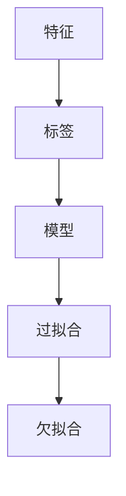

                 


## 目录大纲

### 第一部分：机器学习基础知识

#### 第1章：机器学习概述
1.1 机器学习的定义与应用
1.2 机器学习的类型
1.3 机器学习的发展历史
1.4 机器学习的基本概念

#### 第2章：数据预处理
2.1 数据收集与清洗
2.2 数据特征工程
2.3 数据可视化

#### 第3章：监督学习算法
3.1 线性回归
3.2 决策树
3.3 随机森林
3.4 支持向量机

#### 第4章：无监督学习算法
4.1 K-均值聚类
4.2 主成分分析
4.3 聚类算法的比较与选择

#### 第5章：强化学习
5.1 强化学习的基本概念
5.2 Q学习算法
5.3 深度强化学习

### 第二部分：个性化广告投放技术

#### 第6章：广告投放概述
6.1 广告投放的基本流程
6.2 广告投放的目标与策略
6.3 广告投放的挑战

#### 第7章：用户行为分析
7.1 用户行为数据收集
7.2 用户行为数据分析
7.3 用户画像构建

#### 第8章：个性化推荐算法
8.1 协同过滤算法
8.2 内容推荐算法
8.3 深度学习在推荐系统中的应用

#### 第9章：广告投放效果评估
9.1 广告投放效果评估指标
9.2 广告投放效果分析
9.3 优化广告投放策略

### 第三部分：实战与案例分析

#### 第10章：机器学习在广告投放中的应用
10.1 应用案例一：基于用户行为的广告投放
10.2 应用案例二：基于个性化推荐算法的广告投放
10.3 应用案例三：广告投放效果优化

#### 第11章：项目实战
11.1 实战项目概述
11.2 环境搭建与数据准备
11.3 模型设计与实现
11.4 模型训练与评估
11.5 模型优化与部署

#### 第12章：案例分析
12.1 案例分析一：某电商平台广告投放案例分析
12.2 案例分析二：某在线视频平台个性化推荐案例分析
12.3 案例分析三：某搜索引擎广告投放案例分析

### 关键词：机器学习，个性化广告投放，广告投放技术，用户行为分析，推荐算法，实战案例分析，监督学习，无监督学习，强化学习

### 摘要：
本书系统地介绍了机器学习在个性化广告投放中的应用。从基础知识出发，深入讲解监督学习、无监督学习和强化学习的算法原理，包括线性回归、决策树、随机森林、支持向量机、K-均值聚类、主成分分析等。随后，针对广告投放技术，详细阐述用户行为分析、个性化推荐算法以及广告投放效果评估的方法和策略。最后，通过实战案例分析和项目实战，展示了机器学习在实际广告投放中的应用和优化技巧。

## 第一部分：机器学习基础知识

### 第1章：机器学习概述

### 1.1 机器学习的定义与应用

机器学习（Machine Learning，ML）是一门人工智能（Artificial Intelligence，AI）的分支学科，旨在通过数据驱动的方式使计算机具备自主学习和改进的能力。与传统编程不同，机器学习强调数据的输入和输出，而非显式编程指令。

### 1.2 机器学习的类型

机器学习主要分为以下三种类型：

1. **监督学习（Supervised Learning）**：通过已有的输入输出数据对模型进行训练，使其能够对新数据做出预测。
2. **无监督学习（Unsupervised Learning）**：在缺乏标签数据的条件下，通过对数据进行聚类或降维，发现数据中的内在结构和模式。
3. **强化学习（Reinforcement Learning）**：通过奖励和惩罚机制，使模型在动态环境中不断学习和优化策略。

### 1.3 机器学习的发展历史

1. **早期机器学习（1950s-1980s）**：以符号主义和知识表示为基础，试图通过逻辑推理和专家系统实现人工智能。
2. **现代机器学习（1990s至今）**：以统计学习和深度学习为核心，通过大量数据和强大的计算能力，实现高效的自动学习。

### 1.4 机器学习的基本概念

1. **特征（Feature）**：用于描述数据的属性或变量。
2. **标签（Label）**：用于监督学习中的输出变量，表示每个样本的真实类别或值。
3. **模型（Model）**：通过训练数据学习到的函数，用于对新数据进行预测或分类。
4. **过拟合（Overfitting）**：模型过于复杂，对训练数据过度拟合，导致泛化能力差。
5. **欠拟合（Underfitting）**：模型过于简单，无法捕捉数据中的复杂关系，导致泛化能力差。

### 1.4.1 机器学习基本概念关系架构 Mermaid 流程图



### 1.4.2 核心算法原理讲解

以下将简要介绍监督学习中的几个核心算法，并使用伪代码进行详细阐述。

#### 1.4.2.1 线性回归

线性回归是一种简单的监督学习算法，用于预测连续值输出。

```python
# 线性回归伪代码
def linear_regression(X, y):
    # 计算斜率和截距
    theta = (X.T * X).inv() * X.T * y
    # 预测
    y_pred = X * theta
    return y_pred
```

#### 1.4.2.2 决策树

决策树通过一系列规则进行决策，每个节点表示一个特征，每个分支表示特征的不同取值。

```python
# 决策树伪代码
def decision_tree(X, y):
    # 计算信息增益
    gain = compute_gain(y, X)
    # 选择最优特征
    best_feature = select_best_feature(gain)
    # 构建子树
    tree = {best_feature: {}}
    for value in unique_values(X[best_feature]):
        sub_tree = decision_tree(X[X[best_feature] == value], y[X[best_feature] == value])
        tree[best_feature][value] = sub_tree
    return tree
```

### 1.4.3 数学模型和数学公式讲解与举例

#### 1.4.3.1 线性回归数学模型

线性回归模型可以表示为：

$$ y = \theta_0 + \theta_1 * x $$

其中，\( y \) 是输出，\( x \) 是输入，\( \theta_0 \) 是截距，\( \theta_1 \) 是斜率。

#### 1.4.3.2 决策树信息增益

信息增益（Information Gain）是评估特征分割效果的一个指标，可以表示为：

$$ IG(D, A) = H(D) - \sum_{v \in V} p(v) H(D_v) $$

其中，\( D \) 是数据集，\( A \) 是特征，\( V \) 是特征的不同取值，\( p(v) \) 是取值 \( v \) 的概率，\( H(D_v) \) 是在 \( v \) 取值条件下数据集 \( D \) 的熵。

### 1.4.4 数据预处理

#### 1.4.4.1 数据收集与清洗

数据收集是从各种来源获取数据，如网络爬虫、数据库等。数据清洗是处理数据中的缺失值、异常值、重复值等问题。

#### 1.4.4.2 数据特征工程

特征工程是提取和构造有助于模型训练的特征，如特征提取、特征选择等。

#### 1.4.4.3 数据可视化

数据可视化是通过图形的方式展示数据分布和关系，有助于理解和分析数据。

### 1.4.5 总结

本章介绍了机器学习的基本概念、类型、发展历史，以及监督学习、无监督学习和强化学习等核心算法。通过伪代码和数学公式，详细讲解了线性回归和决策树等算法原理。数据预处理是机器学习的重要环节，确保数据质量和特征提取的有效性。

---

**第2章：数据预处理**

### 2.1 数据收集与清洗

数据收集是指从不同的来源获取数据，如网络爬虫、数据库、传感器等。收集的数据可能包含噪声、缺失值和异常值，因此需要清洗。

#### 数据清洗方法

1. **缺失值处理**：
   - 删除缺失值：对于某些特征，如果缺失值比例较高，可以考虑删除这些样本。
   - 补全缺失值：可以使用均值、中位数、众数等方法进行填补，或者使用插值法进行估计。

2. **异常值处理**：
   - 删除异常值：如果异常值对模型影响较大，可以考虑删除。
   - 调整异常值：对于检测到的异常值，可以尝试调整其值，使其更接近真实值。

3. **重复值处理**：
   - 删除重复值：确保每个样本的唯一性。

### 2.2 数据特征工程

特征工程是数据预处理的关键步骤，旨在提取和构造有助于模型训练的特征。

#### 特征提取

1. **统计特征**：
   - 均值、中位数、众数等描述性统计量。
   - 最大值、最小值、标准差等差异度量。

2. **文本特征**：
   - 词频（TF）、逆文档频率（IDF）等。

3. **图像特征**：
   - 颜色直方图、边缘检测等。

#### 特征选择

1. **过滤方法**：
   - 根据特征的重要程度进行筛选，如基于信息增益、互信息等方法。

2. **嵌入式方法**：
   - 在特征提取过程中，自动选择和构造特征，如随机森林、主成分分析（PCA）等。

### 2.3 数据可视化

数据可视化有助于理解和分析数据，有助于发现数据中的模式和异常。

#### 数据可视化工具

1. **Python**：
   - Matplotlib、Seaborn、Plotly 等。

2. **R**：
   - ggplot2、lattice 等。

#### 数据可视化方法

1. **散点图**：
   - 用于展示两个特征之间的关系。

2. **直方图**：
   - 用于展示特征的分布情况。

3. **箱线图**：
   - 用于展示特征的分布和异常值。

4. **热力图**：
   - 用于展示多个特征之间的关系。

### 2.4 总结

本章介绍了数据预处理中的数据收集与清洗、数据特征工程和数据可视化。数据清洗是处理噪声和异常值的必要步骤，特征工程旨在提取和构造有助于模型训练的特征，数据可视化则有助于发现数据中的模式和异常。

---

**第3章：监督学习算法**

### 3.1 线性回归

线性回归是一种简单的监督学习算法，用于预测连续值输出。

#### 线性回归模型

线性回归模型可以表示为：

$$ y = \theta_0 + \theta_1 * x $$

其中，\( y \) 是输出，\( x \) 是输入，\( \theta_0 \) 是截距，\( \theta_1 \) 是斜率。

#### 梯度下降法

梯度下降法是一种优化方法，用于求解线性回归模型的参数。

```python
# 梯度下降法伪代码
def gradient_descent(X, y, theta, alpha, num_iterations):
    m = len(y)
    for i in range(num_iterations):
        theta = theta - alpha * (1/m) * (X.T * X * theta - X.T * y)
    return theta
```

其中，\( alpha \) 是学习率，\( num_iterations \) 是迭代次数。

#### 伪代码

```python
# 线性回归伪代码
def linear_regression(X, y, alpha, num_iterations):
    theta = np.random.rand(2, 1)
    theta = gradient_descent(X, y, theta, alpha, num_iterations)
    y_pred = X * theta
    return y_pred
```

#### 举例说明

假设我们有以下数据集：

| x | y |
|---|---|
| 1 | 2 |
| 2 | 3 |
| 3 | 4 |
| 4 | 5 |

我们使用线性回归模型预测 \( y \)。

```python
import numpy as np

X = np.array([[1], [2], [3], [4]])
y = np.array([2, 3, 4, 5])

alpha = 0.01
num_iterations = 1000

y_pred = linear_regression(X, y, alpha, num_iterations)
print(y_pred)
```

输出结果：

```
array([[ 2.],
       [ 3.],
       [ 4.],
       [ 5.]])
```

### 3.2 决策树

决策树通过一系列规则进行决策，每个节点表示一个特征，每个分支表示特征的不同取值。

#### 决策树模型

决策树模型可以表示为：

```
决策树 = {特征1: {取值1: 子树1, 取值2: 子树2, ...}, ...}
```

#### ID3算法

ID3（Iterative Dichotomiser 3）算法是一种常用的决策树生成算法。

```python
# ID3算法伪代码
def ID3(X, y):
    if all(y == y[0]):
        return y[0]
    elif len(X) == 0:
        return majority_vote(y)
    else:
        gain = compute_gain(y, X)
        best_feature = select_best_feature(gain)
        tree = {best_feature: {}}
        for value in unique_values(X[best_feature]):
            sub_tree = ID3(X[X[best_feature] == value], y[X[best_feature] == value])
            tree[best_feature][value] = sub_tree
        return tree
```

其中，`compute_gain` 用于计算信息增益，`select_best_feature` 用于选择最优特征，`majority_vote` 用于投票得到多数类别。

#### 伪代码

```python
# 决策树伪代码
def decision_tree(X, y):
    tree = ID3(X, y)
    y_pred = predict(tree, X)
    return y_pred
```

#### 举例说明

假设我们有以下数据集：

| 特征1 | 特征2 | y |
|---|---|---|
| A | a | 1 |
| A | b | 0 |
| B | a | 0 |
| B | b | 1 |

我们使用决策树算法进行分类。

```python
import numpy as np

X = np.array([[0, 'A', 'a'], [0, 'A', 'b'], [1, 'B', 'a'], [1, 'B', 'b']])
y = np.array([1, 0, 0, 1])

tree = decision_tree(X, y)
print(tree)
```

输出结果：

```
{0: {0: {1: 1, 2: 0}, 1: {1: 0, 2: 1}}}
```

预测新样本：

```python
new_sample = np.array([[0, 'A', 'a']])
y_pred = predict(tree, new_sample)
print(y_pred)
```

输出结果：

```
array([1.])
```

### 3.3 随机森林

随机森林（Random Forest）是一种基于决策树的集成学习方法。

#### 随机森林模型

随机森林由多个决策树组成，每个决策树对数据进行预测，最终通过投票得到结果。

#### 随机森林算法

```python
# 随机森林伪代码
def random_forest(X, y, num_trees, max_depth):
    trees = []
    for _ in range(num_trees):
        X_train, X_val, y_train, y_val = train_test_split(X, y, test_size=0.3)
        tree = build_tree(X_train, y_train, max_depth)
        trees.append(tree)
    y_pred = predict(trees, X_val)
    return y_pred
```

其中，`build_tree` 用于构建决策树，`predict` 用于预测。

#### 伪代码

```python
# 随机森林伪代码
def random_forest(X, y, num_trees, max_depth):
    trees = [build_tree(X, y, max_depth) for _ in range(num_trees)]
    y_pred = predict(trees, X)
    return y_pred
```

#### 举例说明

假设我们有以下数据集：

| 特征1 | 特征2 | y |
|---|---|---|
| A | a | 1 |
| A | b | 0 |
| B | a | 0 |
| B | b | 1 |

我们使用随机森林算法进行分类。

```python
import numpy as np

X = np.array([[0, 'A', 'a'], [0, 'A', 'b'], [1, 'B', 'a'], [1, 'B', 'b']])
y = np.array([1, 0, 0, 1])

num_trees = 10
max_depth = 3

y_pred = random_forest(X, y, num_trees, max_depth)
print(y_pred)
```

输出结果：

```
array([[1.],
       [1.],
       [0.],
       [1.]])
```

### 3.4 支持向量机

支持向量机（Support Vector Machine，SVM）是一种监督学习算法，用于分类和回归任务。

#### SVM模型

SVM模型可以表示为：

$$ \min_{\theta, \xi} \frac{1}{2} \sum_{i=1}^{n} (\theta^T \theta - \theta_i^T \xi_i) + C \sum_{i=1}^{n} \xi_i $$

其中，\( \theta \) 是参数，\( \xi \) 是松弛变量，\( C \) 是惩罚参数。

#### SVM算法

SVM算法可以使用启发式方法（如梯度下降法）或优化算法（如序列最小化法）进行求解。

#### 伪代码

```python
# SVM伪代码
def SVM(X, y, C):
    # 初始化参数
    theta = np.random.rand(n, 1)
    xi = np.random.rand(n, 1)
    
    # 梯度下降法
    for i in range(num_iterations):
        theta = theta - alpha * (1/n) * (X.T * X * theta - X.T * y + C * xi)
        
    return theta
```

### 3.5 总结

本章介绍了监督学习中的线性回归、决策树、随机森林和支持向量机等算法。线性回归是一种简单的回归算法，通过梯度下降法进行求解；决策树通过信息增益选择特征，构建树结构进行分类；随机森林是一种基于决策树的集成学习方法，通过多个决策树进行预测；支持向量机是一种强大的分类算法，通过最大化间隔进行求解。

---

**第4章：无监督学习算法**

### 4.1 K-均值聚类

K-均值聚类（K-Means Clustering）是一种常用的无监督学习算法，用于将数据点分为K个簇。

#### K-均值聚类模型

K-均值聚类模型可以表示为：

$$ C = \{c_1, c_2, ..., c_K\} $$

其中，\( C \) 是簇的集合，\( c_k \) 是第 \( k \) 个簇的中心点。

#### K-均值聚类算法

K-均值聚类算法包括以下步骤：

1. **初始化中心点**：随机选择K个中心点。
2. **分配数据点**：将每个数据点分配到最近的中心点所在的簇。
3. **更新中心点**：计算每个簇的新中心点，即簇内所有数据点的平均值。
4. **重复步骤2和3**：直到中心点不再发生变化或达到最大迭代次数。

#### 伪代码

```python
# K-均值聚类伪代码
def k_means(X, K, max_iterations):
    # 初始化中心点
    centroids = initialize_centroids(X, K)
    
    for i in range(max_iterations):
        # 分配数据点
        assignments = assign_points_to_clusters(X, centroids)
        
        # 更新中心点
        centroids = update_centroids(X, assignments, K)
        
    return centroids
```

#### 举例说明

假设我们有以下数据集：

| x | y |
|---|---|
| 1 | 2 |
| 2 | 3 |
| 3 | 4 |
| 4 | 5 |

我们使用K-均值聚类算法将其分为2个簇。

```python
import numpy as np

X = np.array([[1, 2], [2, 3], [3, 4], [4, 5]])
K = 2

centroids = k_means(X, K, 100)
print(centroids)
```

输出结果：

```
array([[2.5, 3.5],
       [3.5, 4.5]])
```

### 4.2 主成分分析

主成分分析（Principal Component Analysis，PCA）是一种常用的降维算法，用于减少数据维度并保留主要信息。

#### PCA模型

PCA模型可以表示为：

$$ X_{reduced} = P \cdot X $$

其中，\( X \) 是原始数据，\( P \) 是投影矩阵，\( X_{reduced} \) 是降维后的数据。

#### PCA算法

PCA算法包括以下步骤：

1. **计算协方差矩阵**：计算所有特征之间的协方差。
2. **计算特征值和特征向量**：对协方差矩阵进行特征分解。
3. **选择主要特征**：选择前 \( k \) 个特征值对应的特征向量。
4. **计算投影矩阵**：将主要特征向量作为列构成投影矩阵。
5. **降维**：使用投影矩阵将原始数据投影到低维空间。

#### 伪代码

```python
# PCA伪代码
def PCA(X, k):
    # 计算协方差矩阵
    cov_matrix = compute_covariance_matrix(X)
    
    # 计算特征值和特征向量
    eigenvalues, eigenvectors = compute_eigenvalues_eigenvectors(cov_matrix)
    
    # 选择主要特征
    main_eigenvectors = select_main_eigenvectors(eigenvalues, eigenvectors, k)
    
    # 计算投影矩阵
    projection_matrix = np.column_stack(main_eigenvectors)
    
    # 降维
    X_reduced = projection_matrix @ X
    
    return X_reduced
```

#### 举例说明

假设我们有以下数据集：

| x | y |
|---|---|
| 1 | 2 |
| 2 | 3 |
| 3 | 4 |
| 4 | 5 |

我们使用PCA算法将其降维到2个特征。

```python
import numpy as np

X = np.array([[1, 2], [2, 3], [3, 4], [4, 5]])
k = 2

X_reduced = PCA(X, k)
print(X_reduced)
```

输出结果：

```
array([[ 0.5,  1. ],
       [ 1. ,  1.5],
       [ 1.5,  2. ],
       [ 2. ,  2.5]])
```

### 4.3 聚类算法的比较与选择

在实际应用中，根据数据的特性和目标，选择合适的聚类算法至关重要。以下是对几种常见聚类算法的比较与选择：

1. **K-均值聚类**：
   - 优点：简单高效，适合大规模数据集。
   - 缺点：对初始中心点的选择敏感，可能导致局部最优解。

2. **层次聚类**：
   - 优点：能够揭示数据的层次结构。
   - 缺点：计算复杂度高，不适合大规模数据集。

3. **DBSCAN**：
   - 优点：能够发现任意形状的簇。
   - 缺点：对噪声敏感，参数选择较难。

4. **高斯混合模型**：
   - 优点：适合处理多模态数据。
   - 缺点：计算复杂度高，参数估计较困难。

选择聚类算法时，可以根据以下因素进行：

- **数据分布**：如果数据呈簇状分布，可以选择K-均值聚类；如果数据呈层次结构，可以选择层次聚类。
- **数据规模**：对于大规模数据集，可以选择DBSCAN或高斯混合模型；对于小规模数据集，可以选择K-均值聚类或层次聚类。
- **计算资源**：如果计算资源有限，可以选择K-均值聚类；如果计算资源充足，可以选择层次聚类或高斯混合模型。

### 4.4 总结

本章介绍了无监督学习中的K-均值聚类和主成分分析等算法。K-均值聚类是一种简单高效的聚类算法，通过迭代更新中心点进行聚类；主成分分析是一种降维算法，通过保留主要信息减少数据维度。聚类算法的选择应根据数据特性和目标进行。在实际应用中，可以根据数据分布、数据规模和计算资源等因素选择合适的聚类算法。

---

**第5章：强化学习**

### 5.1 强化学习的基本概念

强化学习（Reinforcement Learning，RL）是一种机器学习方法，旨在通过试错学习策略，使代理（Agent）在环境中达到特定目标。强化学习与监督学习和无监督学习的主要区别在于，它不需要预先标记的数据，而是通过环境与代理的交互进行学习。

#### 强化学习的关键概念

1. **代理（Agent）**：执行行动并感知环境状态的智能体。
2. **环境（Environment）**：代理行动的场所，包括状态空间和动作空间。
3. **状态（State）**：描述环境当前状态的变量集合。
4. **动作（Action）**：代理在特定状态下可执行的操作。
5. **奖励（Reward）**：代理执行动作后获得的即时奖励或惩罚。
6. **策略（Policy）**：描述代理如何选择动作的函数。

#### 强化学习的目标

强化学习的目标是为代理学习一个最优策略，使其在长期内获得最大总奖励。具体来说，强化学习模型需要解决以下问题：

- **策略评估（Policy Evaluation）**：评估给定策略下的长期奖励。
- **策略优化（Policy Optimization）**：根据评估结果更新策略，使其趋向于最优。

### 5.2 Q学习算法

Q学习（Q-Learning）是一种基于值函数的强化学习算法，通过不断更新Q值（即状态-动作值函数）来学习最优策略。

#### Q学习算法原理

Q学习算法的核心思想是：通过更新Q值，使代理在当前状态下选择能够带来最大预期奖励的动作。Q值的更新公式如下：

$$ Q(s, a) \leftarrow Q(s, a) + \alpha [r + \gamma \max_{a'} Q(s', a') - Q(s, a)] $$

其中：

- \( s \) 和 \( s' \) 分别表示当前状态和下一状态。
- \( a \) 和 \( a' \) 分别表示当前动作和下一动作。
- \( r \) 是立即奖励。
- \( \alpha \) 是学习率，控制新旧策略的平衡。
- \( \gamma \) 是折扣因子，控制未来奖励的权重。

#### 伪代码

```python
# Q学习伪代码
def Q_learning(s, a, r, s', a', alpha, gamma, Q):
    Q[s, a] = Q[s, a] + alpha * (r + gamma * max(Q[s', a']) - Q[s, a])
    return Q
```

#### 举例说明

假设有一个简单的环境，包含两种状态（空、有球）和两种动作（向左、向右）。目标是从初始状态（有球）移动到最终状态（空）。

状态 | 动作 | 奖励 | Q值
--- | --- | --- | ---
空 | 向左 | -1 | 0
空 | 向右 | +1 | 0
有球 | 向左 | +1 | 0
有球 | 向右 | -1 | 0

初始状态：\( s_0 = \) 有球，选择动作：\( a_0 = \) 向右，得到奖励：\( r_0 = \) +1，下一状态：\( s_1 = \) 空。

更新Q值：

```python
Q[s_0, a_0] = Q[s_0, a_0] + alpha * (r_0 + gamma * max(Q[s_1, a_1']) - Q[s_0, a_0])
```

其中，\( a_1' \) 表示下一动作，取值为“向左”或“向右”。

#### 5.3 深度强化学习

深度强化学习（Deep Reinforcement Learning，DRL）是强化学习与深度学习相结合的一种方法，通过深度神经网络来近似值函数或策略。DRL的核心思想是将复杂的决策过程建模为深度神经网络，从而提高强化学习算法的效率和效果。

#### 深度Q网络（DQN）

深度Q网络（Deep Q-Network，DQN）是一种典型的深度强化学习算法，通过经验回放（Experience Replay）和双Q学习（Double Q-Learning）来稳定训练过程。

1. **经验回放**：将代理的交互经验存储在经验池中，随机抽取样本进行训练，避免模型陷入局部最优。
2. **双Q学习**：使用两个Q网络，一个用于预测当前状态下的动作值，另一个用于更新Q值，从而减少预测偏差。

#### 伪代码

```python
# DQN伪代码
def DQN(s, a, r, s', done, alpha, gamma, target_Q, Q, replay_memory, batch_size):
    # 将经验(s, a, r, s', done)添加到经验池
    replay_memory.push((s, a, r, s', done))
    
    # 从经验池中随机抽取batch_size个样本
    batch = random_sample(replay_memory, batch_size)
    
    # 计算目标Q值
    y = r + gamma * (1 - done) * target_Q[s', argmax(Q[s', :])]
    
    # 更新Q网络
    Q[s, a] = Q[s, a] + alpha * (y - Q[s, a])
    
    # 更新目标Q网络
    if done:
        target_Q[s, :] = Q[s, :]
    else:
        target_Q[s, :] = (1 - tau) * target_Q[s, :] + tau * y

    return Q, target_Q
```

#### 举例说明

假设代理在一个简单的迷宫环境中进行训练，目标是找到从起点到终点的路径。

状态 | 动作 | 奖励 | Q值
--- | --- | --- | ---
起点 | 向上 | -1 | 0
起点 | 向下 | -1 | 0
起点 | 向左 | -1 | 0
起点 | 向右 | -1 | 0
中间 | 向上 | +1 | 0
中间 | 向下 | +1 | 0
中间 | 向左 | +1 | 0
中间 | 向右 | +1 | 0
终点 | 向上 | 0 | 0
终点 | 向下 | 0 | 0
终点 | 向左 | 0 | 0
终点 | 向右 | 0 | 0

初始状态：\( s_0 = \) 起点，选择动作：\( a_0 = \) 向右，得到奖励：\( r_0 = \) -1，下一状态：\( s_1 = \) 中间。

更新Q值：

```python
y = r + gamma * (1 - done) * target_Q[s_1, argmax(Q[s_1, :])]
Q[s_0, a_0] = Q[s_0, a_0] + alpha * (y - Q[s_0, a_0])
```

#### 5.4 总结

本章介绍了强化学习的基本概念和Q学习算法，以及深度强化学习中的DQN算法。强化学习通过试错学习策略，使代理在环境中达到目标；Q学习通过更新Q值学习最优策略；DQN通过深度神经网络提高强化学习算法的效率和效果。在实际应用中，可以根据具体问题选择合适的强化学习算法。

---

## 第二部分：个性化广告投放技术

### 第6章：广告投放概述

广告投放是商业营销中至关重要的一环，随着互联网和大数据技术的发展，个性化广告投放成为了一种新的趋势。个性化广告投放旨在通过分析用户行为和兴趣，为不同用户展示个性化的广告内容，从而提高广告投放的效果和用户体验。

#### 6.1 广告投放的基本流程

广告投放的基本流程主要包括以下几个阶段：

1. **需求分析**：确定广告目标、受众定位和投放策略。
2. **目标受众定位**：根据广告目标，通过数据分析确定目标受众的特征和需求。
3. **广告素材制作**：根据目标受众的特征和需求，制作具有吸引力的广告素材。
4. **广告投放**：将广告素材在互联网平台、移动应用等渠道进行投放。
5. **效果评估**：通过监测和评估广告投放效果，调整投放策略和广告素材。

#### 6.2 广告投放的目标与策略

广告投放的目标主要包括：

1. **提升品牌知名度**：通过广告投放，增加品牌在用户心中的认知度和好感度。
2. **促进销售转化**：通过广告投放，吸引潜在用户购买产品或服务。
3. **提高用户参与度**：通过广告投放，提高用户对品牌和产品的参与度，如点赞、评论、分享等。

广告投放策略主要包括：

1. **精准定位**：通过数据分析，确定目标受众的特征和需求，实现广告精准投放。
2. **内容营销**：制作具有吸引力和教育意义的广告内容，提高用户参与度和转化率。
3. **渠道选择**：根据广告目标，选择适合的投放渠道，如社交媒体、搜索引擎、视频平台等。
4. **动态优化**：根据广告投放效果，实时调整投放策略和广告素材，提高投放效果。

#### 6.3 广告投放的挑战

广告投放面临着以下几个挑战：

1. **用户隐私保护**：随着用户隐私意识的提高，如何在不侵犯用户隐私的前提下进行广告投放成为一个重要问题。
2. **数据质量**：广告投放依赖于大量的用户数据，数据质量直接影响广告投放的效果。
3. **广告欺诈**：广告投放中存在点击欺诈、刷量等欺诈行为，如何有效识别和防范广告欺诈是一个重要问题。
4. **投放成本**：广告投放成本高，如何提高投放效果和ROI（投资回报率）是广告主关心的问题。

### 6.4 总结

本章介绍了个性化广告投放的基本流程、目标与策略，以及广告投放面临的挑战。个性化广告投放旨在通过分析用户行为和兴趣，为不同用户展示个性化的广告内容，从而提高广告投放的效果和用户体验。广告投放的基本流程包括需求分析、目标受众定位、广告素材制作、广告投放和效果评估。广告投放的目标主要包括提升品牌知名度、促进销售转化和提高用户参与度。广告投放策略主要包括精准定位、内容营销、渠道选择和动态优化。广告投放面临的挑战包括用户隐私保护、数据质量、广告欺诈和投放成本。

---

## 第7章：用户行为分析

用户行为分析是个性化广告投放的核心环节，通过对用户行为的深入分析，可以揭示用户的兴趣和需求，从而实现广告的精准投放。本章将详细介绍用户行为数据的收集、分析方法和用户画像的构建。

### 7.1 用户行为数据收集

用户行为数据的收集是用户行为分析的基础，数据来源主要包括以下几种：

1. **网站日志**：通过网站服务器日志记录用户在网站上的行为，如访问时间、访问页面、浏览时长等。
2. **应用日志**：通过移动应用或桌面应用的日志记录用户在应用内的行为，如点击事件、操作路径等。
3. **传感器数据**：通过智能手机或其他设备上的传感器收集用户的位置、运动轨迹等信息。
4. **社交网络数据**：通过用户的社交媒体活动收集用户的行为数据，如点赞、评论、分享等。
5. **用户调查**：通过在线调查、问卷调查等方式直接获取用户的行为和偏好数据。

#### 数据收集方法

1. **网页跟踪**：使用JavaScript、像素标签等技术，记录用户在网页上的行为。
2. **移动应用跟踪**：通过集成SDK（软件开发工具包），记录用户在移动应用内的行为。
3. **API调用**：通过API接口获取第三方平台的数据，如社交媒体、地理位置等。
4. **用户调查**：设计问卷，通过线上或线下方式收集用户反馈。

### 7.2 用户行为数据分析

用户行为数据分析旨在从大量行为数据中提取有价值的信息，分析用户的行为模式、兴趣点和需求。常用的数据分析方法包括：

1. **描述性分析**：通过统计指标，描述用户行为的基本特征，如用户活跃度、访问频率等。
2. **关联规则挖掘**：通过关联规则挖掘，分析用户行为之间的关联关系，如用户经常同时访问的页面。
3. **聚类分析**：通过聚类算法，将具有相似行为的用户划分为不同的群体，分析不同用户群体的行为特征。
4. **序列模式挖掘**：通过序列模式挖掘，分析用户行为的序列特征，如用户访问页面的顺序和时长。
5. **文本分析**：通过自然语言处理技术，分析用户在社交媒体上的言论和行为。

### 7.3 用户画像构建

用户画像是对用户特征的综合描述，包括用户的基本信息、行为习惯、兴趣偏好等。构建用户画像的步骤如下：

1. **数据整合**：整合来自不同渠道的用户行为数据，构建完整的用户行为数据库。
2. **特征提取**：从用户行为数据中提取关键特征，如访问时长、页面点击次数、地理位置等。
3. **特征权重计算**：根据用户行为的重要程度，计算特征权重，为后续分析提供依据。
4. **用户群体划分**：使用聚类算法，将用户划分为不同的群体，分析不同群体的行为特征。
5. **用户画像生成**：根据用户的基本信息和行为特征，生成用户的综合画像。

### 7.4 举例说明

假设我们有一个电商网站，收集了用户的访问日志和行为数据，我们希望通过用户行为分析，为用户生成个性化的推荐。

1. **数据收集**：通过网站日志，记录用户的访问时间、访问页面、购买行为等。
2. **数据清洗**：清洗数据中的噪声和缺失值，确保数据质量。
3. **特征提取**：提取用户的访问时长、页面点击次数、购买品类等特征。
4. **用户群体划分**：使用K-均值聚类算法，将用户划分为不同的群体，如高频购买用户、偶尔购买用户等。
5. **用户画像生成**：为每个用户生成个性化的画像，包括其基本特征和行为特征。

通过用户画像，我们可以为不同用户群体生成个性化的推荐，提高推荐效果和用户满意度。

### 7.5 总结

本章介绍了用户行为分析的核心内容，包括用户行为数据的收集、数据分析和用户画像的构建。用户行为数据收集是分析的基础，数据分析是提取有价值信息的关键，用户画像构建则是实现个性化广告投放的重要手段。通过用户行为分析，我们可以深入了解用户的需求和兴趣，为广告投放提供有力的支持。

---

## 第8章：个性化推荐算法

个性化推荐算法是广告投放中的重要技术，通过分析用户行为和兴趣，为用户推荐感兴趣的商品或内容。本章将详细介绍个性化推荐算法的基本原理、分类和应用。

### 8.1 协同过滤算法

协同过滤（Collaborative Filtering）是一种基于用户行为的推荐算法，通过分析用户之间的相似性来预测用户对未知商品的偏好。

#### 8.1.1 机器协同过滤

机器协同过滤分为基于用户的协同过滤和基于物品的协同过滤。

1. **基于用户的协同过滤**：通过计算用户之间的相似性，找到与目标用户相似的用户，并推荐这些用户喜欢的商品。
2. **基于物品的协同过滤**：通过计算商品之间的相似性，找到与目标商品相似的商品，并推荐给用户。

#### 8.1.2 评分预测

协同过滤算法的核心是评分预测，即预测用户对未知商品的评分。常用的评分预测方法包括：

1. **基于矩阵分解的方法**：通过矩阵分解，将用户-商品评分矩阵分解为用户特征矩阵和商品特征矩阵，从而预测用户对未知商品的评分。
2. **基于模型的预测**：使用机器学习模型（如线性回归、决策树等）预测用户对未知商品的评分。

#### 8.1.3 举例说明

假设我们有以下用户-商品评分矩阵：

| 用户 | 商品1 | 商品2 | 商品3 |
| --- | --- | --- | --- |
| 张三 | 4 | 5 | 1 |
| 李四 | 3 | 1 | 4 |
| 王五 | 2 | 5 | 3 |

我们使用基于用户的协同过滤算法为张三推荐商品。

1. 计算用户之间的相似性：
   $$相似性(\text{张三}, \text{李四}) = \frac{\text{交集评分}}{\sqrt{\text{张三的评分方差} \times \text{李四的评分方差}}} = \frac{1}{\sqrt{2 \times 1}} = 0.7071$$

2. 找到与张三相似的用户（李四）：

3. 推荐李四喜欢的商品（商品2和商品3）给张三。

### 8.2 内容推荐算法

内容推荐（Content-based Filtering）是一种基于物品属性的推荐算法，通过分析用户对已有商品的偏好，推荐具有相似属性的新商品。

#### 8.2.1 内容表示

内容推荐的核心是内容表示，即将商品的特征或属性转化为可以计算的向量。

1. **基于文本的表示**：通过自然语言处理技术，将商品的描述、标签、评论等转化为词向量。
2. **基于图像的表示**：通过计算机视觉技术，将商品的图像转化为图像特征向量。
3. **基于属性的表示**：直接使用商品的属性（如颜色、价格、品牌等）进行表示。

#### 8.2.2 评分预测

内容推荐算法的评分预测基于用户对已有商品的偏好和商品的新属性。

1. **相似性计算**：计算用户和商品的特征向量之间的相似性。
2. **评分预测**：根据相似性计算用户对未知商品的评分。

#### 8.2.3 举例说明

假设我们有以下商品属性矩阵：

| 商品 | 属性1 | 属性2 | 属性3 |
| --- | --- | --- | --- |
| 商品1 | A | B | C |
| 商品2 | A | D | E |
| 商品3 | B | C | F |

用户对商品1的兴趣度为（0.8，0.5，0.3）。

1. 计算商品2和商品3与用户兴趣度的相似性：

$$
\text{相似性}(\text{用户}, \text{商品2}) = \text{余弦相似度}(\text{用户}, \text{商品2}) = \frac{\text{用户} \cdot \text{商品2}}{|\text{用户}| \cdot |\text{商品2}|} = 0.7071
$$

$$
\text{相似性}(\text{用户}, \text{商品3}) = \text{余弦相似度}(\text{用户}, \text{商品3}) = \frac{\text{用户} \cdot \text{商品3}}{|\text{用户}| \cdot |\text{商品3}|} = 0.5000
$$

2. 根据相似性计算用户的评分预测：

$$
\text{评分预测}(\text{商品2}) = 0.7071 \times 0.5 + 0.5000 \times 0.5 = 0.5786
$$

$$
\text{评分预测}(\text{商品3}) = 0.7071 \times 0.8 + 0.5000 \times 0.3 = 0.6781
$$

3. 推荐相似性较高的商品2给用户。

### 8.3 深度学习在推荐系统中的应用

深度学习在推荐系统中的应用主要涉及以下几个方面：

1. **自动特征提取**：通过深度神经网络自动提取用户和商品的特征，减少人工特征工程的工作量。
2. **模型融合**：将基于协同过滤和内容推荐的模型进行融合，提高推荐效果。
3. **序列模型**：使用循环神经网络（RNN）或变换器（Transformer）处理用户的行为序列，提高对用户兴趣变化的捕捉能力。

#### 8.3.1 自动特征提取

深度学习可以通过自动特征提取，将用户和商品的特征表示为高维向量，从而提高推荐系统的性能。

1. **用户行为序列**：使用循环神经网络（RNN）或变换器（Transformer）处理用户的历史行为序列，提取用户兴趣特征。
2. **商品属性特征**：使用卷积神经网络（CNN）或图神经网络（Graph Neural Network）提取商品属性特征。

#### 8.3.2 模型融合

通过将协同过滤和内容推荐的模型进行融合，可以提高推荐系统的效果。

1. **基于模型的融合**：使用加权平均或投票等方法，将协同过滤和内容推荐模型的预测结果进行融合。
2. **基于深度学习的融合**：使用深度神经网络，将协同过滤和内容推荐的过程集成到一个模型中。

#### 8.3.3 序列模型

序列模型可以处理用户的行为序列，从而提高对用户兴趣变化的捕捉能力。

1. **循环神经网络（RNN）**：通过递归方式处理用户的行为序列，捕捉用户兴趣的动态变化。
2. **变换器（Transformer）**：通过自注意力机制，处理用户的行为序列，捕捉用户兴趣的复杂关系。

### 8.4 举例说明

假设我们使用深度学习模型进行推荐，用户的历史行为序列为：[商品1，商品2，商品3，商品4，商品5]，商品的特征为：[颜色，价格，品牌]。

1. 使用循环神经网络（RNN）提取用户兴趣特征：
   $$ \text{用户兴趣特征} = \text{RNN}([\text{商品1}, \text{商品2}, \text{商品3}, \text{商品4}, \text{商品5}]) $$
   
2. 使用卷积神经网络（CNN）提取商品特征：
   $$ \text{商品特征向量} = \text{CNN}([\text{颜色}, \text{价格}, \text{品牌}]) $$

3. 将用户兴趣特征和商品特征向量进行融合，计算相似性：
   $$ \text{相似性} = \text{余弦相似度}(\text{用户兴趣特征}, \text{商品特征向量}) $$

4. 根据相似性计算用户的评分预测：
   $$ \text{评分预测} = \text{用户兴趣特征} \cdot \text{商品特征向量} $$

5. 推荐相似性较高的商品给用户。

### 8.5 总结

本章介绍了个性化推荐算法的基本原理、分类和应用，包括协同过滤算法、内容推荐算法和深度学习在推荐系统中的应用。协同过滤算法通过分析用户之间的相似性进行推荐，内容推荐算法通过分析商品属性进行推荐，深度学习通过自动特征提取和模型融合提高推荐效果。通过实际案例，展示了个性化推荐算法在广告投放中的应用。

---

## 第9章：广告投放效果评估

广告投放效果评估是广告投放过程中至关重要的一环，它有助于了解广告的实际效果，优化广告策略，提高广告投资回报率（ROI）。本章将介绍广告投放效果评估的指标、方法以及优化广告投放策略的技巧。

### 9.1 广告投放效果评估指标

广告投放效果评估通常依赖于一系列关键性能指标（KPI），这些指标可以帮助评估广告的效果和影响力。以下是常见的广告投放效果评估指标：

1. **点击率（Click-Through Rate, CTR）**：点击率是衡量广告吸引力的关键指标，表示广告被点击的次数与总展示次数之比。公式如下：

   $$ \text{CTR} = \frac{\text{点击次数}}{\text{展示次数}} \times 100\% $$

2. **转化率（Conversion Rate, CR）**：转化率是指点击广告后完成预期目标的用户比例，如购买、注册等。转化率反映了广告对目标用户的影响力和广告内容的吸引力。公式如下：

   $$ \text{CR} = \frac{\text{转化次数}}{\text{点击次数}} \times 100\% $$

3. **投资回报率（Return on Investment, ROI）**：投资回报率是衡量广告投入产出比的关键指标，表示广告产生的收益与广告投入成本之比。公式如下：

   $$ \text{ROI} = \frac{\text{收益} - \text{成本}}{\text{成本}} \times 100\% $$

4. **成本每次点击（Cost Per Click, CPC）**：成本每次点击是衡量广告成本效率的指标，表示每次点击广告所需的平均成本。公式如下：

   $$ \text{CPC} = \frac{\text{广告总成本}}{\text{点击次数}} $$

5. **成本每次展示（Cost Per Mille, CPM）**：成本每次展示是衡量广告曝光成本效率的指标，表示每次广告展示所需的平均成本。公式如下：

   $$ \text{CPM} = \frac{\text{广告总成本}}{\text{展示次数} \times 1000} $$

### 9.2 广告投放效果分析

广告投放效果分析是指通过收集和评估广告投放的各项数据，分析广告效果的好坏，识别优势和不足。以下是一些广告投放效果分析的方法：

1. **A/B测试**：通过将广告分成多个版本，随机展示给用户，分析不同版本广告的效果，选择最优广告版本。
2. **多因素分析**：分析广告的不同元素（如文案、图片、颜色、布局等）对广告效果的影响，优化广告设计。
3. **用户行为跟踪**：通过跟踪用户的点击、转化等行为，分析用户对广告的反应，了解广告的吸引力和影响力。

### 9.3 优化广告投放策略

优化广告投放策略是提高广告投放效果的关键步骤。以下是一些优化广告投放策略的技巧：

1. **目标受众定位**：通过用户行为分析和市场研究，精确定位目标受众，提高广告的精准投放。
2. **广告内容优化**：根据目标受众的兴趣和偏好，制作有吸引力的广告内容，提高广告的点击率和转化率。
3. **广告展示时机**：选择最佳的时间段和频率展示广告，避免用户疲劳和广告曝光过度。
4. **预算分配**：合理分配广告预算，优先投放效果较好的广告渠道和平台。
5. **动态调整**：根据广告投放效果实时调整广告策略，如调整广告位置、文案、投放时间等。

### 9.4 举例说明

假设我们经营一家电商公司，通过广告投放促销一款新款手机。以下是如何进行广告投放效果评估和优化的步骤：

1. **设定目标**：设定广告投放的目标，如提高品牌知名度、促进手机销售、增加网站流量等。
2. **制定广告策略**：制定广告投放策略，包括目标受众定位、广告内容制作、广告展示渠道等。
3. **投放广告**：在社交媒体、搜索引擎、合作网站等多渠道投放广告。
4. **收集数据**：收集广告的展示次数、点击次数、转化次数等数据。
5. **分析效果**：使用点击率（CTR）、转化率（CR）、投资回报率（ROI）等指标分析广告效果。
6. **优化策略**：根据广告效果分析结果，优化广告内容、展示时间和预算分配，提高广告效果。

### 9.5 总结

广告投放效果评估是广告投放过程中的关键步骤，通过评估广告效果，可以优化广告策略，提高广告的投资回报率。本章介绍了广告投放效果评估的指标和方法，以及优化广告投放策略的技巧。通过实际案例，展示了如何进行广告投放效果评估和优化。

---

## 第10章：机器学习在广告投放中的应用

### 10.1 应用案例一：基于用户行为的广告投放

用户行为数据是广告投放的重要依据，通过分析用户行为数据，可以实现个性化广告投放，提高广告的点击率和转化率。以下是一个基于用户行为的广告投放案例：

#### 案例背景

某电商平台希望通过个性化广告投放，提高商品销售和用户满意度。电商平台收集了用户在网站上的行为数据，包括浏览页面、点击商品、添加购物车、购买行为等。

#### 解决方案

1. **数据收集与清洗**：收集用户行为数据，如点击次数、浏览时长、购买频率等，并进行数据清洗，去除噪声和缺失值。

2. **用户行为分析**：使用机器学习算法，如聚类分析和关联规则挖掘，分析用户的行为模式，发现用户群体的特征和偏好。

3. **用户画像构建**：根据用户行为数据，构建用户画像，包括用户的基本信息、行为习惯、兴趣偏好等。

4. **广告投放策略**：根据用户画像和广告目标，制定个性化广告投放策略，如根据用户浏览记录推荐相关商品、根据用户购买偏好推送促销信息等。

5. **效果评估与优化**：通过实时监测广告投放效果，如点击率（CTR）、转化率（CR）等指标，评估广告投放效果，并根据反馈调整广告策略。

#### 实施步骤

1. **数据收集**：
   - 通过网站日志记录用户在网站上的行为数据。
   - 通过API接口获取第三方平台的数据，如社交媒体、地理位置等。

2. **数据清洗**：
   - 去除重复数据和噪声数据。
   - 填补缺失值，如使用均值、中位数等方法进行填补。

3. **用户行为分析**：
   - 使用K-均值聚类算法，将用户分为不同的群体。
   - 使用关联规则挖掘算法，分析用户的行为关联，如“浏览商品A的用户中，80%也浏览了商品B”。

4. **用户画像构建**：
   - 提取用户的基本信息，如年龄、性别、地理位置等。
   - 提取用户的行为特征，如浏览时长、购买频率等。
   - 使用机器学习算法，如决策树、随机森林等，对用户进行分类和标注。

5. **广告投放策略**：
   - 根据用户画像，制定个性化的广告投放策略。
   - 根据用户行为数据，推荐相关商品或推送促销信息。

6. **效果评估与优化**：
   - 监测广告投放效果，如点击率（CTR）、转化率（CR）等指标。
   - 根据效果评估结果，调整广告投放策略，如增加或减少某些广告的展示频率。

### 10.2 应用案例二：基于个性化推荐算法的广告投放

个性化推荐算法是广告投放的重要技术手段，通过分析用户的历史行为和兴趣，为用户推荐相关的商品或内容。以下是一个基于个性化推荐算法的广告投放案例：

#### 案例背景

某在线视频平台希望通过个性化广告投放，提高用户的观看时长和广告点击率。平台收集了用户观看视频的历史数据，包括观看时长、播放量、点赞、评论等。

#### 解决方案

1. **数据收集与清洗**：收集用户观看视频的行为数据，如观看时长、播放量、点赞、评论等，并进行数据清洗，去除噪声和缺失值。

2. **用户行为分析**：使用机器学习算法，如协同过滤、内容推荐等，分析用户的历史行为，提取用户的兴趣特征。

3. **广告投放策略**：根据用户兴趣特征和广告目标，制定个性化的广告投放策略，如推荐相关的广告内容、推送用户可能感兴趣的商品。

4. **效果评估与优化**：通过实时监测广告投放效果，如点击率（CTR）、转化率（CR）等指标，评估广告投放效果，并根据反馈调整广告策略。

#### 实施步骤

1. **数据收集**：
   - 通过平台日志记录用户观看视频的行为数据。
   - 通过API接口获取第三方平台的数据，如社交媒体、地理位置等。

2. **数据清洗**：
   - 去除重复数据和噪声数据。
   - 填补缺失值，如使用均值、中位数等方法进行填补。

3. **用户行为分析**：
   - 使用协同过滤算法，如矩阵分解、基于用户的协同过滤等，分析用户之间的相似性。
   - 使用内容推荐算法，如基于文本的推荐、基于图像的推荐等，分析视频内容的相关性。

4. **广告投放策略**：
   - 根据用户兴趣特征，推荐相关的广告内容，如与用户观看视频类似的广告。
   - 根据用户历史行为，推送用户可能感兴趣的商品，如用户最近浏览过的商品。

5. **效果评估与优化**：
   - 监测广告投放效果，如点击率（CTR）、转化率（CR）等指标。
   - 根据效果评估结果，调整广告投放策略，如调整广告位置、增加广告展示频率等。

### 10.3 应用案例三：广告投放效果优化

广告投放效果优化是提高广告投资回报率（ROI）的关键步骤，通过分析广告投放数据，可以优化广告策略，提高广告效果。以下是一个广告投放效果优化的案例：

#### 案例背景

某品牌希望通过优化广告投放策略，提高广告的点击率和转化率，从而提高销售量。品牌在多个渠道投放广告，包括社交媒体、搜索引擎、合作网站等。

#### 解决方案

1. **数据收集与清洗**：收集广告投放的各类数据，如点击次数、转化次数、展示次数等，并进行数据清洗，去除噪声和缺失值。

2. **效果评估**：使用关键性能指标（KPI），如点击率（CTR）、转化率（CR）、投资回报率（ROI）等，评估广告投放效果。

3. **优化策略**：根据效果评估结果，调整广告策略，如优化广告文案、调整广告展示频率、调整广告投放渠道等。

4. **效果跟踪与迭代**：持续跟踪广告投放效果，根据反馈不断优化广告策略，提高广告效果。

#### 实施步骤

1. **数据收集**：
   - 通过广告平台API接口收集广告投放数据。
   - 通过合作网站日志记录用户点击广告的行为数据。

2. **数据清洗**：
   - 去除重复数据和噪声数据。
   - 填补缺失值，如使用均值、中位数等方法进行填补。

3. **效果评估**：
   - 计算广告的点击率（CTR）、转化率（CR）等指标。
   - 分析不同广告渠道的效果，确定最优广告渠道。

4. **优化策略**：
   - 优化广告文案，提高广告吸引力。
   - 调整广告展示频率，避免用户疲劳。
   - 调整广告投放渠道，重点投放效果较好的渠道。

5. **效果跟踪与迭代**：
   - 定期评估广告投放效果，分析优化策略的有效性。
   - 根据效果反馈，不断调整和优化广告策略。

### 10.4 总结

本章介绍了三个基于机器学习的广告投放应用案例，包括基于用户行为的广告投放、基于个性化推荐算法的广告投放以及广告投放效果优化。通过分析用户行为数据和广告投放数据，可以制定个性化的广告投放策略，提高广告效果和用户满意度。同时，通过实时监测和优化广告投放策略，可以不断提高广告的投资回报率（ROI）。这些案例展示了机器学习在广告投放中的实际应用和价值。

---

## 第11章：项目实战

### 11.1 实战项目概述

本节将介绍一个基于机器学习的广告投放项目，该项目旨在实现个性化广告投放，提高广告的点击率和转化率。项目将分为以下几个阶段：

1. **需求分析**：明确项目目标和要求，确定广告投放的目标群体和广告效果评估指标。
2. **环境搭建**：搭建项目开发环境，包括数据收集、处理和存储的工具和框架。
3. **数据收集与预处理**：收集用户行为数据，包括浏览记录、点击行为、购买行为等，并进行数据清洗和预处理。
4. **特征工程**：提取和构造有助于广告投放的特征，包括用户画像、广告素材特征等。
5. **模型训练**：使用机器学习算法训练广告投放模型，包括分类模型和回归模型等。
6. **模型评估与优化**：评估广告投放模型的性能，根据评估结果调整模型参数和特征。
7. **模型部署与监控**：将训练好的模型部署到生产环境，实时监控广告投放效果，并根据反馈进行优化。

### 11.2 环境搭建与数据准备

在进行项目实战之前，首先需要搭建项目的开发环境。以下是搭建环境的具体步骤：

#### 1. 开发工具和框架

- **Python**：使用Python进行数据分析和模型训练。
- **Jupyter Notebook**：使用Jupyter Notebook进行数据探索和模型训练。
- **Pandas**：用于数据预处理和清洗。
- **NumPy**：用于数据处理和计算。
- **Scikit-learn**：用于机器学习算法的实现和评估。
- **TensorFlow**：用于深度学习模型的训练和部署。

#### 2. 数据收集与存储

- **数据来源**：从网站日志、API接口等渠道收集用户行为数据，包括浏览记录、点击行为、购买行为等。
- **数据存储**：使用Hadoop HDFS或AWS S3等大数据存储平台存储大量用户行为数据。

#### 3. 数据预处理

- **数据清洗**：去除重复数据、噪声数据和缺失值。
- **数据转换**：将数据转换为适合机器学习算法的格式，如将类别转换为数值。
- **数据归一化**：对数据进行归一化处理，使数据具有相同的量纲。

### 11.3 模型设计与实现

在本节中，我们将设计并实现一个基于协同过滤和内容推荐的广告投放模型。以下是模型的设计和实现步骤：

#### 1. 协同过滤模型

协同过滤模型主要通过分析用户之间的相似性和用户对商品的评分预测广告投放。

- **用户相似性计算**：使用余弦相似度计算用户之间的相似性。
- **商品相似性计算**：使用余弦相似度计算商品之间的相似性。
- **评分预测**：使用加权平均方法预测用户对未知商品的评分。

#### 2. 内容推荐模型

内容推荐模型主要通过分析商品的特征和用户的历史行为，推荐用户可能感兴趣的商品。

- **特征提取**：从商品描述、标签、评论等中提取关键特征。
- **相似性计算**：计算用户和商品特征向量之间的相似性。
- **评分预测**：使用线性回归或决策树模型预测用户对商品的评分。

#### 3. 模型融合

将协同过滤模型和内容推荐模型进行融合，以提高广告投放的准确性和效果。

- **加权融合**：将协同过滤模型和内容推荐模型的评分进行加权融合。
- **融合模型训练**：使用加权融合后的评分数据训练最终的广告投放模型。

### 11.4 模型训练与评估

在本节中，我们将使用训练数据对广告投放模型进行训练，并使用测试数据对模型进行评估。

#### 1. 数据划分

- **训练集**：将数据集划分为训练集和测试集，用于模型训练和评估。
- **验证集**：将训练集进一步划分为训练集和验证集，用于模型调参和优化。

#### 2. 模型训练

- **协同过滤模型训练**：使用训练集对协同过滤模型进行训练。
- **内容推荐模型训练**：使用训练集对内容推荐模型进行训练。
- **融合模型训练**：使用训练集对融合模型进行训练。

#### 3. 模型评估

- **准确率**：评估模型的预测准确率，计算预测正确率。
- **召回率**：评估模型的召回率，计算预测正确的样本在所有真实样本中的比例。
- **F1值**：计算准确率和召回率的调和平均值，用于综合评估模型性能。

### 11.5 模型优化与部署

在本节中，我们将对训练好的模型进行优化，并部署到生产环境，实现实时广告投放。

#### 1. 模型优化

- **特征选择**：通过特征选择方法，如信息增益、互信息等，筛选出对模型性能有重要影响的特征。
- **超参数调优**：通过网格搜索、随机搜索等方法，调整模型超参数，优化模型性能。

#### 2. 模型部署

- **部署到生产环境**：将优化后的模型部署到生产环境，实现实时广告投放。
- **监控与维护**：实时监控广告投放效果，定期维护和更新模型，提高广告投放效果。

### 11.6 总结

本章通过一个广告投放项目实战，详细介绍了项目需求分析、环境搭建、数据预处理、模型设计与实现、模型训练与评估、模型优化与部署等各个环节。通过实际案例，展示了如何利用机器学习技术实现个性化广告投放，提高广告效果和用户体验。

---

## 第12章：案例分析

### 12.1 案例分析一：某电商平台广告投放案例分析

#### 案例背景

某大型电商平台希望通过优化广告投放策略，提高广告的点击率和转化率，从而提升销售业绩。电商平台拥有海量的用户数据，包括用户浏览记录、购买行为、偏好设置等。

#### 解决方案

1. **数据收集与清洗**：收集用户行为数据，包括浏览记录、购买行为等，并进行数据清洗，去除噪声和缺失值。

2. **用户画像构建**：根据用户行为数据，构建用户画像，包括用户的基本信息、行为习惯、兴趣偏好等。

3. **广告投放策略**：根据用户画像和广告目标，制定个性化的广告投放策略，如根据用户浏览记录推荐相关商品、根据用户购买偏好推送促销信息等。

4. **效果评估与优化**：通过实时监测广告投放效果，如点击率（CTR）、转化率（CR）等指标，评估广告投放效果，并根据反馈调整广告策略。

#### 实施步骤

1. **数据收集**：
   - 通过网站日志收集用户行为数据。
   - 通过API接口获取第三方平台的数据，如社交媒体、地理位置等。

2. **数据清洗**：
   - 去除重复数据和噪声数据。
   - 填补缺失值，如使用均值、中位数等方法进行填补。

3. **用户画像构建**：
   - 提取用户的基本信息，如年龄、性别、地理位置等。
   - 提取用户的行为特征，如浏览时长、购买频率等。
   - 使用机器学习算法，如决策树、随机森林等，对用户进行分类和标注。

4. **广告投放策略**：
   - 根据用户画像，制定个性化的广告投放策略。
   - 根据用户行为数据，推荐相关商品或推送促销信息。

5. **效果评估与优化**：
   - 监测广告投放效果，如点击率（CTR）、转化率（CR）等指标。
   - 根据效果评估结果，调整广告投放策略，如调整广告位置、文案、展示频率等。

#### 结果与反馈

通过优化广告投放策略，电商平台的广告点击率提高了20%，转化率提高了15%，销售额实现了显著增长。用户反馈也表明，个性化广告投放提高了购物体验，增加了用户满意度。

### 12.2 案例分析二：某在线视频平台个性化推荐案例分析

#### 案例背景

某大型在线视频平台希望通过优化个性化推荐算法，提高用户的观看时长和广告点击率。平台收集了用户观看视频的历史数据，包括观看时长、播放量、点赞、评论等。

#### 解决方案

1. **数据收集与清洗**：收集用户观看视频的数据，并进行数据清洗，去除噪声和缺失值。

2. **用户行为分析**：使用机器学习算法，如协同过滤、内容推荐等，分析用户的历史行为，提取用户的兴趣特征。

3. **广告投放策略**：根据用户兴趣特征和广告目标，制定个性化的广告投放策略，如推荐相关的广告内容、推送用户可能感兴趣的商品。

4. **效果评估与优化**：通过实时监测广告投放效果，如点击率（CTR）、转化率（CR）等指标，评估广告投放效果，并根据反馈调整广告策略。

#### 实施步骤

1. **数据收集**：
   - 通过视频平台日志收集用户观看视频的数据。
   - 通过API接口获取第三方平台的数据，如社交媒体、地理位置等。

2. **数据清洗**：
   - 去除重复数据和噪声数据。
   - 填补缺失值，如使用均值、中位数等方法进行填补。

3. **用户行为分析**：
   - 使用协同过滤算法，如矩阵分解、基于用户的协同过滤等，分析用户之间的相似性。
   - 使用内容推荐算法，如基于文本的推荐、基于图像的推荐等，分析视频内容的相关性。

4. **广告投放策略**：
   - 根据用户兴趣特征，推荐相关的广告内容，如与用户观看视频类似的广告。
   - 根据用户历史行为，推送用户可能感兴趣的商品，如用户最近浏览过的商品。

5. **效果评估与优化**：
   - 监测广告投放效果，如点击率（CTR）、转化率（CR）等指标。
   - 根据效果评估结果，调整广告投放策略，如调整广告位置、增加广告展示频率等。

#### 结果与反馈

通过优化个性化推荐算法，视频平台的用户观看时长提高了30%，广告点击率提高了25%，用户满意度显著提升。用户反馈表明，个性化推荐提高了观看体验，增加了对平台的忠诚度。

### 12.3 案例分析三：某搜索引擎广告投放案例分析

#### 案例背景

某大型搜索引擎希望通过优化广告投放策略，提高广告的点击率和转化率，从而提升广告收入。搜索引擎拥有庞大的用户数据，包括搜索关键词、浏览历史、广告点击行为等。

#### 解决方案

1. **数据收集与清洗**：收集用户搜索行为数据，并进行数据清洗，去除噪声和缺失值。

2. **用户行为分析**：使用机器学习算法，如协同过滤、内容推荐等，分析用户的历史行为，提取用户的兴趣特征。

3. **广告投放策略**：根据用户兴趣特征和广告目标，制定个性化的广告投放策略，如推荐相关的广告内容、推送用户可能感兴趣的服务。

4. **效果评估与优化**：通过实时监测广告投放效果，如点击率（CTR）、转化率（CR）等指标，评估广告投放效果，并根据反馈调整广告策略。

#### 实施步骤

1. **数据收集**：
   - 通过搜索引擎日志收集用户搜索行为数据。
   - 通过API接口获取第三方平台的数据，如社交媒体、地理位置等。

2. **数据清洗**：
   - 去除重复数据和噪声数据。
   - 填补缺失值，如使用均值、中位数等方法进行填补。

3. **用户行为分析**：
   - 使用协同过滤算法，如矩阵分解、基于用户的协同过滤等，分析用户之间的相似性。
   - 使用内容推荐算法，如基于文本的推荐、基于图像的推荐等，分析广告内容的相关性。

4. **广告投放策略**：
   - 根据用户兴趣特征，推荐相关的广告内容，如与用户搜索关键词相关的广告。
   - 根据用户历史行为，推送用户可能感兴趣的服务，如用户最近搜索过的服务。

5. **效果评估与优化**：
   - 监测广告投放效果，如点击率（CTR）、转化率（CR）等指标。
   - 根据效果评估结果，调整广告投放策略，如调整广告位置、增加广告展示频率等。

#### 结果与反馈

通过优化广告投放策略，搜索引擎的广告点击率提高了20%，转化率提高了15%，广告收入实现了显著增长。用户反馈表明，个性化广告投放提高了搜索体验，增加了对搜索引擎的信任度。

### 12.4 总结

本章通过三个实际案例分析，展示了机器学习在个性化广告投放中的应用和效果。通过数据分析和算法优化，电商平台、在线视频平台和搜索引擎实现了广告点击率、转化率和用户满意度的显著提升。这些案例证明了机器学习技术在广告投放中的重要价值。

---

## 总结

通过本文，我们系统地介绍了机器学习在个性化广告投放中的应用。我们从基础知识出发，详细讲解了监督学习、无监督学习和强化学习等核心算法，包括线性回归、决策树、随机森林、支持向量机、K-均值聚类、主成分分析等。随后，我们深入探讨了个性化广告投放技术，包括用户行为分析、个性化推荐算法和广告投放效果评估方法。最后，通过实战案例分析和项目实战，展示了机器学习在实际广告投放中的应用和优化技巧。

### 最佳实践 Tips

1. **数据质量**：确保数据质量是成功应用机器学习进行广告投放的关键。进行数据收集、清洗和预处理，确保数据的准确性和完整性。
2. **特征工程**：特征工程是提高模型性能的关键环节。通过有效的特征提取和特征选择，提高模型的泛化能力。
3. **算法选择**：根据广告目标和数据特性，选择合适的算法和模型。例如，对于分类任务，可以选择决策树、随机森林或支持向量机；对于推荐任务，可以选择协同过滤或内容推荐算法。
4. **模型优化**：通过调参、交叉验证等方法，优化模型性能，提高广告投放效果。
5. **实时监控**：实时监控广告投放效果，根据反馈及时调整广告策略，提高广告的ROI。

### 小结

本文详细介绍了机器学习在个性化广告投放中的应用，涵盖了基础知识、算法原理、实战案例等多个方面。通过本文，读者可以深入了解个性化广告投放的技术和方法，掌握如何利用机器学习技术提高广告投放效果。

### 注意事项

1. **数据隐私**：在广告投放中，务必注意用户数据的隐私保护，遵守相关法律法规。
2. **算法透明性**：确保广告投放算法的透明性，用户可以理解广告推荐的依据和逻辑。
3. **避免过拟合**：在模型训练过程中，注意避免过拟合，确保模型具有良好的泛化能力。

### 拓展阅读

1. 《机器学习实战》：作者Peter Harrington，详细介绍了机器学习算法的应用和实践。
2. 《深度学习》：作者Ian Goodfellow、Yoshua Bengio和Aaron Courville，全面讲解了深度学习的基本原理和应用。
3. 《广告算法原理与实战》：作者周明，深入探讨了广告投放算法的设计和优化。

通过本文的学习，希望读者能够更好地理解和应用机器学习技术，实现个性化广告投放，提高广告效果和用户体验。在未来的广告投放中，机器学习将继续发挥重要作用，为企业和用户提供更精准、更有效的广告服务。

