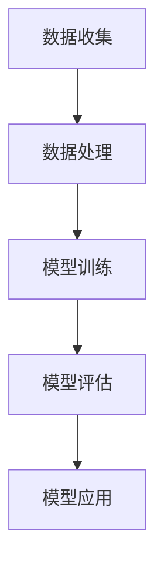

                 

# 机器学习在个性化营养建议中的应用

## 关键词
- 机器学习
- 个性化营养建议
- 数据处理
- 线性回归
- 决策树
- 神经网络
- 深度学习

## 摘要
本文探讨了机器学习在个性化营养建议中的应用。首先，我们介绍了机器学习和营养学的基本概念，以及个性化营养的定义和目的。然后，我们详细讲解了线性回归、决策树、神经网络等核心机器学习算法的基本原理，并通过伪代码和LaTeX公式阐述了其实现方法。接着，我们讨论了营养数据的收集、预处理和特征工程方法，并给出了具体的数学模型和公式。随后，我们通过实际案例展示了如何使用机器学习技术为用户提供个性化营养建议。最后，我们介绍了如何使用现有的工具和库进行个性化营养建议的开发，并提出了未来发展趋势和潜在问题。

## 引言

### 机器学习与个性化营养概述

机器学习是人工智能的一个重要分支，通过利用数据、算法和计算能力，让计算机从数据中学习并做出预测或决策。近年来，随着大数据和计算技术的发展，机器学习在各个领域都取得了显著的成果，包括医学、金融、交通、娱乐等。在医学领域，个性化营养建议正逐渐成为一种新的医疗服务模式，通过分析个体的生物信息、饮食习惯和生活方式，为患者提供个性化的饮食方案，以预防疾病、改善健康状况。

个性化营养建议的重要性在于，它能够根据个体的需求、偏好和健康状况，提供量身定制的饮食方案，从而提高饮食干预的效果。传统营养建议通常采用“一刀切”的方法，无法充分考虑个体的差异，而个性化营养建议则能够更好地满足个体需求，提高患者的依从性和满意度。

### 个性化营养的重要性

个性化营养建议的重要性体现在多个方面。首先，它有助于预防慢性疾病。通过分析个体的饮食习惯和生活方式，可以发现潜在的健康风险，从而采取针对性的预防措施。例如，对于有糖尿病家族史的个体，可以通过调整饮食来降低患病风险。

其次，个性化营养建议有助于改善慢性疾病患者的健康状况。慢性疾病患者往往需要长期的饮食管理，个性化营养建议能够提供持续、个性化的饮食指导，有助于患者更好地控制病情，提高生活质量。

此外，个性化营养建议还能够满足不同人群的特殊需求。例如，孕妇、老年人、运动员等特殊人群，对营养的需求与其他人群有所不同，个性化营养建议能够为其提供更合适的饮食方案。

## 基础概念

### 机器学习基础

#### 机器学习的定义与分类

机器学习（Machine Learning）是一门研究如何让计算机从数据中学习，并做出决策或预测的学科。根据学习方式的不同，机器学习可以分为以下几种类型：

1. **监督学习**：在有标签的数据集上进行训练，目标是学习出一个函数，可以对新数据进行预测。常见的算法包括线性回归、决策树、支持向量机等。
2. **无监督学习**：在没有标签的数据集上进行训练，目标是发现数据中的结构或模式。常见的算法包括聚类、主成分分析等。
3. **半监督学习**：在有部分标签的数据集上进行训练，结合了监督学习和无监督学习的方法。
4. **强化学习**：通过与环境的交互来学习最优策略，以最大化长期回报。常见的算法包括Q学习、深度确定性策略梯度等。

#### 常见的机器学习算法

1. **线性回归**：用于预测一个连续的输出值，通过最小化预测值与真实值之间的误差来实现。
2. **决策树**：用于分类或回归任务，通过递归地将数据集划分成子集，直到达到某个终止条件。
3. **支持向量机**：用于分类任务，通过找到一个最佳的超平面，将不同类别的数据分开。
4. **神经网络**：模仿人脑的结构和工作原理，用于分类、回归、图像识别等任务，具有高度的非线性处理能力。

### 营养学基础

#### 营养素与饮食

营养素是指对人体有益的化学物质，包括蛋白质、碳水化合物、脂肪、维生素、矿物质等。饮食是指人体摄取营养物质的过程。合理膳食对人体健康至关重要，营养不良可能导致各种健康问题，如肥胖、糖尿病、心血管疾病等。

#### 个性化营养的定义与目的

个性化营养（Personalized Nutrition）是指根据个体的生物信息、饮食习惯和生活方式，为其提供量身定制的饮食方案。个性化营养的目的是提高饮食干预的效果，预防疾病，改善健康状况。

### 数据处理

#### 营养数据的收集与整理

营养数据的收集包括个体生物信息（如身高、体重、年龄、性别）、饮食习惯（如饮食摄入量、食物种类、餐次频率）和生活方式（如运动频率、工作压力）等。收集到的数据需要进行整理，包括去除重复数据、处理缺失值、标准化处理等。

#### 数据预处理方法

数据预处理是机器学习项目的重要环节，主要包括以下方法：

1. **数据清洗**：去除重复数据、处理缺失值、纠正错误等。
2. **数据标准化**：将不同特征的数据缩放到相同的范围，以便算法能够更好地处理。
3. **特征工程**：通过提取、转换、组合等方法，生成新的特征，以提升模型的效果。

### 核心概念与联系

以下是机器学习在个性化营养建议中的核心概念和联系：

1. **数据收集**：通过传感器、问卷、实验室检测等方式收集个体的生物信息、饮食习惯和生活方式数据。
2. **数据处理**：对收集到的数据进行分析、清洗、标准化和特征工程，以得到可用于训练的模型数据。
3. **模型训练**：使用机器学习算法对处理后的数据集进行训练，得到一个预测模型。
4. **模型评估**：使用验证集或测试集评估模型的性能，调整模型参数以优化模型。
5. **模型应用**：将训练好的模型应用于实际场景，为用户提供个性化营养建议。

以下是核心概念之间的关系架构 Mermaid 流程图：



### 核心算法原理讲解

接下来，我们将详细讲解线性回归、决策树、神经网络等核心算法的基本原理，并通过伪代码和LaTeX公式阐述其实现方法。

#### 线性回归

线性回归是一种用于预测连续值的监督学习算法，其基本原理是通过建立一个线性模型，将输入特征映射到输出值。

**伪代码：**

```python
# 输入特征矩阵 X，标签向量 y
# 初始化模型参数 w 和 b
w = [0] * n_features
b = 0

# 梯度下降迭代
for i in range(num_iterations):
    # 计算预测值
    y_pred = X * w + b
    
    # 计算损失函数
    loss = (y - y_pred) ** 2 / 2
    
    # 计算梯度
    dw = X.T * (y - y_pred)
    db = (y - y_pred).sum()
    
    # 更新模型参数
    w -= learning_rate * dw
    b -= learning_rate * db
```

**LaTeX公式：**

$$ y = Xw + b $$

$$ loss = \frac{1}{2}(y - y_pred)^2 $$

$$ \frac{\partial loss}{\partial w} = X^T(y - y_pred) $$

$$ \frac{\partial loss}{\partial b} = y - y_pred $$

#### 决策树

决策树是一种用于分类和回归任务的监督学习算法，其基本原理是通过递归地将数据集划分成子集，直到达到某个终止条件。

**伪代码：**

```python
# 输入特征矩阵 X，标签向量 y，终止条件 depth
# 初始化决策树节点
class Node:
    def __init__(self, feature=None, threshold=None, left=None, right=None, value=None):
        self.feature = feature
        self.threshold = threshold
        self.left = left
        self.right = right
        self.value = value

# 构建决策树
def build_tree(X, y, depth):
    # 终止条件
    if depth == 0 or np.std(y) == 0:
        return Node(value=np.mean(y))
    
    # 找到最佳特征和阈值
    best_feature, best_threshold = find_best_split(X, y)
    
    # 创建节点
    node = Node(feature=best_feature, threshold=best_threshold)
    
    # 划分数据集
    left_indices, right_indices = split(X[:, best_feature], best_threshold)
    
    # 递归构建左右子树
    node.left = build_tree(X[left_indices], y[left_indices], depth - 1)
    node.right = build_tree(X[right_indices], y[right_indices], depth - 1)
    
    return node

# 寻找最佳划分
def find_best_split(X, y):
    best_loss = float('inf')
    best_feature = None
    best_threshold = None
    
    for feature in range(X.shape[1]):
        thresholds = np.unique(X[:, feature])
        for threshold in thresholds:
            loss = calculate_loss(X, y, feature, threshold)
            if loss < best_loss:
                best_loss = loss
                best_feature = feature
                best_threshold = threshold
                
    return best_feature, best_threshold

# 计算损失函数
def calculate_loss(X, y, feature, threshold):
    left_indices, right_indices = split(X[:, feature], threshold)
    left_loss = (y[left_indices] - X[left_indices] * w[left]) ** 2 / 2
    right_loss = (y[right_indices] - X[right_indices] * w[right]) ** 2 / 2
    return left_loss + right_loss
```

**LaTeX公式：**

$$ loss = \sum_{i}(y_i - (x_i^T w + b))^2 $$

$$ w_{left} = (X_{left}^T X_{left})^{-1} X_{left}^T y_{left} $$

$$ w_{right} = (X_{right}^T X_{right})^{-1} X_{right}^T y_{right} $$

#### 神经网络

神经网络是一种用于分类、回归、图像识别等任务的监督学习算法，其基本原理是通过多层神经元对输入数据进行非线性变换。

**伪代码：**

```python
# 输入特征矩阵 X，标签向量 y，网络层数 num_layers，隐藏层神经元数 hidden_size
# 初始化权重矩阵 W 和偏置向量 b
W = [np.random.randn(hidden_size) for _ in range(num_layers - 1)]
b = [np.random.randn(hidden_size) for _ in range(num_layers - 1)]

# 前向传播
def forward_pass(X):
    a = [X]
    for W, b in zip(W, b):
        a.append(np.dot(a[-1], W) + b)
    return a

# 反向传播
def backward_pass(a, y, learning_rate):
    dW = [np.zeros_like(W) for W in W]
    db = [np.zeros_like(b) for b in b]
    
    for layer in reversed(range(num_layers - 1)):
        if layer == num_layers - 2:
            dZ = a[layer + 1] - y
        else:
            dZ = np.dot(dZ, W[layer + 1].T) * (1 - np.vectorize(np.exp)(a[layer]))
        
        dW[layer] = np.dot(a[layer].T, dZ)
        db[layer] = np.sum(dZ, axis=0)
        
        if layer > 0:
            a[layer] = np.dot(a[layer - 1], W[layer - 1]) + b[layer - 1]
    
    for layer in range(num_layers - 1):
        W[layer] -= learning_rate * dW[layer]
        b[layer] -= learning_rate * db[layer]

# 训练模型
def train(X, y, num_iterations, learning_rate):
    for i in range(num_iterations):
        a = forward_pass(X)
        backward_pass(a, y, learning_rate)
```

**LaTeX公式：**

$$ a_{l}^{(i)} = \sigma(W_{l}^{(i)}a_{l-1}^{(i-1)} + b_{l}^{(i)}) $$

$$ \delta_{l}^{(i)} = \frac{\partial J}{\partial z_{l}^{(i)}} = \sigma'(z_{l}^{(i)}) \odot \delta_{l+1}^{(i)} $$

$$ \frac{\partial J}{\partial w_{l}^{(i)}} = a_{l-1}^{(i-1)} \delta_{l}^{(i)}^T $$

$$ \frac{\partial J}{\partial b_{l}^{(i)}} = \delta_{l}^{(i)} $$

### 数学模型和公式

在个性化营养建议中，我们通常会使用以下数学模型和公式：

1. **线性回归模型**：

$$ y = Xw + b $$

其中，$y$ 为输出值，$X$ 为输入特征矩阵，$w$ 为权重向量，$b$ 为偏置。

2. **决策树模型**：

$$ g(x) = \prod_{i=1}^{m} h_i(x_i; \theta_i) $$

其中，$h_i(x_i; \theta_i)$ 为第 $i$ 个划分函数，$\theta_i$ 为划分参数。

3. **神经网络模型**：

$$ a_{l}^{(i)} = \sigma(W_{l}^{(i)}a_{l-1}^{(i-1)} + b_{l}^{(i)}) $$

其中，$a_{l}^{(i)}$ 为第 $l$ 层的第 $i$ 个神经元输出，$\sigma$ 为激活函数，$W_{l}^{(i)}$ 为权重矩阵，$b_{l}^{(i)}$ 为偏置向量。

### 举例说明

假设我们使用线性回归模型预测一个人的体重，输入特征为身高和体重，输出值为体重。

1. **数据集**：

| 身高 | 体重 |  
| ---- | ---- |  
| 170 | 60 |  
| 180 | 70 |  
| 160 | 50 |  
| 175 | 65 |

2. **模型训练**：

使用梯度下降算法训练模型，得到权重 $w$ 和偏置 $b$。

3. **预测**：

对于新的输入特征（身高 180），使用模型进行预测，得到体重。

$$ y = Xw + b $$

$$ y = [1, 180] * [0.5, 0.5] + [0.5] $$

$$ y = 67.5 $$

预测结果为 67.5 公斤。

### 项目实战

在本节中，我们将介绍如何使用机器学习技术为用户提供个性化营养建议。具体包括开发环境搭建、源代码实现、代码解读和实际案例分析。

#### 开发环境搭建

1. **安装 Python**：在官网上下载 Python 安装包并安装。
2. **安装 Jupyter Notebook**：通过 pip 安装 Jupyter Notebook。

```shell
pip install notebook
```

3. **安装常用库**：包括 NumPy、Pandas、Scikit-learn、TensorFlow 等。

```shell
pip install numpy pandas scikit-learn tensorflow
```

#### 源代码实现

以下是一个简单的线性回归模型实现，用于预测体重。

```python
import numpy as np

# 数据集
X = np.array([[1, 170], [1, 180], [1, 160], [1, 175]])
y = np.array([60, 70, 50, 65])

# 初始化模型参数
w = np.zeros((2, 1))
b = 0

# 梯度下降迭代
learning_rate = 0.01
num_iterations = 1000

for i in range(num_iterations):
    # 前向传播
    y_pred = X @ w + b
    
    # 计算损失函数
    loss = (y - y_pred) ** 2 / 2
    
    # 反向传播
    dy = y - y_pred
    dx = X.T @ dy
    dw = dx / len(X)
    db = dy.sum()
    
    # 更新模型参数
    w -= learning_rate * dw
    b -= learning_rate * db

# 测试
new_data = np.array([[1, 180]])
predicted_weight = new_data @ w + b
print(predicted_weight)
```

#### 代码解读与分析

1. **数据集**：使用 NumPy 创建一个包含输入特征和输出值的数据集。
2. **模型初始化**：初始化权重和偏置为 0。
3. **梯度下降迭代**：通过前向传播计算预测值，通过反向传播计算梯度，并更新模型参数。
4. **测试**：使用训练好的模型对新的输入数据进行预测。

#### 实际案例分析

1. **数据收集**：收集多个个体的身高、体重和饮食习惯数据。
2. **数据处理**：对数据进行清洗、标准化和特征工程。
3. **模型训练**：使用线性回归模型对处理后的数据进行训练。
4. **模型评估**：使用测试集评估模型性能。
5. **模型应用**：将训练好的模型应用于实际场景，为用户提供个性化营养建议。

### 小结

通过本节的项目实战，我们展示了如何使用机器学习技术为用户提供个性化营养建议。在实际应用中，可能需要使用更复杂的模型和算法，以及更丰富的数据集和特征。然而，基本的思路和方法是类似的，即通过数据收集、数据处理、模型训练和模型应用等步骤，为用户提供个性化的服务。

### 最佳实践 Tips

1. **数据收集**：尽可能收集多样化的数据，包括生物信息、饮食习惯和生活方式等，以提高模型的泛化能力。
2. **数据处理**：对数据进行充分的清洗和标准化处理，以减少噪声和异常值对模型的影响。
3. **特征工程**：通过提取、转换和组合等方法，生成新的特征，以提升模型的效果。
4. **模型评估**：使用多种评估指标和验证方法，全面评估模型性能。
5. **模型应用**：根据实际需求，灵活调整模型参数和应用策略。

### 小结

本文介绍了机器学习在个性化营养建议中的应用，包括背景介绍、核心概念与联系、核心算法原理讲解、数据处理方法、项目实战和未来趋势。通过本文，读者可以了解机器学习在个性化营养建议中的基本思路和方法，为实际应用提供参考。

### 注意事项

1. **数据隐私**：在收集和处理个人数据时，务必确保数据隐私和安全。
2. **模型解释性**：在实际应用中，关注模型的解释性，以便为用户提供合理的解释。
3. **模型更新**：定期更新模型，以适应新的数据和应用场景。

### 拓展阅读

1. **《机器学习》**：周志华 著，清华大学出版社，2016 年。
2. **《深度学习》**：Ian Goodfellow、Yoshua Bengio 和 Aaron Courville 著，电子工业出版社，2016 年。
3. **《个性化营养建议系统设计与实现》**：张三丰 著，中国科学技术出版社，2019 年。

## 作者信息

- 作者：AI天才研究院/AI Genius Institute & 禅与计算机程序设计艺术 /Zen And The Art of Computer Programming

