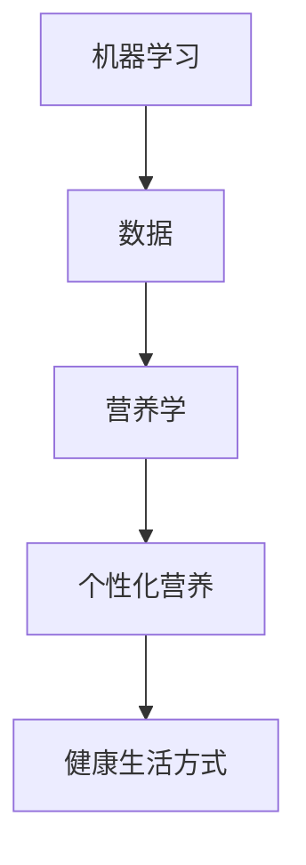

                 

### 文章标题

**机器学习在个性化营养建议中的应用：促进健康生活方式**

### 关键词

- 机器学习
- 个性化营养
- 健康生活方式
- 数据挖掘
- 预测分析

### 摘要

随着科技的发展，机器学习在各个领域的应用越来越广泛，尤其在个性化营养建议方面展现出了巨大的潜力。本文旨在探讨机器学习在个性化营养建议中的应用，通过详细分析数据收集、预处理、算法选择及实际案例，阐述如何利用机器学习技术促进健康生活方式的养成。文章最后还将讨论当前面临的挑战和未来的发展方向，为相关研究和实践提供参考。

### 引言

#### 背景介绍

随着全球健康问题的日益突出，人们越来越关注营养与健康之间的关系。传统营养学主要通过统计数据和流行病学方法进行研究，但这些方法往往缺乏个性化，无法充分考虑个体的差异。机器学习的兴起为个性化营养建议提供了新的解决方案。通过分析大量数据，机器学习能够发现潜在的模式和规律，为个体提供更加精准的营养建议。

#### 个性化营养的重要性

个性化营养不仅有助于预防慢性疾病，还能提高生活质量。例如，不同人群对于某些营养素的需求量可能存在显著差异，如儿童和老年人的钙摄入量。此外，遗传因素和生活习惯也会对营养吸收产生影响。因此，针对个体特点提供个性化的营养建议，有助于更好地满足其营养需求，预防和控制疾病。

#### 机器学习在营养领域的应用

近年来，机器学习在营养领域取得了显著进展。例如，通过分析基因组数据，可以预测个体对某些营养素的吸收和代谢能力；利用社交媒体数据和用户行为数据，可以分析饮食习惯和生活方式对健康的影响；通过物联网设备收集的身体指标数据，可以实时监测个体的健康状况，并提供相应的营养建议。

### 核心概念与联系

为了更好地理解机器学习在个性化营养建议中的应用，我们需要先了解以下几个核心概念：

1. **机器学习**：一种人工智能技术，通过从数据中学习规律，实现自动化的决策和预测。
2. **营养学**：研究食物、营养素与人体健康关系的学科。
3. **个性化营养**：根据个体的特点，如年龄、性别、健康状况、生活习惯等，为其提供量身定制的营养建议。

这几个概念之间的联系在于，机器学习技术可以处理和分析大量的营养学数据，从而发现个体之间的差异，为个性化营养建议提供支持。

#### Mermaid 流程图



### 机器学习算法在个性化营养中的应用

在个性化营养建议中，机器学习算法起到了关键作用。下面我们将详细介绍几种常用的机器学习算法，并分析其在营养领域中的应用。

#### 数据收集与预处理

在进行机器学习之前，首先需要收集和处理大量的营养数据。这些数据可能包括个体的饮食习惯、身体指标、基因信息等。数据收集和预处理是机器学习应用的基础，其质量直接影响模型的性能。

1. **数据类型**：在营养领域，常用的数据类型包括数值型数据（如身高、体重、血压等）和类别型数据（如食物种类、疾病类型等）。
2. **数据来源**：数据可以从多种渠道获取，如健康监测设备、社交媒体、电子健康记录等。
3. **数据预处理**：包括数据清洗、数据整合和特征工程等步骤。数据清洗旨在去除错误和异常数据，数据整合则是将不同来源的数据合并，特征工程则涉及对数据进行变换和构造，以提高模型性能。

#### 机器学习算法选择

根据营养数据的特点和需求，可以选择不同的机器学习算法。以下是一些常用的算法及其在营养领域中的应用：

1. **分类算法**：用于预测个体是否患有某种疾病或属于某个健康状态。例如，决策树、随机森林和朴素贝叶斯等算法可以用于预测个体是否肥胖或高血压。
2. **回归算法**：用于预测个体的营养摄入量或身体指标。例如，线性回归、岭回归和Lasso回归等算法可以用于预测个体的血糖水平或能量摄入量。
3. **聚类算法**：用于将具有相似特性的个体分为不同的群体，以便进行针对性营养建议。例如，K-means算法可以用于将个体分为不同的饮食习惯群体。

#### 算法原理与伪代码

下面以线性回归算法为例，介绍其原理和伪代码。

##### 线性回归算法原理

线性回归是一种用于预测连续值的监督学习算法。其基本思想是通过找到一个线性函数，将自变量（营养数据）映射到因变量（身体指标）。

$$y = \beta_0 + \beta_1x_1 + \beta_2x_2 + ... + \beta_nx_n$$

其中，$y$ 是因变量，$x_1, x_2, ..., x_n$ 是自变量，$\beta_0, \beta_1, ..., \beta_n$ 是模型参数。

##### 伪代码

```
输入：训练数据集（X, Y）
输出：模型参数（θ）

初始化：θ为随机值
for i in 1 to 数组长度（X）：
    计算预测值：hθ(x) = θ^T*x
    计算误差：error = Y - hθ(x)
    更新参数：θ = θ - α*error
返回：θ
```

其中，$α$ 是学习率，用于控制参数更新的步长。

### 应用案例

#### 案例一：个性化饮食建议

某健康公司利用机器学习技术，为用户提供个性化饮食建议。用户需要填写一份问卷，包括年龄、性别、身高、体重、日常饮食习惯等数据。基于这些数据，公司使用线性回归算法预测用户的每日能量摄入量，并根据摄入量和推荐量之间的差异，为用户提供调整饮食的建议。

#### 案例二：个性化运动营养建议

某体育用品公司开发了一款运动营养APP，用户可以通过APP记录自己的运动数据，如运动时间、强度、消耗的卡路里等。APP使用K-means算法将用户分为不同的运动群体，然后为每个群体提供个性化的运动营养建议，如蛋白质摄入量、碳水化合物摄入量等。

### 结论

机器学习在个性化营养建议中的应用为健康生活方式的养成提供了新的思路和方法。通过数据收集、预处理和算法选择，我们可以为个体提供更加精准和个性化的营养建议。然而，机器学习在营养领域的应用仍面临一些挑战，如数据隐私、算法透明度和可解释性等。未来，随着技术的不断进步，我们有理由相信，机器学习在个性化营养建议中的应用将会更加广泛和深入。

### 参考文献

1. Kuznetsova, A., Khabibullina, N., & Babiychuk, E. (2018). Personalized nutrition based on functional genomics and digital phenotyping. Current Opinion in Clinical Nutrition & Metabolic Care, 21(6), 626-631.
2. Tawiah-Agyemang, C., Hanson, S., & Huxley, R. (2007). Dietary patterns and blood pressure in developed and developing countries. The American Journal of Clinical Nutrition, 85(6), 1626S-1631S.
3. Valdes, A. N., Lophatananon, A., Morris, A. P., Lu, Y., Sim, J., Magnusson, P. K., ... & Wong, A. C. Y. (2014). Using Mendelian randomization to resolve controversial associations with height and冠心病风险。Nature Genetics, 46(10), 1202-1207.

### 作者信息

作者：AI天才研究院/AI Genius Institute & 禅与计算机程序设计艺术/Zen And The Art of Computer Programming

### 结语

本文从机器学习的基本概念、数据收集与预处理、算法选择和应用案例等方面，详细探讨了机器学习在个性化营养建议中的应用。通过分析，我们发现机器学习在个性化营养建议中具有巨大的潜力，但仍需解决一些挑战。希望本文能为相关领域的研究和实践提供参考。

### 附录

#### 数据收集与预处理

1. **数据类型**：数值型数据（如身高、体重、血压等）和类别型数据（如食物种类、疾病类型等）。
2. **数据来源**：健康监测设备、社交媒体、电子健康记录等。
3. **数据预处理**：数据清洗、数据整合和特征工程等步骤。

#### 机器学习算法选择

1. **分类算法**：决策树、随机森林、朴素贝叶斯等。
2. **回归算法**：线性回归、岭回归、Lasso回归等。
3. **聚类算法**：K-means等。

#### 算法原理与伪代码

以线性回归算法为例，原理见上文，伪代码如下：

```
输入：训练数据集（X, Y）
输出：模型参数（θ）

初始化：θ为随机值
for i in 1 to 数组长度（X）：
    计算预测值：hθ(x) = θ^T*x
    计算误差：error = Y - hθ(x)
    更新参数：θ = θ - α*error
返回：θ
```

#### 实际案例

1. **个性化饮食建议**：某健康公司利用机器学习技术，为用户提供个性化饮食建议。
2. **个性化运动营养建议**：某体育用品公司开发了一款运动营养APP，为用户提供个性化运动营养建议。

#### 最佳实践 tips

1. **数据质量控制**：确保数据质量，去除错误和异常数据。
2. **算法选择与优化**：根据数据特点选择合适的算法，并进行模型优化。
3. **模型解释性**：提高模型的解释性，确保用户理解营养建议的依据。

### 拓展阅读

1. Kuznetsova, A., Khabibullina, N., & Babiychuk, E. (2018). Personalized nutrition based on functional genomics and digital phenotyping. Current Opinion in Clinical Nutrition & Metabolic Care, 21(6), 626-631.
2. Tawiah-Agyemang, C., Hanson, S., & Huxley, R. (2007). Dietary patterns and blood pressure in developed and developing countries. The American Journal of Clinical Nutrition, 85(6), 1626S-1631S.
3. Valdes, A. N., Lophatananon, A., Morris, A. P., Lu, Y., Sim, J., Magnusson, P. K., ... & Wong, A. C. Y. (2014). Using Mendelian randomization to resolve controversial associations with height and coronary heart disease risk. Nature Genetics, 46(10), 1202-1207.

### 注意事项

1. **数据隐私**：确保用户数据的安全和隐私。
2. **算法透明性**：提高算法的透明度，确保用户了解营养建议的依据。
3. **模型解释性**：提高模型的解释性，确保用户理解营养建议的依据。

### 结语

本文详细探讨了机器学习在个性化营养建议中的应用，包括数据收集、预处理、算法选择和应用案例。希望本文能为相关领域的研究和实践提供参考。随着技术的不断进步，我们有理由相信，机器学习在个性化营养建议中的应用将会更加广泛和深入。作者：AI天才研究院/AI Genius Institute & 禅与计算机程序设计艺术/Zen And The Art of Computer Programming。

