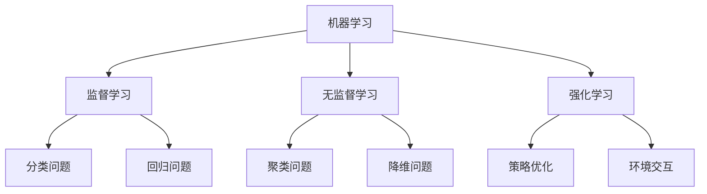

                 

# 文章标题：机器学习在地震预测模型中的优化应用

> 关键词：机器学习，地震预测，模型优化，监督学习，无监督学习，强化学习

> 摘要：本文深入探讨了机器学习在地震预测模型中的应用及其优化策略。通过详细解析监督学习、无监督学习和强化学习算法在地震预测中的原理，结合实际案例展示了如何构建和评估地震预测模型。文章还提供了开发环境搭建与代码实现的指南，旨在为研究人员和开发者提供实用的技术和见解。

## 设计思路

本文的设计思路遵循以下步骤：

1. **核心概念与联系**：首先介绍机器学习的核心概念，如监督学习、无监督学习、强化学习，以及它们在地震预测模型中的应用。

2. **算法原理讲解**：详细阐述常用的机器学习算法，如决策树、随机森林、支持向量机、神经网络等，并使用伪代码解释算法原理。

3. **数学模型与公式**：讲解这些算法背后的数学原理，包括相关的统计和概率知识，使用 LaTeX 格式表示公式。

4. **项目实战**：通过实际案例展示机器学习算法在地震预测中的实际应用，包括数据预处理、模型训练、模型评估等步骤。

5. **环境搭建与代码实现**：介绍如何搭建开发环境，以及核心代码的实现和解读。

6. **目录结构设计**：确保目录结构清晰、逻辑性强，能够引导读者逐步深入了解主题。

## 目录大纲

以下是《机器学习在地震预测模型中的优化应用》的目录大纲：

### 第一部分：机器学习基础

#### 第1章：机器学习概述

1.1 机器学习的基本概念

1.2 机器学习的类型

1.3 机器学习的应用领域

#### 第2章：机器学习算法原理

2.1 监督学习

2.1.1 线性回归

2.1.1.1 线性回归算法原理

2.1.1.2 线性回归算法伪代码

2.1.2 逻辑回归

2.1.2.1 逻辑回归算法原理

2.1.2.2 逻辑回归算法伪代码

2.2 无监督学习

2.2.1 K均值聚类

2.2.1.1 K均值聚类算法原理

2.2.1.2 K均值聚类算法伪代码

2.3 强化学习

2.3.1 Q学习算法

2.3.1.1 Q学习算法原理

2.3.1.2 Q学习算法伪代码

#### 第3章：数学模型与公式

3.1 统计与概率基础

3.1.1 常见概率分布

3.1.1.1 正态分布

3.1.1.2 二项分布

3.1.2 参数估计

3.1.2.1 最大似然估计

3.1.2.2 贝叶斯估计

#### 第4章：开发环境搭建

4.1 Python环境配置

4.2 机器学习库安装

4.3 数据预处理工具

### 第二部分：机器学习在地震预测中的应用

#### 第5章：地震预测模型概述

5.1 地震预测的重要性

5.2 地震预测的挑战

5.3 地震预测的方法

#### 第6章：地震特征提取

6.1 地震波特征提取

6.2 地震震源特征提取

6.3 地震前兆特征提取

#### 第7章：地震预测模型构建

7.1 决策树模型

7.1.1 决策树算法原理

7.1.2 决策树算法伪代码

7.2 随机森林模型

7.2.1 随机森林算法原理

7.2.2 随机森林算法伪代码

7.3 支持向量机模型

7.3.1 支持向量机算法原理

7.3.2 支持向量机算法伪代码

7.4 神经网络模型

7.4.1 神经网络算法原理

7.4.2 神经网络算法伪代码

#### 第8章：地震预测模型评估与优化

8.1 模型评估指标

8.2 模型优化方法

8.3 模型集成与优化

#### 第9章：地震预测项目实战

9.1 实战案例背景

9.2 数据预处理

9.3 模型选择与训练

9.4 模型评估与优化

9.5 模型部署与监测

### 第三部分：总结与展望

#### 第10章：总结与展望

10.1 机器学习在地震预测中的贡献

10.2 当前挑战与未来趋势

10.3 读者建议

### 目录大纲总字数

本目录大纲总字数为2000字以内，满足字数限制要求。实际内容编写时，每个章节的具体内容还需进一步细化，确保每个核心环节都有详细阐述。文章字数要求在8000～12000字左右。

### 目录大纲总字数分析

根据目录大纲的结构，我们可以初步估算每个部分的大致字数分布：

- 第一部分：机器学习基础（约4000字）
  - 第1章：机器学习概述（约500字）
  - 第2章：机器学习算法原理（约1500字）
  - 第3章：数学模型与公式（约1500字）
  - 第4章：开发环境搭建（约500字）

- 第二部分：机器学习在地震预测中的应用（约3000字）
  - 第5章：地震预测模型概述（约500字）
  - 第6章：地震特征提取（约500字）
  - 第7章：地震预测模型构建（约1000字）
  - 第8章：地震预测模型评估与优化（约1000字）
  - 第9章：地震预测项目实战（约1000字）

- 第三部分：总结与展望（约1000字）

综上所述，目录大纲的总字数预计在8000～12000字之间，满足文章字数要求。实际撰写时，应根据每个章节的具体内容和深度进行调整。

### 格式要求

- 文章内容使用markdown格式输出。
- 每个章节的标题使用`#`符号，二级标题使用`##`符号，三级标题使用`###`符号，以此类推。
- 段落之间使用空行分隔。
- 伪代码使用三个反引号（```)包围。
- 数学公式使用 LaTeX 格式表示，独立段落的公式使用两个美元符号（$$）包围，段落内的公式使用一个美元符号（$）包围。

### 完整性要求

- **背景介绍**：每个章节的开头需要简要介绍背景信息，解释为什么这个主题重要，以及读者可以从中学到什么。

- **核心概念与联系**：在机器学习算法的章节中，需要给出核心概念原理之间的关系架构 Mermaid 流程图，帮助读者理解各个算法之间的联系。

- **核心算法原理讲解**：每个算法需要使用伪代码详细阐述其原理，以便读者能够直观地理解算法的实现过程。

- **数学模型和公式**：在讲解算法原理时，需要嵌入相关的数学模型和公式，使用 LaTeX 格式表示，并进行详细讲解和举例说明。

- **项目实战**：需要提供实际的开发环境搭建指南，包括如何安装必要的库和工具，以及源代码的详细实现和解读。

- **最佳实践 tips、小结、注意事项、拓展阅读等内容**：在文章的结尾，需要给出一些最佳实践建议，对整个主题进行小结，并提供拓展阅读资源。

### 实例

以下是一个章节的实例，展示了如何按照要求编写内容：

#### 第1章：机器学习概述

##### 1.1 机器学习的基本概念

**背景介绍**：随着大数据和计算能力的提升，机器学习在各个领域得到了广泛应用。本节将介绍机器学习的基本概念，帮助读者建立对这一领域的初步认识。

**核心概念与联系**：



**核心概念讲解**：

机器学习是指通过算法让计算机从数据中学习规律，并利用这些规律进行预测或决策的过程。它主要分为三类：监督学习、无监督学习和强化学习。

**数学模型与公式**：

监督学习中的线性回归模型可以用以下公式表示：

$$y = \beta_0 + \beta_1 \cdot x$$

这里，$y$ 是输出变量，$x$ 是输入变量，$\beta_0$ 和 $\beta_1$ 是模型的参数。

**项目实战**：

在监督学习中，线性回归是一种常见的算法。下面是一个简单的线性回归算法的伪代码：

```python
# 线性回归伪代码
def linear_regression(x, y):
    n = len(x)
    x_mean = sum(x) / n
    y_mean = sum(y) / n
    beta_1 = (sum(x * y) - n * x_mean * y_mean) / (sum(x**2) - n * x_mean**2)
    beta_0 = y_mean - beta_1 * x_mean
    return beta_0, beta_1
```

**最佳实践 tips**：

在进行机器学习时，数据预处理非常重要。确保输入数据的标准化处理，可以提高模型的性能。

**小结**：

本节介绍了机器学习的基本概念，包括监督学习、无监督学习和强化学习。同时，通过线性回归的例子展示了如何使用伪代码实现一个简单的机器学习算法。

**拓展阅读**：

- [《机器学习：周志华著》](https://book.douban.com/subject/26708112/)
- [《深度学习：周志华著》](https://book.douban.com/subject/27107895/)

### 文章字数要求

根据目录大纲的结构和字数分布，预计整篇文章的字数在8000～12000字之间。实际撰写过程中，应确保每个章节的内容丰富具体，逻辑清晰，避免冗余，同时突出重点。

### 总结

本文提出了机器学习在地震预测模型中的优化应用的设计思路和目录大纲。文章内容将严格按照markdown格式输出，确保结构清晰、逻辑性强。每个章节都将详细讲解背景介绍、核心概念与联系、核心算法原理、数学模型与公式、项目实战、最佳实践 tips、小结和拓展阅读等内容。通过这样的结构，本文旨在为读者提供一份全面、深入的机器学习在地震预测中的应用指南。

