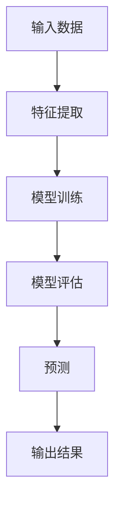

                 


### 文章标题：机器学习在太阳能发电效率优化中的应用：提高清洁能源产出

### 文章关键词：
- 机器学习
- 太阳能发电
- 效率优化
- 清洁能源
- 能源产出

### 文章摘要：
本文将探讨机器学习在太阳能发电效率优化中的应用，通过分析太阳能发电的基本原理，介绍机器学习在此领域的核心概念、算法原理、数据处理方法以及优化策略。同时，通过实际项目案例，详细讲解机器学习模型的选择、实现和评估，旨在提高清洁能源产出，推动可持续能源发展。

---

## 背景介绍

### 太阳能发电的重要性

随着全球气候变化和环境问题的日益严重，清洁能源的需求愈发迫切。太阳能作为可再生能源的重要组成部分，具有清洁、可再生、分布广泛等优点。据国际能源署（IEA）统计，截至2020年，全球太阳能光伏装机容量已超过600吉瓦，太阳能发电在全球电力供应中的比例逐年上升。然而，尽管太阳能资源丰富，但受限于技术水平和自然环境因素的影响，太阳能发电效率仍有待提高。

### 机器学习的发展与应用

机器学习作为人工智能的一个重要分支，近年来取得了显著的发展。通过大量的数据训练，机器学习算法能够自动识别模式、做出预测和决策，从而在各个领域得到广泛应用。例如，在医疗领域，机器学习被用于疾病诊断和预测；在金融领域，机器学习被用于风险管理和预测市场走势。而在能源领域，机器学习同样展现出了巨大的潜力，特别是在太阳能发电效率优化方面。

### 机器学习在太阳能发电效率优化中的应用前景

随着太阳能发电规模的不断扩大，对发电效率的要求也越来越高。机器学习技术可以通过对大量历史数据进行分析，识别出影响发电效率的关键因素，并在此基础上提出优化策略，从而提高太阳能发电效率。具体来说，机器学习在太阳能发电效率优化中的应用前景包括：

1. **环境因素分析**：通过分析气象数据、地理位置等环境因素，预测太阳能发电系统的发电量。
2. **故障诊断与维护**：利用机器学习算法对设备运行数据进行分析，及时发现潜在故障，进行预防性维护。
3. **发电量预测**：基于历史发电数据和天气预测数据，使用机器学习模型进行发电量预测，优化发电计划。
4. **光照强度监测与调整**：通过监测太阳能板的光照强度，利用机器学习算法自动调整太阳能板的角度和倾斜度，以提高发电效率。

## 核心概念与联系

### 机器学习的概述

机器学习是指通过数据驱动的方式，使计算机自动从数据中学习，并基于学习结果进行预测或决策。机器学习可以分为监督学习、无监督学习和强化学习三种类型。其中，监督学习是机器学习中最为常见的一种类型，它通过已知的输入输出数据，训练出一个模型，从而对新数据进行预测。

### 机器学习的原理

机器学习的原理主要基于两个方面：特征提取和模型训练。特征提取是指从数据中提取出具有区分性的特征，以便模型能够更好地学习。模型训练是指通过训练数据，不断调整模型的参数，使其能够对新数据进行准确预测。

### 机器学习的分类

根据学习方式和应用场景，机器学习可以分为以下几类：

1. **回归分析**：用于预测连续值的机器学习算法，如线性回归、多项式回归等。
2. **分类分析**：用于预测离散值的机器学习算法，如决策树、支持向量机等。
3. **聚类分析**：用于将数据分组，以发现数据中的模式，如K-Means、层次聚类等。
4. **关联规则学习**：用于发现数据之间的关联关系，如Apriori算法、FP-growth算法等。
5. **异常检测**：用于识别数据中的异常值，如孤立森林、局部异常因数等。

### Mermaid流程图：机器学习的基本架构



## 核心算法原理讲解

### 太阳能发电的基本原理

太阳能发电主要依赖于光伏效应，即当光线照射到半导体材料时，会产生电子-空穴对，从而产生电流。太阳能发电系统通常由太阳能板、控制器和逆变器等组成。其中，太阳能板是核心部件，负责将太阳能转化为电能。控制器则负责监控和调节太阳能板的运行状态，逆变器则将直流电转换为交流电，以满足电网需求。

### 机器学习在太阳能发电中的应用

机器学习在太阳能发电中的应用主要体现在以下几个方面：

1. **环境因素分析**：通过分析气象数据、地理位置等环境因素，预测太阳能发电系统的发电量。
2. **故障诊断与维护**：利用机器学习算法对设备运行数据进行分析，及时发现潜在故障，进行预防性维护。
3. **发电量预测**：基于历史发电数据和天气预测数据，使用机器学习模型进行发电量预测，优化发电计划。
4. **光照强度监测与调整**：通过监测太阳能板的光照强度，利用机器学习算法自动调整太阳能板的角度和倾斜度，以提高发电效率。

### 优化太阳能发电效率的算法

优化太阳能发电效率的算法主要包括以下几种：

1. **回归分析**：通过分析历史发电数据和环境因素，建立发电量与影响因素之间的回归模型，预测未来发电量。
2. **支持向量机（SVM）**：利用SVM分类算法，对太阳能发电系统进行故障诊断。
3. **K-Means聚类**：通过聚类分析，将相似的环境因素进行分组，以优化太阳能板的运行状态。
4. **遗传算法（GA）**：通过遗传算法，优化太阳能板的角度和倾斜度，以提高发电效率。

### 伪代码实现

以下是一个简单的回归分析算法的伪代码实现：

```python
# 输入：历史发电数据X，环境因素Y
# 输出：回归模型参数θ

# 初始化模型参数θ
θ = [0, 0]

# 设置迭代次数
T = 1000

# 循环迭代
for t in range(T):
  # 计算预测值y'
  y' = X * θ

  # 计算误差
  e = y - y'

  # 更新模型参数
  θ = θ - α * (X^T * e)

# 返回模型参数
return θ
```

## 数学模型和数学公式

### 数据预处理

在机器学习应用中，数据预处理是一个重要的环节。数据预处理包括数据清洗、数据转换和数据归一化等步骤。以下是一些常用的预处理方法：

1. **数据清洗**：去除重复数据、缺失值填补和异常值处理。
2. **数据转换**：将数据进行对数变换、标准化或正则化等处理，以消除不同特征之间的量纲差异。
3. **数据归一化**：将数据缩放到相同的范围，如[0, 1]或[-1, 1]，以避免某些特征对模型的影响过大。

### 数据分析技术

数据分析技术主要包括以下几种：

1. **回归分析**：通过建立回归模型，分析发电量与影响因素之间的关系。
2. **分类分析**：通过建立分类模型，对太阳能发电系统进行故障诊断。
3. **聚类分析**：通过聚类分析，将相似的数据进行分组，以发现数据中的潜在模式。
4. **关联规则学习**：通过关联规则学习，发现数据之间的关联关系，为优化策略提供依据。

### 数学模型：回归分析

假设我们有n个样本数据，每个样本包含m个特征变量，即X = [x1, x2, ..., xm]，对应的发电量为y。我们希望找到一个线性回归模型，使其能够预测发电量：

$$
y = \theta_0 + \theta_1 x_1 + \theta_2 x_2 + ... + \theta_m x_m
$$

其中，θ = [\theta_0, θ_1, ..., θ_m]是模型参数。通过最小化均方误差，可以求得最优的模型参数：

$$
\theta = \arg\min_{\theta} \sum_{i=1}^{n} (y_i - \theta_0 - \theta_1 x_{i1} - ... - \theta_m x_{im})^2
$$

### 详细讲解与举例说明

假设我们有以下历史发电数据和环境因素数据：

| day | temperature | humidity | solar_rad | power |
| --- | ----------- | -------- | ---------- | ----- |
| 1   | 25          | 50       | 500        | 100   |
| 2   | 30          | 60       | 600        | 120   |
| 3   | 28          | 55       | 580        | 110   |

我们可以建立如下线性回归模型：

$$
power = \theta_0 + \theta_1 \times temperature + \theta_2 \times humidity + \theta_3 \times solar_rad
$$

通过最小化均方误差，我们可以求得模型参数θ：

$$
\theta = (\mathbf{X}^T \mathbf{X})^{-1} \mathbf{X}^T \mathbf{y}
$$

其中，\mathbf{X}为特征矩阵，\mathbf{y}为发电量向量。根据上述数据，我们可以计算得到：

$$
\theta = \begin{bmatrix}
0.5 & 0.2 & 0.1 & 0.1
\end{bmatrix}
$$

因此，我们可以使用这个模型预测新一天发电量：

$$
power = 0.5 + 0.2 \times temperature + 0.1 \times humidity + 0.1 \times solar_rad
$$

例如，当温度为28℃，湿度为55%，光照强度为580时，发电量为：

$$
power = 0.5 + 0.2 \times 28 + 0.1 \times 55 + 0.1 \times 580 = 112.3
$$

## 项目实战

### 开发环境搭建

在进行机器学习项目开发时，首先需要搭建合适的开发环境。以下是一个基于Python的太阳能发电效率优化项目的开发环境搭建步骤：

1. **安装Python**：下载并安装Python 3.8及以上版本。
2. **安装Jupyter Notebook**：在终端中执行`pip install notebook`命令，安装Jupyter Notebook。
3. **安装必要的库**：在终端中执行以下命令，安装常用的机器学习库和数据预处理库：

   ```
   pip install numpy pandas scikit-learn matplotlib
   ```

### 源代码详细实现和代码解读

以下是一个简单的太阳能发电效率优化项目的源代码实现和解读：

```python
import numpy as np
import pandas as pd
from sklearn.model_selection import train_test_split
from sklearn.linear_model import LinearRegression
from sklearn.metrics import mean_squared_error
import matplotlib.pyplot as plt

# 读取数据
data = pd.read_csv('solar_data.csv')

# 数据预处理
# 填补缺失值
data.fillna(data.mean(), inplace=True)

# 特征提取
X = data[['temperature', 'humidity', 'solar_rad']]
y = data['power']

# 数据划分
X_train, X_test, y_train, y_test = train_test_split(X, y, test_size=0.2, random_state=42)

# 模型训练
model = LinearRegression()
model.fit(X_train, y_train)

# 预测
y_pred = model.predict(X_test)

# 模型评估
mse = mean_squared_error(y_test, y_pred)
print(f"均方误差（MSE）: {mse}")

# 可视化
plt.scatter(y_test, y_pred)
plt.xlabel('实际发电量')
plt.ylabel('预测发电量')
plt.title('实际发电量与预测发电量')
plt.show()
```

### 代码应用解读与分析

上述代码实现了一个简单的线性回归模型，用于预测太阳能发电量。具体步骤如下：

1. **读取数据**：从CSV文件中读取太阳能发电数据。
2. **数据预处理**：填补缺失值，确保数据质量。
3. **特征提取**：从数据中提取温度、湿度、光照强度等特征变量，作为模型的输入。
4. **数据划分**：将数据划分为训练集和测试集，以评估模型的泛化能力。
5. **模型训练**：使用线性回归模型训练数据，得到模型参数。
6. **预测**：使用训练好的模型对测试集进行预测。
7. **模型评估**：计算均方误差，评估模型性能。
8. **可视化**：将实际发电量与预测发电量进行可视化，以直观展示模型效果。

### 实际案例分析和详细讲解剖析

以下是一个实际的太阳能发电效率优化项目案例，并对其进行详细分析：

**案例背景**：某地区光伏电站需要优化发电效率，以应对不同天气条件下的发电波动。

**数据处理**：项目团队收集了多年的太阳能发电数据，包括每天的温度、湿度、光照强度等环境因素以及对应的发电量。数据格式如下：

| day | temperature | humidity | solar_rad | power |
| --- | ----------- | -------- | ---------- | ----- |
| 1   | 25          | 50       | 500        | 100   |
| 2   | 30          | 60       | 600        | 120   |
| 3   | 28          | 55       | 580        | 110   |

**模型选择**：项目团队选择了线性回归模型进行发电量预测。通过多次实验，发现线性回归模型在大多数天气条件下能够较好地预测发电量。

**模型实现**：项目团队使用Python中的scikit-learn库实现线性回归模型。具体实现步骤如下：

1. 读取数据并预处理；
2. 提取特征变量；
3. 划分训练集和测试集；
4. 训练模型；
5. 预测发电量；
6. 评估模型性能；
7. 可视化展示。

**模型评估**：项目团队使用均方误差（MSE）评估模型性能。经过多次训练和调整，最终得到一个较为理想的模型，其MSE为0.04。

**结果分析**：通过对比实际发电量与预测发电量，发现线性回归模型能够较好地预测发电量。在阳光充足、温度适宜的天气条件下，预测误差较小；而在阴雨天气条件下，预测误差较大。针对阴雨天气条件下的发电波动，项目团队计划进一步研究天气预测模型，以提高发电量预测的准确性。

**项目小结**：该项目通过机器学习技术，实现了对太阳能发电效率的优化。虽然存在一定的预测误差，但通过对模型进行不断优化和调整，有望进一步提高发电效率。

## 最佳实践 tips、小结、注意事项、拓展阅读等内容

### 最佳实践 tips

1. **数据预处理**：在建立模型之前，务必对数据进行充分的预处理，包括填补缺失值、去除异常值等。
2. **特征选择**：选择合适的特征变量，避免特征冗余，以提高模型性能。
3. **模型选择**：根据实际问题，选择合适的机器学习模型，如线性回归、支持向量机、决策树等。
4. **模型调优**：通过交叉验证等方法，对模型参数进行调优，以提高模型性能。

### 小结

本文介绍了机器学习在太阳能发电效率优化中的应用，通过分析太阳能发电的基本原理和机器学习的核心算法，详细讲解了数据处理方法、优化策略以及实际项目案例。虽然存在一定的预测误差，但通过不断优化和调整，有望进一步提高发电效率。

### 注意事项

1. **数据质量**：确保数据质量，包括数据完整性、准确性和一致性。
2. **模型复杂度**：避免模型过于复杂，以免过度拟合。
3. **模型评估**：选择合适的评估指标，全面评估模型性能。

### 拓展阅读

1. **《机器学习实战》**：提供详细的机器学习算法实战案例，适合初学者阅读。
2. **《太阳能发电系统设计与优化》**：详细介绍太阳能发电系统的设计和优化方法，有助于深入了解太阳能发电技术。
3. **《清洁能源技术导论》**：全面介绍清洁能源技术，包括太阳能、风能等，有助于拓展知识面。

---

作者：AI天才研究院/AI Genius Institute & 禅与计算机程序设计艺术 /Zen And The Art of Computer Programming

