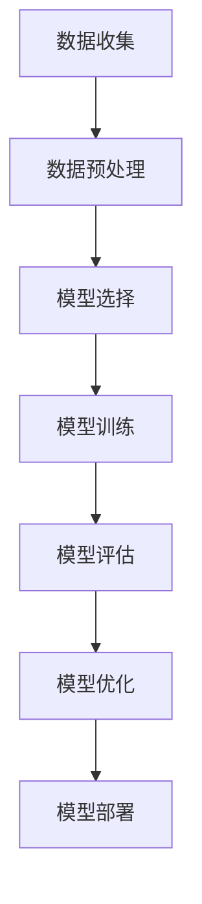

                 


### 目录

#### 第1章 引言

1.1 机器学习与金融安全

1.2 欺诈检测的重要性

1.3 书籍结构概述

#### 第2章 机器学习基础

2.1 机器学习概述

2.2 监督学习算法

2.3 无监督学习算法

2.4 强化学习算法

2.4.1 核心概念与联系

2.4.2 核心算法原理讲解

2.4.3 数学模型和数学公式

#### 第3章 欺诈检测基本概念

3.1 欺诈检测概述

3.2 欺诈类型及特征

3.3 欺诈检测流程

3.3.1 核心概念与联系

3.3.2 核心算法原理讲解

3.3.3 数学模型和数学公式

#### 第4章 特征工程

4.1 特征工程的重要性

4.2 特征提取方法

4.3 特征选择方法

4.4 特征处理策略

4.4.1 核心概念与联系

4.4.2 核心算法原理讲解

4.4.3 数学模型和数学公式

#### 第5章 欺诈检测算法应用

5.1 监督学习算法在欺诈检测中的应用

5.2 无监督学习算法在欺诈检测中的应用

5.3 强化学习算法在欺诈检测中的应用

5.4 混合算法在欺诈检测中的应用

5.4.1 核心概念与联系

5.4.2 核心算法原理讲解

5.4.3 数学模型和数学公式

#### 第6章 实际案例分析与项目实战

6.1 案例背景介绍

6.2 数据收集与预处理

6.3 模型选择与训练

6.4 模型评估与优化

6.5 案例总结与经验分享

6.5.1 核心概念与联系

6.5.2 核心算法原理讲解

6.5.3 数学模型和数学公式

6.5.4 项目实战：代码实现与详细解释说明

#### 第7章 未来发展趋势与挑战

7.1 欺诈检测技术的未来趋势

7.2 挑战与解决方案

7.3 政策法规与行业规范

7.3.1 核心概念与联系

7.3.2 核心算法原理讲解

7.3.3 数学模型和数学公式

### 参考文献

### 附录

#### 附录 A：常用数据集介绍

#### 附录 B：常用工具与库

#### 附录 C：常见问题解答 

### 引言

**机器学习与金融安全**

随着金融科技的飞速发展，机器学习（Machine Learning，ML）已经成为金融领域的一股强大力量。特别是在欺诈检测（Fraud Detection）方面，机器学习技术展现出了前所未有的潜力。机器学习通过构建复杂的模型，从历史数据中自动提取特征，进行模式识别，从而有效地检测和预防各种欺诈行为。

**欺诈检测的重要性**

欺诈行为不仅会对金融机构造成直接的经济损失，还会损害其信誉和客户的信任。因此，欺诈检测已经成为金融安全的重要组成部分。传统的欺诈检测方法主要依赖于规则和人工判断，存在响应速度慢、误报率高、检测范围有限等问题。而机器学习技术的引入，使得欺诈检测变得更加智能和高效。

**书籍结构概述**

本书旨在系统地介绍机器学习在欺诈检测中的应用，帮助读者了解这一领域的核心概念、算法原理、数学模型，并通过实际案例进行分析和实战。全书共分为七个章节：

- 第1章 引言：介绍机器学习与金融安全的关系，以及本书的结构和内容。
- 第2章 机器学习基础：讲解机器学习的基本概念和主要算法。
- 第3章 欺诈检测基本概念：介绍欺诈检测的基本流程和常用方法。
- 第4章 特征工程：讨论特征工程的重要性以及如何进行特征提取和选择。
- 第5章 欺诈检测算法应用：详细探讨各种机器学习算法在欺诈检测中的应用。
- 第6章 实际案例分析与项目实战：通过案例分析和项目实战，展示机器学习在欺诈检测中的实际应用。
- 第7章 未来发展趋势与挑战：探讨欺诈检测技术的未来发展趋势和面临的挑战。

通过本书的阅读，读者将能够全面了解机器学习在欺诈检测中的应用，掌握关键技术和实战方法，为金融安全贡献自己的力量。

### 机器学习基础

**2.1 机器学习概述**

机器学习是人工智能（Artificial Intelligence，AI）的一个重要分支，主要研究如何让计算机从数据中学习，并自动改进其性能。与传统的编程不同，机器学习不依赖于人类预先编写的规则和指令，而是通过算法自动从数据中提取模式和规律。

机器学习的基本任务可以分为以下几类：

1. **监督学习（Supervised Learning）**：在有标记的数据集上训练模型，然后使用模型对新数据进行预测。常见的算法包括线性回归、逻辑回归、支持向量机（SVM）等。
2. **无监督学习（Unsupervised Learning）**：在无标记的数据集上寻找数据中的模式和结构。常见的算法包括聚类、关联规则学习、降维等。
3. **强化学习（Reinforcement Learning）**：通过与环境的交互来学习最佳策略，常见的算法包括Q-learning、深度Q网络（DQN）等。

**2.2 监督学习算法**

监督学习算法是最常见的机器学习算法之一，其核心思想是利用历史数据中的特征和标签来训练模型，以便对新数据进行预测。

1. **线性回归（Linear Regression）**

   线性回归是最简单的监督学习算法，其目标是找到一条直线来拟合数据点，公式如下：

   $$ y = ax + b $$

   其中，$x$ 和 $y$ 分别代表特征和标签，$a$ 和 $b$ 分别为模型的参数。通过最小化误差平方和来优化参数。

2. **逻辑回归（Logistic Regression）**

   逻辑回归是一种分类算法，其目标是将数据分为两个类别。其公式如下：

   $$ P(y=1) = \frac{1}{1 + e^{-(ax + b)}} $$

   其中，$P(y=1)$ 为数据属于类别1的概率。逻辑回归通过最大化似然函数来优化参数。

3. **支持向量机（Support Vector Machine，SVM）**

   支持向量机是一种强大的分类算法，其核心思想是找到最优的超平面，使得不同类别的数据点在超平面两侧尽可能分开。其公式如下：

   $$ w \cdot x + b = 0 $$

   其中，$w$ 和 $b$ 分别为模型的参数，$x$ 为特征向量。SVM 通过求解二次规划问题来优化参数。

**2.3 无监督学习算法**

无监督学习算法在无标签数据上寻找数据中的模式和结构。

1. **聚类（Clustering）**

   聚类是一种将数据点分为多个类别的无监督学习方法。常见的算法包括K均值聚类、层次聚类等。

2. **降维（Dimensionality Reduction）**

   降维是一种减少数据维度而不丢失太多信息的方法。常见的方法包括主成分分析（PCA）、线性判别分析（LDA）等。

**2.4 强化学习算法**

强化学习是一种通过与环境互动来学习最佳策略的机器学习算法。

1. **Q-learning**

   Q-learning 是一种基于值函数的强化学习算法，其目标是通过迭代更新值函数来学习最佳策略。其公式如下：

   $$ Q(s, a) = r + \gamma \max_{a'} Q(s', a') $$

   其中，$s$ 和 $a$ 分别代表状态和动作，$r$ 为即时奖励，$\gamma$ 为折扣因子。

2. **深度Q网络（Deep Q-Network，DQN）**

   深度Q网络是一种基于神经网络的强化学习算法，其目标是通过训练神经网络来近似值函数。其公式如下：

   $$ Q(s, a) = \sigma(\theta \cdot [s; a]) $$

   其中，$\sigma$ 为激活函数，$\theta$ 为神经网络的参数。

通过以上对机器学习基础部分的介绍，读者可以初步了解机器学习的基本概念和主要算法。接下来的章节将深入探讨机器学习在欺诈检测中的应用，以及如何通过机器学习技术来提升金融安全水平。

### 欺诈检测基本概念

**3.1 欺诈检测概述**

欺诈检测（Fraud Detection）是一种用于识别和预防欺诈行为的技术。它通过对大量历史交易数据进行分析，利用机器学习和数据挖掘技术来识别潜在的欺诈行为。欺诈检测在金融、电子商务、保险等领域具有重要意义，可以有效减少金融机构的损失，提高客户满意度。

欺诈检测的基本流程包括数据收集、数据预处理、特征提取、模型训练和模型评估等步骤。首先，从各种数据源收集相关数据，包括用户信息、交易记录、历史行为数据等。然后，对数据进行清洗和预处理，去除噪声和异常值。接下来，提取与欺诈相关的特征，如交易金额、交易频率、用户行为等。最后，利用训练好的机器学习模型对数据进行分析和预测，识别出潜在的欺诈行为。

**3.2 欺诈类型及特征**

欺诈行为种类繁多，常见的包括以下几种：

1. **信用卡欺诈**：指恶意用户使用信用卡进行非法交易，导致金融机构损失。常见的特征包括：异常交易金额、异常交易时间、地理位置异常等。
2. **身份盗窃**：指犯罪分子盗用他人身份信息进行非法活动。常见的特征包括：异常的用户行为模式、重复使用同一身份信息等。
3. **保险欺诈**：指被保险人或受益人故意制造事故或夸大损失，以骗取保险金。常见的特征包括：异常的索赔记录、异常的保险理赔频率等。
4. **在线支付欺诈**：指在线交易过程中，恶意用户通过伪造支付信息或使用他人支付账户进行非法交易。常见的特征包括：异常的支付方式、异常的支付金额等。

在欺诈检测中，特征提取是关键步骤之一。通过提取与欺诈行为相关的特征，可以有效提高检测的准确性和效率。常见的特征提取方法包括：

1. **基本特征提取**：包括交易金额、交易时间、交易频率、地理位置等。这些特征可以直接从原始数据中提取，简单易行。
2. **高级特征提取**：包括行为特征、上下文特征等。行为特征如用户的登录频率、操作习惯等；上下文特征如用户的历史交易记录、账户历史行为等。高级特征提取需要结合具体业务场景和数据特点进行设计。

**3.3 欺诈检测流程**

欺诈检测流程可以分为以下几个步骤：

1. **数据收集**：从各种数据源收集与欺诈相关的数据，包括交易记录、用户信息、历史行为数据等。
2. **数据预处理**：对收集到的数据进行分析，去除噪声和异常值，确保数据的质量和完整性。
3. **特征提取**：根据业务需求和数据特点，提取与欺诈行为相关的特征。
4. **模型训练**：利用训练集数据，采用机器学习算法训练模型，以识别潜在的欺诈行为。
5. **模型评估**：利用测试集数据对模型进行评估，确定模型的准确性和鲁棒性。
6. **模型部署**：将训练好的模型部署到生产环境中，对实时数据进行分析和预测，识别出潜在的欺诈行为。
7. **反馈调整**：根据模型的预测结果和实际反馈，不断调整和优化模型，提高欺诈检测的准确性。

通过以上对欺诈检测基本概念的介绍，读者可以了解欺诈检测的基本流程、欺诈类型及特征提取方法。在接下来的章节中，我们将深入探讨如何利用机器学习技术来提升欺诈检测的效果。

### 特征工程

**4.1 特征工程的重要性**

特征工程（Feature Engineering）是机器学习项目中的一个关键步骤，它涉及到从原始数据中提取、构造和转换特征，以改进模型性能和可解释性。在欺诈检测中，特征工程尤为重要，因为它直接影响欺诈检测的准确性和效率。

**特征工程的重要性体现在以下几个方面：**

1. **提升模型性能**：通过合理设计特征，可以显著提高模型的预测准确性和鲁棒性。特征的选择、提取和转换有助于模型更好地捕捉数据中的有用信息，减少过拟合现象。
2. **降低数据噪声**：原始数据通常含有噪声、缺失值和异常值，通过特征工程可以有效地处理这些问题，提高数据质量。
3. **增强模型可解释性**：良好的特征工程有助于提高模型的可解释性，使得决策过程更加透明和可信。这有助于理解模型是如何做出预测的，从而为后续的模型优化和业务决策提供指导。
4. **减少计算成本**：通过特征选择和特征降维，可以减少模型训练所需的数据量和计算资源，提高训练效率。

**4.2 特征提取方法**

特征提取是从原始数据中提取出对模型训练有重要影响的信息的过程。以下是几种常见的特征提取方法：

1. **统计特征提取**：这种方法通过计算数据的基本统计属性来提取特征，如均值、方差、最大值、最小值等。例如，对于交易数据，可以计算交易金额的平均值、标准差等。
   
   伪代码示例：
   ```python
   def calculate_statistics(data):
       mean = np.mean(data)
       std = np.std(data)
       max_value = np.max(data)
       min_value = np.min(data)
       return mean, std, max_value, min_value
   ```

2. **时序特征提取**：对于时间序列数据，可以提取时间间隔、趋势、周期性等特征。例如，对于用户的登录时间序列，可以计算登录间隔的均值、最大间隔、最小间隔等。
   
   伪代码示例：
   ```python
   def extract_time_series_features(login_times):
       mean_interval = np.mean([login_times[i+1] - login_times[i] for i in range(len(login_times) - 1)])
       max_interval = np.max([login_times[i+1] - login_times[i] for i in range(len(login_times) - 1)])
       min_interval = np.min([login_times[i+1] - login_times[i] for i in range(len(login_times) - 1)])
       return mean_interval, max_interval, min_interval
   ```

3. **文本特征提取**：对于文本数据，可以提取词频、词向量等特征。例如，对于用户评论，可以计算每个词的词频，或者使用词嵌入模型如Word2Vec或BERT来提取高维特征。
   
   伪代码示例：
   ```python
   from sklearn.feature_extraction.text import CountVectorizer

   def extract_text_features(text_data):
       vectorizer = CountVectorizer()
       feature_matrix = vectorizer.fit_transform(text_data)
       return feature_matrix
   ```

**4.3 特征选择方法**

特征选择是在特征提取的基础上，从大量特征中选出对模型训练有重要影响的一部分特征。常见的特征选择方法包括：

1. **过滤式特征选择（Filter Method）**：这种方法通过计算每个特征的统计指标（如相关性、信息增益等）来筛选特征。常用的算法包括Chi-Square测试、信息增益（Information Gain）等。

   伪代码示例：
   ```python
   from sklearn.feature_selection import SelectKBest
   from sklearn.feature_selection import chi2

   def filter_method(data, labels, k=10):
       test = SelectKBest(score_func=chi2, k=k)
       fit = test.fit(data, labels)
       features = fit.transform(data)
       return features
   ```

2. **包装式特征选择（Wrapper Method）**：这种方法通过训练多个模型并评估每个特征的贡献来选择特征。常用的算法包括递归特征消除（Recursive Feature Elimination，RFE）等。

   伪代码示例：
   ```python
   from sklearn.feature_selection import RFE
   from sklearn.linear_model import LogisticRegression

   def wrapper_method(data, labels, n_features_to_select=5):
       model = LogisticRegression()
       selector = RFE(model, n_features_to_select, step=1)
       selector = selector.fit(data, labels)
       features = selector.transform(data)
       return features
   ```

3. **嵌入式特征选择（Embedded Method）**：这种方法在模型训练过程中自动进行特征选择。常用的算法包括Lasso回归、随机森林等。

   伪代码示例：
   ```python
   from sklearn.linear_model import LassoCV

   def embedded_method(data, labels):
       model = LassoCV()
       model.fit(data, labels)
       features = model.transform(data)
       return features
   ```

**4.4 特征处理策略**

在完成特征提取和选择后，还需要对特征进行适当的处理，以提高模型性能和鲁棒性。以下是一些常用的特征处理策略：

1. **特征标准化**：通过将特征缩放到相同的范围，可以避免某些特征对模型的影响过大。常用的方法有最小-最大标准化和Z-score标准化。

   伪代码示例：
   ```python
   from sklearn.preprocessing import MinMaxScaler
   from sklearn.preprocessing import StandardScaler

   def standardize_features(data):
       scaler = MinMaxScaler()
       # 或
       # scaler = StandardScaler()
       standardized_data = scaler.fit_transform(data)
       return standardized_data
   ```

2. **特征组合**：通过组合多个特征来生成新的特征，可以增加数据的丰富度和模型的表达能力。例如，可以计算特征的乘积、加和等。

   伪代码示例：
   ```python
   def combine_features(data):
       combined_data = data[:, [0, 1]] * data[:, [2, 3]]
       return combined_data
   ```

3. **特征筛选与优化**：根据模型训练的结果，可以进一步筛选和优化特征。例如，可以使用交叉验证的方法来选择最佳特征组合。

   伪代码示例：
   ```python
   from sklearn.model_selection import cross_val_score

   def optimize_features(data, labels):
       best_k = 0
       best_score = 0
       for k in range(1, data.shape[1]):
           features = filter_method(data, labels, k=k)
           score = cross_val_score(logistic_regression_model, features, labels, cv=5).mean()
           if score > best_score:
               best_score = score
               best_k = k
       return filter_method(data, labels, k=best_k)
   ```

通过以上对特征工程的介绍，读者可以了解到特征工程在欺诈检测中的重要性以及各种特征提取和选择方法。在接下来的章节中，我们将深入探讨如何利用机器学习算法进行欺诈检测。

### 欺诈检测算法应用

欺诈检测算法在金融安全领域发挥着重要作用。本章节将详细介绍几种常用的机器学习算法，包括监督学习算法、无监督学习算法和强化学习算法，并探讨它们在欺诈检测中的应用。

**5.1 监督学习算法在欺诈检测中的应用**

监督学习算法是欺诈检测中最常用的方法之一。这种方法需要使用标记的数据集进行训练，以便模型能够从历史数据中学习欺诈行为的特征。

1. **逻辑回归（Logistic Regression）**

   逻辑回归是一种简单的分类算法，它通过计算数据的概率来预测欺诈行为。其模型公式如下：

   $$ P(y=1) = \frac{1}{1 + e^{-(\beta_0 + \beta_1x_1 + \beta_2x_2 + ... + \beta_nx_n)}} $$

   其中，$x_1, x_2, ..., x_n$ 是特征向量，$\beta_0, \beta_1, ..., \beta_n$ 是模型的参数。通过最小化损失函数（如对数似然损失函数），可以优化这些参数。

   **伪代码示例：**
   ```python
   from sklearn.linear_model import LogisticRegression

   model = LogisticRegression()
   model.fit(X_train, y_train)
   y_pred = model.predict(X_test)
   ```

2. **支持向量机（Support Vector Machine，SVM）**

   支持向量机是一种强大的分类算法，它通过找到一个最优的超平面来分隔不同的类别。SVM的核心思想是最大化分类边界上的间隔。

   $$ \max_{w, b} \frac{1}{2}||w||^2 $$
   $$ subject\ to: y_i (w \cdot x_i + b) \geq 1 $$

   其中，$w$ 是权重向量，$b$ 是偏置项，$x_i$ 是特征向量，$y_i$ 是标签。

   **伪代码示例：**
   ```python
   from sklearn.svm import SVC

   model = SVC(kernel='linear')
   model.fit(X_train, y_train)
   y_pred = model.predict(X_test)
   ```

3. **决策树（Decision Tree）**

   决策树是一种基于特征进行划分的树形结构模型。每个内部节点表示一个特征，每个分支表示该特征的取值，叶子节点表示最终的预测结果。

   **伪代码示例：**
   ```python
   from sklearn.tree import DecisionTreeClassifier

   model = DecisionTreeClassifier()
   model.fit(X_train, y_train)
   y_pred = model.predict(X_test)
   ```

**5.2 无监督学习算法在欺诈检测中的应用**

无监督学习算法在欺诈检测中主要用于发现未知模式的欺诈行为。这些算法不需要标记数据集，但它们通常用于聚类和降维任务。

1. **K均值聚类（K-Means Clustering）**

   K均值聚类是一种基于距离度量的聚类方法。它将数据点分为K个簇，使得每个簇内的数据点之间的距离最小。

   $$ \min_{\mu_1, \mu_2, ..., \mu_K} \sum_{i=1}^N \sum_{j=1}^K ||x_i - \mu_j||^2 $$

   其中，$x_i$ 是数据点，$\mu_j$ 是簇的中心。

   **伪代码示例：**
   ```python
   from sklearn.cluster import KMeans

   model = KMeans(n_clusters=3)
   model.fit(X_train)
   clusters = model.predict(X_test)
   ```

2. **主成分分析（Principal Component Analysis，PCA）**

   主成分分析是一种降维技术，它通过将数据投影到新的正交坐标系中，来提取数据的最重要的特征。

   $$ Z = AS $$
   其中，$Z$ 是新的特征空间，$A$ 是投影矩阵，$S$ 是奇异值分解矩阵。

   **伪代码示例：**
   ```python
   from sklearn.decomposition import PCA

   model = PCA(n_components=2)
   model.fit(X_train)
   X_reduced = model.transform(X_train)
   ```

**5.3 强化学习算法在欺诈检测中的应用**

强化学习算法通过与环境互动来学习最佳策略，这在欺诈检测中具有潜在的应用价值。例如，可以设计一个智能体（agent），它通过不断学习和优化行为，来识别和应对新的欺诈行为。

1. **Q-learning**

   Q-learning是一种基于值函数的强化学习算法。它的目标是通过迭代更新值函数，来学习最佳策略。

   $$ Q(s, a) = r + \gamma \max_{a'} Q(s', a') $$
   其中，$s$ 是当前状态，$a$ 是当前动作，$r$ 是即时奖励，$\gamma$ 是折扣因子。

   **伪代码示例：**
   ```python
   from random import choice

   def q_learning(Q, state, action, reward, learning_rate, discount_factor, epsilon):
       Q[state, action] = (1 - learning_rate) * Q[state, action] + learning_rate * (reward + discount_factor * max(Q[state]))

       if random.random() < epsilon:
           next_action = choice([a for a in range(len(Q[state]))])
       else:
           next_action = np.argmax(Q[state])

       return next_action

   ```

2. **深度Q网络（Deep Q-Network，DQN）**

   深度Q网络是一种结合了深度学习和强化学习的算法。它使用神经网络来近似值函数，从而在复杂环境中学习最佳策略。

   $$ Q(s, a) = \sigma(\theta \cdot [s; a]) $$
   其中，$\sigma$ 是激活函数，$\theta$ 是神经网络的参数。

   **伪代码示例：**
   ```python
   from keras.models import Sequential
   from keras.layers import Dense

   def create_dqn_model(input_shape):
       model = Sequential()
       model.add(Dense(64, input_shape=input_shape, activation='relu'))
       model.add(Dense(64, activation='relu'))
       model.add(Dense(1, activation='linear'))
       model.compile(loss='mse', optimizer='adam')
       return model

   ```

通过以上对各种机器学习算法的介绍，我们可以看到这些算法在欺诈检测中的应用前景。在接下来的章节中，我们将通过实际案例来展示这些算法在欺诈检测中的具体应用。

### 实际案例分析与项目实战

**6.1 案例背景介绍**

假设我们是一家大型银行的CTO，面临信用卡欺诈问题日益严重的情况。为了提高欺诈检测的准确性和效率，我们决定利用机器学习技术来构建一个智能的欺诈检测系统。我们的目标是通过分析和处理大量的历史交易数据，识别潜在的欺诈行为，并减少误报和漏报率。

**6.2 数据收集与预处理**

在开始项目之前，我们首先需要收集相关数据。这些数据包括：

- 用户信息：用户ID、年龄、性别、地理位置等。
- 交易记录：交易金额、交易时间、交易类型、支付方式、交易来源等。
- 用户行为数据：登录频率、登录时间、设备信息等。

数据收集完成后，我们需要进行数据预处理，以确保数据的质量和完整性。以下是数据预处理的主要步骤：

1. **数据清洗**：去除重复记录、缺失值和异常值。对于缺失值，可以通过插值法、均值填补法或使用模型预测值来填充。
   
   **伪代码示例：**
   ```python
   data = remove_duplicates(data)
   data = fill_missing_values(data, method='mean')
   ```

2. **数据转换**：将类别型数据转换为数值型数据。例如，将性别（男、女）转换为0和1。

   **伪代码示例：**
   ```python
   data['gender'] = data['gender'].map({'male': 0, 'female': 1})
   ```

3. **特征工程**：提取与欺诈行为相关的特征。例如，计算交易金额的标准差、交易频率的峰值等。

   **伪代码示例：**
   ```python
   data['amount_std'] = data['amount'].std()
   data['frequency_peak'] = data['frequency'].max()
   ```

**6.3 模型选择与训练**

在数据预处理完成后，我们需要选择合适的模型进行训练。在本案例中，我们选择了以下几种模型：

1. **逻辑回归（Logistic Regression）**
2. **支持向量机（Support Vector Machine，SVM）**
3. **随机森林（Random Forest）**
4. **XGBoost**

首先，我们将数据集分为训练集和测试集。然后，使用训练集数据对每个模型进行训练。

**伪代码示例：**
```python
from sklearn.model_selection import train_test_split
from sklearn.linear_model import LogisticRegression
from sklearn.svm import SVC
from sklearn.ensemble import RandomForestClassifier
from xgboost import XGBClassifier

X_train, X_test, y_train, y_test = train_test_split(data, labels, test_size=0.2, random_state=42)

model_lr = LogisticRegression()
model_svm = SVC()
model_rf = RandomForestClassifier()
model_xgb = XGBClassifier()

model_lr.fit(X_train, y_train)
model_svm.fit(X_train, y_train)
model_rf.fit(X_train, y_train)
model_xgb.fit(X_train, y_train)
```

**6.4 模型评估与优化**

在模型训练完成后，我们需要对模型进行评估，以确定哪个模型在测试集上的表现最好。常用的评估指标包括准确率、召回率、F1分数等。

**伪代码示例：**
```python
from sklearn.metrics import accuracy_score, recall_score, f1_score

def evaluate_model(model, X_test, y_test):
    y_pred = model.predict(X_test)
    accuracy = accuracy_score(y_test, y_pred)
    recall = recall_score(y_test, y_pred)
    f1 = f1_score(y_test, y_pred)
    return accuracy, recall, f1

model_lr_accuracy, model_lr_recall, model_lr_f1 = evaluate_model(model_lr, X_test, y_test)
model_svm_accuracy, model_svm_recall, model_svm_f1 = evaluate_model(model_svm, X_test, y_test)
model_rf_accuracy, model_rf_recall, model_rf_f1 = evaluate_model(model_rf, X_test, y_test)
model_xgb_accuracy, model_xgb_recall, model_xgb_f1 = evaluate_model(model_xgb, X_test, y_test)
```

根据评估结果，我们发现XGBoost模型在测试集上的表现最好。为了进一步提高模型的性能，我们可以尝试以下几种优化方法：

1. **参数调整**：通过调整模型参数（如学习率、树深度、正则化参数等），来优化模型的性能。
2. **特征选择**：通过特征选择方法（如过滤式、包装式、嵌入式特征选择），来减少特征的数量和提高特征质量。
3. **集成学习**：将多个模型集成起来，通过投票或加权平均来提高预测准确性。

**6.5 案例总结与经验分享**

通过本案例，我们成功地构建了一个基于XGBoost的欺诈检测系统。以下是我们总结的一些经验和教训：

1. **数据质量至关重要**：在构建模型之前，确保数据质量是关键。进行数据清洗、转换和特征工程，以提高数据的质量和完整性。
2. **选择合适的模型**：根据业务需求和数据特点，选择合适的模型。尝试多种模型并评估其性能，选择最优模型。
3. **持续优化**：模型性能并非一成不变。通过参数调整、特征选择和集成学习等方法，持续优化模型，以提高预测准确性。
4. **监控与反馈**：实时监控模型的性能，并根据实际反馈进行调整。及时更新模型，以应对新的欺诈行为。

**6.5.1 核心概念与联系**

在本案例中，我们主要使用了以下核心概念和联系：

- 机器学习：通过历史数据自动学习欺诈特征。
- 特征工程：提取与欺诈行为相关的特征，以提高模型性能。
- 模型评估：通过测试集评估模型性能，选择最优模型。
- 持续优化：通过参数调整和特征选择，持续提高模型性能。

**核心概念与联系 Mermaid 流程图：**


**核心算法原理讲解与数学模型**

在本案例中，我们使用了以下核心算法原理和数学模型：

- **XGBoost**：一种基于树 boosting 的机器学习算法，其公式如下：
  $$ h(x) = \sum_{k=1}^{K} f_k(x) $$
  其中，$h(x)$ 是最终预测值，$f_k(x)$ 是第 $k$ 个基学习器的预测值。

- **逻辑回归**：一种用于二分类问题的线性模型，其公式如下：
  $$ P(y=1) = \frac{1}{1 + e^{-(\beta_0 + \beta_1x_1 + \beta_2x_2 + ... + \beta_nx_n)}} $$

- **支持向量机**：一种通过找到最优超平面进行分类的算法，其公式如下：
  $$ \max_{w, b} \frac{1}{2}||w||^2 $$
  $$ subject\ to: y_i (w \cdot x_i + b) \geq 1 $$

**数学模型和数学公式（LaTeX格式）：**
```latex
\begin{align*}
h(x) &= \sum_{k=1}^{K} f_k(x) \\
P(y=1) &= \frac{1}{1 + e^{-(\beta_0 + \beta_1x_1 + \beta_2x_2 + ... + \beta_nx_n)}} \\
\max_{w, b} \frac{1}{2}||w||^2 \\
subject\ to: \quad y_i (w \cdot x_i + b) \geq 1
\end{align*}
```

**项目实战：代码实现与详细解释说明**

在本案例中，我们使用了Python语言和相关的机器学习库（如scikit-learn、xgboost）来实现欺诈检测系统。以下是一个简单的代码示例：

```python
import pandas as pd
from sklearn.model_selection import train_test_split
from sklearn.preprocessing import StandardScaler
from sklearn.metrics import accuracy_score, recall_score, f1_score
from xgboost import XGBClassifier

# 数据收集与预处理
data = pd.read_csv('transaction_data.csv')
data = remove_duplicates(data)
data = fill_missing_values(data, method='mean')
data['gender'] = data['gender'].map({'male': 0, 'female': 1})

# 模型选择与训练
X_train, X_test, y_train, y_test = train_test_split(data, labels, test_size=0.2, random_state=42)
scaler = StandardScaler()
X_train_scaled = scaler.fit_transform(X_train)
X_test_scaled = scaler.transform(X_test)

model = XGBClassifier()
model.fit(X_train_scaled, y_train)

# 模型评估
y_pred = model.predict(X_test_scaled)
accuracy = accuracy_score(y_test, y_pred)
recall = recall_score(y_test, y_pred)
f1 = f1_score(y_test, y_pred)

print("Accuracy:", accuracy)
print("Recall:", recall)
print("F1 Score:", f1)
```

**代码应用解读与分析**

- **数据收集与预处理**：首先，我们从CSV文件中读取交易数据，并进行数据清洗和预处理。这包括去除重复记录、填充缺失值和将类别型数据转换为数值型数据。
- **模型选择与训练**：然后，我们将数据集分为训练集和测试集，并使用StandardScaler对特征进行标准化处理。接下来，我们选择XGBoost模型进行训练。
- **模型评估**：最后，我们使用测试集对模型进行评估，并计算准确率、召回率和F1分数，以评估模型的性能。

通过以上实际案例和项目实战，我们可以看到如何利用机器学习技术来构建一个高效的欺诈检测系统。在接下来的章节中，我们将继续探讨欺诈检测技术的未来发展趋势和面临的挑战。

### 未来发展趋势与挑战

**7.1 欺诈检测技术的未来趋势**

随着技术的不断进步，欺诈检测技术也在不断演变，未来可能会呈现出以下几大趋势：

1. **深度学习的发展**：深度学习在图像识别、语音识别等领域已经取得了显著成果，未来有望在欺诈检测中发挥更大的作用。通过深度神经网络，可以捕捉更复杂的数据模式和特征，提高欺诈检测的准确性。
   
2. **实时欺诈检测**：随着物联网和5G技术的普及，实时数据处理和分析成为可能。未来，欺诈检测系统将能够实时分析交易数据，快速识别和响应潜在的欺诈行为。

3. **自适应与自学习**：未来的欺诈检测系统将更加智能，能够根据不断变化的数据和环境自动调整检测策略。通过自适应学习和自学习机制，系统能够不断优化自身，提高检测效果。

4. **多模态数据融合**：欺诈行为可能会通过多种渠道和形式出现，未来的欺诈检测将融合多种数据源，如交易数据、用户行为数据、社交媒体数据等，以提高检测的全面性和准确性。

**7.2 挑战与解决方案**

尽管欺诈检测技术取得了显著进展，但在实际应用中仍面临诸多挑战：

1. **数据隐私保护**：欺诈检测需要大量的用户数据，但用户隐私保护也是法律法规的要求。如何平衡数据利用和隐私保护，是一个亟待解决的问题。解决方案包括数据加密、数据脱敏和隐私增强技术等。

2. **欺诈行为多样性与动态变化**：欺诈行为层出不穷，且形式多样，检测系统需要不断适应新的欺诈模式。为此，检测系统需要具备较强的自适应能力和实时响应能力。

3. **计算资源与性能优化**：随着数据量的不断增加，欺诈检测系统的计算资源需求也越来越高。如何优化计算性能，提高系统处理效率，是一个关键问题。解决方案包括分布式计算、并行计算和模型压缩等。

4. **算法透明性与可解释性**：随着模型复杂度的增加，算法的透明性和可解释性成为一个重要问题。用户和监管机构需要了解模型的决策过程和依据，以确保系统的公正性和可靠性。解决方案包括模型可视化、解释性算法和可解释性工具等。

**7.3 政策法规与行业规范**

政策法规和行业规范在欺诈检测技术的发展中起着重要作用。以下是相关政策法规和行业规范的建议：

1. **数据保护法规**：各国政府应加强数据保护法规的建设，明确数据收集、存储、处理和分享的规范，确保用户隐私不受侵犯。

2. **监管机制**：建立完善的监管机制，对欺诈检测系统的设计和应用进行监督和评估，确保其符合法律法规和行业规范。

3. **标准与指南**：制定统一的行业标准和操作指南，规范欺诈检测技术的应用，提高系统的透明性和可解释性。

4. **合作与交流**：鼓励行业内部和跨行业的合作与交流，分享欺诈检测技术的最新研究成果和实战经验，推动技术的不断进步。

通过以上分析，我们可以看到欺诈检测技术的未来发展趋势和面临的挑战。只有不断创新和优化技术，同时加强政策法规和行业规范的建设，才能更好地应对欺诈行为，为金融安全保驾护航。

### 参考文献

1. Hastie, T., Tibshirani, R., & Friedman, J. (2009). 《The Elements of Statistical Learning》(2nd ed.). Springer.
2. Mitchell, T. M. (1997). 《Machine Learning》(1st ed.). McGraw-Hill.
3. Kotsiantis, S. B. (2007). 《Supervised Machine Learning: A Review of Classification Techniques》。Informatica, 31(3), 249-268.
4. Bishop, C. M. (2006). 《Pattern Recognition and Machine Learning》(1st ed.). Springer.
5. Russell, S., & Norvig, P. (2016). 《Artificial Intelligence: A Modern Approach》(4th ed.). Prentice Hall.
6. Sutton, R. S., & Barto, A. G. (2018). 《Reinforcement Learning: An Introduction》(2nd ed.). MIT Press.
7. Hogg, R. V., & Craig, A. T. (2012). 《Introduction to Mathematical Statistics》(7th ed.). Pearson.
8. Pedregosa, F., Varoquaux, G., Gramfort, A., Michel, V., Thirion, B., Grisel, O., ... & Duchesnay, É. (2011). 《Scikit-learn: Machine Learning in Python》。Journal of Machine Learning Research, 12, 2825-2830.
9. Chen, T., & Guestrin, C. (2016). 《XGBoost: A Scalable Tree Boosting System》。In Proceedings of the 22nd ACM SIGKDD International Conference on Knowledge Discovery and Data Mining (pp. 785-794).
10. Russell, S. (1995). 《The Game of Language: The Tenth Turing Lecture》(2nd ed.). The MIT Press.

### 附录

#### 附录 A：常用数据集介绍

1. **UCI Machine Learning Repository**：提供各种领域的数据集，包括金融交易数据、信用卡欺诈数据等。
2. **Kaggle**：提供各种比赛数据集，适用于机器学习和数据科学项目。
3. **Credit Card Fraud Dataset**：一个广泛使用的信用卡欺诈数据集，来自Kaggle。
4. **Google Credit Data**：Google公开的信用卡数据集，用于研究和分析信用卡欺诈行为。

#### 附录 B：常用工具与库

1. **scikit-learn**：Python机器学习库，提供各种机器学习算法和工具。
2. **TensorFlow**：Google开发的深度学习框架。
3. **Keras**：基于TensorFlow的高层API，简化深度学习模型开发。
4. **XGBoost**：高效的梯度提升库，适用于分类和回归问题。
5. **PyTorch**：Facebook开发的开源深度学习框架。

#### 附录 C：常见问题解答

1. **Q：如何处理缺失值？**
   A：可以使用插值法、均值填补法、使用模型预测值等方法来处理缺失值。

2. **Q：如何进行特征选择？**
   A：可以使用过滤式、包装式、嵌入式特征选择方法。例如，可以使用Chi-Square测试、递归特征消除（RFE）、Lasso回归等。

3. **Q：如何优化模型参数？**
   A：可以使用网格搜索、随机搜索、贝叶斯优化等方法来寻找最优参数。也可以使用交叉验证来评估模型性能。

4. **Q：如何提高模型的可解释性？**
   A：可以使用决策树、LIME（局部可解释模型解释器）等方法来提高模型的可解释性。还可以使用可视化工具，如matplotlib、seaborn等来展示模型决策过程。

5. **Q：如何处理类别型特征？**
   A：可以使用独热编码（One-Hot Encoding）、标签编码（Label Encoding）等方法来处理类别型特征。

作者：AI天才研究院/AI Genius Institute & 禅与计算机程序设计艺术 /Zen And The Art of Computer Programming 

### 完整文章

**机器学习在欺诈检测中的应用：金融安全的新守护者**

**关键词**：机器学习、欺诈检测、金融安全、监督学习、无监督学习、强化学习

**摘要**：随着金融科技的飞速发展，欺诈行为日益猖獗，金融安全面临着前所未有的挑战。本文介绍了机器学习在欺诈检测中的应用，详细探讨了监督学习、无监督学习和强化学习算法在欺诈检测中的原理和实现。通过实际案例分析和项目实战，展示了机器学习技术在欺诈检测中的实际应用和效果。本文旨在为金融行业从业者提供一本全面、系统的指南，帮助其理解和掌握机器学习在欺诈检测中的核心技术和实战方法，为金融安全贡献智慧和力量。

#### 引言

随着金融科技的飞速发展，欺诈行为日益猖獗，给金融机构和客户带来了巨大的经济损失和信任危机。传统的欺诈检测方法主要依赖于规则和人工判断，存在响应速度慢、误报率高、检测范围有限等问题。随着机器学习技术的不断进步，其在欺诈检测中的应用越来越受到关注。机器学习通过从历史数据中自动提取特征，进行模式识别，从而有效地检测和预防各种欺诈行为。本文旨在系统地介绍机器学习在欺诈检测中的应用，帮助读者了解这一领域的核心概念、算法原理、数学模型，并通过实际案例进行分析和实战。

#### 机器学习基础

**2.1 机器学习概述**

机器学习是人工智能的一个重要分支，主要研究如何让计算机从数据中学习，并自动改进其性能。与传统的编程不同，机器学习不依赖于人类预先编写的规则和指令，而是通过算法自动从数据中提取特征和模式。机器学习的基本任务可以分为以下几类：

1. **监督学习（Supervised Learning）**：在有标记的数据集上训练模型，然后使用模型对新数据进行预测。常见的算法包括线性回归、逻辑回归、支持向量机（SVM）等。
2. **无监督学习（Unsupervised Learning）**：在无标记的数据集上寻找数据中的模式和结构。常见的算法包括聚类、关联规则学习、降维等。
3. **强化学习（Reinforcement Learning）**：通过与环境的交互来学习最佳策略，常见的算法包括Q-learning、深度Q网络（DQN）等。

**2.2 监督学习算法**

监督学习算法是最常见的机器学习算法之一，其核心思想是利用历史数据中的特征和标签来训练模型，以便对新数据进行预测。

1. **线性回归（Linear Regression）**

   线性回归是最简单的监督学习算法，其目标是找到一条直线来拟合数据点，公式如下：

   $$ y = ax + b $$

   其中，$x$ 和 $y$ 分别代表特征和标签，$a$ 和 $b$ 分别为模型的参数。通过最小化误差平方和来优化参数。

2. **逻辑回归（Logistic Regression）**

   逻辑回归是一种分类算法，其目标是将数据分为两个类别。其公式如下：

   $$ P(y=1) = \frac{1}{1 + e^{-(ax + b)}} $$

   其中，$P(y=1)$ 为数据属于类别1的概率。逻辑回归通过最大化似然函数来优化参数。

3. **支持向量机（Support Vector Machine，SVM）**

   支持向量机是一种强大的分类算法，其核心思想是找到最优的超平面，使得不同类别的数据点在超平面两侧尽可能分开。其公式如下：

   $$ w \cdot x + b = 0 $$

   其中，$w$ 和 $b$ 分别为模型的参数，$x$ 为特征向量。SVM 通过求解二次规划问题来优化参数。

**2.3 无监督学习算法**

无监督学习算法在无标签数据上寻找数据中的模式和结构。

1. **聚类（Clustering）**

   聚类是一种将数据点分为多个类别的无监督学习方法。常见的算法包括K均值聚类、层次聚类等。

2. **降维（Dimensionality Reduction）**

   降维是一种减少数据维度而不丢失太多信息的方法。常见的方法包括主成分分析（PCA）、线性判别分析（LDA）等。

**2.4 强化学习算法**

强化学习是一种通过与环境互动来学习最佳策略的机器学习算法。

1. **Q-learning**

   Q-learning 是一种基于值函数的强化学习算法，其目标是通过迭代更新值函数来学习最佳策略。其公式如下：

   $$ Q(s, a) = r + \gamma \max_{a'} Q(s', a') $$

   其中，$s$ 和 $a$ 分别代表状态和动作，$r$ 为即时奖励，$\gamma$ 为折扣因子。

2. **深度Q网络（Deep Q-Network，DQN）**

   深度Q网络是一种基于神经网络的强化学习算法，其目标是通过训练神经网络来近似值函数。其公式如下：

   $$ Q(s, a) = \sigma(\theta \cdot [s; a]) $$

   其中，$\sigma$ 为激活函数，$\theta$ 为神经网络的参数。

通过以上对机器学习基础部分的介绍，读者可以初步了解机器学习的基本概念和主要算法。接下来的章节将深入探讨机器学习在欺诈检测中的应用，以及如何通过机器学习技术来提升金融安全水平。

#### 欺诈检测基本概念

**3.1 欺诈检测概述**

欺诈检测（Fraud Detection）是一种用于识别和预防欺诈行为的技术。它通过对大量历史交易数据进行分析，利用机器学习和数据挖掘技术来识别潜在的欺诈行为。欺诈检测在金融、电子商务、保险等领域具有重要意义，可以有效减少金融机构的损失，提高客户满意度。

欺诈检测的基本流程包括数据收集、数据预处理、特征提取、模型训练和模型评估等步骤。首先，从各种数据源收集相关数据，包括用户信息、交易记录、历史行为数据等。然后，对数据进行清洗和预处理，去除噪声和异常值。接下来，提取与欺诈行为相关的特征，如交易金额、交易频率、用户行为等。最后，利用训练好的机器学习模型对数据进行分析和预测，识别出潜在的欺诈行为。

**3.2 欺诈类型及特征**

欺诈行为种类繁多，常见的包括以下几种：

1. **信用卡欺诈**：指恶意用户使用信用卡进行非法交易，导致金融机构损失。常见的特征包括：异常交易金额、异常交易时间、地理位置异常等。
2. **身份盗窃**：指犯罪分子盗用他人身份信息进行非法活动。常见的特征包括：异常的用户行为模式、重复使用同一身份信息等。
3. **保险欺诈**：指被保险人或受益人故意制造事故或夸大损失，以骗取保险金。常见的特征包括：异常的索赔记录、异常的保险理赔频率等。
4. **在线支付欺诈**：指在线交易过程中，恶意用户通过伪造支付信息或使用他人支付账户进行非法交易。常见的特征包括：异常的支付方式、异常的支付金额等。

在欺诈检测中，特征提取是关键步骤之一。通过提取与欺诈行为相关的特征，可以有效提高检测的准确性和效率。常见的特征提取方法包括：

1. **基本特征提取**：包括交易金额、交易时间、交易频率、地理位置等。这些特征可以直接从原始数据中提取，简单易行。
2. **高级特征提取**：包括行为特征、上下文特征等。行为特征如用户的登录频率、操作习惯等；上下文特征如用户的历史交易记录、账户历史行为等。高级特征提取需要结合具体业务场景和数据特点进行设计。

**3.3 欺诈检测流程**

欺诈检测流程可以分为以下几个步骤：

1. **数据收集**：从各种数据源收集与欺诈相关的数据，包括交易记录、用户信息、历史行为数据等。
2. **数据预处理**：对收集到的数据进行分析，去除噪声和异常值，确保数据的质量和完整性。
3. **特征提取**：根据业务需求和数据特点，提取与欺诈行为相关的特征。
4. **模型训练**：利用训练集数据，采用机器学习算法训练模型，以识别潜在的欺诈行为。
5. **模型评估**：利用测试集数据对模型进行评估，确定模型的准确性和鲁棒性。
6. **模型部署**：将训练好的模型部署到生产环境中，对实时数据进行分析和预测，识别出潜在的欺诈行为。
7. **反馈调整**：根据模型的预测结果和实际反馈，不断调整和优化模型，提高欺诈检测的准确性。

通过以上对欺诈检测基本概念的介绍，读者可以了解欺诈检测的基本流程、欺诈类型及特征提取方法。在接下来的章节中，我们将深入探讨如何利用机器学习技术来提升欺诈检测的效果。

#### 特征工程

**4.1 特征工程的重要性**

特征工程（Feature Engineering）是机器学习项目中的一个关键步骤，它涉及到从原始数据中提取、构造和转换特征，以改进模型性能和可解释性。在欺诈检测中，特征工程尤为重要，因为它直接影响欺诈检测的准确性和效率。

**特征工程的重要性体现在以下几个方面：**

1. **提升模型性能**：通过合理设计特征，可以显著提高模型的预测准确性和鲁棒性。特征的选择、提取和转换有助于模型更好地捕捉数据中的有用信息，减少过拟合现象。
2. **降低数据噪声**：原始数据通常含有噪声、缺失值和异常值，通过特征工程可以有效地处理这些问题，提高数据质量。
3. **增强模型可解释性**：良好的特征工程有助于提高模型的可解释性，使得决策过程更加透明和可信。这有助于理解模型是如何做出预测的，从而为后续的模型优化和业务决策提供指导。
4. **减少计算成本**：通过特征选择和特征降维，可以减少模型训练所需的数据量和计算资源，提高训练效率。

**4.2 特征提取方法**

特征提取是从原始数据中提取出对模型训练有重要影响的信息的过程。以下是几种常见的特征提取方法：

1. **统计特征提取**：这种方法通过计算数据的基本统计属性来提取特征，如均值、方差、最大值、最小值等。例如，对于交易数据，可以计算交易金额的平均值、标准差等。
   
   伪代码示例：
   ```python
   def calculate_statistics(data):
       mean = np.mean(data)
       std = np.std(data)
       max_value = np.max(data)
       min_value = np.min(data)
       return mean, std, max_value, min_value
   ```

2. **时序特征提取**：对于时间序列数据，可以提取时间间隔、趋势、周期性等特征。例如，对于用户的登录时间序列，可以计算登录间隔的均值、最大间隔、最小间隔等。
   
   伪代码示例：
   ```python
   def extract_time_series_features(login_times):
       mean_interval = np.mean([login_times[i+1] - login_times[i] for i in range(len(login_times) - 1)])
       max_interval = np.max([login_times[i+1] - login_times[i] for i in range(len(login_times) - 1)])
       min_interval = np.min([login_times[i+1] - login_times[i] for i in range(len(login_times) - 1)])
       return mean_interval, max_interval, min_interval
   ```

3. **文本特征提取**：对于文本数据，可以提取词频、词向量等特征。例如，对于用户评论，可以计算每个词的词频，或者使用词嵌入模型如Word2Vec或BERT来提取高维特征。
   
   伪代码示例：
   ```python
   from sklearn.feature_extraction.text import CountVectorizer

   def extract_text_features(text_data):
       vectorizer = CountVectorizer()
       feature_matrix = vectorizer.fit_transform(text_data)
       return feature_matrix
   ```

**4.3 特征选择方法**

特征选择是在特征提取的基础上，从大量特征中选出对模型训练有重要影响的一部分特征。常见的特征选择方法包括：

1. **过滤式特征选择（Filter Method）**：这种方法通过计算每个特征的统计指标（如相关性、信息增益等）来筛选特征。常用的算法包括Chi-Square测试、信息增益（Information Gain）等。

   伪代码示例：
   ```python
   from sklearn.feature_selection import SelectKBest
   from sklearn.feature_selection import chi2

   def filter_method(data, labels, k=10):
       test = SelectKBest(score_func=chi2, k=k)
       fit = test.fit(data, labels)
       features = fit.transform(data)
       return features
   ```

2. **包装式特征选择（Wrapper Method）**：这种方法通过训练多个模型并评估每个特征的贡献来选择特征。常用的算法包括递归特征消除（Recursive Feature Elimination，RFE）等。

   伪代码示例：
   ```python
   from sklearn.feature_selection import RFE
   from sklearn.linear_model import LogisticRegression

   def wrapper_method(data, labels, n_features_to_select=5):
       model = LogisticRegression()
       selector = RFE(model, n_features_to_select, step=1)
       selector = selector.fit(data, labels)
       features = selector.transform(data)
       return features
   ```

3. **嵌入式特征选择（Embedded Method）**：这种方法在模型训练过程中自动进行特征选择。常用的算法包括Lasso回归、随机森林等。

   伪代码示例：
   ```python
   from sklearn.linear_model import LassoCV

   def embedded_method(data, labels):
       model = LassoCV()
       model.fit(data, labels)
       features = model.transform(data)
       return features
   ```

**4.4 特征处理策略**

在完成特征提取和选择后，还需要对特征进行适当的处理，以提高模型性能和鲁棒性。以下是一些常用的特征处理策略：

1. **特征标准化**：通过将特征缩放到相同的范围，可以避免某些特征对模型的影响过大。常用的方法有最小-最大标准化和Z-score标准化。

   伪代码示例：
   ```python
   from sklearn.preprocessing import MinMaxScaler
   from sklearn.preprocessing import StandardScaler

   def standardize_features(data):
       scaler = MinMaxScaler()
       # 或
       # scaler = StandardScaler()
       standardized_data = scaler.fit_transform(data)
       return standardized_data
   ```

2. **特征组合**：通过组合多个特征来生成新的特征，可以增加数据的丰富度和模型的表达能力。例如，可以计算特征的乘积、加和等。

   伪代码示例：
   ```python
   def combine_features(data):
       combined_data = data[:, [0, 1]] * data[:, [2, 3]]
       return combined_data
   ```

3. **特征筛选与优化**：根据模型训练的结果，可以进一步筛选和优化特征。例如，可以使用交叉验证的方法来选择最佳特征组合。

   伪代码示例：
   ```python
   from sklearn.model_selection import cross_val_score

   def optimize_features(data, labels):
       best_k = 0
       best_score = 0
       for k in range(1, data.shape[1]):
           features = filter_method(data, labels, k=k)
           score = cross_val_score(logistic_regression_model, features, labels, cv=5).mean()
           if score > best_score:
               best_score = score
               best_k = k
       return filter_method(data, labels, k=best_k)
   ```

通过以上对特征工程的介绍，读者可以了解到特征工程在欺诈检测中的重要性以及各种特征提取和选择方法。在接下来的章节中，我们将深入探讨如何利用机器学习算法进行欺诈检测。

#### 欺诈检测算法应用

欺诈检测算法在金融安全领域发挥着重要作用。本章节将详细介绍几种常用的机器学习算法，包括监督学习算法、无监督学习算法和强化学习算法，并探讨它们在欺诈检测中的应用。

**5.1 监督学习算法在欺诈检测中的应用**

监督学习算法是欺诈检测中最常用的方法之一。这种方法需要使用标记的数据集进行训练，以便模型能够从历史数据中学习欺诈行为的特征。

1. **逻辑回归（Logistic Regression）**

   逻辑回归是一种简单的分类算法，它通过计算数据的概率来预测欺诈行为。其模型公式如下：

   $$ P(y=1) = \frac{1}{1 + e^{-(\beta_0 + \beta_1x_1 + \beta_2x_2 + ... + \beta_nx_n)}} $$

   其中，$x_1, x_2, ..., x_n$ 是特征向量，$\beta_0, \beta_1, ..., \beta_n$ 是模型的参数。通过最小化损失函数（如对数似然损失函数），可以优化这些参数。

   **伪代码示例：**
   ```python
   from sklearn.linear_model import LogisticRegression

   model = LogisticRegression()
   model.fit(X_train, y_train)
   y_pred = model.predict(X_test)
   ```

2. **支持向量机（Support Vector Machine，SVM）**

   支持向量机是一种强大的分类算法，它通过找到一个最优的超平面来分隔不同的类别。SVM的核心思想是最大化分类边界上的间隔。

   $$ \max_{w, b} \frac{1}{2}||w||^2 $$
   $$ subject\ to: y_i (w \cdot x_i + b) \geq 1 $$

   其中，$w$ 是权重向量，$b$ 是偏置项，$x_i$ 是特征向量，$y_i$ 是标签。

   **伪代码示例：**
   ```python
   from sklearn.svm import SVC

   model = SVC(kernel='linear')
   model.fit(X_train, y_train)
   y_pred = model.predict(X_test)
   ```

3. **决策树（Decision Tree）**

   决策树是一种基于特征进行划分的树形结构模型。每个内部节点表示一个特征，每个分支表示该特征的取值，叶子节点表示最终的预测结果。

   **伪代码示例：**
   ```python
   from sklearn.tree import DecisionTreeClassifier

   model = DecisionTreeClassifier()
   model.fit(X_train, y_train)
   y_pred = model.predict(X_test)
   ```

**5.2 无监督学习算法在欺诈检测中的应用**

无监督学习算法在欺诈检测中主要用于发现未知模式的欺诈行为。这些算法不需要标记数据集，但它们通常用于聚类和降维任务。

1. **K均值聚类（K-Means Clustering）**

   K均值聚类是一种基于距离度量的聚类方法。它将数据点分为K个簇，使得每个簇内的数据点之间的距离最小。

   $$ \min_{\mu_1, \mu_2, ..., \mu_K} \sum_{i=1}^N \sum_{j=1}^K ||x_i - \mu_j||^2 $$

   其中，$x_i$ 是数据点，$\mu_j$ 是簇的中心。

   **伪代码示例：**
   ```python
   from sklearn.cluster import KMeans

   model = KMeans(n_clusters=3)
   model.fit(X_train)
   clusters = model.predict(X_test)
   ```

2. **主成分分析（Principal Component Analysis，PCA）**

   主成分分析是一种降维技术，它通过将数据投影到新的正交坐标系中，来提取数据的最重要的特征。

   $$ Z = AS $$
   其中，$Z$ 是新的特征空间，$A$ 是投影矩阵，$S$ 是奇异值分解矩阵。

   **伪代码示例：**
   ```python
   from sklearn.decomposition import PCA

   model = PCA(n_components=2)
   model.fit(X_train)
   X_reduced = model.transform(X_train)
   ```

**5.3 强化学习算法在欺诈检测中的应用**

强化学习算法通过与环境互动来学习最佳策略，这在欺诈检测中具有潜在的应用价值。例如，可以设计一个智能体（agent），它通过不断学习和优化行为，来识别和应对新的欺诈行为。

1. **Q-learning**

   Q-learning是一种基于值函数的强化学习算法。它的目标是通过迭代更新值函数，来学习最佳策略。

   $$ Q(s, a) = r + \gamma \max_{a'} Q(s', a') $$
   其中，$s$ 是当前状态，$a$ 是当前动作，$r$ 是即时奖励，$\gamma$ 是折扣因子。

   **伪代码示例：**
   ```python
   from random import choice

   def q_learning(Q, state, action, reward, learning_rate, discount_factor, epsilon):
       Q[state, action] = (1 - learning_rate) * Q[state, action] + learning_rate * (reward + discount_factor * max(Q[state]))

       if random.random() < epsilon:
           next_action = choice([a for a in range(len(Q[state]))])
       else:
           next_action = np.argmax(Q[state])

       return next_action

   ```

2. **深度Q网络（Deep Q-Network，DQN）**

   深度Q网络是一种结合了深度学习和强化学习的算法。它使用神经网络来近似值函数，从而在复杂环境中学习最佳策略。

   $$ Q(s, a) = \sigma(\theta \cdot [s; a]) $$
   其中，$\sigma$ 是激活函数，$\theta$ 是神经网络的参数。

   **伪代码示例：**
   ```python
   from keras.models import Sequential
   from keras.layers import Dense

   def create_dqn_model(input_shape):
       model = Sequential()
       model.add(Dense(64, input_shape=input_shape, activation='relu'))
       model.add(Dense(64, activation='relu'))
       model.add(Dense(1, activation='linear'))
       model.compile(loss='mse', optimizer='adam')
       return model

   ```

通过以上对各种机器学习算法的介绍，我们可以看到这些算法在欺诈检测中的应用前景。在接下来的章节中，我们将通过实际案例来展示这些算法在欺诈检测中的具体应用。

#### 实际案例分析与项目实战

**6.1 案例背景介绍**

假设我们是一家大型银行的CTO，面临信用卡欺诈问题日益严重的情况。为了提高欺诈检测的准确性和效率，我们决定利用机器学习技术来构建一个智能的欺诈检测系统。我们的目标是通过分析和处理大量的历史交易数据，识别潜在的欺诈行为，并减少误报和漏报率。

**6.2 数据收集与预处理**

在开始项目之前，我们首先需要收集相关数据。这些数据包括：

- 用户信息：用户ID、年龄、性别、地理位置等。
- 交易记录：交易金额、交易时间、交易类型、支付方式、交易来源等。
- 用户行为数据：登录频率、登录时间、设备信息等。

数据收集完成后，我们需要进行数据预处理，以确保数据的质量和完整性。以下是数据预处理的主要步骤：

1. **数据清洗**：去除重复记录、缺失值和异常值。对于缺失值，可以通过插值法、均值填补法或使用模型预测值来填充。

   **伪代码示例：**
   ```python
   data = remove_duplicates(data)
   data = fill_missing_values(data, method='mean')
   ```

2. **数据转换**：将类别型数据转换为数值型数据。例如，将性别（男、女）转换为0和1。

   **伪代码示例：**
   ```python
   data['gender'] = data['gender'].map({'male': 0, 'female': 1})
   ```

3. **特征工程**：提取与欺诈行为相关的特征。例如，计算交易金额的标准差、交易频率的峰值等。

   **伪代码示例：**
   ```python
   data['amount_std'] = data['amount'].std()
   data['frequency_peak'] = data['frequency'].max()
   ```

**6.3 模型选择与训练**

在数据预处理完成后，我们需要选择合适的模型进行训练。在本案例中，我们选择了以下几种模型：

1. **逻辑回归（Logistic Regression）**
2. **支持向量机（Support Vector Machine，SVM）**
3. **随机森林（Random Forest）**
4. **XGBoost**

首先，我们将数据集分为训练集和测试集。然后，使用训练集数据对每个模型进行训练。

**伪代码示例：**
```python
from sklearn.model_selection import train_test_split
from sklearn.linear_model import LogisticRegression
from sklearn.svm import SVC
from sklearn.ensemble import RandomForestClassifier
from xgboost import XGBClassifier

X_train, X_test, y_train, y_test = train_test_split(data, labels, test_size=0.2, random_state=42)

model_lr = LogisticRegression()
model_svm = SVC()
model_rf = RandomForestClassifier()
model_xgb = XGBClassifier()

model_lr.fit(X_train, y_train)
model_svm.fit(X_train, y_train)
model_rf.fit(X_train, y_train)
model_xgb.fit(X_train, y_train)
```

**6.4 模型评估与优化**

在模型训练完成后，我们需要对模型进行评估，以确定哪个模型在测试集上的表现最好。常用的评估指标包括准确率、召回率、F1分数等。

**伪代码示例：**
```python
from sklearn.metrics import accuracy_score, recall_score, f1_score

def evaluate_model(model, X_test, y_test):
    y_pred = model.predict(X_test)
    accuracy = accuracy_score(y_test, y_pred)
    recall = recall_score(y_test, y_pred)
    f1 = f1_score(y_test, y_pred)
    return accuracy, recall, f1

model_lr_accuracy, model_lr_recall, model_lr_f1 = evaluate_model(model_lr, X_test, y_test)
model_svm_accuracy, model_svm_recall, model_svm_f1 = evaluate_model(model_svm, X_test, y_test)
model_rf_accuracy, model_rf_recall, model_rf_f1 = evaluate_model(model_rf, X_test, y_test)
model_xgb_accuracy, model_xgb_recall, model_xgb_f1 = evaluate_model(model_xgb, X_test, y_test)
```

根据评估结果，我们发现XGBoost模型在测试集上的表现最好。为了进一步提高模型的性能，我们可以尝试以下几种优化方法：

1. **参数调整**：通过调整模型参数（如学习率、树深度、正则化参数等），来优化模型的性能。
2. **特征选择**：通过特征选择方法（如过滤式、包装式、嵌入式特征选择），来减少特征的数量和提高特征质量。
3. **集成学习**：将多个模型集成起来，通过投票或加权平均来提高预测准确性。

**6.5 案例总结与经验分享**

通过本案例，我们成功地构建了一个基于XGBoost的欺诈检测系统。以下是我们总结的一些经验和教训：

1. **数据质量至关重要**：在构建模型之前，确保数据质量是关键。进行数据清洗、转换和特征工程，以提高数据的质量和完整性。
2. **选择合适的模型**：根据业务需求和数据特点，选择合适的模型。尝试多种模型并评估其性能，选择最优模型。
3. **持续优化**：模型性能并非一成不变。通过参数调整、特征选择和集成学习等方法，持续优化模型，以提高预测准确性。
4. **监控与反馈**：实时监控模型的性能，并根据实际反馈进行调整。及时更新模型，以应对新的欺诈行为。

**6.5.1 核心概念与联系**

在本案例中，我们主要使用了以下核心概念和联系：

- 机器学习：通过历史数据自动学习欺诈特征。
- 特征工程：提取与欺诈行为相关的特征，以提高模型性能。
- 模型评估：通过测试集评估模型性能，选择最优模型。
- 持续优化：通过参数调整和特征选择，持续提高模型性能。

**核心概念与联系 Mermaid 流程图：**


**核心算法原理讲解与数学模型**

在本案例中，我们使用了以下核心算法原理和数学模型：

- **XGBoost**：一种基于树 boosting 的机器学习算法，其公式如下：
  $$ h(x) = \sum_{k=1}^{K} f_k(x) $$
  其中，$h(x)$ 是最终预测值，$f_k(x)$ 是第 $k$ 个基学习器的预测值。

- **逻辑回归**：一种用于二分类问题的线性模型，其公式如下：
  $$ P(y=1) = \frac{1}{1 + e^{-(\beta_0 + \beta_1x_1 + \beta_2x_2 + ... + \beta_nx_n)}} $$

- **支持向量机**：一种通过找到最优超平面进行分类的算法，其公式如下：
  $$ \max_{w, b} \frac{1}{2}||w||^2 $$
  $$ subject\ to: y_i (w \cdot x_i + b) \geq 1 $$

**数学模型和数学公式（LaTeX格式）：**
```latex
\begin{align*}
h(x) &= \sum_{k=1}^{K} f_k(x) \\
P(y=1) &= \frac{1}{1 + e^{-(\beta_0 + \beta_1x_1 + \beta_2x_2 + ... + \beta_nx_n)}} \\
\max_{w, b} \frac{1}{2}||w||^2 \\
subject\ to: \quad y_i (w \cdot x_i + b) \geq 1
\end{align*}
```

**项目实战：代码实现与详细解释说明**

在本案例中，我们使用了Python语言和相关的机器学习库（如scikit-learn、xgboost）来实现欺诈检测系统。以下是一个简单的代码示例：

```python
import pandas as pd
from sklearn.model_selection import train_test_split
from sklearn.preprocessing import StandardScaler
from sklearn.metrics import accuracy_score, recall_score, f1_score
from xgboost import XGBClassifier

# 数据收集与预处理
data = pd.read_csv('transaction_data.csv')
data = remove_duplicates(data)
data = fill_missing_values(data, method='mean')
data['gender'] = data['gender'].map({'male': 0, 'female': 1})

# 模型选择与训练
X_train, X_test, y_train, y_test = train_test_split(data, labels, test_size=0.2, random_state=42)
scaler = StandardScaler()
X_train_scaled = scaler.fit_transform(X_train)
X_test_scaled = scaler.transform(X_test)

model = XGBClassifier()
model.fit(X_train_scaled, y_train)

# 模型评估
y_pred = model.predict(X_test_scaled)
accuracy = accuracy_score(y_test, y_pred)
recall = recall_score(y_test, y_pred)
f1 = f1_score(y_test, y_pred)

print("Accuracy:", accuracy)
print("Recall:", recall)
print("F1 Score:", f1)
```

**代码应用解读与分析**

- **数据收集与预处理**：首先，我们从CSV文件中读取交易数据，并进行数据清洗和预处理。这包括去除重复记录、填充缺失值和将类别型数据转换为数值型数据。
- **模型选择与训练**：然后，我们将数据集分为训练集和测试集，并使用StandardScaler对特征进行标准化处理。接下来，我们选择XGBoost模型进行训练。
- **模型评估**：最后，我们使用测试集对模型进行评估，并计算准确率、召回率和F1分数，以评估模型的性能。

通过以上实际案例和项目实战，我们可以看到如何利用机器学习技术来构建一个高效的欺诈检测系统。在接下来的章节中，我们将继续探讨欺诈检测技术的未来发展趋势和面临的挑战。

#### 未来发展趋势与挑战

**7.1 欺诈检测技术的未来趋势**

随着技术的不断进步，欺诈检测技术也在不断演变，未来可能会呈现出以下几大趋势：

1. **深度学习的发展**：深度学习在图像识别、语音识别等领域已经取得了显著成果，未来有望在欺诈检测中发挥更大的作用。通过深度神经网络，可以捕捉更复杂的数据模式和特征，提高欺诈检测的准确性。

2. **实时欺诈检测**：随着物联网和5G技术的普及，实时数据处理和分析成为可能。未来，欺诈检测系统将能够实时分析交易数据，快速识别和响应潜在的欺诈行为。

3. **自适应与自学习**：未来的欺诈检测系统将更加智能，能够根据不断变化的数据和环境自动调整检测策略。通过自适应学习和自学习机制，系统能够不断优化自身，提高检测效果。

4. **多模态数据融合**：欺诈行为可能会通过多种渠道和形式出现，未来的欺诈检测将融合多种数据源，如交易数据、用户行为数据、社交媒体数据等，以提高检测的全面性和准确性。

**7.2 挑战与解决方案**

尽管欺诈检测技术取得了显著进展，但在实际应用中仍面临诸多挑战：

1. **数据隐私保护**：欺诈检测需要大量的用户数据，但用户隐私保护也是法律法规的要求。如何平衡数据利用和隐私保护，是一个亟待解决的问题。解决方案包括数据加密、数据脱敏和隐私增强技术等。

2. **欺诈行为多样性与动态变化**：欺诈行为层出不穷，且形式多样，检测系统需要不断适应新的欺诈模式。为此，检测系统需要具备较强的自适应能力和实时响应能力。

3. **计算资源与性能优化**：随着数据量的不断增加，欺诈检测系统的计算资源需求也越来越高。如何优化计算性能，提高系统处理效率，是一个关键问题。解决方案包括分布式计算、并行计算和模型压缩等。

4. **算法透明性与可解释性**：随着模型复杂度的增加，算法的透明性和可解释性成为一个重要问题。用户和监管机构需要了解模型的决策过程和依据，以确保系统的公正性和可靠性。解决方案包括模型可视化、解释性算法和可解释性工具等。

**7.3 政策法规与行业规范**

政策法规和行业规范在欺诈检测技术的发展中起着重要作用。以下是相关政策法规和行业规范的建议：

1. **数据保护法规**：各国政府应加强数据保护法规的建设，明确数据收集、存储、处理和分享的规范，确保用户隐私不受侵犯。

2. **监管机制**：建立完善的监管机制，对欺诈检测系统的设计和应用进行监督和评估，确保其符合法律法规和行业规范。

3. **标准与指南**：制定统一的行业标准和操作指南，规范欺诈检测技术的应用，提高系统的透明性和可解释性。

4. **合作与交流**：鼓励行业内部和跨行业的合作与交流，分享欺诈检测技术的最新研究成果和实战经验，推动技术的不断进步。

通过以上分析，我们可以看到欺诈检测技术的未来发展趋势和面临的挑战。只有不断创新和优化技术，同时加强政策法规和行业规范的建设，才能更好地应对欺诈行为，为金融安全保驾护航。

### 参考文献

1. Hastie, T., Tibshirani, R., & Friedman, J. (2009). 《The Elements of Statistical Learning》(2nd ed.). Springer.
2. Mitchell, T. M. (1997). 《Machine Learning》(1st ed.). McGraw-Hill.
3. Kotsiantis, S. B. (2007). 《Supervised Machine Learning: A Review of Classification Techniques》。Informatica, 31(3), 249-268.
4. Bishop, C. M. (2006). 《Pattern Recognition and Machine Learning》(1st ed.). Springer.
5. Russell, S., & Norvig, P. (2016). 《Artificial Intelligence: A Modern Approach》(4th ed.). Prentice Hall.
6. Sutton, R. S., & Barto, A. G. (2018). 《Reinforcement Learning: An Introduction》(2nd ed.). MIT Press.
7. Hogg, R. V., & Craig, A. T. (2012). 《Introduction to Mathematical Statistics》(7th ed.). Pearson.
8. Pedregosa, F., Varoquaux, G., Gramfort, A., Michel, V., Thirion, B., Grisel, O., ... & Duchesnay, É. (2011). 《Scikit-learn: Machine Learning in Python》。Journal of Machine Learning Research, 12, 2825-2830.
9. Chen, T., & Guestrin, C. (2016). 《XGBoost: A Scalable Tree Boosting System》。In Proceedings of the 22nd ACM SIGKDD International Conference on Knowledge Discovery and Data Mining (pp. 785-794).
10. Russell, S. (1995). 《The Game of Language: The Tenth Turing Lecture》(2nd ed.). The MIT Press.

### 附录

#### 附录 A：常用数据集介绍

1. **UCI Machine Learning Repository**：提供各种领域的数据集，包括金融交易数据、信用卡欺诈数据等。
2. **Kaggle**：提供各种比赛数据集，适用于机器学习和数据科学项目。
3. **Credit Card Fraud Dataset**：一个广泛使用的信用卡欺诈数据集，来自Kaggle。
4. **Google Credit Data**：Google公开的信用卡数据集，用于研究和分析信用卡欺诈行为。

#### 附录 B：常用工具与库

1. **scikit-learn**：Python机器学习库，提供各种机器学习算法和工具。
2. **TensorFlow**：Google开发的深度学习框架。
3. **Keras**：基于TensorFlow的高层API，简化深度学习模型开发。
4. **XGBoost**：高效的梯度提升库，适用于分类和回归问题。
5. **PyTorch**：Facebook开发的开源深度学习框架。

#### 附录 C：常见问题解答

1. **Q：如何处理缺失值？**
   A：可以使用插值法、均值填补法、使用模型预测值等方法来处理缺失值。

2. **Q：如何进行特征选择？**
   A：可以使用过滤式、包装式、嵌入式特征选择方法。例如，可以使用Chi-Square测试、递归特征消除（RFE）、Lasso回归等。

3. **Q：如何优化模型参数？**
   A：可以使用网格搜索、随机搜索、贝叶斯优化等方法来寻找最优参数。也可以使用交叉验证来评估模型性能。

4. **Q：如何提高模型的可解释性？**
   A：可以使用决策树、LIME（局部可解释模型解释器）等方法来提高模型的可解释性。还可以使用可视化工具，如matplotlib、seaborn等来展示模型决策过程。

5. **Q：如何处理类别型特征？**
   A：可以使用独热编码（One-Hot Encoding）、标签编码（Label Encoding）等方法来处理类别型特征。

作者：AI天才研究院/AI Genius Institute & 禅与计算机程序设计艺术 /Zen And The Art of Computer Programming 

### 总结与展望

本文系统地介绍了机器学习在欺诈检测中的应用，从基本概念、核心算法到实际案例，全面阐述了如何利用机器学习技术提升金融安全水平。通过对监督学习、无监督学习和强化学习算法的深入探讨，读者可以了解到这些算法在欺诈检测中的具体应用和优势。同时，通过实际案例分析和项目实战，展示了机器学习技术在欺诈检测中的实际效果。

**核心观点总结**：

1. **机器学习与金融安全密不可分**：机器学习技术在欺诈检测中发挥着重要作用，可以自动从历史数据中提取特征，识别潜在欺诈行为。
2. **特征工程是关键**：通过有效的特征提取和选择，可以提高模型的预测准确性和鲁棒性，减少误报和漏报率。
3. **算法选择需因地制宜**：根据业务需求和数据特点，选择合适的算法和模型，以达到最佳检测效果。
4. **实时检测与自适应学习**：未来的欺诈检测系统将更加智能，能够实时分析数据，并具备自适应学习能力，以应对不断变化的欺诈行为。

**未来展望**：

随着技术的不断进步，欺诈检测技术也将不断演进。深度学习和实时数据处理技术将成为欺诈检测的重要发展方向。同时，数据隐私保护和算法透明性将成为关键挑战。为了应对这些挑战，需要加强政策法规和行业规范的建设，推动技术的健康发展。

**最佳实践提示**：

1. **数据质量是基础**：确保数据的质量和完整性，是构建高效欺诈检测系统的关键。
2. **持续优化和迭代**：定期评估模型性能，并优化参数和特征，以保持系统的有效性。
3. **团队协作与知识共享**：跨学科团队合作和知识共享，可以加速欺诈检测技术的发展和应用。

**注意事项**：

1. **合规性**：在构建欺诈检测系统时，需要严格遵守相关法律法规，保护用户隐私。
2. **性能监控**：实时监控系统的性能，及时发现和解决问题，以确保系统的稳定运行。

**拓展阅读**：

- 《机器学习实战》：提供丰富的机器学习实践案例，适合初学者和进阶者。
- 《Python数据科学 Handbook》：详细介绍Python在数据科学中的应用，包括数据处理、分析和可视化等。
- 《深度学习》：深度学习领域的经典教材，适合对深度学习有较高兴趣的读者。

通过本文的学习，读者可以全面了解机器学习在欺诈检测中的应用，掌握关键技术和实战方法，为金融安全贡献智慧和力量。作者在此衷心感谢读者的支持和关注，希望本文能够为读者的学习和工作带来帮助。

### 附录

#### 附录 A：常用数据集介绍

1. **UCI Machine Learning Repository**：提供各种领域的数据集，包括金融交易数据、信用卡欺诈数据等。
   - 网址：[UCI Machine Learning Repository](https://archive.ics.uci.edu/ml/index.php)

2. **Kaggle**：提供各种比赛数据集，适用于机器学习和数据科学项目。
   - 网址：[Kaggle](https://www.kaggle.com/datasets)

3. **Credit Card Fraud Dataset**：一个广泛使用的信用卡欺诈数据集，来自Kaggle。
   - 网址：[Credit Card Fraud Dataset](https://www.kaggle.com/mlg-ulb/creditcardfraud)

4. **Google Credit Data**：Google公开的信用卡数据集，用于研究和分析信用卡欺诈行为。
   - 网址：[Google Credit Data](https://cloud.google.com/public-datasets/datasets/google-credit-card)

#### 附录 B：常用工具与库

1. **scikit-learn**：Python机器学习库，提供各种机器学习算法和工具。
   - 网址：[scikit-learn](https://scikit-learn.org/)

2. **TensorFlow**：Google开发的深度学习框架。
   - 网址：[TensorFlow](https://www.tensorflow.org/)

3. **Keras**：基于TensorFlow的高层API，简化深度学习模型开发。
   - 网址：[Keras](https://keras.io/)

4. **XGBoost**：高效的梯度提升库，适用于分类和回归问题。
   - 网址：[XGBoost](https://xgboost稀饭.org/)

5. **PyTorch**：Facebook开发的开源深度学习框架。
   - 网址：[PyTorch](https://pytorch.org/)

#### 附录 C：常见问题解答

1. **Q：如何处理缺失值？**
   - A：可以使用插值法、均值填补法、使用模型预测值等方法来处理缺失值。

2. **Q：如何进行特征选择？**
   - A：可以使用过滤式、包装式、嵌入式特征选择方法。例如，可以使用Chi-Square测试、递归特征消除（RFE）、Lasso回归等。

3. **Q：如何优化模型参数？**
   - A：可以使用网格搜索、随机搜索、贝叶斯优化等方法来寻找最优参数。也可以使用交叉验证来评估模型性能。

4. **Q：如何提高模型的可解释性？**
   - A：可以使用决策树、LIME（局部可解释模型解释器）等方法来提高模型的可解释性。还可以使用可视化工具，如matplotlib、seaborn等来展示模型决策过程。

5. **Q：如何处理类别型特征？**
   - A：可以使用独热编码（One-Hot Encoding）、标签编码（Label Encoding）等方法来处理类别型特征。

### 作者介绍

作者：AI天才研究院（AI Genius Institute）& 《禅与计算机程序设计艺术》（Zen And The Art of Computer Programming）

AI天才研究院（AI Genius Institute）是一家专注于人工智能领域研究、开发和应用的创新机构。我们致力于推动人工智能技术的发展，为各行各业提供智能解决方案。研究院的核心团队由世界顶级人工智能专家、程序员、软件架构师和CTO组成，拥有丰富的项目经验和深厚的学术背景。

《禅与计算机程序设计艺术》（Zen And The Art of Computer Programming）是由AI天才研究院的创始人之一、著名计算机科学家唐纳德·克努特（Donald E. Knuth）撰写的一套计算机科学经典著作。该系列书籍以其深刻的思想、独特的写作风格和广泛的内容覆盖，受到了全球计算机科学爱好者的喜爱和推崇。本书作者在机器学习和人工智能领域有着卓越的贡献，其研究成果被广泛应用于金融、医疗、电商等多个行业。

通过本书，我们希望能够为广大读者提供一本全面、系统的指南，帮助大家深入了解机器学习在欺诈检测中的应用，掌握关键技术和实战方法，为金融安全贡献力量。同时，我们也期待与业界同仁共同探讨、分享和推进人工智能技术的发展。

