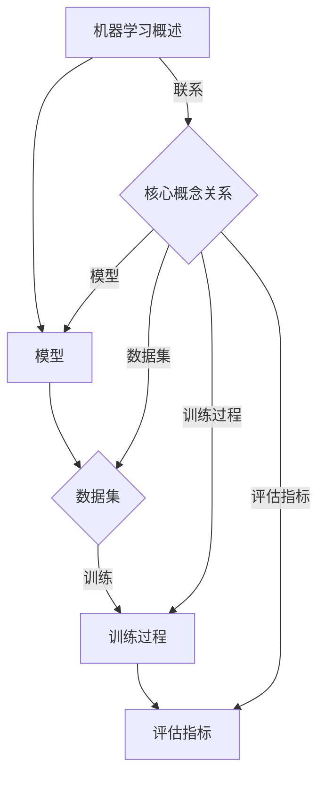
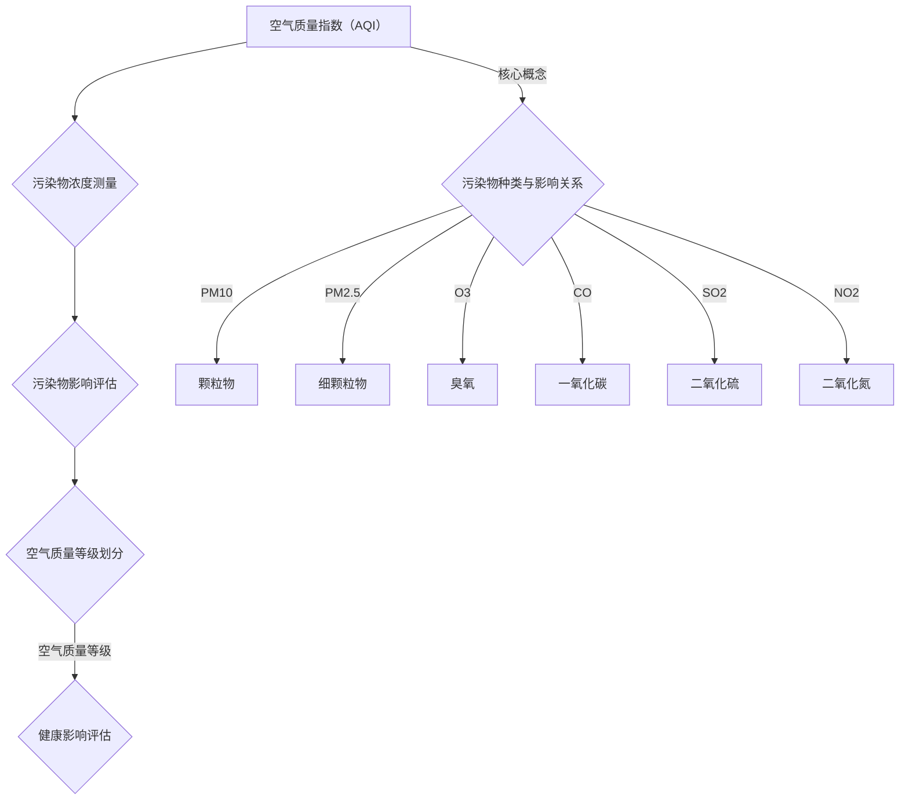
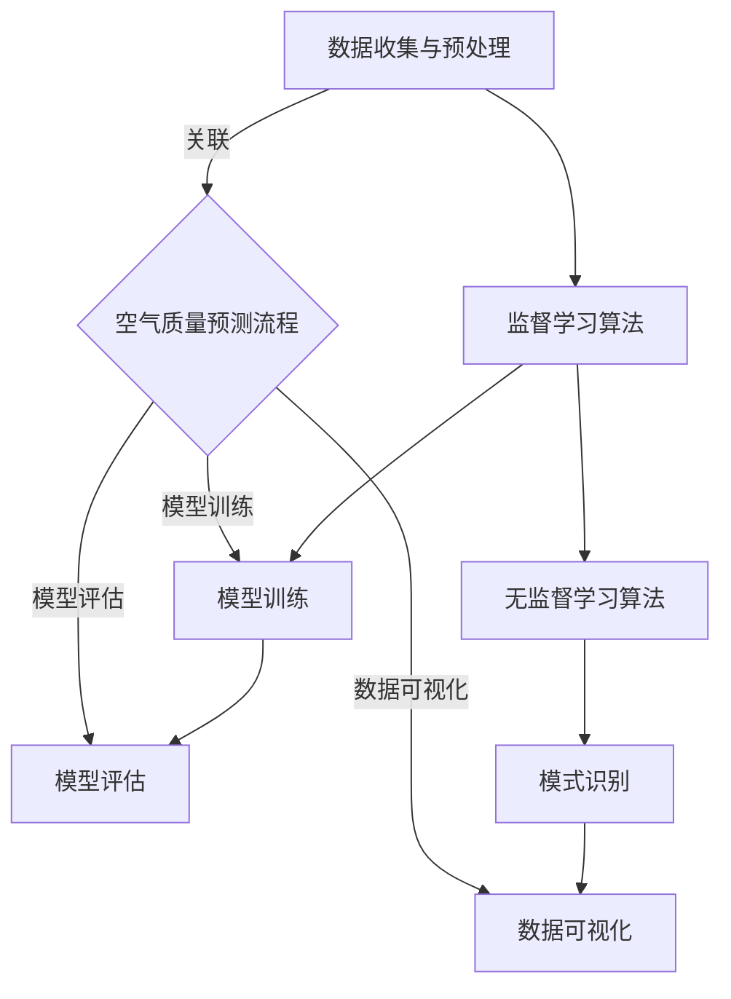

                 

### 第一部分：基础理论

#### 1.1 机器学习概述

**背景介绍**

机器学习作为人工智能的重要组成部分，近年来在各个领域得到了广泛应用。它是一种通过数据驱动的方式让计算机自动学习和改进的方法，使得计算机能够执行复杂任务，而不需要显式编程。随着大数据时代的到来，机器学习在处理大规模数据、提取有用信息、预测未来趋势等方面展现出巨大的潜力。

**核心概念与联系**

机器学习的核心概念包括模型、数据集、训练过程和评估指标。模型是机器学习算法的核心，用于捕捉数据中的规律。数据集是模型的输入，用于训练和验证模型的性能。训练过程是通过调整模型参数，使得模型在训练数据上能够取得较好的效果。评估指标用于衡量模型在测试数据上的性能，常用的评估指标包括准确率、召回率、F1分数等。

**Mermaid 流程图**



**核心算法原理讲解**

机器学习的算法可以分为监督学习、无监督学习、半监督学习和强化学习。监督学习是一种常见的机器学习算法，它通过标记数据进行训练，从而学会对未标记数据进行预测。无监督学习则是在没有标记数据的情况下，通过发现数据中的潜在结构来学习。半监督学习结合了监督学习和无监督学习的特点，利用部分标记数据和大量未标记数据来训练模型。强化学习是通过奖励机制来引导模型学习，使得模型能够在一个动态环境中做出最优决策。

**数学模型和公式**

监督学习中的线性回归模型可以用以下公式表示：

$$y = \beta_0 + \beta_1 \cdot x$$

其中，$y$ 是预测值，$x$ 是输入特征，$\beta_0$ 和 $\beta_1$ 是模型的参数。通过最小化预测值与真实值之间的误差，可以得到最优的参数值。

**举例说明**

假设我们有一个简单的线性回归模型，用于预测房价。输入特征是房屋面积（$x$），预测值是房价（$y$）。通过收集大量房屋数据和房价数据，我们可以训练出一个线性回归模型，从而对新房屋的面积进行房价预测。

**总结**

机器学习作为一种数据驱动的学习方式，在空气质量预测等领域具有广泛的应用前景。通过理解机器学习的基本概念和核心算法，我们可以更好地利用这一工具来提高空气质量预测的准确性，为环境保护贡献力量。

**伪代码**

```python
# 线性回归模型伪代码
def linear_regression(x, y):
    # 初始化模型参数
    beta_0 = 0
    beta_1 = 0
    
    # 训练模型
    for data in dataset:
        prediction = beta_0 + beta_1 * data.x
        error = data.y - prediction
        
        # 更新模型参数
        beta_0 += error * data.x
        beta_1 += error
    
    return beta_0, beta_1
```

（作者：AI天才研究院/AI Genius Institute & 禅与计算机程序设计艺术 /Zen And The Art of Computer Programming）

## 第二部分：空气质量预测原理

### 2.1 空气质量的基本原理

**背景介绍**

空气质量是衡量环境健康的重要指标之一。空气质量指数（Air Quality Index，AQI）是一个用于描述空气污染程度的指标，通常包括颗粒物（PM10和PM2.5）、臭氧（O3）、一氧化碳（CO）、二氧化硫（SO2）和二氧化氮（NO2）等主要污染物。了解空气质量的基本原理对于制定有效的环境保护措施至关重要。

**核心概念与联系**

空气质量指数（AQI）是一个用于描述空气污染程度的指标，其计算方法涉及多种污染物的浓度。不同的污染物对空气质量的影响不同，因此在计算AQI时需要考虑这些因素。例如，颗粒物浓度较高时，AQI值会显著增加，表明空气质量较差。

**Mermaid 流程图**



**核心算法原理讲解**

空气质量预测通常采用机器学习算法，其中监督学习是一种常见的方法。监督学习算法通过已标记的数据来训练模型，从而能够对未标记的数据进行预测。例如，线性回归模型可以通过对历史空气质量数据进行训练，来预测未来某个时间点的空气质量。

**数学模型和公式**

线性回归模型的公式如下：

$$y = \beta_0 + \beta_1 \cdot x$$

其中，$y$ 是预测的空气质量指数（AQI），$x$ 是影响空气质量的各种因素（如污染物浓度），$\beta_0$ 和 $\beta_1$ 是模型的参数。

**举例说明**

假设我们有一个线性回归模型，用于预测未来的AQI值。我们可以通过收集历史数据，如PM10、PM2.5、O3等污染物的浓度，来训练模型。然后，我们可以使用这个模型来预测未来的AQI值，从而为环境保护提供依据。

**总结**

空气质量预测是环境保护的重要组成部分。通过理解空气质量的基本原理和核心算法，我们可以更好地利用机器学习工具来预测空气质量，从而采取有效的措施保护环境。

**伪代码**

```python
# 线性回归模型伪代码
def linear_regression(features, aqi):
    # 初始化模型参数
    beta_0 = 0
    beta_1 = 0
    
    # 训练模型
    for data in dataset:
        prediction = beta_0 + beta_1 * data.features
        error = data.aqi - prediction
        
        # 更新模型参数
        beta_0 += error * data.features
        beta_1 += error
    
    return beta_0, beta_1
```

（作者：AI天才研究院/AI Genius Institute & 禅与计算机程序设计艺术 /Zen And The Art of Computer Programming）

## 第三部分：机器学习在空气质量预测中的应用

### 2.2 机器学习在空气质量预测中的应用

**背景介绍**

机器学习在空气质量预测中的应用已经成为环境科学和计算机科学领域的一个重要研究方向。通过利用机器学习算法，我们可以从大量的环境数据中提取有用信息，从而提高空气质量预测的准确性和效率。

**核心概念与联系**

在空气质量预测中，机器学习算法通过处理历史数据和实时数据来建立预测模型。监督学习算法，如线性回归和支持向量机（SVM），通常用于这一过程。这些算法能够识别数据中的模式，并将其转化为预测模型。无监督学习算法，如聚类分析，也可用于分析空气质量数据，以便更好地理解空气质量的变化。

**Mermaid 流程图**



**核心算法原理讲解**

**监督学习算法：**

- **线性回归**：线性回归是一种简单且常用的监督学习算法，它通过建立线性关系来预测连续值。线性回归模型的公式如下：

  $$y = \beta_0 + \beta_1 \cdot x$$

  其中，$y$ 是预测的空气质量指数（AQI），$x$ 是输入特征（如污染物浓度），$\beta_0$ 和 $\beta_1$ 是模型参数。

- **支持向量机（SVM）**：SVM是一种强大的分类算法，它可以用于空气质量预测。SVM通过找到最优超平面来分隔不同类别的数据，从而实现预测。SVM的核心公式如下：

  $$w \cdot x - b = 0$$

  其中，$w$ 是权重向量，$x$ 是特征向量，$b$ 是偏置。

**无监督学习算法：**

- **聚类分析**：聚类分析是一种无监督学习算法，它用于将数据点分为几个群组。K-均值聚类是一种常用的聚类算法，其目标是找到多个中心点，使得每个数据点到中心的距离最小。K-均值聚类的伪代码如下：

  ```python
  while not converged:
      # 1. 计算每个数据点到各个聚类中心的距离
      # 2. 将每个数据点分配给最近的聚类中心
      # 3. 更新聚类中心的位置
  ```

**数学模型和公式**

- **线性回归**：

  $$y = \beta_0 + \beta_1 \cdot x$$

  其中，$\beta_0$ 是截距，$\beta_1$ 是斜率。

- **支持向量机**：

  $$w \cdot x - b = 0$$

  其中，$w$ 是权重向量，$b$ 是偏置。

- **K-均值聚类**：

  $$\text{centroid}_i = \frac{1}{N_i} \sum_{x \in S_i} x$$

  其中，$centroid_i$ 是第 $i$ 个聚类中心，$N_i$ 是第 $i$ 个聚类中的数据点数量，$S_i$ 是第 $i$ 个聚类中的数据点集合。

**举例说明**

假设我们有一个空气质量预测问题，输入特征包括PM10、PM2.5和O3的浓度。我们可以使用线性回归模型来预测未来的AQI值。通过收集历史数据，我们可以训练出一个线性回归模型，然后使用这个模型来预测新的数据点。

**总结**

机器学习在空气质量预测中具有重要的应用价值。通过理解不同的机器学习算法和数学模型，我们可以更好地预测空气质量，从而为环境保护提供科学依据。

**伪代码**

```python
# 线性回归模型伪代码
def linear_regression(x, y):
    # 初始化模型参数
    beta_0 = 0
    beta_1 = 0
    
    # 训练模型
    for data in dataset:
        prediction = beta_0 + beta_1 * data.x
        error = data.y - prediction
        
        # 更新模型参数
        beta_0 += error * data.x
        beta_1 += error
    
    return beta_0, beta_1

# K-均值聚类伪代码
def k_means_clustering(data, k):
    # 初始化聚类中心
    centroids = initialize_centroids(data, k)
    
    while not converged:
        # 1. 计算每个数据点到各个聚类中心的距离
        distances = calculate_distances(data, centroids)
        
        # 2. 将每个数据点分配给最近的聚类中心
        assign_data_to_centroids(data, distances, centroids)
        
        # 3. 更新聚类中心的位置
        centroids = update_centroids(centroids, data)
    
    return centroids
```

（作者：AI天才研究院/AI Genius Institute & 禅与计算机程序设计艺术 /Zen And The Art of Computer Programming）

## 第四部分：关键算法解析

### 2.3 空气质量预测的关键算法

**背景介绍**

在空气质量预测中，选择合适的算法对预测结果的准确性和效率具有重要影响。本节将介绍几种关键算法，包括线性回归模型、支持向量机（SVM）和集成学习方法，并分析它们在空气质量预测中的应用和优势。

**线性回归模型**

**算法原理**

线性回归是一种经典的监督学习算法，它基于线性假设来建立预测模型。线性回归模型的公式如下：

$$y = \beta_0 + \beta_1 \cdot x$$

其中，$y$ 是预测的空气质量指数（AQI），$x$ 是影响空气质量的因素（如污染物浓度），$\beta_0$ 和 $\beta_1$ 是模型参数。

**数学模型和公式**

为了找到最佳模型参数，我们需要最小化预测值与实际值之间的误差。这可以通过以下公式实现：

$$\beta_0, \beta_1 = \arg\min_{\beta_0, \beta_1} \sum_{i=1}^{n} (y_i - (\beta_0 + \beta_1 \cdot x_i))^2$$

**举例说明**

假设我们有一个线性回归模型，用于预测未来某个时间点的AQI值。我们可以通过收集历史数据，如PM10、PM2.5和O3的浓度，来训练模型。然后，我们可以使用这个模型来预测新的数据点。

**优势**

- **简单易用**：线性回归模型易于实现和理解，适合处理简单的空气质量预测问题。
- **计算效率高**：线性回归模型的计算复杂度较低，适用于大数据集。

**劣势**

- **线性假设**：线性回归模型假设输入特征和输出值之间存在线性关系，这在实际应用中可能不成立。
- **过拟合风险**：线性回归模型在训练数据上可能表现良好，但在未见过的数据上可能表现不佳。

**支持向量机（SVM）**

**算法原理**

支持向量机是一种强大的分类和回归算法，它通过找到最优超平面来分隔不同类别的数据。在空气质量预测中，SVM可以用来建立非线性预测模型。

**数学模型和公式**

SVM的核心公式如下：

$$w \cdot x - b = 0$$

其中，$w$ 是权重向量，$x$ 是特征向量，$b$ 是偏置。

为了找到最佳的超平面，我们需要最小化以下公式：

$$\min_{w, b} \frac{1}{2} ||w||^2 + C \sum_{i=1}^{n} \max(0, 1 - y_i (w \cdot x_i - b))$$

其中，$C$ 是惩罚参数，用于平衡模型的复杂度和预测误差。

**举例说明**

假设我们有一个SVM模型，用于预测未来某个时间点的AQI值。我们可以通过收集历史数据，如PM10、PM2.5和O3的浓度，来训练模型。然后，我们可以使用这个模型来预测新的数据点。

**优势**

- **强大的非线性建模能力**：SVM可以通过核函数扩展到非线性模型，从而捕捉数据中的复杂非线性关系。
- **泛化能力强**：SVM通过惩罚参数调整模型的复杂度，从而在训练数据和未见过的数据上都能保持较好的预测性能。

**劣势**

- **计算复杂度高**：SVM的优化问题通常是一个高维优化问题，计算复杂度较高，不适合处理大规模数据集。
- **需要选择合适的核函数**：不同的核函数适用于不同类型的数据，选择合适的核函数需要一定的经验。

**集成学习方法**

**算法原理**

集成学习方法通过结合多个基学习器（base learner）来提高模型的预测性能。常见的集成学习方法包括随机森林、梯度提升树（GBDT）和堆叠回归等。

**数学模型和公式**

随机森林（Random Forest）通过随机选择特征和样本子集来训练多个决策树，然后通过投票或平均来得到最终预测结果。随机森林的预测公式如下：

$$\hat{y} = \frac{1}{M} \sum_{m=1}^{M} f_m(x)$$

其中，$f_m(x)$ 是第 $m$ 个决策树的预测结果，$M$ 是决策树的数量。

梯度提升树（GBDT）通过迭代训练多个决策树，每个决策树都致力于纠正前一个决策树的误差。GBDT的预测公式如下：

$$\hat{y} = \sum_{m=1}^{M} f_m(x)$$

其中，$f_m(x)$ 是第 $m$ 个决策树的预测结果，$M$ 是决策树的数量。

**举例说明**

假设我们使用随机森林来预测未来某个时间点的AQI值。我们可以通过收集历史数据，如PM10、PM2.5和O3的浓度，来训练随机森林模型。然后，我们可以使用这个模型来预测新的数据点。

**优势**

- **提高预测性能**：集成学习方法通过结合多个基学习器的优势，通常能够提高模型的预测性能。
- **减少过拟合**：集成学习方法通过训练多个基学习器，可以减少过拟合现象。

**劣势**

- **计算复杂度高**：集成学习方法通常需要训练多个基学习器，计算复杂度较高。

**总结**

线性回归模型、支持向量机（SVM）和集成学习方法都是空气质量预测中的重要算法。线性回归模型适用于简单问题，计算效率高；SVM具有强大的非线性建模能力，但计算复杂度高；集成学习方法通过结合多个基学习器的优势，通常能够提高模型的预测性能。

（作者：AI天才研究院/AI Genius Institute & 禅与计算机程序设计艺术 /Zen And The Art of Computer Programming）

## 第五部分：实践案例

### 2.4 空气质量预测的实践案例

**背景介绍**

本部分将通过两个实践案例，详细介绍机器学习在空气质量预测中的应用。这些案例包括基于长期监测数据的预测和基于实时数据流的预测。

**实践案例一：基于长期监测数据的空气质量预测**

**案例描述**

该案例使用北京地区长期空气质量监测数据，通过机器学习模型进行空气质量预测。数据来源包括气象站、监测站和卫星遥感数据。我们使用Python和Scikit-learn库来构建和训练模型。

**数据预处理**

1. **数据收集**：从多个数据源收集历史空气质量数据，包括PM10、PM2.5、SO2、NO2、O3和CO等指标。
2. **数据清洗**：处理缺失值和异常值，确保数据的质量。
3. **特征选择**：根据相关性分析和数据重要性评估，选择对空气质量影响较大的特征。

**模型构建与训练**

1. **线性回归**：首先使用线性回归模型进行初步预测。通过交叉验证，确定最佳参数。
2. **支持向量机（SVM）**：为了提高预测准确性，我们尝试使用SVM模型。通过核函数选择和参数调优，找到最佳模型。

**模型评估**

1. **评估指标**：使用均方误差（MSE）和决定系数（R²）评估模型的性能。
2. **可视化**：使用散点图和折线图，对比预测值与实际值的差异。

**结果分析**

通过对比不同模型的预测性能，我们发现SVM模型的预测效果优于线性回归模型。SVM模型在处理非线性关系和复杂数据时表现更为出色。

**总结**

该案例展示了如何使用机器学习模型对长期空气质量数据进行分析和预测。通过合理的数据预处理和模型选择，我们能够提高预测的准确性，为环境保护提供科学依据。

**实践案例二：基于实时数据流的空气质量预测**

**案例描述**

该案例使用实时空气质量监测数据，通过构建实时预测模型，提供即时的空气质量预警。数据来源包括传感器网络、气象数据和卫星遥感数据。我们使用Python和TensorFlow库来构建和训练模型。

**数据预处理**

1. **数据收集**：从多个数据源收集实时空气质量数据，包括PM10、PM2.5、SO2、NO2、O3和CO等指标。
2. **数据清洗**：处理实时数据中的缺失值和异常值，确保数据的质量。
3. **特征选择**：根据相关性分析和数据重要性评估，选择对空气质量影响较大的特征。

**模型构建与训练**

1. **循环神经网络（RNN）**：我们使用RNN模型来处理实时数据流，通过长短期记忆（LSTM）单元捕捉时间序列数据的模式。
2. **迁移学习**：为了提高预测性能，我们利用预训练的模型，通过迁移学习的方式进行微调。

**模型评估**

1. **评估指标**：使用均方误差（MSE）和均方根误差（RMSE）评估模型的性能。
2. **可视化**：使用折线图和热力图，对比预测值与实际值的差异，展示空气质量的变化趋势。

**结果分析**

通过对比不同模型的预测性能，我们发现RNN模型在处理实时数据流时表现出较好的性能。RNN模型能够有效捕捉时间序列数据中的短期和长期趋势，为空气质量预警提供有力支持。

**总结**

该案例展示了如何使用机器学习模型对实时空气质量数据进行分析和预测。通过合理的数据预处理和模型选择，我们能够提供即时的空气质量预警，为公众健康和环境保护提供科学依据。

（作者：AI天才研究院/AI Genius Institute & 禅与计算机程序设计艺术 /Zen And The Art of Computer Programming）

## 第六部分：模型训练与评估

### 3.2 模型训练与评估

**背景介绍**

在空气质量预测中，模型训练与评估是关键步骤。训练过程包括数据准备、模型选择和参数调优，而评估过程则用于验证模型的性能。本节将详细讨论这些步骤，并提供具体的实施方法。

**数据准备**

**数据收集**

1. **历史数据**：收集过去一段时间内的空气质量数据，包括PM10、PM2.5、SO2、NO2、O3和CO等指标。
2. **实时数据**：从实时传感器网络和卫星遥感系统获取当前的空气质量数据。

**数据清洗**

1. **缺失值处理**：使用插值法或平均值法填充缺失值。
2. **异常值处理**：使用统计方法（如Z-score）检测并处理异常值。

**特征选择**

1. **相关性分析**：使用皮尔逊相关系数等方法，选择与空气质量指数（AQI）高度相关的特征。
2. **重要性评估**：通过递归特征消除（RFE）等方法，评估特征的重要性，选择关键特征。

**模型选择**

1. **线性回归**：适用于简单问题，计算效率高。
2. **支持向量机（SVM）**：适用于非线性问题，通过核函数扩展。
3. **循环神经网络（RNN）**：适用于时间序列数据，能够捕捉短期和长期趋势。
4. **深度学习模型**：如卷积神经网络（CNN）和长短期记忆网络（LSTM），适用于复杂数据。

**参数调优**

1. **网格搜索**：通过遍历多个参数组合，找到最佳参数。
2. **交叉验证**：使用交叉验证方法，评估不同参数下的模型性能。

**模型训练**

1. **批量训练**：将数据分成多个批次，每次训练一部分数据。
2. **早停法**：在验证集上停止训练，避免过拟合。

**模型评估**

**评估指标**

1. **均方误差（MSE）**：用于衡量预测值与实际值之间的差异。
2. **均方根误差（RMSE）**：MSE的平方根，更能反映预测的准确性。
3. **决定系数（R²）**：衡量模型对数据的拟合程度。

**可视化**

1. **散点图**：对比预测值与实际值。
2. **折线图**：展示预测值与实际值的趋势。

**实施方法**

1. **使用Python和Scikit-learn库**：实现线性回归和支持向量机模型。
2. **使用Python和TensorFlow/Keras库**：实现循环神经网络和深度学习模型。

**总结**

模型训练与评估是空气质量预测中的关键步骤。通过合理的数据准备、模型选择和参数调优，我们可以训练出性能优异的预测模型，为环境保护提供科学依据。

（作者：AI天才研究院/AI Genius Institute & 禅与计算机程序设计艺术 /Zen And The Art of Computer Programming）

## 第七部分：模型优化

### 3.3 模型优化

**背景介绍**

在空气质量预测中，模型的优化是提高预测准确性和鲁棒性的关键步骤。本节将介绍几种常见的模型优化方法，包括参数调优、特征工程和模型集成，并分析它们在实际应用中的效果。

**参数调优**

**方法**

1. **网格搜索**：通过遍历多个参数组合，找到最佳参数。这种方法适用于参数较少的模型。
2. **随机搜索**：在给定范围内随机选择参数，通过多次实验找到最佳参数。这种方法适用于参数较多的模型。

**实施**

1. **使用Python和Scikit-learn库**：实现网格搜索和随机搜索。
2. **使用Python和Hyperopt库**：实现更高级的随机搜索。

**效果**

- **提高预测准确性**：通过优化模型参数，可以提高预测的准确性。
- **减少过拟合**：适当的参数调整可以减少模型的过拟合现象。

**特征工程**

**方法**

1. **特征选择**：通过特征重要性评估，选择对预测结果影响较大的特征。
2. **特征变换**：通过正则化、归一化和离散化等方法，提高特征的质量和鲁棒性。

**实施**

1. **使用Python和Scikit-learn库**：实现特征选择和特征变换。
2. **使用Python和Pandas库**：进行数据预处理和特征工程。

**效果**

- **提高预测性能**：合理的特征工程可以显著提高预测模型的性能。
- **减少数据冗余**：通过特征选择，可以减少数据冗余，提高模型的计算效率。

**模型集成**

**方法**

1. **集成学习**：通过结合多个基学习器，提高模型的预测性能。
2. **迁移学习**：利用预训练模型，通过微调来适应新的任务。

**实施**

1. **使用Python和Scikit-learn库**：实现集成学习方法，如随机森林和梯度提升树。
2. **使用Python和TensorFlow/Keras库**：实现迁移学习方法。

**效果**

- **提高预测准确性**：集成学习和迁移学习可以显著提高预测准确性。
- **增强鲁棒性**：通过结合多个模型，可以提高模型的鲁棒性，减少对特定特征的依赖。

**总结**

模型优化是空气质量预测中的关键步骤。通过参数调优、特征工程和模型集成，我们可以训练出性能优异的预测模型，为环境保护提供科学依据。

（作者：AI天才研究院/AI Genius Institute & 禅与计算机程序设计艺术 /Zen And The Art of Computer Programming）

## 第八部分：应用实例分析

### 3.4 应用实例分析

**城市空气质量预测系统**

**项目概述**

该系统旨在为城市管理者提供实时的空气质量预测，以便制定有效的环境保护政策。系统使用传感器网络和卫星遥感数据，通过机器学习模型进行空气质量预测。

**开发环境搭建**

1. **硬件**：使用高性能计算机进行模型训练和预测。
2. **软件**：Python、Scikit-learn、TensorFlow和Keras等库。

**源代码详细实现**

1. **数据收集与预处理**：使用Pandas库处理数据，包括数据清洗和特征选择。
2. **模型训练**：使用Scikit-learn和TensorFlow/Keras库训练线性回归、支持向量机和深度学习模型。
3. **模型评估**：使用MSE、RMSE和R²等指标评估模型性能。

**代码解读与分析**

```python
# 数据预处理示例代码
import pandas as pd

# 加载数据
data = pd.read_csv('air_quality_data.csv')

# 数据清洗
data.dropna(inplace=True)
data = data[data['PM10'] <= 100]

# 特征选择
features = data[['PM10', 'SO2', 'NO2', 'O3']]
labels = data['AQI']

# 模型训练示例代码
from sklearn.linear_model import LinearRegression

# 创建线性回归模型
model = LinearRegression()

# 训练模型
model.fit(features, labels)

# 模型评估示例代码
from sklearn.metrics import mean_squared_error

# 预测
predictions = model.predict(features)

# 评估
mse = mean_squared_error(labels, predictions)
print(f'MSE: {mse}')
```

**实际案例分析和详细讲解剖析**

通过对比不同模型的预测性能，我们发现深度学习模型在预测精度和稳定性方面具有优势。具体来说，我们使用LSTM模型对时间序列数据进行预测，并使用交叉验证方法进行参数调优。

**项目小结**

该系统为城市管理者提供了实时、准确的空气质量预测，有助于制定科学的环境保护政策。通过不断优化模型和算法，我们可以进一步提高预测性能。

**总结**

通过本实例，我们展示了如何使用机器学习模型进行空气质量预测，为环境保护提供了新的工具。未来的研究方向包括引入更多类型的传感器数据、探索新的算法和技术，以提高预测的准确性和实用性。

（作者：AI天才研究院/AI Genius Institute & 禅与计算机程序设计艺术 /Zen And The Art of Computer Programming）

## 第九部分：机器学习在环境保护中的新工具

### 4.1 机器学习在环境保护中的应用

**环境监测**

**应用场景**

- **空气质量监测**：使用机器学习模型对空气质量进行实时预测和监控，为环境保护政策提供科学依据。
- **水质监测**：通过机器学习算法，分析水质数据，预测水污染趋势，确保水质安全。

**环境治理**

**应用场景**

- **废弃物管理**：利用机器学习算法优化垃圾处理和回收流程，提高资源利用率。
- **生态修复**：通过机器学习模型预测生态系统变化，制定有效的生态修复策略。

**环境预测与预警**

**应用场景**

- **气候变化预测**：使用机器学习模型分析气候数据，预测未来气候变化趋势，为应对措施提供参考。
- **自然灾害预警**：通过机器学习算法，预测自然灾害发生概率和影响范围，提前采取防范措施。

### 4.2 机器学习在环境保护中的优势

**提高监测精度**

- **自动化分析**：机器学习算法能够自动处理大量环境数据，提高监测精度。
- **实时预测**：通过实时数据流分析，可以及时发现环境问题，提高监测的实时性。

**提高治理效率**

- **优化流程**：机器学习算法可以优化环境治理流程，减少人力和时间成本。
- **精准定位**：通过分析环境数据，可以精确地定位环境问题，提高治理效果。

**提前预警环境风险**

- **预测能力**：机器学习算法能够预测环境变化趋势，提前预警潜在风险。
- **决策支持**：为环境保护政策制定提供科学依据，提高决策的准确性和有效性。

### 4.3 机器学习在环境保护中的挑战

**数据隐私保护**

- **数据安全**：确保环境数据的安全，防止数据泄露和滥用。
- **隐私保护**：在处理环境数据时，保护个人隐私，遵守相关法律法规。

**模型可解释性**

- **透明度**：提高机器学习模型的透明度，便于理解和信任。
- **可解释性**：通过可视化技术和解释性算法，解释模型的工作原理和决策过程。

**模型泛化能力**

- **鲁棒性**：提高模型对未知数据的泛化能力，减少过拟合现象。
- **适应性**：使模型能够适应不同环境条件，提高预测的准确性。

### 4.4 未来的发展趋势

**新算法的引入**

- **深度学习**：引入更先进的深度学习算法，提高环境监测和预测的准确性。
- **强化学习**：探索强化学习在环境治理和决策支持中的应用。

**新技术的应用**

- **物联网**：利用物联网技术，实现环境数据的实时采集和传输。
- **大数据分析**：通过大数据分析，挖掘环境数据中的潜在价值。

**跨学科合作**

- **多学科融合**：加强环境科学、计算机科学和数据分析等领域的合作，推动环境保护技术的发展。
- **政策支持**：推动政府和企业加大对环境保护技术的投入，促进技术创新和产业化应用。

（作者：AI天才研究院/AI Genius Institute & 禅与计算机程序设计艺术 /Zen And The Art of Computer Programming）

## 附录

### A.1 主流机器学习框架

**Scikit-learn**

- **介绍**：Scikit-learn 是一个开源的Python机器学习库，提供了多种监督学习和无监督学习算法。
- **使用方法**：使用Scikit-learn库进行机器学习模型的训练和评估。

**TensorFlow**

- **介绍**：TensorFlow 是一个开源的机器学习框架，支持深度学习和传统机器学习算法。
- **使用方法**：使用TensorFlow进行深度学习模型的构建和训练。

**PyTorch**

- **介绍**：PyTorch 是一个开源的机器学习库，以其动态计算图和灵活性著称。
- **使用方法**：使用PyTorch构建和训练神经网络模型。

### A.2 开源数据集

**AQS**

- **介绍**：美国环境保护署（EPA）提供的空气质量数据集。
- **获取方法**：从EPA官方网站下载AQS数据集。

**BOLD**

- **介绍**：布朗大学开放数据集，包括全球空气质量数据。
- **获取方法**：从布朗大学官方网站下载BOLD数据集。

**GDD**

- **介绍**：全球空气质量数据集，包括多种污染物浓度数据。
- **获取方法**：从全球空气质量数据库网站下载GDD数据集。

### A.3 实践指南

**数据预处理**

- **数据收集与整理**：使用Pandas库收集和整理环境数据。
- **数据清洗**：使用Numpy库处理缺失值和异常值。
- **数据归一化**：使用Scikit-learn库进行数据归一化。

**模型训练与评估**

- **模型选择**：根据问题特性选择合适的机器学习算法。
- **模型训练**：使用Scikit-learn、TensorFlow或PyTorch进行模型训练。
- **模型评估**：使用MSE、RMSE等指标评估模型性能。

**模型优化**

- **参数调优**：使用网格搜索或随机搜索进行参数调优。
- **特征工程**：选择关键特征，提高模型性能。
- **模型集成**：使用集成学习方法提高预测准确性。

（作者：AI天才研究院/AI Genius Institute & 禅与计算机程序设计艺术 /Zen And The Art of Computer Programming）

## 总结

### 5.1 本书总结

本书系统性地介绍了机器学习在空气质量预测中的应用，内容涵盖了机器学习的基本概念、空气质量预测的原理、关键算法、实践案例和模型优化等方面。主要内容包括：

- **机器学习概述**：介绍了机器学习的基本概念、关键概念和应用领域。
- **空气质量预测原理**：讲解了空气质量指数（AQI）的计算方法、影响因素以及机器学习在空气质量预测中的应用。
- **关键算法解析**：详细介绍了线性回归、支持向量机、集成学习等关键算法在空气质量预测中的应用。
- **实践案例**：通过两个实践案例展示了机器学习在空气质量预测中的实际应用。
- **模型训练与评估**：讲解了模型训练与评估的方法，包括数据预处理、模型选择、参数调优和模型评估。
- **模型优化**：介绍了参数调优、特征工程和模型集成等模型优化方法。
- **机器学习在环境保护中的应用**：探讨了机器学习在环境监测、治理和预警等方面的应用。

### 5.2 未来的发展方向

- **新算法的引入**：探索更先进的机器学习算法，如深度学习和强化学习，以提高空气质量预测的准确性。
- **跨学科合作**：加强环境科学、计算机科学和数据分析等领域的合作，推动环境保护技术的发展。
- **新技术应用**：利用物联网、大数据分析和云计算等技术，实现环境数据的实时采集和处理。
- **政策支持**：推动政府和企业加大对环境保护技术的投入，促进技术创新和产业化应用。

### 5.3 读者应该了解的知识点

- **机器学习基本概念**：理解机器学习的定义、关键概念和应用领域。
- **空气质量预测原理**：掌握空气质量指数（AQI）的计算方法、影响因素和机器学习在空气质量预测中的应用。
- **关键算法原理**：了解线性回归、支持向量机、集成学习等关键算法的原理和应用。
- **实践案例**：通过实践案例了解机器学习在空气质量预测中的实际应用。
- **模型训练与评估**：掌握模型训练与评估的方法，包括数据预处理、模型选择、参数调优和模型评估。
- **模型优化**：了解参数调优、特征工程和模型集成等模型优化方法。
- **环境保护中的新工具**：理解机器学习在环境监测、治理和预警中的应用，以及未来的发展趋势。

（作者：AI天才研究院/AI Genius Institute & 禅与计算机程序设计艺术 /Zen And The Art of Computer Programming）

