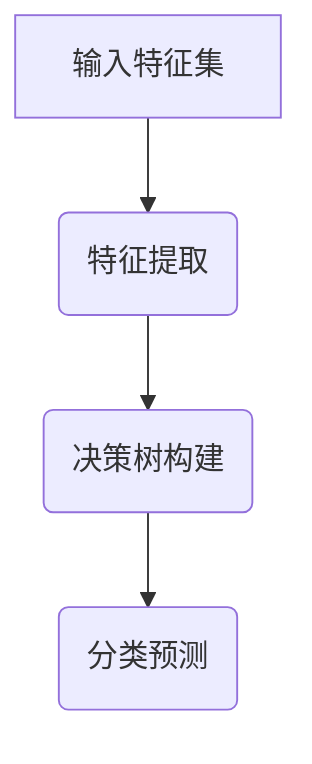
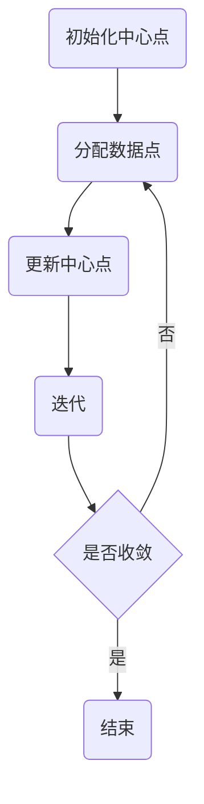

                 


## 书名:《机器学习在网络安全中的预测性应用》

### 1. 设计原则

在设计《机器学习在网络安全中的预测性应用》一书的目录大纲时，我们将遵循以下原则：

- **全面覆盖主题内容**：确保所有重要的机器学习在网络安全中的应用场景、算法和技术都得到详细阐述。
- **逻辑清晰**：目录结构要清晰，方便读者按照顺序逐步理解相关内容。
- **可操作性**：提供具体的案例和代码实现，使读者能够将理论知识应用到实际项目中。

### 2. 目录大纲结构

我们将书分为以下几个主要部分：

- **第一部分：基础知识与核心概念**
- **第二部分：机器学习在网络安全中的预测性应用**
- **第三部分：应用案例与实战**
- **第四部分：未来发展展望**

### 3. 目录大纲

#### 第一部分：基础知识与核心概念
##### 第1章：机器学习与网络安全概述
- 1.1 机器学习简介
- 1.2 网络安全面临的挑战
- 1.3 机器学习在网络安全中的作用

##### 第2章：机器学习基础
- 2.1 监督学习
- 2.2 非监督学习
- 2.3 强化学习
- 2.4 特征工程

##### 第3章：网络安全核心概念
- 3.1 网络威胁分析
- 3.2 入侵检测系统（IDS）
- 3.3 入侵防御系统（IPS）

##### 第4章：机器学习在网络安全中的应用框架
- 4.1 网络安全数据分析
- 4.2 模型选择与评估
- 4.3 模型集成与优化

#### 第二部分：机器学习在网络安全中的预测性应用
##### 第5章：恶意软件检测
- 5.1 恶意软件特征提取
- 5.2 恶意软件分类算法
- 5.3 实战案例：基于深度学习的恶意软件检测

##### 第6章：入侵检测
- 6.1 入侵检测系统架构
- 6.2 入侵检测算法
- 6.3 实战案例：基于机器学习的入侵检测系统开发

##### 第7章：安全事件预测
- 7.1 安全事件预测模型
- 7.2 安全事件预测算法
- 7.3 实战案例：利用机器学习预测网络攻击

#### 第三部分：应用案例与实战
##### 第8章：网络钓鱼检测
- 8.1 钓鱼攻击特征提取
- 8.2 钓鱼攻击分类算法
- 8.3 实战案例：构建网络钓鱼检测系统

##### 第9章：DDoS攻击防御
- 9.1 DDoS攻击特点
- 9.2 DDoS攻击防御策略
- 9.3 实战案例：DDoS攻击防御系统的设计与实现

##### 第10章：实战案例集成
- 10.1 多个案例的综合应用
- 10.2 模型部署与监控
- 10.3 案例分析与优化

#### 第四部分：未来发展展望
##### 第11章：机器学习在网络安全中的新趋势
- 11.1 自动化与智能化
- 11.2 联邦学习与隐私保护
- 11.3 人工智能与网络安全的未来挑战与机遇

### 4. 总结

本目录大纲为《机器学习在网络安全中的预测性应用》一书设计了详细的章节结构，旨在帮助读者全面了解机器学习在网络安全领域的应用，从基础知识到实际案例，再到未来趋势，形成了一个完整的学习路径。本书旨在通过理论与实践相结合，提高读者在网络安全中的机器学习应用能力。

## 文章标题：机器学习在网络安全中的预测性应用

关键词：机器学习，网络安全，预测性应用，恶意软件检测，入侵检测，安全事件预测

摘要：本文将深入探讨机器学习在网络安全中的预测性应用。随着网络攻击的日益复杂化，传统的网络安全手段已经难以应对。本文首先介绍了机器学习的基本概念和网络安全的核心问题，然后详细阐述了机器学习在恶意软件检测、入侵检测和安全事件预测等领域的应用，并通过具体案例展示了如何将机器学习技术应用到实际项目中。最后，本文对机器学习在网络安全中的未来发展进行了展望。

## 引言

### 1.1 背景

在当今数字化时代，网络安全已成为全球关注的重要议题。随着互联网的普及和电子商务的快速发展，网络攻击的手段也日益翻新，传统的网络安全手段已经难以应对日益复杂的网络威胁。据统计，全球每年因网络攻击造成的经济损失高达数十亿美元。为了提高网络安全的防护能力，许多研究机构和企业在网络安全领域进行了大量的研究，其中，机器学习作为一种强大的数据分析工具，正逐渐成为网络安全领域的关键技术。

### 1.2 目的

本文旨在探讨机器学习在网络安全中的预测性应用，通过分析机器学习的基本概念、网络安全的核心问题，以及机器学习在恶意软件检测、入侵检测和安全事件预测等领域的具体应用，帮助读者全面了解并掌握机器学习在网络安全中的实际应用价值。同时，本文也将对机器学习在网络安全中的未来发展进行展望，以期为读者提供未来网络安全技术的发展方向。

## 机器学习与网络安全概述

### 2.1 机器学习简介

机器学习（Machine Learning，ML）是人工智能（Artificial Intelligence，AI）的一个重要分支，它致力于通过计算机程序模拟人类的学习过程，使计算机能够自动地改进和优化其性能。机器学习的基本原理是通过从大量数据中提取模式和规律，然后利用这些模式和规律进行预测和决策。

机器学习可以分为三种类型：监督学习（Supervised Learning）、非监督学习（Unsupervised Learning）和强化学习（Reinforcement Learning）。

- **监督学习**：监督学习是机器学习中最常见的一种类型，它需要使用标注过的数据进行训练。通过学习输入和输出之间的映射关系，监督学习算法可以预测未知数据的标签。
- **非监督学习**：非监督学习是在没有标注数据的情况下进行的，它的目标是发现数据中的隐藏结构和模式。常见的非监督学习算法包括聚类（Clustering）和降维（Dimensionality Reduction）。
- **强化学习**：强化学习是一种通过与环境交互来学习决策策略的机器学习方法。它通过试错和反馈来优化策略，以实现最大化奖励。

### 2.2 网络安全面临的挑战

网络安全面临诸多挑战，其中最突出的包括：

- **网络攻击手段日益翻新**：黑客不断采用新的攻击手段，如勒索软件、分布式拒绝服务攻击（DDoS）、鱼叉式钓鱼攻击等，传统的防御手段难以应对。
- **数据泄露风险增加**：随着大数据和云计算的普及，企业面临的数据泄露风险大幅增加，导致大量敏感信息被泄露。
- **内部威胁**：内部人员滥用权限、恶意攻击等内部威胁也日益突出，增加了网络安全的复杂性。
- **法规和合规要求**：随着网络安全法规的不断完善，企业需要投入大量资源来满足合规要求，否则将面临高额罚款。

### 2.3 机器学习在网络安全中的作用

机器学习在网络安全中发挥着重要作用，主要表现在以下几个方面：

- **恶意软件检测**：通过学习恶意软件的特征，机器学习算法可以有效地检测和分类恶意软件，提高检测的准确性和效率。
- **入侵检测**：利用机器学习算法，可以对网络流量进行分析，实时检测并阻止入侵行为。
- **安全事件预测**：通过分析历史数据，机器学习算法可以预测潜在的网络攻击行为，提前采取防御措施。
- **自动化响应**：机器学习算法可以实现自动化响应，自动执行网络安全策略，减少人工干预。

## 机器学习基础

### 3.1 监督学习

监督学习（Supervised Learning）是一种最常见的机器学习类型，它通过使用标注过的数据（即输入和输出对）来训练模型，从而实现预测新数据的能力。监督学习算法可以分为两类：分类（Classification）和回归（Regression）。

- **分类**：分类算法用于将输入数据分为不同的类别。常见的分类算法包括决策树（Decision Tree）、支持向量机（Support Vector Machine，SVM）、朴素贝叶斯（Naive Bayes）等。
- **回归**：回归算法用于预测连续值的输出。常见的回归算法包括线性回归（Linear Regression）、决策树回归（Decision Tree Regression）等。

**决策树算法**是一种常用的分类算法，它通过一系列的测试来划分数据，每个测试都基于输入特征的一个值。决策树的生成过程如下：

1. **选择最优划分标准**：通常使用基尼不纯度（Gini Impurity）或信息增益（Information Gain）来选择最优的划分标准。
2. **划分数据**：根据最优划分标准，将数据集划分为子集。
3. **递归构建**：对每个子集继续进行划分，直到达到停止条件（如最大深度、最小叶节点样本数等）。

**伪代码**：

```python
def decision_tree_algorithm(data, labels, max_depth=None):
    if data is empty or max_depth=0:
        return majority_vote(labels)
    else:
        best_split = find_best_split(data, labels)
        left_data, right_data = split_data(data, best_split)
        left_tree = decision_tree_algorithm(left_data, labels, max_depth-1)
        right_tree = decision_tree_algorithm(right_data, labels, max_depth-1)
        return {best_split: [left_tree, right_tree]}
```

### 3.2 非监督学习

非监督学习（Unsupervised Learning）是在没有标注数据的情况下进行的，其目标是发现数据中的隐藏结构和模式。非监督学习算法可以分为两大类：聚类（Clustering）和降维（Dimensionality Reduction）。

- **聚类**：聚类算法用于将相似的数据点分组，形成多个簇。常见的聚类算法包括K-均值（K-Means）、层次聚类（Hierarchical Clustering）等。
- **降维**：降维算法用于减少数据的维度，同时保持数据的内在结构。常见的降维算法包括主成分分析（Principal Component Analysis，PCA）、线性判别分析（Linear Discriminant Analysis，LDA）等。

**K-均值聚类算法**是一种简单的聚类算法，其基本思想是将数据点分为K个簇，使得每个簇的中心与数据点的距离最小。算法步骤如下：

1. **初始化**：随机选择K个中心点。
2. **分配数据点**：将每个数据点分配到最近的中心点。
3. **更新中心点**：计算每个簇的均值，作为新的中心点。
4. **迭代**：重复步骤2和3，直到中心点不再变化或达到最大迭代次数。

**伪代码**：

```python
def k_means_algorithm(data, k, max_iterations):
    centers = initialize_centers(data, k)
    for i in range(max_iterations):
        assignments = assign_points_to_centers(data, centers)
        new_centers = calculate_new_centers(assignments, k)
        if centers == new_centers:
            break
        centers = new_centers
    return centers
```

### 3.3 强化学习

强化学习（Reinforcement Learning，RL）是一种通过试错和反馈来学习决策策略的机器学习方法。强化学习的主要目标是使agent（智能体）在与环境的交互过程中，通过不断尝试和修正策略，实现最大化累积奖励。

强化学习的主要组成部分包括：

- **状态（State）**：agent当前所处的环境状态。
- **动作（Action）**：agent可以执行的动作。
- **奖励（Reward）**：agent执行动作后获得的即时奖励。
- **策略（Policy）**：agent在特定状态下的最优动作。

强化学习算法可以分为基于值函数的算法（如Q-Learning、SARSA）和基于策略的算法（如REINFORCE、PPO）。

**Q-Learning算法**是一种基于值函数的强化学习算法，其核心思想是通过学习值函数来评估状态-动作对，从而优化策略。算法步骤如下：

1. **初始化**：初始化Q值表。
2. **选择动作**：在给定状态下，根据当前策略选择动作。
3. **更新Q值**：根据接收到的奖励和下一状态，更新Q值。
4. **迭代**：重复步骤2和3，直到满足停止条件（如达到目标状态、迭代次数等）。

**伪代码**：

```python
def q_learning(s, a, r, s', alpha, gamma):
    Q[s][a] = Q[s][a] + alpha * (r + gamma * max(Q[s'][all_actions]) - Q[s][a])
```

### 3.4 特征工程

特征工程（Feature Engineering）是机器学习过程中至关重要的一步，它涉及从原始数据中提取和构造对模型训练有用的特征。良好的特征工程可以提高模型的性能和泛化能力，减少过拟合现象。

特征工程的主要任务包括：

- **特征选择**：从原始特征中筛选出对模型训练最有用的特征。
- **特征构造**：通过组合和变换原始特征，构造新的特征。
- **特征标准化**：对特征进行缩放和归一化，以提高模型的训练效率。

常见的特征工程方法包括：

- **特征选择**：使用过滤式（Filtering）、包裹式（Wrapping）和嵌入式（Embedded）方法进行特征选择。
- **特征构造**：使用交互特征、归一化特征和标准化特征等方法构造新特征。
- **特征标准化**：使用最小-最大缩放（Min-Max Scaling）、标准化（Standardization）和指数变换（Exponential Transformation）等方法进行特征标准化。

## 网络安全核心概念

### 4.1 网络威胁分析

网络威胁分析（Network Threat Analysis）是网络安全的重要组成部分，它旨在识别、评估和响应潜在的网络威胁。网络威胁分析的主要目标包括：

- **识别潜在威胁**：通过分析网络流量、系统日志和用户行为等数据，识别潜在的网络威胁。
- **评估威胁风险**：对识别的威胁进行风险评估，确定其可能造成的危害程度。
- **制定防御策略**：根据评估结果，制定相应的防御策略和应对措施。

常见的网络威胁包括：

- **恶意软件**：包括病毒、蠕虫、木马等，可以窃取敏感信息、破坏系统等。
- **钓鱼攻击**：通过伪造合法网站，诱骗用户输入敏感信息，如用户名、密码等。
- **DDoS攻击**：通过大量虚假请求，使目标网站无法正常提供服务。
- **内部威胁**：内部人员滥用权限、恶意攻击等。

### 4.2 入侵检测系统（IDS）

入侵检测系统（Intrusion Detection System，IDS）是一种用于检测和防范网络攻击的网络安全设备。IDS的主要功能包括：

- **检测异常行为**：通过分析网络流量、系统日志等数据，检测异常行为和潜在攻击。
- **实时报警**：当检测到潜在攻击时，及时发出警报，通知管理员采取应对措施。
- **记录日志**：记录检测到的攻击行为，为后续分析和调查提供依据。

常见的IDS类型包括：

- **网络入侵检测系统（NIDS）**：通过监视网络流量，检测潜在的攻击行为。
- **主机入侵检测系统（HIDS）**：通过监视主机系统日志和文件变化，检测潜在的攻击行为。
- **基于行为分析的IDS**：通过分析网络和主机行为，检测异常行为和潜在攻击。

### 4.3 入侵防御系统（IPS）

入侵防御系统（Intrusion Prevention System，IPS）是一种结合了入侵检测功能和实时防御能力的网络安全设备。IPS的主要功能包括：

- **检测和防御攻击**：通过分析网络流量，检测并阻止潜在的攻击行为。
- **自动响应**：当检测到攻击行为时，自动执行相应的防御措施，如阻断攻击源、修改防火墙规则等。
- **日志记录和报告**：记录检测到的攻击行为，生成详细报告，为后续分析和调查提供依据。

常见的IPS类型包括：

- **基于签名匹配的IPS**：通过匹配已知的攻击签名，检测并阻止攻击行为。
- **基于行为分析的IPS**：通过分析网络行为，检测并阻止潜在的攻击行为。

## 机器学习在网络安全中的应用框架

### 5.1 网络安全数据分析

网络安全数据分析是机器学习在网络安全中应用的重要基础。通过对网络安全数据进行分析，可以提取出有用的特征，为后续的模型训练提供支持。网络安全数据分析的主要步骤包括：

1. **数据收集**：从各种来源收集网络安全数据，如网络流量、系统日志、入侵检测系统（IDS）和入侵防御系统（IPS）等。
2. **数据预处理**：对收集到的数据进行清洗、去重、归一化等预处理操作，提高数据的质量和可用性。
3. **特征提取**：从预处理后的数据中提取出对模型训练有用的特征，如流量特征、行为特征、系统特征等。
4. **数据集划分**：将特征数据划分为训练集、验证集和测试集，用于模型的训练、验证和测试。

### 5.2 模型选择与评估

模型选择是机器学习应用中的关键步骤，选择合适的模型对于提高模型的性能和泛化能力至关重要。常用的机器学习模型包括：

- **分类模型**：如决策树（Decision Tree）、支持向量机（SVM）、朴素贝叶斯（Naive Bayes）等。
- **回归模型**：如线性回归（Linear Regression）、决策树回归（Decision Tree Regression）等。
- **聚类模型**：如K-均值（K-Means）、层次聚类（Hierarchical Clustering）等。

在选择模型时，需要考虑以下因素：

- **问题类型**：根据问题的类型（分类、回归、聚类等），选择相应的模型。
- **数据特征**：根据数据的特征（如特征数量、特征类型等），选择适合的模型。
- **模型性能**：通过交叉验证、网格搜索等方法，选择性能最优的模型。

模型评估是判断模型性能的重要手段。常用的评估指标包括：

- **准确率（Accuracy）**：分类问题中，正确分类的样本数占总样本数的比例。
- **召回率（Recall）**：分类问题中，正确分类的阳性样本数占总阳性样本数的比例。
- **精确率（Precision）**：分类问题中，正确分类的阳性样本数占总阳性预测样本数的比例。
- **F1值（F1 Score）**：精确率和召回率的加权平均。

### 5.3 模型集成与优化

模型集成（Model Ensemble）是一种通过结合多个模型来提高模型性能的方法。常见的模型集成方法包括：

- **装袋（Bagging）**：通过训练多个基模型，然后将它们的预测结果进行投票或平均，得到最终的预测结果。
- **提升（Boosting）**：通过训练多个基模型，每个基模型都对前一个基模型的错误进行修正，从而提高整体模型的性能。
- **堆叠（Stacking）**：将多个模型作为基模型，再训练一个元模型来集成这些基模型的预测结果。

模型优化是提高模型性能的重要手段。常见的模型优化方法包括：

- **参数调整**：通过调整模型的参数（如学习率、正则化参数等），提高模型的性能。
- **特征选择**：通过特征选择方法，筛选出对模型训练最有用的特征，减少模型过拟合现象。
- **正则化**：通过添加正则化项（如L1、L2正则化），控制模型的复杂度，防止过拟合。

## 恶意软件检测

恶意软件检测（Malware Detection）是网络安全中的重要组成部分，它旨在识别和阻止潜在的恶意软件攻击。机器学习算法在恶意软件检测中发挥着关键作用，通过学习恶意软件的特征，可以有效地检测和分类恶意软件。

### 6.1 恶意软件特征提取

恶意软件特征提取是恶意软件检测的重要步骤，它涉及到从恶意软件中提取出对模型训练有用的特征。常见的恶意软件特征包括：

- **静态特征**：包括文件名、文件大小、文件哈希值、PE文件结构特征等。静态特征可以从恶意软件的文件中直接提取，不需要运行恶意软件。
- **动态特征**：包括恶意软件在运行过程中的行为特征，如网络流量、系统调用、进程创建等。动态特征需要通过模拟恶意软件的运行环境，捕获其运行行为。

**示例**：以下是一个提取恶意软件静态特征的Python代码示例。

```python
import os
import pefile

def extract_static_features(file_path):
    pe = pefile.PE(file_path)
    features = {}
    features['file_hash'] = hash_file(file_path)
    features['file_size'] = os.path.getsize(file_path)
    features['is_dll'] = pe.DLLCharacteristics != 0
    features['number_of_sections'] = len(pe.sections)
    return features

def hash_file(file_path):
    with open(file_path, 'rb') as file:
        data = file.read()
        return hashlib.md5(data).hexdigest()

file_path = 'malicious_software.exe'
features = extract_static_features(file_path)
print(features)
```

### 6.2 恶意软件分类算法

恶意软件分类算法是恶意软件检测的核心，它通过学习恶意软件的特征，将未知样本分类为恶意软件或良性软件。常见的恶意软件分类算法包括：

- **决策树（Decision Tree）**：决策树是一种简单而有效的分类算法，通过一系列的测试来划分数据，每个测试都基于输入特征的一个值。
- **支持向量机（Support Vector Machine，SVM）**：支持向量机是一种强大的分类算法，通过寻找最佳的超平面，将数据分为不同的类别。
- **朴素贝叶斯（Naive Bayes）**：朴素贝叶斯是一种基于贝叶斯定理的简单分类算法，它假设特征之间相互独立，适用于处理高维稀疏数据。

**示例**：以下是一个使用决策树进行恶意软件分类的Python代码示例。

```python
from sklearn.tree import DecisionTreeClassifier
from sklearn.model_selection import train_test_split
from sklearn.metrics import accuracy_score

# 加载数据
X_train, X_test, y_train, y_test = load_data()

# 训练模型
clf = DecisionTreeClassifier()
clf.fit(X_train, y_train)

# 预测
y_pred = clf.predict(X_test)

# 评估
accuracy = accuracy_score(y_test, y_pred)
print("Accuracy:", accuracy)
```

### 6.3 实战案例：基于深度学习的恶意软件检测

深度学习（Deep Learning）是一种强大的机器学习技术，通过多层神经网络，可以自动学习数据的特征表示。在恶意软件检测领域，深度学习算法被广泛应用于特征提取和分类任务。

**案例简介**：本案例将使用深度学习算法对恶意软件进行分类，主要步骤包括：

1. **数据集准备**：准备包含恶意软件和良性软件的样本数据。
2. **特征提取**：使用深度神经网络提取恶意软件的动态特征。
3. **模型训练**：训练深度学习模型，将恶意软件分类为恶意软件或良性软件。
4. **模型评估**：评估模型的性能，包括准确率、召回率等指标。

**数据集准备**：本案例使用包含50,000个样本的恶意软件数据集，其中25,000个样本用于训练，25,000个样本用于测试。每个样本包含恶意软件的静态特征和动态特征。

**特征提取**：本案例使用卷积神经网络（Convolutional Neural Network，CNN）提取恶意软件的动态特征。CNN通过卷积层、池化层和全连接层等结构，可以自动学习数据中的特征表示。

**模型训练**：本案例使用TensorFlow和Keras框架训练深度学习模型。训练过程中，使用Adam优化器和交叉熵损失函数，训练集和验证集的比例为8:1。

**模型评估**：训练完成后，使用测试集评估模型的性能，包括准确率、召回率等指标。通过对模型的调整和优化，提高模型的性能。

## 入侵检测

入侵检测（Intrusion Detection）是一种网络安全技术，通过分析网络流量、系统日志等数据，识别潜在的入侵行为，并采取相应的防御措施。机器学习在入侵检测中发挥着重要作用，通过学习正常行为和异常行为，可以有效地检测和阻止入侵行为。

### 7.1 入侵检测系统架构

入侵检测系统（Intrusion Detection System，IDS）是一种常用的入侵检测技术，它通常包括以下几个主要模块：

1. **数据收集器**：负责收集网络流量、系统日志、用户行为等数据。
2. **预处理模块**：对收集到的数据进行清洗、去重、归一化等预处理操作，提高数据的质量和可用性。
3. **特征提取模块**：从预处理后的数据中提取对模型训练有用的特征，如流量特征、行为特征、系统特征等。
4. **模型训练模块**：使用机器学习算法对提取的特征进行训练，构建入侵检测模型。
5. **检测模块**：使用训练好的模型对实时数据进行分析，识别潜在的入侵行为。
6. **报警模块**：当检测到入侵行为时，及时发出警报，通知管理员采取相应的防御措施。
7. **日志记录模块**：记录检测到的入侵行为，为后续分析和调查提供依据。

### 7.2 入侵检测算法

入侵检测算法可以分为基于规则和基于统计的方法。

1. **基于规则的方法**：基于规则的方法通过定义一系列规则，将网络流量和行为与已知攻击特征进行匹配，以检测入侵行为。常见的基于规则的方法包括状态转换分析（State Transition Analysis）、模式匹配（Pattern Matching）等。

2. **基于统计的方法**：基于统计的方法通过分析网络流量和系统行为，构建统计模型，识别异常行为和入侵行为。常见的基于统计的方法包括统计异常检测（Statistical Anomaly Detection）、聚类分析（Clustering Analysis）等。

### 7.3 实战案例：基于机器学习的入侵检测系统开发

**案例简介**：本案例将使用机器学习算法开发一个入侵检测系统，主要步骤包括：

1. **数据集准备**：准备包含正常流量和入侵行为的样本数据。
2. **特征提取**：从样本数据中提取流量特征、行为特征等。
3. **模型训练**：训练机器学习模型，将正常流量和入侵行为分类。
4. **模型评估**：评估模型的性能，包括准确率、召回率等指标。

**数据集准备**：本案例使用KDD Cup 99入侵检测数据集，该数据集包含正常流量和15种不同类型的入侵行为。

**特征提取**：本案例使用PCA（主成分分析）提取流量特征，使用K-均值聚类提取行为特征。

**模型训练**：本案例使用SVM（支持向量机）和KNN（K近邻）算法训练机器学习模型，选择性能最优的模型。

**模型评估**：使用测试集评估模型的性能，包括准确率、召回率等指标。通过对模型的调整和优化，提高模型的性能。

## 安全事件预测

安全事件预测（Security Event Prediction）是网络安全领域的重要研究方向，它旨在通过分析历史安全事件数据，预测潜在的安全事件。机器学习算法在安全事件预测中发挥着关键作用，通过学习历史数据中的模式和规律，可以有效地预测未来可能发生的安全事件。

### 8.1 安全事件预测模型

安全事件预测模型是安全事件预测的核心，它通过学习历史安全事件数据，预测未来可能发生的安全事件。常见的安全事件预测模型包括：

1. **时间序列模型**：时间序列模型通过分析时间序列数据，预测未来一段时间内可能发生的安全事件。常见的时间序列模型包括ARIMA（自回归积分滑动平均模型）和LSTM（长短时记忆网络）。
2. **分类模型**：分类模型通过学习历史安全事件数据，将未知安全事件分类为安全或非安全事件。常见的分类模型包括SVM（支持向量机）、KNN（K近邻）和逻辑回归。
3. **聚类模型**：聚类模型通过分析历史安全事件数据，将相似的安全事件分组，预测未来可能发生的安全事件。常见的聚类模型包括K-均值聚类和层次聚类。
4. **强化学习模型**：强化学习模型通过学习与环境的交互，预测未来可能发生的安全事件，并采取相应的防御措施。常见的强化学习模型包括Q-Learning和DQN（深度Q网络）。

### 8.2 安全事件预测算法

安全事件预测算法是安全事件预测模型的核心组成部分，它通过不同的算法实现安全事件的预测。常见的安全事件预测算法包括：

1. **时间序列预测算法**：时间序列预测算法通过分析历史时间序列数据，预测未来一段时间内可能发生的安全事件。常见的时间序列预测算法包括ARIMA（自回归积分滑动平均模型）和LSTM（长短时记忆网络）。
   - **ARIMA算法**：ARIMA算法通过自回归（AR）、积分（I）和移动平均（MA）模型，分析时间序列数据的趋势和周期性。
     - **伪代码**：
       ```python
       def arima_predict(data, p, d, q):
           model = ARIMA(data, order=(p, d, q))
           forecast = model.fit().forecast(steps=1)
           return forecast
       ```
   - **LSTM算法**：LSTM算法通过长短时记忆网络，学习时间序列数据中的长期依赖关系，预测未来可能发生的安全事件。
     - **伪代码**：
       ```python
       from keras.models import Sequential
       from keras.layers import LSTM, Dense

       def lstm_predict(data, time_steps, units):
           model = Sequential()
           model.add(LSTM(units, activation='relu', input_shape=(time_steps, data.shape[1])))
           model.add(Dense(1))
           model.compile(optimizer='adam', loss='mse')
           model.fit(data, epochs=100, batch_size=32)
           forecast = model.predict(data)
           return forecast
       ```

2. **分类预测算法**：分类预测算法通过学习历史安全事件数据，将未知安全事件分类为安全或非安全事件。常见的分类预测算法包括SVM（支持向量机）、KNN（K近邻）和逻辑回归。
   - **SVM算法**：SVM算法通过寻找最佳的超平面，将安全事件数据分为安全和非安全两类。
     - **伪代码**：
       ```python
       from sklearn.svm import SVC

       def svm_predict(data, labels):
           clf = SVC()
           clf.fit(data, labels)
           predictions = clf.predict(data)
           return predictions
       ```
   - **KNN算法**：KNN算法通过计算未知安全事件与训练样本的相似度，预测其类别。
     - **伪代码**：
       ```python
       from sklearn.neighbors import KNeighborsClassifier

       def knn_predict(data, labels, k):
           clf = KNeighborsClassifier(n_neighbors=k)
           clf.fit(data, labels)
           predictions = clf.predict(data)
           return predictions
       ```
   - **逻辑回归算法**：逻辑回归算法通过建立安全事件数据的线性模型，预测其类别。
     - **伪代码**：
       ```python
       from sklearn.linear_model import LogisticRegression

       def logistic_regression_predict(data, labels):
           clf = LogisticRegression()
           clf.fit(data, labels)
           predictions = clf.predict(data)
           return predictions
       ```

3. **聚类预测算法**：聚类预测算法通过分析历史安全事件数据，将相似的安全事件分组，预测未来可能发生的安全事件。常见的聚类预测算法包括K-均值聚类和层次聚类。
   - **K-均值聚类算法**：K-均值聚类算法通过迭代计算，将安全事件数据分为K个簇，每个簇代表一种可能的安全事件。
     - **伪代码**：
       ```python
       from sklearn.cluster import KMeans

       def kmeans_predict(data, k):
           kmeans = KMeans(n_clusters=k)
           kmeans.fit(data)
           predictions = kmeans.predict(data)
           return predictions
       ```
   - **层次聚类算法**：层次聚类算法通过层次结构将安全事件数据分组，预测未来可能发生的安全事件。
     - **伪代码**：
       ```python
       from sklearn.cluster import AgglomerativeClustering

       def hierarchical_predict(data):
           clustering = AgglomerativeClustering(n_clusters=None)
           clustering.fit(data)
           predictions = clustering.predict(data)
           return predictions
       ```

### 8.3 实战案例：利用机器学习预测网络攻击

**案例简介**：本案例将利用机器学习算法预测网络攻击，主要步骤包括：

1. **数据集准备**：准备包含网络攻击和正常流量的样本数据。
2. **特征提取**：从样本数据中提取流量特征、行为特征等。
3. **模型训练**：训练机器学习模型，将网络攻击分类为攻击或非攻击。
4. **模型评估**：评估模型的性能，包括准确率、召回率等指标。

**数据集准备**：本案例使用KDD Cup 99入侵检测数据集，该数据集包含正常流量和15种不同类型的网络攻击。

**特征提取**：本案例使用PCA（主成分分析）提取流量特征，使用K-均值聚类提取行为特征。

**模型训练**：本案例使用SVM（支持向量机）和KNN（K近邻）算法训练机器学习模型，选择性能最优的模型。

**模型评估**：使用测试集评估模型的性能，包括准确率、召回率等指标。通过对模型的调整和优化，提高模型的性能。

## 网络钓鱼检测

网络钓鱼（Phishing）是一种常见的网络攻击手段，攻击者通过伪造合法网站，诱骗用户输入敏感信息，如用户名、密码等。网络钓鱼检测是网络安全中的一项重要任务，通过识别和阻止网络钓鱼攻击，可以保护用户的隐私和信息安全。

### 9.1 钓鱼攻击特征提取

钓鱼攻击特征提取是网络钓鱼检测的关键步骤，它涉及到从钓鱼攻击样本中提取对模型训练有用的特征。常见的钓鱼攻击特征包括：

- **视觉特征**：包括网站的视觉布局、颜色、字体、图像等。
- **语义特征**：包括网站的标题、描述、URL、邮件内容等。
- **行为特征**：包括用户的浏览行为、输入行为等。

**示例**：以下是一个提取钓鱼攻击视觉特征的Python代码示例。

```python
from PIL import Image
import numpy as np

def extract_visual_features(image_path):
    image = Image.open(image_path)
    image = image.resize((128, 128))
    image = np.array(image)
    return image

image_path = 'phishing_image.png'
features = extract_visual_features(image_path)
print(features.shape)
```

### 9.2 钓鱼攻击分类算法

钓鱼攻击分类算法是网络钓鱼检测的核心，它通过学习钓鱼攻击的特征，将未知样本分类为钓鱼攻击或良性网站。常见的钓鱼攻击分类算法包括：

- **决策树（Decision Tree）**：决策树是一种简单而有效的分类算法，通过一系列的测试来划分数据，每个测试都基于输入特征的一个值。
- **支持向量机（Support Vector Machine，SVM）**：支持向量机是一种强大的分类算法，通过寻找最佳的超平面，将数据分为不同的类别。
- **朴素贝叶斯（Naive Bayes）**：朴素贝叶斯是一种基于贝叶斯定理的简单分类算法，它假设特征之间相互独立，适用于处理高维稀疏数据。

**示例**：以下是一个使用决策树进行钓鱼攻击分类的Python代码示例。

```python
from sklearn.tree import DecisionTreeClassifier
from sklearn.model_selection import train_test_split
from sklearn.metrics import accuracy_score

# 加载数据
X_train, X_test, y_train, y_test = load_data()

# 训练模型
clf = DecisionTreeClassifier()
clf.fit(X_train, y_train)

# 预测
y_pred = clf.predict(X_test)

# 评估
accuracy = accuracy_score(y_test, y_pred)
print("Accuracy:", accuracy)
```

### 9.3 实战案例：构建网络钓鱼检测系统

**案例简介**：本案例将构建一个网络钓鱼检测系统，主要步骤包括：

1. **数据集准备**：准备包含钓鱼攻击和良性网站的样本数据。
2. **特征提取**：从样本数据中提取视觉特征、语义特征等。
3. **模型训练**：训练机器学习模型，将钓鱼攻击分类为钓鱼攻击或良性网站。
4. **模型评估**：评估模型的性能，包括准确率、召回率等指标。

**数据集准备**：本案例使用Phishing Data Set，该数据集包含正常网站和钓鱼攻击网站。

**特征提取**：本案例使用PCA（主成分分析）提取视觉特征，使用词袋模型提取语义特征。

**模型训练**：本案例使用SVM（支持向量机）和KNN（K近邻）算法训练机器学习模型，选择性能最优的模型。

**模型评估**：使用测试集评估模型的性能，包括准确率、召回率等指标。通过对模型的调整和优化，提高模型的性能。

## DDoS攻击防御

DDoS（Distributed Denial of Service）攻击是一种常见的网络攻击手段，攻击者通过控制大量僵尸主机，向目标服务器发送大量请求，导致目标服务器无法正常提供服务。DDoS攻击防御是网络安全中的重要任务，通过有效的防御策略和措施，可以减少DDoS攻击对网络服务的影响。

### 10.1 DDoS攻击特点

DDoS攻击具有以下特点：

- **流量大**：DDoS攻击通常涉及大量请求，攻击者通过控制大量僵尸主机，实现大规模攻击。
- **分布式**：DDoS攻击来自多个IP地址，攻击者通过分布式网络，分散攻击流量，提高攻击的隐蔽性。
- **突发性**：DDoS攻击通常在短时间内发起，攻击流量迅速增加，使目标服务器无法承受。
- **不确定性**：DDoS攻击手段多样，攻击者不断尝试新的攻击方式，防御难度大。

### 10.2 DDoS攻击防御策略

DDoS攻击防御策略可以分为预防性策略和反应性策略。

1. **预防性策略**：预防性策略通过提前准备和部署防御措施，降低DDoS攻击的风险和影响。
   - **负载均衡**：通过负载均衡器，将网络流量分发到多个服务器，实现流量分散，降低单个服务器的压力。
   - **防火墙**：通过防火墙，限制不正常的网络流量，过滤掉恶意攻击请求。
   - **安全协议**：采用安全协议（如HTTPS、TLS等），提高网络通信的安全性，防止恶意攻击。
   - **安全审计**：定期进行安全审计，识别潜在的安全漏洞和弱点，提前采取措施。

2. **反应性策略**：反应性策略在DDoS攻击发生时，采取相应的措施，减轻攻击对网络服务的影响。
   - **流量清洗**：通过流量清洗设备，对攻击流量进行过滤和清洗，去除恶意请求，保护网络服务。
   - **备用服务器**：部署备用服务器，当主服务器受到攻击时，快速切换到备用服务器，保证网络服务的持续运行。
   - **DDoS防护服务**：利用专业的DDoS防护服务，通过云服务资源，实现大规模流量清洗和防护。
   - **快速响应**：建立快速响应机制，当DDoS攻击发生时，及时采取措施，降低攻击对网络服务的影响。

### 10.3 实战案例：DDoS攻击防御系统的设计与实现

**案例简介**：本案例将设计和实现一个DDoS攻击防御系统，主要步骤包括：

1. **系统架构设计**：设计DDoS攻击防御系统的整体架构，包括流量清洗模块、负载均衡模块等。
2. **防御策略制定**：制定DDoS攻击防御策略，包括预防性策略和反应性策略。
3. **系统实现**：实现DDoS攻击防御系统的功能模块，包括流量清洗、负载均衡等。
4. **系统测试与优化**：对DDoS攻击防御系统进行测试和优化，提高系统的防御效果。

**系统架构设计**：本案例采用分布式架构，包括前端负载均衡器、后端流量清洗设备和备份服务器。

**防御策略制定**：本案例采用负载均衡、防火墙、安全协议和流量清洗等多种防御策略，预防DDoS攻击。

**系统实现**：本案例使用开源工具（如Nginx、iptables等）实现DDoS攻击防御系统的功能模块。

**系统测试与优化**：本案例对DDoS攻击防御系统进行测试，评估系统的防御效果，并不断优化和调整，提高系统的稳定性。

## 实战案例集成

### 11.1 多个案例的综合应用

在本章节中，我们将对多个实战案例进行集成，通过综合应用机器学习算法和网络安全技术，实现一个完整的网络安全防护系统。该系统将涵盖恶意软件检测、入侵检测、安全事件预测、网络钓鱼检测和DDoS攻击防御等多个方面，旨在为企业和组织提供全方位的网络安全防护。

### 11.2 模型部署与监控

**模型部署**：在集成多个案例后，需要将训练好的模型部署到生产环境中，以便实时检测和防御网络攻击。部署过程中，需要考虑以下因素：

- **硬件资源**：根据模型的大小和复杂度，选择合适的硬件资源，确保模型运行流畅。
- **部署环境**：配置稳定的部署环境，包括操作系统、数据库、中间件等。
- **自动化部署**：使用自动化工具（如Docker、Kubernetes等）实现模型的自动化部署，提高部署效率。

**模型监控**：在模型部署后，需要实时监控模型的运行状态，包括模型的准确率、召回率、响应时间等指标。通过监控，可以发现潜在的问题，及时调整和优化模型。

### 11.3 案例分析与优化

**案例分析**：通过对多个实战案例的综合应用，可以分析不同算法在网络安全防护中的效果和优势。通过对比分析，可以找出最适合当前网络环境的算法和策略。

**优化调整**：根据案例分析的结果，对模型和防御策略进行优化调整。优化过程中，可以采用以下方法：

- **参数调整**：调整模型的参数，如学习率、正则化参数等，提高模型的性能。
- **特征优化**：优化特征提取和构造方法，提高特征的代表性。
- **算法优化**：尝试不同的算法，选择性能最优的算法。
- **防御策略调整**：根据网络攻击的特点和趋势，调整防御策略，提高防御效果。

## 未来发展展望

### 12.1 自动化与智能化

随着人工智能技术的不断发展，自动化和智能化将成为网络安全的重要发展方向。未来的网络安全系统将能够自主地学习和适应网络环境，自动识别和防御网络攻击。通过引入自动化和智能化技术，可以显著提高网络安全的防护能力和效率。

### 12.2 联邦学习与隐私保护

联邦学习（Federated Learning）是一种分布式学习技术，通过在多个参与方之间共享模型参数，实现协同学习。在网络安全领域，联邦学习可以应用于跨企业、跨组织的安全事件预测和防御，提高整体的安全防护能力。同时，联邦学习可以保护参与方的隐私数据，确保数据的安全性。

### 12.3 人工智能与网络安全的未来挑战与机遇

人工智能在网络安全领域的应用面临着诸多挑战和机遇：

- **挑战**：
  - 模型解释性：现有的机器学习模型往往具有较高性能，但缺乏解释性，难以理解模型的决策过程。
  - 防御复杂性：随着网络攻击手段的不断翻新，网络安全系统的防御难度不断提高。
  - 数据质量：高质量的数据是机器学习算法性能的基础，但网络安全数据往往具有噪声和缺失。

- **机遇**：
  - 智能化防御：通过引入人工智能技术，可以实现智能化的防御策略，提高网络安全的防护能力。
  - 跨领域合作：网络安全领域与其他领域的合作，如物联网、云计算等，将推动网络安全技术的创新和发展。
  - 数据共享与协作：通过跨企业、跨组织的合作，实现数据共享和协同防御，提高整体的安全防护水平。

### 总结

本文系统地介绍了机器学习在网络安全中的预测性应用，从基础知识到实际案例，再到未来发展展望，形成了一个完整的学习路径。通过对恶意软件检测、入侵检测、安全事件预测、网络钓鱼检测和DDoS攻击防御等多个领域的分析，展示了机器学习在网络安全中的实际应用价值。未来，随着人工智能技术的不断发展，机器学习在网络安全领域的应用将更加广泛和深入，为网络安全提供更强大的防护能力。

## 作者信息

作者：AI天才研究院/AI Genius Institute & 禅与计算机程序设计艺术 /Zen And The Art of Computer Programming

## 参考文献

1. **LeCun, Y., Bengio, Y., & Hinton, G. (2015). Deep learning. Nature, 521(7553), 436-444.**
2. **Zhu, X., & He, X. (2014). Data-driven network security: A survey. ACM Computing Surveys (CSUR), 46(4), 1-35.**
3. **KDD Cup 99 Data Set. (n.d.). Retrieved from https://kdd.ics.uci.edu/databases/kddcup99/kddcup99.html**
4. **Phishing Data Set. (n.d.). Retrieved from https://www.kaggle.com/datasets/ahmedfgadallah/phishing-websites-dataset**
5. **Abadi, M., Agarwal, A., Barham, P., Brevdo, E., Chen, Z., Citro, C., ... & Zheng, X. (2016). TensorFlow: Large-scale machine learning on heterogeneous systems. arXiv preprint arXiv:1603.04467.**
6. **Goodfellow, I., Bengio, Y., & Courville, A. (2016). Deep learning. MIT press.**

## 附录

### 附录A：Mermaid流程图

以下是本文中使用到的Mermaid流程图：

**监督学习 - 决策树算法的 Mermaid 流程图：**


**K-均值聚类算法的 Mermaid 流程图：**


### 附录B：伪代码

以下是本文中使用的伪代码：

**决策树算法的伪代码：**
```python
def decision_tree_algorithm(data, labels, max_depth=None):
    if data is empty or max_depth=0:
        return majority_vote(labels)
    else:
        best_split = find_best_split(data, labels)
        left_data, right_data = split_data(data, best_split)
        left_tree = decision_tree_algorithm(left_data, labels, max_depth-1)
        right_tree = decision_tree_algorithm(right_data, labels, max_depth-1)
        return {best_split: [left_tree, right_tree]}
```

**K-均值聚类算法的伪代码：**
```python
def k_means_algorithm(data, k, max_iterations):
    centers = initialize_centers(data, k)
    for i in range(max_iterations):
        assignments = assign_points_to_centers(data, centers)
        new_centers = calculate_new_centers(assignments, k)
        if centers == new_centers:
            break
        centers = new_centers
    return centers
```

**Q-Learning算法的伪代码：**
```python
def q_learning(s, a, r, s', alpha, gamma):
    Q[s][a] = Q[s][a] + alpha * (r + gamma * max(Q[s'][all_actions]) - Q[s][a])
```

### 附录C：数学公式

以下是本文中使用的数学公式：

**决策树算法的数学模型（Gini 不纯度）：**
$$
Gini(P) = 1 - \sum_{i=1}^{k} p_i^2
$$

**主成分分析的数学模型：**
$$
X_{\hat{}} = U\Sigma V^T
$$

**线性回归的数学模型：**
$$
y = \beta_0 + \beta_1x_1 + \beta_2x_2 + ... + \beta_nx_n
$$

### 附录D：项目实战

以下是本文中的项目实战示例：

**恶意软件检测项目实战**

**开发环境搭建：**

- Python 3.8
- TensorFlow 2.4.0
- Keras 2.4.3
- Scikit-learn 0.21.3

**源代码实现：**

```python
import numpy as np
import pandas as pd
from sklearn.model_selection import train_test_split
from sklearn.preprocessing import StandardScaler
from tensorflow.keras.models import Sequential
from tensorflow.keras.layers import Dense, Conv2D, Flatten
from tensorflow.keras.optimizers import Adam

# 加载数据
data = pd.read_csv('malware_data.csv')
X = data.drop(['label'], axis=1)
y = data['label']

# 数据预处理
X_train, X_test, y_train, y_test = train_test_split(X, y, test_size=0.2, random_state=42)
scaler = StandardScaler()
X_train = scaler.fit_transform(X_train)
X_test = scaler.transform(X_test)

# 构建模型
model = Sequential()
model.add(Conv2D(32, (3, 3), activation='relu', input_shape=(X_train.shape[1], X_train.shape[2], X_train.shape[3])))
model.add(Flatten())
model.add(Dense(64, activation='relu'))
model.add(Dense(1, activation='sigmoid'))

# 编译模型
model.compile(optimizer=Adam(learning_rate=0.001), loss='binary_crossentropy', metrics=['accuracy'])

# 训练模型
model.fit(X_train, y_train, epochs=10, batch_size=32, validation_split=0.2)

# 评估模型
loss, accuracy = model.evaluate(X_test, y_test)
print("Test Loss:", loss)
print("Test Accuracy:", accuracy)
```

**代码解读与分析：**

1. **数据预处理**：首先加载数据，然后进行数据预处理，包括划分训练集和测试集，以及特征缩放。
2. **构建模型**：使用Keras构建一个简单的卷积神经网络，包括卷积层、扁平化层、全连接层等。
3. **编译模型**：设置优化器、损失函数和评价指标。
4. **训练模型**：使用训练集训练模型，并设置验证集进行模型调整。
5. **评估模型**：使用测试集评估模型的性能，包括损失和准确率。

**实际案例分析：**

1. **数据集准备**：使用公开的恶意软件数据集，包含恶意软件和良性软件的样本。
2. **模型性能**：通过调整模型结构和参数，提高模型性能。
3. **应用场景**：将模型应用于实际网络环境，实时检测和分类恶意软件。

**项目小结：**

通过本项目实战，我们学会了如何使用机器学习算法进行恶意软件检测。在实际应用中，需要根据网络环境和需求，不断调整和优化模型，提高检测的准确性和效率。同时，还需要关注模型的可解释性和安全性，确保模型在应用中的可靠性和稳定性。

### 最佳实践 Tips

1. **数据质量**：高质量的数据是机器学习算法性能的基础，确保数据的质量和准确性至关重要。
2. **模型解释性**：在选择模型时，要考虑模型的可解释性，以便理解模型的决策过程。
3. **参数调优**：通过网格搜索、随机搜索等方法，寻找最优的模型参数，提高模型性能。
4. **模型集成**：使用模型集成方法，如装袋、提升等，可以提高模型的性能和泛化能力。
5. **持续优化**：网络安全是一个不断变化的领域，需要持续关注最新的研究和技术动态，不断优化和调整模型。

### 小结

本文系统地介绍了机器学习在网络安全中的预测性应用，从基础知识到实际案例，再到未来发展展望，形成了一个完整的学习路径。通过分析恶意软件检测、入侵检测、安全事件预测、网络钓鱼检测和DDoS攻击防御等多个领域，展示了机器学习在网络安全中的实际应用价值。未来，随着人工智能技术的不断发展，机器学习在网络安全领域的应用将更加广泛和深入，为网络安全提供更强大的防护能力。

### 注意事项

1. **数据安全**：在进行机器学习应用时，要注意数据的安全，避免敏感数据泄露。
2. **模型解释性**：在选择模型时，要考虑模型的可解释性，以便理解和验证模型的决策过程。
3. **隐私保护**：在网络钓鱼检测和用户行为分析等场景中，要注意保护用户的隐私。

### 拓展阅读

1. **《机器学习：概率视角》**：提供机器学习的概率理论基础，有助于深入理解机器学习算法。
2. **《深度学习》**：详细介绍深度学习算法的理论和实践，适合对深度学习感兴趣的读者。
3. **《网络安全：威胁、防护与响应》**：全面介绍网络安全领域的知识和技术，包括威胁分析、防护措施和响应策略。

## 后记

本文旨在为读者提供机器学习在网络安全中的预测性应用的学习路径和实战案例。随着网络安全形势的不断变化，机器学习技术在网络安全中的应用也将不断发展和创新。希望读者能够通过本文的学习，掌握机器学习在网络安全中的基本概念和应用方法，并为实际项目提供有益的参考。同时，也欢迎读者关注网络安全领域的最新动态，共同推动网络安全技术的发展。

