                 

### 文章标题

## 机器学习在网络安全威胁检测中的应用

### 关键词

- 机器学习
- 网络安全
- 威胁检测
- 入侵检测
- 数据挖掘

### 摘要

本文旨在探讨机器学习在网络安全威胁检测中的应用，详细介绍了机器学习基础、核心算法、应用实践以及面临的挑战与未来展望。通过本文的阅读，读者将深入了解如何利用机器学习技术提高网络安全威胁检测的准确性和效率，并为网络安全领域的研究者与实践者提供有价值的参考。

## 引言与背景

### 1.1 机器学习与网络安全威胁检测的关系

机器学习是一种通过算法从数据中自动学习并提取知识的强大工具，近年来在各个领域得到了广泛应用。网络安全领域也不例外，随着网络攻击手段的日益复杂和多样化，传统的基于规则的防御手段已难以应对日益严峻的安全挑战。机器学习技术通过挖掘大规模网络安全数据中的隐藏模式和规律，能够实现对未知威胁的自动检测和响应，从而提升网络安全的防护能力。

### 1.2 网络安全威胁检测的需求与挑战

网络安全威胁检测的核心目标是及时发现并阻止潜在的网络攻击，保障信息系统的安全运行。随着互联网的普及和云计算、物联网等新兴技术的快速发展，网络环境的复杂性和不确定性显著增加，使得网络安全威胁检测面临着以下几大挑战：

1. **海量数据处理的挑战**：网络数据量庞大，如何高效地处理和存储这些数据，提取有价值的信息，成为了一大难题。
2. **攻击手段的隐蔽性**：网络攻击者不断采用新的手段，攻击方式更加隐蔽和复杂，传统的防御方法难以发现。
3. **实时性的要求**：网络威胁检测需要快速响应，延迟检测可能导致严重的损失。
4. **模型解释性**：在网络安全威胁检测中，模型的解释性至关重要。如果不能清晰地理解模型的决策过程，将很难对其信任。

### 1.3 机器学习在网络安全中的应用现状

目前，机器学习在网络安全中的应用已经取得了显著的成果。以下是一些主要的应用方向：

- **入侵检测**：利用机器学习技术检测网络中的异常行为，识别潜在的网络攻击。
- **恶意软件检测**：通过机器学习算法对恶意软件的代码、行为特征进行分析，实现对恶意软件的识别和分类。
- **安全事件预测**：利用历史数据预测未来的安全事件，提前采取防范措施。
- **威胁情报分析**：通过机器学习分析威胁情报数据，提取潜在威胁信息，为安全决策提供支持。

### 1.4 文章结构与内容概述

本文将从以下几个方面展开讨论：

- **第2章**：介绍机器学习的基本概念、核心算法以及特征工程。
- **第3章**：探讨机器学习在入侵检测中的应用，包括入侵检测系统的架构和机器学习算法在异常检测中的实现。
- **第4章**：通过实际案例，展示机器学习在网络安全威胁检测中的具体应用。
- **第5章**：介绍深度学习在网络安全威胁检测中的应用，包括卷积神经网络、循环神经网络等。
- **第6章**：讨论集成学习与多模型融合的方法，提升威胁检测的准确性和鲁棒性。
- **第7章**：分析网络安全威胁检测中的挑战和未来发展趋势。

通过以上章节的探讨，本文旨在为读者提供一个全面、系统的了解机器学习在网络安全威胁检测中的应用，并为相关领域的研究者与实践者提供有价值的参考。

## 机器学习基础

### 2.1 机器学习基本概念

机器学习是人工智能（AI）的一个重要分支，其核心目标是通过计算机算法从数据中自动学习并提取知识。根据学习方式的不同，机器学习可以分为以下几种类型：

- **监督学习（Supervised Learning）**：监督学习是一种通过已标记的数据来训练模型，然后使用该模型对新的、未标记的数据进行预测的方法。常见的监督学习算法包括线性回归、逻辑回归、支持向量机（SVM）和决策树等。

- **无监督学习（Unsupervised Learning）**：无监督学习不需要标记的数据，而是通过发现数据中的隐含结构来进行学习。其主要任务包括聚类、降维、关联规则挖掘等。常见的无监督学习算法有K-均值聚类、主成分分析（PCA）和关联规则挖掘等。

- **半监督学习（Semi-Supervised Learning）**：半监督学习结合了监督学习和无监督学习的方法，利用少量的标记数据和大量的未标记数据来训练模型。这种方法在标注成本高昂的情况下具有明显的优势。

### 2.2 特征工程

特征工程是机器学习过程中的关键环节，其目标是提取或构造有助于模型学习的特征。有效的特征工程可以提高模型的性能和泛化能力。以下是一些常见的特征工程方法：

- **特征选择（Feature Selection）**：通过选择与目标变量高度相关的特征，降低数据的维度，减少计算复杂度。常用的特征选择方法包括信息增益、卡方检验和基于模型的特征选择等。

- **特征提取（Feature Extraction）**：通过将原始数据进行转换，生成新的特征，从而提高模型的性能。常见的特征提取方法有主成分分析（PCA）、线性判别分析（LDA）和特征分解等。

- **特征构造（Feature Engineering）**：通过创造新的特征来增强模型的预测能力。例如，基于时间序列的特征构造、基于统计的特征构造等。

### 2.3 模型评估与选择

在机器学习中，模型评估和选择是确保模型性能和可靠性的重要环节。以下是一些常用的模型评估方法和选择标准：

- **准确率（Accuracy）**：准确率是分类问题中最常用的评估指标，表示分类正确的样本数占总样本数的比例。

- **精确率（Precision）**：精确率表示预测为正类的样本中实际为正类的比例。

- **召回率（Recall）**：召回率表示实际为正类的样本中被预测为正类的比例。

- **F1值（F1-Score）**：F1值是精确率和召回率的调和平均，用于综合评估模型的性能。

- **ROC曲线（Receiver Operating Characteristic Curve）**：ROC曲线通过绘制不同阈值下的精确率和召回率，评估分类器的性能。

- **交叉验证（Cross-Validation）**：交叉验证是一种评估模型性能的方法，通过将数据集划分为多个子集，进行多次训练和测试，以避免过拟合和选择偏差。

### 2.4 机器学习算法介绍

在网络安全威胁检测中，常用的机器学习算法包括以下几种：

- **决策树（Decision Tree）**：决策树是一种基于树形结构进行分类或回归的算法。其优点是易于理解和解释，但容易过拟合。

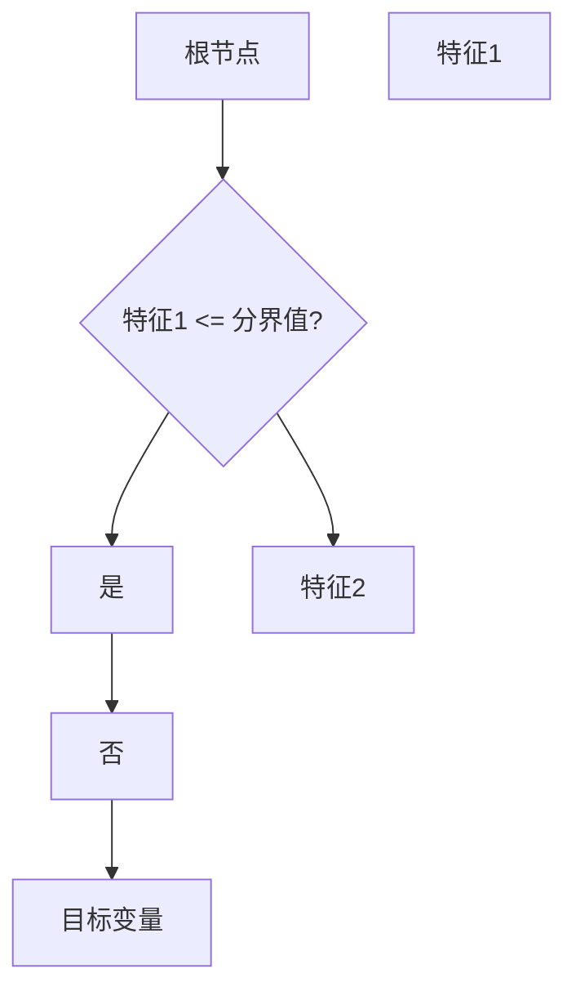

- **随机森林（Random Forest）**：随机森林是一种集成学习方法，通过构建多个决策树，并利用投票机制进行预测。其优点是降低了过拟合的风险，提高了模型的泛化能力。

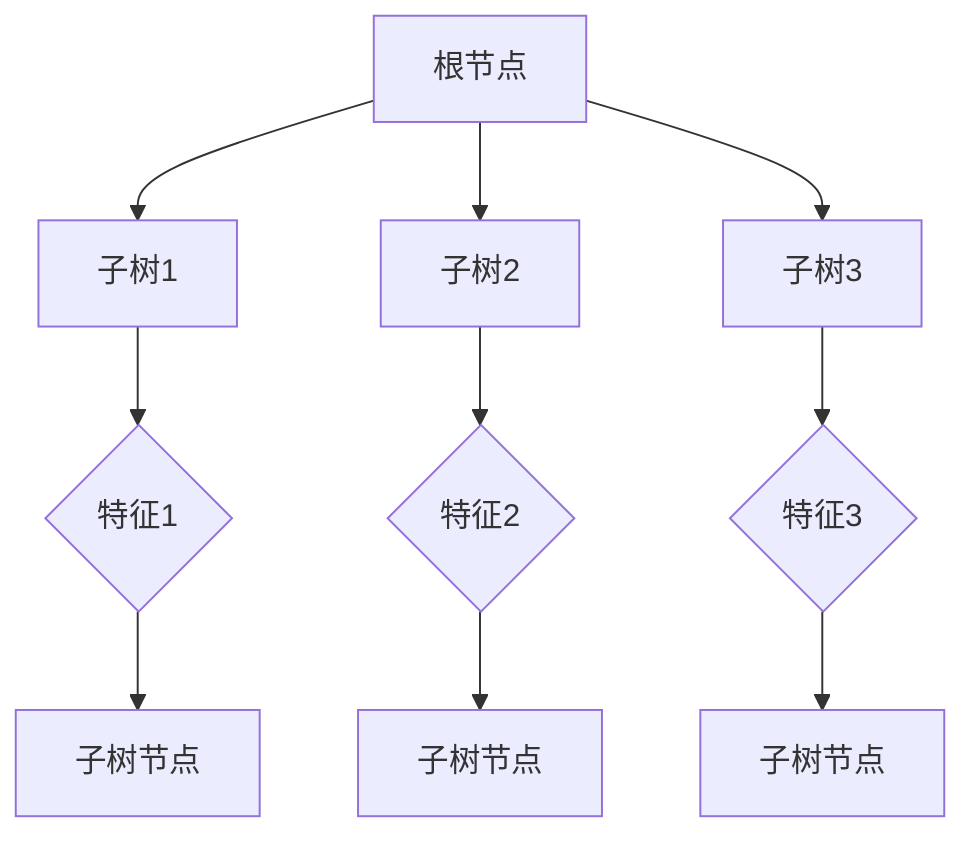

- **支持向量机（SVM）**：支持向量机是一种基于间隔最大化原则进行分类的算法。其优点是能够在高维空间中找到最佳分类边界。

```latex
\text{最大化} \ \ \ \ \ \ \ \ \ \ \ \ \ \ \ \ \ \ \ \ \ \ \ \ \ \ \ \ \ \ \ \ \ \ \ \ \ \ \ \ \ \ \ \ \ \ \ \ \ \ \ \ \ \ \ \ \ \ \ \ \ \ \ \ \ \ \ \ \ \ \ \ \ \ \ \ \ \ \ \ \ \ \ \ \ \ \ \ \ \ \ \ \ \ \ \ \ \ \ \ \ \ \ \ \ \ \ \ \ \ \ \ \ \ \ \ \ \ \ \ \ \ \ \ \ \ \ \ \ \ \ \ \ \ \ \ \ \ \ \ \ \ \ \ \ \ \ \ \ \ \ \ \ \ \ \ \ \ \ \ \ \ \ \ \ \ \ \ \ \ \ \ \ \ \ \ \ \ \ \ \ \ \ \ \ \ \ \ \ \ \ \ \ \ \ \ \ \ \ \ \ \ \ \ \ \ \ \ \ \ \ \ \ \ \ \ \ \ \ \ \ \ \ \ \ \ \ \ \ \ \ \ \ \ \ \ \ \ \ \ \ \ \ \ \ \ \ \ \ \ \ \ \ \ \ \ \ \ \ \ \ \ \ \ \ \ \ \ \ \ \ \ \ \ \ \ \ \ \ \ \ \ \ \ \ \ \ \ \ \ \ \ \ \ \ \ \ \ \ \ \ \ \ \ \ \ \ \ \ \ \ \ \ \ \ \ \ \ \ \ \ \ \ \ \ \ \ \ \ \ \ \ \ \ \ \ \ \ \ \ \ \ \ \ \ \ \ \ \ \ \ \ \ \ \ \ \ \ \ \ \ \ \ \ \ \ \ \ \ \ \ \ \ \ \ \ \ \ \ \ \ \ \ \ \ \ \ \ \ \ \ \ \ \ \ \ \ \ \ \ \ \ \ \ \ \ \ \ \ \ \ \ \ \ \ \ \ \ \ \ \ \ \ \ \ \ \ \ \ \ \ \ \ \ \ \ \ \ \ \ \ \ \ \ \ \ \ \ \ \ \ \ \ \ \ \ \ \ \ \ \ \ \ \ \ \ \ \ \ \ \ \ \ \ \ \ \ \ \ \ \ \ \ \ \ \ \ \ \ \ \ \ \ \ \ \ \ \ \ \ \ \ \ \ \ \ \ \ \ \ \ \ \ \ \ \ \ \ \ \ \ \ \ \ \ \ \ \ \ \ \ \ \ \ \ \ \ \ _{x}} + C \sum_{i=1}^{n} \ \alpha_i (y_i - \text{sign}(\text{w} \cdot \text{x}_i))
```

- **神经网络（Neural Network）**：神经网络是一种基于生物神经网络构建的算法，能够通过层层处理信息，实现复杂的非线性映射。常见的神经网络包括前馈神经网络和卷积神经网络（CNN）。

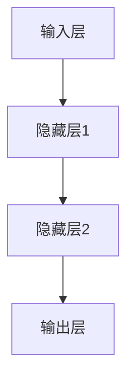

通过以上对机器学习基础概念的介绍，我们可以看到，机器学习在网络安全威胁检测中的应用有着广泛的基础和潜力。在接下来的章节中，我们将进一步探讨机器学习在入侵检测中的具体应用和实践案例。

## 机器学习在入侵检测中的应用

入侵检测系统（Intrusion Detection System，IDS）是网络安全领域的重要工具，其核心目标是实时监控网络流量和系统活动，发现并阻止潜在的网络攻击。传统的入侵检测方法主要依赖于规则匹配和统计分析，但面对日益复杂和隐蔽的网络攻击，这些方法已显不足。机器学习技术的引入，为入侵检测带来了新的机遇和挑战。

### 2.1 入侵检测系统的架构

入侵检测系统通常分为以下两个主要组件：

- **异常检测（Anomaly Detection）**：通过监测网络流量或系统行为中的异常模式，识别潜在的攻击。异常检测方法包括基于统计的、基于机器学习的和基于模糊逻辑的。
  
- **误用检测（Misuse Detection）**：通过分析攻击者的已知攻击模式，识别特定类型的攻击。误用检测通常使用签名匹配和模式识别技术。

一个典型的入侵检测系统架构包括以下部分：

1. **数据收集**：从网络流量、系统日志、文件完整性监控等渠道收集数据。
2. **数据预处理**：对收集到的数据进行分析、清洗和转换，提取特征，为后续分析做好准备。
3. **特征选择**：选择与攻击检测相关的特征，提高检测性能。
4. **模型训练**：利用机器学习算法训练模型，学习正常行为和攻击行为之间的差异。
5. **攻击检测**：使用训练好的模型对实时数据进行分析，发现潜在的攻击。
6. **告警与响应**：根据检测结果生成告警，并采取相应的响应措施。

### 2.2 机器学习算法在异常检测中的应用

在异常检测中，机器学习算法能够通过学习正常行为模式，识别出与正常行为显著不同的异常行为。以下是一些常用的机器学习算法及其在异常检测中的应用：

- **K-均值聚类（K-Means Clustering）**：K-均值聚类是一种无监督学习方法，通过将数据分为K个簇，识别出数据中的异常点。适用于数据分布不均、噪声较多的情况。

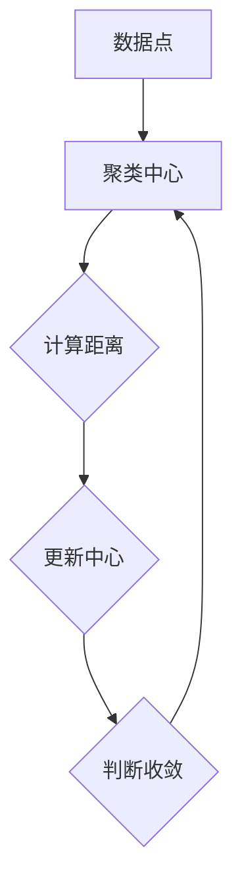

- **孤立森林（Isolation Forest）**：孤立森林是一种基于随机森林的异常检测算法，通过随机选择特征和切分值来构建多棵树，并计算数据点被隔离的难度，识别异常点。

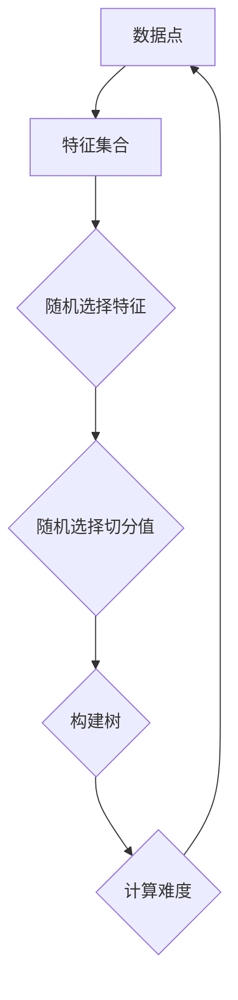

- **自组织映射（Self-Organizing Map，SOM）**：自组织映射是一种无监督学习方法，通过竞争学习将数据映射到一个低维空间中，识别出数据中的聚类结构和异常点。

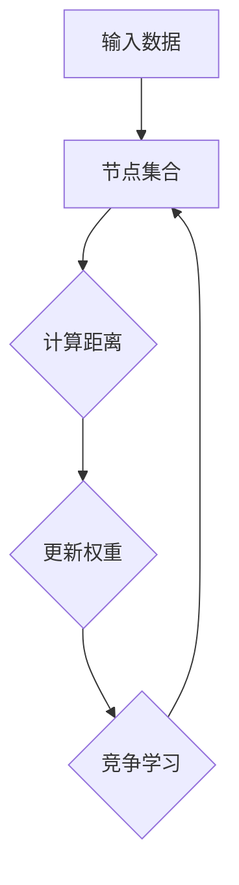

- **支持向量机（Support Vector Machine，SVM）**：支持向量机是一种有监督学习方法，通过寻找最优分类边界，将正常行为和攻击行为分开。SVM在异常检测中的应用主要体现在将正常行为和攻击行为进行分类。

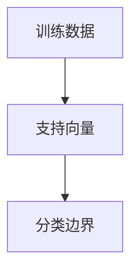

### 2.3 机器学习算法在误用检测中的应用

在误用检测中，机器学习算法通过学习已知的攻击模式，检测出匹配这些模式的攻击行为。以下是一些常用的机器学习算法及其在误用检测中的应用：

- **贝叶斯网络（Bayesian Network）**：贝叶斯网络是一种概率图模型，通过表示变量之间的依赖关系，用于推理和预测未知变量的状态。在误用检测中，贝叶斯网络可以用于分析攻击路径，识别恶意行为。

```mermaid
graph TD
    A[系统变量1]
    B[系统变量2]
    C[攻击行为]
    D{P(C|A,B)}
    A --> B
    B --> C
    C --> D
```

- **决策树（Decision Tree）**：决策树通过一系列规则进行决策，将数据划分为不同的类别。在误用检测中，决策树可以用于构建攻击行为分类模型。


- **随机森林（Random Forest）**：随机森林是一种集成学习方法，通过构建多个决策树，并利用投票机制进行预测。在误用检测中，随机森林可以提高分类的准确性和鲁棒性。


通过以上对机器学习在入侵检测中的应用的探讨，我们可以看到，机器学习技术为入侵检测带来了新的方法和技术手段，有助于提升入侵检测的准确性和效率。在接下来的章节中，我们将通过实际案例，进一步展示机器学习在网络安全威胁检测中的应用。

## 网络安全威胁检测中的实践与案例分析

为了深入理解机器学习在网络安全威胁检测中的应用，以下通过两个具体案例，详细介绍机器学习技术在DDoS攻击检测和恶意软件检测中的实际应用。

### 案例一：基于机器学习的DDoS攻击检测

#### 案例背景与目标

DDoS（分布式拒绝服务）攻击是一种常见的网络攻击手段，攻击者通过控制大量受感染的机器（称为“僵尸网络”）向目标服务器发送大量虚假请求，导致服务器资源耗尽，无法正常提供服务。为了有效应对DDoS攻击，本案例的目标是通过机器学习算法实现对DDoS攻击的实时检测和分类。

#### 数据收集与预处理

首先，我们需要收集大量的网络流量数据。这些数据可以来自网络流量监控设备、入侵检测系统（IDS）和防火墙日志等。数据收集后，需要进行预处理，包括以下步骤：

1. **数据清洗**：去除无效或错误的数据，如重复记录、异常值等。
2. **特征提取**：从原始数据中提取有助于DDoS攻击检测的特征，如流量速率、数据包大小、协议类型、源IP地址、目的IP地址等。
3. **数据归一化**：对提取的特征进行归一化处理，使其在相同的尺度上，有助于模型的训练和评估。

#### 模型选择与训练

针对DDoS攻击检测，可以选择以下机器学习算法进行模型训练：

1. **孤立森林（Isolation Forest）**：孤立森林算法在处理高维数据和异常检测方面表现出色，适用于DDoS攻击的检测。
2. **支持向量机（SVM）**：SVM在分类任务中具有较高的准确性和泛化能力。
3. **随机森林（Random Forest）**：随机森林通过构建多个决策树，提高模型的鲁棒性和准确性。

以下是一个基于孤立森林算法的训练过程：

```python
from sklearn.ensemble import IsolationForest
from sklearn.model_selection import train_test_split
from sklearn.metrics import accuracy_score

# 假设我们有一个包含特征的数据集X和标签数据y
X_train, X_test, y_train, y_test = train_test_split(X, y, test_size=0.2, random_state=42)

# 初始化孤立森林模型
clf = IsolationForest(n_estimators=100, contamination=0.1, random_state=42)

# 训练模型
clf.fit(X_train)

# 预测测试集
y_pred = clf.predict(X_test)

# 计算准确率
accuracy = accuracy_score(y_test, y_pred)
print("Accuracy:", accuracy)
```

#### 模型评估与优化

在训练好模型后，需要对模型进行评估和优化。常用的评估指标包括准确率、精确率、召回率和F1值。以下是一个使用混淆矩阵进行评估的例子：

```python
from sklearn.metrics import confusion_matrix, classification_report

# 计算混淆矩阵
cm = confusion_matrix(y_test, y_pred)

# 打印分类报告
print(classification_report(y_test, y_pred))

# 根据评估结果调整模型参数
# 例如增加孤立森林的树的数量、调整支持向量机的C参数等
```

#### 模型部署与实时检测

在模型训练和评估完成后，可以将模型部署到实际的网络安全系统中，进行实时检测。以下是一个使用scikit-learn库进行模型部署的例子：

```python
# 假设我们有一个新的测试数据集new_data
new_data = ...

# 预处理新数据
new_data_processed = preprocess_data(new_data)

# 使用训练好的模型进行预测
new_pred = clf.predict(new_data_processed)

# 根据预测结果进行相应的响应措施
```

### 案例二：恶意软件检测

#### 案例背景与目标

恶意软件（Malware）是网络安全威胁中的重要组成部分，它们可以通过感染用户设备、窃取信息、控制网络等方式对组织和用户造成严重损失。本案例的目标是通过机器学习算法实现对恶意软件的检测和分类。

#### 数据集获取与处理

恶意软件检测的数据集通常包括恶意软件样本和正常软件样本。数据集可以从公共数据集（如MalwareDB、CICIDS2017等）获取。获取数据集后，需要进行以下处理：

1. **特征提取**：从恶意软件样本中提取行为特征、文件特征和代码特征等。
2. **数据预处理**：包括数据清洗、归一化、缺失值处理等。
3. **数据集划分**：将数据集划分为训练集、验证集和测试集。

#### 模型选择与训练

针对恶意软件检测，可以选择以下机器学习算法进行模型训练：

1. **K-最近邻（K-Nearest Neighbors，K-NN）**：K-NN算法在处理分类问题时具有简单和高效的特点。
2. **朴素贝叶斯（Naive Bayes）**：朴素贝叶斯算法适用于文本分类和垃圾邮件过滤等任务。
3. **决策树（Decision Tree）**：决策树算法具有直观和易解释的特点。

以下是一个基于K-NN算法的训练过程：

```python
from sklearn.neighbors import KNeighborsClassifier
from sklearn.model_selection import train_test_split
from sklearn.metrics import accuracy_score

# 假设我们有一个包含特征的数据集X和标签数据y
X_train, X_test, y_train, y_test = train_test_split(X, y, test_size=0.2, random_state=42)

# 初始化K-NN模型
knn = KNeighborsClassifier(n_neighbors=3)

# 训练模型
knn.fit(X_train, y_train)

# 预测测试集
y_pred = knn.predict(X_test)

# 计算准确率
accuracy = accuracy_score(y_test, y_pred)
print("Accuracy:", accuracy)
```

#### 模型评估与优化

与DDoS攻击检测类似，需要对恶意软件检测模型进行评估和优化。以下是一个使用混淆矩阵和分类报告进行评估的例子：

```python
from sklearn.metrics import confusion_matrix, classification_report

# 计算混淆矩阵
cm = confusion_matrix(y_test, y_pred)

# 打印分类报告
print(classification_report(y_test, y_pred))

# 根据评估结果调整模型参数
# 例如调整K-NN的K值、决策树的深度等
```

#### 模型部署与实时检测

在模型训练和评估完成后，可以将模型部署到实际的恶意软件检测系统中，进行实时检测。以下是一个使用scikit-learn库进行模型部署的例子：

```python
# 假设我们有一个新的恶意软件样本数据集new_data
new_data = ...

# 预处理新数据
new_data_processed = preprocess_data(new_data)

# 使用训练好的模型进行预测
new_pred = knn.predict(new_data_processed)

# 根据预测结果采取相应的防护措施
```

通过以上两个实际案例，我们可以看到机器学习技术在网络安全威胁检测中的应用，不仅提高了检测的准确性和效率，也为网络安全领域的研究者提供了新的研究方向和方法。在接下来的章节中，我们将进一步探讨深度学习在网络安全威胁检测中的应用。

## 深度学习在网络安全威胁检测中的应用

深度学习是一种通过多层神经网络自动学习数据特征和模式的人工智能技术，近年来在图像识别、自然语言处理等领域取得了显著成果。随着深度学习技术的发展，其在网络安全威胁检测中的应用也日益广泛。本文将介绍深度学习在网络安全威胁检测中的基础、主要算法，以及其在实际应用中的具体案例。

### 3.1 深度学习基础

深度学习的基础是多层神经网络，其通过层层提取数据中的特征，实现复杂的非线性映射。以下是一些深度学习的关键概念和模型：

#### 3.1.1 卷积神经网络（Convolutional Neural Network，CNN）

卷积神经网络是一种专门用于处理图像数据的深度学习模型。其主要特点是利用卷积层进行特征提取，通过池化层降低数据维度，并通过全连接层进行分类。

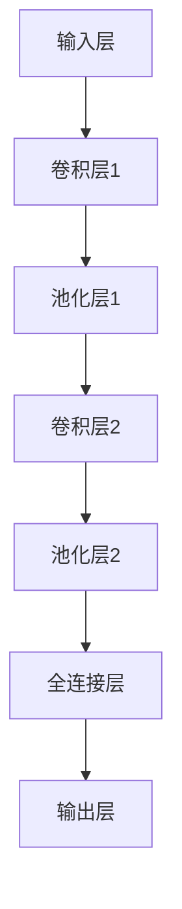

#### 3.1.2 循环神经网络（Recurrent Neural Network，RNN）

循环神经网络是一种专门用于处理序列数据的深度学习模型。其通过在时间步上递归地更新状态，实现序列数据的建模。

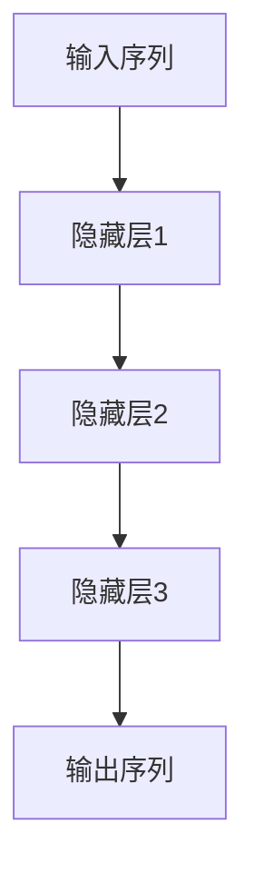

#### 3.1.3 生成对抗网络（Generative Adversarial Network，GAN）

生成对抗网络是一种通过生成器和判别器相互对抗的训练模型。生成器生成数据，判别器判断数据是真实数据还是生成数据。通过这种对抗训练，生成器能够生成逼真的数据。

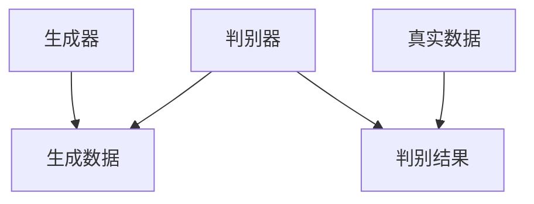

### 3.2 深度学习算法在网络安全威胁检测中的应用

深度学习算法在网络安全威胁检测中有着广泛的应用，以下是一些具体的例子：

#### 3.2.1 图神经网络（Graph Neural Network，GNN）

图神经网络是一种专门用于处理图结构数据的深度学习模型。在网络安全威胁检测中，图神经网络可以用于分析网络拓扑结构，识别潜在的安全威胁。

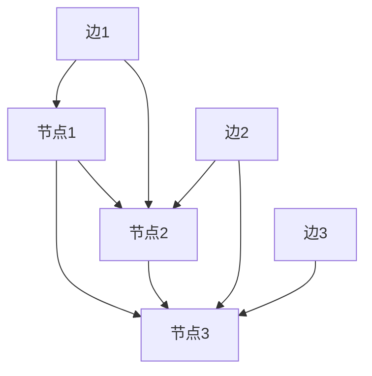

#### 3.2.2 强化学习（Reinforcement Learning，RL）

强化学习是一种通过奖励机制训练智能体的方法。在网络安全威胁检测中，强化学习可以用于自动调整检测策略，提高检测的准确性和效率。

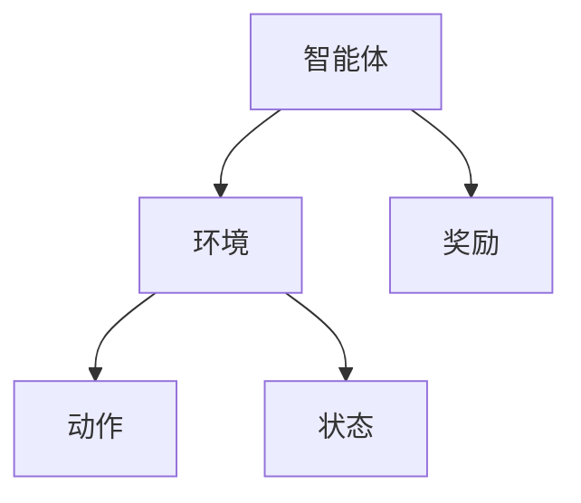

#### 3.2.3 深度学习在零日攻击检测中的潜力

零日攻击是指利用未知漏洞进行的攻击，传统的检测方法难以应对。深度学习通过强大的特征提取能力，可以识别出零日攻击的特征模式，提高检测的准确性。

### 3.3 实际应用案例

#### 3.3.1 基于CNN的恶意软件检测

恶意软件检测是网络安全威胁检测中的重要一环。基于CNN的恶意软件检测模型通过提取恶意软件的特征，实现对恶意软件的高效检测。

```python
# 假设我们有一个恶意软件样本数据集malicious_samples和正常软件样本数据集benign_samples
import tensorflow as tf
from tensorflow.keras.models import Sequential
from tensorflow.keras.layers import Conv2D, MaxPooling2D, Flatten, Dense

# 构建CNN模型
model = Sequential()
model.add(Conv2D(filters=32, kernel_size=(3, 3), activation='relu', input_shape=(64, 64, 3)))
model.add(MaxPooling2D(pool_size=(2, 2)))
model.add(Conv2D(filters=64, kernel_size=(3, 3), activation='relu'))
model.add(MaxPooling2D(pool_size=(2, 2)))
model.add(Flatten())
model.add(Dense(units=128, activation='relu'))
model.add(Dense(units=1, activation='sigmoid'))

# 编译模型
model.compile(optimizer='adam', loss='binary_crossentropy', metrics=['accuracy'])

# 训练模型
model.fit(malicious_samples, labels, epochs=10, batch_size=32, validation_split=0.2)
```

#### 3.3.2 基于RNN的网络入侵检测

网络入侵检测是深度学习在网络安全威胁检测中的另一个重要应用。基于RNN的入侵检测模型通过分析网络流量序列，识别潜在的网络攻击。

```python
# 假设我们有一个网络流量数据集network_traffic
import tensorflow as tf
from tensorflow.keras.models import Sequential
from tensorflow.keras.layers import LSTM, Dense

# 构建RNN模型
model = Sequential()
model.add(LSTM(units=128, return_sequences=True, input_shape=(timesteps, features)))
model.add(LSTM(units=64))
model.add(Dense(units=1, activation='sigmoid'))

# 编译模型
model.compile(optimizer='adam', loss='binary_crossentropy', metrics=['accuracy'])

# 训练模型
model.fit(network_traffic, labels, epochs=10, batch_size=32, validation_split=0.2)
```

通过以上实际案例，我们可以看到深度学习在网络安全威胁检测中的应用具有巨大潜力。在未来的发展中，随着深度学习技术的不断进步，深度学习在网络安全威胁检测中的应用将会更加广泛和深入。

## 集成学习与多模型融合

在网络安全威胁检测中，集成学习方法通过结合多个基学习器，能够有效提高模型的准确性和鲁棒性。集成学习的基本思想是将多个模型训练结果进行综合，从而降低过拟合风险并提高模型的泛化能力。以下将详细介绍集成学习的基本概念、常见方法以及其在网络安全威胁检测中的应用。

### 4.1 集成学习的基本概念

集成学习（Ensemble Learning）是一种通过构建多个基学习器（Base Learners）并合并其预测结果来提高模型性能的方法。集成学习的基本思想是，多个学习器的组合往往比单个学习器更加稳定和准确。集成学习可以分为两类：装袋方法和提升方法。

#### 装袋方法（Bagging）

装袋方法通过多次训练基学习器，每次训练从训练集中随机抽取一部分样本，构成多个子训练集，然后在每个子训练集上训练一个基学习器。最终，将所有基学习器的预测结果进行投票或平均，得到最终的预测结果。常见的装袋方法包括随机森林（Random Forest）和装袋回归（Bagging Regression）。

#### 提升方法（Boosting）

提升方法通过迭代训练基学习器，每次迭代根据前一轮预测的错误率，对错误样本进行加权，使得后续基学习器更加关注这些错误样本。常见的提升方法包括AdaBoost、XGBoost和LightGBM等。

### 4.2 常见集成学习方法

以下是一些常见的集成学习方法及其在网络安全威胁检测中的应用：

#### 4.2.1 随机森林（Random Forest）

随机森林是一种基于装袋方法的集成学习方法，通过构建多棵决策树，并利用投票机制进行预测。随机森林在处理高维数据和非线性问题时表现出色，适用于入侵检测和恶意软件检测等任务。

```python
from sklearn.ensemble import RandomForestClassifier
from sklearn.model_selection import train_test_split

# 假设我们有一个训练数据集X和标签数据y
X_train, X_test, y_train, y_test = train_test_split(X, y, test_size=0.2, random_state=42)

# 初始化随机森林模型
rf = RandomForestClassifier(n_estimators=100, random_state=42)

# 训练模型
rf.fit(X_train, y_train)

# 预测测试集
y_pred = rf.predict(X_test)

# 计算准确率
accuracy = rf.score(X_test, y_test)
print("Accuracy:", accuracy)
```

#### 4.2.2 AdaBoost（Adaptive Boosting）

AdaBoost是一种基于提升方法的集成学习方法，通过迭代训练基学习器，并赋予错误率较高的学习器更高的权重。AdaBoost在处理分类问题时具有较好的性能，适用于异常检测和入侵检测等任务。

```python
from sklearn.ensemble import AdaBoostClassifier

# 假设我们有一个训练数据集X和标签数据y
X_train, X_test, y_train, y_test = train_test_split(X, y, test_size=0.2, random_state=42)

# 初始化AdaBoost模型
ada = AdaBoostClassifier(n_estimators=50, random_state=42)

# 训练模型
ada.fit(X_train, y_train)

# 预测测试集
y_pred = ada.predict(X_test)

# 计算准确率
accuracy = ada.score(X_test, y_test)
print("Accuracy:", accuracy)
```

#### 4.2.3 XGBoost

XGBoost是一种基于提升方法的集成学习方法，具有高效的性能和强大的功能。XGBoost通过引入正则化项和特征交叉，能够有效提高模型的泛化能力，适用于大规模数据的分类和回归问题。

```python
import xgboost as xgb
from sklearn.model_selection import train_test_split

# 假设我们有一个训练数据集X和标签数据y
X_train, X_test, y_train, y_test = train_test_split(X, y, test_size=0.2, random_state=42)

# 初始化XGBoost模型
xgb_model = xgb.XGBClassifier(use_label_encoder=False, eval_metric='logloss')

# 训练模型
xgb_model.fit(X_train, y_train)

# 预测测试集
y_pred = xgb_model.predict(X_test)

# 计算准确率
accuracy = xgb_model.score(X_test, y_test)
print("Accuracy:", accuracy)
```

### 4.3 多模型融合方法

在网络安全威胁检测中，多模型融合方法通过结合多个模型的预测结果，进一步提高模型的准确性和鲁棒性。以下是一些常用的多模型融合方法：

#### 4.3.1 平均融合（Averaging）

平均融合方法将多个模型的预测结果进行平均，得到最终的预测结果。平均融合方法简单有效，特别适用于基学习器性能较为接近的情况。

```python
# 假设我们有两个分类模型model1和model2
y_pred1 = model1.predict(X_test)
y_pred2 = model2.predict(X_test)

# 平均融合预测结果
y_pred_avg = (y_pred1 + y_pred2) / 2

# 计算准确率
accuracy_avg = accuracy_score(y_test, y_pred_avg)
print("Average Accuracy:", accuracy_avg)
```

#### 4.3.2 投票融合（Voting）

投票融合方法通过多数投票机制，选择预测结果最多的类别作为最终预测结果。投票融合方法适用于分类问题，特别适用于基学习器性能差异较大的情况。

```python
from sklearn.ensemble import VotingClassifier

# 假设我们有两个分类模型model1和model2
vc = VotingClassifier(estimators=[('model1', model1), ('model2', model2)], voting='soft')

# 训练模型
vc.fit(X_train, y_train)

# 预测测试集
y_pred = vc.predict(X_test)

# 计算准确率
accuracy = vc.score(X_test, y_test)
print("Voting Accuracy:", accuracy)
```

通过以上对集成学习和多模型融合方法的介绍，我们可以看到，集成学习方法在网络安全威胁检测中具有广泛的应用前景。通过结合多个基学习器的预测结果，集成学习方法能够有效提高模型的准确性和鲁棒性，为网络安全领域的研究者提供了一种新的技术手段。

## 网络安全威胁检测中的挑战与未来展望

尽管机器学习在网络安全威胁检测中展现出了巨大的潜力，但在实际应用过程中仍面临诸多挑战。以下将详细探讨网络安全威胁检测中的主要挑战，并展望未来的发展趋势。

### 5.1 数据隐私与保护

在网络安全威胁检测中，数据隐私和保护是一个至关重要的挑战。攻击者可以通过获取敏感数据进行进一步攻击，甚至可能利用这些数据对系统进行干扰。为了确保数据安全，需要采取以下措施：

- **数据加密**：在数据传输和存储过程中使用加密技术，确保数据在传输过程中的安全性。
- **匿名化处理**：对敏感数据进行匿名化处理，消除个人识别信息，降低数据泄露的风险。
- **访问控制**：实施严格的访问控制策略，确保只有授权用户可以访问敏感数据。

### 5.2 模型解释性

机器学习模型通常被视为“黑盒”，即模型的决策过程难以解释和理解。在网络安全威胁检测中，模型的解释性至关重要，因为需要确保检测结果的可信度。以下是一些提高模型解释性的方法：

- **可解释性模型**：选择具备解释性的模型，如决策树和线性回归。
- **模型可视化**：通过可视化技术展示模型的内部结构和决策过程，帮助用户理解模型的决策依据。
- **模型压缩**：通过压缩模型大小，降低模型的复杂度，提高模型的解释性。

### 5.3 抗攻击能力

网络攻击者可能利用机器学习模型进行对抗性攻击，从而干扰模型的正常工作。为了提高机器学习模型在网络安全威胁检测中的抗攻击能力，可以采取以下措施：

- **对抗训练**：在模型训练过程中，引入对抗样本进行训练，提高模型对对抗性攻击的抵抗力。
- **模型加固**：通过增加模型的鲁棒性，降低模型受到对抗性攻击的风险。
- **动态防御**：实时监测模型的行为，及时发现并应对潜在的攻击。

### 5.4 未来发展趋势

随着技术的不断发展，机器学习在网络安全威胁检测中的应用前景广阔。以下是一些未来发展的趋势：

- **自动化与智能化**：通过自动化和智能化手段，提高网络安全威胁检测的效率和准确性，减少人工干预。
- **多模态数据融合**：结合多种数据源（如网络流量、日志、传感器数据等），实现更全面、准确的威胁检测。
- **机器学习与安全法规的结合**：将机器学习技术与网络安全法规相结合，确保模型的应用符合法律法规要求。
- **新兴技术的应用**：如区块链、物联网等新兴技术，将在网络安全威胁检测中发挥重要作用。

### 5.5 最佳实践与注意事项

在网络安全威胁检测中，最佳实践和注意事项对于确保模型的有效性和可靠性至关重要。以下是一些关键点：

- **数据质量控制**：确保数据质量，避免噪声和异常值影响模型的训练和预测。
- **持续监控与更新**：定期对模型进行监控和更新，以应对新的威胁和变化。
- **多模型融合**：结合多种机器学习模型，提高模型的准确性和鲁棒性。
- **用户培训与支持**：为用户提供培训和支持，确保他们能够正确理解和利用模型。

通过以上探讨，我们可以看到，尽管机器学习在网络安全威胁检测中面临诸多挑战，但通过不断的研究和技术创新，未来将有望实现更高效、更可靠的威胁检测系统。

### 附录

#### A. 常用工具与框架

- **Keras**：一个高层次的神经网络API，支持快速构建和训练深度学习模型。
- **Scikit-learn**：一个强大的机器学习库，提供了多种机器学习算法的实现。
- **TensorFlow**：一个开源的机器学习框架，支持构建和训练复杂的神经网络。
- **PyTorch**：一个基于Python的深度学习框架，提供了灵活和高效的模型构建和训练工具。

#### B. 实验与项目指南

**1. 开发环境搭建**

- 安装Python：在官方网站下载并安装Python。
- 安装必要的库：使用pip命令安装Keras、Scikit-learn、TensorFlow和PyTorch等库。

```bash
pip install keras scikit-learn tensorflow pytorch
```

**2. 数据集获取与处理**

- 获取数据集：从公共数据集网站（如Kaggle、UCI Machine Learning Repository等）下载相关数据集。
- 数据预处理：包括数据清洗、归一化、缺失值处理等。

**3. 模型训练与优化**

- 选择模型：根据应用场景选择合适的模型。
- 训练模型：使用训练集进行模型训练。
- 优化模型：调整模型参数，提高模型性能。

**4. 模型评估与部署**

- 评估模型：使用测试集评估模型性能。
- 模型部署：将训练好的模型部署到实际应用中，进行实时检测。

通过以上指南，读者可以搭建一个基本的网络安全威胁检测系统，并在此基础上进行进一步的研究和开发。

### 作者信息

**作者：AI天才研究院/AI Genius Institute & 禅与计算机程序设计艺术 /Zen And The Art of Computer Programming**

本文由AI天才研究院的研究员撰写，旨在为读者提供关于机器学习在网络安全威胁检测中的应用的全面、系统的介绍。希望本文能够对网络安全领域的研究者与实践者有所启发和帮助。如果您有任何问题或建议，欢迎通过以下联系方式与我们联系：

- **邮箱：info@ai-genius-institute.com**
- **官方网站：https://www.ai-genius-institute.com**

感谢您的关注与支持！

