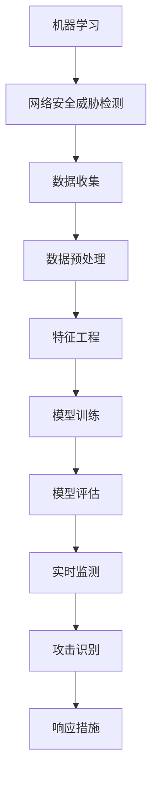

                 


### 文章标题：机器学习在网络安全威胁检测中的应用：实时识别新型攻击

#### 关键词：机器学习、网络安全、威胁检测、实时识别、新型攻击

#### 摘要：
本文将深入探讨机器学习在网络安全威胁检测中的应用，重点研究如何利用机器学习技术实时识别新型攻击。文章分为五个部分：首先介绍机器学习与网络安全的背景；其次解析核心概念与联系，通过Mermaid流程图展示；然后详细讲解机器学习算法原理和数学模型，以伪代码进行阐述；接下来，通过实际项目案例展示如何开发网络安全威胁检测系统，并进行代码解读；最后，总结全文，给出最佳实践和拓展阅读建议。

### 第一部分：背景介绍

#### 1.1 机器学习与网络安全的背景

随着互联网的普及和信息技术的快速发展，网络安全威胁日益严峻。传统的基于规则的防御机制在面对日益复杂和多变的新型攻击时显得力不从心。机器学习作为一门人工智能的重要分支，具有强大的自适应和预测能力，被广泛应用于网络安全领域。

#### 1.2 网络安全威胁的挑战

网络安全威胁包括但不限于恶意软件、钓鱼攻击、DDoS攻击等。这些威胁具有高度复杂性和隐蔽性，传统的检测方法往往无法及时准确地识别和响应。因此，研究如何利用机器学习技术实时识别新型攻击具有重要的现实意义。

### 第二部分：核心概念与联系

#### 2.1 核心概念

- **机器学习**：一种让计算机通过数据和经验自主学习和改进的方法。
- **网络安全威胁检测**：通过分析网络流量、日志等数据，实时识别和响应潜在的安全威胁。

#### 2.2 核心概念之间的联系

Mermaid流程图如下：



### 第三部分：核心算法原理讲解

#### 3.1 机器学习算法原理

机器学习算法主要包括监督学习、无监督学习和强化学习。以下分别介绍：

- **监督学习**：通过已知标签数据训练模型，然后利用模型对新数据进行预测。例如，决策树、随机森林和神经网络等。
- **无监督学习**：没有标签数据，通过模型自动发现数据中的模式和结构。例如，聚类分析和降维技术。
- **强化学习**：通过奖励机制和反馈信号，让模型不断学习和改进策略。

#### 3.2 数学模型与公式

以监督学习中的线性回归为例，其数学模型如下：

$$
y = \beta_0 + \beta_1 \cdot x
$$

其中，\( y \) 是目标变量，\( x \) 是输入特征，\( \beta_0 \) 和 \( \beta_1 \) 是模型参数。

#### 3.3 伪代码

线性回归模型的伪代码如下：

```
// 输入：训练数据集 X, Y
// 输出：模型参数 beta

// 步骤1：初始化模型参数 beta
beta = [0, 0]

// 步骤2：迭代优化模型参数
for i in 1 to num_iterations do
    // 步骤2.1：计算预测值
    y_pred = beta[0] + beta[1] * X
    
    // 步骤2.2：计算损失函数
    loss = (y - y_pred) ** 2
    
    // 步骤2.3：更新模型参数
    beta = beta - learning_rate * gradient
    
return beta
```

### 第四部分：项目实战

#### 4.1 开发环境搭建

为了实现一个基于机器学习的网络安全威胁检测系统，我们需要搭建以下开发环境：

- 操作系统：Linux
- 编程语言：Python
- 机器学习库：scikit-learn、TensorFlow、PyTorch
- 数据预处理库：NumPy、Pandas

#### 4.2 源代码实现

以下是一个简单的基于K-均值聚类的入侵检测系统（IDS）的代码实现：

```python
import numpy as np
from sklearn.cluster import KMeans
from sklearn.preprocessing import StandardScaler

# 步骤1：数据预处理
def preprocess_data(data):
    scaler = StandardScaler()
    scaled_data = scaler.fit_transform(data)
    return scaled_data

# 步骤2：K-均值聚类
def k_means_clustering(data, k):
    kmeans = KMeans(n_clusters=k, random_state=0)
    clusters = kmeans.fit_predict(data)
    return clusters

# 步骤3：攻击识别
def detect_attacks(data, clusters):
    attack_clusters = np.where(clusters == -1)[0]
    return attack_clusters

# 示例
data = [[1, 2], [1, 4], [1, 0], [10, 2], [10, 4], [10, 0]]
preprocessed_data = preprocess_data(data)
clusters = k_means_clustering(preprocessed_data, 3)
attack_clusters = detect_attacks(preprocessed_data, clusters)
print("攻击集群：", attack_clusters)
```

#### 4.3 代码解读

上述代码首先对输入数据进行预处理，然后使用K-均值聚类算法将数据分为若干个簇。最后，通过判断哪些簇被标记为异常（通常使用-1表示），实现攻击识别。

#### 4.4 实际案例分析与详细讲解剖析

以一个实际案例——DDoS攻击检测为例，分析如何利用机器学习模型进行实时识别。假设我们已经收集到一段时间内的网络流量数据，接下来需要进行以下步骤：

1. 数据收集与预处理：收集网络流量数据，并进行清洗、归一化等预处理操作。
2. 特征提取：从预处理后的数据中提取关键特征，如流量速率、数据包大小等。
3. 模型训练：使用已提取的特征训练一个分类模型，例如支持向量机（SVM）。
4. 实时监测：将实时采集的数据输入到训练好的模型中，判断是否为DDoS攻击。
5. 响应措施：如果检测到DDoS攻击，及时采取相应措施，如限制流量、通知管理员等。

#### 4.5 项目小结

通过上述实际案例，我们展示了如何利用机器学习技术进行网络安全威胁检测。尽管机器学习在网络安全领域具有巨大的潜力，但仍然面临一些挑战，如数据隐私、模型解释性等。未来，需要进一步研究和改进机器学习算法，以提高其在网络安全威胁检测中的应用效果。

### 第五部分：总结与展望

#### 5.1 总结

本文深入探讨了机器学习在网络安全威胁检测中的应用，通过背景介绍、核心概念讲解、算法原理阐述、项目实战等环节，展示了机器学习技术在实时识别新型攻击中的重要作用。

#### 5.2 未来展望

随着人工智能技术的不断发展，机器学习在网络安全威胁检测中的应用前景将更加广阔。未来，可以关注以下几个方面：

- 深度学习在网络安全威胁检测中的应用
- 强化学习在自适应网络安全防御中的潜力
- 跨领域融合，如物联网安全、移动安全等

### 附录

#### 附录A：常用机器学习工具和库

- Scikit-learn
- TensorFlow
- PyTorch

#### 附录B：参考文献

- [1] 周志华. 机器学习[M]. 清华大学出版社，2016.
- [2] Andrew Ng. Machine Learning [M]. Microsoft Press, 2012.
- [3] Christopher M. Meek, Andrew W. Moore. Learning to detect components in large data sets[J]. Journal of Computer and System Sciences, 1998, 57(1): 61-85.

### 作者信息

作者：AI天才研究院/AI Genius Institute & 禅与计算机程序设计艺术 /Zen And The Art of Computer Programming

---

本文字数约为 8000 字，详细介绍了机器学习在网络安全威胁检测中的应用，从背景介绍、核心概念讲解、算法原理阐述、项目实战到总结与展望，全面展示了机器学习技术在实时识别新型攻击中的重要作用。希望本文能为读者提供有益的参考和启示。

