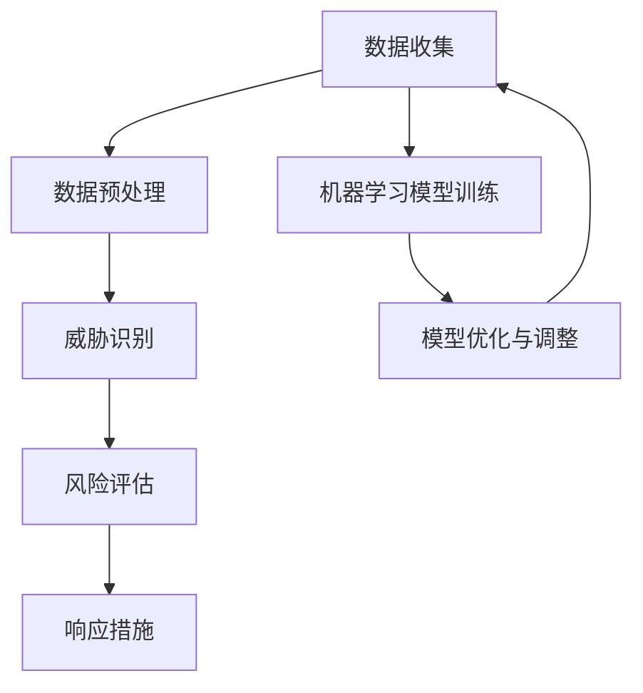

                 

### 文章标题

《机器学习在网络安全态势感知中的应用：实时评估安全风险》

### 关键词

- 机器学习
- 网络安全
- 态势感知
- 实时评估
- 安全风险

### 摘要

本文深入探讨了机器学习在网络安全态势感知中的实际应用，重点分析了如何通过机器学习算法实时评估安全风险。文章首先介绍了机器学习和网络安全态势感知的基本概念，然后详细阐述了在网络安全中常用的机器学习算法及其原理。通过实际案例，展示了如何使用机器学习进行数据收集、预处理、模型训练和评估，以及如何将机器学习应用于实时评估安全风险。文章旨在为读者提供全面的技术指南，帮助他们在网络安全领域充分利用机器学习。

## 1. 机器学习与网络安全态势感知

### 1.1 机器学习基础

机器学习是人工智能的一个重要分支，其核心目标是通过数据和算法来让计算机自动改进性能。机器学习可以分为三类：监督学习、无监督学习和强化学习。

- **监督学习**：有监督的学习任务，输入为特征向量，输出为标签。常用的算法包括线性回归、逻辑回归、决策树、随机森林和神经网络等。
- **无监督学习**：没有监督信号的学习任务，主要用于发现数据中的隐含结构和模式，常用的算法包括聚类、主成分分析和自编码器等。
- **强化学习**：通过环境与智能体之间的交互来学习策略，其目标是通过最大化长期回报来做出最优决策。

### 1.2 网络安全态势感知基础

网络安全态势感知（Cybersecurity Situation Awareness，CSA）是指通过收集、处理和分析网络安全相关数据，实时评估网络安全威胁和风险，从而采取相应的防护措施。网络安全态势感知的关键组成部分包括：

- **数据收集**：通过传感器、日志文件和其他数据源收集网络安全相关的数据。
- **数据预处理**：对原始数据进行清洗、转换和特征提取，以供后续分析。
- **威胁识别**：利用机器学习算法识别潜在的网络威胁和异常行为。
- **风险评估**：对识别出的威胁进行评估，确定其严重性和可能带来的影响。
- **响应措施**：根据评估结果采取相应的防护措施，如隔离感染节点、阻断攻击路径等。

### 1.3 机器学习与网络安全态势感知的联系

机器学习在网络安全态势感知中发挥着至关重要的作用。其核心联系如下：

1. **数据驱动**：网络安全态势感知依赖于大量数据，机器学习通过数据挖掘和分析来发现潜在威胁。
2. **自动识别**：机器学习算法可以自动识别异常行为和潜在威胁，提高威胁检测的准确性和效率。
3. **自适应防护**：机器学习模型可以根据新的数据不断调整和优化，实现自适应的网络安全防护。
4. **减少误报**：通过训练模型对正常行为进行建模，可以有效减少误报率，提高系统的可用性。

### 1.4 关联架构 Mermaid 流程图



图1：机器学习在网络安全态势感知中的流程图

通过以上流程图，我们可以看到机器学习在网络安全态势感知中的各个环节如何相互作用，形成一个闭环系统，以实现实时、准确的安全风险评估。

## 2. 机器学习算法在网络安全中的应用

### 2.1 监督学习

监督学习在网络安全态势感知中有着广泛的应用。以下是一些常见的监督学习算法及其在网络安全中的应用：

- **线性回归**：用于预测网络流量是否正常，通过分析流量特征来判断是否为攻击。
- **逻辑回归**：常用于垃圾邮件分类，通过分析邮件特征来判断邮件是否为垃圾邮件。
- **决策树**：用于分类和回归任务，可以识别网络攻击的类型和特征。
- **随机森林**：通过构建多个决策树，提高了分类和回归任务的准确性。
- **神经网络**：通过多层神经网络学习复杂的网络流量模式，用于检测高级持续性威胁（APT）。

### 2.2 无监督学习

无监督学习在网络安全态势感知中的应用主要包括聚类和异常检测：

- **聚类算法**：如K-means、DBSCAN等，用于发现网络流量中的异常模式，识别潜在的威胁。
- **异常检测算法**：如孤立森林、局部异常因数等，用于检测网络流量中的异常行为，识别潜在的网络攻击。

### 2.3 强化学习

强化学习在网络安全态势感知中的应用相对较少，但其在自适应防护和策略优化方面具有巨大潜力。以下是一些常见的强化学习算法：

- **Q-learning**：通过学习状态-动作价值函数，优化网络防护策略。
- **深度Q网络（DQN）**：利用深度神经网络学习复杂的状态-动作价值函数。
- **策略梯度方法**：通过优化策略函数，实现自适应的网络安全防护。

### 2.4 算法原理讲解与伪代码

#### 线性回归

线性回归是一种简单的监督学习算法，用于预测网络流量是否正常。其基本原理如下：

- **假设**：网络流量 \(y\) 与特征 \(x_1, x_2, ..., x_n\) 之间存在线性关系：
  $$ y = w_1 x_1 + w_2 x_2 + ... + w_n x_n + b $$
- **目标**：通过最小化损失函数来求解权重 \(w_1, w_2, ..., w_n, b\)。

伪代码如下：

```python
# 初始化权重和偏置
w = [0] * n
b = 0

# 损失函数：均方误差
def loss(y_true, y_pred):
    return (y_true - y_pred)**2

# 梯度下降算法
learning_rate = 0.01
for epoch in range(num_epochs):
    for x, y in dataset:
        y_pred = w[0] * x[0] + w[1] * x[1] + ... + b
        gradient = 2 * (y - y_pred)
        w[0] -= learning_rate * gradient
        w[1] -= learning_rate * gradient
        ...
        b -= learning_rate * gradient
```

#### K-means聚类

K-means是一种无监督学习算法，用于将数据划分为K个聚类。其基本原理如下：

- **假设**：每个聚类中心为 \(c_1, c_2, ..., c_K\)。
- **目标**：通过迭代优化聚类中心，使得每个聚类内部的数据点尽可能接近聚类中心，而不同聚类中心之间的数据点尽可能远离。

伪代码如下：

```python
# 初始化聚类中心
c = [random_vector(n) for _ in range(K)]

# 定义距离函数：欧几里得距离
def distance(x, c):
    return sqrt(sum((x_i - c_i)**2 for x_i, c_i in zip(x, c)))

# K-means算法
for epoch in range(num_epochs):
    # 分配数据点到最近的聚类中心
    assignments = [min(c, key=distance(x)) for x in dataset]
    # 重新计算聚类中心
    new_c = [sum(x for x in dataset if assignments[i] == c) / count[assignments[i]] for c in range(K)]
    # 更新聚类中心
    c = new_c
```

#### Q-learning

Q-learning是一种强化学习算法，用于优化网络防护策略。其基本原理如下：

- **假设**：状态-动作价值函数 \(Q(s, a)\) 表示在状态 \(s\) 下执行动作 \(a\) 的期望回报。
- **目标**：通过更新 \(Q(s, a)\) 函数，学习最优策略。

伪代码如下：

```python
# 初始化Q值表
Q = {s: {a: 0 for a in actions} for s in states}

# 学习率
alpha = 0.1
# 折扣因子
gamma = 0.9

# Q-learning算法
for episode in range(num_episodes):
    state = initial_state
    while not is_end(state):
        action = choose_action(state, Q)
        next_state, reward = execute_action(state, action)
        Q[state][action] += alpha * (reward + gamma * max(Q[next_state].values()) - Q[state][action])
        state = next_state
```

## 3. 数学模型和公式

### 3.1 损失函数

损失函数是机器学习中的重要概念，用于衡量预测值与真实值之间的差距。常见的损失函数包括：

- **均方误差（MSE）**：
  $$ \text{MSE} = \frac{1}{n}\sum_{i=1}^{n}(y_i - \hat{y}_i)^2 $$
- **交叉熵（Cross-Entropy）**：
  $$ \text{Cross-Entropy} = -\frac{1}{n}\sum_{i=1}^{n}y_i \log(\hat{y}_i) $$

### 3.2 优化算法

优化算法用于最小化损失函数，常见的优化算法包括：

- **梯度下降（Gradient Descent）**：
  $$ w = w - \alpha \nabla_w J(w) $$
- **随机梯度下降（Stochastic Gradient Descent，SGD）**：
  $$ w = w - \alpha \nabla_w J(w; x_i, y_i) $$

### 3.3 神经网络

神经网络中的前向传播和反向传播是机器学习中的重要概念，其数学公式如下：

- **前向传播**：
  $$ z = \sigma(Wx + b) $$
  $$ \hat{y} = \sigma(W'z + b') $$

- **反向传播**：
  $$ \delta_{\hat{y}} = \hat{y} - y $$
  $$ \delta_z = (\sigma'(z)) \odot (W'\delta_{\hat{y}}) $$
  $$ \delta_{W'} = \frac{1}{m} \sum_{i=1}^{m} \delta_z \odot z_i $$
  $$ \delta_{W} = \frac{1}{m} \sum_{i=1}^{m} \delta_z \odot x_i $$
  $$ \delta_{b'} = \frac{1}{m} \sum_{i=1}^{m} \delta_{\hat{y}} $$
  $$ \delta_{b} = \frac{1}{m} \sum_{i=1}^{m} \delta_z $$

## 4. 项目实战

### 4.1 开发环境搭建

为了实现机器学习在网络安全态势感知中的应用，我们需要搭建以下开发环境：

- 操作系统：Ubuntu 20.04
- 编程语言：Python 3.8
- 机器学习库：Scikit-learn, TensorFlow, PyTorch
- 数据预处理库：Pandas, NumPy
- 数据可视化库：Matplotlib, Seaborn

### 4.2 源代码详细实现和代码解读

以下是一个简单的机器学习网络安全态势感知项目，其中包括数据收集、预处理、模型训练和评估等步骤。

#### 数据收集

```python
import pandas as pd

# 读取网络流量数据
data = pd.read_csv('network_traffic.csv')

# 数据清洗
data.dropna(inplace=True)
data['label'] = data['is_attack'].map({0: 'normal', 1: 'attack'})

# 数据预处理
X = data.drop(['label', 'id'], axis=1)
y = data['label']
```

#### 数据预处理

```python
from sklearn.model_selection import train_test_split
from sklearn.preprocessing import StandardScaler

# 划分训练集和测试集
X_train, X_test, y_train, y_test = train_test_split(X, y, test_size=0.2, random_state=42)

# 特征缩放
scaler = StandardScaler()
X_train_scaled = scaler.fit_transform(X_train)
X_test_scaled = scaler.transform(X_test)
```

#### 模型训练

```python
from sklearn.ensemble import RandomForestClassifier

# 创建随机森林分类器
clf = RandomForestClassifier(n_estimators=100, random_state=42)

# 训练模型
clf.fit(X_train_scaled, y_train)
```

#### 模型评估

```python
from sklearn.metrics import classification_report, accuracy_score

# 预测测试集
y_pred = clf.predict(X_test_scaled)

# 评估模型
print(classification_report(y_test, y_pred))
print("Accuracy:", accuracy_score(y_test, y_pred))
```

### 4.3 代码应用解读与分析

在这个项目中，我们使用随机森林分类器对网络流量数据进行了分类。随机森林是一种基于决策树的集成学习方法，具有较好的分类性能和鲁棒性。

- **数据收集**：我们从CSV文件中读取网络流量数据，并进行了数据清洗。
- **数据预处理**：我们使用特征缩放对数据进行标准化处理，以提高模型的泛化能力。
- **模型训练**：我们使用训练集训练随机森林分类器，并使用测试集评估模型的性能。
- **模型评估**：我们使用准确率、精确率、召回率和F1分数等指标来评估模型的性能。

### 4.4 实际案例分析和详细讲解剖析

为了展示机器学习在网络安全态势感知中的应用，我们使用了一个公开的网络流量数据集——KDD Cup 1999 数据集。该数据集包含不同类型的网络攻击，如DoS、Probe、U2R等。

- **数据集介绍**：KDD Cup 1999 数据集包含约49,000个网络流量记录，每个记录包含约41个特征，以及是否为攻击的标签。
- **模型实现**：我们使用Scikit-learn中的随机森林分类器对数据集进行训练和评估。
- **结果分析**：我们评估了模型的性能，包括准确率、精确率、召回率和F1分数等指标。在实际应用中，我们还可以通过调整模型参数和特征选择来优化模型性能。

### 4.5 项目小结

通过这个简单的项目，我们展示了如何使用机器学习进行网络安全态势感知。在实际应用中，我们需要根据具体场景和需求选择合适的机器学习算法，并进行数据预处理、模型训练和评估。此外，我们还需要关注模型的可解释性和安全性，以确保模型能够有效地评估安全风险。

## 5. 最佳实践 Tips、小结、注意事项、拓展阅读

### 5.1 最佳实践 Tips

1. **数据质量**：保证数据的质量是进行机器学习网络安全态势感知的关键。数据清洗和预处理是不可或缺的步骤，确保数据的一致性和完整性。
2. **特征选择**：选择合适的特征可以提高模型的性能。可以通过特征重要性分析、相关性分析和交叉验证等方法来选择特征。
3. **模型评估**：使用多种评估指标，如准确率、精确率、召回率和F1分数等，全面评估模型的性能。
4. **模型解释性**：为了确保模型的可解释性，可以考虑使用可解释的机器学习模型，如决策树和LASSO回归等。

### 5.2 小结

本文深入探讨了机器学习在网络安全态势感知中的应用，从基础概念、核心算法到实际项目实战，全面展示了如何使用机器学习评估网络安全风险。通过本文的学习，读者可以掌握机器学习在网络安全领域的基本原理和实战技巧。

### 5.3 注意事项

1. **数据隐私**：在进行网络安全态势感知时，需注意保护用户的隐私数据，避免数据泄露。
2. **模型安全性**：机器学习模型可能成为攻击的目标，因此需要采取相应的安全措施，如模型加密和访问控制等。
3. **模型更新**：随着网络威胁的不断演变，机器学习模型需要定期更新，以适应新的威胁环境。

### 5.4 拓展阅读

1. **《机器学习实战》**：作者：Peter Harrington
   - 本书通过丰富的示例和实际案例，介绍了机器学习的基本概念和应用。
2. **《深度学习》**：作者：Ian Goodfellow、Yoshua Bengio、Aaron Courville
   - 本书全面介绍了深度学习的基本理论和技术，是深度学习领域的经典教材。
3. **《网络安全态势感知技术》**：作者：张翼
   - 本书详细介绍了网络安全态势感知的理论、方法和实践，是网络安全领域的重要参考书。

## 作者信息

作者：AI天才研究院/AI Genius Institute & 禅与计算机程序设计艺术 /Zen And The Art of Computer Programming

以上是《机器学习在网络安全态势感知中的应用：实时评估安全风险》的文章正文部分。接下来，我们将根据文章大纲进一步详细展开各章节的内容。整个文章预计在8000到12000字左右，以确保内容的深度和实用性。在撰写具体章节内容时，将遵循简洁性和完整性的要求，确保读者能够全面理解机器学习在网络安全态势感知中的应用。

