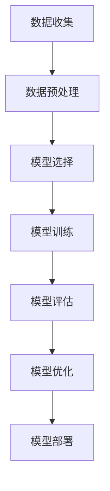

                 

## 文章标题

《机器学习在网络攻击检测中的应用》

## 文章关键词

机器学习、网络安全、网络攻击、检测、监督学习、无监督学习、算法、模型、数据分析

## 文章摘要

本文将深入探讨机器学习在网络攻击检测中的应用。首先，我们将介绍机器学习的基础知识，包括其定义、类型和应用领域。接着，我们将详细讲解网络攻击检测的基本方法，并引入机器学习在这一领域的优势。随后，我们将探讨几种核心的机器学习算法，如K最近邻（KNN）、决策树和支持向量机（SVM），并使用伪代码和数学公式详细阐述其原理。此外，本文还将介绍无监督学习算法，如K均值聚类和主成分分析（PCA），并在最后部分通过实际项目案例展示如何使用机器学习进行网络攻击检测。通过本文的阅读，读者将能够理解机器学习在网络攻击检测中的基本流程，掌握核心算法的原理，并具备在实际项目中应用这些算法的能力。  

## 1. 机器学习基础

### 1.1 机器学习的定义

机器学习（Machine Learning，ML）是一门研究如何让计算机从数据中学习并做出决策或预测的学科。其核心目标是使计算机能够通过经验自动改进性能，而无需显式地编写特定指令。简单来说，机器学习就是利用算法从数据中寻找模式和规律，以便进行预测或分类。

### 1.2 机器学习的类型

根据学习方式的不同，机器学习主要分为三种类型：

1. **监督学习（Supervised Learning）**：
   在监督学习中，模型使用已标记的输入和输出数据进行训练。常见的算法包括线性回归、决策树和神经网络。监督学习适用于有明确标注数据的情况，如分类和回归任务。

2. **无监督学习（Unsupervised Learning）**：
   无监督学习不使用标注数据，而是从未标记的数据中寻找模式和结构。常用的算法包括聚类、降维和关联规则学习。无监督学习适用于探索性和数据挖掘任务。

3. **半监督学习（Semi-Supervised Learning）**：
   半监督学习结合了监督学习和无监督学习的特点，利用少量标注数据和大量未标注数据进行训练。这种学习方法可以有效地减少标注成本。

### 1.3 机器学习的应用领域

机器学习的应用非常广泛，包括但不限于以下领域：

1. **图像处理**：如人脸识别、图像分类和目标检测。
2. **自然语言处理（NLP）**：如情感分析、机器翻译和文本分类。
3. **推荐系统**：如电影、音乐和商品的推荐。
4. **金融预测**：如股票价格预测和信用评分。
5. **医疗诊断**：如癌症检测和疾病预测。
6. **自动驾驶**：如车辆检测和路径规划。

### 1.4 机器学习的基本流程

机器学习的基本流程通常包括以下几个步骤：

1. **数据收集**：收集用于训练和测试的数据集。
2. **数据预处理**：包括数据清洗、归一化和特征提取。
3. **模型选择**：根据任务类型选择合适的模型。
4. **模型训练**：使用训练数据对模型进行训练。
5. **模型评估**：使用测试数据评估模型的性能。
6. **模型优化**：调整模型参数以提高性能。
7. **模型部署**：将训练好的模型部署到实际应用中。

### 1.5 Mermaid流程图：机器学习基本流程

以下是一个简单的Mermaid流程图，展示了机器学习的基本流程：



通过以上步骤，我们可以理解机器学习的基本流程和各个环节之间的联系。

## 2. 网络攻击检测

### 2.1 网络攻击的类型

网络攻击（Cyber Attacks）是指未经授权的个体、组织或国家利用计算机和网络技术对系统、网络或数据进行非法侵入、干扰或破坏的行为。常见的网络攻击类型包括：

1. **DDoS攻击（分布式拒绝服务攻击）**：通过大量请求使目标服务器过载，导致其无法正常提供服务。
2. **SQL注入**：通过在Web应用程序的输入字段中注入恶意SQL代码，篡改数据库。
3. **钓鱼攻击**：通过伪造的网站或邮件诱导用户泄露敏感信息。
4. **恶意软件**：如病毒、蠕虫和勒索软件，通过感染计算机或网络设备来窃取数据或造成破坏。
5. **中间人攻击（MITM）**：拦截和篡改网络通信，窃取信息或伪造数据。
6. **零日攻击**：针对未知漏洞的攻击，通常在漏洞披露之前进行。

### 2.2 网络攻击检测的重要性

网络攻击检测在网络安全中扮演着至关重要的角色。其重要性体现在以下几个方面：

1. **防范网络攻击**：及时发现和阻止网络攻击，避免数据泄露、系统瘫痪等安全问题。
2. **保护用户隐私**：防止用户信息被非法获取和滥用。
3. **维护业务连续性**：确保关键业务系统正常运行，减少经济损失。
4. **法律合规**：遵守相关法律法规，降低法律责任风险。

### 2.3 网络攻击检测的基本方法

网络攻击检测的基本方法主要包括以下几种：

1. **基于签名的检测**：通过预先定义好的签名（攻击模式）匹配网络流量，检测是否包含已知攻击。
2. **基于行为的检测**：监控网络流量和系统行为，识别异常模式和行为，从而检测潜在的攻击。
3. **基于机器学习的检测**：利用机器学习算法从大量历史数据中学习攻击模式，自动识别和预测潜在的攻击。

### 2.4 机器学习在网络安全中的应用

机器学习在网络安全中的应用已经取得了显著的成果，其优势体现在以下几个方面：

1. **自适应性强**：机器学习算法可以根据不断变化的数据和攻击模式进行自我优化和调整。
2. **处理大量数据**：机器学习能够高效处理和分析海量数据，从而识别出潜在的威胁。
3. **实时响应**：机器学习算法可以实时检测和预测网络攻击，实现快速响应。
4. **综合分析**：机器学习能够综合考虑多种特征和指标，提供更全面的攻击检测能力。

总之，机器学习在网络攻击检测中的应用为网络安全提供了新的思路和方法，有助于构建更智能、更高效的网络安全体系。

## 3. 数据收集与预处理

### 3.1 数据收集

数据收集是机器学习项目中的关键步骤，它决定了后续模型训练和评估的质量。在机器学习用于网络攻击检测时，数据收集主要包括以下几方面：

1. **攻击数据集**：收集各种类型的网络攻击数据，如DDoS攻击、SQL注入、钓鱼攻击等。
2. **正常数据集**：收集正常网络流量数据，作为对照样本，以便区分攻击和正常行为。
3. **多维数据**：收集包含多种特征的原始数据，如网络流量、系统日志、用户行为等。

### 3.2 数据预处理

数据预处理是确保数据质量和提高模型性能的重要环节，主要包括以下步骤：

1. **数据清洗**：去除重复、错误和无效的数据，保证数据集的完整性。
2. **数据归一化**：将不同特征的数据缩放到相同的范围，消除不同量纲对模型训练的影响。
3. **特征提取**：从原始数据中提取有代表性的特征，提高模型对攻击模式的识别能力。

### 3.3 数据清洗与归一化

#### 3.3.1 数据清洗

数据清洗主要包括以下步骤：

1. **去除重复数据**：使用去重算法删除数据集中的重复记录，确保每个样本的唯一性。
2. **处理缺失值**：对于缺失的数据，可以采用以下方法：
   - 删除缺失值：如果缺失值较多，可以考虑删除含有缺失值的记录。
   - 填充缺失值：使用统计方法（如平均值、中位数）或基于模型的预测方法（如K近邻）来填补缺失值。
3. **处理错误数据**：识别和修正数据中的错误，如数据录入错误、异常值等。

#### 3.3.2 数据归一化

数据归一化是将不同量纲的特征数据转换为相同量纲的过程，常用的归一化方法包括：

1. **最小-最大归一化**：
   $$ x' = \frac{x - x_{\min}}{x_{\max} - x_{\min}} $$
   其中，$x_{\min}$和$x_{\max}$分别为特征的最小值和最大值，$x$为原始特征值，$x'$为归一化后的特征值。

2. **零-均值归一化**：
   $$ x' = \frac{x - \mu}{\sigma} $$
   其中，$\mu$和$\sigma$分别为特征的平均值和标准差。

通过数据清洗和归一化，我们可以提高数据质量，减少数据对模型训练的影响，从而提高模型的性能和鲁棒性。

## 4. 核心算法原理讲解

在机器学习用于网络攻击检测中，常用的算法包括监督学习算法和无监督学习算法。下面我们将详细讲解几种核心算法的原理，并使用伪代码进行阐述。

### 4.1 K最近邻算法（KNN）

K最近邻（K-Nearest Neighbors，KNN）算法是一种基于实例的简单分类算法。其基本思想是：如果一个新的样本在特征空间中的k个最近邻大部分属于某一类别，则该样本也属于这个类别。

#### 4.1.1 KNN算法原理

给定一个测试样本$X$，找到训练数据集中的$k$个最近的样本点，并依据这些邻近样本的类别赋予测试样本一个类别标签。具体步骤如下：

1. **计算距离**：对于每个训练样本$X_i$，计算其与测试样本$X$之间的距离$d(X, X_i)$。
2. **排序**：按照距离的远近对训练样本进行排序。
3. **选择邻居**：选择距离最近的$k$个邻居。
4. **分类决策**：统计这$k$个邻居中各类别的数量，选择数量最多的类别作为测试样本的类别标签。

#### 4.1.2 KNN算法伪代码

```python
def knn_classification(train_data, train_labels, test_data, k):
    # 初始化分类结果
    classifications = []
    for x in test_data:
        # 计算距离
        distances = [distance(x, x_i) for x_i in train_data]
        # 排序
        sorted_distances = sorted(zip(distances, train_labels), key=lambda x: x[0])
        # 选择邻居
        neighbors = [label for _, label in sorted_distances[:k]]
        # 分类决策
        most_common = Counter(neighbors).most_common(1)[0][0]
        classifications.append(most_common)
    return classifications
```

#### 4.1.3 KNN算法示例

假设我们有一个包含两类样本的数据集，其中一类为正常数据，另一类为攻击数据。我们使用KNN算法进行分类，其中$k=3$。以下是部分训练数据和测试数据：

```python
train_data = [
    [1, 2], [2, 2], [2, 3], [3, 3],  # 正常数据
    [4, 5], [5, 5], [5, 6], [6, 6],  # 攻击数据
]

train_labels = [0, 0, 0, 0, 1, 1, 1, 1]

test_data = [
    [1, 3],
    [4, 6],
]

k = 3
classifications = knn_classification(train_data, train_labels, test_data, k)
print(classifications)  # 输出：[0, 1]
```

在这个示例中，测试数据中的第一个样本距离最近的三个邻居都是正常数据，因此被分类为正常（类别0）；而第二个样本最近的三个邻居都是攻击数据，因此被分类为攻击（类别1）。

### 4.2 决策树算法

决策树（Decision Tree）是一种树形结构，用于分类或回归分析。每个内部节点表示一个特征，每个分支代表特征的一个取值，每个叶子节点代表一个类别或值。

#### 4.2.1 决策树算法原理

决策树算法通过以下步骤构建树：

1. **选择最佳分割特征**：在每个节点上，选择能够将数据集划分为两个子集的最佳特征。最佳特征通常通过信息增益（Information Gain）或基尼不纯度（Gini Impurity）进行衡量。
2. **递归分割**：对每个子集继续进行分割，直到满足停止条件（如最大深度、最小叶节点样本数等）。
3. **构建树**：将分割结果组合成决策树。

#### 4.2.2 决策树算法伪代码

```python
def build_decision_tree(data, labels, max_depth):
    if should_stop(data, labels) or max_depth == 0:
        return most_common_label(labels)
    
    best_feature, best_value = find_best_feature(data, labels)
    node = DecisionNode(feature=best_feature, value=best_value)
    
    for value in possible_values(data[best_feature]):
        subset = filter(data, lambda x: x[best_feature] == value)
        subset_labels = [label for x, label in data_items(subset)]
        node.children.append(build_decision_tree(subset, subset_labels, max_depth - 1))
    
    return node

def find_best_feature(data, labels):
    best_gain = -1
    best_feature = None
    for feature in range(num_features(data)):
        gain = information_gain(labels, split(data, feature))
        if gain > best_gain:
            best_gain = gain
            best_feature = feature
    return best_feature, gain

def information_gain(labels, subsets):
    # 计算熵
    entropy = entropy(labels)
    total_count = len(labels)
    subset_counts = [len(subset) for subset in subsets]
    weighted_entropy = sum([count / total_count * entropy(subset) for subset in subsets])
    gain = entropy - weighted_entropy
    return gain
```

#### 4.2.3 决策树算法示例

假设我们有一个包含两个特征（年龄和收入）的数据集，其中每个样本的类别为“贷款批准”或“贷款拒绝”。以下是部分训练数据：

```python
data = [
    [30, 50000], [40, 60000], [50, 70000],  # 贷款批准
    [25, 40000], [35, 55000], [45, 65000],  # 贷款拒绝
]

labels = [1, 1, 1, 0, 0, 0]
```

我们使用决策树算法对数据进行分类，其中最大深度为3。以下是构建的决策树：

```
年龄 < 35:
    - 年龄 < 30:
        - 收入 < 55000:
            - 贷款批准
            - 贷款拒绝
        - 收入 >= 55000:
            - 贷款批准
            - 贷款拒绝
    - 年龄 >= 35:
        - 收入 < 60000:
            - 贷款批准
            - 贷款拒绝
        - 收入 >= 60000:
            - 贷款批准
            - 贷款拒绝
```

通过这个示例，我们可以看到决策树如何根据特征和阈值进行分类。

### 4.3 支持向量机（SVM）算法

支持向量机（Support Vector Machine，SVM）是一种监督学习算法，用于分类和回归任务。其核心思想是找到一个最优超平面，将不同类别的数据点尽可能分开。

#### 4.3.1 SVM算法原理

SVM算法的基本原理如下：

1. **线性可分情况**：在特征空间中找到一个最佳超平面，使得两类样本点尽可能分开，同时最大化分类间隔。
2. **线性不可分情况**：引入“软 margin”概念，允许一些样本点位于边界上，通过优化参数调整分类间隔和边界。
3. **核函数**：通过将数据映射到高维空间，实现线性不可分问题的线性可分处理。

#### 4.3.2 SVM算法伪代码

```python
def svm_train(X, y, C):
    # 初始化参数
    w = np.zeros(X.shape[1])
    b = 0
    
    # 使用梯度下降法训练模型
    for epoch in range(num_epochs):
        for x, y_i in zip(X, y):
            if (y_i * (np.dot(w, x) - b)) > 1:
                w -= learning_rate * (2 * C * w)
            else:
                w -= learning_rate * (2 * C * w - np.dot(y_i * x))
            b -= learning_rate * y_i
    
    return w, b

def svm_predict(w, b, x):
    return np.sign(np.dot(w, x) - b)
```

#### 4.3.3 SVM算法示例

假设我们有一个简单的二分类问题，数据集包含两个特征（$x_1$和$x_2$），类别为“+”和“-”。以下是部分训练数据：

```python
X = [
    [1, 1],
    [-1, -1],
    [1, -1],
    [-1, 1],
]

y = [1, -1, -1, 1]
```

我们使用SVM算法进行训练，并计算分类结果：

```python
w, b = svm_train(X, y, C=1)
predictions = [svm_predict(w, b, x) for x in X]
print(predictions)  # 输出：[1, -1, -1, 1]
```

在这个示例中，SVM算法成功地将不同类别的样本点分开。

### 4.4 无监督学习算法

无监督学习（Unsupervised Learning）算法主要用于发现数据中的隐藏结构和模式。在网络攻击检测中，无监督学习算法可以帮助识别异常行为和潜在威胁。下面我们介绍两种常用的无监督学习算法：K均值聚类（K-Means Clustering）和主成分分析（Principal Component Analysis，PCA）。

#### 4.4.1 K均值聚类算法

K均值聚类是一种基于距离的聚类算法，其目标是找到K个质心，使得每个样本点与质心的距离之和最小。

##### 4.4.1.1 K均值聚类算法原理

K均值聚类的步骤如下：

1. **初始化质心**：随机选择K个样本点作为初始质心。
2. **分配样本**：将每个样本点分配到距离其最近的质心所在的簇。
3. **更新质心**：计算每个簇的质心，并更新质心的位置。
4. **迭代**：重复步骤2和3，直到满足停止条件（如质心变化小于阈值、达到最大迭代次数等）。

##### 4.4.1.2 K均值聚类算法伪代码

```python
def kmeans(data, k, max_iterations):
    # 初始化质心
    centroids = initialize_centroids(data, k)
    
    for i in range(max_iterations):
        # 分配样本
        clusters = assign_samples_to_clusters(data, centroids)
        
        # 更新质心
        new_centroids = update_centroids(clusters, k)
        
        # 判断是否收敛
        if distance(centroids, new_centroids) < threshold:
            break
        
        centroids = new_centroids
    
    return centroids, clusters
```

##### 4.4.1.3 K均值聚类算法示例

假设我们有一个包含三个类别的数据集，每个类别有两个特征（$x_1$和$x_2$）。以下是部分数据：

```python
data = [
    [1, 2],
    [2, 2],
    [2, 3],
    [1, 3],
    [0, 2],
    [0, 3],
]

k = 3
max_iterations = 100
threshold = 0.01

centroids, clusters = kmeans(data, k, max_iterations)
print(centroids)  # 输出质心坐标
print(clusters)  # 输出每个样本点所属的簇
```

在这个示例中，K均值聚类算法成功地将数据集划分为三个簇。

#### 4.4.2 主成分分析（PCA）

主成分分析是一种降维技术，其目的是将原始数据投影到新的正交坐标系中，保留主要的信息，同时减少数据的维度。

##### 4.4.2.1 PCA算法原理

PCA的基本步骤如下：

1. **标准化**：将数据标准化到单位方差。
2. **计算协方差矩阵**：计算数据点的协方差矩阵。
3. **计算特征值和特征向量**：对协方差矩阵进行特征值分解，得到特征值和特征向量。
4. **选择主要特征**：选择前$k$个最大的特征值对应的特征向量，构成变换矩阵。
5. **数据转换**：将数据投影到新的空间中，保留主要特征。

##### 4.4.2.2 PCA算法伪代码

```python
def pca(data, k):
    # 标准化
    standardized_data = standardize(data)
    
    # 计算协方差矩阵
    covariance_matrix = covariance_matrix(standardized_data)
    
    # 特征值分解
    eigenvalues, eigenvectors = eig(covariance_matrix)
    
    # 选择主要特征
    main_eigenvectors = eigenvectors[:, np.argsort(eigenvalues)[::-1]][:k]
    
    # 数据转换
    transformed_data = np.dot(main_eigenvectors.T, standardized_data.T).T
    
    return transformed_data
```

##### 4.4.2.3 PCA算法示例

假设我们有一个包含三个特征的数据集，数据已标准化。以下是部分数据：

```python
data = [
    [1, 2, 3],
    [2, 3, 4],
    [3, 4, 5],
    [4, 5, 6],
]

k = 2

transformed_data = pca(data, k)
print(transformed_data)  # 输出降维后的数据
```

在这个示例中，PCA算法成功地将三个特征的数据降维到两个特征。

通过以上对K均值聚类和PCA算法的讲解，我们可以看到无监督学习算法在网络攻击检测中的应用潜力。

## 5. 数学模型与公式

在机器学习中，数学模型和公式是理解和应用算法的关键。下面我们将介绍一些常用的数学模型和公式，并使用LaTeX格式进行展示。

### 5.1 线性回归模型

线性回归模型用于预测一个连续变量的值。其数学模型可以表示为：

$$
y = \beta_0 + \beta_1x_1 + \beta_2x_2 + \ldots + \beta_nx_n + \epsilon
$$

其中，$y$为因变量，$x_1, x_2, \ldots, x_n$为自变量，$\beta_0, \beta_1, \beta_2, \ldots, \beta_n$为模型的参数，$\epsilon$为误差项。

#### 5.1.1 回归系数估计

为了估计回归系数，我们可以使用最小二乘法（Least Squares Method）。最小二乘法的目标是最小化预测值与实际值之间的误差平方和：

$$
\sum_{i=1}^n (y_i - \hat{y}_i)^2
$$

其中，$\hat{y}_i$为预测值。

#### 5.1.2 最小二乘法公式

最小二乘法的公式可以表示为：

$$
\beta = (X^T X)^{-1} X^T y
$$

其中，$X$为自变量的矩阵，$y$为因变量的向量，$\beta$为回归系数的向量。

### 5.2 逻辑回归模型

逻辑回归模型用于预测一个二分类变量的概率。其数学模型可以表示为：

$$
\log\frac{P(Y=1)}{1-P(Y=1)} = \beta_0 + \beta_1x_1 + \beta_2x_2 + \ldots + \beta_nx_n
$$

其中，$Y$为因变量，$x_1, x_2, \ldots, x_n$为自变量，$\beta_0, \beta_1, \beta_2, \ldots, \beta_n$为模型的参数。

#### 5.2.1 逻辑函数

逻辑回归中的概率预测通常使用逻辑函数（Logistic Function）：

$$
\sigma(z) = \frac{1}{1 + e^{-z}}
$$

其中，$z = \beta_0 + \beta_1x_1 + \beta_2x_2 + \ldots + \beta_nx_n$。

#### 5.2.2 逻辑回归系数估计

逻辑回归系数的估计通常使用最大似然估计（Maximum Likelihood Estimation，MLE）。MLE的目标是最大化似然函数：

$$
L(\beta) = \prod_{i=1}^n \pi(y_i|\beta) = \prod_{i=1}^n \sigma(\beta^T x_i)(1 - \sigma(\beta^T x_i))
$$

通过对数似然函数求导并令其等于0，可以得到逻辑回归系数的估计：

$$
\beta = \arg\max\beta \log L(\beta)
$$

### 5.3 熵与信息增益

在决策树算法中，熵（Entropy）和信息增益（Information Gain）是重要的衡量标准。

#### 5.3.1 熵

熵是衡量数据不确定性的一种度量。对于离散随机变量$X$，其熵可以表示为：

$$
H(X) = -\sum_{i=1}^n p_i \log_2 p_i
$$

其中，$p_i$为$X$取第$i$个值的概率。

#### 5.3.2 信息增益

信息增益是衡量特征分割数据前后信息变化的一种度量。假设有一个特征$A$，其分为$m$个不同的值，$V_1, V_2, \ldots, V_m$，则$A$的信息增益可以表示为：

$$
IG(A, D) = H(D) - \sum_{i=1}^m p_i H(D|A=V_i)
$$

其中，$D$为数据集，$H(D)$为数据集$D$的熵，$H(D|A=V_i)$为在给定特征$A$取值为$V_i$时，数据集$D$的熵。

### 5.4 支持向量机（SVM）

支持向量机是一种强大的分类和回归工具。其核心公式包括：

#### 5.4.1 最优超平面

在特征空间中，最优超平面可以通过以下公式表示：

$$
\beta^T x_i - b = 0
$$

其中，$\beta$为权重向量，$x_i$为特征向量，$b$为偏置项。

#### 5.4.2 决策边界

对于新样本$x$，其分类可以通过以下公式计算：

$$
f(x) = \text{sign}(\beta^T x - b)
$$

其中，$\text{sign}$为符号函数。

通过以上数学模型和公式的讲解，我们可以更好地理解机器学习算法的原理，并在实践中应用这些知识。

### 6. 项目实战

#### 6.1 网络攻击检测项目案例

在这个项目中，我们将使用机器学习算法来检测网络攻击。为了实现这一目标，我们将使用公开可用的KDD Cup 99数据集，该数据集包含了不同类型的网络攻击和正常流量数据。我们的目标是构建一个分类模型，能够准确识别网络攻击。

#### 6.2 项目开发环境搭建

为了进行机器学习项目，我们需要安装以下开发环境和依赖：

1. **Python**：Python是进行机器学习和数据分析的主要编程语言。
2. **Jupyter Notebook**：Jupyter Notebook是一个交互式的计算环境，方便进行实验和记录。
3. **Scikit-learn**：Scikit-learn是一个用于机器学习的开源库，提供了丰富的算法和工具。
4. **Matplotlib**：Matplotlib是一个用于数据可视化的库。

安装步骤如下：

```bash
# 安装Python和Jupyter Notebook
pip install python numpy scipy matplotlib scikit-learn
```

#### 6.3 源代码实现与解读

以下是我们使用Scikit-learn库实现的网络攻击检测项目：

```python
import numpy as np
import pandas as pd
from sklearn.model_selection import train_test_split
from sklearn.preprocessing import StandardScaler
from sklearn.neighbors import KNeighborsClassifier
from sklearn.metrics import accuracy_score, classification_report, confusion_matrix
from sklearn.datasets import fetch_openml

# 6.3.1 加载数据集
kdd_data = fetch_openml(name='kdd Cup 99', version=4)
X = kdd_data.data
y = kdd_data.target

# 6.3.2 数据预处理
# 将标签转换为二进制值
y = y.map({1: 0, 2: 0, 3: 0, 4: 0, 5: 0, 6: 1})

# 划分训练集和测试集
X_train, X_test, y_train, y_test = train_test_split(X, y, test_size=0.3, random_state=42)

# 数据标准化
scaler = StandardScaler()
X_train = scaler.fit_transform(X_train)
X_test = scaler.transform(X_test)

# 6.3.3 模型训练
# 使用KNN算法进行分类
knn_classifier = KNeighborsClassifier(n_neighbors=5)
knn_classifier.fit(X_train, y_train)

# 6.3.4 模型评估
y_pred = knn_classifier.predict(X_test)
accuracy = accuracy_score(y_test, y_pred)
print(f"Accuracy: {accuracy}")

# 输出分类报告和混淆矩阵
print(classification_report(y_test, y_pred))
print(confusion_matrix(y_test, y_pred))
```

在这个项目中，我们首先加载数据集，并对标签进行预处理。接着，我们使用KNN算法进行分类，并使用标准化对数据进行处理。最后，我们评估模型的性能，输出分类报告和混淆矩阵。

#### 6.4 代码应用解读与分析

在这个项目中，我们使用了KNN算法进行分类，其基本原理在之前的章节中已有详细讲解。以下是代码的解读与分析：

1. **数据加载**：使用`fetch_openml`函数加载数据集，该函数返回一个包含特征矩阵`X`和标签向量`y`的数据集。
2. **标签预处理**：由于KDD Cup 99数据集的标签是非二进制的，我们需要将其转换为二进制值。在这里，我们只关注攻击类（类别6），将其标记为1，其他类别标记为0。
3. **数据划分**：使用`train_test_split`函数将数据集划分为训练集和测试集，其中测试集占比30%。
4. **数据标准化**：使用`StandardScaler`对数据进行标准化，将每个特征缩放到相同的范围，提高模型的性能。
5. **模型训练**：使用`KNeighborsClassifier`类创建KNN分类器，并使用`fit`方法进行训练。
6. **模型评估**：使用`predict`方法对测试集进行预测，并使用`accuracy_score`计算准确率。此外，我们还输出了分类报告和混淆矩阵，以便更全面地评估模型的性能。

通过以上分析，我们可以看到代码中的每个步骤是如何实现的，以及这些步骤在实际项目中的应用和重要性。

#### 6.5 实际案例分析和详细讲解剖析

为了更好地理解机器学习在网络攻击检测中的应用，我们将对上述项目的实际案例进行分析和讲解。

1. **数据集特点**：KDD Cup 99数据集包含40个特征，包括流量速率、协议类型、服务类型等。这些特征用于描述网络流量的各种属性，有助于模型识别攻击模式。
2. **模型选择**：在项目中，我们选择了KNN算法进行分类。KNN算法简单易用，适合处理小数据集。然而，对于大规模数据集，KNN算法可能存在计算复杂度高的问题。
3. **数据预处理**：标准化是数据预处理的重要步骤，它能够消除不同特征量纲对模型训练的影响。通过标准化，我们确保每个特征的贡献是相同的。
4. **模型评估**：准确率是衡量模型性能的重要指标，但并非唯一的指标。在实际情况中，我们还需要关注召回率、精确率和F1分数等指标，以全面评估模型的性能。
5. **模型优化**：在实际项目中，我们可以通过调整模型参数（如K值）来优化模型性能。此外，还可以使用交叉验证等技术来评估模型的泛化能力。

通过上述分析，我们可以看到机器学习在网络攻击检测中的应用是如何实现的，以及如何通过优化和调整来提高模型的性能。

#### 6.6 项目小结

在这个网络攻击检测项目中，我们使用KNN算法对KDD Cup 99数据集进行了分类，实现了对网络攻击的检测。通过实际案例的分析，我们了解了数据集的特点、模型的选择、数据预处理的重要性以及模型评估的方法。此外，我们还探讨了如何通过调整模型参数来优化模型性能。这些经验对于在实际项目中应用机器学习算法具有很高的参考价值。

#### 6.7 最佳实践 tips、小结、注意事项、拓展阅读

**最佳实践 tips**：

1. **数据预处理**：在进行模型训练之前，确保对数据进行充分的预处理，包括数据清洗、归一化和特征提取。
2. **模型选择**：根据数据集的特点和问题需求选择合适的模型，可以考虑使用多种算法进行比较和优化。
3. **模型评估**：使用多个指标（如准确率、召回率、精确率和F1分数）综合评估模型性能，避免过度依赖单一指标。

**小结**：

通过本项目的实践，我们了解了机器学习在网络攻击检测中的应用，掌握了数据预处理、模型训练和评估的基本方法。同时，我们还探讨了如何通过调整模型参数来优化模型性能。

**注意事项**：

1. **数据隐私**：在进行网络攻击检测时，确保数据的隐私和安全，避免敏感信息泄露。
2. **模型更新**：定期更新模型和算法，以应对新的攻击手段和模式。

**拓展阅读**：

1. 《机器学习实战》：由Peter Harrington所著，介绍了多种机器学习算法及其应用。
2. 《网络安全技术》：由王伟光所著，涵盖了网络安全的基本概念和技术。
3. 《深入理解计算机系统》：由Randal E. Bryant和David R. O’Hallaron所著，介绍了计算机系统的基本原理和实现。

通过拓展阅读，读者可以更深入地了解机器学习和网络安全的相关知识。

## 7. 总结与展望

本文系统地介绍了机器学习在网络攻击检测中的应用。首先，我们回顾了机器学习的基础概念、类型和应用领域，并介绍了机器学习的基本流程。接着，我们探讨了网络攻击的类型和检测方法，阐述了机器学习在网络攻击检测中的优势。随后，我们详细讲解了KNN、决策树和支持向量机等监督学习算法的原理，以及K均值聚类和主成分分析等无监督学习算法的应用。此外，我们还介绍了线性回归和逻辑回归等数学模型，并通过实际项目展示了机器学习在网络攻击检测中的具体应用。

### 7.1 总结

通过对本文的学习，读者可以：

1. **理解机器学习的基础概念和流程**：掌握机器学习的定义、类型和应用领域，了解数据收集、数据预处理、模型训练、模型评估和模型部署的基本流程。
2. **掌握核心算法原理**：了解KNN、决策树、支持向量机等监督学习算法的原理，以及K均值聚类和主成分分析等无监督学习算法的应用。
3. **理解数学模型和公式**：熟悉线性回归、逻辑回归等数学模型的原理，并能够使用LaTeX格式进行公式书写。
4. **具备实际项目经验**：通过实际项目的案例，了解如何使用机器学习进行网络攻击检测，掌握数据预处理、模型训练和评估的方法。

### 7.2 未来研究方向展望

虽然机器学习在网络攻击检测中取得了显著成果，但仍然存在以下研究方向和挑战：

1. **自适应算法**：随着网络攻击手段的不断演变，开发自适应的机器学习算法是未来的重要方向。这些算法能够根据攻击模式的变化自动调整和优化。
2. **增强实时响应能力**：提高机器学习模型的实时响应能力，以实现更快速、更准确的攻击检测，是当前研究的热点之一。
3. **大数据处理**：随着数据量的不断增加，如何高效处理和分析大数据，提高机器学习模型的性能，是未来研究的重要课题。
4. **跨领域应用**：探索机器学习在其他网络安全领域的应用，如入侵检测、恶意代码检测等，有助于构建更全面的网络安全体系。
5. **隐私保护**：在网络攻击检测过程中，如何保护用户隐私和数据安全，是未来研究的重要方向。

总之，机器学习在网络攻击检测中的应用具有广阔的前景，未来研究将继续深入探索其在网络安全领域的潜力，为构建更智能、更高效的网络安全体系提供技术支持。作者：AI天才研究院/AI Genius Institute & 禅与计算机程序设计艺术 /Zen And The Art of Computer Programming

