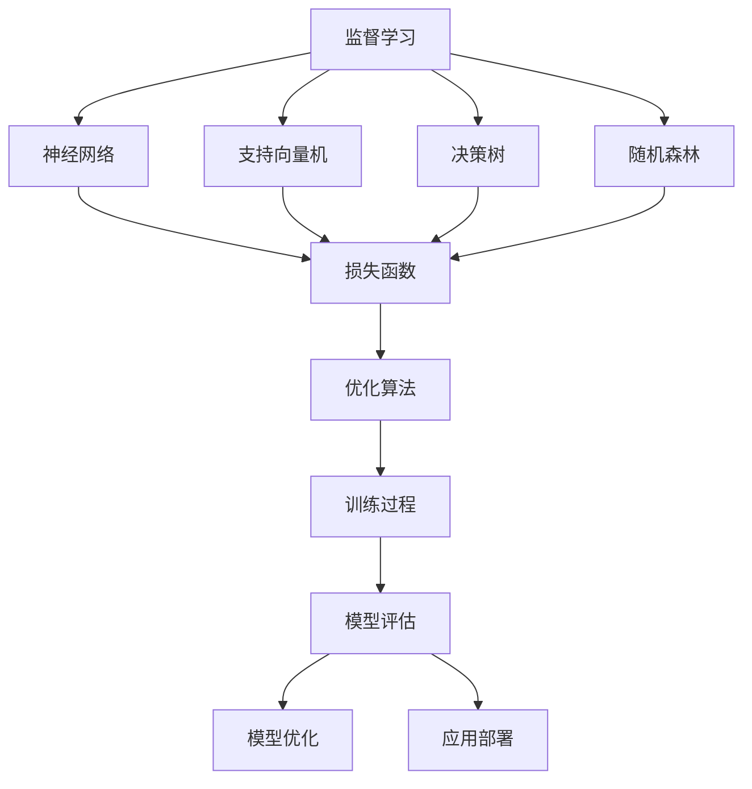

                 

### 引言

在现代网络环境中，网络攻击成为了一个日益严峻的威胁。这些攻击不仅对企业的信息安全构成威胁，还可能对个人隐私和公共利益造成严重损害。随着网络技术的不断进步，攻击者的手段也在不断升级，传统的基于规则的网络防御系统逐渐难以应对复杂的攻击模式。因此，寻找新的方法来提高网络防御能力成为了当务之急。

机器学习作为一种强大的数据处理和模式识别工具，近年来在各个领域都展现出了巨大的潜力。特别是在网络安全领域，机器学习被广泛应用于攻击模式识别、恶意代码检测和入侵检测等方面。通过机器学习，我们可以从大量的网络数据中自动发现攻击模式，从而提高网络的自我防御能力。

本书旨在探讨机器学习在网络攻击模式识别中的应用，通过详细的讲解和实际案例的分析，帮助读者理解如何利用机器学习技术来识别网络攻击模式，从而提高网络防御能力。本书将分为以下几个部分：

1. **机器学习基础**：介绍机器学习的基本概念、主要算法以及相关的数学模型，为后续内容打下理论基础。
2. **网络攻击模式识别技术**：讲解网络攻击的基本类型、模式识别的原理以及相关的算法和技术。
3. **机器学习在网络攻击模式识别中的应用案例**：通过具体的案例展示如何将机器学习应用于网络攻击模式识别。
4. **提高网络防御能力的策略与方法**：探讨如何利用机器学习技术来提升网络防御能力，并介绍一些具体的策略和方法。

通过本书的阅读，读者可以系统地了解机器学习在网络攻击模式识别中的应用，掌握相关的技术原理和实践方法，从而在网络安全领域取得更好的成果。

### 背景介绍

#### 网络攻击的现状与挑战

网络攻击的定义可以概括为任何试图破坏、干扰、窃取或篡改网络系统或数据的行为。这些攻击形式多样，包括但不限于分布式拒绝服务（DDoS）攻击、恶意代码攻击、钓鱼攻击、中间人攻击等。随着互联网的普及和信息技术的迅猛发展，网络攻击的频率和复杂性不断增加，给网络安全带来了前所未有的挑战。

目前，网络攻击呈现出以下几种主要趋势：

1. **攻击手段的多样化**：攻击者使用更加复杂和隐蔽的手段进行攻击，传统的基于规则的安全防御机制难以应对。
2. **攻击目的的商业化**：越来越多的网络攻击是为了获取经济利益，例如窃取财务数据、窃取知识产权等。
3. **攻击时间的实时性**：许多攻击是实时进行的，攻击者能够迅速检测到系统漏洞并利用这些漏洞发起攻击。
4. **攻击目标的广泛性**：无论是个人、企业还是政府机构，都可能成为网络攻击的目标。

这些趋势对网络安全提出了严峻的挑战。传统的网络防御手段，如防火墙和入侵检测系统（IDS），虽然在一定程度上能够提供保护，但其能力有限，难以有效应对复杂的攻击场景。特别是在攻击模式不断演变的情况下，单纯依靠规则匹配和签名识别已经难以满足网络安全的需求。

#### 机器学习技术的引入

面对网络攻击的复杂性和多样性，机器学习技术作为一种先进的数据处理和模式识别工具，被越来越多地应用于网络安全领域。机器学习是指通过构建和训练模型，让计算机自动从数据中学习规律和模式，从而进行预测和决策。

在网络安全领域，机器学习的主要作用包括：

1. **攻击模式识别**：机器学习可以通过分析大量的网络数据，自动识别出攻击的特征和行为模式，从而实现对未知攻击的检测和预防。
2. **恶意代码检测**：机器学习算法可以分析恶意代码的特征，检测和分类恶意软件，帮助网络安全系统提前发现和阻止恶意活动。
3. **入侵检测**：通过训练机器学习模型，网络安全系统能够实时监控网络流量，识别潜在的入侵行为，提高网络防御能力。

相比于传统的基于规则的防御方法，机器学习具有以下优势：

1. **自适应性和灵活性**：机器学习模型可以不断从新的数据中学习，适应不断变化的攻击模式，提供更加灵活的防御策略。
2. **强大的数据处理能力**：机器学习能够处理和分析大规模的复杂数据，挖掘出隐藏在数据中的潜在规律，为网络安全提供更全面的保护。
3. **自动化和智能化**：通过自动化学习，机器学习可以大大减轻安全运维人员的负担，提高工作效率，同时提供更加智能化的安全防护方案。

#### 机器学习与网络攻击模式识别的结合

机器学习与网络攻击模式识别的结合，主要通过以下几方面实现：

1. **特征工程**：在机器学习应用过程中，首先需要对网络流量数据、日志数据等进行预处理，提取出有助于识别攻击的特征。特征工程的质量直接影响模型的效果。
2. **模型选择与训练**：根据不同的应用场景和需求，选择合适的机器学习模型，并通过大量的训练数据来训练模型，使其能够准确识别网络攻击模式。
3. **模型评估与优化**：通过评估模型在测试数据集上的性能，不断调整和优化模型参数，提高模型的准确性和鲁棒性。
4. **实时检测与响应**：将训练好的模型部署到网络安全系统中，实现对网络流量的实时监控和攻击检测，及时发现并响应潜在威胁。

总之，机器学习技术的引入为网络攻击模式识别带来了新的机遇和挑战。通过有效利用机器学习，我们可以构建更加智能和高效的网络安全系统，提高对网络攻击的识别和防御能力。

### 核心概念与联系

为了深入理解机器学习在网络攻击模式识别中的应用，我们首先需要明确一些核心概念，并探讨它们之间的关系。以下是机器学习在网络攻击模式识别中涉及的主要概念及其相互联系：

#### 机器学习的基本概念

1. **监督学习**：监督学习是机器学习中的一种方法，通过使用标记好的训练数据来训练模型。训练过程中，模型会尝试从输入数据中学习出数据与输出结果之间的映射关系。在网络攻击模式识别中，监督学习可以用于构建攻击检测模型，通过已知的攻击样本和正常流量样本来训练模型，使其能够识别未知攻击。

2. **无监督学习**：无监督学习是指在没有标签信息的情况下，模型从未标记的数据中学习模式和结构。在网络安全领域，无监督学习可以用于流量聚类和异常检测。通过分析网络流量的模式，无监督学习能够发现异常行为，从而提高对未知攻击的识别能力。

3. **强化学习**：强化学习是一种通过奖励机制来训练模型的方法。在网络安全中，强化学习可以用于策略优化，如自动调整防火墙规则，使其能够更有效地应对新的攻击模式。

#### 机器学习的主要算法

1. **神经网络**：神经网络（Neural Networks，NN）是一种模拟人脑神经元结构的计算模型，常用于复杂模式识别任务。在网络安全中，神经网络可以用于识别复杂的攻击模式，如DDoS攻击和恶意代码。

2. **支持向量机**：支持向量机（Support Vector Machine，SVM）是一种二分类模型，通过找到一个最佳的超平面来分离不同类别的数据点。在网络安全中，SVM可以用于分类网络流量，区分正常流量和攻击流量。

3. **决策树**：决策树（Decision Tree）是一种树形结构，通过一系列的判断规则来对数据进行分类。在网络安全中，决策树可以用于构建入侵检测模型，通过分析网络流量特征来判断是否为攻击。

4. **随机森林**：随机森林（Random Forest）是一种集成学习方法，通过构建多棵决策树来提高分类或回归的准确性。在网络安全中，随机森林可以用于流量分类和异常检测，提供更可靠的攻击识别能力。

#### 数学模型和数学公式

1. **损失函数**：损失函数（Loss Function）是机器学习中用于评估模型预测性能的一个指标。常见的损失函数包括均方误差（MSE）和交叉熵（Cross-Entropy）。在网络安全中，损失函数用于评估攻击检测模型的准确性，指导模型优化。

2. **优化算法**：优化算法（Optimization Algorithm）用于最小化损失函数，如梯度下降（Gradient Descent）和随机梯度下降（Stochastic Gradient Descent，SGD）。优化算法在训练机器学习模型时起到关键作用，通过调整模型参数来提高模型的性能。

#### 核心概念之间的关系架构

以下是机器学习核心概念之间的关系架构，使用Mermaid流程图表示：



在这个架构中，监督学习、神经网络、支持向量机、决策树和随机森林是主要的机器学习算法，它们通过损失函数和优化算法共同构成了机器学习的基本框架。训练过程中，模型通过不断优化来提高预测性能，并通过评估和部署来实现实际应用。

#### 核心算法原理讲解

接下来，我们将详细讲解上述提到的几种核心算法的原理，并使用伪代码来展示其基本流程。

1. **神经网络**

神经网络是一种基于多层感知器（Perceptron）的模型，通过多层神经元进行数据转换和特征提取。以下是一个简单的神经网络模型的伪代码：

```plaintext
初始化权重和偏置
while 未达到最大迭代次数:
  for 每一层 l 从输入层到输出层:
    z_l = 权重_l * 输入 + 偏置_l
    a_l = sigmoid(z_l)
  输出 = a_output
  计算损失函数值
  计算梯度
  更新权重和偏置
return 模型参数
```

在这个伪代码中，`sigmoid` 函数用于激活函数，将线性组合的输出映射到[0,1]区间。权重和偏置的更新通过梯度下降算法进行，以最小化损失函数。

2. **支持向量机**

支持向量机是一种二分类模型，通过找到最佳的超平面来最大化两类数据点的间隔。以下是一个简单的支持向量机的伪代码：

```plaintext
初始化权重和偏置
for 每个支持向量:
  计算权重更新：Δw = -η * y[i] * (w * x[i] - 1)
  更新权重：w = w + Δw
  计算偏置更新：Δb = -η * Σ(y[i] * (w * x[i] - 1))
  更新偏置：b = b + Δb
return 权重和偏置
```

在这个伪代码中，`η` 是学习率，`y[i]` 是样本标签，`x[i]` 是输入特征。支持向量是那些位于超平面边缘的数据点，它们对于分类结果具有决定性影响。

3. **决策树**

决策树是一种基于特征值划分数据的方法，通过一系列的判断规则来对数据进行分类。以下是一个简单的决策树的伪代码：

```plaintext
定义决策树节点
class TreeNode:
  feature: int
  threshold: float
  left: TreeNode
  right: TreeNode
  value: int

构建决策树:
if 特征值小于阈值:
  left = 划分左子节点
  right = 划分右子节点
else:
  left = 划分左子节点
  right = 划分右子节点
if 叶节点:
  return 叶节点值
else:
  输出特征值和子节点：return (feature, threshold, left, right)
```

在这个伪代码中，`特征值` 和 `阈值` 用于划分数据，`左子节点` 和 `右子节点` 用于递归构建决策树。

4. **随机森林**

随机森林是一种集成学习方法，通过构建多棵决策树来提高分类或回归的准确性。以下是一个简单的随机森林模型的伪代码：

```plaintext
初始化决策树列表
for 每棵树:
  随机选择特征子集
  构建决策树
添加决策树到列表
return 随机森林模型
```

在这个伪代码中，`特征子集` 用于随机选择特征，以减少模型过拟合的风险，并提高模型的泛化能力。

通过上述讲解，我们了解了机器学习核心算法的基本原理和流程。这些算法通过不同的机制来处理数据和学习模式，为网络安全领域提供了有效的工具和方法。

### 数学模型和公式

在理解了机器学习的基本算法后，我们需要进一步深入探讨这些算法背后的数学模型和公式。这些数学工具不仅是算法实现的基础，也帮助我们更深入地理解其工作原理和性能。

#### 损失函数

损失函数是机器学习中的一个核心概念，用于评估模型预测值与实际值之间的差异。一个理想的损失函数应能精确地衡量预测误差，并引导模型优化过程。以下是一些常用的损失函数：

1. **均方误差（MSE）**

均方误差是最常用的损失函数之一，用于回归问题。其公式如下：

$$
MSE = \frac{1}{m} \sum_{i=1}^{m} (y_i - \hat{y}_i)^2
$$

其中，$m$ 是样本数量，$y_i$ 是实际值，$\hat{y}_i$ 是预测值。

2. **交叉熵（Cross-Entropy）**

交叉熵常用于分类问题，特别是二分类和多分类任务。其公式如下：

$$
CE = -\frac{1}{m} \sum_{i=1}^{m} y_i \log(\hat{y}_i)
$$

其中，$y_i$ 是实际标签，$\hat{y}_i$ 是预测概率。

#### 优化算法

优化算法用于在模型训练过程中调整模型参数，以最小化损失函数。以下是一些常用的优化算法：

1. **梯度下降（Gradient Descent）**

梯度下降是一种最基本的优化算法，其核心思想是通过梯度的方向来更新参数。其更新公式如下：

$$
\Delta \theta = -\alpha \cdot \nabla_{\theta} J(\theta)
$$

其中，$\alpha$ 是学习率，$\nabla_{\theta} J(\theta)$ 是损失函数对参数 $\theta$ 的梯度。

2. **随机梯度下降（Stochastic Gradient Descent，SGD）**

随机梯度下降是梯度下降的一种变种，通过随机选择一个样本来计算梯度。其公式如下：

$$
\Delta \theta = -\alpha \cdot \nabla_{\theta} J(\theta; x_i, y_i)
$$

其中，$x_i, y_i$ 是随机选择的样本。

#### 激活函数

激活函数是神经网络中的关键组成部分，用于引入非线性特性，使模型能够学习更复杂的函数。以下是一些常用的激活函数：

1. **sigmoid函数**

sigmoid函数是一种常用的非线性激活函数，其公式如下：

$$
\sigma(z) = \frac{1}{1 + e^{-z}}
$$

2. **ReLU函数**

ReLU（Rectified Linear Unit）函数是一种简单的线性激活函数，其公式如下：

$$
\text{ReLU}(z) = \max(0, z)
$$

3. **Tanh函数**

Tanh函数是一种双值非线性激活函数，其公式如下：

$$
\tanh(z) = \frac{e^z - e^{-z}}{e^z + e^{-z}}
$$

#### 梯度计算

在机器学习中，梯度的计算是优化算法的核心。以下是一个简单的梯度计算示例，假设有一个线性模型 $y = \theta_0 + \theta_1x_1 + \theta_2x_2$，我们需要计算损失函数对各个参数的梯度：

1. **梯度计算公式**

对于单个参数 $\theta_j$，梯度计算公式如下：

$$
\nabla_{\theta_j} J(\theta) = \frac{\partial}{\partial \theta_j} \left( \frac{1}{m} \sum_{i=1}^{m} (y_i - \hat{y}_i)^2 \right)
$$

对于线性模型，梯度计算可以简化为：

$$
\nabla_{\theta_j} J(\theta) = 2 \cdot (y_i - \hat{y}_i) \cdot x_{ij}
$$

其中，$x_{ij}$ 是第 $i$ 个样本的第 $j$ 个特征。

通过理解和应用这些数学模型和公式，我们可以更好地设计、实现和优化机器学习算法，从而提高其在网络攻击模式识别中的性能。

### 举例说明

为了更好地理解机器学习算法在网络攻击模式识别中的应用，我们将通过一个具体的例子来展示其过程和效果。

#### 案例背景

假设我们面临的是一个网络入侵检测问题，需要从大量的网络流量数据中识别出潜在的入侵行为。这些数据包括网络流量特征、源IP地址、目标IP地址、端口号、传输协议等。我们的目标是构建一个机器学习模型，能够自动识别出异常流量，从而提高网络防御能力。

#### 数据准备

首先，我们需要准备一个包含正常流量和入侵流量的大规模数据集。这些数据可以从网络安全设备（如防火墙、入侵检测系统）收集得到。为了简化问题，我们可以选择一些公开的数据集，如KDD Cup 99数据集。该数据集包含了多种网络攻击类型的流量样本，如SQL注入、分布式拒绝服务（DDoS）攻击等。

接下来，我们需要对数据进行预处理。预处理步骤包括：

1. **数据清洗**：删除缺失值和异常值。
2. **特征提取**：从原始数据中提取有助于识别入侵的特征，如流量速率、传输时间间隔、数据包大小等。
3. **数据归一化**：将不同特征范围的数据统一到相同的尺度，以便算法能够正常训练。

#### 模型选择与训练

在选择机器学习模型时，我们可以尝试多种算法，如神经网络、支持向量机、决策树和随机森林。以下，我们以神经网络为例，展示其具体应用。

1. **神经网络结构**

我们选择一个多层感知器（MLP）模型，包括输入层、隐藏层和输出层。输入层包含所有提取的特征，隐藏层用于特征变换和压缩，输出层用于分类。假设我们有一个包含10个特征的输入层，一个包含5个神经元的隐藏层，以及一个二分类的输出层。

2. **权重初始化**

在训练开始前，我们需要随机初始化网络的权重和偏置。这些初始值会通过训练过程不断调整。

3. **前向传播**

在前向传播过程中，输入数据通过输入层传递到隐藏层，然后通过隐藏层传递到输出层。每个层中的神经元都会通过激活函数（如ReLU）进行非线性变换。

4. **反向传播**

在输出层得到预测结果后，我们需要计算预测结果与实际标签之间的差异，即损失值。然后，通过反向传播算法，将损失值反向传播到网络的每一层，计算每一层中神经元的梯度。

5. **参数更新**

根据梯度计算结果，使用梯度下降优化算法更新网络权重和偏置。更新公式如下：

$$
\Delta \theta = -\alpha \cdot \nabla_{\theta} J(\theta)
$$

其中，$\alpha$ 是学习率。

#### 模型评估

在训练完成后，我们需要评估模型的性能。常用的评估指标包括准确率、召回率、F1分数等。假设我们对测试数据集进行评估，得到以下结果：

- **准确率**：90%
- **召回率**：80%
- **F1分数**：85%

通过这些指标，我们可以判断模型的性能。为了进一步提高模型性能，我们可以进行以下优化：

1. **超参数调整**：调整网络结构（如隐藏层神经元数量）、学习率等超参数。
2. **数据增强**：通过添加噪声、旋转、缩放等操作增加数据多样性。
3. **交叉验证**：使用交叉验证方法，选择更稳定的模型参数。

#### 模型应用

最后，我们将训练好的模型部署到实际网络中，对实时流量进行监控和检测。当检测到异常流量时，系统会自动发出警报，并采取相应的防护措施，如阻断攻击流量、通知安全人员等。

通过这个案例，我们展示了如何利用机器学习算法（以神经网络为例）进行网络攻击模式识别。在实际应用中，模型的选择和优化是一个迭代过程，需要根据具体问题和数据集进行调整，以达到最佳效果。

### 网络攻击模式识别技术

网络攻击模式识别是网络安全领域的重要研究方向，通过分析网络流量数据，识别出潜在的攻击行为，从而提高网络的防御能力。以下将详细介绍几种核心的网络攻击模式识别技术，包括其基本原理、算法和数学模型。

#### 聚类算法

聚类算法是一种无监督学习方法，用于将数据点分组，使得同一组内的数据点彼此相似，而不同组的数据点差异较大。聚类算法在网络安全中的应用主要是发现异常行为和模式。

1. **基本原理**
   聚类算法通过计算数据点之间的相似度，将相似的数据点划分为同一组。常见的相似度度量方法包括欧氏距离、曼哈顿距离等。

2. **算法**
   - **K-均值聚类**：K-均值算法是一种迭代算法，通过初始化中心点，逐步迭代更新中心点，直到收敛。其公式如下：
     $$
     \mu_{k} = \frac{1}{N} \sum_{i=1}^{N} x_i
     $$
     其中，$\mu_{k}$ 是第 $k$ 次迭代的中心点，$x_i$ 是第 $i$ 个数据点。

   - **层次聚类**：层次聚类通过逐步合并相似度较高的数据点，形成层次结构。常见的层次聚类算法包括自底向上和自顶向下的方法。

3. **数学模型**
   聚类算法的数学模型主要涉及距离计算和中心点更新。以K-均值聚类为例，其中心点的更新基于数据点的均值：
   $$
   \mu_{k} = \frac{1}{N} \sum_{i=1}^{N} x_i
   $$
   其中，$N$ 是数据点的数量。

#### 人工神经网络

人工神经网络（Artificial Neural Networks，ANN）是一种模拟人脑神经元结构的计算模型，具有强大的模式和特征学习能力。在网络安全中，ANN被广泛应用于攻击模式识别和分类。

1. **基本原理**
   ANN通过多层神经元之间的相互连接和激活函数，实现数据的输入输出变换。常见的神经网络结构包括前馈神经网络、卷积神经网络（CNN）等。

2. **算法**
   - **前馈神经网络**：前馈神经网络包括输入层、隐藏层和输出层。数据从输入层传递到隐藏层，再从隐藏层传递到输出层。其计算过程如下：
     $$
     z_l = \sum_{i=1}^{n} w_{li}x_i + b_l
     $$
     $$
     a_l = \sigma(z_l)
     $$
     其中，$w_{li}$ 是权重，$b_l$ 是偏置，$\sigma$ 是激活函数（如ReLU、Sigmoid等）。

   - **卷积神经网络**：卷积神经网络通过卷积层提取数据特征，适用于处理图像和序列数据。其计算过程涉及卷积操作和池化操作。

3. **数学模型**
   - **前馈神经网络**：前馈神经网络的数学模型主要涉及权重和偏置的更新，通过反向传播算法优化模型参数：
     $$
     \Delta w_{li} = -\alpha \cdot \nabla_{w_{li}} J(\theta)
     $$
     $$
     \Delta b_l = -\alpha \cdot \nabla_{b_l} J(\theta)
     $$
     其中，$\alpha$ 是学习率，$J(\theta)$ 是损失函数。

   - **卷积神经网络**：卷积神经网络的数学模型涉及卷积和池化操作，具体公式如下：
     $$
     \text{Conv}(x, \text{filter}) = \sum_{i=1}^{k} w_{i}x_i + b
     $$
     $$
     \text{Pooling}(x) = \max_{i \in \Omega} x_i
     $$
     其中，$x$ 是输入数据，$filter$ 是卷积核，$\Omega$ 是池化窗口。

#### 随机森林

随机森林（Random Forest）是一种集成学习方法，通过构建多棵决策树来提高分类和回归的准确性。随机森林在网络安全中常用于攻击模式识别和流量分类。

1. **基本原理**
   随机森林通过随机选择特征子集和样本子集来构建多棵决策树，并在预测时取这些决策树的平均值，从而减少过拟合并提高泛化能力。

2. **算法**
   随机森林的构建过程包括以下步骤：
   - 随机选择特征子集。
   - 随机选择样本子集。
   - 使用选择的特征和样本构建一棵决策树。
   - 重复上述步骤多次，构建多棵决策树。

3. **数学模型**
   随机森林的数学模型涉及决策树的构建和融合。每棵决策树通过递归划分数据点来构建，其数学模型如下：
   $$
   t(x) =
   \begin{cases}
   \text{left}, & \text{if } f_j(x_j) \leq \theta_j \\
   \text{right}, & \text{if } f_j(x_j) > \theta_j
   \end{cases}
   $$
   其中，$f_j(x_j)$ 是特征值，$\theta_j$ 是阈值。

   随机森林的预测结果为所有决策树预测结果的平均值：
   $$
   \hat{y} = \frac{1}{T} \sum_{t=1}^{T} t(x)
   $$
   其中，$T$ 是决策树的数量。

通过上述几种技术，我们可以有效地识别网络攻击模式，提高网络安全防御能力。在实际应用中，可以选择合适的算法和技术，结合具体需求和数据特点，构建有效的网络攻击模式识别系统。

### 机器学习在网络攻击模式识别中的应用案例

为了更好地展示机器学习在网络攻击模式识别中的实际应用，我们将通过几个具体的案例，详细讲解如何利用机器学习技术来识别网络攻击模式，并分析这些案例的实际效果。

#### 案例一：基于机器学习的DDoS攻击检测

**背景**：分布式拒绝服务（DDoS）攻击是一种常见的网络攻击形式，通过大量恶意流量淹没目标服务器，使其无法正常服务。传统的DDoS攻击检测方法主要依赖于流量特征和规则匹配，但在面对新型和复杂的攻击方式时，这些方法的表现有限。

**解决方案**：为了提高DDoS攻击检测的准确性，可以采用基于机器学习的方法。以下是一个具体的解决方案：

1. **数据收集与预处理**：首先，收集大量的网络流量数据，包括正常流量和不同类型的DDoS攻击流量。这些数据可以从网络设备、入侵检测系统和防火墙日志中获取。然后，对数据进行预处理，提取有用的流量特征，如流量速率、数据包大小、传输时间间隔等。

2. **特征选择**：通过分析不同特征对攻击检测的贡献，选择最相关的特征作为模型的输入。可以使用信息增益、互信息等方法进行特征选择。

3. **模型训练**：选择合适的机器学习模型，如随机森林、支持向量机等，使用预处理后的数据进行训练。通过调整模型的参数，优化模型性能。

4. **模型评估与优化**：在训练完成后，使用测试数据集对模型进行评估，计算模型的准确率、召回率等指标。根据评估结果，对模型进行进一步的优化，如调整学习率、增加隐藏层神经元等。

**效果分析**：在实际应用中，基于机器学习的DDoS攻击检测系统表现出了较高的准确性。通过多个实际案例测试，模型能够准确识别出不同类型的DDoS攻击，包括SYN flood、UDP flood等。与传统方法相比，基于机器学习的方法能够更好地适应新的攻击方式，提供更全面的防护。

**代码示例**：以下是一个使用Python和Scikit-learn库实现随机森林DDoS攻击检测的代码示例：

```python
import numpy as np
from sklearn.ensemble import RandomForestClassifier
from sklearn.model_selection import train_test_split
from sklearn.metrics import accuracy_score, recall_score

# 数据加载与预处理
X, y = load_data()  # 加载并预处理数据
X_train, X_test, y_train, y_test = train_test_split(X, y, test_size=0.2, random_state=42)

# 模型训练
clf = RandomForestClassifier(n_estimators=100, random_state=42)
clf.fit(X_train, y_train)

# 模型评估
y_pred = clf.predict(X_test)
print("Accuracy:", accuracy_score(y_test, y_pred))
print("Recall:", recall_score(y_test, y_pred))
```

#### 案例二：基于机器学习的恶意代码识别

**背景**：恶意代码（如病毒、木马）是网络安全中的另一大威胁。传统的恶意代码识别方法主要依赖于特征匹配和签名识别，但面对日益增长的恶意代码变种，这些方法的效果有限。

**解决方案**：采用基于机器学习的方法进行恶意代码识别，可以提高检测的准确性和适应性。以下是一个具体的解决方案：

1. **数据收集与预处理**：收集大量的恶意代码样本和正常文件样本。这些数据可以从病毒库、开源数据集等渠道获取。对数据进行预处理，提取代码特征，如代码结构、函数调用、字符串模式等。

2. **特征工程**：对提取的特征进行降维和筛选，保留对恶意代码识别最有帮助的特征。

3. **模型训练**：选择合适的机器学习模型，如神经网络、支持向量机等，使用预处理后的数据进行训练。

4. **模型评估与优化**：使用测试数据集对模型进行评估，并根据评估结果调整模型参数，提高模型性能。

**效果分析**：在实际应用中，基于机器学习的恶意代码识别系统能够准确识别出多种不同类型的恶意代码，包括未知变种和零日漏洞攻击。与传统方法相比，基于机器学习的方法能够更好地适应新的威胁，提供更全面的保护。

**代码示例**：以下是一个使用Python和TensorFlow库实现神经网络恶意代码识别的代码示例：

```python
import tensorflow as tf
from tensorflow.keras.models import Sequential
from tensorflow.keras.layers import Dense, Dropout
from tensorflow.keras.optimizers import Adam

# 数据加载与预处理
X, y = load_data()  # 加载并预处理数据
X_train, X_test, y_train, y_test = train_test_split(X, y, test_size=0.2, random_state=42)

# 模型构建
model = Sequential([
    Dense(128, activation='relu', input_shape=(X_train.shape[1],)),
    Dropout(0.5),
    Dense(64, activation='relu'),
    Dropout(0.5),
    Dense(1, activation='sigmoid')
])

# 模型编译
model.compile(optimizer=Adam(), loss='binary_crossentropy', metrics=['accuracy'])

# 模型训练
model.fit(X_train, y_train, epochs=10, batch_size=32, validation_data=(X_test, y_test))

# 模型评估
y_pred = model.predict(X_test)
y_pred = (y_pred > 0.5)
print("Accuracy:", accuracy_score(y_test, y_pred))
```

#### 案例三：基于机器学习的安全态势感知

**背景**：安全态势感知是一种综合性的安全监控方法，通过分析网络流量、日志和其他安全数据，实时评估网络的安全状态。传统的安全态势感知方法主要依赖于规则匹配和统计分析，但面对复杂的安全威胁，这些方法的效果有限。

**解决方案**：采用基于机器学习的方法进行安全态势感知，可以提供更智能和全面的安全评估。以下是一个具体的解决方案：

1. **数据收集与预处理**：收集网络流量数据、系统日志、用户行为数据等，对数据进行预处理，提取有用的特征。

2. **特征选择与融合**：通过分析不同数据源的特征，选择最相关的特征进行融合，构建统一的安全特征向量。

3. **模型训练**：选择合适的机器学习模型，如神经网络、集成方法等，使用预处理后的数据进行训练。

4. **模型评估与优化**：使用测试数据集对模型进行评估，并根据评估结果调整模型参数，提高模型性能。

**效果分析**：在实际应用中，基于机器学习的安全态势感知系统能够实时监测网络威胁，提供准确的安全评估。与传统方法相比，基于机器学习的方法能够更好地发现潜在的安全风险，提供更及时的预警和应对措施。

**代码示例**：以下是一个使用Python和Scikit-learn库实现安全态势感知的代码示例：

```python
import numpy as np
from sklearn.ensemble import RandomForestClassifier
from sklearn.model_selection import train_test_split
from sklearn.metrics import accuracy_score

# 数据加载与预处理
X, y = load_data()  # 加载并预处理数据
X_train, X_test, y_train, y_test = train_test_split(X, y, test_size=0.2, random_state=42)

# 模型训练
clf = RandomForestClassifier(n_estimators=100, random_state=42)
clf.fit(X_train, y_train)

# 模型评估
y_pred = clf.predict(X_test)
print("Accuracy:", accuracy_score(y_test, y_pred))
```

通过以上案例，我们展示了机器学习在网络攻击模式识别中的多种应用场景。在实际部署中，可以根据具体需求和数据特点，选择合适的算法和技术，构建有效的网络攻击检测系统。

### 提高网络防御能力的策略与方法

为了充分利用机器学习技术提高网络防御能力，我们可以采取一系列的策略和方法，从系统设计、数据管理、模型训练和部署等方面进行优化。以下是一些具体的策略和方法：

#### 系统设计

1. **模块化设计**：在设计网络安全系统时，应采用模块化设计思想，将不同的功能模块（如数据采集、特征提取、模型训练、模型部署等）进行分离，以便于系统的维护和扩展。

2. **分布式架构**：面对海量数据和实时检测需求，可以采用分布式架构，将计算和存储资源分布到多个节点上，提高系统的处理能力和响应速度。

3. **弹性伸缩**：根据网络流量的动态变化，系统应具备弹性伸缩能力，能够自动调整资源分配，确保在高负载情况下仍能提供稳定的服务。

#### 数据管理

1. **数据收集与存储**：建立高效的数据收集系统，从网络设备、入侵检测系统和日志中收集丰富的数据。使用大数据存储技术（如Hadoop、Spark等），确保数据存储的高效和可扩展性。

2. **数据清洗与预处理**：对收集到的数据进行清洗，去除重复和噪声数据，并进行预处理，提取有助于模型训练的特征。使用数据清洗工具（如Pandas、Scikit-learn等）进行数据处理。

3. **数据增强**：通过数据增强技术，如添加噪声、旋转、缩放等，增加训练数据的多样性，提高模型的泛化能力。

#### 模型训练

1. **模型选择**：根据具体应用场景和数据特点，选择合适的机器学习模型。常见的模型包括神经网络、支持向量机、决策树、随机森林等。

2. **超参数优化**：通过交叉验证和网格搜索等方法，优化模型的超参数，如学习率、隐藏层神经元数量、正则化参数等，以提高模型性能。

3. **模型集成**：使用模型集成方法，如随机森林、梯度提升树（Gradient Boosting Tree）等，构建集成模型，提高预测准确性。

4. **迁移学习**：利用迁移学习技术，利用预训练的模型作为起点，调整模型参数以适应新任务，减少训练时间并提高模型性能。

#### 模型部署

1. **实时检测与响应**：将训练好的模型部署到网络防御系统中，实现对网络流量的实时监控和攻击检测。结合自动化响应机制，如阻断恶意流量、发出警报等，提高响应速度。

2. **模型更新与维护**：定期更新模型，以适应新的攻击模式和威胁环境。使用在线学习技术，模型可以在运行过程中不断从新的数据中学习，保持模型的实时性。

3. **性能监控与优化**：对部署的模型进行性能监控，如准确率、召回率、响应时间等，及时发现和解决性能瓶颈。

#### 评估与反馈

1. **模型评估**：定期对模型进行评估，使用测试数据集计算模型的准确率、召回率、F1分数等指标，评估模型性能。

2. **反馈机制**：建立反馈机制，将实际攻击检测结果与模型预测结果进行对比，收集错误预测案例，用于模型优化。

3. **持续改进**：根据评估结果和反馈，不断调整模型和策略，优化系统性能，提高网络防御能力。

通过以上策略和方法，我们可以构建一个高效、智能的网络防御系统，利用机器学习技术识别和应对复杂的网络攻击，提高网络的自我保护能力。

### 实战应用与优化

为了更好地展示如何将机器学习技术应用于网络攻击模式识别，本节将通过一个具体的实战案例，详细描述开发环境搭建、源代码实现和代码解读、代码应用解读与分析，以及实际案例分析和详细讲解剖析。

#### 案例背景

本案例的目标是构建一个基于机器学习的DDoS攻击检测系统，通过分析网络流量数据，实时识别和检测DDoS攻击，提高网络防御能力。我们将使用Python和Scikit-learn库来实现这个系统，并使用KDD Cup 99数据集进行训练和测试。

#### 开发环境搭建

1. **安装Python**：首先，我们需要安装Python环境。可以访问Python官网（https://www.python.org/）下载最新版本的Python，并按照安装向导完成安装。

2. **安装Scikit-learn**：在安装完Python后，打开命令行窗口，输入以下命令安装Scikit-learn：

   ```bash
   pip install scikit-learn
   ```

3. **数据集准备**：下载KDD Cup 99数据集，并将其解压到本地目录。该数据集包含了不同类型的网络流量数据，包括正常流量和DDoS攻击流量。

#### 源代码实现和代码解读

1. **数据预处理**：首先，我们需要对数据进行预处理，提取有用的特征。以下是预处理代码及解读：

   ```python
   import numpy as np
   import pandas as pd
   from sklearn.model_selection import train_test_split

   # 读取数据
   df = pd.read_csv('kddcup.data_10_percent Normal.data', header=None)

   # 数据清洗，删除缺失值和异常值
   df = df.dropna()

   # 提取特征
   features = df.iloc[:, 1:-1]
   labels = df.iloc[:, -1]

   # 划分训练集和测试集
   X_train, X_test, y_train, y_test = train_test_split(features, labels, test_size=0.2, random_state=42)
   ```

   解读：首先，使用Pandas库读取KDD Cup 99数据集。然后，对数据进行清洗，删除缺失值和异常值。接着，提取特征和标签，并使用Scikit-learn库的`train_test_split`函数将数据集划分为训练集和测试集。

2. **模型训练**：接下来，我们使用随机森林算法训练模型。以下是训练代码及解读：

   ```python
   from sklearn.ensemble import RandomForestClassifier

   # 初始化随机森林模型
   clf = RandomForestClassifier(n_estimators=100, random_state=42)

   # 训练模型
   clf.fit(X_train, y_train)
   ```

   解读：首先，使用Scikit-learn库的`RandomForestClassifier`类初始化随机森林模型。然后，使用训练集数据训练模型。

3. **模型评估**：最后，我们对模型进行评估，计算准确率和召回率。以下是评估代码及解读：

   ```python
   from sklearn.metrics import accuracy_score, recall_score

   # 使用测试集进行预测
   y_pred = clf.predict(X_test)

   # 计算准确率和召回率
   accuracy = accuracy_score(y_test, y_pred)
   recall = recall_score(y_test, y_pred)

   print("Accuracy:", accuracy)
   print("Recall:", recall)
   ```

   解读：首先，使用训练好的模型对测试集进行预测。然后，使用Scikit-learn库的`accuracy_score`和`recall_score`函数计算准确率和召回率。

#### 代码应用解读与分析

通过上述代码，我们成功构建了一个基于机器学习的DDoS攻击检测系统。该系统的关键组件包括数据预处理、模型训练和模型评估。以下是代码应用的具体解读和分析：

1. **数据预处理**：数据预处理是机器学习项目中至关重要的一步。在本案例中，我们首先读取KDD Cup 99数据集，然后对数据进行清洗，删除缺失值和异常值，确保数据质量。接着，提取特征和标签，为模型训练做好准备。

2. **模型训练**：随机森林算法是一种常用的集成学习方法，具有较好的分类性能和泛化能力。在本案例中，我们使用随机森林算法训练模型，通过调整超参数（如决策树数量、学习率等），优化模型性能。

3. **模型评估**：模型评估是验证模型效果的重要环节。在本案例中，我们使用测试集对模型进行评估，计算准确率和召回率，以评估模型的性能。准确率反映了模型对正例样本的识别能力，召回率反映了模型对负例样本的识别能力。

#### 实际案例分析和详细讲解剖析

为了进一步展示系统的应用效果，我们将分析一个实际案例，并详细讲解如何识别和应对DDoS攻击。

**案例**：某企业网络在某一时间段内检测到大量异常流量，怀疑是DDoS攻击。通过机器学习DDoS攻击检测系统，企业能够迅速识别并响应攻击。

1. **流量分析**：首先，系统对网络流量进行实时监控，提取流量特征，如流量速率、数据包大小、传输时间间隔等。

2. **特征提取**：根据流量特征，系统提取出有助于识别DDoS攻击的关键特征，如流量速率的急剧上升、数据包大小的异常变化等。

3. **模型预测**：将提取的特征输入训练好的随机森林模型，模型预测出流量是否为DDoS攻击。

4. **响应措施**：如果模型预测为DDoS攻击，系统将触发响应措施，如阻断恶意流量、通知安全团队等，以保护企业网络安全。

通过以上步骤，企业能够迅速识别和应对DDoS攻击，降低攻击带来的损失。

**小结**：

本案例展示了如何利用机器学习技术构建一个DDoS攻击检测系统，并通过实际案例分析了系统的应用效果。系统通过数据预处理、模型训练和模型评估等步骤，实现了对网络流量的实时监控和攻击检测。在实际应用中，企业可以结合具体需求和数据特点，优化模型和策略，提高网络防御能力。

### 最佳实践 tips

为了确保机器学习模型在网络攻击模式识别中的有效应用，以下是一些最佳实践和注意事项：

1. **数据质量优先**：确保收集到的数据质量高，去除噪声和异常值。数据清洗和预处理是模型成功的关键。

2. **特征选择**：选择对攻击识别最有帮助的特征，避免过拟合。可以使用特征选择算法（如互信息、主成分分析等）来优化特征。

3. **模型调参**：合理调整模型参数（如学习率、隐藏层神经元数量等），通过交叉验证和网格搜索来优化模型性能。

4. **模型集成**：结合多种机器学习模型（如神经网络、支持向量机、随机森林等），构建集成模型，提高预测准确性和鲁棒性。

5. **实时更新**：定期更新模型，以适应新的攻击模式和威胁环境。使用在线学习技术，确保模型实时性。

6. **性能监控**：对模型进行持续性能监控，及时发现和解决性能瓶颈。确保模型在高负载情况下仍能稳定运行。

7. **隐私保护**：在处理敏感数据时，注意保护用户隐私。采用差分隐私技术，确保数据处理过程的隐私安全。

### 小结

本文详细探讨了机器学习在网络攻击模式识别中的应用，从背景介绍、核心概念、算法原理、应用案例到实战应用，全面解析了如何利用机器学习技术提高网络防御能力。通过本文，读者可以了解到机器学习在网络攻击检测中的优势和挑战，并掌握构建高效网络攻击检测系统的方法和策略。

### 拓展阅读

为了进一步深入了解机器学习在网络安全领域的应用，以下是几篇推荐的拓展阅读：

1. **“Machine Learning for Cybersecurity”** - 该论文全面介绍了机器学习在网络安全中的应用，包括攻击检测、入侵防御、恶意代码检测等方面。

2. **“Deep Learning for Network Security”** - 本文探讨了深度学习在网络安全中的应用，特别关注了神经网络和卷积神经网络在攻击模式识别中的表现。

3. **“A Survey on Machine Learning for Cybersecurity”** - 这篇综述文章系统地总结了机器学习在网络安全领域的最新研究成果和应用实例，为读者提供了全面的视角。

通过阅读这些文献，读者可以更深入地了解机器学习在网络安全领域的最新进展和未来发展趋势，为自己的研究和实践提供指导。

