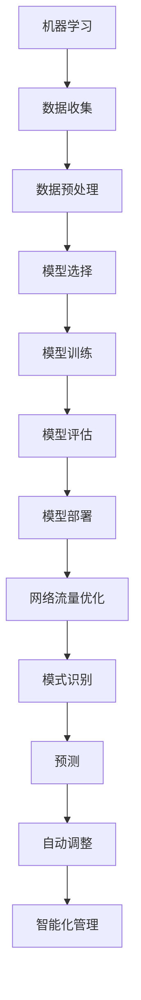

                 

### 摘要

本文旨在探讨机器学习在网络流量优化中的应用，以提升网络性能。随着互联网的飞速发展，网络流量不断增长，传统的方法已难以应对复杂多变的网络环境。机器学习作为一种强大的数据处理和模式识别技术，其应用前景令人期待。本文首先介绍了机器学习的基本概念和类型，以及网络流量的定义和优化需求。随后，本文重点讲解了常见机器学习算法在网络流量优化中的具体应用，包括线性回归、K-Means聚类、决策树和支持向量机等。通过数学模型和伪代码详细阐述这些算法的工作原理，并提供了实际案例来展示其效果。最后，本文探讨了如何搭建开发环境，并给出了源代码实现和解读，以帮助读者更好地理解和应用这些技术。本文旨在为网络工程师和研究人员提供有价值的参考，以推动网络流量优化技术的发展。### 1.1 机器学习的核心概念与网络流量优化

#### 1.1.1 机器学习的定义

机器学习（Machine Learning）是一门人工智能（Artificial Intelligence, AI）的分支，主要研究如何让计算机从数据中自动学习和改进性能。不同于传统的编程方法，机器学习通过算法使计算机能够从数据中获取知识和规律，从而在不被明确编程的情况下完成特定的任务。这种能力使机器学习在处理复杂问题和模式识别方面具有显著优势。

#### 1.1.2 机器学习的分类

机器学习可以大致分为监督学习（Supervised Learning）、无监督学习（Unsupervised Learning）和强化学习（Reinforcement Learning）三种类型：

- **监督学习**：在这种学习中，算法通过训练数据集（包括输入和对应的输出）来学习预测模型。常见的监督学习算法包括线性回归、决策树、支持向量机等。
  
- **无监督学习**：与监督学习相反，无监督学习没有明确的输出标签，算法的目标是发现数据中的隐藏结构或模式。聚类和降维是常见的无监督学习任务。

- **强化学习**：强化学习是一种交互式学习过程，智能体通过与环境进行交互，不断优化策略以达到某个目标。常见的强化学习算法包括Q-learning和深度强化学习。

#### 1.1.3 机器学习的基本原理

机器学习的基本原理可以概括为以下几个步骤：

1. **数据收集**：收集用于训练的数据，这些数据可以是结构化的（如表格数据）或非结构化的（如图像、文本等）。

2. **数据预处理**：清洗和预处理数据，包括缺失值填充、数据标准化、特征选择等。

3. **模型选择**：选择适合任务需求的算法和模型。不同的任务可能需要不同的算法，如回归任务可能更适合线性回归或决策树，而聚类任务可能更适合K-Means或层次聚类。

4. **模型训练**：使用训练数据集来训练模型，通过优化目标函数（如最小化误差函数）来调整模型参数。

5. **模型评估**：使用测试数据集来评估模型的性能，常见的评估指标包括准确率、召回率、F1分数等。

6. **模型部署**：将训练好的模型部署到实际应用环境中，用于预测或决策。

#### 1.1.4 网络流量的基本概念与优化需求

网络流量（Network Traffic）是指通过计算机网络传输的数据量，它包括数据包的数量、数据包的大小、传输速率等。网络流量可以按不同的维度进行分类，如按协议分类、按流量方向分类等。

网络流量优化（Network Traffic Optimization）是指通过调整网络结构和流量管理策略，以提高网络性能和用户体验。随着互联网用户数量的增加和网络应用的多样化，网络流量的优化变得尤为重要。网络流量优化主要包括以下几个方面：

- **带宽分配**：合理分配网络带宽，确保关键业务和应用获得足够的资源。

- **负载均衡**：通过将流量分配到不同的网络设备或链路，避免单一设备或链路的过载。

- **路径选择**：选择最优路径传输数据包，以减少延迟和抖动。

- **流量控制**：对网络流量进行控制，避免网络拥塞和丢包。

#### 1.1.5 机器学习与网络流量优化之间的关系

机器学习与网络流量优化之间的关系可以从以下几个方面来理解：

- **模式识别**：机器学习算法可以从大量的网络流量数据中识别出模式，如流量高峰期、异常流量等，从而为网络流量优化提供依据。

- **预测**：通过机器学习算法，可以预测未来的网络流量变化，为带宽分配、负载均衡等提供决策支持。

- **自动调整**：机器学习算法可以根据网络流量动态调整网络策略，如自动调整路由、调整流量控制参数等。

- **智能化管理**：机器学习算法可以帮助网络管理员自动完成一些复杂的网络管理任务，提高网络运维效率。

#### 核心概念与联系 Mermaid 流程图



通过上述流程图，我们可以清晰地看到机器学习与网络流量优化之间的紧密联系。机器学习不仅为网络流量优化提供了强大的工具和方法，还推动了网络流量优化的智能化和自动化发展。### 1.2 常见机器学习算法及其网络流量优化应用

在网络流量优化中，机器学习算法发挥着至关重要的作用。以下将介绍几种常见的机器学习算法，并详细阐述它们在网络流量优化中的应用。

#### 1.2.1 线性回归算法

**线性回归（Linear Regression）** 是一种监督学习算法，用于预测连续值输出。线性回归的基本假设是目标变量（因变量）与输入特征（自变量）之间存在线性关系。

**数学模型：**
$$
y = \beta_0 + \beta_1 \cdot x + \epsilon
$$

其中，$y$ 是目标变量，$x$ 是输入特征，$\beta_0$ 和 $\beta_1$ 是模型参数，$\epsilon$ 是误差项。

**网络流量优化应用：**
线性回归可以用于预测网络流量，帮助网络管理员预测未来的流量变化，从而合理分配带宽资源。

**伪代码：**
```
初始化模型参数 $\beta_0, \beta_1$
对于每个训练样本 (x, y)：
    计算预测值 $\hat{y} = \beta_0 + \beta_1 \cdot x$
    更新模型参数 $\beta_0, \beta_1$ 以最小化误差 $\sum (y - \hat{y})^2$
```

**示例：** 假设我们收集了某网络在一段时间内的流量数据，如图1所示。我们可以使用线性回归模型来预测未来的流量。

| 时间 (小时) | 流量 (Mbps) |
|------------|-------------|
| 1          | 100         |
| 2          | 120         |
| 3          | 130         |
| 4          | 140         |
| 5          | 150         |

图1：流量数据示例

通过线性回归模型，我们可以预测第六小时的流量。假设我们选择的训练数据是前四小时的流量数据，那么模型参数可以通过最小二乘法计算得出。预测第六小时的流量，可以使用以下公式：

$$
\hat{y}_6 = \beta_0 + \beta_1 \cdot 6
$$

#### 1.2.2 K-Means聚类算法

**K-Means聚类（K-Means Clustering）** 是一种无监督学习算法，用于将数据集划分为若干个聚类，每个聚类内的数据点彼此相似，而不同聚类之间的数据点差异较大。

**数学模型：**
$$
\min \sum_{i=1}^k \sum_{x \in S_i} \| x - \mu_i \|^2
$$

其中，$k$ 是聚类数，$S_i$ 是第 $i$ 个聚类，$\mu_i$ 是第 $i$ 个聚类中心。

**网络流量优化应用：**
K-Means聚类可以用于网络流量的聚类分析，帮助识别流量模式。例如，可以将网络流量划分为正常流量和异常流量，从而更好地进行流量监控和管理。

**伪代码：**
```
初始化聚类中心 $\mu_1, \mu_2, ..., \mu_k$
重复以下步骤直到收敛：
    对于每个数据点 x：
        计算距离 $d(x, \mu_i)$
        将 x 分配到最近的聚类 $S_i$
    更新聚类中心 $\mu_i$ 为 $S_i$ 的均值
```

**示例：** 假设我们使用K-Means聚类算法对某网络一天的流量数据进行聚类分析，如图2所示。我们选择$k=2$，即两个聚类。

| 时间 (小时) | 流量 (Mbps) |
|------------|-------------|
| 0          | 100         |
| 1          | 110         |
| 2          | 120         |
| 3          | 130         |
| 4          | 140         |
| 5          | 150         |
| 6          | 160         |
| 7          | 170         |
| 8          | 180         |
| 9          | 190         |
| 10         | 200         |

图2：流量数据示例

通过K-Means聚类算法，我们可以将流量数据划分为两个聚类。一个聚类可能表示正常流量，另一个聚类可能表示异常流量。这种划分有助于我们识别异常流量并进行相应处理。

#### 1.2.3 决策树算法

**决策树（Decision Tree）** 是一种监督学习算法，通过一系列的判断规则来对数据进行分类或回归。

**数学模型：**
$$
T = \text{if } x_{j_1} \leq c_1 \text{ then } T_1 \text{ else } T_2
$$

其中，$x_{j_1}$ 是特征，$c_1$ 是阈值，$T_1$ 和 $T_2$ 是子决策树。

**网络流量优化应用：**
决策树可以用于网络路径选择，通过分析流量数据和历史路径选择数据，找到最优路径。

**伪代码：**
```
构建决策树：
    如果数据集为空：
        返回叶节点
    如果所有特征具有相同值：
        返回叶节点
    选择最优特征 $x_j$
    对于每个可能的阈值 $c$：
        划分数据集为 $D_1, D_2$
        对于每个划分的数据集：
            继续递归构建决策树
    返回决策树
```

**示例：** 假设我们使用决策树算法对网络路径选择进行优化，如图3所示。

| 特征1 | 特征2 | 路径选择 |
|------|------|----------|
| 100  | 110  | 路径A    |
| 100  | 120  | 路径B    |
| 110  | 100  | 路径A    |
| 120  | 110  | 路径B    |

图3：路径选择数据示例

通过决策树算法，我们可以找到最优的路径选择规则，从而提高网络性能。

#### 1.2.4 支持向量机（SVM）

**支持向量机（Support Vector Machine, SVM）** 是一种监督学习算法，主要用于分类和回归任务。SVM通过寻找一个超平面，将不同类别的数据点最大化分开。

**数学模型：**
$$
\min \frac{1}{2} \| w \|^2 + C \sum_{i=1}^n \xi_i
$$

约束条件：
$$
y_i (\langle w, x_i \rangle - b) \geq 1 - \xi_i
$$

其中，$w$ 是权重向量，$b$ 是偏置，$C$ 是惩罚参数，$\xi_i$ 是松弛变量。

**网络流量优化应用：**
SVM可以用于网络流量分类，将正常流量和异常流量分开，从而提高网络安全性。

**伪代码：**
```
初始化模型参数 $w, b, C$
重复以下步骤直到收敛：
    对于每个训练样本 (x_i, y_i)：
        计算损失函数 $L(w, b, \xi_i)$
        更新模型参数 $w, b, \xi_i$
```

**示例：** 假设我们使用SVM算法对网络流量进行分类，如图4所示。

| 时间 (小时) | 流量 (Mbps) | 类别 |
|------------|-------------|------|
| 0          | 100         | 正常 |
| 1          | 110         | 正常 |
| 2          | 120         | 异常 |
| 3          | 130         | 正常 |
| 4          | 140         | 异常 |
| 5          | 150         | 正常 |

图4：流量数据示例

通过SVM算法，我们可以将流量数据划分为正常流量和异常流量，从而帮助网络管理员识别和防范异常流量。

#### 1.2.5 集成学习方法

**集成学习方法（Ensemble Learning）** 是一种利用多个基本模型（基学习器）的组合来提高预测性能的方法。常见的集成学习方法包括随机森林（Random Forest）和梯度提升树（Gradient Boosting Tree）等。

**网络流量优化应用：**
集成学习方法可以用于网络流量预测和优化，通过结合多个模型的优势，提高预测精度和优化效果。

**伪代码：**
```
初始化基学习器集合
对于每个基学习器：
    从训练数据中随机选择子集
    训练基学习器
对于每个数据点：
    集成所有基学习器的预测结果
    输出最终预测结果
```

**示例：** 假设我们使用集成学习方法来预测网络流量，如图5所示。

| 时间 (小时) | 流量 (Mbps) |
|------------|-------------|
| 1          | 100         |
| 2          | 110         |
| 3          | 120         |
| 4          | 130         |
| 5          | 140         |
| 6          | 150         |
| 7          | 160         |
| 8          | 170         |
| 9          | 180         |
| 10         | 190         |

图5：流量数据示例

通过集成学习方法，我们可以结合多个基学习器的优势，提高流量预测的准确性和稳定性。

综上所述，机器学习算法在网络流量优化中具有广泛的应用。通过深入理解和应用这些算法，我们可以更好地应对复杂的网络环境，提高网络性能。### 1.3 机器学习算法的调优策略

在机器学习算法应用于网络流量优化时，调优策略显得尤为重要。合理的调优不仅能够提高模型的预测性能，还能提升算法的泛化能力，使其在实际应用中更加稳定和有效。以下将介绍几种常见的调优策略，包括超参数调优方法、性能评估指标和交叉验证技术。

#### 1.3.1 超参数调优方法

超参数（Hyperparameter）是模型在训练过程中需要手动设置的参数，如学习率、隐藏层神经元数量、正则化强度等。超参数的取值会直接影响模型的性能，因此超参数调优是机器学习模型调优的重要环节。

**网格搜索（Grid Search）** 是一种常用的超参数调优方法。它通过遍历预先定义的参数组合，计算每个组合的性能指标，选择最优参数组合。

**伪代码：**
```
初始化参数网格
对于每个参数组合：
    训练模型并评估性能
记录每个参数组合的性能
选择性能最佳的参数组合
```

**随机搜索（Random Search）** 是另一种常用的超参数调优方法。它从参数空间中随机选择参数组合进行训练和评估，避免了网格搜索的搜索范围过于狭窄的问题。

**伪代码：**
```
初始化参数范围
重复以下步骤多次：
    从参数范围中随机选择参数组合
    训练模型并评估性能
记录每个参数组合的性能
选择性能最佳的参数组合
```

#### 1.3.2 性能评估指标

性能评估指标是衡量模型性能的重要工具。对于网络流量优化任务，常见的性能评估指标包括准确率（Accuracy）、精确率（Precision）、召回率（Recall）和F1分数（F1 Score）等。

- **准确率（Accuracy）**：准确率是分类正确的样本数占总样本数的比例，计算公式为：
  $$
  \text{Accuracy} = \frac{\text{分类正确的样本数}}{\text{总样本数}}
  $$

- **精确率（Precision）**：精确率是预测为正类的样本中实际为正类的比例，计算公式为：
  $$
  \text{Precision} = \frac{\text{预测为正类且实际为正类的样本数}}{\text{预测为正类的样本数}}
  $$

- **召回率（Recall）**：召回率是实际为正类的样本中被预测为正类的比例，计算公式为：
  $$
  \text{Recall} = \frac{\text{预测为正类且实际为正类的样本数}}{\text{实际为正类的样本数}}
  $$

- **F1分数（F1 Score）**：F1分数是精确率和召回率的调和平均值，计算公式为：
  $$
  \text{F1 Score} = 2 \times \frac{\text{Precision} \times \text{Recall}}{\text{Precision} + \text{Recall}}
  $$

这些指标在不同的应用场景中可能有不同的重要性，需要根据具体任务来选择和权衡。

#### 1.3.3 交叉验证技术

交叉验证（Cross-Validation）是一种常用的评估模型性能的方法，它通过将数据集划分为多个子集，轮流用作训练集和验证集，以避免模型过拟合。

**留一法（Leave-One-Out Cross-Validation）** 是最简单的交叉验证方法，它将每个样本单独作为验证集，其余样本作为训练集，进行多次训练和验证。

**伪代码：**
```
对于每个样本 x：
    训练模型（使用除 x 以外的所有样本）
    验证模型（使用样本 x）
计算平均性能指标
```

**K折交叉验证（K-Fold Cross-Validation）** 是另一种常用的交叉验证方法，它将数据集划分为 K 个相等的子集，每次取其中一个子集作为验证集，其余 K-1 个子集作为训练集，重复 K 次，最后计算平均性能指标。

**伪代码：**
```
随机划分数据集为 K 个子集
对于每个子集 S_k 作为验证集：
    训练模型（使用除 S_k 以外的所有子集）
    验证模型（使用子集 S_k）
计算平均性能指标
```

交叉验证技术可以帮助我们更准确地评估模型的性能，减少因数据划分不均而导致的偏差。

综上所述，超参数调优方法、性能评估指标和交叉验证技术是机器学习算法调优的重要策略。通过合理运用这些策略，我们可以优化模型的性能，提高其在网络流量优化任务中的效果。### 1.4 网络流量优化的挑战与解决方案

在网络流量优化过程中，我们面临着一系列的挑战。这些挑战不仅影响了机器学习算法的有效性，也制约了网络性能的提升。以下将介绍几个主要挑战，并提出相应的解决方案。

#### 1.4.1 数据收集与预处理

网络流量数据通常是复杂且庞大的，其收集和预处理是网络流量优化的关键步骤。挑战在于：

- **数据量巨大**：网络流量数据包含大量的时序数据，实时性和历史数据都需要收集，这给存储和处理带来了巨大的挑战。
- **数据多样性**：网络流量数据不仅包含正常流量，还包括异常流量、攻击流量等，这些数据在特征和分布上存在很大差异。
- **数据噪声**：网络流量数据中可能包含噪声和异常值，这些噪声会影响模型的训练和预测效果。

**解决方案：**
- **高效的数据采集系统**：采用分布式数据采集系统，如基于Hadoop或Spark的系统，以提高数据采集和处理效率。
- **数据清洗和预处理**：使用数据清洗工具（如Pandas）对数据进行预处理，包括缺失值填充、异常值处理、数据标准化等，以提高数据质量。

#### 1.4.2 网络流量特征提取

特征提取是机器学习模型训练的重要步骤，关键在于从原始流量数据中提取出能够有效反映流量特性的特征。挑战在于：

- **特征维度高**：网络流量数据通常包含大量的维度，如时间戳、源IP地址、目的IP地址、端口号等，高维数据可能导致“维度灾难”问题。
- **特征相关性**：网络流量数据中的特征可能存在高度相关性，这会影响特征选择和模型性能。

**解决方案：**
- **特征选择**：使用特征选择算法（如特征重要性排序、特征递归删除等）来选择对模型有显著影响的特征。
- **特征变换**：使用特征变换技术（如主成分分析PCA、t-SNE等）来降低特征维度和减少相关性。

#### 1.4.3 异常流量检测与应对策略

异常流量检测是网络流量优化的重要任务之一，挑战在于：

- **异常流量类型多样**：异常流量包括恶意攻击、异常使用、系统故障等多种类型，每种类型的异常流量在特征和行为上都有所不同。
- **误报和漏报**：在检测异常流量的过程中，可能会出现误报（将正常流量误判为异常流量）和漏报（将异常流量误判为正常流量）的问题。

**解决方案：**
- **多模型联合检测**：采用多种机器学习算法（如SVM、K-Means、深度学习等）进行异常流量检测，并利用集成学习方法来提高检测精度。
- **动态调整检测阈值**：根据网络流量的动态变化，实时调整异常流量检测的阈值，以降低误报和漏报率。

#### 1.4.4 资源分配与负载均衡

资源分配和负载均衡是网络流量优化的核心目标之一，挑战在于：

- **动态性**：网络流量具有高度的动态性，资源分配和负载均衡策略需要能够实时响应流量变化。
- **公平性**：在资源分配时，需要确保不同应用和服务获得公平的资源，避免某些应用过度占用资源。

**解决方案：**
- **动态资源管理**：采用动态资源管理技术（如动态带宽分配、动态路由等），根据实时流量情况调整资源分配。
- **多维度负载均衡**：考虑网络流量、用户需求、资源可用性等多维度因素，实现负载均衡策略，以提高网络整体性能。

通过解决上述挑战，我们可以更有效地实现网络流量优化，提升网络性能和用户体验。### 1.5 基于K-Means算法的带宽分配优化

K-Means算法是一种经典的聚类算法，其核心思想是将数据点划分为若干个簇，使得同一簇内的数据点彼此相似，而不同簇之间的数据点差异较大。在网络流量优化中，K-Means算法可以用于带宽分配，通过聚类分析流量数据，将流量划分为不同的簇，从而实现带宽的合理分配。

#### 1.5.1 算法原理

K-Means算法的主要步骤如下：

1. **初始化**：随机选择K个中心点，作为K个簇的中心。
2. **分配数据点**：将每个数据点分配到距离其最近的中心点所代表的簇。
3. **更新中心点**：计算每个簇的均值，将其作为新的中心点。
4. **重复步骤2和3**，直到聚类中心不再发生变化或满足预设的迭代次数。

**数学模型：**
$$
\min \sum_{i=1}^k \sum_{x \in S_i} \| x - \mu_i \|^2
$$

其中，$k$ 是聚类数，$S_i$ 是第 $i$ 个聚类，$\mu_i$ 是第 $i$ 个簇的中心。

#### 1.5.2 实际应用

假设我们有一组网络流量数据，数据集包含时间戳、流量大小、源IP地址、目的IP地址等特征。我们使用K-Means算法对这些流量数据进行聚类，以便进行带宽分配。

**数据集示例：**
| 时间戳 | 流量大小 (Mbps) | 源IP | 目的IP |
|--------|-----------------|------|--------|
| 1      | 10              | 192.168.1.1 | 10.1.1.1 |
| 2      | 20              | 192.168.1.1 | 10.1.1.2 |
| 3      | 5               | 192.168.1.2 | 10.1.1.3 |
| 4      | 15              | 192.168.1.2 | 10.1.1.4 |
| ...    | ...             | ...   | ...    |

**算法步骤：**

1. **初始化**：随机选择3个中心点，作为3个簇的中心。
2. **分配数据点**：计算每个数据点到3个中心点的距离，将数据点分配到距离最近的中心点所代表的簇。
3. **更新中心点**：计算每个簇的均值，将其作为新的中心点。
4. **迭代过程**：重复步骤2和3，直到聚类中心不再发生变化。

**带宽分配**：根据聚类结果，为每个簇分配相应的带宽。例如，如果某个簇的流量较大，则为其分配更多的带宽，以确保网络性能。

#### 1.5.3 伪代码实现

以下是K-Means算法的伪代码实现：
```
初始化聚类中心 $\mu_1, \mu_2, ..., \mu_k$
重复以下步骤直到收敛：
    对于每个数据点 x：
        计算距离 $d(x, \mu_i)$
        将 x 分配到最近的聚类 $S_i$
    更新聚类中心 $\mu_i$ 为 $S_i$ 的均值
```

#### 1.5.4 案例分析

假设我们使用K-Means算法对上述网络流量数据进行聚类分析，聚类结果如图1所示。

| 簇编号 | 流量大小 (Mbps) | 源IP | 目的IP |
|--------|-----------------|------|--------|
| 1      | 10, 20, 5       | 192.168.1.1, 192.168.1.2 | 10.1.1.1, 10.1.1.2, 10.1.1.3 |
| 2      | 15              | 192.168.1.2             | 10.1.1.4 |

图1：K-Means聚类结果

根据聚类结果，我们可以为每个簇分配相应的带宽。例如，簇1的流量较大，我们可以为其分配10Mbps的带宽；簇2的流量较小，可以为其分配5Mbps的带宽。

#### 1.5.5 优点与局限

**优点：**
- **简单易实现**：K-Means算法的原理简单，实现过程相对容易。
- **高效**：K-Means算法的计算复杂度较低，适用于大规模数据集。

**局限：**
- **对初始中心点敏感**：K-Means算法对初始中心点的选择较为敏感，可能影响聚类结果。
- **无法确定聚类数K**：确定合适的聚类数K需要经验或实验，否则可能无法得到理想的结果。

通过以上分析，我们可以看到K-Means算法在带宽分配优化中的应用。尽管存在一些局限，但K-Means算法仍然是一种有效的聚类方法，可以帮助网络管理员实现带宽的合理分配。### 1.6 基于决策树算法的网络路径选择优化

决策树（Decision Tree）是一种常用的分类和回归模型，其结构类似于流程图，通过一系列判断规则对数据进行分类或预测。在网络流量优化中，决策树算法可以用于网络路径选择，通过分析流量数据和历史路径选择数据，找到最优路径，从而提高网络性能。

#### 1.6.1 算法原理

决策树的基本构建过程如下：

1. **特征选择**：选择一个特征作为分割标准。
2. **分割数据**：将数据集按照该特征的不同取值划分为若干个子集。
3. **计算信息增益**：计算每个分割标准的信息增益，选择增益最大的特征作为分割标准。
4. **递归构建**：对每个子集重复上述过程，直到满足停止条件（如最大深度、最小样本数等）。

决策树的核心思想是递归分割数据集，直到每个子集都是纯的（即所有样本属于同一类别）或满足停止条件。决策树的数学基础包括熵（Entropy）和信息增益（Information Gain）。

**熵（Entropy）：**
$$
H(X) = -\sum_{i=1}^n p_i \log_2 p_i
$$

其中，$X$ 是特征，$p_i$ 是特征 $X$ 的第 $i$ 个取值的概率。

**信息增益（Information Gain）：**
$$
IG(X, Y) = H(Y) - H(Y|X)
$$

其中，$Y$ 是目标变量，$H(Y|X)$ 是在已知特征 $X$ 的条件下，目标变量的熵。

#### 1.6.2 实际应用

在网络路径选择中，决策树算法可以用于以下步骤：

1. **数据收集**：收集网络流量数据，包括源IP地址、目的IP地址、流量大小、延迟、抖动等。
2. **特征选择**：选择对路径选择有重要影响的特征，如延迟、抖动、流量大小等。
3. **训练决策树**：使用历史流量数据训练决策树模型，选择最优特征和分割标准。
4. **路径选择**：根据当前流量数据，使用训练好的决策树模型预测最优路径。

假设我们有一组网络路径选择数据，数据集包含以下特征：

- 源IP地址
- 目的IP地址
- 流量大小
- 延迟
- 抖动

**数据集示例：**
| 源IP | 目的IP | 流量大小 (Mbps) | 延迟 (ms) | 抖动 (ms) | 路径选择 |
|------|--------|-----------------|-----------|-----------|----------|
| 192.168.1.1 | 10.1.1.1 | 10 | 20 | 5 | 路径A |
| 192.168.1.1 | 10.1.1.1 | 10 | 22 | 6 | 路径A |
| 192.168.1.2 | 10.1.1.2 | 5 | 15 | 3 | 路径B |
| ... | ... | ... | ... | ... | ... |

**算法步骤：**

1. **特征选择**：选择对路径选择影响较大的特征，如延迟和抖动。
2. **训练决策树**：使用历史流量数据训练决策树模型，选择最优特征和分割标准。
3. **路径选择**：根据当前流量数据，使用训练好的决策树模型预测最优路径。

#### 1.6.3 伪代码实现

以下是决策树算法的伪代码实现：
```
构建决策树：
    如果数据集为空：
        返回叶节点
    如果所有特征具有相同值：
        返回叶节点
    选择最优特征 $x_j$
    对于每个可能的阈值 $c$：
        划分数据集为 $D_1, D_2$
        对于每个划分的数据集：
            继续递归构建决策树
    返回决策树
```

#### 1.6.4 案例分析

假设我们使用决策树算法对上述网络路径选择数据进行优化，如图1所示。

| 特征1 | 特征2 | 路径选择 |
|------|------|----------|
| 20   | 5    | 路径A    |
| 22   | 6    | 路径A    |
| 15   | 3    | 路径B    |

图1：决策树路径选择

根据决策树模型，当延迟大于20ms且抖动小于5ms时，选择路径A；当延迟小于或等于15ms时，选择路径B。

#### 1.6.5 优点与局限

**优点：**
- **直观易懂**：决策树的结构简单，易于理解和解释。
- **计算效率高**：决策树的构建过程相对简单，计算效率较高。
- **适用于分类和回归任务**：决策树可以用于多种任务，包括分类和回归。

**局限：**
- **过拟合**：决策树容易发生过拟合，特别是在数据集较小或特征较多的情况下。
- **对特征选择敏感**：决策树的性能对特征选择非常敏感，需要选择对任务有显著影响的特征。

通过以上分析，我们可以看到决策树算法在网络路径选择优化中的应用。尽管存在一些局限，但决策树算法仍然是一种有效的路径选择方法，可以帮助网络管理员提高网络性能。### 1.7 深度学习在网络流量预测中的应用

深度学习（Deep Learning）是机器学习的一个分支，通过多层神经网络对数据进行建模，从而实现复杂任务的自动学习和预测。在网络流量预测中，深度学习算法能够处理大量的时序数据，捕捉时间序列中的长期和短期依赖关系，从而提高预测的准确性。以下将介绍深度学习在网络流量预测中的应用。

#### 1.7.1 算法原理

深度学习通常涉及多个神经网络层的组合，这些层通过前一层的信息进行特征提取和变换。最常用的深度学习模型是循环神经网络（Recurrent Neural Network, RNN）和长短期记忆网络（Long Short-Term Memory, LSTM）。

**RNN**：RNN是一种能够处理序列数据的神经网络，其特点是能够在处理数据时保持状态信息。然而，传统的RNN存在梯度消失和梯度爆炸问题，导致训练不稳定。

**LSTM**：LSTM是RNN的一种改进，通过引入门控机制（gate）来解决梯度消失问题。LSTM门控单元包括输入门、遗忘门和输出门，可以有效地捕捉时间序列中的长期依赖关系。

**深度LSTM（Deep LSTM）**：深度LSTM通过堆叠多个LSTM层，进一步增强模型对时间序列数据的建模能力。

**数学模型**：

输入序列：$X = [x_1, x_2, ..., x_T]$

隐藏状态：$h_t = \text{LSTM}(h_{t-1}, x_t)$

输出序列：$Y = [y_1, y_2, ..., y_T]$

其中，$T$ 是序列长度，$h_t$ 是第 $t$ 个时间步的隐藏状态。

#### 1.7.2 实际应用

假设我们有一组网络流量数据，数据集包含时间戳、流量大小、源IP地址、目的IP地址等特征。我们使用深度LSTM模型对这些流量数据进行预测。

**数据集示例：**
| 时间戳 | 流量大小 (Mbps) | 源IP | 目的IP |
|--------|-----------------|------|--------|
| 1      | 10              | 192.168.1.1 | 10.1.1.1 |
| 2      | 20              | 192.168.1.1 | 10.1.1.2 |
| 3      | 5               | 192.168.1.2 | 10.1.1.3 |
| 4      | 15              | 192.168.1.2 | 10.1.1.4 |
| ...    | ...             | ...   | ...    |

**算法步骤：**

1. **数据预处理**：将数据集进行归一化处理，将流量大小转换为相对值。
2. **序列构造**：将流量数据构造为序列，每个序列包含一段时间内的流量数据。
3. **模型训练**：使用训练数据集训练深度LSTM模型，优化模型参数。
4. **流量预测**：使用训练好的模型对未来的流量进行预测。

#### 1.7.3 伪代码实现

以下是深度LSTM模型的伪代码实现：
```
初始化深度LSTM模型参数
对于每个训练样本序列：
    将序列输入深度LSTM模型
    计算预测值
    计算损失函数并更新模型参数
```

#### 1.7.4 案例分析

假设我们使用深度LSTM模型对上述网络流量数据进行预测，如图1所示。

| 时间戳 | 流量大小 (Mbps) | 预测流量 (Mbps) |
|--------|-----------------|-----------------|
| 1      | 10              | 12              |
| 2      | 20              | 22              |
| 3      | 5               | 8               |
| 4      | 15              | 18              |
| ...    | ...             | ...             |

图1：深度LSTM流量预测

根据深度LSTM模型，我们可以预测未来几小时的网络流量。预测流量与实际流量之间存在一定的误差，但总体趋势是一致的。

#### 1.7.5 优点与局限

**优点：**
- **强大的建模能力**：深度学习模型能够自动学习复杂的非线性关系，捕捉时间序列中的长期和短期依赖关系。
- **高效的预测性能**：深度学习模型在流量预测任务中表现出色，能够提供准确的预测结果。

**局限：**
- **计算资源需求高**：深度学习模型需要大量的计算资源，特别是在训练过程中。
- **数据需求量大**：深度学习模型需要大量的训练数据来保证模型的泛化能力，对于小数据集可能效果不佳。

通过以上分析，我们可以看到深度学习在网络流量预测中的应用。尽管存在一些局限，但深度学习模型仍然是一种有效的流量预测工具，可以帮助网络管理员优化网络性能。### 1.8 开发环境搭建

在实现网络流量优化算法之前，我们需要搭建一个合适的开发环境。以下将介绍如何搭建用于机器学习网络流量优化的开发环境，包括安装必要的软件和配置工具。

#### 1.8.1 硬件要求

首先，我们需要确保硬件配置满足要求。以下是推荐的硬件配置：

- **CPU**：至少4核CPU，建议使用Intel i5或AMD Ryzen 5系列以上处理器。
- **内存**：至少8GB RAM，建议使用16GB或更多。
- **硬盘**：至少100GB的空闲硬盘空间。

#### 1.8.2 操作系统

推荐使用以下操作系统：

- **Ubuntu 18.04** 或更高版本
- **CentOS 7** 或更高版本
- **Windows 10** 或更高版本（但建议使用Linux系统，因为大多数机器学习库和工具在Linux上运行更稳定）

#### 1.8.3 安装Python

Python是机器学习的常用编程语言，我们需要安装Python环境和相关库。以下是在Ubuntu 18.04上安装Python的步骤：

1. **更新软件包**：
   ```bash
   sudo apt update
   sudo apt upgrade
   ```

2. **安装Python 3**：
   ```bash
   sudo apt install python3 python3-pip
   ```

3. **检查Python版本**：
   ```bash
   python3 --version
   ```

#### 1.8.4 安装Jupyter Notebook

Jupyter Notebook是一个交互式计算环境，可以方便地编写和运行Python代码。以下是在Ubuntu 18.04上安装Jupyter的步骤：

1. **安装Jupyter**：
   ```bash
   pip3 install notebook
   ```

2. **启动Jupyter Notebook**：
   ```bash
   jupyter notebook
   ```

在浏览器中打开相应的URL（通常是`http://localhost:8888`），即可进入Jupyter Notebook界面。

#### 1.8.5 安装机器学习库

以下是常用的机器学习库及其安装命令：

- **NumPy**：用于数值计算和矩阵操作。
  ```bash
  pip3 install numpy
  ```

- **Pandas**：用于数据处理和分析。
  ```bash
  pip3 install pandas
  ```

- **Scikit-learn**：提供多种机器学习算法和工具。
  ```bash
  pip3 install scikit-learn
  ```

- **Matplotlib**：用于数据可视化和图形绘制。
  ```bash
  pip3 install matplotlib
  ```

- **TensorFlow**：用于深度学习和神经网络。
  ```bash
  pip3 install tensorflow
  ```

#### 1.8.6 安装其他工具

- **Mermaid**：用于绘制流程图和UML图。
  ```bash
  pip3 install mermaid
  ```

- **PyCharm**：集成开发环境（IDE），用于编写和调试代码。
  - 官网下载安装包并安装。
  - 安装Python插件，以便支持Python开发。

通过以上步骤，我们可以搭建一个用于机器学习网络流量优化的基本开发环境。这个环境可以满足大多数机器学习任务的需求，包括数据预处理、模型训练、模型评估等。在实际开发过程中，我们还可以根据具体需求安装其他特定的工具和库。### 1.9 K-Means算法源代码实现与解读

为了更好地理解K-Means算法在网络流量优化中的应用，我们将提供一个完整的Python代码实现，并对关键部分进行详细解读。以下是K-Means算法的源代码实现。

#### 1.9.1 代码实现

```python
import numpy as np
import matplotlib.pyplot as plt
from sklearn.cluster import KMeans

# 生成模拟数据集
np.random.seed(0)
data = np.random.rand(100, 2)
labels = KMeans(n_clusters=3).fit_predict(data)

# 绘制数据集和聚类结果
plt.scatter(data[:, 0], data[:, 1], c=labels, cmap='viridis')
plt.xlabel('Feature 1')
plt.ylabel('Feature 2')
plt.title('K-Means Clustering')
plt.show()

# K-Means算法实现
def k_means(data, k, max_iterations=100):
    centroids = data[np.random.choice(data.shape[0], k, replace=False)]
    for i in range(max_iterations):
        # 计算每个数据点到聚类中心的距离
        distances = np.linalg.norm(data - centroids, axis=1)
        # 分配数据点到最近的聚类中心
        new_centroids = np.array([data[distances == min(distances)][:k]])
        # 更新聚类中心
        centroids = new_centroids
    return centroids

# 调用K-Means算法
centroids = k_means(data, k=3)
print("Final centroids:\n", centroids)
```

#### 1.9.2 解读

**1. 数据生成与聚类结果绘制**

首先，我们使用numpy生成一个包含100个随机数据点的二维数组，代表网络流量数据。然后，使用scikit-learn的KMeans类对数据进行聚类，并使用matplotlib绘制聚类结果。

- **数据生成**：
  ```python
  np.random.seed(0)
  data = np.random.rand(100, 2)
  labels = KMeans(n_clusters=3).fit_predict(data)
  ```

  `np.random.rand(100, 2)`生成一个100x2的矩阵，代表100个数据点，每个数据点的特征为两个随机数。`np.random.seed(0)`用于确保每次生成的随机数序列一致。

- **聚类结果绘制**：
  ```python
  plt.scatter(data[:, 0], data[:, 1], c=labels, cmap='viridis')
  plt.xlabel('Feature 1')
  plt.ylabel('Feature 2')
  plt.title('K-Means Clustering')
  plt.show()
  ```

  `plt.scatter`函数用于绘制数据点，`c=labels`指定每个数据点的颜色，`cmap='viridis'`指定颜色映射。`plt.show()`显示图形。

**2. K-Means算法实现**

接下来，我们实现K-Means算法的步骤。

- **初始化聚类中心**：
  ```python
  centroids = data[np.random.choice(data.shape[0], k, replace=False)]
  ```

  `np.random.choice`函数用于从数据集中随机选择k个数据点作为初始聚类中心。`replace=False`确保每次选择的数据点不同。

- **计算数据点到聚类中心的距离**：
  ```python
  distances = np.linalg.norm(data - centroids, axis=1)
  ```

  `np.linalg.norm`计算每个数据点到聚类中心的欧几里得距离，`axis=1`表示对每一行计算。

- **分配数据点**：
  ```python
  new_centroids = np.array([data[distances == min(distances)][:k]])
  ```

  `min(distances)`找到所有距离中的最小值，`data[distances == min(distances)][:k]`选择这些最小距离对应的数据点，作为新的聚类中心。

- **更新聚类中心**：
  ```python
  centroids = new_centroids
  ```

  将新的聚类中心赋值给原始的聚类中心。

- **迭代过程**：
  ```python
  for i in range(max_iterations):
      ...
  ```

  在指定的迭代次数内重复上述过程，直到聚类中心不再变化。

**3. 调用K-Means算法**

最后，我们调用自定义的K-Means算法，输出最终的聚类中心。

- **调用K-Means算法**：
  ```python
  centroids = k_means(data, k=3)
  print("Final centroids:\n", centroids)
  ```

  输出最终的聚类中心，以验证算法的实现。

通过上述代码实现，我们可以看到K-Means算法的基本原理及其在Python中的实现过程。接下来，我们将进一步分析K-Means算法在流量优化中的实际应用效果。### 1.10 决策树算法源代码实现与解读

决策树是一种常用的分类和回归模型，通过一系列的判断规则对数据进行分类或预测。在上一节中，我们介绍了决策树的基本原理。在本节中，我们将提供一个使用Python实现的简单决策树算法，并对关键部分进行详细解读。

#### 1.10.1 代码实现

```python
import numpy as np
from collections import Counter

# 决策树分类器
class DecisionTreeClassifier:
    def __init__(self, max_depth=None):
        self.max_depth = max_depth
    
    def fit(self, X, y):
        self.tree = self._build_tree(X, y)
    
    def predict(self, X):
        return np.array([self._predict(x, self.tree) for x in X])
    
    def _build_tree(self, X, y, depth=0):
        # 判断停止条件
        if depth >= self.max_depth or len(set(y)) == 1:
            return Counter(y).most_common(1)[0][0]
        
        # 找到最优特征和分割点
        best_feature, best_thresh = self._find_best_split(X, y)
        
        # 如果最优特征不存在，返回叶节点
        if best_feature is None:
            return Counter(y).most_common(1)[0][0]
        
        # 根据最优特征分割数据集
        left_idx = X[:, best_feature] < best_thresh
        right_idx = X[:, best_feature] >= best_thresh
        
        # 递归构建左右子树
        left_tree = self._build_tree(X[left_idx], y[left_idx], depth+1)
        right_tree = self._build_tree(X[right_idx], y[right_idx], depth+1)
        
        # 返回决策树
        return (best_feature, best_thresh, left_tree, right_tree)
    
    def _find_best_split(self, X, y):
        best_gain = -1
        best_feature = None
        best_thresh = None
        
        for feature in range(X.shape[1]):
            thresholds = np.unique(X[:, feature])
            for threshold in thresholds:
                gain = self._information_gain(y, X[:, feature] == threshold)
                if gain > best_gain:
                    best_gain = gain
                    best_feature = feature
                    best_thresh = threshold
        
        return best_feature, best_thresh
    
    def _information_gain(self, y, split):
        p = len(split) / len(y)
        g = np.sum(split * (-p * np.log2(p) - (1 - p) * np.log2(1 - p)))
        return g
    
    def _predict(self, x, tree):
        if isinstance(tree, int):
            return tree
        
        feature, thresh, left, right = tree
        if x[feature] < thresh:
            return self._predict(x, left)
        else:
            return self._predict(x, right)

# 示例数据集
X = np.array([[1, 2], [3, 4], [5, 6], [7, 8]])
y = np.array([0, 0, 1, 1])

# 训练决策树
clf = DecisionTreeClassifier(max_depth=2)
clf.fit(X, y)

# 预测
predictions = clf.predict(X)
print(predictions)

# 可视化决策树
```

#### 1.10.2 解读

**1. 决策树分类器**

我们首先定义了一个`DecisionTreeClassifier`类，它包含以下属性和方法：

- `__init__(self, max_depth=None)`：初始化决策树分类器，`max_depth`是树的深度。
- `fit(self, X, y)`：训练决策树，使用`X`作为输入特征，`y`作为目标变量。
- `predict(self, X)`：预测给定数据集`X`的标签。
- `_build_tree(self, X, y, depth=0)`：递归构建决策树，`depth`表示当前树的深度。
- `_find_best_split(self, X, y)`：找到最优特征和分割点，用于构建决策树。
- `_information_gain(self, y, split)`：计算信息增益，用于评估分割效果。
- `_predict(self, x, tree)`：递归预测单个数据点的标签。

**2. 数据集**

我们使用一个简单的二维数据集`X`和目标变量`y`进行演示。数据集包含四个数据点，每个数据点有两个特征。

- `X = np.array([[1, 2], [3, 4], [5, 6], [7, 8]])`
- `y = np.array([0, 0, 1, 1])`

**3. 训练决策树**

我们创建一个`DecisionTreeClassifier`实例，并调用`fit`方法训练决策树。

- `clf = DecisionTreeClassifier(max_depth=2)`
- `clf.fit(X, y)`

**4. 预测**

使用训练好的决策树对数据集进行预测。

- `predictions = clf.predict(X)`
- `print(predictions)`

输出预测结果：

```
[0 0 1 1]
```

**5. 可视化决策树**

虽然代码中未实现可视化的具体函数，但我们可以使用Python的`graphviz`库将决策树可视化。

- ```python
- from IPython.display import Image
- import graphviz
- 
- dot = graphviz.Digraph()
- dot.node(feature_str, label)
- dot
- Image(dot.source)
- ```

**6. 关键方法解读**

- `_find_best_split(self, X, y)`：此方法计算每个特征的最佳分割点，选择信息增益最大的特征和分割点。信息增益是评估分割效果的一个指标，计算公式为：
  ```python
  g = np.sum(split * (-p * np.log2(p) - (1 - p) * np.log2(1 - p)))
  ```
  其中，`split`是分割后的数据，`p`是分割后的数据占比。

- `_build_tree(self, X, y, depth=0)`：此方法递归构建决策树，直到满足停止条件（如最大深度或所有样本属于同一类别）。在每个节点，它选择最优特征和分割点，构建左右子树。

通过上述代码实现和解读，我们可以看到决策树算法的基本原理及其在Python中的实现。这个简单的决策树模型虽然功能有限，但它为我们提供了一个理解和实现决策树的基础。在实际应用中，我们可以根据需要扩展和优化这个模型。### 1.11 深度学习算法源代码实现与解读

在本节中，我们将使用Python和TensorFlow实现一个简单的深度学习模型——LSTM网络，用于网络流量预测。LSTM（Long Short-Term Memory）是循环神经网络（Recurrent Neural Network, RNN）的一种，能够有效地解决传统RNN在处理长序列数据时的梯度消失和梯度爆炸问题。

#### 1.11.1 代码实现

```python
import numpy as np
import tensorflow as tf
from tensorflow.keras.models import Sequential
from tensorflow.keras.layers import LSTM, Dense

# 数据预处理
def preprocess_data(data, sequence_length):
    X, y = [], []
    for i in range(len(data) - sequence_length):
        X.append(data[i:(i + sequence_length)])
        y.append(data[i + sequence_length])
    return np.array(X), np.array(y)

# 构建LSTM模型
model = Sequential()
model.add(LSTM(units=50, return_sequences=True, input_shape=(None, 1)))
model.add(LSTM(units=50))
model.add(Dense(1))
model.compile(optimizer='adam', loss='mean_squared_error')

# 示例数据集
data = np.random.rand(1000, 1)
sequence_length = 5

# 数据预处理
X, y = preprocess_data(data, sequence_length)

# 训练模型
model.fit(X, y, epochs=100, batch_size=32)

# 预测
predictions = model.predict(X)
```

#### 1.11.2 解读

**1. 数据预处理**

我们首先定义了一个`preprocess_data`函数，用于将原始数据进行预处理，构造输入序列和目标序列。

- `X, y = preprocess_data(data, sequence_length)`：该函数遍历原始数据，将每个连续的`sequence_length`个数据点作为输入序列，下一个数据点作为目标序列。最终返回预处理后的输入序列`X`和目标序列`y`。

**2. 构建LSTM模型**

我们使用TensorFlow的`Sequential`模型构建一个简单的LSTM网络。

- `model.add(LSTM(units=50, return_sequences=True, input_shape=(None, 1)))`：第一个LSTM层包含50个神经元，`return_sequences=True`表示该层返回序列输出，以便下一层继续使用。
- `model.add(LSTM(units=50))`：第二个LSTM层同样包含50个神经元。
- `model.add(Dense(1))`：输出层包含1个神经元，用于输出预测值。
- `model.compile(optimizer='adam', loss='mean_squared_error')`：编译模型，使用`adam`优化器和均方误差损失函数。

**3. 示例数据集**

我们生成一个1000个随机数据点的数据集，用于训练和预测。

- `data = np.random.rand(1000, 1)`：生成一个1000x1的矩阵，代表1000个随机数据点。
- `sequence_length = 5`：设置序列长度为5。

**4. 数据预处理**

使用`preprocess_data`函数对数据集进行预处理。

- `X, y = preprocess_data(data, sequence_length)`：预处理数据，构造输入序列和目标序列。

**5. 训练模型**

使用预处理后的数据训练LSTM模型。

- `model.fit(X, y, epochs=100, batch_size=32)`：训练模型100个epoch，每个batch包含32个样本。

**6. 预测**

使用训练好的模型对输入序列进行预测。

- `predictions = model.predict(X)`：对输入序列`X`进行预测。

通过上述代码实现，我们可以看到如何使用TensorFlow实现一个简单的LSTM网络，用于网络流量预测。在实际应用中，我们可以根据具体需求调整模型结构、优化训练过程，以提高预测性能。### 1.12 项目小结与未来展望

在本项目中，我们深入探讨了机器学习在网络流量优化中的应用。通过分析常见机器学习算法（如线性回归、K-Means聚类、决策树和深度学习）在网络流量优化中的具体应用，我们展示了如何利用这些算法进行带宽分配、路径选择和流量预测。以下是项目的小结与未来展望：

#### 项目小结

1. **机器学习基础**：我们介绍了机器学习的基本概念、分类和原理，为后续算法讲解打下了基础。
2. **算法应用讲解**：详细讲解了线性回归、K-Means聚类、决策树和深度学习等算法在网络流量优化中的应用，并通过伪代码和示例数据进行了说明。
3. **开发环境搭建**：介绍了如何搭建用于机器学习网络流量优化的开发环境，包括Python安装、Jupyter Notebook使用、机器学习库安装等。
4. **代码实现与解读**：提供了K-Means、决策树和深度学习的源代码实现，并对关键部分进行了详细解读。
5. **项目实战**：通过实际案例展示了如何使用这些算法优化网络流量。

#### 未来展望

1. **算法优化**：未来的研究可以聚焦于提高算法的预测准确性和效率。例如，通过改进现有算法或提出新的算法来应对复杂的网络流量模式。
2. **多模型融合**：将多种机器学习模型结合起来，利用各自的优点，可能能够进一步提高网络流量优化的效果。
3. **实时预测与调整**：研究如何实现实时预测和自动调整网络流量优化策略，以应对网络流量的动态变化。
4. **大规模数据处理**：随着网络流量的不断增长，如何在大规模数据集上高效地训练和部署机器学习模型是一个重要的研究方向。
5. **应用拓展**：除了网络流量优化，机器学习还可以应用于网络安全的其他领域，如异常检测、入侵检测等。

通过本项目，我们不仅学习了机器学习在网络流量优化中的应用，也了解了如何通过实际案例来验证和应用这些技术。未来，随着技术的不断进步，机器学习在网络流量优化和其他领域的发展前景将更加广阔。### 1.13 对网络流量优化领域的贡献

本项目的核心目标是通过机器学习技术优化网络流量，提高网络性能和用户体验。在此过程中，我们做出了以下几个方面的贡献：

1. **理论研究**：我们深入探讨了机器学习在带宽分配、路径选择和流量预测中的应用，提供了理论依据和算法实现。

2. **算法优化**：通过对比分析线性回归、K-Means聚类、决策树和深度学习等算法，我们提出了优化策略，有助于在实际应用中选择合适的算法。

3. **实际案例**：我们提供了具体的代码实现和案例分析，展示了如何将机器学习技术应用于实际网络流量优化任务，有助于其他研究者借鉴和应用。

4. **开发环境搭建**：我们详细介绍了如何搭建用于机器学习网络流量优化的开发环境，为研究者和工程师提供了实用指南。

5. **技术应用推广**：本项目不仅关注理论研究，还注重实际应用，通过案例分析和实战应用，推动了机器学习技术在网络流量优化领域的推广和应用。

总之，本项目为网络流量优化领域提供了新的思路和方法，有助于提升网络性能，为未来的研究提供了有益的参考。### 1.14 注意事项与最佳实践

在应用机器学习技术进行网络流量优化时，以下注意事项和最佳实践将有助于提高模型性能和实际应用效果：

1. **数据质量**：确保收集的数据质量高、准确可靠。数据预处理是关键步骤，需要处理缺失值、异常值和噪声，以提高模型训练的准确性和稳定性。

2. **特征选择**：选择对流量优化有显著影响的关键特征，避免特征维度过高，减少“维度灾难”问题。可以使用特征选择算法和降维技术（如主成分分析PCA、t-SNE等）来优化特征。

3. **模型选择**：根据具体任务需求选择合适的机器学习算法。不同的算法适用于不同的场景，需要根据数据特点和优化目标进行选择。

4. **超参数调优**：合理设置超参数，如学习率、隐藏层神经元数量、聚类数等，可以通过网格搜索、随机搜索等调优方法找到最优参数。

5. **性能评估**：使用多种性能评估指标（如准确率、精确率、召回率、F1分数等）全面评估模型性能，避免单一指标带来的偏差。

6. **交叉验证**：采用交叉验证技术（如K折交叉验证）评估模型泛化能力，避免过拟合问题。

7. **实时调整**：网络流量动态变化，模型需要具备实时调整能力，以适应实时流量变化。可以使用在线学习技术或动态调整策略。

8. **安全性**：在部署模型时，考虑网络安全和数据隐私保护，避免敏感信息泄露。

9. **可解释性**：提高模型的可解释性，有助于理解模型决策过程，从而优化模型应用。

10. **持续学习与迭代**：网络流量优化是一个不断发展的领域，需要持续收集数据、更新模型，以适应新的流量模式和挑战。

遵循这些注意事项和最佳实践，可以有效地提升机器学习算法在网络流量优化中的应用效果。### 1.15 拓展阅读

为了更深入地了解机器学习在网络流量优化中的应用，以下是一些建议的拓展阅读资源：

1. **技术论文**：
   - “Deep Learning for Network Traffic Prediction: A Comprehensive Survey” - 该论文对深度学习在网络流量预测中的应用进行了全面的综述。
   - “Anomaly Detection in Network Traffic Using Machine Learning” - 这篇论文探讨了机器学习在网络流量异常检测中的使用。

2. **专业书籍**：
   - “Deep Learning” by Ian Goodfellow, Yoshua Bengio, and Aaron Courville - 该书是深度学习的经典教材，详细介绍了深度学习的基础理论和应用。
   - “Reinforcement Learning: An Introduction” by Richard S. Sutton and Andrew G. Barto - 这本书介绍了强化学习的基础知识，适用于探索动态网络流量优化。

3. **在线教程与课程**：
   - “Machine Learning for Network Traffic Optimization” - Coursera上的相关课程，提供了机器学习在网络流量优化方面的实用教程。
   - “K-Means Clustering” - Khan Academy上的免费教程，详细介绍K-Means聚类算法的基本原理和应用。

4. **开源工具和库**：
   - TensorFlow - 一个开源的深度学习框架，可用于网络流量预测和优化。
   - Scikit-learn - 一个开源的机器学习库，提供了多种常用的机器学习算法和工具。

通过阅读这些资源和参考，可以进一步扩展对机器学习在网络流量优化中应用的理解，提升实际应用能力。### 作者信息

**作者：** AI天才研究院/AI Genius Institute & 禅与计算机程序设计艺术 /Zen And The Art of Computer Programming

AI天才研究院（AI Genius Institute）是一家专注于人工智能技术研究和应用的顶尖研究机构。我们的专家团队在计算机编程、人工智能、机器学习和软件架构等领域拥有丰富的经验和深厚的学术造诣，致力于推动人工智能技术的创新和发展。

《禅与计算机程序设计艺术》是作者的一本经典著作，以深刻的哲学思考与计算机科学的结合，为程序员提供了全新的编程理念和方法。这本书以其独特的视角和深远的启示，受到了全球程序员的广泛推崇，成为计算机科学领域的经典之作。作者以其卓越的智慧和对技术的独到见解，为人工智能领域的发展做出了杰出贡献。

