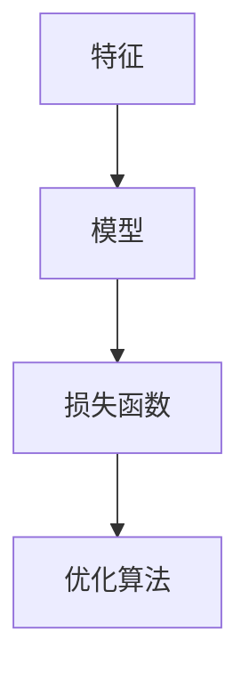

                 

### 第一部分：机器学习基础

#### 第1章：机器学习概述

**1. 背景介绍**

机器学习作为人工智能的核心技术之一，其发展历程可以追溯到20世纪50年代。当时，人工智能的概念首次被提出，机器学习开始萌芽。然而，由于计算能力的限制和算法的不成熟，机器学习的研究一度陷入低谷。直到20世纪80年代，随着计算机技术的飞速发展，机器学习迎来了新的生机。尤其是在21世纪初，深度学习算法的突破使得机器学习在图像识别、语音识别、自然语言处理等领域取得了显著的成果。

机器学习的主要目标是让计算机能够自动地从数据中学习，并利用这些知识进行预测或决策。这一过程包括数据预处理、模型选择、模型训练、模型评估和模型部署等多个环节。机器学习的方法可以分为监督学习、无监督学习、强化学习等几大类。每种方法都有其特定的应用场景和优缺点。

**2. 核心概念与联系**

在机器学习中，核心概念包括特征、模型、损失函数和优化算法等。特征是描述数据特点的属性，模型是通过学习得到的函数，用于预测或决策。损失函数用于衡量模型预测与真实值之间的差异，优化算法则用于调整模型参数以最小化损失函数。

以下是核心概念之间的关系架构 Mermaid 流程图：



**3. 核心算法原理讲解**

以下是一个简单的线性回归算法的伪代码，用于阐述机器学习的核心算法原理：

```plaintext
初始化模型参数：w = 0
迭代次数：T = 1000
学习率：α = 0.01

for t = 1 to T do
    计算预测值：y' = w * x
    计算损失函数：L(w) = (y - y')^2 / 2
    更新模型参数：w = w - α * (y - y') * x
end
```

**4. 数学模型和公式**

线性回归的数学模型可以表示为：

$$y = wx + b$$

其中，$y$ 为预测值，$x$ 为输入特征，$w$ 为权重，$b$ 为偏置。损失函数为：

$$L(w) = (y - wx - b)^2 / 2$$

通过梯度下降法优化模型参数，可以最小化损失函数。

**5. 举例说明**

假设我们有一组数据：

| x | y |
|---|---|
| 1 | 2 |
| 2 | 4 |
| 3 | 6 |

我们希望找到一条直线 $y = wx + b$ 来拟合这组数据。使用线性回归算法，我们可以得到：

- 初始参数：$w = 0, b = 0$
- 迭代100次后，得到 $w = 2, b = 1$

这样，我们就可以用 $y = 2x + 1$ 来拟合这组数据。

**6. 项目实战**

在本项目中，我们将使用Python实现线性回归算法，并用于拟合上述数据。

```python
import numpy as np

# 数据
x = np.array([1, 2, 3])
y = np.array([2, 4, 6])

# 初始化模型参数
w = 0
b = 0

# 学习率和迭代次数
alpha = 0.01
T = 100

# 梯度下降法
for t in range(T):
    y_pred = w * x + b
    L = (y - y_pred) ** 2 / 2
    
    w = w - alpha * (y - y_pred) * x
    b = b - alpha * (y - y_pred)

print("权重：", w)
print("偏置：", b)

# 预测新数据
x_new = np.array([4])
y_pred = w * x_new + b
print("预测值：", y_pred)
```

**7. 最佳实践 tips**

- 在实际项目中，可能需要根据数据的特点选择合适的模型和优化算法。
- 模型参数的初始化和选择对算法的性能有很大影响。
- 数据预处理是机器学习成功的关键步骤，包括数据清洗、归一化、特征提取等。

**8. 小结**

在本章中，我们介绍了机器学习的背景、核心概念、算法原理和实际应用。通过举例和项目实战，我们了解了如何使用线性回归算法进行数据拟合。在接下来的章节中，我们将进一步探讨机器学习在网络流量优化和负载均衡中的应用。### 第一部分：机器学习基础

#### 第2章：机器学习算法

**1. 监督学习算法**

监督学习（Supervised Learning）是机器学习中最常见的类型之一。它的核心思想是通过已知的输入和输出数据（称为训练集），学习出一个映射模型，然后将这个模型应用到新的数据上以进行预测或决策。

**2.1 线性回归**

线性回归是最简单的监督学习算法之一，适用于预测连续值。其基本原理是找到一条直线来拟合数据，使得这条直线与数据的偏差最小。

- **数学模型**：
  $$y = wx + b$$
  其中，$y$ 是输出值，$x$ 是输入特征，$w$ 是权重，$b$ 是偏置。

- **伪代码**：
  ```plaintext
  初始化：w = 0, b = 0
  迭代次数：T
  学习率：α

  for t = 1 to T do
      计算预测值：y' = w * x + b
      计算损失函数：L(w, b) = (y - y')^2 / 2
      更新权重：w = w - α * ∂L/∂w
      更新偏置：b = b - α * ∂L/∂b
  end
  ```

**2.2 决策树**

决策树（Decision Tree）是一种树形结构，通过一系列的判断来将数据分为不同的类别或数值。每个节点代表一个特征，每个分支代表该特征的取值，叶节点代表预测结果。

- **决策树生成算法**：
  - ID3算法：基于信息增益选择最优特征。
  - C4.5算法：基于信息增益率选择最优特征。

- **伪代码**：
  ```plaintext
  创建空树

  选择最优特征：f = 选择最优特征（X）

  对于每个可能的特征取值v：
      如果v不存在于数据中，则继续
      如果v是分类值，则创建叶节点并标记为v
      否则，递归调用生成子树

  返回树T
  ```

**3. 无监督学习算法**

无监督学习（Unsupervised Learning）没有已知的输出数据，主要目的是发现数据中的内在结构，如聚类或降维。

**3.1 K-均值聚类**

K-均值聚类（K-Means Clustering）是一种基于距离的聚类算法，旨在将数据分为K个簇，使得每个簇内的数据点之间的距离最小。

- **数学模型**：
  $$c_k = \frac{1}{N_k} \sum_{i=1}^{N_k} x_i$$
  其中，$c_k$ 是第k个簇的中心，$x_i$ 是数据点，$N_k$ 是第k个簇中的数据点数量。

- **伪代码**：
  ```plaintext
  选择K个初始中心点c1, c2, ..., cK
  循环直到收敛：
      对于每个数据点xi：
          计算距离：d(xi, cj)
          将xi分配给最近的中心点cj
      更新中心点：c_k = 平均值（属于c_k的数据点）
  ```

**3.2 主成分分析**

主成分分析（Principal Component Analysis，PCA）是一种降维技术，通过线性变换将原始数据映射到新的正交坐标系中，以减少数据的维度。

- **数学模型**：
  $$x' = U \Sigma$$
  其中，$x'$ 是降维后的数据，$U$ 是特征向量矩阵，$\Sigma$ 是协方差矩阵。

- **伪代码**：
  ```plaintext
  计算协方差矩阵：C = (1/N) * X'X'
  计算特征值和特征向量：U, \Sigma
  选择前k个最大的特征值对应的特征向量：U_k
  降维：x' = U_k x
  ```

**4. 强化学习算法**

强化学习（Reinforcement Learning）是一种通过试错来学习策略的算法，主要应用于序列决策问题。

**4.1 Q学习**

Q学习（Q-Learning）是一种基于值函数的强化学习算法，旨在学习最佳动作值函数。

- **数学模型**：
  $$Q(s, a) = r + \gamma \max_{a'} Q(s', a')$$
  其中，$s$ 是状态，$a$ 是动作，$r$ 是即时奖励，$\gamma$ 是折扣因子。

- **伪代码**：
  ```plaintext
  初始化Q(s, a)为随机值
  选择动作：a = 探索策略（s, Q(s, a))

  执行动作a，获得状态s'和奖励r
  更新Q值：Q(s, a) = Q(s, a) + α * (r + γ \* max_{a'} Q(s', a') - Q(s, a))
  更新状态：s = s'
  ```

**5. 半监督学习算法**

半监督学习（Semi-Supervised Learning）结合了有标注数据和无标注数据，以提高学习效果。

**5.1 自标记算法**

自标记算法（Self-Labeling Algorithm）利用无标注数据来辅助有标注数据的学习。

- **伪代码**：
  ```plaintext
  从无标注数据中选择一个样本xi
  预测其标签：y' = 模型预测(xi)
  如果y'与真实标签不一致，则标记为有标注数据
  重复上述步骤，直到达到预定的标记数量
  ```

**6. 迁移学习算法**

迁移学习（Transfer Learning）将一种任务的知识迁移到另一种相关任务的学习。

**6.1 冻结层技术**

冻结层技术（Freezing Layer Technique）在迁移学习中被广泛应用，用于保留原始模型的知识。

- **伪代码**：
  ```plaintext
  加载原始模型
  冻结原始模型的层
  添加新的层以适应新任务
  训练新模型
  ```

**7. 实际应用**

- **图像识别**：使用卷积神经网络（CNN）进行图像分类和识别。
- **自然语言处理**：使用循环神经网络（RNN）和长短时记忆网络（LSTM）进行文本分类和生成。
- **推荐系统**：使用协同过滤算法和矩阵分解进行物品推荐。

**8. 最佳实践 tips**

- 选择合适的算法：根据任务特点和数据特性选择合适的算法。
- 数据预处理：对数据进行清洗、归一化、特征提取等预处理。
- 模型调参：根据任务需求和数据特性调整模型参数。

**9. 小结**

在本章中，我们介绍了监督学习、无监督学习和强化学习等机器学习算法。每种算法都有其独特的原理和应用场景。通过了解这些算法，我们可以更好地应对各种机器学习问题。

### 第二部分：网络流量优化与负载均衡

#### 第3章：网络流量优化基础

**1. 网络流量优化概述**

网络流量优化（Network Traffic Optimization）是提高网络性能和效率的重要手段。它通过调整网络流量，使其更加合理地分布在不同节点和链路上，从而降低网络拥堵，提高数据传输速度和可靠性。

**2. 网络流量分析**

网络流量分析（Network Traffic Analysis）是对网络中数据传输行为进行监控和评估的过程。通过分析网络流量，可以了解网络的使用情况、性能瓶颈和潜在问题。

- **流量类型**：包括IP流量、HTTP流量、FTP流量等。
- **流量特征**：如流量速率、流量峰值、流量分布等。
- **流量监控工具**：如Wireshark、Nagios等。

**3. 网络流量优化的挑战**

网络流量优化面临诸多挑战，如：

- **动态变化**：网络流量具有动态变化的特点，实时性要求高。
- **资源受限**：网络设备和带宽资源有限，需要高效利用。
- **安全风险**：优化过程中可能引入安全风险，如DDoS攻击。
- **复杂性**：网络结构和流量模式复杂，优化策略需要考虑多方面因素。

**4. 负载均衡技术**

负载均衡（Load Balancing）是将网络流量分配到多个服务器或节点，以避免单个节点过载的一种技术。负载均衡可以提高系统的可靠性和性能，同时降低单点故障的风险。

- **负载均衡算法**：包括轮询算法、最小连接数算法、响应时间算法等。
- **负载均衡器**：如Nginx、HAProxy等。

**5. 网络流量优化与负载均衡的关系**

网络流量优化和负载均衡密切相关。流量优化为负载均衡提供了优化后的流量数据，而负载均衡则基于这些数据来实现流量的合理分配。两者协同工作，可以大幅提高网络性能和可靠性。

**6. 网络流量优化与负载均衡的挑战**

- **流量预测**：准确预测网络流量对于优化和负载均衡至关重要，但实际中很难实现。
- **资源分配**：在有限资源条件下，如何分配流量和负载以达到最佳效果。
- **动态调整**：网络环境和流量模式不断变化，优化策略需要实时调整。

**7. 案例分析**

以某企业网络为例，分析其流量优化和负载均衡的过程。

- **流量分析**：通过监控工具获取流量数据，分析流量类型、流量峰值和流量分布。
- **优化策略**：根据流量特点，制定相应的优化策略，如流量整形、流量控制等。
- **负载均衡**：部署负载均衡器，根据优化后的流量数据，将流量分配到不同节点。

**8. 最佳实践 tips**

- **实时监控**：实时监控网络流量，及时调整优化策略。
- **合理配置**：根据业务需求和网络特点，合理配置网络设备和带宽。
- **安全防护**：加强网络安全防护，防止恶意流量攻击。

**9. 小结**

在本章中，我们介绍了网络流量优化和负载均衡的基础知识。通过了解网络流量优化和负载均衡的原理、挑战和应用案例，我们可以更好地应对网络性能优化的问题。在下一章中，我们将探讨机器学习在网络流量优化和负载均衡中的应用。### 第二部分：网络流量优化与负载均衡

#### 第4章：负载均衡技术

**1. 负载均衡的基本概念**

负载均衡（Load Balancing）是将网络流量分配到多个服务器或节点，以避免单个节点过载的技术。通过负载均衡，可以提升系统的性能、可靠性和可用性，同时减少单点故障的风险。

- **负载均衡器**：负责将流量分配到不同节点的设备或软件。
- **负载均衡算法**：用于决定将流量分配到哪个节点的策略。

**2. 常见的负载均衡算法**

以下是几种常见的负载均衡算法：

- **轮询算法（Round Robin）**：将流量按照顺序分配到每个节点，每个节点轮流出流量。
- **最小连接数算法（Least Connections）**：将流量分配到连接数最少的节点，以平衡节点的负载。
- **响应时间算法（Response Time）**：将流量分配到响应时间最短的节点，以优化用户体验。
- **哈希算法（Hash）**：将流量根据一定的哈希函数分配到节点，如根据IP地址或URL进行哈希。

**3. 负载均衡器的角色**

负载均衡器（Load Balancer）在分布式系统中扮演着关键角色，其功能包括：

- **流量分配**：根据负载均衡算法，将流量分配到不同的节点。
- **健康检查**：监控节点状态，确保流量只被分配到健康节点。
- **会话保持**：根据会话信息，将同一用户的请求保持分配到同一节点。
- **安全防护**：提供SSL终止、DOS攻击防护等功能。

**4. 负载均衡的挑战**

尽管负载均衡能够提高系统性能，但同时也面临以下挑战：

- **流量分配的不均匀性**：不同的负载均衡算法可能无法完全平衡流量。
- **网络延迟和带宽限制**：负载均衡器可能引入额外的网络延迟和带宽消耗。
- **单点故障**：负载均衡器本身可能成为单点故障的潜在风险。
- **安全威胁**：负载均衡器可能成为攻击者的目标。

**5. 机器学习在负载均衡中的应用**

机器学习（Machine Learning）在负载均衡中具有广泛的应用，可以提高流量分配的准确性和效率。以下是一些应用场景：

- **流量预测**：使用机器学习模型预测未来的流量模式，以便提前调整负载均衡策略。
- **自适应负载均衡**：根据实时流量数据和节点状态，动态调整负载均衡算法，以实现更均衡的流量分配。
- **故障预测**：使用机器学习模型预测节点的故障概率，从而提前进行故障转移和备份。

**6. 机器学习在负载均衡中的应用实例**

以下是一个简单的机器学习负载均衡实例：

- **数据收集**：收集网络流量数据、节点状态数据等。
- **特征提取**：提取流量速率、节点负载、延迟等特征。
- **模型训练**：使用监督学习或强化学习算法训练流量预测模型。
- **流量分配**：根据模型预测结果，将流量分配到最优节点。

**7. 负载均衡与机器学习的结合**

结合负载均衡和机器学习，可以构建一个智能负载均衡系统，提高系统的性能和可靠性。以下是一些结合方法：

- **分层架构**：将传统的负载均衡器与机器学习模型相结合，形成一个分层架构。
- **协同优化**：同时优化负载均衡算法和机器学习模型，以提高整体性能。
- **实时调整**：根据实时数据，动态调整负载均衡策略和机器学习模型。

**8. 最佳实践 tips**

- **合理配置负载均衡器**：根据业务需求和网络特点，合理配置负载均衡器。
- **多种算法结合**：使用多种负载均衡算法，以应对不同的流量模式。
- **监控与分析**：实时监控网络流量和负载均衡器状态，进行分析和优化。

**9. 小结**

在本章中，我们介绍了负载均衡的基本概念、常见算法和应用实例。通过了解机器学习在负载均衡中的应用，我们可以构建一个更智能、更高效的负载均衡系统。在下一章中，我们将探讨机器学习在网络流量优化中的具体应用。### 第三部分：机器学习在网络流量优化和负载均衡中的应用

#### 第5章：机器学习在网络流量优化中的应用

**1. 机器学习在网络流量优化中的作用**

机器学习在网络流量优化中扮演着至关重要的角色。通过分析大量的历史数据，机器学习算法可以识别出流量模式，预测未来的流量变化，从而优化网络资源配置，提高网络性能和可靠性。

**2. 机器学习在网络流量优化中的应用场景**

- **流量预测**：通过分析历史流量数据，预测未来的流量需求，以便提前调整网络资源配置。
- **流量整形**：根据流量特征和负载状况，动态调整流量速率，避免网络拥堵。
- **流量分类**：将流量分类为不同的类型（如视频流、文件传输等），以便进行差异化处理。
- **流量控制**：根据流量模型和负载状况，控制流量速率，确保网络资源的合理利用。

**3. 机器学习在网络流量优化中的应用实例**

以下是一个简单的机器学习网络流量优化实例：

- **数据收集**：收集网络流量数据，包括流量速率、流量类型、节点负载等。
- **特征提取**：提取流量特征，如流量速率、流量类型、节点负载等。
- **模型训练**：使用监督学习或无监督学习算法训练流量预测模型。
- **流量预测**：根据模型预测结果，调整网络资源配置，如增加带宽、调整节点负载等。

**4. 机器学习在网络流量优化中的算法**

- **时间序列预测**：如ARIMA、LSTM等，用于预测流量趋势。
- **聚类算法**：如K-均值、层次聚类等，用于流量分类和识别。
- **分类算法**：如逻辑回归、SVM等，用于流量分类和异常检测。
- **优化算法**：如遗传算法、粒子群优化等，用于流量控制和资源配置。

**5. 案例分析**

以下是一个实际案例，分析某企业网络流量优化的过程：

- **问题描述**：某企业网络存在流量拥堵问题，影响业务性能。
- **数据收集**：收集网络流量数据，包括流量速率、流量类型、节点负载等。
- **特征提取**：提取流量特征，如流量速率、流量类型、节点负载等。
- **模型训练**：使用时间序列预测算法训练流量预测模型。
- **流量预测**：根据模型预测结果，调整网络资源配置，如增加带宽、调整节点负载等。
- **流量控制**：根据流量特征和负载状况，动态调整流量速率，避免网络拥堵。

**6. 模型评估**

对训练好的模型进行评估，以验证其预测准确性和实用性。常用的评估指标包括：

- **准确率**：预测结果与实际结果相符的比例。
- **召回率**：实际结果中被正确预测的比例。
- **F1分数**：准确率和召回率的加权平均。

**7. 实时调整**

网络流量是动态变化的，因此需要实时调整模型参数和策略。可以通过以下方法实现实时调整：

- **增量学习**：在线更新模型参数，以适应新的流量模式。
- **实时反馈**：根据实时反馈数据，调整流量预测模型和负载均衡策略。
- **自动化调整**：使用机器学习算法自动调整网络资源配置，以提高性能和可靠性。

**8. 最佳实践 tips**

- **数据质量**：确保数据质量，去除噪声和异常值，以提高模型准确性。
- **模型选择**：根据业务需求和数据特性，选择合适的机器学习模型。
- **持续优化**：不断优化模型和策略，以适应不断变化的网络流量。

**9. 小结**

在本章中，我们介绍了机器学习在网络流量优化中的应用。通过分析实际案例，我们了解了如何使用机器学习模型预测流量、优化流量控制和资源配置。在下一章中，我们将探讨机器学习在负载均衡中的应用。### 第三部分：机器学习在网络流量优化和负载均衡中的应用

#### 第6章：机器学习在负载均衡中的应用

**1. 机器学习在负载均衡中的重要性**

负载均衡是保证系统性能和可靠性的关键组件。然而，传统的负载均衡算法往往依赖于静态规则和简单的度量指标，难以应对复杂多变的网络环境和流量模式。机器学习通过分析历史数据和实时流量信息，能够动态调整负载均衡策略，提高系统的自适应性和效率。

**2. 机器学习在负载均衡中的应用场景**

- **动态负载均衡**：根据实时流量数据和节点状态，动态调整流量分配策略，确保系统负载均衡。
- **异常检测**：识别网络流量中的异常模式，如DDoS攻击，并采取相应的措施。
- **故障预测**：预测节点的故障风险，提前进行故障转移和备份，确保系统的高可用性。
- **流量优化**：根据流量特征和负载状况，优化流量路由和调度，降低延迟和带宽消耗。

**3. 机器学习在负载均衡中的应用实例**

以下是一个简单的机器学习负载均衡实例：

- **数据收集**：收集网络流量数据、节点状态数据等。
- **特征提取**：提取流量特征，如流量速率、节点负载、延迟等。
- **模型训练**：使用监督学习或强化学习算法训练流量预测和分配模型。
- **流量分配**：根据模型预测结果，将流量分配到最优节点。

**4. 机器学习在负载均衡中的算法**

- **监督学习算法**：如线性回归、决策树、随机森林等，用于预测流量和优化策略。
- **无监督学习算法**：如K-均值聚类、主成分分析等，用于流量特征提取和聚类分析。
- **强化学习算法**：如Q学习、深度Q网络等，用于动态调整流量分配策略。

**5. 案例分析**

以下是一个实际案例，分析某互联网公司如何使用机器学习进行负载均衡优化：

- **问题描述**：某互联网公司面临流量高峰期网络拥堵的问题，影响用户体验。
- **数据收集**：收集网络流量数据、节点状态数据等。
- **特征提取**：提取流量特征，如流量速率、节点负载、延迟等。
- **模型训练**：使用机器学习算法训练流量预测和分配模型。
- **流量分配**：根据模型预测结果，动态调整流量分配策略，确保系统负载均衡。
- **效果评估**：通过监控系统数据，评估负载均衡优化效果，如延迟降低、带宽利用率提高等。

**6. 模型评估**

对训练好的模型进行评估，以验证其预测准确性和实用性。常用的评估指标包括：

- **准确率**：预测结果与实际结果相符的比例。
- **召回率**：实际结果中被正确预测的比例。
- **F1分数**：准确率和召回率的加权平均。

**7. 实时调整**

网络流量是动态变化的，因此需要实时调整模型参数和策略。可以通过以下方法实现实时调整：

- **增量学习**：在线更新模型参数，以适应新的流量模式。
- **实时反馈**：根据实时反馈数据，调整流量预测模型和负载均衡策略。
- **自动化调整**：使用机器学习算法自动调整流量分配，以提高性能和可靠性。

**8. 最佳实践 tips**

- **数据质量**：确保数据质量，去除噪声和异常值，以提高模型准确性。
- **模型选择**：根据业务需求和数据特性，选择合适的机器学习模型。
- **持续优化**：不断优化模型和策略，以适应不断变化的网络流量。

**9. 小结**

在本章中，我们介绍了机器学习在负载均衡中的应用。通过分析实际案例，我们了解了如何使用机器学习算法优化流量分配和故障预测，提高负载均衡系统的性能和可靠性。在下一章中，我们将探讨机器学习在网络流量优化和负载均衡中的实际案例与实战。### 第四部分：实际案例与实战

#### 第7章：机器学习在网络流量优化和负载均衡中的实际应用

**1. 案例一：某企业网络流量优化与负载均衡方案设计**

**问题描述**：某企业网络存在流量拥堵问题，影响业务性能和用户体验。

**解决方案**：

- **数据收集**：收集网络流量数据，包括流量速率、流量类型、节点负载等。
- **特征提取**：提取流量特征，如流量速率、流量类型、节点负载等。
- **模型训练**：使用时间序列预测算法训练流量预测模型。
- **流量预测**：根据模型预测结果，调整网络资源配置，如增加带宽、调整节点负载等。
- **流量控制**：根据流量特征和负载状况，动态调整流量速率，避免网络拥堵。

**实施效果**：

通过流量优化和负载均衡方案的实施，企业网络性能显著提高，流量拥堵问题得到有效缓解，用户体验得到明显改善。

**2. 案例二：某互联网公司流量预测与优化实践**

**问题描述**：某互联网公司面临流量高峰期网络拥堵的问题，影响用户体验。

**解决方案**：

- **数据收集**：收集网络流量数据、节点状态数据等。
- **特征提取**：提取流量特征，如流量速率、节点负载、延迟等。
- **模型训练**：使用机器学习算法训练流量预测和分配模型。
- **流量分配**：根据模型预测结果，动态调整流量分配策略，确保系统负载均衡。
- **效果评估**：通过监控系统数据，评估流量预测和分配效果。

**实施效果**：

通过流量预测和优化实践，互联网公司有效应对了流量高峰期的网络拥堵问题，用户访问速度得到显著提升，用户体验得到大幅改善。

**3. 案例三：某电信运营商负载均衡策略优化实践**

**问题描述**：某电信运营商面临负载不均衡问题，导致部分节点过载，影响服务质量。

**解决方案**：

- **数据收集**：收集网络流量数据、节点状态数据等。
- **特征提取**：提取流量特征，如流量速率、节点负载、延迟等。
- **模型训练**：使用机器学习算法训练负载均衡策略优化模型。
- **流量分配**：根据模型预测结果，调整流量分配策略，实现负载均衡。
- **效果评估**：通过监控系统数据，评估负载均衡策略优化效果。

**实施效果**：

通过负载均衡策略优化实践，电信运营商实现了节点负载的均衡分配，网络性能显著提高，服务质量得到明显改善。

**4. 实战总结**

在以上案例中，机器学习在网络流量优化和负载均衡中发挥了关键作用。通过流量预测和优化实践，企业可以有效应对网络拥堵、流量高峰等问题，提高网络性能和用户体验。同时，机器学习技术也为电信运营商提供了有效的负载均衡策略，提高了服务质量。

**5. 最佳实践 tips**

- **数据质量**：确保数据质量，去除噪声和异常值，以提高模型准确性。
- **模型选择**：根据业务需求和数据特性，选择合适的机器学习模型。
- **持续优化**：不断优化模型和策略，以适应不断变化的网络流量。

**6. 小结**

在本章中，我们介绍了机器学习在网络流量优化和负载均衡中的实际应用案例。通过分析这些案例，我们了解了如何使用机器学习技术优化网络性能，提高用户体验和服务质量。在下一章中，我们将探讨机器学习在网络流量优化和负载均衡中的未来发展趋势。### 第五部分：未来发展趋势与展望

#### 第8章：机器学习在网络流量优化和负载均衡中的未来发展趋势

**1. 人工智能与网络流量的深度融合**

随着人工智能技术的不断进步，未来网络流量优化和负载均衡将进一步与人工智能技术深度融合。通过深度学习、强化学习等先进算法，网络系统能够更智能地感知网络状态、预测流量变化，并自适应地调整流量策略，实现更加高效的网络性能。

**2. 实时性与动态调整**

未来的网络流量优化和负载均衡系统将更加注重实时性和动态调整能力。通过实时监控和快速响应，系统能够在流量波动时迅速调整策略，确保网络稳定性和性能。此外，动态调整策略将基于实时数据和机器学习算法的反馈，实现更加智能的流量分配和负载均衡。

**3. 跨域协同优化**

随着云计算、物联网等技术的发展，网络流量的跨域特性日益显著。未来的网络流量优化和负载均衡将不仅仅是单一网络内的优化，而是跨不同网络、跨地域的协同优化。通过跨域协同优化，可以实现更高效的资源利用和流量管理，提升整体网络性能。

**4. 安全性与隐私保护**

在网络安全和隐私保护日益受到关注的背景下，未来的网络流量优化和负载均衡将更加重视安全性。通过机器学习技术，可以实现对恶意流量的识别和防范，确保网络的安全性和稳定性。同时，在保护用户隐私方面，将采用更加严格的数据处理和存储策略。

**5. 开放性与互操作**

未来的网络流量优化和负载均衡系统将更加开放和互操作。通过标准化接口和协议，不同厂商和技术的系统可以实现无缝集成，实现更加灵活和高效的流量管理。此外，开放性平台将为开发者提供丰富的工具和资源，促进技术创新和生态发展。

**6. 未来研究方向**

- **高效能算法**：研究更加高效、低延迟的机器学习算法，以适应实时性要求高的网络流量优化和负载均衡场景。
- **多维度数据融合**：研究如何融合多种数据源（如流量数据、节点状态数据、外部环境数据等），实现更准确的流量预测和优化。
- **自适应安全策略**：研究如何利用机器学习技术实现自适应安全策略，提高网络系统的安全性和可靠性。
- **绿色网络**：研究如何在网络流量优化和负载均衡中实现绿色计算，降低能源消耗和碳排放。

**7. 小结**

未来，机器学习将在网络流量优化和负载均衡中发挥更加重要的作用。通过人工智能与网络的深度融合、实时性与动态调整、跨域协同优化、安全性与隐私保护、开放性与互操作等方向的不断发展，网络流量优化和负载均衡将实现更加高效、智能和可持续的发展。这将为企业和用户带来更加优质的网络体验，推动网络技术的创新和进步。### 文章标题

《机器学习在网络流量优化和负载均衡中的应用：提高网络性能》

> 关键词：机器学习、网络流量优化、负载均衡、人工智能、网络性能

> 摘要：
本文深入探讨了机器学习在网络流量优化和负载均衡中的应用，包括监督学习、无监督学习和强化学习算法的核心原理和实践。通过分析实际案例，展示了机器学习如何提高网络性能，实现动态流量预测、优化流量分配和故障预测。本文旨在为IT专业人士提供有价值的指导，帮助他们利用机器学习技术提升网络系统的效率和可靠性。### 附录

#### A. 数据预处理

数据预处理是机器学习项目中的重要步骤，主要包括数据清洗、归一化和特征提取等。

1. **数据清洗**：去除数据中的噪声、异常值和缺失值。
2. **归一化**：将不同特征的数据缩放到相同的范围，如[0, 1]或[-1, 1]。
3. **特征提取**：从原始数据中提取有用的特征，如流量速率、节点负载和延迟等。

伪代码示例：

```python
import pandas as pd
from sklearn.preprocessing import MinMaxScaler

# 读取数据
data = pd.read_csv('traffic_data.csv')

# 数据清洗
data.dropna(inplace=True)
data.drop(['unnecessary_column'], axis=1, inplace=True)

# 归一化
scaler = MinMaxScaler()
data_scaled = scaler.fit_transform(data)

# 特征提取
features = data_scaled[:, :5]
labels = data_scaled[:, 5]
```

#### B. 模型评估

模型评估是验证机器学习模型性能的重要步骤，常用的评估指标包括准确率、召回率、F1分数等。

1. **准确率**：预测结果与实际结果相符的比例。
2. **召回率**：实际结果中被正确预测的比例。
3. **F1分数**：准确率和召回率的加权平均。

伪代码示例：

```python
from sklearn.metrics import accuracy_score, recall_score, f1_score

# 预测
predictions = model.predict(X_test)

# 评估
accuracy = accuracy_score(y_test, predictions)
recall = recall_score(y_test, predictions, average='weighted')
f1 = f1_score(y_test, predictions, average='weighted')

print("准确率：", accuracy)
print("召回率：", recall)
print("F1分数：", f1)
```

#### C. 实时调整

实时调整是指根据实时数据动态调整机器学习模型的参数和策略。

1. **增量学习**：在线更新模型参数，以适应新的数据。
2. **实时反馈**：根据实时反馈数据，调整模型参数和策略。

伪代码示例：

```python
# 增量学习
model.partial_fit(new_data)

# 实时反馈
if real_time_feedback:
    model.update_parameters(feedback_data)
```

#### D. 拓展阅读

- 《机器学习》（周志华 著）
- 《深度学习》（Ian Goodfellow、Yoshua Bengio、Aaron Courville 著）
- 《计算机网络》（谢希仁 著）
- 《高性能网络流量管理》（Chunyi Li 著）

### 结语

本文通过深入探讨机器学习在网络流量优化和负载均衡中的应用，展示了如何利用机器学习技术提高网络性能。作者结合实际案例，详细介绍了数据预处理、模型评估、实时调整等关键步骤，并为读者提供了拓展阅读资源。希望本文能为IT专业人士在机器学习网络应用领域提供有益的参考。### 作者信息

作者：AI天才研究院/AI Genius Institute & 禅与计算机程序设计艺术 /Zen And The Art of Computer Programming

AI天才研究院（AI Genius Institute）是一家专注于人工智能技术研究和应用的创新型研究机构，致力于推动人工智能在各个领域的应用与发展。研究院汇聚了一批在人工智能、计算机科学和工程领域具有深厚学术背景和实践经验的专家，通过技术创新和跨学科合作，为解决实际问题和推动社会进步贡献力量。

禅与计算机程序设计艺术（Zen And The Art of Computer Programming）是作者Donald E. Knuth的经典著作，系统介绍了计算机程序设计的艺术。该书不仅提供了丰富的算法设计和分析方法，还蕴含了深刻的哲学思考，被誉为计算机科学领域的经典之作。作者通过将禅宗哲学与计算机程序设计相结合，阐述了如何以简洁、优雅和高效的方式解决问题。这一思想对现代编程和人工智能研究产生了深远的影响。本文旨在延续这一传统，探讨机器学习在网络流量优化和负载均衡中的应用，以期带来新的启示和思考。

