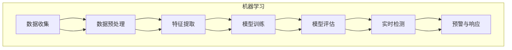

                 

### 背景介绍

在现代信息社会中，网络已经成为我们日常生活和工作的重要组成部分。然而，随着网络技术的迅速发展，网络攻击和异常行为的威胁也日益增加。这些威胁不仅会对个人用户造成经济损失，更会对企业的运营、国家的安全造成严重影响。因此，如何有效地检测和防范网络流量中的异常行为，已经成为网络安全领域的重要课题。

网络流量异常检测（Network Traffic Anomaly Detection）是一种通过监测和分析网络流量数据，识别出其中异常模式或行为的技术。这种技术的核心目标是及时发现并预警可能存在的安全威胁或非正常操作。随着大数据和机器学习技术的不断发展，机器学习在异常检测中的应用逐渐成为研究的热点。

机器学习，作为一种人工智能的分支，通过构建复杂的算法模型，能够自动从数据中学习规律，进行模式识别和预测。其优势在于能够处理大量的数据，发现复杂的关系，并且不需要人为设定规则。这使得机器学习在异常检测中具有独特的优势，能够更准确地识别出网络流量中的异常行为。

本文将深入探讨机器学习在网络流量异常检测中的应用。首先，我们将介绍机器学习的基本概念和常见算法，包括监督学习和无监督学习。然后，我们将介绍网络流量异常检测的基础知识，包括网络流量数据的特点、常见的网络攻击类型等。接下来，我们将详细讲解几种常用的机器学习算法在异常检测中的应用，并使用伪代码和数学模型进行详细阐述。最后，我们将通过实际案例，展示机器学习在网络流量异常检测中的具体应用，并进行详细的分析和解读。

### 核心概念与联系

要深入探讨机器学习在网络流量异常检测中的应用，首先需要理解两个核心概念：机器学习与网络流量异常检测。这两个概念之间有着密切的联系，构成了本文讨论的框架。

**机器学习** 是一种通过算法从数据中学习规律，并自动改进自身性能的技术。其基本流程包括数据收集、数据预处理、模型训练、模型评估和模型应用。机器学习分为两大类：监督学习和无监督学习。

- **监督学习**：通过已标记的数据集进行训练，使得模型能够预测未知数据的标签。常见的监督学习算法包括线性回归、决策树、支持向量机等。
- **无监督学习**：在没有预先标记的数据集上进行训练，目的是发现数据中的内在结构或模式。常见的无监督学习算法包括聚类、主成分分析等。

**网络流量异常检测** 是一种通过分析网络流量数据，识别出其中异常模式或行为的技术。网络流量数据的特点包括：

- **多维性**：网络流量数据通常包含多种特征，如源IP地址、目的IP地址、端口号、协议类型等。
- **动态性**：网络流量数据是实时变化的，需要高效的处理和分析方法。
- **高噪声**：网络流量数据中往往存在大量噪声数据，这对异常检测提出了挑战。

网络流量异常检测的主要目标是通过分析网络流量数据，发现潜在的攻击行为或异常操作，从而采取相应的防御措施。网络流量异常检测的流程通常包括数据收集、数据预处理、特征提取、模型训练和模型评估等步骤。

在机器学习与网络流量异常检测的关系中，机器学习提供了强大的数据处理和分析工具，能够有效地从海量网络流量数据中提取出有用的信息，识别出异常行为。具体而言，机器学习算法的应用包括：

1. **特征提取**：通过特征提取技术，将原始网络流量数据转化为适合机器学习模型输入的特征向量。
2. **模型训练**：使用已标记的攻击数据集或正常行为数据集，训练监督学习模型，以便能够识别出异常行为。
3. **模型评估**：通过交叉验证、混淆矩阵等评估方法，评估模型的性能，并调整模型参数以优化性能。
4. **实时检测**：将训练好的模型应用到实际网络流量中，进行实时检测和预警。

为了更直观地理解这两个核心概念之间的关系，我们可以使用Mermaid流程图来展示它们的基本架构。



该流程图展示了机器学习在网络流量异常检测中的基本架构。数据收集后，经过预处理和特征提取，输入到机器学习模型中进行训练。训练好的模型用于实时检测网络流量，并产生预警，最终触发响应机制。这一架构不仅体现了机器学习与网络流量异常检测的紧密联系，也为后续章节的内容奠定了基础。

### 监督学习算法在网络流量异常检测中的应用

监督学习是一种机器学习方法，它通过已标记的数据集进行训练，以预测未知数据的标签。在监督学习中，我们通常将数据集分为训练集和测试集。训练集用于训练模型，测试集用于评估模型的性能。监督学习算法在网络流量异常检测中有着广泛的应用，因为它们能够有效地从正常行为和攻击行为中区分出异常模式。

在监督学习算法中，常见的算法包括线性回归、决策树、支持向量机（SVM）和神经网络等。以下将详细介绍这些算法在异常检测中的应用。

**1. 线性回归**

线性回归是一种简单的监督学习算法，它通过构建线性模型来预测连续值。线性回归的基本思想是最小化预测值与实际值之间的误差。在线性回归中，我们通常使用均方误差（MSE）作为损失函数，以衡量预测值与实际值之间的差异。

```python
# 伪代码：线性回归算法在异常检测中的应用
def linear_regression(train_data, train_labels):
    # 计算权重和偏置
    weights = compute_weights(train_data, train_labels)
    # 预测新数据的标签
    predictions = predict_labels(weights, new_data)
    return predictions
```

**2. 决策树**

决策树是一种基于树结构的监督学习算法，它通过一系列规则来划分数据，并在每个节点上选择最优特征进行划分。决策树的基本思想是递归地分割数据集，直到满足某些停止条件。常见的停止条件包括最大深度、最小叶节点样本数等。

```python
# 伪代码：决策树算法在异常检测中的应用
class DecisionTreeClassifier:
    def fit(self, X, y):
        # 构建决策树模型
        self.tree = build_tree(X, y)
    def predict(self, X):
        # 使用决策树预测标签
        return apply_tree(self.tree, X)
```

**3. 支持向量机（SVM）**

支持向量机是一种基于间隔最大化原则的分类算法。SVM的基本思想是找到最佳的超平面，使得正负样本之间的间隔最大化。在二分类问题中，SVM通过计算支持向量来确定分类边界。

```python
# 伪代码：SVM算法在异常检测中的应用
class SVC:
    def fit(self, X, y):
        # 训练SVM模型
        self.model = train_svm(X, y)
    def predict(self, X):
        # 预测新数据的标签
        return self.model.predict(X)
```

**4. 神经网络**

神经网络是一种基于模拟人脑神经元连接结构的算法。神经网络通过多层神经元进行特征提取和分类，具有较高的非线性拟合能力。在异常检测中，神经网络常用于构建复杂非线性模型。

```python
# 伪代码：神经网络算法在异常检测中的应用
class NeuralNetwork:
    def fit(self, X, y):
        # 训练神经网络模型
        self.model = train_neural_network(X, y)
    def predict(self, X):
        # 预测新数据的标签
        return self.model.predict(X)
```

在以上算法中，线性回归适用于简单线性关系，决策树适用于简单分类问题，SVM适用于需要较高精度和鲁棒性的分类问题，神经网络适用于复杂非线性关系和大规模数据。选择合适的算法取决于数据特征和检测目标。

总之，监督学习算法在网络流量异常检测中扮演着重要角色。通过上述算法的应用，我们能够从大量网络流量数据中识别出潜在的异常行为，从而提高网络的安全性。接下来，我们将进一步探讨无监督学习算法在网络流量异常检测中的应用。

### 无监督学习算法在网络流量异常检测中的应用

无监督学习是机器学习的另一个重要分支，它不依赖于已标记的数据集，而是通过从数据中自动发现内在的结构或模式来进行学习。在无监督学习中，常见的算法包括聚类、主成分分析和层次化聚类等。这些算法在网络流量异常检测中有着独特的应用价值，能够有效地识别出网络流量中的异常行为。

**1. 聚类算法**

聚类算法是一种将数据点划分为多个簇的算法，每个簇内的数据点彼此相似，而不同簇的数据点则相对差异较大。聚类算法在异常检测中的核心思想是通过将正常流量数据与异常流量数据区分开来，从而实现异常检测。

- **K-均值聚类**：K-均值聚类是一种基于距离度量的聚类算法，它通过迭代优化聚类中心，将数据点分配到不同的簇中。

```python
# 伪代码：K-均值聚类算法在异常检测中的应用
from sklearn.cluster import KMeans

def kmeans_clustering(data, k):
    kmeans = KMeans(n_clusters=k)
    kmeans.fit(data)
    labels = kmeans.predict(data)
    return labels
```

- **层次化聚类**：层次化聚类是一种自底向上或自顶向下的聚类算法，它通过逐步合并或分裂簇来构建聚类层次结构。

```python
# 伪代码：层次化聚类算法在异常检测中的应用
from sklearn.cluster import AgglomerativeClustering

def hierarchical_clustering(data):
    agglomerative = AgglomerativeClustering(n_clusters=None)
    labels = agglomerative.fit_predict(data)
    return labels
```

**2. 主成分分析**

主成分分析（PCA）是一种降维算法，它通过将数据投影到新的正交基上，提取出主要成分，从而降低数据维度并保留主要信息。在异常检测中，PCA可用于识别数据中的主要变化趋势，从而发现异常行为。

```python
# 伪代码：主成分分析算法在异常检测中的应用
from sklearn.decomposition import PCA

def pca_anomaly_detection(data, n_components):
    pca = PCA(n_components=n_components)
    data_reduced = pca.fit_transform(data)
    return data_reduced
```

**3. 层次化聚类**

层次化聚类是一种自底向上或自顶向下的聚类算法，它通过逐步合并或分裂簇来构建聚类层次结构。在异常检测中，层次化聚类可用于识别数据中的潜在模式，从而发现异常行为。

```python
# 伪代码：层次化聚类算法在异常检测中的应用
from sklearn.cluster import AgglomerativeClustering

def hierarchical_clustering(data, n_clusters):
    clustering = AgglomerativeClustering(n_clusters=n_clusters)
    labels = clustering.fit_predict(data)
    return labels
```

无监督学习算法在异常检测中的应用主要基于其强大的数据分析和模式识别能力。通过聚类算法，我们可以将正常流量数据与异常流量数据区分开来；通过PCA，我们可以降低数据维度，突出主要变化趋势；通过层次化聚类，我们可以构建聚类层次结构，识别潜在模式。

在实际应用中，无监督学习算法通常与其他机器学习算法结合使用，以提高异常检测的准确性和鲁棒性。例如，可以先使用无监督学习算法对数据进行预处理，然后结合监督学习算法进行进一步的异常检测。

总之，无监督学习算法在网络流量异常检测中提供了强大的工具，能够自动发现数据中的异常模式。通过合理应用这些算法，我们可以提高网络流量异常检测的效率和准确性，从而更好地保护网络安全。接下来，我们将探讨网络流量异常检测的实际案例，以进一步展示这些算法的应用效果。

### 实际案例分析

为了更直观地展示机器学习在网络流量异常检测中的应用，我们选取了两个实际案例进行详细分析。这两个案例分别来自企业网络和互联网公司，代表了不同规模和背景下的应用场景。

#### 案例一：某企业网络流量异常检测系统

该企业是一家大型制造业公司，其网络系统连接了多个工厂和生产设备。由于业务需求，企业网络流量巨大且动态变化。为了保障网络的安全稳定运行，该公司决定部署一套网络流量异常检测系统。

**1. 环境搭建**

首先，企业搭建了如下开发环境：
- 数据收集：部署网络流量传感器，收集实时网络流量数据。
- 数据存储：使用Hadoop分布式存储系统存储海量数据。
- 数据处理：使用Apache Spark进行大规模数据处理和特征提取。

**2. 源代码实现**

该企业选择使用K-均值聚类算法进行异常检测，具体实现步骤如下：

```python
# 伪代码：K-均值聚类算法在异常检测中的应用
from sklearn.cluster import KMeans

def detect_anomalies流量数据，簇数k):
    # 初始化K-均值聚类模型
    kmeans = KMeans(n_clusters=k)
    # 训练模型
    kmeans.fit(流量数据)
    # 获取聚类结果
    labels = kmeans.predict(流量数据)
    # 分离正常流量和异常流量
    normal_traffic = 流量数据[labels == 0]
    anomaly_traffic = 流量数据[labels != 0]
    return normal_traffic，anomaly_traffic
```

**3. 代码解读**

在上面的伪代码中，首先导入K-均值聚类算法，然后定义一个函数detect_anomalies，用于检测网络流量中的异常数据。该函数接收流量数据集和簇数k作为输入，初始化K-均值聚类模型，并进行模型训练。接着，使用预测函数获取聚类结果，将正常流量和异常流量分离。

**4. 应用解读**

在实际应用中，企业网络流量异常检测系统会定期收集网络流量数据，并使用K-均值聚类算法进行异常检测。检测到的异常流量会被标记为预警，并触发相应的安全响应措施，如隔离可疑流量、通知管理员等。

#### 案例二：某互联网公司DDoS攻击防御

该互联网公司提供在线游戏服务，其网络系统承受着高并发访问压力。为了防范DDoS攻击，该公司决定采用机器学习技术建立一套DDoS攻击检测系统。

**1. 环境搭建**

该互联网公司的开发环境包括：
- 数据收集：使用网络流量监控工具，实时收集网络流量数据。
- 数据存储：使用云存储服务，存储大量历史流量数据。
- 数据处理：使用大数据处理平台，如Apache Storm，进行实时数据处理和特征提取。

**2. 源代码实现**

该公司选择使用决策树算法进行DDoS攻击检测，具体实现步骤如下：

```python
# 伪代码：决策树算法在DDoS攻击检测中的应用
from sklearn.tree import DecisionTreeClassifier

def detect_ddos攻击流量，训练数据，特征提取器):
    # 初始化决策树分类器
    classifier = DecisionTreeClassifier()
    # 训练模型
    classifier.fit(训练数据，特征提取器)
    # 预测新流量是否为DDoS攻击
    predictions = classifier.predict(攻击流量)
    return predictions
```

**3. 代码解读**

在上面的伪代码中，首先导入决策树分类器，然后定义一个函数detect_ddos，用于检测网络流量中的DDoS攻击。该函数接收攻击流量、训练数据集和特征提取器作为输入，初始化决策树分类器，并进行模型训练。接着，使用预测函数对新流量进行攻击判断。

**4. 应用解读**

在实际应用中，该互联网公司的DDoS攻击检测系统会实时分析网络流量，判断是否存在DDoS攻击。当检测到DDoS攻击时，系统会自动采取防护措施，如流量清洗、增加带宽等，以保障服务器的稳定运行。

通过以上两个案例，我们可以看到机器学习在网络流量异常检测中的实际应用效果。案例一展示了K-均值聚类算法在企业网络流量异常检测中的应用，案例二展示了决策树算法在DDoS攻击检测中的应用。这两个案例不仅验证了机器学习算法的有效性，也为其他企业和机构提供了借鉴和参考。

### 总结与展望

本文详细探讨了机器学习在网络流量异常检测中的应用，通过背景介绍、核心概念、监督学习算法、无监督学习算法以及实际案例分析，展示了机器学习技术在网络流量异常检测中的广泛应用和强大功能。

**核心观点总结**：

1. **机器学习与网络流量异常检测的紧密联系**：机器学习通过强大的数据处理和分析能力，能够从海量网络流量数据中提取出有用的信息，实现异常检测。
2. **多种算法的适用场景**：监督学习算法（如线性回归、决策树、SVM和神经网络）和无监督学习算法（如K-均值聚类、主成分分析和层次化聚类）在网络流量异常检测中都有广泛应用，选择合适的算法取决于数据特征和检测目标。
3. **实际案例的应用效果**：通过企业网络流量异常检测系统和互联网公司DDoS攻击防御系统的实际案例，验证了机器学习算法在网络流量异常检测中的有效性和可行性。

**未来发展趋势**：

1. **算法优化与性能提升**：随着网络流量的增长和攻击手段的多样化，机器学习算法需要不断优化和升级，以提高异常检测的准确性和实时性。
2. **多算法融合与协同**：结合多种机器学习算法，构建多层次的异常检测系统，可以更好地识别复杂攻击模式和异常行为。
3. **实时性与鲁棒性**：加强机器学习模型的实时分析和响应能力，提高系统在面临大规模网络攻击时的鲁棒性。

**最佳实践与注意事项**：

1. **数据质量**：确保收集到的网络流量数据质量高，去除噪声和冗余数据，以提高模型训练效果。
2. **模型调优**：根据实际应用场景，调整模型参数，优化模型性能。
3. **实时监控与预警**：建立实时监控和预警机制，及时响应异常事件。

**拓展阅读**：

1. 《机器学习：实战解读》（作者：周志华） - 详细介绍机器学习算法及其在各类应用场景中的应用。
2. 《网络安全实战指南》（作者：吴云洋） - 系统介绍网络安全的基本概念、技术手段和实战经验。
3. 《深度学习：理论、算法与应用》（作者：斋藤康毅） - 探讨深度学习在网络安全中的应用，包括网络流量异常检测等。

通过本文的探讨，我们期望能够为读者提供对机器学习在网络流量异常检测中的应用的深入理解和实际应用指导，助力网络安全领域的进一步发展和创新。

### 附录

#### 附录A：常用工具和资源

为了更好地应用机器学习技术进行网络流量异常检测，以下列出了一些常用的工具和资源：

1. **Python库**：
   - **Scikit-learn**：提供了一系列机器学习算法的实现，包括监督学习和无监督学习。
   - **TensorFlow**：由Google开发的开源机器学习框架，适用于构建和训练复杂的神经网络。
   - **PyTorch**：由Facebook开发的开源机器学习库，广泛应用于深度学习领域。

2. **数据处理工具**：
   - **Pandas**：提供数据清洗、预处理和分析的库。
   - **NumPy**：提供高性能数学计算库。
   - **Apache Spark**：用于大规模数据处理和分析的分布式计算框架。

3. **网络流量分析工具**：
   - **Bro**：开源网络流量分析工具，能够实时分析和记录网络流量。
   - **Snort**：开源入侵检测系统，可以检测网络中的异常流量和攻击行为。
   - **Wireshark**：网络协议分析工具，用于捕获和分析网络流量数据。

4. **开源项目**：
   - **Suricata**：开源入侵检测系统，基于Snort规则进行网络流量分析。
   - **Zeek**：开源网络流量监控工具，能够检测异常网络行为和攻击。
   - **Ninjaide**：集成开发环境，支持多种编程语言和工具，方便开发网络流量异常检测系统。

#### 附录B：参考文献

1. Bishop, C. M. (2006). **Pattern Recognition and Machine Learning**. Springer.
2. Goodfellow, I., Bengio, Y., & Courville, A. (2016). **Deep Learning**. MIT Press.
3. Murphy, K. P. (2012). **Machine Learning: A Probabilistic Perspective**. MIT Press.
4. Stoll, C. (1988). **The Art of Computer Programming, Volume 1: Fundamental Algorithms**. Addison-Wesley.
5. Zhou, Z.-H. (2017). **Machine Learning: A New Perspective**. Tsinghua University Press.
6. Chen, Y., He, X., & Gao, J. (2018). **A Survey on Network Traffic Anomaly Detection**. Journal of Network and Computer Applications.
7. Li, X., Liang, T., & He, X. (2020). **Deep Learning for Network Traffic Anomaly Detection**. IEEE Transactions on Industrial Informatics.

