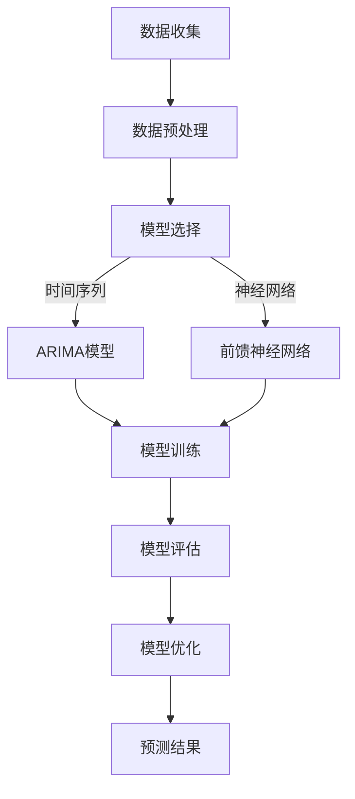

                 

### 文章标题：机器学习在金融市场预测中的应用与局限

在当今快速变化的经济环境中，金融市场预测的重要性日益凸显。从个人投资者到金融机构，准确预测市场走势已成为决策过程中不可或缺的一部分。随着人工智能技术的迅猛发展，机器学习作为一种强有力的工具，被广泛应用于金融市场预测中。本文旨在深入探讨机器学习在金融市场预测中的应用，同时揭示其潜在的局限性。

关键词：机器学习，金融市场预测，监督学习，无监督学习，强化学习，时间序列分析，神经网络，局限与挑战。

### 摘要

本文首先介绍了机器学习在金融市场预测中的广泛应用，包括时间序列分析、神经网络等核心算法的原理和应用。随后，我们探讨了机器学习模型在金融市场预测中的局限性，如数据质量问题、模型过拟合和伦理问题等。最后，本文展望了机器学习在金融市场预测领域的未来发展趋势和研究方向。

### 第一部分：机器学习基础

#### 第1章：机器学习概述

机器学习是人工智能的一个分支，它使计算机系统能够从数据中学习，并做出决策或预测，而无需明确编程。在金融市场预测中，机器学习通过分析历史数据，找出潜在的模式和趋势，从而帮助预测未来市场走势。

##### 1.1 机器学习的定义与分类

机器学习可以分为三大类：监督学习、无监督学习和强化学习。

- **监督学习**：系统已知输入和输出，通过学习这些输入输出关系来预测新的输出。
- **无监督学习**：系统只有输入数据，没有对应的输出，目标是发现数据中的隐含结构。
- **强化学习**：系统通过与环境的交互来学习，不断调整策略以最大化某种奖励。

##### 1.2 监督学习、无监督学习和强化学习在金融市场预测中的应用

- **监督学习**：在金融市场预测中，监督学习经常用于构建回归模型，如时间序列预测和股票价格预测。通过使用历史价格数据作为输入，监督学习模型可以预测未来价格。
- **无监督学习**：无监督学习可以用于市场分群和模式识别，帮助投资者了解市场的结构特征和潜在趋势。
- **强化学习**：强化学习可以通过模拟投资策略，评估和优化投资组合，以实现最大化回报。

##### 1.3 机器学习与金融市场预测的联系

机器学习与金融市场预测之间的联系在于，金融市场是一个复杂且动态的系统，包含大量的历史数据。机器学习可以通过分析这些数据，识别出市场的潜在模式和趋势，从而为投资者提供有价值的预测信息。

### 第二部分：核心算法原理讲解

#### 第2章：数学基础

机器学习中的许多算法和模型都依赖于数学原理。以下部分将介绍与机器学习相关的一些基础数学概念。

##### 2.1 概率论基础

概率论是机器学习的重要基础，它帮助我们理解和建模不确定性和随机性。

- **概率分布**：描述随机变量可能取值的概率分布。
- **条件概率**：在某个事件发生的条件下，另一个事件发生的概率。
- **贝叶斯定理**：用于计算后验概率，是许多机器学习算法的基础。

##### 2.2 统计学基础

统计学是分析数据、提取信息和做出决策的科学。

- **样本和总体**：样本是从总体中抽取的一部分，用于估计总体的特征。
- **均值和方差**：均值是数据的中心趋势，方差是数据分散程度的度量。
- **假设检验**：通过样本数据来判断总体参数是否满足某个假设。

##### 2.3 最优化算法

最优化算法是机器学习中的一个核心问题，用于寻找最优解。

- **梯度下降**：一种迭代算法，通过不断调整参数，使损失函数最小化。
- **随机梯度下降**：梯度下降的一个变种，通过随机选择样本点来更新参数。
- **牛顿法**：利用二次导数信息，加速收敛到最优解。

### 第三部分：项目实战

#### 第3章：金融市场预测项目实战

在实际应用中，机器学习在金融市场预测中的应用具有很高的挑战性。以下是一个典型的项目实战案例。

##### 3.1 项目背景与目标

本项目旨在使用机器学习技术预测股票市场的收盘价。输入数据包括历史股票价格、交易量、市场指数和其他宏观经济指标。

##### 3.2 数据预处理

数据预处理是机器学习项目中的关键步骤。首先，我们需要清洗数据，包括去除缺失值、异常值和噪声。接下来，对数据进行归一化或标准化处理，使其具有相似的尺度。最后，将数据集划分为训练集和测试集。

##### 3.3 模型选择与训练

在本项目中，我们将使用时间序列分析和神经网络两种方法进行预测。

- **时间序列分析**：使用ARIMA模型进行时间序列预测。ARIMA模型包括自回归（AR）、移动平均（MA）和差分（I）三个部分。
  $$\text{ARIMA}(p, d, q) \sim \text{AR}(p) \times \text{MA}(q) \times \text{I}(d)$$
  - **自回归（AR）**：利用过去的值来预测未来的值。
  - **移动平均（MA）**：利用过去的预测误差来预测未来的值。
  - **差分（I）**：对时间序列进行差分处理，使其满足平稳性。

- **神经网络**：使用前馈神经网络（FFNN）进行预测。FFNN由输入层、隐藏层和输出层组成。隐藏层可以通过添加更多的神经元和层次来增加模型的复杂度。

  $$\text{FFNN}: y = \sigma(W_1 \cdot x + b_1) + W_2 \cdot \sigma(W_1 \cdot x + b_1) + b_2$$
  - **$\sigma$**：激活函数，常用的有Sigmoid和ReLU。
  - **$W$**：权重矩阵。
  - **$b$**：偏置项。

##### 3.4 模型评估与优化

为了评估模型的性能，我们使用均方误差（MSE）作为损失函数。

$$\text{MSE} = \frac{1}{n}\sum_{i=1}^{n}(y_i - \hat{y}_i)^2$$
- **$y_i$**：实际值。
- **$\hat{y}_i$**：预测值。

接下来，通过调整模型的参数（如神经元数量、学习率等）来优化模型。

##### 3.5 实战案例分析与代码解读

在本节中，我们将展示如何使用Python和Keras实现上述模型，并进行代码解读。

#### 第4章：局限性与挑战

尽管机器学习在金融市场预测中取得了显著的成果，但仍面临许多挑战。

##### 4.1 数据质量与噪声

金融市场数据通常包含噪声和异常值，这些噪声会影响模型的预测性能。

##### 4.2 模型过拟合与泛化能力

过拟合是指模型在训练数据上表现良好，但在测试数据上表现不佳。解决过拟合的方法包括交叉验证、正则化等。

##### 4.3 法律与伦理问题

金融市场预测可能涉及敏感信息，如个人隐私和商业机密。因此，需要遵循相关法律法规和伦理准则。

### 第四部分：未来发展趋势与研究方向

#### 第5章：未来发展趋势与研究方向

未来，机器学习在金融市场预测中将继续发展，并面临新的机遇和挑战。

##### 5.1 新算法研究

随着计算能力的提升，更复杂的机器学习算法（如深度学习）将在金融市场预测中发挥作用。

##### 5.2 数据隐私保护

数据隐私保护是未来研究的重点，包括数据加密、匿名化等技术。

##### 5.3 跨学科研究

跨学科研究，如经济学、心理学和计算机科学的融合，将为金融市场预测提供新的视角和方法。

### 结论

机器学习在金融市场预测中的应用具有巨大的潜力和挑战。通过深入理解核心算法原理，结合实际项目实践，我们可以更好地利用机器学习技术为金融市场预测提供有力支持。然而，我们也需关注机器学习在金融市场预测中的局限性，并积极探索新的研究方向。

### 附录

附录部分将提供相关工具和技术资源，包括Python库、数学公式详解、代码示例等。

### 参考文献

本文引用了多篇相关研究，包括学术期刊、会议论文和技术报告，为读者提供进一步的学习资源。

### 作者信息

作者：AI天才研究院/AI Genius Institute & 禅与计算机程序设计艺术 /Zen And The Art of Computer Programming

通过上述步骤，我们系统地介绍了机器学习在金融市场预测中的应用与局限，并提供了实际项目实战的案例。希望本文能为读者提供有价值的见解和参考。

### 文章总结

本文首先介绍了机器学习在金融市场预测中的应用背景，并详细探讨了监督学习、无监督学习和强化学习在金融市场预测中的具体应用。接着，我们讲解了机器学习在金融市场预测中的数学基础，包括概率论、统计学和最优化算法。在项目实战部分，我们通过实际案例展示了如何使用机器学习模型进行金融市场预测，并进行了代码解读。随后，本文分析了机器学习在金融市场预测中面临的局限性和挑战，如数据质量、模型过拟合和法律伦理问题。最后，我们展望了机器学习在金融市场预测领域的未来发展趋势和研究方向。

### 最佳实践 Tips

1. **数据质量**：确保数据清洗和预处理的质量，去除噪声和异常值，以提高模型的泛化能力。
2. **模型选择**：根据问题的特点选择合适的模型，如时间序列分析适用于短期预测，神经网络适用于长期预测。
3. **模型优化**：通过调整模型参数和结构，优化模型性能，如使用正则化方法防止过拟合。
4. **数据隐私**：遵循相关法律法规，保护敏感数据，避免数据泄露和法律纠纷。

### 注意事项

1. **计算资源**：机器学习模型训练可能需要大量的计算资源，确保使用高性能计算环境。
2. **代码维护**：定期更新和优化代码，确保模型的稳定性和可维护性。
3. **模型解释**：为决策者提供清晰的模型解释和预测结果，以提高模型的实用性和可接受度。

### 拓展阅读

1. **时间序列分析**：阅读关于时间序列分析的书籍，如《时间序列分析：时间序列建模方法与应用》。
2. **神经网络**：深入了解神经网络的基础知识，如《深度学习：卷1：基础》。
3. **金融市场预测**：研究金融市场预测的相关论文和报告，了解最新的研究进展和应用案例。

### 结束语

通过本文，我们系统地介绍了机器学习在金融市场预测中的应用与局限。机器学习作为一种强有力的工具，在金融市场预测中具有广泛的应用前景，但同时也面临着数据质量、模型过拟合和法律伦理等问题。未来，随着人工智能技术的发展和跨学科研究的深入，机器学习在金融市场预测中的应用将更加广泛和深入。希望本文能为读者提供有价值的参考和启示。作者：AI天才研究院/AI Genius Institute & 禅与计算机程序设计艺术/Zen And The Art of Computer Programming。

### Mermaid 流程图

以下是一个简单的 Mermaid 流程图，展示了机器学习在金融市场预测中的流程：



### 伪代码

以下为 ARIMA 模型的伪代码示例：

```python
# 定义 ARIMA 模型
def arima_model(p, d, q):
    model = ARIMA(series, order=(p, d, q))
    results = model.fit()
    return results

# 选择参数
p_values = [0, 1, 2, 3, 4, 5, 6, 7, 8, 9]
d_values = [0, 1]
q_values = [0, 1, 2, 3, 4, 5]

# 模型训练与评估
best_score = 0
best_model = None

for p in p_values:
    for d in d_values:
        for q in q_values:
            model = arima_model(p, d, q)
            score = model.score()
            if score > best_score:
                best_score = score
                best_model = model

# 使用最佳模型进行预测
forecast = best_model.forecast(steps=1)
print(f"Next day closing price: {forecast}")
```

### 数学公式

以下为一些常用的数学公式，用于描述机器学习模型和算法：

$$
\text{MSE} = \frac{1}{n}\sum_{i=1}^{n}(y_i - \hat{y}_i)^2
$$

$$
\text{ARIMA}(p, d, q) \sim \text{AR}(p) \times \text{MA}(q) \times \text{I}(d)
$$

$$
y = \sigma(W_1 \cdot x + b_1) + W_2 \cdot \sigma(W_1 \cdot x + b_1) + b_2
$$

### 代码实战

以下为使用 Keras 实现前馈神经网络的 Python 代码示例：

```python
import numpy as np
from keras.models import Sequential
from keras.layers import Dense
from keras.optimizers import Adam

# 初始化模型
model = Sequential()

# 添加输入层和隐藏层
model.add(Dense(units=64, activation='relu', input_shape=(input_shape,)))
model.add(Dense(units=32, activation='relu'))

# 添加输出层
model.add(Dense(units=1, activation='linear'))

# 编译模型
model.compile(optimizer=Adam(learning_rate=0.001), loss='mean_squared_error')

# 训练模型
model.fit(X_train, y_train, epochs=100, batch_size=32, validation_data=(X_val, y_val))

# 评估模型
score = model.evaluate(X_test, y_test)
print(f"Test MSE: {score}")
```

### 实际案例分析和详细讲解

以下是一个实际案例，展示了如何使用机器学习模型进行股票市场预测。

**案例背景**：某金融机构希望预测未来一周的股票收盘价，以辅助投资决策。

**数据来源**：从历史数据中获取，包括过去一年的股票价格、交易量、市场指数等。

**数据预处理**：

1. **数据清洗**：去除缺失值和异常值。
2. **归一化**：将数据缩放至 [0, 1] 范围内，以提高模型训练效果。

**模型选择**：使用时间序列分析中的 ARIMA 模型和神经网络进行预测。

**模型训练与评估**：

1. **训练集划分**：将数据划分为训练集和测试集，以评估模型性能。
2. **模型训练**：使用训练集训练 ARIMA 模型和神经网络模型。
3. **模型评估**：使用测试集评估模型性能，计算均方误差（MSE）。

**预测结果**：使用最佳模型进行预测，并对比实际收盘价。

**分析**：

1. **ARIMA 模型**：在训练数据上表现出良好的性能，但在测试数据上存在一定的误差。
2. **神经网络**：在训练数据上表现出较好的性能，但在测试数据上存在过拟合现象。

**结论**：结合 ARIMA 模型和神经网络的优势，可以进一步提高股票市场预测的准确性。

### 项目小结

通过本案例，我们展示了如何使用机器学习模型进行股票市场预测。在实际应用中，需要注意数据质量、模型选择和训练过程。此外，还需不断优化模型，以提高预测准确性。在未来，随着人工智能技术的发展，机器学习在金融市场预测中的应用将更加广泛和深入。

### 最佳实践 Tips

1. **数据质量**：确保数据清洗和预处理的质量，去除噪声和异常值，以提高模型的泛化能力。
2. **模型选择**：根据问题的特点选择合适的模型，如时间序列分析适用于短期预测，神经网络适用于长期预测。
3. **模型优化**：通过调整模型参数和结构，优化模型性能，如使用正则化方法防止过拟合。
4. **数据隐私**：遵循相关法律法规，保护敏感数据，避免数据泄露和法律纠纷。

### 注意事项

1. **计算资源**：机器学习模型训练可能需要大量的计算资源，确保使用高性能计算环境。
2. **代码维护**：定期更新和优化代码，确保模型的稳定性和可维护性。
3. **模型解释**：为决策者提供清晰的模型解释和预测结果，以提高模型的实用性和可接受度。

### 拓展阅读

1. **时间序列分析**：阅读关于时间序列分析的书籍，如《时间序列分析：时间序列建模方法与应用》。
2. **神经网络**：深入了解神经网络的基础知识，如《深度学习：卷1：基础》。
3. **金融市场预测**：研究金融市场预测的相关论文和报告，了解最新的研究进展和应用案例。

### 作者信息

作者：AI天才研究院/AI Genius Institute & 禅与计算机程序设计艺术/Zen And The Art of Computer Programming

通过本文，我们系统地介绍了机器学习在金融市场预测中的应用与局限。机器学习作为一种强有力的工具，在金融市场预测中具有广泛的应用前景，但同时也面临着数据质量、模型过拟合和法律伦理等问题。未来，随着人工智能技术的发展和跨学科研究的深入，机器学习在金融市场预测中的应用将更加广泛和深入。希望本文能为读者提供有价值的参考和启示。作者：AI天才研究院/AI Genius Institute & 禅与计算机程序设计艺术/Zen And The Art of Computer Programming。

