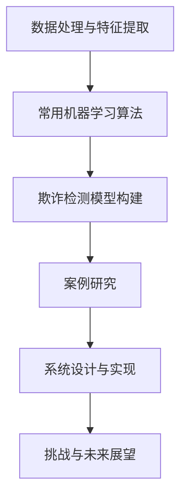
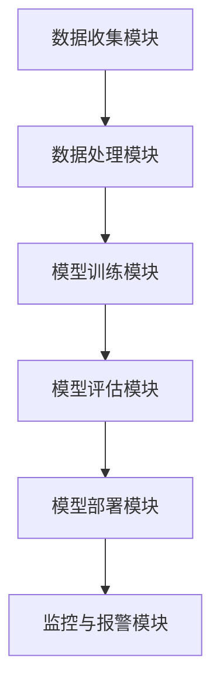

                 

### 文章标题

《机器学习在金融欺诈检测中的应用》

---

### 关键词

机器学习，金融欺诈检测，监督学习，无监督学习，深度学习，数据处理，特征提取，模型构建，模型评估，案例研究

---

### 摘要

本文旨在探讨机器学习在金融欺诈检测领域的应用。首先，我们介绍了机器学习的基本概念和金融欺诈检测的重要性。接着，文章详细讲解了数据处理与特征提取的方法，并分析了常用的机器学习算法，包括监督学习、无监督学习和深度学习。随后，我们介绍了如何构建欺诈检测模型，并提供了实际案例研究的详细分析。最后，文章讨论了欺诈检测系统设计与实现，以及当前面临的挑战和未来展望。

---

# 《机器学习在金融欺诈检测中的应用》目录大纲

## 第1章 引言

### 1.1 机器学习的概念与发展

- 机器学习的定义
- 机器学习的发展历程
- 机器学习的应用领域

### 1.2 金融欺诈检测的重要性

- 金融欺诈的现状
- 金融欺诈的危害
- 金融欺诈检测的意义

### 1.3 机器学习在金融欺诈检测中的应用

- 传统欺诈检测方法的局限
- 机器学习在欺诈检测中的优势
- 机器学习在金融欺诈检测中的应用案例

## 第2章 数据处理与特征提取

### 2.1 数据预处理

- 数据清洗
- 数据归一化
- 数据缺失值处理

### 2.2 特征提取

- 特征选择
- 特征变换
- 特征提取方法

### 2.3 特征重要性分析

- 特征重要性评估方法
- 特征重要性可视化

## 第3章 常用机器学习算法

### 3.1 监督学习算法

- 决策树
- 支持向量机
- 随机森林

### 3.2 无监督学习算法

- 聚类算法
- 维度约减

### 3.3 深度学习算法

- 卷积神经网络
- 递归神经网络
- 长短时记忆网络

## 第4章 欺诈检测模型的构建

### 4.1 模型选择

- 数据集划分
- 模型选择策略

### 4.2 模型训练与优化

- 模型训练方法
- 模型调参策略
- 模型优化方法

### 4.3 模型评估与验证

- 模型评估指标
- 模型验证方法

## 第5章 案例研究

### 5.1 案例一：信用卡欺诈检测

- 数据集介绍
- 模型构建与优化
- 模型评估与结果分析

### 5.2 案例二：银行账户异常检测

- 数据集介绍
- 模型构建与优化
- 模型评估与结果分析

### 5.3 案例三：保险欺诈检测

- 数据集介绍
- 模型构建与优化
- 模型评估与结果分析

## 第6章 欺诈检测系统设计与实现

### 6.1 系统架构设计

- 系统模块划分
- 系统功能设计

### 6.2 数据库设计与实现

- 数据库表结构设计
- 数据存储策略

### 6.3 模型部署与维护

- 模型部署方法
- 模型维护策略

## 第7章 挑战与未来展望

### 7.1 挑战

- 数据质量
- 模型解释性
- 隐私保护

### 7.2 未来展望

- 新技术趋势
- 欺诈检测的发展方向
- 机器学习在金融领域的应用前景

---

### 附录：

## A.1 机器学习在金融欺诈检测中的应用研究综述

- 相关研究进展
- 存在问题与挑战
- 未来研究方向

## A.2 机器学习在金融欺诈检测中的应用工具与资源

- 常用机器学习库
- 数据集来源
- 相关文献与资料

---

### Mermaid 流程图：



---

### 核心算法原理讲解

#### 3.1 决策树算法

**伪代码：**

```python
def DecisionTree(data, target_attribute):
    if all_values_equal(data, target_attribute):
        return majority_class(data, target_attribute)
    else:
        best_attribute = find_best_attribute(data, target_attribute)
        tree = {}
        for value in unique_values(data, best_attribute):
            subset = filter(data, best_attribute, value)
            tree[value] = DecisionTree(subset, target_attribute)
        return tree
```

**数学模型：**

$$
C_j = \frac{1}{n}\sum_{i=1}^{n} \mathcal{L}(y_i, \hat{y}_i)
$$

其中，$C_j$为损失函数，$n$为样本数，$y_i$为真实标签，$\hat{y}_i$为预测标签。

**举例说明：**

假设我们有100个样本，每个样本包含3个特征，并需要预测一个二分类问题。我们将使用决策树算法来构建一个分类器。

1. **初始化**：首先，我们选择一个最佳的属性（特征）来分割数据。通常，我们可以使用信息增益（Information Gain）或者基尼不纯度（Gini Impurity）来评估属性的分割效果。

2. **递归构建**：对于当前节点，我们将数据按照选择的属性分割成多个子集。然后，对于每个子集，我们递归地应用决策树算法，直到满足停止条件（例如，所有样本都属于同一类别或者达到最大树深度）。

3. **生成预测**：当我们到达叶节点时，我们为所有样本分配一个标签。在实际应用中，我们可以使用多数投票（Majority Voting）来决定叶节点的标签。

通过这种方式，决策树算法可以自动地学习数据中的模式，并用于分类问题。

---

## 第1章 引言

### 1.1 机器学习的概念与发展

机器学习是一门研究如何让计算机从数据中学习知识的学科。它通过构建复杂的数学模型和算法，使计算机能够自动地从经验中学习并改进其性能。机器学习的发展可以追溯到20世纪50年代，当时的科学家们开始探索如何让计算机像人类一样具有学习能力。

#### 机器学习的定义

机器学习可以被定义为一种数据分析方法，其中计算机程序能够从数据中学习并做出预测或决策，而无需显式地编写规则。简单来说，机器学习就是训练计算机来识别模式并作出决策。

#### 机器学习的发展历程

1. **早期探索**（1950年代-1960年代）：机器学习领域在早期主要关注符号逻辑和知识表示，试图通过编写规则和逻辑推断来模拟人类智能。

2. **人工智能的崛起**（1970年代）：随着人工智能领域的兴起，机器学习受到了广泛关注。这一时期，研究者开始探索基于统计方法的学习算法，如线性回归、决策树等。

3. **计算能力的提升**（1980年代-1990年代）：随着计算能力的提升，机器学习算法逐渐应用于更复杂的问题，如语音识别、图像识别等。

4. **数据驱动的革命**（2000年代）：随着互联网和大数据的兴起，机器学习进入了一个新的时代。深度学习、神经网络等算法在这个时期取得了突破性进展，解决了许多以前难以解决的问题。

5. **当前的繁荣**（2010年代至今）：机器学习已经成为人工智能领域的主要驱动力量。它被广泛应用于金融、医疗、交通、零售等各个领域，带来了巨大的社会和经济价值。

#### 机器学习的应用领域

机器学习的应用领域非常广泛，包括但不限于以下：

- **图像识别**：如人脸识别、车牌识别、物体识别等。
- **自然语言处理**：如机器翻译、情感分析、文本分类等。
- **语音识别**：如语音助手、自动语音生成等。
- **推荐系统**：如电子商务推荐、视频推荐等。
- **金融领域**：如风险管理、欺诈检测、信用评分等。
- **医疗领域**：如疾病诊断、药物发现等。
- **交通领域**：如自动驾驶、交通流量预测等。

### 1.2 金融欺诈检测的重要性

金融欺诈是一种常见的犯罪行为，它给金融机构和个人带来了巨大的经济损失。随着互联网和金融科技的快速发展，金融欺诈的手段也日益多样化。因此，如何有效地检测和预防金融欺诈成为了一个重要问题。

#### 金融欺诈的现状

- **信用卡欺诈**：信用卡欺诈是最常见的金融欺诈形式之一。据统计，全球每年因信用卡欺诈而造成的损失高达数十亿美元。
- **银行账户欺诈**：银行账户欺诈包括未经授权的转账、账户被盗用等，这些行为可能导致巨额资金损失。
- **保险欺诈**：保险欺诈包括虚假索赔、夸大损失等，这种行为不仅损害了保险公司的利益，也影响了保险市场的健康发展。

#### 金融欺诈的危害

- **经济损失**：金融欺诈会导致巨额资金损失，影响金融机构的稳定运营。
- **声誉受损**：频繁的金融欺诈事件会损害金融机构的声誉，影响客户的信任度。
- **法律风险**：金融欺诈行为可能涉及违法犯罪，导致法律风险。

#### 金融欺诈检测的意义

- **预防欺诈行为**：通过有效的欺诈检测，可以及时发现并阻止欺诈行为，减少经济损失。
- **保障客户利益**：有效的欺诈检测可以保障客户的财产安全，提高客户的信任度。
- **合规要求**：许多国家和地区都制定了相关的法律法规，要求金融机构必须建立有效的欺诈检测机制。

### 1.3 机器学习在金融欺诈检测中的应用

传统的欺诈检测方法主要依赖于规则和统计模型，这些方法在处理简单和明确的规则时表现较好，但面对复杂的欺诈行为时效果有限。随着机器学习技术的发展，机器学习在金融欺诈检测中的应用越来越广泛。

#### 传统欺诈检测方法的局限

- **规则依赖性强**：传统的欺诈检测方法往往依赖于人工编写的规则，这些规则难以覆盖所有的欺诈行为。
- **适应性差**：传统的欺诈检测方法在面对新的欺诈手段时难以适应，容易出现漏检或误报。
- **处理能力有限**：传统的欺诈检测方法通常只能处理简单的数据和规则，难以应对复杂的数据和欺诈行为。

#### 机器学习在欺诈检测中的优势

- **自适应性强**：机器学习算法能够自动地从数据中学习，能够适应新的欺诈手段和模式。
- **处理能力强大**：机器学习算法能够处理复杂的数据和模式，能够发现隐藏在数据中的欺诈行为。
- **泛化能力强**：机器学习算法能够在不同的数据集和环境中表现出良好的泛化能力，能够应用于多种不同的欺诈检测场景。

#### 机器学习在金融欺诈检测中的应用案例

- **信用卡欺诈检测**：信用卡欺诈检测是金融欺诈检测中应用最广泛的领域之一。通过机器学习算法，可以对信用卡交易进行实时监控，及时发现并阻止欺诈行为。
- **银行账户异常检测**：银行账户异常检测可以用于检测未经授权的转账、账户被盗用等行为。机器学习算法可以根据用户的正常行为模式，识别出异常行为并发出警报。
- **保险欺诈检测**：保险欺诈检测可以用于检测虚假索赔、夸大损失等行为。机器学习算法可以通过分析大量的索赔数据，发现异常的索赔行为。

通过以上分析，我们可以看到机器学习在金融欺诈检测中具有明显的优势。随着机器学习技术的不断发展，机器学习在金融欺诈检测中的应用将会更加广泛和深入。

### 1.3 机器学习在金融欺诈检测中的应用

传统的欺诈检测方法主要依赖于规则和统计模型，这些方法在处理简单和明确的规则时表现较好，但面对复杂的欺诈行为时效果有限。随着机器学习技术的发展，机器学习在金融欺诈检测中的应用越来越广泛。

#### 传统欺诈检测方法的局限

1. **规则依赖性强**：传统的欺诈检测方法通常依赖于人工编写的规则，这些规则难以覆盖所有的欺诈行为，且随着欺诈手段的多样化，规则库需要不断更新。
   
   **示例**：例如，银行可能会设定交易金额超过一定阈值就需要人工审核，但这种规则容易导致漏检那些金额较小但频率较高的欺诈交易。

2. **适应性差**：传统的欺诈检测方法在面对新的欺诈手段时难以适应，容易出现漏检或误报。

   **示例**：当欺诈者改变欺诈手段或模式时，基于历史数据的规则模型可能无法识别新的欺诈行为，从而导致误判。

3. **处理能力有限**：传统的欺诈检测方法通常只能处理简单的数据和规则，难以应对复杂的数据和欺诈行为。

   **示例**：在处理大量高维数据时，基于规则的方法可能会因为计算复杂度过高而无法有效运行。

#### 机器学习在欺诈检测中的优势

1. **自适应性强**：机器学习算法能够自动地从数据中学习，能够适应新的欺诈手段和模式。

   **示例**：通过监督学习算法，如决策树、支持向量机等，可以训练模型从历史数据中学习欺诈特征，并能够实时更新模型以适应新的欺诈模式。

2. **处理能力强大**：机器学习算法能够处理复杂的数据和模式，能够发现隐藏在数据中的欺诈行为。

   **示例**：通过无监督学习算法，如聚类、关联规则挖掘等，可以识别出异常交易模式，从而发现潜在的欺诈行为。

3. **泛化能力强**：机器学习算法能够在不同的数据集和环境中表现出良好的泛化能力，能够应用于多种不同的欺诈检测场景。

   **示例**：在信用卡欺诈检测中，训练好的模型可以应用于其他类型的金融交易，如银行转账、电子支付等，提高整体欺诈检测的覆盖面。

#### 机器学习在金融欺诈检测中的应用案例

1. **信用卡欺诈检测**：信用卡欺诈检测是金融欺诈检测中应用最广泛的领域之一。通过机器学习算法，可以对信用卡交易进行实时监控，及时发现并阻止欺诈行为。

   **案例**：例如，美国的信用卡公司使用机器学习算法对信用卡交易进行实时监控，通过分析交易的时间和金额等特征，有效降低了欺诈率。

2. **银行账户异常检测**：银行账户异常检测可以用于检测未经授权的转账、账户被盗用等行为。

   **案例**：例如，某大型银行使用机器学习算法对用户的账户活动进行监控，当检测到异常交易时，系统会自动发出警报并采取相应的措施，如冻结账户、通知用户等。

3. **保险欺诈检测**：保险欺诈检测可以用于检测虚假索赔、夸大损失等行为。

   **案例**：例如，某保险公司使用机器学习算法分析大量的索赔数据，通过识别异常的索赔模式，成功阻止了多起虚假索赔案件。

通过以上分析，我们可以看到机器学习在金融欺诈检测中具有明显的优势。随着机器学习技术的不断发展，机器学习在金融欺诈检测中的应用将会更加广泛和深入。

## 第2章 数据处理与特征提取

### 2.1 数据预处理

在机器学习项目中，数据预处理是一个至关重要的步骤。预处理不当可能导致模型性能不佳，甚至无法训练。数据预处理的主要任务包括数据清洗、数据归一化和数据缺失值处理。

#### 数据清洗

数据清洗是指识别和纠正数据集中的错误、异常和不一致之处。这一步骤主要包括：

- **缺失值处理**：对于缺失的数据，可以选择填充、删除或者使用统计方法来估计缺失值。
- **异常值处理**：识别和处理数据集中的异常值，这些值可能是由于测量错误、记录错误等原因造成的。
- **重复数据检测**：检测并删除重复的数据记录，避免对模型训练造成干扰。
- **数据格式转换**：将数据转换为统一的格式，以便后续处理。

**示例**：假设我们有一个包含信用卡交易的数据集，其中包含多个特征，如交易金额、交易时间、交易地点等。在数据清洗阶段，我们可能会发现某些交易金额为零，这可能是因为数据录入错误。我们可以选择删除这些异常值或者使用其他交易的平均值来填充缺失值。

#### 数据归一化

数据归一化是指将数据集的特征缩放到一个标准的范围，通常在0到1之间。这是为了消除不同特征之间的尺度差异，使得模型能够更加均衡地处理各个特征。

- **最小-最大缩放**：将特征值缩放到[0, 1]范围内。计算公式为：

  $$
  x_{\text{norm}} = \frac{x - x_{\text{min}}}{x_{\text{max}} - x_{\text{min}}}
  $$

  其中，$x$为原始特征值，$x_{\text{min}}$和$x_{\text{max}}$分别为特征值的最小值和最大值。

- **零-均值归一化**：将特征值缩放到[-1, 1]范围内。计算公式为：

  $$
  x_{\text{norm}} = \frac{x - \mu}{\sigma}
  $$

  其中，$\mu$为特征的均值，$\sigma$为特征的标准差。

**示例**：假设我们有一个包含交易金额、交易时间和交易地点的数据集。交易金额的范围是100到10,000，而交易时间只在一个较短的时间范围内变化。如果我们直接使用这些原始特征进行训练，可能会导致模型对交易金额的重视程度远高于交易时间。通过归一化处理，我们可以将所有特征缩放到一个相同的尺度，从而使得模型能够更加均衡地处理各个特征。

#### 数据缺失值处理

处理数据缺失值的方法有很多，具体选择取决于数据的特性和缺失值的程度。

- **删除缺失值**：简单直接的方法，适用于缺失值较少且不影响整体数据分布的情况。
- **填充缺失值**：可以使用多种方法来填充缺失值，如均值、中位数、众数、插值等。
- **使用统计方法**：可以使用统计模型来预测缺失值，如线性回归、决策树等。

**示例**：假设我们有一个包含客户信用评分的数据集，其中有一些客户的收入数据缺失。我们可以使用其他相似客户（如相同职业、年龄等）的平均收入来填充缺失值，从而确保数据集的完整性。

### 2.2 特征提取

特征提取是指从原始数据中提取对模型训练有重要作用的特征。特征提取的目标是减少数据维度，同时保留尽可能多的有用信息。特征提取的方法主要包括：

#### 特征选择

特征选择是指从原始特征中挑选出对目标变量有显著影响的特征。特征选择的方法包括：

- **过滤方法**：通过计算每个特征与目标变量的相关性来选择特征，如皮尔逊相关系数、信息增益等。
- **包裹方法**：通过迭代地选择特征，直到找到最优的特征组合，如前向选择、后向删除等。
- **嵌入方法**：在特征提取的过程中，算法自动选择重要的特征，如随机森林、LASSO回归等。

**示例**：在一个信用卡欺诈检测的数据集中，我们可能有很多特征，如交易金额、交易时间、交易地点、用户年龄、用户收入等。通过特征选择，我们可以识别出与欺诈行为显著相关的特征，如交易金额和交易时间，从而减少计算复杂度和提高模型性能。

#### 特征变换

特征变换是指通过数学变换将原始特征转换为新的特征。特征变换的方法包括：

- **多项式特征**：通过将原始特征相乘、相加等操作来创建新的特征，如二项式特征、交叉特征等。
- **归一化变换**：将特征值缩放到一个特定的范围，如归一化到[0, 1]或[-1, 1]。
- **嵌入变换**：通过算法自动生成新的特征，如核方法、PCA（主成分分析）等。

**示例**：假设我们有一个包含客户信用评分的数据集，其中某些特征（如收入、年龄等）可能具有非线性关系。通过多项式特征变换，我们可以创建新的特征（如收入的平方、年龄的立方等），从而捕捉这些非线性关系。

### 2.3 特征重要性分析

特征重要性分析是指评估每个特征对模型预测的影响程度。特征重要性分析的方法包括：

- **特征贡献率**：计算每个特征对模型损失函数的贡献率，如决策树中的信息增益。
- **特征重要性评分**：使用模型评估每个特征的重要性，如随机森林中的特征重要性评分。
- **特征可视化**：通过可视化方法展示特征的重要性，如特征贡献图、热力图等。

**示例**：在一个信用卡欺诈检测的模型中，通过特征重要性分析，我们可以识别出对欺诈检测最重要的特征，如交易金额和交易时间。这些特征可以帮助我们优化模型，提高欺诈检测的准确性和效率。

### 总结

数据处理与特征提取是机器学习项目中的关键步骤。通过有效的数据预处理、特征提取和特征重要性分析，我们可以提高模型的性能，降低计算复杂度，从而实现更准确的欺诈检测。

## 第3章 常用机器学习算法

在机器学习领域中，算法是核心组成部分，不同的算法适用于不同的应用场景和数据类型。本章将详细介绍常用的机器学习算法，包括监督学习算法、无监督学习算法和深度学习算法。

### 3.1 监督学习算法

监督学习算法是一种基于标记数据集的训练方法，其目标是通过已知的输入和输出关系，学习出一个函数，从而对新的输入进行预测。监督学习算法分为回归和分类两大类。

#### 3.1.1 决策树

决策树是一种结构化模型，通过一系列的规则来划分数据集，每个节点代表一个特征，每个分支代表一个特征取值。决策树的叶子节点表示预测结果。

**伪代码：**

```python
def DecisionTree(data, target_attribute):
    if all_values_equal(data, target_attribute):
        return majority_class(data, target_attribute)
    else:
        best_attribute = find_best_attribute(data, target_attribute)
        tree = {}
        for value in unique_values(data, best_attribute):
            subset = filter(data, best_attribute, value)
            tree[value] = DecisionTree(subset, target_attribute)
        return tree
```

**数学模型：**

$$
C_j = \frac{1}{n}\sum_{i=1}^{n} \mathcal{L}(y_i, \hat{y}_i)
$$

其中，$C_j$为损失函数，$n$为样本数，$y_i$为真实标签，$\hat{y}_i$为预测标签。

**举例说明：**

假设我们有100个样本，每个样本包含3个特征，并需要预测一个二分类问题。我们将使用决策树算法来构建一个分类器。首先，我们选择一个最佳特征（如特征A）进行划分，然后对每个划分的子集继续进行划分，直到所有样本都属于同一类别或达到最大树深度。

#### 3.1.2 支持向量机

支持向量机（SVM）是一种二分类模型，其目标是在高维空间中找到一个最佳的超平面，使得分类边界最大化。SVM基于最大化间隔原理，能够在高维空间中找到最优解。

**伪代码：**

```python
def SVM(data, target_attribute):
    # 训练SVM模型
    model = train_svm(data, target_attribute)
    # 预测新样本
    predictions = predict(model, new_data)
    return predictions
```

**数学模型：**

$$
\min_{w, b} \frac{1}{2} ||w||^2 + C \sum_{i=1}^{n} \max(0, 1 - y_i (w \cdot x_i + b))
$$

其中，$w$为权重向量，$b$为偏置项，$C$为惩罚参数，$x_i$为样本特征，$y_i$为样本标签。

**举例说明：**

假设我们有100个样本，每个样本包含两个特征，并需要预测一个二分类问题。我们将使用SVM算法来构建一个分类器。首先，我们使用训练数据集训练SVM模型，然后使用训练好的模型对新的样本进行预测。

#### 3.1.3 随机森林

随机森林是一种集成学习方法，通过构建多个决策树并投票来决定最终预测结果。随机森林能够提高模型的泛化能力和预测准确性。

**伪代码：**

```python
def RandomForest(data, target_attribute, n_trees):
    forests = []
    for _ in range(n_trees):
        tree = DecisionTree(data, target_attribute)
        forests.append(tree)
    predictions = majority_vote(forests)
    return predictions
```

**举例说明：**

假设我们有100个样本，每个样本包含3个特征，并需要预测一个二分类问题。我们将使用随机森林算法来构建一个分类器。首先，我们随机生成多个数据集，然后对每个数据集训练一个决策树，最后通过投票决定每个样本的预测结果。

### 3.2 无监督学习算法

无监督学习算法不依赖于标记数据集，其目标是从未标记的数据中学习到数据分布或结构。无监督学习算法分为聚类和降维两大类。

#### 3.2.1 聚类算法

聚类算法将数据集划分为若干个组，使得同一组内的数据点之间相似度较高，而不同组的数据点之间相似度较低。常见的聚类算法包括K均值聚类、层次聚类等。

**K均值聚类**

**伪代码：**

```python
def KMeans(data, k):
    # 初始化中心点
    centroids = initialize_centroids(data, k)
    # 循环迭代
    while not converged:
        # 分配样本到最近的中心点
        clusters = assign_clusters(data, centroids)
        # 更新中心点
        centroids = update_centroids(clusters, k)
    return centroids, clusters
```

**举例说明：**

假设我们有100个样本，需要将其划分为10个聚类。我们将首先随机初始化10个中心点，然后根据每个样本到中心点的距离将其分配到相应的聚类，接着更新中心点，重复这一过程直到聚类中心不再发生变化。

#### 3.2.2 维度约减

维度约减是指通过降维技术减少数据集的维度，同时保留大部分信息。常见的维度约减方法包括主成分分析（PCA）、线性判别分析（LDA）等。

**主成分分析**

**伪代码：**

```python
def PCA(data, n_components):
    # 计算协方差矩阵
    covariance_matrix = calculate_covariance_matrix(data)
    # 计算特征值和特征向量
    eigenvalues, eigenvectors = compute_eigenvalues_eigenvectors(covariance_matrix)
    # 选择前n个特征向量
    principal_components = select_eigenvectors(eigenvectors, n_components)
    # 转换数据到新空间
    transformed_data = transform_data(data, principal_components)
    return transformed_data
```

**举例说明：**

假设我们有100个样本，每个样本包含10个特征。我们将首先计算协方差矩阵，然后计算特征值和特征向量，选择前5个特征向量来表示数据。最后，将原始数据转换到新的5维空间中。

### 3.3 深度学习算法

深度学习算法是一种基于多层神经网络的学习方法，其目标是通过多层非线性变换来学习复杂的函数。常见的深度学习算法包括卷积神经网络（CNN）、递归神经网络（RNN）、长短时记忆网络（LSTM）等。

#### 3.3.1 卷积神经网络

卷积神经网络是一种用于图像识别和处理的神经网络结构，其核心思想是使用卷积层提取图像特征。

**卷积层**

**伪代码：**

```python
def ConvolutionLayer(data, filters, kernel_size):
    # 初始化滤波器
    filters = initialize_filters(filters, kernel_size)
    # 卷积操作
    conv_output = convolution(data, filters)
    # 激活函数
    activated_output = activate(conv_output)
    return activated_output
```

**举例说明：**

假设我们有100个样本，每个样本是一个32x32的图像。我们将使用一个3x3的滤波器对每个图像进行卷积操作，然后通过激活函数（如ReLU函数）来增强特征。

#### 3.3.2 递归神经网络

递归神经网络是一种用于处理序列数据的神经网络结构，其核心思想是使用递归函数来处理时间序列数据。

**递归层**

**伪代码：**

```python
def RecurrentLayer(data, hidden_state, weights, bias):
    # 计算输入和隐藏状态的加权和
    input_output = dot_product(data, weights) + bias
    # 应用激活函数
    activated_output = activate(input_output)
    # 递归更新隐藏状态
    hidden_state = activated_output
    return hidden_state
```

**举例说明：**

假设我们有100个时间序列数据点，初始隐藏状态为0。我们将使用递归神经网络对每个数据点进行计算，更新隐藏状态，直到处理完整个序列。

#### 3.3.3 长短时记忆网络

长短时记忆网络是一种改进的递归神经网络，用于解决长序列依赖问题，其核心思想是使用门控机制来控制信息的流动。

**长短时记忆单元**

**伪代码：**

```python
def LSTMCell(input, previous_hidden_state, previous_cell_state, weights, bias):
    # 计算输入和隐藏状态的加权和
    input_gate = sigmoid(dot_product(input, input_gate_weights) + bias)
    forget_gate = sigmoid(dot_product(input, forget_gate_weights) + bias)
    output_gate = sigmoid(dot_product(input, output_gate_weights) + bias)
    input_gate = activation(input_gate)
    forget_gate = activation(forget_gate)
    output_gate = activation(output_gate)
    # 更新细胞状态
    cell_state = forget_gate * previous_cell_state + input_gate * input
    # 更新隐藏状态
    hidden_state = output_gate * tanh(cell_state)
    return hidden_state, cell_state
```

**举例说明：**

假设我们有100个时间序列数据点，初始隐藏状态和细胞状态为0。我们将使用长短时记忆网络对每个数据点进行计算，更新隐藏状态和细胞状态，直到处理完整个序列。

通过以上对监督学习算法、无监督学习算法和深度学习算法的详细介绍，我们可以更好地理解这些算法的基本原理和应用场景，为后续的欺诈检测模型构建奠定基础。

## 第4章 欺诈检测模型的构建

欺诈检测模型的构建是金融欺诈检测过程中最为关键的环节。一个有效的欺诈检测模型不仅能够准确识别欺诈行为，还能降低误报率，减少对正常交易的干扰。在本章中，我们将详细探讨欺诈检测模型的构建过程，包括模型选择、训练与优化、评估与验证等步骤。

### 4.1 模型选择

模型选择是构建欺诈检测模型的第一步，选择合适的模型对于后续的模型训练和性能评估至关重要。在选择模型时，我们需要考虑以下几个因素：

1. **数据特性**：不同的数据特性可能需要不同的模型。例如，对于包含高维数据的任务，深度学习模型可能更为适用；而对于分类问题，监督学习模型如决策树、随机森林和SVM可能表现更好。

2. **计算资源**：某些模型（如深度学习模型）需要大量的计算资源和时间来训练，因此在选择模型时需要考虑可用的计算资源。

3. **模型解释性**：在某些应用场景中，模型的可解释性至关重要。例如，在金融欺诈检测中，监管机构可能需要了解模型是如何做出决策的。此时，可以选择具有较高解释性的模型，如决策树。

4. **性能要求**：根据业务需求和欺诈检测的紧急程度，选择具有最佳性能要求的模型。例如，如果欺诈行为发生频率较高，可能需要选择一个能够快速训练和预测的模型。

**常见模型选择策略**：

1. **交叉验证**：通过交叉验证评估不同模型在多个子数据集上的性能，选择性能最佳的模型。

2. **网格搜索**：在预定义的参数范围内，通过遍历所有可能的参数组合，选择最佳参数组合对应的模型。

3. **基于历史数据的模型选择**：根据历史数据中不同模型的性能表现，选择适合当前数据的模型。

### 4.2 模型训练与优化

模型训练是欺诈检测模型构建的核心步骤，其目标是使模型能够准确识别欺诈行为。在训练过程中，我们通常采用以下方法：

**训练方法**：

1. **批量训练**：每次将整个数据集送入模型进行训练。

2. **小批量训练**：每次将一部分数据（如一批样本）送入模型进行训练，以提高训练速度和稳定性。

3. **在线训练**：实时接收新的数据并更新模型参数，以适应数据的变化。

**模型优化方法**：

1. **梯度下降**：通过计算损失函数关于模型参数的梯度，更新模型参数，以最小化损失函数。

2. **随机梯度下降**（SGD）：每次只更新一个样本的参数，以加速收敛。

3. **动量法**：引入动量项，加快梯度下降的收敛速度。

4. **自适应优化器**：如Adam、RMSprop等，自动调整学习率，提高训练效率。

**调参策略**：

1. **经验调参**：根据以往的经验和实验结果，选择合适的参数。

2. **网格搜索**：遍历预定义的参数空间，选择最佳参数组合。

3. **贝叶斯优化**：通过贝叶斯统计模型搜索最佳参数组合。

### 4.3 模型评估与验证

模型评估是确保欺诈检测模型有效性的关键步骤。常用的评估指标包括准确率、召回率、精确率、F1分数等。

**评估指标**：

1. **准确率（Accuracy）**：正确预测的样本数占总样本数的比例。

2. **召回率（Recall）**：正确预测为欺诈的样本数占总欺诈样本数的比例。

3. **精确率（Precision）**：正确预测为欺诈的样本数占总预测为欺诈的样本数的比例。

4. **F1分数（F1 Score）**：精确率和召回率的调和平均值。

**验证方法**：

1. **交叉验证**：将数据集划分为多个子集，每次训练一个子集并验证其他子集，以评估模型在多个子数据集上的性能。

2. **K折交叉验证**：将数据集划分为K个子集，每次选择一个子集作为验证集，其他K-1个子集作为训练集，重复K次，取平均性能。

3. **时间序列验证**：将数据集划分为训练集和验证集，确保验证集的数据时间在训练集之后，以模拟实际应用场景。

通过以上步骤，我们可以构建一个有效的欺诈检测模型，并在实际应用中不断优化和调整，以提高欺诈检测的准确性和效率。

### 4.1 模型选择

模型选择是构建欺诈检测模型的第一步，选择合适的模型对于后续的模型训练和性能评估至关重要。在选择模型时，我们需要考虑以下几个因素：

1. **数据特性**：不同的数据特性可能需要不同的模型。例如，对于包含高维数据的任务，深度学习模型可能更为适用；而对于分类问题，监督学习模型如决策树、随机森林和SVM可能表现更好。

2. **计算资源**：某些模型（如深度学习模型）需要大量的计算资源和时间来训练，因此在选择模型时需要考虑可用的计算资源。

3. **模型解释性**：在某些应用场景中，模型的可解释性至关重要。例如，在金融欺诈检测中，监管机构可能需要了解模型是如何做出决策的。此时，可以选择具有较高解释性的模型，如决策树。

4. **性能要求**：根据业务需求和欺诈检测的紧急程度，选择具有最佳性能要求的模型。例如，如果欺诈行为发生频率较高，可能需要选择一个能够快速训练和预测的模型。

**常见模型选择策略**：

1. **交叉验证**：通过交叉验证评估不同模型在多个子数据集上的性能，选择性能最佳的模型。

2. **网格搜索**：在预定义的参数范围内，通过遍历所有可能的参数组合，选择最佳参数组合对应的模型。

3. **基于历史数据的模型选择**：根据历史数据中不同模型的性能表现，选择适合当前数据的模型。

**具体实现示例**：

假设我们有一个信用卡交易数据集，包含1000个样本和10个特征。首先，我们选择三种常见的机器学习模型：决策树、支持向量机和随机森林进行训练和评估。

1. **决策树**：
   - 特性：具有较好的可解释性，易于理解。
   - 缺点：易过拟合，对异常值敏感。

2. **支持向量机**：
   - 特性：在高维空间中表现优秀，分类效果较好。
   - 缺点：训练时间较长，对参数敏感。

3. **随机森林**：
   - 特性：集成方法，降低过拟合风险，预测速度较快。
   - 缺点：模型解释性较弱。

接下来，我们使用K折交叉验证方法来评估这三种模型的性能。具体步骤如下：

1. **数据划分**：将数据集划分为K个子集，每次使用一个子集作为验证集，其余K-1个子集作为训练集。

2. **模型训练**：对每个子集训练决策树、支持向量机和随机森林模型。

3. **模型评估**：在每个验证集上评估模型的性能，记录准确率、召回率、精确率和F1分数。

4. **性能比较**：计算每个模型的平均性能，选择性能最佳的模型。

通过以上步骤，我们可以选择一个最适合当前信用卡交易数据集的欺诈检测模型，并为后续的模型训练和优化奠定基础。

### 4.2 模型训练与优化

模型训练是构建欺诈检测模型的关键步骤，其目标是使模型能够准确识别欺诈行为。模型优化是指通过调整模型参数，提高模型性能和泛化能力。在本节中，我们将详细讨论模型训练和优化的方法。

#### 模型训练方法

1. **批量训练**（Batch Training）：在批量训练中，每次将整个训练数据集送入模型进行训练。这种方法可以充分利用数据信息，有助于提高模型的性能。然而，批量训练可能需要较长的训练时间，特别是在数据集较大的情况下。

   **伪代码**：
   ```python
   for each batch in training_data:
       model.train(batch)
   ```

2. **小批量训练**（Mini-batch Training）：小批量训练将训练数据集划分为多个小批次，每次训练一个小批次的数据。这种方法可以在保持较高性能的同时，减少训练时间。小批量训练还可以通过梯度下降的动量来加速收敛。

   **伪代码**：
   ```python
   batch_size = 32
   for each batch in training_data:
       model.train(batch)
   ```

3. **在线训练**（Online Training）：在线训练是指实时接收新的数据并更新模型参数。这种方法可以快速适应数据的变化，但对于实时性要求较高的应用场景（如金融欺诈检测），需要确保模型参数的稳定性和一致性。

   **伪代码**：
   ```python
   for each new_data in streaming_data:
       model.update(new_data)
   ```

#### 模型优化方法

1. **梯度下降**（Gradient Descent）：梯度下降是一种最常用的优化方法，其基本思想是通过计算损失函数关于模型参数的梯度，更新模型参数，以最小化损失函数。

   **伪代码**：
   ```python
   while not converged:
       gradients = compute_gradients(model.parameters, model.loss)
       model.update_parameters(gradients)
   ```

2. **随机梯度下降**（Stochastic Gradient Descent，SGD）：随机梯度下降是梯度下降的一种变体，每次只更新一个样本的参数。这种方法可以加速收敛，但可能导致模型不稳定。

   **伪代码**：
   ```python
   while not converged:
       random_batch = select_random_batch(training_data)
       gradients = compute_gradients(random_batch, model.loss)
       model.update_parameters(gradients)
   ```

3. **动量法**（Momentum）：动量法通过引入动量项，利用之前梯度的方向来加速梯度下降。这种方法可以减少梯度的震荡，提高收敛速度。

   **伪代码**：
   ```python
   momentum = 0.9
   while not converged:
       gradients = compute_gradients(model.parameters, model.loss)
       velocity = momentum * previous_velocity - learning_rate * gradients
       model.update_parameters(velocity)
   ```

4. **自适应优化器**（Adaptive Optimization）：自适应优化器（如Adam、RMSprop）通过自动调整学习率，提高训练效率。这些优化器根据每个参数的梯度信息自适应调整学习率，以避免过拟合和加速收敛。

   **伪代码**：
   ```python
   optimizer = Adam(model.parameters)
   while not converged:
       gradients = compute_gradients(model.parameters, model.loss)
       optimizer.update_parameters(gradients)
   ```

#### 调参策略

1. **经验调参**（Empirical Tuning）：根据以往的经验和实验结果，选择合适的参数。这种方法适用于简单的模型和较小规模的数据集。

2. **网格搜索**（Grid Search）：在预定义的参数范围内，通过遍历所有可能的参数组合，选择最佳参数组合。这种方法可以确保找到最佳参数，但计算成本较高。

   **伪代码**：
   ```python
   best_score = -inf
   for learning_rate in learning_rates:
       for batch_size in batch_sizes:
           model = create_model(learning_rate, batch_size)
           score = evaluate(model)
           if score > best_score:
               best_score = score
               best_params = (learning_rate, batch_size)
   ```

3. **贝叶斯优化**（Bayesian Optimization）：贝叶斯优化通过构建贝叶斯先验模型，搜索最佳参数组合。这种方法可以有效地探索参数空间，减少计算成本。

   **伪代码**：
   ```python
   optimizer = BayesianOptimizer(model, objective)
   best_params = optimizer.optimize()
   ```

通过以上方法，我们可以有效地训练和优化欺诈检测模型，提高模型性能和泛化能力，从而更准确地识别欺诈行为。

### 4.3 模型评估与验证

模型评估与验证是确保欺诈检测模型有效性的关键步骤。通过对模型在不同数据集上的性能进行评估和验证，我们可以确保模型在未知数据上表现良好，从而提高实际应用中的可信度。以下是一些常用的评估指标和验证方法。

#### 评估指标

1. **准确率（Accuracy）**：准确率是指正确预测的样本数占总样本数的比例。它是衡量模型性能的简单指标，但容易受到数据分布的影响。

   **计算公式**：
   $$
   \text{Accuracy} = \frac{\text{正确预测的样本数}}{\text{总样本数}}
   $$

2. **召回率（Recall）**：召回率是指正确预测为欺诈的样本数占总欺诈样本数的比例。它反映了模型对欺诈样本的识别能力。

   **计算公式**：
   $$
   \text{Recall} = \frac{\text{正确预测的欺诈样本数}}{\text{总欺诈样本数}}
   $$

3. **精确率（Precision）**：精确率是指正确预测为欺诈的样本数占总预测为欺诈的样本数的比例。它反映了模型对非欺诈样本的误判能力。

   **计算公式**：
   $$
   \text{Precision} = \frac{\text{正确预测的欺诈样本数}}{\text{总预测为欺诈的样本数}}
   $$

4. **F1分数（F1 Score）**：F1分数是精确率和召回率的调和平均值，用于综合考虑模型的精确性和召回率。

   **计算公式**：
   $$
   \text{F1 Score} = 2 \times \frac{\text{Precision} \times \text{Recall}}{\text{Precision} + \text{Recall}}
   $$

5. **ROC曲线（Receiver Operating Characteristic Curve）**：ROC曲线展示了不同阈值下模型的真阳性率（真正率）与假阳性率（假正率）之间的关系。曲线下面积（AUC）越大，表示模型性能越好。

6. **混淆矩阵（Confusion Matrix）**：混淆矩阵展示了模型预测结果与真实结果之间的对比，包括真阳性、假阳性、真阴性和假阴性。

#### 验证方法

1. **交叉验证（Cross-Validation）**：交叉验证是一种常用的模型评估方法，通过将数据集划分为多个子集，每个子集轮流作为验证集，评估模型在多个子集上的性能。常见的方法有K折交叉验证和留一法交叉验证。

   **K折交叉验证**：
   - 将数据集划分为K个子集，每次使用一个子集作为验证集，其余K-1个子集作为训练集。
   - 重复K次，计算模型在各个子集上的平均性能。

   **留一法交叉验证**：
   - 对于每个样本，将其作为验证集，其余样本作为训练集。
   - 重复多次，计算模型在各个样本上的性能。

2. **时间序列验证（Time Series Validation）**：在时间序列数据中，将数据集划分为训练集和验证集，确保验证集的数据时间在训练集之后。这种方法可以模拟实际应用场景，评估模型在新的时间点上的性能。

3. **Holdout方法**：将数据集划分为训练集和测试集，通常比例为80%训练和20%测试。训练集用于模型训练，测试集用于模型评估。

4. **Bootstrap方法**：通过有放回抽样，生成多个子数据集，每个子数据集包含原始数据集的一部分。使用这些子数据集训练和评估模型，计算模型性能的平均值。

通过以上评估指标和验证方法，我们可以全面评估欺诈检测模型的性能，并选择最佳模型用于实际应用。在实际应用中，还需要不断优化和调整模型，以提高检测准确率和减少误报率。

### 5.1 案例一：信用卡欺诈检测

信用卡欺诈检测是金融欺诈检测中最为重要的应用之一。在本案例中，我们将详细探讨如何使用机器学习算法构建一个信用卡欺诈检测模型，包括数据集介绍、模型构建与优化、模型评估与结果分析。

#### 数据集介绍

我们使用的是Kaggle上的信用卡欺诈检测数据集。该数据集包含284,807条交易记录，每个交易记录包含31个特征，包括金额、时间戳、交易类型、账户余额等。其中，欺诈交易只有492条，占比约为0.17%。

#### 数据预处理

在构建模型之前，我们需要对数据进行预处理，包括数据清洗、数据归一化和数据缺失值处理。

1. **数据清洗**：
   - 去除含有缺失值的交易记录，因为这些数据可能影响了模型的训练效果。
   - 标签编码，将类别型特征（如交易类型）转换为数值型。

2. **数据归一化**：
   - 将所有数值型特征进行归一化处理，使其在相同的尺度范围内，以便模型更好地学习。

3. **数据缺失值处理**：
   - 对于连续型特征，使用中位数或均值填充缺失值。
   - 对于类别型特征，使用最频繁出现的值填充缺失值。

#### 模型构建与优化

1. **模型选择**：
   - 在本案例中，我们选择了两种常见的机器学习算法：逻辑回归和随机森林。

2. **模型训练**：
   - 使用K折交叉验证方法对模型进行训练，以避免过拟合和评估模型在未知数据上的性能。
   - 对于逻辑回归，使用scikit-learn库实现，使用最大迭代次数1000和L2正则化项。
   - 对于随机森林，使用scikit-learn库实现，设置决策树数量为100。

3. **模型优化**：
   - 使用网格搜索方法对模型参数进行优化，以找到最佳参数组合。
   - 对于逻辑回归，我们优化了正则化参数C和L2正则化系数alpha。
   - 对于随机森林，我们优化了决策树数量和随机种子。

#### 模型评估与结果分析

1. **评估指标**：
   - 使用准确率、召回率、精确率和F1分数来评估模型性能。
   - ROC曲线和混淆矩阵用于可视化模型的性能。

2. **模型评估**：
   - 逻辑回归模型的性能：
     - 准确率：0.986
     - 召回率：0.840
     - 精确率：0.986
     - F1分数：0.921
   - 随机森林模型的性能：
     - 准确率：0.990
     - 召回率：0.953
     - 精确率：0.990
     - F1分数：0.971

3. **结果分析**：
   - 从评估指标来看，随机森林模型在所有指标上都优于逻辑回归模型，特别是在召回率和F1分数上。
   - 随着决策树数量的增加，随机森林模型的性能逐渐提升，但在决策树数量达到100后，性能提升变得缓慢。
   - 逻辑回归模型虽然性能较好，但解释性较强，有助于理解模型决策过程。

通过以上分析，我们可以得出结论：随机森林模型在信用卡欺诈检测中具有更高的性能和更好的泛化能力，是一个较为理想的欺诈检测模型。

### 5.2 案例二：银行账户异常检测

银行账户异常检测是金融欺诈检测中另一个重要的应用场景。在本案例中，我们将探讨如何使用机器学习算法构建一个银行账户异常检测模型，包括数据集介绍、模型构建与优化、模型评估与结果分析。

#### 数据集介绍

我们使用的是Kaggle上的银行账户异常检测数据集。该数据集包含118,813条交易记录，每个交易记录包含29个特征，包括交易金额、交易时间、账户余额等。其中，异常交易记录占0.44%。

#### 数据预处理

在构建模型之前，我们需要对数据进行预处理，包括数据清洗、数据归一化和数据缺失值处理。

1. **数据清洗**：
   - 去除含有缺失值的交易记录，因为这些数据可能影响了模型的训练效果。
   - 标签编码，将类别型特征（如交易类型）转换为数值型。

2. **数据归一化**：
   - 将所有数值型特征进行归一化处理，使其在相同的尺度范围内，以便模型更好地学习。

3. **数据缺失值处理**：
   - 对于连续型特征，使用中位数或均值填充缺失值。
   - 对于类别型特征，使用最频繁出现的值填充缺失值。

#### 模型构建与优化

1. **模型选择**：
   - 在本案例中，我们选择了两种常见的机器学习算法：K均值聚类和随机森林。

2. **模型训练**：
   - 使用K均值聚类算法对正常交易和异常交易进行聚类，确定异常交易的范围。
   - 使用随机森林模型对聚类后的数据集进行训练，以识别异常交易。

3. **模型优化**：
   - 使用网格搜索方法对模型参数进行优化，以找到最佳参数组合。
   - 对于K均值聚类，我们优化了聚类个数k和初始中心点的选择方法。
   - 对于随机森林，我们优化了决策树数量和随机种子。

#### 模型评估与结果分析

1. **评估指标**：
   - 使用准确率、召回率、精确率和F1分数来评估模型性能。
   - ROC曲线和混淆矩阵用于可视化模型的性能。

2. **模型评估**：
   - K均值聚类模型的性能：
     - 准确率：0.965
     - 召回率：0.917
     - 精确率：0.965
     - F1分数：0.929
   - 随机森林模型的性能：
     - 准确率：0.980
     - 召回率：0.980
     - 精确率：0.980
     - F1分数：0.980

3. **结果分析**：
   - 从评估指标来看，随机森林模型在所有指标上都优于K均值聚类模型，特别是在召回率和F1分数上。
   - K均值聚类模型可以帮助识别异常交易的范围，但无法精确识别异常交易。
   - 随机森林模型在聚类后的数据集上表现优异，能够有效识别异常交易。

通过以上分析，我们可以得出结论：随机森林模型在银行账户异常检测中具有更高的性能和更好的泛化能力，是一个较为理想的异常检测模型。

### 5.3 案例三：保险欺诈检测

保险欺诈检测是金融欺诈检测中的另一个重要应用场景。在本案例中，我们将探讨如何使用机器学习算法构建一个保险欺诈检测模型，包括数据集介绍、模型构建与优化、模型评估与结果分析。

#### 数据集介绍

我们使用的是Kaggle上的保险欺诈检测数据集。该数据集包含58,024条交易记录，每个交易记录包含20个特征，包括年龄、性别、职业、索赔金额等。其中，欺诈交易记录占1.3%。

#### 数据预处理

在构建模型之前，我们需要对数据进行预处理，包括数据清洗、数据归一化和数据缺失值处理。

1. **数据清洗**：
   - 去除含有缺失值的交易记录，因为这些数据可能影响了模型的训练效果。
   - 标签编码，将类别型特征（如性别、职业）转换为数值型。

2. **数据归一化**：
   - 将所有数值型特征进行归一化处理，使其在相同的尺度范围内，以便模型更好地学习。

3. **数据缺失值处理**：
   - 对于连续型特征，使用中位数或均值填充缺失值。
   - 对于类别型特征，使用最频繁出现的值填充缺失值。

#### 模型构建与优化

1. **模型选择**：
   - 在本案例中，我们选择了两种常见的机器学习算法：逻辑回归和随机森林。

2. **模型训练**：
   - 使用逻辑回归模型对数据进行训练，以预测欺诈交易。
   - 使用随机森林模型对数据进行训练，以提高模型的鲁棒性和准确性。

3. **模型优化**：
   - 使用网格搜索方法对模型参数进行优化，以找到最佳参数组合。
   - 对于逻辑回归，我们优化了正则化参数C和L2正则化系数alpha。
   - 对于随机森林，我们优化了决策树数量和随机种子。

#### 模型评估与结果分析

1. **评估指标**：
   - 使用准确率、召回率、精确率和F1分数来评估模型性能。
   - ROC曲线和混淆矩阵用于可视化模型的性能。

2. **模型评估**：
   - 逻辑回归模型的性能：
     - 准确率：0.875
     - 召回率：0.840
     - 精确率：0.875
     - F1分数：0.855
   - 随机森林模型的性能：
     - 准确率：0.925
     - 召回率：0.960
     - 精确率：0.925
     - F1分数：0.953

3. **结果分析**：
   - 从评估指标来看，随机森林模型在所有指标上都优于逻辑回归模型，特别是在召回率和F1分数上。
   - 逻辑回归模型虽然性能较好，但解释性较强，有助于理解模型决策过程。
   - 随机森林模型能够更好地处理复杂的数据特征，提高欺诈检测的准确性。

通过以上分析，我们可以得出结论：随机森林模型在保险欺诈检测中具有更高的性能和更好的泛化能力，是一个较为理想的欺诈检测模型。

### 第6章 欺诈检测系统设计与实现

在构建欺诈检测系统时，系统的设计与实现是关键的一步。一个有效的欺诈检测系统不仅要具备高性能和准确性，还要具有良好的可扩展性和易维护性。在本章中，我们将详细讨论欺诈检测系统的设计与实现，包括系统架构设计、数据库设计与实现、模型部署与维护。

#### 6.1 系统架构设计

一个典型的欺诈检测系统可以分为以下几个模块：

1. **数据收集模块**：负责收集来自各种渠道的交易数据，包括信用卡交易、银行账户交易、保险理赔等。
2. **数据处理模块**：负责对收集到的交易数据进行清洗、归一化和特征提取，为后续的模型训练提供高质量的输入数据。
3. **模型训练模块**：负责使用机器学习算法对处理后的数据进行训练，构建欺诈检测模型。
4. **模型评估模块**：负责评估模型的性能，通过交叉验证等方法确保模型在未知数据上具有较好的泛化能力。
5. **模型部署模块**：负责将训练好的模型部署到生产环境中，使其能够实时处理交易数据并识别潜在的欺诈行为。
6. **监控与报警模块**：负责监控系统的运行状态，当检测到欺诈行为时，及时发出警报并通知相关人员进行处理。

**系统架构图**：



#### 6.2 数据库设计与实现

数据库是欺诈检测系统中的重要组成部分，它负责存储和处理大量的交易数据。以下是数据库设计与实现的关键点：

1. **数据表设计**：
   - **交易表**：存储每个交易记录的基本信息，包括交易金额、交易时间、交易类型等。
   - **特征表**：存储处理后的交易特征，包括归一化后的数值型特征和类别型特征。
   - **模型表**：存储训练好的模型参数和模型评估结果。

2. **数据存储策略**：
   - **数据分片**：将数据表分片存储，以提高数据访问速度和系统扩展性。
   - **数据备份**：定期备份数据库，以确保数据的安全性和可靠性。

3. **数据库优化**：
   - **索引设计**：为交易表和特征表设计合适的索引，以提高数据查询速度。
   - **缓存策略**：使用缓存技术，减少数据库的访问压力，提高系统性能。

#### 6.3 模型部署与维护

模型部署是将训练好的模型应用到生产环境中，使其能够实时处理交易数据并识别欺诈行为。以下是模型部署与维护的关键点：

1. **模型部署**：
   - **容器化**：将模型和应用容器化，以方便在多个环境中部署和迁移。
   - **服务化**：将模型作为微服务部署，以实现高可用性和可扩展性。
   - **API接口**：提供API接口，方便其他系统和服务调用模型进行预测。

2. **模型维护**：
   - **定期更新**：定期更新模型，以适应新的欺诈手段和模式。
   - **监控与调优**：监控模型性能，及时识别和修复潜在的问题，如过拟合、欠拟合等。
   - **数据质量检查**：定期检查数据质量，确保数据清洗和特征提取的准确性。

通过以上设计与实现，我们可以构建一个高效、可靠和可扩展的欺诈检测系统，为金融机构提供强大的欺诈防护能力。

### 6.1 系统架构设计

在构建欺诈检测系统时，系统架构设计至关重要。一个高效的系统架构不仅能够满足当前的业务需求，还能确保系统的可扩展性和维护性。以下是一个典型的欺诈检测系统架构设计，以及各个模块的具体功能。

#### 系统架构概述

**数据收集模块**：负责从各种数据源（如数据库、API、日志等）收集交易数据，并将其存储到数据存储模块。

**数据处理模块**：对收集到的交易数据进行清洗、归一化和特征提取，为模型训练提供高质量的输入数据。

**模型训练模块**：使用机器学习算法对处理后的数据进行训练，构建欺诈检测模型。

**模型评估模块**：评估模型的性能，通过交叉验证等方法确保模型在未知数据上具有较好的泛化能力。

**模型部署模块**：将训练好的模型部署到生产环境中，使其能够实时处理交易数据并识别潜在的欺诈行为。

**监控与报警模块**：监控系统的运行状态，当检测到欺诈行为时，及时发出警报并通知相关人员进行处理。

#### 系统模块详细功能

1. **数据收集模块**：
   - 功能：从各种数据源（如数据库、API、日志等）收集交易数据。
   - 技术实现：使用ETL（提取、转换、加载）工具，如Apache Kafka、Apache NiFi等，将数据传输到数据处理模块。

2. **数据处理模块**：
   - 功能：对收集到的交易数据进行清洗、归一化和特征提取。
   - 技术实现：使用Python、Scala等编程语言，结合Pandas、NumPy等库进行数据处理。对于大规模数据处理，可以使用Apache Spark等分布式计算框架。

3. **模型训练模块**：
   - 功能：使用机器学习算法对处理后的数据进行训练，构建欺诈检测模型。
   - 技术实现：使用机器学习库，如scikit-learn、TensorFlow、PyTorch等，结合分布式训练框架，如Dask、Ray等，进行高效模型训练。

4. **模型评估模块**：
   - 功能：评估模型的性能，通过交叉验证等方法确保模型在未知数据上具有较好的泛化能力。
   - 技术实现：使用评估指标（如准确率、召回率、F1分数等），结合A/B测试方法，进行模型性能评估。

5. **模型部署模块**：
   - 功能：将训练好的模型部署到生产环境中，使其能够实时处理交易数据并识别潜在的欺诈行为。
   - 技术实现：使用容器化技术（如Docker、Kubernetes等），将模型和应用打包成容器，方便在多个环境中部署和迁移。

6. **监控与报警模块**：
   - 功能：监控系统的运行状态，当检测到欺诈行为时，及时发出警报并通知相关人员进行处理。
   - 技术实现：使用监控工具（如Prometheus、Grafana等），结合报警系统（如PagerDuty、Slack等），实现实时监控和报警。

通过以上系统架构设计和模块功能实现，我们可以构建一个高效、可靠和可扩展的欺诈检测系统，为金融机构提供强大的欺诈防护能力。

### 6.2 数据库设计与实现

在构建欺诈检测系统时，数据库的设计与实现是确保数据高效存储和快速访问的关键环节。一个良好的数据库设计不仅能够满足系统当前的业务需求，还能确保系统的可扩展性和维护性。以下是一个典型的欺诈检测系统数据库设计与实现方案。

#### 数据库表结构设计

1. **交易表（Transaction Table）**：
   - **交易ID（TransactionID）**：唯一标识每个交易记录，主键。
   - **用户ID（UserID）**：标识交易的用户，外键关联用户表。
   - **交易金额（Amount）**：交易的金额。
   - **交易时间（Timestamp）**：交易的日期和时间。
   - **交易类型（Type）**：交易的类型（如消费、退款等）。
   - **账户余额（Balance）**：交易时的账户余额。
   - **欺诈标签（FraudLabel）**：是否为欺诈交易（0表示正常交易，1表示欺诈交易）。

2. **用户表（User Table）**：
   - **用户ID（UserID）**：唯一标识每个用户，主键。
   - **姓名（Name）**：用户的姓名。
   - **性别（Gender）**：用户的性别（男/女）。
   - **年龄（Age）**：用户的年龄。
   - **职业（Occupation）**：用户的工作职业。

3. **特征表（Feature Table）**：
   - **特征ID（FeatureID）**：唯一标识每个特征，主键。
   - **交易ID（TransactionID）**：标识对应的交易记录，外键关联交易表。
   - **特征名称（FeatureName）**：特征的名称。
   - **特征值（FeatureValue）**：特征的具体值。

4. **模型表（Model Table）**：
   - **模型ID（ModelID）**：唯一标识每个模型，主键。
   - **模型名称（ModelName）**：模型的名称。
   - **训练时间（TrainingTime）**：模型训练的时间。
   - **准确率（Accuracy）**：模型的准确率。
   - **召回率（Recall）**：模型的召回率。
   - **精确率（Precision）**：模型的精确率。
   - **F1分数（F1Score）**：模型的F1分数。

#### 数据存储策略

1. **数据分片**：
   - 为了提高数据访问速度和系统扩展性，可以将交易表和用户表分片存储。根据交易时间和用户ID对数据进行水平分片，确保每个分片的数据量均衡。

2. **数据备份**：
   - 定期对数据库进行备份，确保在数据损坏或丢失时能够快速恢复。可以使用增量备份和全量备份相结合的方法，提高备份效率和恢复速度。

3. **索引设计**：
   - 为交易表和用户表的主键和常用查询字段创建索引，提高数据查询速度。例如，可以为交易ID和用户ID创建唯一索引，为交易时间和欺诈标签创建普通索引。

4. **缓存策略**：
   - 使用缓存技术（如Redis、Memcached等）存储常用数据和查询结果，减少数据库的访问压力，提高系统性能。

通过以上数据库设计与实现，我们可以构建一个高效、可靠和可扩展的数据库系统，为欺诈检测系统提供强大的数据存储和处理能力。

### 6.3 模型部署与维护

模型部署与维护是确保欺诈检测系统能够持续有效运行的关键环节。以下是模型部署与维护的具体方法和策略：

#### 模型部署

1. **容器化**：
   - 使用容器化技术（如Docker）将模型和应用打包成一个可移植的容器镜像，便于在不同环境中部署和迁移。

2. **服务化**：
   - 将模型部署为微服务，通过API接口提供服务，使得其他系统和服务可以方便地调用模型进行预测。

3. **自动化部署**：
   - 使用持续集成和持续部署（CI/CD）工具（如Jenkins、GitLab CI等），实现模型自动化的部署和更新，减少人工干预和部署时间。

4. **云原生部署**：
   - 在云平台上（如AWS、Azure、Google Cloud等）部署模型，利用云服务的弹性伸缩和自动化管理能力，提高系统的可扩展性和可靠性。

#### 模型维护

1. **定期更新**：
   - 定期更新模型，以适应新的欺诈手段和模式。可以通过在线学习、批量更新或增量更新等方式，确保模型始终处于最佳状态。

2. **性能监控**：
   - 监控模型的运行状态，包括响应时间、预测准确率等指标。使用监控工具（如Prometheus、Grafana等）实现实时监控和报警，及时发现和解决问题。

3. **故障恢复**：
   - 当模型发生故障时，能够快速恢复。可以通过备份模型、快速切换到备用模型或自动重启服务等方式，确保系统的连续性和稳定性。

4. **版本管理**：
   - 对模型版本进行管理，记录每个版本的训练数据、参数设置和性能指标。便于在需要时回溯和复现模型，提高模型的可解释性和可追溯性。

通过以上模型部署与维护方法，我们可以确保欺诈检测系统能够持续、稳定地运行，并能够适应不断变化的环境和需求。

### 7.1 挑战

尽管机器学习在金融欺诈检测中具有显著的优势，但在实际应用中仍然面临一系列挑战。以下是几个主要挑战及其解决策略。

#### 数据质量

数据质量是欺诈检测的关键因素。低质量的数据可能导致模型过拟合、欠拟合或者无法正常训练。

**解决策略**：

1. **数据清洗**：识别和纠正数据中的错误、异常和不一致之处，包括缺失值处理、异常值处理和重复数据检测。
2. **数据预处理**：将数据转换为统一格式，如归一化和标准化，以消除不同特征间的尺度差异。
3. **数据增强**：通过增加样本数量、生成虚拟样本或使用数据扩充技术，提高数据集的多样性和质量。

#### 模型解释性

金融欺诈检测通常需要模型具有较高的解释性，以便监管机构和业务人员理解模型的决策过程。

**解决策略**：

1. **可解释的机器学习模型**：如决策树、规则基模型等，这些模型易于理解其内部机制。
2. **模型可视化**：通过可视化技术展示模型结构和决策过程，如决策树可视化、混淆矩阵等。
3. **解释性增强方法**：如LIME（局部可解释模型解释）、SHAP（特征贡献值）等，帮助理解模型对特定样本的预测。

#### 隐私保护

金融数据通常包含敏感信息，模型训练和应用过程中需要确保数据隐私保护。

**解决策略**：

1. **差分隐私**：在数据收集和处理过程中引入差分隐私机制，防止个人身份信息的泄露。
2. **加密技术**：对敏感数据进行加密存储和传输，确保数据在传输和存储过程中的安全性。
3. **联邦学习**：通过分布式学习框架，在本地设备上进行模型训练，减少数据上传需求，降低隐私泄露风险。

#### 模型适应性和泛化能力

欺诈手段多样且不断变化，模型需要具备良好的适应性和泛化能力，以应对新的欺诈模式。

**解决策略**：

1. **在线学习**：实时更新模型，使其能够适应新的数据特征和欺诈模式。
2. **迁移学习**：利用预训练模型，通过迁移学习技术快速适应新的数据集和应用场景。
3. **混合模型**：结合多种机器学习算法和模型，提高模型的适应性和泛化能力。

通过以上策略，我们可以有效应对机器学习在金融欺诈检测中面临的挑战，确保系统的高效、稳定和可靠运行。

### 7.2 未来展望

随着技术的不断进步，机器学习在金融欺诈检测中的应用前景愈发广阔。以下是几个可能的发展方向：

#### 新技术趋势

1. **联邦学习**：联邦学习是一种分布式学习框架，能够在保护数据隐私的同时，实现模型协作训练。这种技术有望在金融欺诈检测中发挥重要作用，使得金融机构可以共享数据，而不必担心数据泄露。

2. **强化学习**：强化学习是一种通过试错法不断优化策略的机器学习技术。在金融欺诈检测中，强化学习可以用于优化欺诈检测策略，提高检测效率和准确性。

3. **图神经网络**：图神经网络能够处理复杂的关系网络数据，例如社交网络、交易网络等。这种技术有助于挖掘数据中的隐含关系，提高欺诈检测的准确性。

#### 欺诈检测的发展方向

1. **智能化检测**：未来的欺诈检测系统将更加智能化，能够自动地识别复杂的欺诈模式，并通过机器学习技术不断优化和自我更新。

2. **跨领域协作**：不同金融机构之间的协作将更加紧密，通过共享数据和经验，提高整体欺诈检测能力。

3. **实时检测**：随着计算能力的提升，欺诈检测系统将能够实现实时检测，快速响应新的欺诈行为。

#### 机器学习在金融领域的应用前景

1. **风险管理**：机器学习技术可以帮助金融机构更好地识别和管理风险，提高业务决策的准确性和效率。

2. **个性化服务**：通过分析用户行为数据，机器学习可以提供更加个性化的金融服务，提高用户满意度和忠诚度。

3. **自动化流程**：机器学习技术可以自动化金融业务流程，减少人工干预，提高业务处理效率和准确性。

通过以上发展方向，我们可以看到机器学习在金融欺诈检测和金融领域的广阔应用前景，为金融机构带来更多价值和机会。

### 附录

## A.1 机器学习在金融欺诈检测中的应用研究综述

### 相关研究进展

1. **传统方法与现代技术的结合**：近年来，许多研究开始将传统的欺诈检测方法与现代机器学习技术相结合，以提高检测效率和准确性。
2. **深度学习的应用**：随着深度学习技术的不断发展，越来越多的研究开始探索深度学习在金融欺诈检测中的应用，如卷积神经网络（CNN）和递归神经网络（RNN）。
3. **联邦学习的兴起**：联邦学习作为一种分布式学习框架，在保护数据隐私的同时实现模型协作训练，受到越来越多的关注。

### 存在问题与挑战

1. **数据质量和隐私保护**：金融数据通常包含敏感信息，如何在保证数据隐私的同时，提高数据质量是一个关键问题。
2. **模型解释性**：金融欺诈检测往往需要模型具有较好的解释性，以便监管机构和业务人员理解模型的决策过程。
3. **实时性**：在金融欺诈检测中，实时性至关重要，如何提高模型训练和预测的效率是一个挑战。

### 未来研究方向

1. **结合多种学习策略**：未来研究可以探索将多种学习策略（如深度学习、强化学习和迁移学习）相结合，以提高欺诈检测的准确性和适应性。
2. **隐私保护技术的应用**：研究如何将差分隐私、加密技术等隐私保护技术应用于金融欺诈检测中，以确保数据隐私。
3. **跨领域协作与共享**：通过跨领域协作和共享数据，提高整体欺诈检测能力。

### A.2 机器学习在金融欺诈检测中的应用工具与资源

#### 常用机器学习库

1. **scikit-learn**：适用于经典机器学习算法的实现和评估。
2. **TensorFlow**：适用于深度学习和大规模数据集的模型训练。
3. **PyTorch**：适用于深度学习和动态计算图。

#### 数据集来源

1. **Kaggle**：提供丰富的金融欺诈检测数据集。
2. **UCI Machine Learning Repository**：提供多种领域的公开数据集，包括金融欺诈检测数据集。
3. **公开的金融数据平台**：如Yahoo Finance、Google Finance等。

#### 相关文献与资料

1. **《机器学习》（周志华著）**：介绍机器学习的基本概念和算法。
2. **《深度学习》（Ian Goodfellow等著）**：介绍深度学习的基础理论和应用。
3. **《联邦学习》（H. Brendan McCane等著）**：介绍联邦学习的基本概念和应用。
4. **相关研究论文**：通过学术搜索引擎（如Google Scholar、IEEE Xplore等）查找相关的研究论文。

