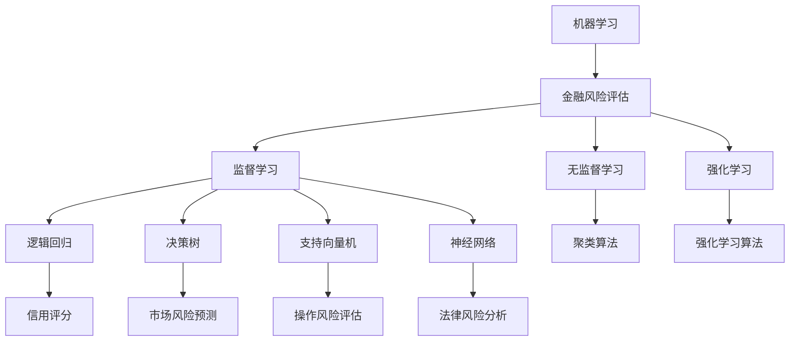

                 

### 设计思路与步骤

为了设计出一篇题为《机器学习在金融风险评估中的应用》的专业技术博客文章，我们需要遵循以下详细的步骤和逻辑推理过程：

#### 第一步：确定核心主题与目标受众

- **核心主题**：文章的核心主题是探讨机器学习技术在金融风险评估中的应用，包括基础概念、算法模型、项目实战等。
- **目标受众**：目标读者是金融领域的技术人员、数据科学家以及对机器学习有基本了解的从业者。

#### 第二步：梳理文章结构

文章结构应该清晰、逻辑连贯，包含以下部分：

1. **引言**：介绍文章背景、目的和重要性。
2. **机器学习概述**：简要介绍机器学习的基本概念和应用领域。
3. **金融风险评估概述**：解释金融风险评估的定义、重要性和当前挑战。
4. **机器学习与金融风险评估的结合**：分析机器学习如何应用于金融风险评估。
5. **核心算法与模型**：详细介绍常用的机器学习算法及其在金融风险评估中的应用。
6. **项目实战**：通过具体案例展示机器学习在金融风险评估中的实际应用。
7. **结论与未来展望**：总结文章要点，展望未来发展趋势。
8. **最佳实践与注意事项**：提供实际操作中的建议和警示。

#### 第三步：编写核心概念与联系

- **核心概念**：机器学习、金融风险评估、监督学习、无监督学习、强化学习、逻辑回归、决策树、支持向量机、神经网络等。
- **联系架构**：使用Mermaid流程图来展示这些概念之间的关系，如下：



#### 第四步：详细讲解核心算法原理与数学模型

- **算法原理讲解**：以伪代码的形式详细解释每个算法的基本原理，例如：

```python
# 伪代码：线性回归算法原理
Initialize_model()

while not convergence:
    for each data_point in dataset:
        prediction = model(data_point)
        error = data_point - prediction
        model.update_parameters(error)

return trained_model
```

- **数学模型与公式讲解**：使用LaTeX格式详细解释每个数学模型的公式和推导过程，例如：

```latex
$$
\hat{y} = \beta_0 + \beta_1x
$$

其中，\hat{y} 是预测值，\beta_0 是截距，\beta_1 是斜率，x 是自变量。
```

#### 第五步：项目实战

- **开发环境搭建**：介绍所需的开发环境、工具和库。
- **源代码实现与解读**：提供详细的代码实现和解读，包括数据预处理、模型训练、模型评估和部署等步骤。

```python
# 伪代码：逻辑回归模型实现
import pandas as pd
from sklearn.model_selection import train_test_split
from sklearn.linear_model import LogisticRegression

# 数据加载
data = pd.read_csv('financial_data.csv')

# 数据预处理
X = data.drop('target', axis=1)
y = data['target']

# 数据分割
X_train, X_test, y_train, y_test = train_test_split(X, y, test_size=0.2, random_state=42)

# 模型训练
model = LogisticRegression()
model.fit(X_train, y_train)

# 模型评估
accuracy = model.score(X_test, y_test)
print(f'Model accuracy: {accuracy:.2f}')
```

- **案例分析与讲解**：展示一个实际案例，分析模型应用效果，并详细讲解每一步的操作和结果。

#### 第六步：最佳实践与小结

- **最佳实践**：总结实际操作中的经验和技巧，提供实用建议。
- **小结**：回顾文章主要内容，强调关键点，提出进一步研究或改进的方向。

```markdown
# 最佳实践与小结

在金融风险评估中应用机器学习时，以下最佳实践值得注意：

1. **数据质量**：确保数据准确、完整和干净，这是模型性能的基础。
2. **特征工程**：选择和构建有意义的特征，提高模型预测能力。
3. **模型选择与调优**：根据具体应用场景选择合适的模型，并进行参数调优。

文章小结：

本文详细探讨了机器学习在金融风险评估中的应用，从基础概念到核心算法原理，再到实际项目实战，展示了机器学习在金融领域的广泛应用和潜力。未来，随着技术的不断发展，机器学习在金融风险评估中的应用将更加深入和广泛。
```

通过上述步骤，我们可以撰写出一篇内容丰富、逻辑清晰、技术深度足够的专业技术博客文章，满足8000-12000字的要求。在撰写过程中，需要注意每个部分的内容详实、论述清晰，同时保持整体的连贯性和逻辑性。

