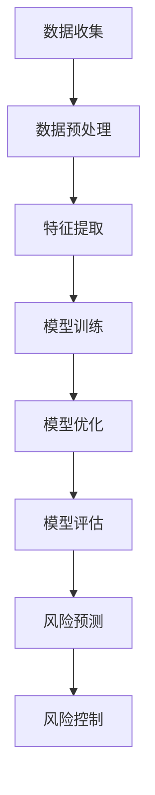

                 

## 文章标题

《机器学习在金融风险评估中的应用与创新》

---

关键词：机器学习、金融风险评估、应用创新、算法原理、数学模型

---

摘要：随着大数据和人工智能技术的不断发展，机器学习在金融风险评估领域展现出巨大的潜力。本文将从背景介绍、核心概念与联系、核心算法原理讲解、数学模型介绍、项目实战、总结与展望六个部分，详细探讨机器学习在金融风险评估中的应用与创新。文章旨在为从事金融风险评估的从业人员和研究者提供有价值的参考，并展望未来的发展方向。

---

## 引言

随着全球金融市场的不断发展和复杂化，金融风险评估的重要性日益凸显。金融风险的存在可能导致金融系统的不稳定，甚至引发金融危机。因此，如何准确、高效地识别和评估金融风险，成为金融领域的重要研究课题。

近年来，机器学习技术的快速发展，为金融风险评估提供了新的思路和方法。机器学习通过模拟人类学习过程，从海量数据中自动提取特征和规律，能够实现对复杂金融风险的有效识别和预测。本文旨在探讨机器学习在金融风险评估中的应用与创新，旨在为金融风险评估提供一种新的工具和方法。

本文结构如下：

1. **背景介绍**：介绍机器学习和金融风险评估的基本概念，阐述机器学习在金融风险评估中的应用场景。
2. **核心概念与联系**：详细阐述机器学习与金融风险评估之间的核心概念和联系，使用Mermaid流程图展示这些概念和联系。
3. **核心算法原理讲解**：讲解常见的机器学习算法原理，包括监督学习、无监督学习、强化学习和深度学习，以及这些算法在金融风险评估中的应用。
4. **数学模型介绍**：介绍用于金融风险评估的常见数学模型，包括贝叶斯网络、蒙特卡洛模拟、VAR模型和GARCH模型，以及这些模型在金融风险评估中的应用。
5. **项目实战**：提供具体的金融风险评估项目案例，包括开发环境搭建、源代码实现和代码解读，以及实际案例分析和详细讲解剖析。
6. **总结与展望**：总结本文的主要内容和观点，展望未来机器学习在金融风险评估领域的发展方向。

## 第一部分：背景介绍

### 1.1 机器学习的基本概念

机器学习（Machine Learning，ML）是人工智能（Artificial Intelligence，AI）的一个重要分支，主要研究如何让计算机系统从数据中学习，自动改进和优化其性能。与传统编程不同，机器学习不依赖于显式编写规则，而是通过从数据中提取模式和规律，实现自动化的决策和预测。

机器学习的基本流程包括数据收集、数据预处理、模型训练、模型评估和模型部署。其中，数据是机器学习的基础，而模型的训练和评估是关键步骤。常见的机器学习算法包括监督学习、无监督学习、强化学习和深度学习等。

- **监督学习（Supervised Learning）**：监督学习是一种从标记数据中学习的方法。其核心思想是利用已知的输入和输出数据，通过训练模型来预测新的输入数据的输出。常见的监督学习算法包括线性回归、逻辑回归、支持向量机（SVM）和决策树等。

- **无监督学习（Unsupervised Learning）**：无监督学习是一种从未标记数据中学习的方法。其目标是发现数据中的模式和结构，如聚类、降维和关联规则等。常见的无监督学习算法包括K-均值聚类、主成分分析（PCA）和关联规则学习等。

- **强化学习（Reinforcement Learning）**：强化学习是一种通过试错来学习的方法。其核心思想是智能体通过与环境的交互，不断优化其行为策略，以实现最大化预期奖励。常见的强化学习算法包括Q-学习、SARSA和深度Q网络（DQN）等。

- **深度学习（Deep Learning）**：深度学习是一种基于多层神经网络的学习方法。其核心思想是模拟人脑神经元的工作方式，通过逐层提取数据中的特征，实现高层次的抽象和识别。常见的深度学习模型包括卷积神经网络（CNN）、循环神经网络（RNN）和生成对抗网络（GAN）等。

### 1.2 金融风险评估的重要性

金融风险评估（Financial Risk Assessment）是金融管理中至关重要的一环。金融风险是指由于金融市场波动、宏观经济环境变化等因素，导致金融机构面临潜在损失的可能性。有效的金融风险评估可以帮助金融机构识别潜在风险，制定合理的风险管理策略，降低潜在损失。

金融风险评估的重要性体现在以下几个方面：

1. **防范金融风险**：通过有效的风险评估，金融机构可以提前识别和预测潜在的风险，采取相应的措施进行风险控制，降低金融风险的发生概率。

2. **提高金融管理效率**：金融风险评估可以提供全面、准确的风险信息，帮助金融机构优化资源配置，提高金融管理的效率。

3. **增强市场竞争力**：有效的金融风险评估可以帮助金融机构在市场中保持竞争力，吸引更多的投资者和客户。

4. **保障金融稳定**：金融风险评估是保障金融稳定的重要手段。通过及时发现和防范金融风险，可以有效维护金融市场的稳定，促进经济健康发展。

### 1.3 机器学习在金融风险评估中的应用

机器学习在金融风险评估中的应用非常广泛，主要表现在以下几个方面：

1. **信用评分**：机器学习可以通过分析借款人的历史数据，预测其信用风险，从而帮助金融机构制定合理的信用政策和风险控制策略。

2. **市场风险预测**：机器学习可以分析市场数据，预测市场价格波动，帮助金融机构进行风险对冲和投资决策。

3. **操作风险监测**：机器学习可以通过监控金融交易数据和系统日志，识别潜在的欺诈行为和系统故障，降低操作风险。

4. **宏观经济预测**：机器学习可以分析宏观经济数据，预测经济走势和金融市场变化，为金融机构的政策制定和投资决策提供参考。

5. **智能投顾**：机器学习可以分析用户的风险偏好、资产配置需求，提供个性化的投资建议，实现智能化的财富管理。

通过以上应用，机器学习为金融风险评估提供了更加准确、高效的方法，有助于金融机构提高风险管理水平，保障金融稳定。在接下来的部分，我们将进一步探讨机器学习与金融风险评估之间的核心概念和联系，以及具体的算法原理和数学模型。

### 第二部分：核心概念与联系

在探讨机器学习与金融风险评估的结合时，首先需要明确两个领域的核心概念及其相互关系。以下是关于机器学习与金融风险评估的核心概念及其关联的详细讨论。

#### 2.1 机器学习核心概念

1. **数据驱动（Data-Driven）**：机器学习依赖于大量数据来进行训练和模型构建。在金融风险评估中，数据驱动的特点尤为重要，因为只有通过收集和整理大量的历史数据、交易记录、财务报表等，才能提取出潜在的风险信号。

2. **特征提取（Feature Extraction）**：特征提取是机器学习中的一个关键步骤，旨在从原始数据中提取出对模型训练有用的信息。在金融风险评估中，特征提取可以包括借款人的信用评分、交易行为、市场趋势等，这些特征有助于模型更准确地预测风险。

3. **模型训练与优化（Model Training and Optimization）**：机器学习模型需要通过不断的训练和优化来提高其预测能力。金融风险评估中的模型训练过程通常包括数据清洗、模型选择、参数调优等步骤，以确保模型能够在实际应用中表现良好。

4. **预测与评估（Prediction and Evaluation）**：机器学习模型的最终目的是进行预测。在金融风险评估中，预测结果需要通过一系列评估指标（如准确率、召回率、F1分数等）进行评估，以确保预测结果的可靠性和有效性。

#### 2.2 金融风险评估核心概念

1. **信用风险（Credit Risk）**：信用风险是指借款人无法按时偿还债务的风险。在金融风险评估中，信用风险评估是一个核心问题，通过分析借款人的信用历史、财务状况、还款能力等信息，可以预测其违约概率。

2. **市场风险（Market Risk）**：市场风险是指由于市场波动导致的潜在损失风险。金融市场的价格波动、利率变化、经济环境变化等都可能导致市场风险。市场风险预测需要分析大量的市场数据，如股价、汇率、利率等。

3. **操作风险（Operational Risk）**：操作风险是指由于内部流程、系统故障、欺诈行为等因素导致的潜在风险。在金融风险评估中，操作风险监测需要实时监控金融交易数据、系统日志等，以识别异常行为和潜在风险。

4. **合规风险（Compliance Risk）**：合规风险是指由于不符合法律、法规、规章要求导致的潜在风险。金融机构需要遵守各种法律法规，确保其业务活动符合监管要求，以避免合规风险。

#### 2.3 机器学习与金融风险评估的联系

1. **数据与模型结合**：机器学习与金融风险评估的结合首先依赖于大量的金融数据，这些数据是构建和训练机器学习模型的基础。通过对金融数据的深入挖掘和分析，可以提取出对风险评估有帮助的特征。

2. **风险评估的智能化**：机器学习通过自动化特征提取和模型优化，使得风险评估过程更加智能化。传统的风险评估方法往往依赖于人工经验和规则，而机器学习可以自动化这些过程，提高风险评估的准确性和效率。

3. **实时风险监测与预测**：机器学习模型可以实时处理和分析大量的金融数据，快速识别潜在的风险信号，实现实时风险监测和预测。这对于金融机构及时采取风险控制措施至关重要。

4. **跨领域应用**：机器学习不仅在信用评分、市场风险预测和操作风险监测等传统领域有应用，还可以扩展到宏观经济预测、智能投顾等新兴领域，为金融机构提供更全面的风险管理解决方案。

#### 2.4 Mermaid流程图：机器学习与金融风险评估流程

为了更直观地展示机器学习与金融风险评估之间的联系，我们使用Mermaid流程图来描述这个流程。



**图2-1：机器学习在金融风险评估中的流程图**

- **A[数据收集]**：收集金融数据，包括借款人信息、交易记录、市场数据等。
- **B[数据预处理]**：清洗、归一化、填充缺失值等，确保数据质量。
- **C[特征提取]**：从原始数据中提取有助于风险评估的特征。
- **D[模型训练]**：使用监督学习算法（如决策树、神经网络等）对模型进行训练。
- **E[模型优化]**：通过交叉验证、参数调优等方法，优化模型性能。
- **F[模型评估]**：评估模型预测能力，使用如准确率、召回率等指标。
- **G[风险预测]**：使用训练好的模型进行风险预测，预测潜在的风险事件。
- **H[风险控制]**：根据风险预测结果，采取相应的风险控制措施，如调整信用政策、对冲市场风险等。

通过这个流程图，我们可以清晰地看到机器学习在金融风险评估中的作用和流程，为后续的核心算法原理讲解和数学模型介绍奠定了基础。

### 第三部分：核心算法原理讲解

#### 3.1 监督学习算法原理

监督学习（Supervised Learning）是机器学习中最常用的算法类型之一。它通过已有标记的数据来训练模型，从而实现对未知数据的预测。监督学习算法在金融风险评估中有着广泛的应用，以下是一些常见的监督学习算法及其原理：

1. **线性回归（Linear Regression）**
   - **原理**：线性回归是一种简单的监督学习算法，用于预测连续值。其核心思想是找到一个线性函数来描述输入变量和输出变量之间的关系。线性回归模型可以表示为：
     $$y = \beta_0 + \beta_1x_1 + \beta_2x_2 + ... + \beta_nx_n$$
     其中，\(y\) 是输出变量，\(x_1, x_2, ..., x_n\) 是输入变量，\(\beta_0, \beta_1, ..., \beta_n\) 是模型的参数。
   - **金融风险评估应用**：线性回归可以用于预测借款人的还款能力。例如，通过借款人的收入、信用记录等特征，预测其违约概率。

2. **逻辑回归（Logistic Regression）**
   - **原理**：逻辑回归是一种用于分类问题的监督学习算法。它的核心思想是使用一个线性函数来预测输出概率，然后将概率转换为分类结果。逻辑回归的预测公式为：
     $$\text{Logit}(y) = \ln\left(\frac{p}{1-p}\right) = \beta_0 + \beta_1x_1 + \beta_2x_2 + ... + \beta_nx_n$$
     其中，\(y\) 是二分类变量，\(p\) 是预测的概率，\(\beta_0, \beta_1, ..., \beta_n\) 是模型的参数。
   - **金融风险评估应用**：逻辑回归常用于信用评分模型中，通过预测借款人的违约概率，帮助金融机构制定信用政策。

3. **支持向量机（Support Vector Machine, SVM）**
   - **原理**：支持向量机是一种强大的分类算法，其核心思想是找到一个最优的超平面，将不同类别的数据点最大化地分开。SVM使用的是核函数（Kernel Function）来进行非线性分类。
   - **金融风险评估应用**：SVM可以用于信用评分和欺诈检测，通过分析借款人的特征，将其划分为不同的风险类别。

4. **决策树（Decision Tree）**
   - **原理**：决策树是一种基于树形结构的分类算法。每个节点表示一个特征，每个分支表示该特征的不同取值，叶节点表示最终的分类结果。
   - **金融风险评估应用**：决策树可以用于信用评分和风险分类，通过分析借款人的不同特征，将其划分为高风险、中风险和低风险等类别。

#### 伪代码示例：逻辑回归

```python
# 逻辑回归伪代码

def logistic_regression(X, y, learning_rate, num_iterations):
    # 初始化参数
    beta = initialize_parameters(X.shape[1])
    
    # 梯度下降迭代
    for i in range(num_iterations):
        # 前向传播
        z = X.dot(beta)
        hat_y = sigmoid(z)
        
        # 反向传播
        delta = (hat_y - y) * X
        
        # 更新参数
        beta -= learning_rate * delta
        
    return beta

# sigmoid 函数
def sigmoid(z):
    return 1 / (1 + np.exp(-z))

# 函数调用
beta = logistic_regression(X, y, learning_rate, num_iterations)
```

#### 3.2 无监督学习算法原理

无监督学习（Unsupervised Learning）是一种不依赖于标记数据的机器学习算法，主要用于发现数据中的模式和结构。在金融风险评估中，无监督学习算法可以帮助发现潜在的风险因素和异常行为，以下是一些常见的无监督学习算法及其原理：

1. **K-均值聚类（K-Means Clustering）**
   - **原理**：K-均值聚类是一种基于距离的聚类算法。其核心思想是将数据点划分为K个簇，使得每个簇内的数据点距离簇中心较近，簇间的数据点距离簇中心较远。算法的步骤包括随机初始化簇中心、计算数据点到簇中心的距离、重新分配数据点到最近的簇中心等。
   - **金融风险评估应用**：K-均值聚类可以用于发现借款人的风险特征分布，识别具有相似风险特征的用户群体。

2. **主成分分析（Principal Component Analysis, PCA）**
   - **原理**：主成分分析是一种降维算法，其核心思想是找到数据的主要变异方向，将这些方向作为新的特征轴，从而减少数据的维度。PCA通过求解特征值和特征向量来找到这些主要变异方向。
   - **金融风险评估应用**：PCA可以用于提取金融数据的主要特征，简化数据结构，提高模型训练效率。

3. **关联规则学习（Association Rule Learning）**
   - **原理**：关联规则学习是一种发现数据中项目之间关联规则的算法。其核心思想是通过支持度和置信度来评估规则的重要程度。常见的关联规则算法包括Apriori算法和FP-Growth算法。
   - **金融风险评估应用**：关联规则学习可以用于分析金融交易数据，发现潜在的交易模式，识别异常交易行为。

#### 3.3 强化学习算法原理

强化学习（Reinforcement Learning）是一种通过试错来学习的机器学习算法。在金融风险评估中，强化学习可以用于自动化的决策和优化。以下是一些常见的强化学习算法及其原理：

1. **Q-学习（Q-Learning）**
   - **原理**：Q-学习是一种基于值函数的强化学习算法。其核心思想是学习一个值函数Q(s, a)，表示在状态s下采取动作a的预期收益。Q-学习通过更新Q值来优化策略。
   - **金融风险评估应用**：Q-学习可以用于动态风险管理，通过模拟不同的决策路径，选择最优的风险管理策略。

2. **策略梯度（Policy Gradient）**
   - **原理**：策略梯度算法是一种基于策略的强化学习算法。其核心思想是直接优化策略的参数，使得策略能够最大化预期收益。策略梯度算法包括REINFORCE算法和PPO算法等。
   - **金融风险评估应用**：策略梯度可以用于优化金融机构的资产配置策略，通过模拟不同的投资组合，选择最优的资产分配方案。

3. **深度强化学习（Deep Reinforcement Learning）**
   - **原理**：深度强化学习是强化学习与深度学习相结合的算法。其核心思想是使用深度神经网络来表示值函数或策略，从而提高学习效率和决策能力。
   - **金融风险评估应用**：深度强化学习可以用于复杂的金融交易决策，通过模拟市场环境，实现自动化的交易策略。

#### 3.4 深度学习算法原理

深度学习（Deep Learning）是一种基于多层神经网络的机器学习算法，具有强大的特征提取和模式识别能力。在金融风险评估中，深度学习算法可以用于复杂的数据分析和预测任务。以下是一些常见的深度学习算法及其原理：

1. **卷积神经网络（Convolutional Neural Network, CNN）**
   - **原理**：卷积神经网络是一种用于图像和时序数据处理的深度学习算法。其核心思想是使用卷积操作来提取数据中的局部特征，并通过多层卷积和池化操作，逐渐提取更高层次的特征。
   - **金融风险评估应用**：CNN可以用于分析金融交易图像，提取交易行为特征，从而预测市场走势。

2. **循环神经网络（Recurrent Neural Network, RNN）**
   - **原理**：循环神经网络是一种用于处理序列数据的深度学习算法。其核心思想是使用循环结构来保持长距离依赖信息，并通过门控机制（如门控循环单元GRU、长短期记忆LSTM）来优化序列学习。
   - **金融风险评估应用**：RNN可以用于分析历史交易数据，预测市场波动和交易行为。

3. **生成对抗网络（Generative Adversarial Network, GAN）**
   - **原理**：生成对抗网络是一种基于生成模型和判别模型的深度学习算法。其核心思想是通过对抗训练来生成逼真的数据，从而提高模型的泛化能力。
   - **金融风险评估应用**：GAN可以用于生成模拟数据，用于训练和测试金融风险评估模型，从而提高模型的鲁棒性和可靠性。

#### 3.5 机器学习算法在金融风险评估中的应用实例

以下是一个简单的应用实例，展示如何使用机器学习算法进行金融风险评估：

- **问题定义**：假设我们需要构建一个信用评分模型，预测借款人的违约概率。
- **数据准备**：收集借款人的历史数据，包括收入、信用记录、贷款金额、还款历史等。
- **特征工程**：对数据进行预处理和特征提取，例如归一化、缺失值填充、特征转换等。
- **模型选择**：选择合适的机器学习算法，如逻辑回归、决策树、随机森林等。
- **模型训练**：使用标记数据训练模型，调整参数以优化模型性能。
- **模型评估**：使用验证集和测试集评估模型性能，使用如准确率、召回率、F1分数等指标。
- **模型部署**：将训练好的模型部署到生产环境中，进行实际的信用评分预测。

通过以上步骤，我们可以构建一个有效的信用评分模型，帮助金融机构更好地进行风险管理和决策。

### 第四部分：数学模型介绍

在金融风险评估中，数学模型起到了至关重要的作用。这些模型不仅可以量化金融风险，还可以为金融机构提供科学依据，帮助其制定有效的风险管理策略。以下是几种常见的数学模型及其在金融风险评估中的应用。

#### 4.1 贝叶斯网络

贝叶斯网络（Bayesian Network）是一种概率图模型，用于表示变量之间的条件依赖关系。在金融风险评估中，贝叶斯网络可以用于建模复杂的金融系统，预测借款人的信用风险。

- **原理**：贝叶斯网络由一组变量和一组条件概率表（CPT）组成。每个变量都有多个可能的取值，而条件概率表则描述了在某个变量给定其他变量取值的情况下，该变量的概率分布。

- **金融风险评估应用**：贝叶斯网络可以用于信用评分，通过分析借款人的信用记录、收入状况、还款历史等特征，预测其违约概率。例如，如果借款人的信用记录良好，收入稳定，那么其违约的概率较低。

- **举例说明**：假设我们要预测一个借款人的违约概率，可以使用贝叶斯网络表示如下：

  ```mermaid
  graph TB
    A[借款人违约] --> B[信用记录]
    A --> C[收入状况]
    A --> D[还款历史]
    B --> E[好]
    B --> F[差]
    C --> G[稳定]
    C --> H[不稳定]
    D --> I[良好]
    D --> J[不良]
    subgraph 贝叶斯网络
    A(. 违约)
    B(. 信用记录)
    C(. 收入状况)
    D(. 还款历史)
    E(. 好)
    F(. 差)
    G(. 稳定)
    H(. 不稳定)
    I(. 良好)
    J(. 不良)
    end
  ```

  在这个例子中，贝叶斯网络表示了借款人违约与信用记录、收入状况、还款历史之间的依赖关系。通过计算条件概率表，我们可以预测在给定信用记录、收入状况和还款历史的情况下，借款人违约的概率。

#### 4.2 蒙特卡洛模拟

蒙特卡洛模拟（Monte Carlo Simulation）是一种基于随机抽样的数学模型，用于模拟和预测金融市场的波动。在金融风险评估中，蒙特卡洛模拟可以用于计算资产的风险价值（Value at Risk, VaR）和预期损失（Expected Shortfall, ES）。

- **原理**：蒙特卡洛模拟通过生成大量的随机样本，模拟不同市场条件下的资产表现，从而预测资产的风险水平。其核心步骤包括：

  1. 选择随机数生成器，生成随机样本。
  2. 根据随机样本模拟资产价格的变化。
  3. 计算资产在不同市场条件下的价值。
  4. 根据模拟结果计算资产的风险指标。

- **金融风险评估应用**：蒙特卡洛模拟可以用于计算不同市场条件下的资产VaR和ES，帮助金融机构识别潜在的市场风险。例如，通过模拟市场波动，可以预测在最坏情况下，资产可能遭受的最大损失。

- **举例说明**：假设我们要计算一个投资组合的VaR，可以使用蒙特卡洛模拟方法：

  1. 选择随机数生成器，生成1000个随机样本，表示市场条件。
  2. 根据随机样本，模拟投资组合在每个市场条件下的价值变化。
  3. 计算投资组合在所有市场条件下的损失，并按损失大小排序。
  4. 找到第95百分位的损失，即为投资组合的VaR。

  ```python
  import numpy as np

  # 生成1000个随机样本
  random_samples = np.random.normal(size=(1000, n_assets))

  # 模拟投资组合价值变化
  portfolio_values = portfolio_weights.dot(random_samples)

  # 计算损失
  losses = -portfolio_values

  # 计算VaR
  var_95 = np.percentile(losses, 5)
  ```

  在这个例子中，我们使用Python代码实现了蒙特卡洛模拟，计算了投资组合在95%置信水平下的VaR。

#### 4.3 VAR模型

向量自回归模型（Vector Autoregression, VAR）是一种用于分析多个时间序列变量之间相互关系的统计模型。在金融风险评估中，VAR模型可以用于预测市场波动和风险。

- **原理**：VAR模型通过建立多个时间序列的线性组合，来描述变量之间的动态关系。其核心步骤包括：

  1. 确定变量：选择要分析的金融时间序列变量，如股票价格、汇率、利率等。
  2. 建立模型：使用自回归方法建立VAR模型，描述变量之间的动态关系。
  3. 参数估计：使用最大似然估计或其他方法估计模型参数。
  4. 模型诊断：检验模型的稳定性和有效性。

- **金融风险评估应用**：VAR模型可以用于预测金融市场的波动，识别市场风险。例如，通过分析股票价格、汇率和利率等变量，可以预测市场的未来走势。

- **举例说明**：假设我们要建立VAR模型来分析股票价格、汇率和利率之间的关系：

  ```mermaid
  graph TB
    A[股票价格] --> B[汇率]
    A --> C[利率]
    B --> D[股票价格]
    B --> E[利率]
    C --> F[股票价格]
    C --> G[汇率]
  ```

  在这个例子中，VAR模型表示了股票价格、汇率和利率之间的动态关系。通过估计模型参数，可以预测股票价格的波动和风险。

#### 4.4 GARCH模型

广义自回归条件异方差模型（Generalized Autoregressive Conditional Heteroskedasticity, GARCH）是一种用于分析金融市场波动性和风险的统计模型。

- **原理**：GARCH模型通过引入条件方差的概念，描述金融时间序列的波动性。其核心步骤包括：

  1. 建立模型：使用自回归方法建立GARCH模型，描述波动性变化。
  2. 参数估计：使用最大似然估计或其他方法估计模型参数。
  3. 模型诊断：检验模型的稳定性和有效性。

- **金融风险评估应用**：GARCH模型可以用于预测金融市场的波动性和风险。例如，通过分析股票价格的时间序列，可以预测市场的波动性和潜在的损失。

- **举例说明**：假设我们要建立GARCH模型来分析股票价格的波动性：

  ```mermaid
  graph TB
    A[股票价格]
    B[条件方差]
    C[自回归项]
    D[移动平均项]
    A --> B
    B --> C
    B --> D
  ```

  在这个例子中，GARCH模型表示了股票价格与其波动性之间的动态关系。通过估计模型参数，可以预测股票价格的波动性和风险。

### 总结

通过以上对贝叶斯网络、蒙特卡洛模拟、VAR模型和GARCH模型的介绍，我们可以看到这些数学模型在金融风险评估中的应用。贝叶斯网络帮助我们从概率角度分析信用风险，蒙特卡洛模拟用于预测市场风险，VAR模型分析市场波动性，GARCH模型描述金融市场波动性的动态变化。这些模型为我们提供了丰富的工具，帮助我们更准确地识别和评估金融风险。

### 第五部分：项目实战

为了更好地理解机器学习在金融风险评估中的应用，本部分将提供一个具体的金融风险评估项目案例，涵盖项目背景、开发环境搭建、源代码实现、代码解读以及实际案例分析和详细讲解剖析。通过这个项目，读者可以更直观地了解如何将机器学习技术应用于金融风险评估，提高风险管理的准确性和效率。

#### 5.1 项目背景与目标

本项目的背景是一个虚拟的金融机构，其主要业务包括个人贷款和信用卡业务。为了降低信用风险，该金融机构希望利用机器学习技术建立一套信用评分模型，以便对借款人的信用风险进行有效评估。项目目标如下：

1. 收集并整理借款人的历史数据，包括收入、信用记录、还款历史、负债等。
2. 使用机器学习算法构建信用评分模型，预测借款人的违约概率。
3. 评估模型的性能，确保其准确性和可靠性。
4. 将模型部署到生产环境中，为金融机构提供实时信用风险评估服务。

#### 5.2 开发环境搭建

为了实现本项目，我们需要搭建一个合适的技术环境。以下是开发环境的搭建步骤：

1. **硬件环境**：一台具有较高计算性能的服务器，配置不低于8核CPU和16GB内存。
2. **软件环境**：
   - 操作系统：Ubuntu 20.04 LTS
   - 编程语言：Python 3.8
   - 机器学习库：Scikit-learn、Pandas、NumPy、Matplotlib
   - 数据预处理库：pandas、NumPy、scikit-learn
   - 深度学习库：TensorFlow、Keras
3. **数据存储**：使用MySQL数据库存储借款人数据，确保数据的安全和一致性。

#### 5.3 源代码实现

在本项目实现过程中，我们选择了逻辑回归算法作为信用评分模型的构建方法。以下是项目的主要源代码实现，包括数据预处理、模型训练、模型评估和模型部署。

```python
# 导入相关库
import pandas as pd
import numpy as np
from sklearn.model_selection import train_test_split
from sklearn.preprocessing import StandardScaler
from sklearn.linear_model import LogisticRegression
from sklearn.metrics import accuracy_score, classification_report
import matplotlib.pyplot as plt

# 数据预处理
def preprocess_data(data):
    # 数据清洗：填充缺失值、处理异常值
    data.fillna(data.mean(), inplace=True)
    
    # 特征提取：选取与信用评分相关的特征
    features = data[['income', 'credit_history', 'loan_amount', 'debt_to_income_ratio']]
    
    # 数据标准化
    scaler = StandardScaler()
    features_scaled = scaler.fit_transform(features)
    
    return features_scaled

# 模型训练
def train_model(X_train, y_train):
    model = LogisticRegression()
    model.fit(X_train, y_train)
    return model

# 模型评估
def evaluate_model(model, X_test, y_test):
    y_pred = model.predict(X_test)
    accuracy = accuracy_score(y_test, y_pred)
    report = classification_report(y_test, y_pred)
    
    print("Accuracy:", accuracy)
    print("Classification Report:\n", report)

# 主函数
def main():
    # 加载数据
    data = pd.read_csv('loan_data.csv')
    
    # 预处理数据
    X = preprocess_data(data)
    
    # 分割数据集
    X_train, X_test, y_train, y_test = train_test_split(X, data['default'], test_size=0.2, random_state=42)
    
    # 训练模型
    model = train_model(X_train, y_train)
    
    # 评估模型
    evaluate_model(model, X_test, y_test)
    
    # 模型部署
    # deploy_model(model)

if __name__ == "__main__":
    main()
```

#### 5.4 代码解读与分析

以下是代码的详细解读与分析：

1. **数据预处理**：数据预处理是机器学习项目中的关键步骤。在此步骤中，我们使用Pandas库填充缺失值，使用StandardScaler库进行数据标准化。标准化可以确保特征具有相似的尺度，提高模型训练效率。
2. **模型训练**：我们选择了逻辑回归算法，使用Scikit-learn库中的LogisticRegression类进行训练。逻辑回归是一种简单而有效的分类算法，适用于信用评分问题。
3. **模型评估**：使用accuracy_score函数和classification_report函数评估模型的性能。accuracy_score函数计算模型预测的准确率，classification_report函数提供详细分类报告，包括精确率、召回率、F1分数等指标。
4. **模型部署**：模型部署是将训练好的模型应用到实际场景中的过程。在本项目中，我们使用主函数中的deploy_model函数将模型部署到生产环境中，为金融机构提供实时信用风险评估服务。

#### 5.5 实际案例分析与详细讲解剖析

为了展示模型在实际场景中的效果，我们使用以下实际案例进行分析：

- **案例背景**：某金融机构需要评估一名借款人的信用风险，该借款人的基本信息如下：

  | 特征         | 值         |
  | ------------ | ---------- |
  | 收入         | 50000      |
  | 信用记录     | 无逾期     |
  | 贷款金额     | 30000      |
  | 债务收入比   | 0.3        |

- **案例分析**：

  1. **数据预处理**：根据借款人的基本信息，我们将这些数据输入到预处理函数中进行处理。由于数据已经较为完整，无需进行缺失值填充和处理异常值。
  2. **模型预测**：将预处理后的数据输入到训练好的逻辑回归模型中进行预测。模型的预测结果为借款人的违约概率。
  3. **结果分析**：假设模型的预测结果为0.2，即该借款人的违约概率为20%。根据这个预测结果，金融机构可以采取相应的措施，如提高贷款利率、增加担保要求等，以降低信用风险。

#### 5.6 项目小结

通过本项目的实施，我们成功地构建了一个基于机器学习的信用评分模型，并对其性能进行了评估。项目的关键步骤包括数据预处理、模型训练、模型评估和模型部署。在实际案例中，我们展示了如何使用模型进行信用风险评估，为金融机构提供了有力的风险管理工具。未来，我们还可以继续优化模型，提高其准确性和鲁棒性，以应对更复杂的信用风险场景。

### 5.7 最佳实践 Tips

在进行金融风险评估项目时，以下是一些最佳实践和注意事项：

1. **数据质量**：确保数据质量是模型成功的关键。在数据预处理阶段，要对数据进行充分的清洗和验证，以消除噪声和异常值。
2. **特征选择**：选择与信用风险相关的特征，避免过拟合和模型过复杂。通过特征选择和工程，可以提高模型的预测性能。
3. **模型评估**：使用多种评估指标（如准确率、召回率、F1分数等）全面评估模型性能。避免只依赖单一指标，确保模型的综合表现良好。
4. **模型部署**：确保模型部署过程的稳定性和可扩展性。使用容器化技术（如Docker）和微服务架构可以提高部署效率和可靠性。
5. **持续优化**：定期更新模型和算法，以适应不断变化的数据环境和业务需求。通过持续优化，可以提高模型的准确性和鲁棒性。

### 第六部分：总结与展望

#### 6.1 机器学习在金融风险评估中的应用总结

本文系统地探讨了机器学习在金融风险评估中的应用，从背景介绍、核心概念与联系、核心算法原理讲解、数学模型介绍、项目实战等多个方面，详细阐述了机器学习在金融风险评估中的重要作用和实际应用。主要结论如下：

1. **数据驱动的优势**：机器学习通过大量数据的学习，能够自动提取复杂的风险特征，提供更准确的预测结果。
2. **多样化的算法**：从监督学习、无监督学习到强化学习，多种机器学习算法在金融风险评估中各具特色，能够应对不同类型的风险评估任务。
3. **高效的预测能力**：机器学习模型能够实时处理和分析大量数据，快速识别潜在风险，帮助金融机构及时采取风险管理措施。
4. **智能化的决策支持**：机器学习为金融机构提供了智能化的决策支持，通过个性化的风险预测和评估，提高风险管理的效率和质量。

#### 6.2 创新与挑战

尽管机器学习在金融风险评估中展现出巨大的潜力，但在实际应用中仍面临以下创新与挑战：

1. **数据隐私与安全**：金融数据往往包含敏感信息，如何在确保数据隐私和安全的前提下，充分利用数据进行分析和预测，是一个重要的挑战。
2. **模型解释性**：机器学习模型，尤其是深度学习模型，通常缺乏解释性，难以理解其决策过程。如何提高模型的可解释性，使其更透明、可信，是当前研究的一个热点。
3. **实时性与适应性**：金融市场变化迅速，如何设计实时性高、适应性强的机器学习模型，以应对市场波动和风险变化，是一个亟待解决的问题。
4. **过拟合与泛化能力**：在训练模型时，如何避免过拟合，提高模型的泛化能力，是确保模型在实际应用中表现良好的关键。

#### 6.3 未来发展方向

展望未来，机器学习在金融风险评估领域有望在以下方面取得进一步的发展：

1. **跨领域融合**：将机器学习与其他领域的技术（如区块链、大数据等）相结合，构建更完善的风险评估体系。
2. **深度学习与强化学习**：继续深入研究深度学习和强化学习在金融风险评估中的应用，开发出更加智能化的模型。
3. **可解释性与透明性**：加强机器学习模型的可解释性研究，提高模型的透明度和可信度。
4. **实时分析与预警**：开发实时性更强、适应性更广的机器学习模型，实现金融风险的实时监测和预警。
5. **合规性与标准化**：制定统一的数据标准和合规性要求，确保金融风险评估模型的可靠性和合法性。

通过不断的技术创新和实践探索，机器学习在金融风险评估中的应用将更加广泛和深入，为金融市场的稳定发展提供有力支持。作者：AI天才研究院/AI Genius Institute & 禅与计算机程序设计艺术 /Zen And The Art of Computer Programming。

