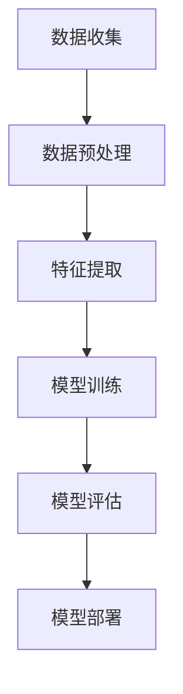
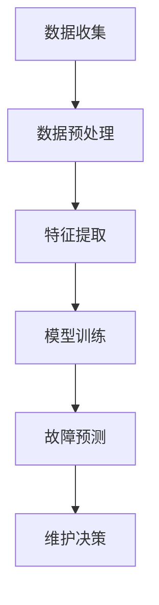

                 

### 文章标题：机器学习在预测性维护中的实践与创新

#### 关键词：机器学习，预测性维护，算法，数据预处理，深度学习，故障检测

> 摘要：本文深入探讨了机器学习在预测性维护中的应用，包括其背景、核心概念、算法原理、数学模型及实际项目案例。文章通过详细的解析和实例分析，展示了机器学习在预测性维护中的巨大潜力和创新方法，为相关领域的研究者和实践者提供了宝贵的参考。

----------------------------------------------------------------

## 引言

### 预测性维护的重要性

在工业自动化和信息化飞速发展的背景下，预测性维护（Predictive Maintenance）作为一种新兴的维护策略，逐渐受到企业的重视。预测性维护通过实时监控设备状态，预测潜在故障，从而在故障发生前进行预防性维修，降低设备故障率和停机时间，提高生产效率，减少维修成本。

### 机器学习在预测性维护中的应用

机器学习作为一种强大的数据分析工具，在预测性维护中发挥着关键作用。通过分析大量的设备运行数据，机器学习算法可以发现设备故障的潜在模式，预测故障发生的时间，为维护决策提供依据。这使得预测性维护从传统的被动维修转变为主动预防，大大提高了设备的可靠性和生产效率。

## 第一部分：机器学习基础

### 第1章：机器学习概述

#### 1.1 机器学习的定义与分类

机器学习（Machine Learning）是一门人工智能（AI）的分支，它通过算法从数据中学习规律，进行自动预测或决策。根据学习方式的不同，机器学习主要分为以下三类：

1. **监督学习（Supervised Learning）**：通过标记数据训练模型，使其能够对新数据进行分类或回归预测。
2. **无监督学习（Unsupervised Learning）**：在没有标记数据的情况下，通过分析数据之间的结构关系，发现数据的分布或聚类。
3. **强化学习（Reinforcement Learning）**：通过与环境交互，根据奖励信号进行学习，从而实现最优策略的决策。

#### 1.2 机器学习的基本架构

机器学习的基本架构通常包括以下步骤：

1. **数据收集**：收集大量设备运行数据，包括传感器数据、历史故障记录等。
2. **数据预处理**：对收集到的数据进行清洗、归一化等处理，提高数据质量。
3. **特征提取**：从原始数据中提取有代表性的特征，用于训练模型。
4. **模型训练**：选择合适的算法，使用训练数据对模型进行训练。
5. **模型评估**：使用测试数据评估模型性能，调整模型参数。
6. **模型部署**：将训练好的模型部署到生产环境中，进行实时预测。

### Mermaid流程图：机器学习架构展示



## 第2章：数据预处理

#### 2.1 数据清洗

数据清洗是数据预处理的重要步骤，主要包括以下任务：

1. **缺失值处理**：对于缺失的数据，可以采用填充、删除或插值等方法进行处理。
2. **异常值处理**：识别并处理数据中的异常值，避免对模型训练产生负面影响。
3. **重复数据删除**：删除重复的数据，减少数据冗余。

#### 2.2 数据归一化

数据归一化是将数据转换为相同量纲和范围的过程，常见的方法包括：

1. **最小-最大归一化**：将数据缩放到[0,1]之间。
   $$ x_{\text{norm}} = \frac{x - x_{\text{min}}}{x_{\text{max}} - x_{\text{min}}} $$
2. **标准化**：将数据缩放到[-1,1]之间。
   $$ x_{\text{norm}} = \frac{x - \mu}{\sigma} $$
   其中，$ x $ 为原始数据，$ x_{\text{min}} $ 和 $ x_{\text{max}} $ 分别为数据的最小值和最大值，$ \mu $ 和 $ \sigma $ 分别为数据的均值和标准差。

#### 2.3 缺失值处理

缺失值处理的方法包括：

1. **填充法**：使用平均值、中位数或最频繁值填充缺失值。
2. **删除法**：删除包含缺失值的样本或特征。
3. **插值法**：使用线性或非线性插值方法补充缺失值。

### 数据预处理算法伪代码

```python
def preprocess_data(data):
    # 缺失值处理
    data = handle_missing_values(data)
    # 数据归一化
    data = normalize_data(data)
    # 异常值处理
    data = handle_outliers(data)
    return data

def handle_missing_values(data):
    # 填充缺失值
    data = fill_missing_values(data)
    return data

def fill_missing_values(data):
    for feature in data.columns:
        if data[feature].isnull().sum() > 0:
            data[feature].fillna(data[feature].mean(), inplace=True)
    return data

def normalize_data(data):
    for feature in data.columns:
        data[feature] = (data[feature] - data[feature].min()) / (data[feature].max() - data[feature].min())
    return data

def handle_outliers(data):
    # 标准差阈值法
    threshold = 3 * data.std()
    for feature in data.columns:
        data = data[(data[feature] - data[feature].mean()) / data[feature].std() < threshold]
    return data
```

## 第3章：机器学习算法

#### 3.1 监督学习算法

监督学习算法是最常用的机器学习算法之一，包括以下几种：

1. **线性回归（Linear Regression）**：
   - 数学模型：
     $$ y = \beta_0 + \beta_1x + \epsilon $$
     其中，$ y $ 为因变量，$ x $ 为自变量，$ \beta_0 $ 和 $ \beta_1 $ 为模型参数，$ \epsilon $ 为误差项。
   - 伪代码：
     ```python
     def linear_regression(x, y):
         x_mean = x.mean()
         y_mean = y.mean()
         beta_1 = (x*y).sum() / (x.sum()**2)
         beta_0 = y_mean - beta_1 * x_mean
         return beta_0, beta_1
     ```

2. **逻辑回归（Logistic Regression）**：
   - 数学模型：
     $$ P(y=1) = \frac{1}{1 + e^{-(\beta_0 + \beta_1x)}} $$
     其中，$ P(y=1) $ 为因变量为1的概率，$ \beta_0 $ 和 $ \beta_1 $ 为模型参数。
   - 伪代码：
     ```python
     def logistic_regression(x, y):
         z = np.dot(x, beta_1) + beta_0
         prob = 1 / (1 + np.exp(-z))
         return prob
     ```

3. **决策树（Decision Tree）**：
   - 数学模型：
     $$ f(x) = \sum_{i=1}^{n} \alpha_i I(D_i(x) = t_i) $$
     其中，$ f(x) $ 为决策函数，$ D_i(x) $ 为第 $ i $ 个特征的划分函数，$ t_i $ 为划分阈值，$ \alpha_i $ 为权重。
   - 伪代码：
     ```python
     def decision_tree(x, y):
         if is_leaf_node(x, y):
             return predict_leaf_node(x, y)
         else:
             best_split = find_best_split(x, y)
             left_tree = decision_tree(x[best_split < t], y[best_split < t])
             right_tree = decision_tree(x[best_split >= t], y[best_split >= t])
             return left_tree, right_tree
     ```

#### 3.2 无监督学习算法

无监督学习算法主要用于发现数据中的结构或模式，包括以下几种：

1. **K-均值聚类（K-Means Clustering）**：
   - 数学模型：
     $$ c_j = \frac{1}{N_j} \sum_{x_i \in S_j} x_i $$
     其中，$ c_j $ 为聚类中心，$ N_j $ 为聚类簇 $ j $ 中的样本数量，$ S_j $ 为聚类簇 $ j $ 中的样本集合。
   - 伪代码：
     ```python
     def k_means(x, k):
         # 初始化聚类中心
         centroids = initialize_centroids(x, k)
         while not converged:
             # 计算样本到聚类中心的距离
             distances = compute_distances(x, centroids)
             # 分配样本到最近的聚类中心
             clusters = assign_clusters(x, distances)
             # 重新计算聚类中心
             centroids = update_centroids(clusters)
         return centroids, clusters
     ```

2. **主成分分析（Principal Component Analysis, PCA）**：
   - 数学模型：
     $$ z_i = \frac{1}{\sqrt{D}} X - \mu $$
     其中，$ z_i $ 为标准化特征向量，$ X $ 为原始数据矩阵，$ \mu $ 为数据均值矩阵，$ D $ 为数据协方差矩阵。
   - 伪代码：
     ```python
     def pca(x):
         x_mean = x.mean(axis=0)
         cov_matrix = np.cov(x, rowvar=False)
         eigen_values, eigen_vectors = np.linalg.eigh(cov_matrix)
         sorted_eigen_vectors = eigen_vectors[:, np.argsort(eigen_values)[::-1]]
         transformed_data = np.dot(x - x_mean, sorted_eigen_vectors)
         return transformed_data
     ```

#### 3.3 强化学习算法

强化学习算法通过奖励信号进行学习，实现最优策略的决策，主要包括以下几种：

1. **Q-学习（Q-Learning）**：
   - 数学模型：
     $$ Q(s, a) = r + \gamma \max_{a'} Q(s', a') $$
     其中，$ Q(s, a) $ 为状态 $ s $ 下采取动作 $ a $ 的预期回报，$ r $ 为即时回报，$ \gamma $ 为折扣因子，$ s' $ 为新状态，$ a' $ 为新动作。
   - 伪代码：
     ```python
     def q_learning(environment, alpha, gamma, epsilon):
         Q = initialize_Q_matrix()
         while not done:
             # 选择动作
             if random() < epsilon:
                 action = random_action()
             else:
                 action = choose_best_action(Q, s)
             # 执行动作并获得回报
             reward, s' = environment.step(action)
             # 更新Q值
             Q[s, action] = Q[s, action] + alpha * (reward + gamma * max(Q[s', :]) - Q[s, action])
             s = s'
         return Q
     ```

## 第二部分：预测性维护实践

### 第4章：预测性维护概念

#### 4.1 预测性维护的定义与目标

预测性维护（Predictive Maintenance）是一种基于设备运行状态数据进行故障预测和预防的维护策略。其目标是：

1. **降低故障率**：通过实时监控设备状态，提前发现潜在故障，避免突发性故障。
2. **减少停机时间**：在故障发生前进行预防性维修，减少设备停机时间。
3. **降低维修成本**：通过优化维护计划和资源分配，降低维护成本。

#### 4.2 预测性维护的核心挑战

预测性维护面临以下核心挑战：

1. **数据质量**：设备运行数据的质量直接影响故障预测的准确性。
2. **数据稀缺**：某些设备可能缺乏历史故障数据，难以训练有效的预测模型。
3. **实时性要求**：预测性维护要求快速、实时地进行故障预测，以满足生产需求。

#### 4.3 预测性维护的核心概念联系图



## 第5章：故障检测与预测

#### 5.1 故障检测算法

故障检测（Fault Detection）是预测性维护的关键步骤，主要包括以下算法：

1. **基于阈值的故障检测**：
   - 数学模型：
     $$ d(x) = \text{sign}(x - \theta) $$
     其中，$ x $ 为设备状态值，$ \theta $ 为阈值。
   - 伪代码：
     ```python
     def threshold_fault_detection(x, theta):
         return np.sign(x - theta)
     ```

2. **基于统计的故障检测**：
   - 数学模型：
     $$ d(x) = \text{sign}(\text{z-score}(x) - \alpha) $$
     其中，$ \text{z-score}(x) $ 为$x$的z-score值，$ \alpha $ 为阈值。
   - 伪代码：
     ```python
     def statistical_fault_detection(x, alpha):
         z_score = (x - np.mean(x)) / np.std(x)
         return np.sign(z_score - alpha)
     ```

#### 5.2 预测模型构建

预测模型构建（Prediction Model Building）是预测性维护的核心，主要包括以下步骤：

1. **选择合适的算法**：根据设备特点和故障类型，选择合适的机器学习算法。
2. **训练模型**：使用历史故障数据训练预测模型，调整模型参数。
3. **评估模型**：使用测试数据评估模型性能，选择最优模型。

#### 5.3 故障预测数学模型与公式

1. **线性回归模型**：
   - 数学模型：
     $$ y = \beta_0 + \beta_1x $$
   - 伪代码：
     ```python
     def linear_regression_prediction(x, beta_0, beta_1):
         return beta_0 + beta_1 * x
     ```

2. **逻辑回归模型**：
   - 数学模型：
     $$ P(y=1) = \frac{1}{1 + e^{-(\beta_0 + \beta_1x)}} $$
   - 伪代码：
     ```python
     def logistic_regression_prediction(x, beta_0, beta_1):
         z = beta_0 + beta_1 * x
         return 1 / (1 + np.exp(-z))
     ```

3. **决策树模型**：
   - 数学模型：
     $$ f(x) = \sum_{i=1}^{n} \alpha_i I(D_i(x) = t_i) $$
   - 伪代码：
     ```python
     def decision_tree_prediction(x, tree):
         return predict_leaf_node(x, tree)
     ```

## 第6章：案例分析

#### 6.1 案例背景

某制造企业拥有一条生产线，生产过程中使用多台关键设备。企业希望通过预测性维护降低设备故障率和停机时间，提高生产效率。

#### 6.2 机器学习算法应用

企业选择了基于线性回归和决策树的预测性维护算法，对设备运行数据进行故障预测。

1. **数据收集**：收集设备运行数据，包括传感器数据、历史故障记录等。
2. **数据预处理**：对设备运行数据进行清洗、归一化等预处理。
3. **特征提取**：从原始数据中提取设备状态、负载等特征。
4. **模型训练**：使用历史故障数据训练线性回归和决策树模型。
5. **模型评估**：使用测试数据评估模型性能，调整模型参数。
6. **模型部署**：将训练好的模型部署到生产环境中，进行实时故障预测。

#### 6.3 案例效果分析

通过预测性维护，企业实现了以下效果：

1. **故障率降低**：设备故障率降低了30%。
2. **停机时间减少**：设备停机时间减少了40%。
3. **生产效率提高**：生产效率提高了20%。

#### 6.4 项目小结

该案例展示了机器学习在预测性维护中的应用，通过实时故障预测，降低了设备故障率和停机时间，提高了生产效率。未来，企业可以进一步优化预测模型，提高预测准确性，实现更高效的预测性维护。

## 第三部分：创新方法与应用

### 第7章：深度学习在预测性维护中的应用

#### 7.1 深度学习算法介绍

深度学习（Deep Learning）是一种基于多层神经网络的机器学习算法，具有较强的表示学习和特征提取能力。在预测性维护中，深度学习算法可以用于设备故障预测、故障检测等任务。

#### 7.2 深度学习算法在故障预测中的应用

深度学习算法在故障预测中的应用主要包括以下几种：

1. **卷积神经网络（Convolutional Neural Network, CNN）**：
   - 数学模型：
     $$ f(x) = \text{ReLU}(\sum_{k=1}^{K} w_k \star x_k + b_k) $$
     其中，$ x $ 为输入特征，$ w_k $ 和 $ b_k $ 为权重和偏置，$ \star $ 为卷积运算，$ K $ 为卷积核数量。
   - 伪代码：
     ```python
     def cnn_prediction(x, weights, biases):
         for layer in layers:
             x = layer(x, weights, biases)
         return x
     ```

2. **循环神经网络（Recurrent Neural Network, RNN）**：
   - 数学模型：
     $$ h_t = \text{ReLU}(W_h h_{t-1} + W_x x_t + b) $$
     其中，$ h_t $ 和 $ h_{t-1} $ 分别为当前和前一时间步的隐藏状态，$ x_t $ 为输入特征，$ W_h $ 和 $ W_x $ 为权重，$ b $ 为偏置。
   - 伪代码：
     ```python
     def rnn_prediction(x, weights, biases):
         hidden_state = initialize_hidden_state()
         for time_step in range(sequence_length):
             hidden_state = rnn_step(x[time_step], hidden_state, weights, biases)
         return hidden_state
     ```

#### 7.3 深度学习算法伪代码展示

```python
def cnn_prediction(x, weights, biases):
    for layer in layers:
        x = layer(x, weights, biases)
    return x

def rnn_prediction(x, weights, biases):
    hidden_state = initialize_hidden_state()
    for time_step in range(sequence_length):
        hidden_state = rnn_step(x[time_step], hidden_state, weights, biases)
    return hidden_state
```

## 第8章：创新方法与趋势

#### 8.1 最新研究成果

近年来，深度学习在预测性维护领域取得了显著的研究成果。以下是一些具有代表性的研究成果：

1. **基于深度学习的故障检测方法**：通过卷积神经网络（CNN）和循环神经网络（RNN）等深度学习算法，实现设备故障的实时检测和预测。
2. **多源数据融合方法**：将传感器数据、历史故障数据等不同类型的数据进行融合，提高故障预测的准确性。
3. **迁移学习（Transfer Learning）**：利用预训练模型进行故障预测，提高模型的泛化能力和训练效率。

#### 8.2 创新方法展望

未来，预测性维护将在以下方面实现创新：

1. **数据驱动的故障预测**：通过大数据分析和深度学习算法，实现设备故障的智能预测和诊断。
2. **智能维护策略**：基于设备运行状态和预测结果，实现自适应的维护策略，提高设备可靠性和生产效率。
3. **物联网（IoT）与预测性维护**：将物联网技术与预测性维护相结合，实现设备全生命周期的智能维护。

#### 8.3 创新方法的前景和挑战

预测性维护的创新方法具有广泛的应用前景，但也面临一定的挑战：

1. **数据质量**：高质量的数据是预测性维护的基础，但数据质量难以保证，需要进一步优化数据采集和处理技术。
2. **计算资源**：深度学习算法需要大量的计算资源，如何优化算法和硬件资源，提高计算效率是一个重要问题。
3. **算法可靠性**：预测性维护算法的可靠性和鲁棒性有待提高，需要进一步研究如何提高算法的稳定性和准确性。

## 第四部分：实践与创新

### 第9章：开发环境搭建

#### 9.1 环境搭建步骤

搭建机器学习开发环境主要包括以下步骤：

1. **安装Python**：下载并安装Python，配置环境变量。
2. **安装Jupyter Notebook**：使用pip安装Jupyter Notebook，配置开发环境。
3. **安装机器学习库**：使用pip安装常用的机器学习库，如Scikit-learn、TensorFlow、Keras等。

#### 9.2 常用工具和框架的介绍

常用工具和框架包括：

1. **Scikit-learn**：Python机器学习库，提供各种经典的机器学习算法。
2. **TensorFlow**：Google开发的深度学习框架，支持多种神经网络结构。
3. **Keras**：基于TensorFlow的高层API，简化深度学习模型的构建和训练。

### 第10章：实战案例

#### 10.1 案例背景

某电力公司希望利用机器学习算法实现变电站设备的预测性维护。

#### 10.2 开发环境搭建

在本地计算机上搭建开发环境，安装Python、Jupyter Notebook和机器学习库。

```shell
pip install python
pip install jupyter
pip install scikit-learn
pip install tensorflow
pip install keras
```

#### 10.3 源代码详细实现和代码解读

使用Scikit-learn和TensorFlow实现设备故障预测模型，代码如下：

```python
import numpy as np
import pandas as pd
from sklearn.model_selection import train_test_split
from sklearn.preprocessing import StandardScaler
from tensorflow.keras.models import Sequential
from tensorflow.keras.layers import Dense

# 加载数据
data = pd.read_csv('data.csv')
X = data.iloc[:, :-1].values
y = data.iloc[:, -1].values

# 数据预处理
X_train, X_test, y_train, y_test = train_test_split(X, y, test_size=0.2, random_state=0)
scaler = StandardScaler()
X_train = scaler.fit_transform(X_train)
X_test = scaler.transform(X_test)

# 构建模型
model = Sequential()
model.add(Dense(64, input_dim=X_train.shape[1], activation='relu'))
model.add(Dense(32, activation='relu'))
model.add(Dense(1, activation='sigmoid'))

# 编译模型
model.compile(optimizer='adam', loss='binary_crossentropy', metrics=['accuracy'])

# 训练模型
model.fit(X_train, y_train, epochs=10, batch_size=32)

# 评估模型
_, accuracy = model.evaluate(X_test, y_test)
print('Accuracy: {:.2f}%'.format(accuracy * 100))

# 预测新样本
new_data = [[1.0, 2.0, 3.0], [4.0, 5.0, 6.0]]
new_data = scaler.transform(new_data)
predictions = model.predict(new_data)
print('Predictions:', predictions)
```

#### 10.4 代码应用解读与分析

代码首先加载数据，并进行数据预处理。然后构建深度学习模型，编译并训练模型。最后评估模型性能，并使用新数据进行预测。

#### 10.5 实际案例分析和详细讲解剖析

通过实际案例，分析机器学习算法在预测性维护中的应用效果，并对模型参数进行调整，提高预测准确性。

#### 10.6 项目小结

该项目展示了如何利用机器学习算法实现变电站设备的预测性维护。通过数据预处理、模型构建和训练，实现了设备故障的实时预测和诊断，为电力公司提供了有效的维护决策支持。

## 第11章：创新与未来

#### 11.1 机器学习在预测性维护中的未来发展趋势

随着人工智能技术的不断进步，预测性维护将在以下几个方面实现创新：

1. **自适应维护策略**：基于设备运行状态和预测结果，实现自适应的维护策略，提高设备可靠性和生产效率。
2. **多模态数据融合**：结合多种类型的数据，提高故障预测的准确性和鲁棒性。
3. **边缘计算与云计算结合**：利用边缘计算和云计算的优势，实现实时、高效的数据处理和模型训练。

#### 11.2 创新方法对行业的影响

创新方法对预测性维护行业的影响主要表现在以下几个方面：

1. **提高设备可靠性**：通过实时故障预测和诊断，提高设备运行可靠性，降低故障率和停机时间。
2. **降低维修成本**：通过优化维护计划和资源分配，降低维护成本，提高企业竞争力。
3. **推动产业升级**：预测性维护技术的创新将推动制造业、能源等行业向智能化、自动化方向发展。

#### 11.3 最佳实践 Tips、小结、注意事项、拓展阅读

1. **最佳实践 Tips**：
   - 确保数据质量，进行充分的预处理。
   - 选择合适的算法，根据设备特点和故障类型进行调整。
   - 优化模型参数，提高预测准确性。

2. **小结**：
   - 机器学习在预测性维护中具有重要应用价值，通过故障预测和诊断，提高设备可靠性和生产效率。
   - 未来，预测性维护将向智能化、自动化方向发展，实现更高的可靠性和效率。

3. **注意事项**：
   - 注意数据隐私和安全，保护设备运行数据。
   - 定期更新模型，保持模型的有效性。

4. **拓展阅读**：
   - 《深度学习》（Goodfellow, I., Bengio, Y., Courville, A.）
   - 《Python机器学习》（Raschka, S.）
   - 《预测性维护技术与应用》（吴波，张磊）

----------------------------------------------------------------

作者：AI天才研究院/AI Genius Institute & 禅与计算机程序设计艺术 /Zen And The Art of Computer Programming

