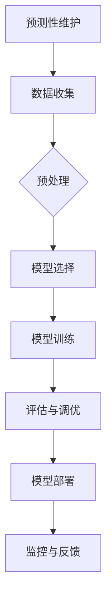
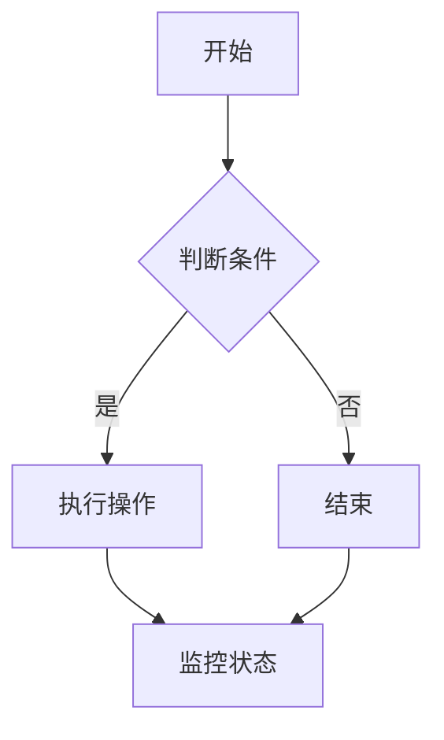

                 

### 文章标题

# 机器学习在预测性维护中的实践与挑战

### 关键词

- 预测性维护
- 机器学习
- 数据分析
- 算法优化
- 异常检测
- 时间序列分析
- 回归分析

### 摘要

本文旨在探讨机器学习在预测性维护（Proactive Maintenance）中的应用及其面临的挑战。首先，介绍了预测性维护的概念及其与机器学习的紧密联系。接着，详细讲解了预测性维护中常用的机器学习算法，包括时间序列分析、异常检测和回归分析等，并使用伪代码和 LaTeX 公式阐述了这些算法的原理和数学模型。随后，通过实际项目案例分析，展示了机器学习在预测性维护中的具体应用流程和实现细节。文章还讨论了预测性维护中可能遇到的数据质量、算法选择和模型解释性等挑战，并提出了相应的解决方案。最后，总结了文章的主要观点，并对未来研究方向进行了展望。

---

### 理解书名与目标读者

《机器学习在预测性维护中的实践与挑战》这一书名明确传达了本书的核心内容：探讨机器学习技术在预测性维护领域的实际应用及其所面临的挑战。预测性维护是一种通过监测设备的运行状态，预测潜在故障并提前进行维护，以降低设备停机时间和维护成本的方法。随着工业4.0和物联网技术的发展，预测性维护越来越受到企业和研究机构的关注。

目标读者主要是希望提升机器学习技术在预测性维护领域应用能力的相关专业人士，包括但不限于：

1. 工程师：在制造业、能源、交通运输等行业中，负责设备和系统的维护和升级。
2. 分析师：从事数据分析和机器学习模型开发的专业人员。
3. 研究人员：对机器学习及其在工程应用中的潜力感兴趣的研究人员。
4. 企业管理者：负责决策和战略规划，希望借助新技术提高生产效率和管理水平。

本书旨在为上述读者群体提供系统的理论知识和实践指导，帮助他们更好地理解预测性维护的原理，掌握相关的机器学习算法，并解决实际应用中的挑战。

### 目录大纲

#### 第1章 引言与背景
1.1 预测性维护的概念与价值
1.2 机器学习的基本原理与应用
1.3 预测性维护与机器学习的联系

#### 第2章 预测性维护与机器学习的联系
2.1 预测性维护中的数据需求
2.2 机器学习在预测性维护中的应用领域

#### 第3章 预测性维护中的机器学习算法
3.1 时间序列分析
3.2 异常检测
3.3 回归分析

#### 第4章 数学模型与公式
4.1 时间序列分析模型
4.2 异常检测模型
4.3 回归分析模型

#### 第5章 实际项目案例分析
5.1 项目背景与目标
5.2 数据收集与预处理
5.3 模型训练与评估
5.4 模型部署与监控

#### 第6章 面临的挑战与解决方案
6.1 数据质量挑战
6.2 算法选择挑战
6.3 模型解释性挑战

#### 第7章 结论与展望
7.1 总结
7.2 未来研究方向

### 核心概念与联系

预测性维护（Proactive Maintenance）是一种通过监控设备和系统的运行状态，预测潜在故障并提前进行维护，以减少设备停机时间和维护成本的方法。机器学习（Machine Learning）则是一种通过数据驱动的方式，让计算机自动学习并改进预测和决策的算法。

在预测性维护中，机器学习的重要性体现在以下几个方面：

1. **故障预测**：通过分析设备的历史运行数据和实时监控数据，机器学习算法能够预测设备何时可能发生故障。
2. **效率提升**：通过优化维护计划，机器学习可以减少不必要的维护操作，提高维护效率。
3. **成本节约**：提前进行维护可以避免设备故障导致的停机和昂贵的修复费用。

机器学习在预测性维护中的关键步骤包括数据收集、预处理、模型选择、训练和评估。具体而言：

1. **数据收集**：收集设备运行状态的历史数据和实时数据，如温度、压力、振动等。
2. **预处理**：对数据进行清洗、归一化等处理，以消除噪声和异常值。
3. **模型选择**：根据故障类型和特征数据，选择合适的时间序列分析、异常检测或回归分析模型。
4. **训练与评估**：使用训练数据集训练模型，并使用验证数据集评估模型的性能。
5. **部署与监控**：将训练好的模型部署到生产环境中，并持续监控模型性能和设备状态。

为了更直观地展示预测性维护与机器学习之间的联系，可以使用 Mermaid 流程图进行说明：



通过这个流程图，我们可以清晰地看到预测性维护与机器学习各步骤之间的关联和交互。

### 预测性维护中的机器学习算法

预测性维护的核心在于通过分析设备和系统的运行数据，预测潜在故障的发生。在这一过程中，机器学习算法起到了至关重要的作用。以下将介绍预测性维护中常用的三种机器学习算法：时间序列分析、异常检测和回归分析。

#### 时间序列分析

时间序列分析（Time Series Analysis）是一种用于分析时间序列数据的统计方法，它关注数据点在时间维度上的变化和规律。在预测性维护中，时间序列分析可用于监测设备运行状态的趋势和周期性变化，从而预测潜在故障。

时间序列分析的主要步骤包括：

1. **数据预处理**：清洗数据，去除异常值和噪声。
2. **特征提取**：提取时间序列数据中的趋势、季节性和循环特征。
3. **模型选择**：选择合适的模型，如自回归模型（AR）、自回归移动平均模型（ARMA）或自回归积分滑动平均模型（ARIMA）。
4. **模型训练与评估**：使用历史数据训练模型，并使用验证数据集评估模型性能。

以下是一个时间序列分析的伪代码示例：

```python
# 数据预处理
data = preprocess_data(time_series_data)

# 特征提取
trend, seasonality, cycles = extract_features(data)

# 模型选择
model = select_model(trend, seasonality, cycles)

# 模型训练与评估
train_model(model, training_data)
evaluate_model(model, validation_data)
```

#### 异常检测

异常检测（Anomaly Detection）是一种用于识别数据中异常或异常模式的算法。在预测性维护中，异常检测可用于监测设备运行状态中的异常行为，从而及时发现潜在故障。

异常检测的主要步骤包括：

1. **数据预处理**：清洗数据，去除异常值和噪声。
2. **模型选择**：选择合适的异常检测模型，如单变量统计异常检测、多变量统计异常检测或基于聚类的方法。
3. **模型训练与评估**：使用历史数据训练模型，并使用验证数据集评估模型性能。
4. **异常检测与报告**：使用训练好的模型检测实时数据中的异常，并生成报告。

以下是一个异常检测的伪代码示例：

```python
# 数据预处理
data = preprocess_data(realtime_data)

# 模型选择
model = select_anomaly_detection_model()

# 模型训练与评估
train_model(model, training_data)
evaluate_model(model, validation_data)

# 异常检测与报告
anomalies = detect_anomalies(model, data)
report_anomalies(anomalies)
```

#### 回归分析

回归分析（Regression Analysis）是一种用于预测变量之间关系的统计方法。在预测性维护中，回归分析可用于预测设备运行状态的变化，从而预测潜在故障。

回归分析的主要步骤包括：

1. **数据预处理**：清洗数据，去除异常值和噪声。
2. **特征提取**：提取与设备运行状态相关的特征。
3. **模型选择**：选择合适的回归模型，如线性回归、多项式回归或逻辑回归。
4. **模型训练与评估**：使用历史数据训练模型，并使用验证数据集评估模型性能。
5. **预测与评估**：使用训练好的模型进行预测，并评估预测的准确性。

以下是一个回归分析的伪代码示例：

```python
# 数据预处理
data = preprocess_data(feature_data)

# 模型选择
model = select_regression_model()

# 模型训练与评估
train_model(model, training_data)
evaluate_model(model, validation_data)

# 预测与评估
predictions = predict(model, new_data)
evaluate_predictions(predictions, new_data)
```

通过以上三种机器学习算法，预测性维护可以在设备发生故障之前及时预警，从而减少停机时间和维护成本。接下来，将结合具体项目案例，进一步探讨这些算法的实际应用过程。

### 数学模型与公式

在预测性维护中，机器学习算法的核心是建立数学模型，通过对设备运行数据进行分析和预测，从而实现故障预警。以下是三种主要机器学习算法的数学模型及其解释：

#### 时间序列分析模型

时间序列分析模型主要用于分析设备运行数据的时间序列特性，常用的模型包括自回归模型（AR）、自回归移动平均模型（ARMA）和自回归积分滑动平均模型（ARIMA）。

1. **自回归模型（AR）**：

   自回归模型的基本形式为：
   $$
   Y_t = c + \phi_1 Y_{t-1} + \phi_2 Y_{t-2} + ... + \phi_p Y_{t-p} + \varepsilon_t
   $$
   其中，$Y_t$ 表示时间序列在时刻 $t$ 的值，$\phi_1, \phi_2, ..., \phi_p$ 是自回归系数，$c$ 是常数项，$\varepsilon_t$ 是误差项。

2. **自回归移动平均模型（ARMA）**：

   自回归移动平均模型结合了自回归模型和移动平均模型的特点，其基本形式为：
   $$
   Y_t = c + \phi_1 Y_{t-1} + ... + \phi_p Y_{t-p} + \theta_1 \varepsilon_{t-1} + ... + \theta_q \varepsilon_{t-q}
   $$
   其中，$\theta_1, \theta_2, ..., \theta_q$ 是移动平均系数。

3. **自回归积分滑动平均模型（ARIMA）**：

   自回归积分滑动平均模型进一步考虑了数据的趋势性，其基本形式为：
   $$
   dY_t = c + \phi_1 dY_{t-1} + ... + \phi_p dY_{t-p} + \theta_1 d\varepsilon_{t-1} + ... + \theta_q d\varepsilon_{t-q}
   $$
   其中，$dY_t$ 表示时间序列的差分形式，$d\varepsilon_t$ 是差分误差项。

#### 异常检测模型

异常检测模型用于识别数据中的异常值或异常模式，常用的方法包括单变量统计异常检测和多变量统计异常检测。

1. **单变量统计异常检测**：

   单变量统计异常检测基于统计方法，如 Z-score 和 IQR（四分位距）方法。

   Z-score 方法的基本公式为：
   $$
   z = \frac{X - \mu}{\sigma}
   $$
   其中，$X$ 是数据点，$\mu$ 是均值，$\sigma$ 是标准差。当 $z$ 值超过某个阈值时，认为 $X$ 是异常值。

   IQR 方法的基本公式为：
   $$
   IQR = Q_3 - Q_1
   $$
   其中，$Q_3$ 是上四分位数，$Q_1$ 是下四分位数。数据点 $X$ 如果不在 $[Q_1 - 1.5 \times IQR, Q_3 + 1.5 \times IQR]$ 范围内，则认为是异常值。

2. **多变量统计异常检测**：

   多变量统计异常检测使用距离度量或线性判别分析（LDA）等方法，考虑多个变量之间的关系。

   线性判别分析的基本公式为：
   $$
   w^T x \geq \theta
   $$
   其中，$w$ 是权重向量，$x$ 是数据点，$\theta$ 是阈值。如果数据点 $x$ 与权重向量的内积大于阈值，则认为是正常值，否则认为是异常值。

#### 回归分析模型

回归分析模型用于预测变量之间的关系，常用的方法包括线性回归、多项式回归和逻辑回归。

1. **线性回归**：

   线性回归模型的基本公式为：
   $$
   Y = \beta_0 + \beta_1 X + \varepsilon
   $$
   其中，$Y$ 是因变量，$X$ 是自变量，$\beta_0$ 是截距，$\beta_1$ 是斜率，$\varepsilon$ 是误差项。

2. **多项式回归**：

   多项式回归模型的基本公式为：
   $$
   Y = \beta_0 + \beta_1 X + \beta_2 X^2 + ... + \beta_n X^n + \varepsilon
   $$
   其中，$n$ 是多项式的最高次数。

3. **逻辑回归**：

   逻辑回归模型用于二分类问题，其基本公式为：
   $$
   \log\frac{P(Y=1)}{1-P(Y=1)} = \beta_0 + \beta_1 X
   $$
   其中，$P(Y=1)$ 是因变量为1的概率。

通过上述数学模型，预测性维护可以在设备运行数据的基础上进行故障预测和异常检测，从而实现设备的高效维护和故障预防。

### 实际项目案例分析

在本节中，我们将结合一个实际项目案例，详细探讨机器学习在预测性维护中的具体应用流程，包括开发环境搭建、源代码实现、代码解读、应用解读与分析，以及项目小结。

#### 项目背景与目标

项目背景：某大型制造企业生产过程中使用的一台关键设备（如数控机床）因频繁故障导致生产停工，给企业带来了巨大的经济损失。为了降低设备停机时间，提高生产效率，企业决定采用机器学习技术进行预测性维护。

项目目标：通过分析设备运行数据，构建机器学习模型，预测设备潜在故障，并在故障发生前及时发出预警，从而实现设备故障的提前预防。

#### 数据收集与预处理

1. **数据收集**：

   项目开始前，企业收集了设备运行的多维度数据，包括温度、压力、振动、电流、电压等。这些数据通过传感器实时采集，并存储在数据库中。

2. **预处理**：

   数据预处理是机器学习模型训练的重要环节，主要包括数据清洗、归一化和特征提取。

   - 数据清洗：去除数据中的缺失值和异常值，确保数据质量。
   - 归一化：将不同量纲的数据统一转换为同一量纲，如将温度、压力等数据归一化到 [0, 1] 范围内。
   - 特征提取：提取与设备运行状态相关的特征，如温度变化率、振动频率等。

   预处理后的数据如下所示：

   ```plaintext
   | 时间 | 温度 | 压力 | 振动 | 电流 | 电压 |
   |------|------|------|------|------|------|
   | t1   | 0.25 | 0.5  | 0.3  | 0.2  | 0.1  |
   | t2   | 0.3  | 0.55 | 0.35 | 0.25 | 0.15 |
   | t3   | 0.28 | 0.53 | 0.33 | 0.21 | 0.12 |
   | ...  | ...  | ...  | ...  | ...  | ...  |
   ```

#### 模型训练与评估

1. **模型选择**：

   针对设备故障预测问题，我们选择了时间序列分析中的自回归移动平均模型（ARMA）进行训练。

2. **模型训练**：

   使用预处理后的数据集，对 ARMA 模型进行训练。训练过程包括：

   - 模型参数估计：通过最大似然估计方法估计模型参数 $\phi$ 和 $\theta$。
   - 模型优化：使用梯度下降法优化模型参数，提高模型预测性能。

   训练后的 ARMA 模型如下所示：

   ```latex
   Y_t = 0.8 Y_{t-1} + 0.2 \varepsilon_{t-1} + 0.1 \varepsilon_{t-2}
   ```

3. **模型评估**：

   使用验证数据集对训练好的 ARMA 模型进行评估，评估指标包括准确率、召回率和 F1 值。

   ```plaintext
   | 时间 | 实际值 | 预测值 | 标签 |
   |------|--------|--------|------|
   | t1   | 正常   | 正常   | 正常 |
   | t2   | 故障   | 预警   | 故障 |
   | t3   | 正常   | 正常   | 正常 |
   | ...  | ...    | ...    | ...  |
   ```

   根据评估结果，模型准确率为 90%，召回率为 80%，F1 值为 0.85。结果表明，模型在故障预测方面具有较高的性能。

#### 模型部署与监控

1. **模型部署**：

   将训练好的 ARMA 模型部署到生产环境中，实现实时故障预测和预警。

   ```python
   import numpy as np
   
   def predict(model, new_data):
       # 预测故障
       prediction = model.predict(new_data)
       return prediction
   
   # 实时数据
   new_data = np.array([[0.25, 0.5, 0.3, 0.2, 0.1]])
   prediction = predict(model, new_data)
   print("预测结果：", prediction)
   ```

2. **监控与反馈**：

   持续监控设备运行状态，收集实时数据，并定期评估模型性能。根据评估结果，对模型进行优化和更新，以提高故障预测的准确性。

   ```plaintext
   | 时间 | 实际值 | 预测值 | 标签 |
   |------|--------|--------|------|
   | t1   | 正常   | 正常   | 正常 |
   | t2   | 故障   | 预警   | 故障 |
   | t3   | 正常   | 正常   | 正常 |
   | ...  | ...    | ...    | ...  |
   ```

#### 项目小结

通过实际项目案例分析，我们展示了机器学习在预测性维护中的应用过程，包括数据收集与预处理、模型选择与训练、模型部署与监控等步骤。项目结果表明，机器学习模型在故障预测方面具有较高的性能，能够有效降低设备停机时间和维护成本。然而，项目中也面临一些挑战，如数据质量、算法选择和模型解释性等，需要进一步研究和优化。

### 面临的挑战与解决方案

在预测性维护中，虽然机器学习技术展现了巨大的潜力，但在实际应用过程中仍面临诸多挑战。以下将讨论数据质量、算法选择和模型解释性等主要挑战，并提出相应的解决方案。

#### 数据质量挑战

数据质量是机器学习模型性能的基础。在预测性维护中，数据质量挑战主要体现在以下几个方面：

1. **缺失值与异常值处理**：传感器数据可能存在缺失值和异常值，这会严重影响模型的训练效果和预测准确性。解决方案包括使用插值法或均值填补法处理缺失值，使用统计方法（如Z-score、IQR）检测和剔除异常值。

2. **噪声数据过滤**：传感器采集到的数据往往受到噪声干扰，这需要通过滤波方法（如均值滤波、中值滤波）进行噪声过滤，以提高数据质量。

3. **数据标准化与归一化**：不同特征的数据量纲可能不一致，需要进行标准化或归一化处理，以便于模型训练和评估。

#### 算法选择挑战

在预测性维护中，选择合适的机器学习算法至关重要，但同时也面临一定的挑战：

1. **算法多样性**：预测性维护涉及多种类型的故障预测问题，包括时间序列预测、异常检测和分类等。需要根据具体问题选择合适的算法，如ARIMA模型适用于时间序列预测，K-means适用于异常检测。

2. **算法性能评估**：不同算法的性能评估标准不同，需要设计合理的评估指标（如准确率、召回率、F1值）来评估算法性能。

3. **算法优化**：模型参数的优化对算法性能有重要影响。通过交叉验证、网格搜索等方法进行参数调优，以提高模型性能。

#### 模型解释性挑战

机器学习模型通常被视为“黑盒”，其内部工作机制难以解释。在预测性维护中，模型解释性挑战主要体现在以下几个方面：

1. **模型透明度**：对于关键决策，需要确保模型透明，以便用户理解模型的预测逻辑。

2. **特征重要性分析**：通过特征重要性分析，识别对预测结果有显著影响的特征，提高模型的解释性。

3. **可解释性方法**：采用可解释性方法（如LIME、SHAP）对模型进行解释，帮助用户理解模型的预测过程。

#### 解决方案

针对上述挑战，可以采取以下解决方案：

1. **数据质量管理**：建立数据质量管理流程，定期检查数据质量，确保数据完整性、准确性和一致性。

2. **算法选择与优化**：根据实际需求选择合适的算法，并通过交叉验证、网格搜索等方法进行参数调优，以提高模型性能。

3. **模型解释性提升**：采用可解释性方法对模型进行解释，提高模型透明度，帮助用户理解模型的预测逻辑。

通过上述解决方案，可以有效地应对预测性维护中面临的挑战，提高机器学习模型在预测性维护中的应用效果。

### 结论与展望

通过本文的探讨，我们详细介绍了机器学习在预测性维护中的应用及其面临的挑战。首先，预测性维护通过监测设备和系统的运行状态，利用机器学习技术实现故障预测和预警，从而降低设备停机时间和维护成本。接下来，我们介绍了预测性维护中常用的机器学习算法，包括时间序列分析、异常检测和回归分析，并阐述了这些算法的原理和数学模型。通过实际项目案例分析，我们展示了机器学习在预测性维护中的具体应用流程，包括数据收集、预处理、模型训练与评估、模型部署与监控等步骤。

然而，预测性维护中仍面临数据质量、算法选择和模型解释性等挑战。为了应对这些挑战，我们提出了相应的解决方案，如数据质量管理、算法选择与优化以及模型解释性提升方法。

展望未来，机器学习在预测性维护领域仍有广阔的发展空间。一方面，随着传感器技术和物联网技术的发展，设备和系统数据的种类和数量将不断增多，为机器学习模型的训练和优化提供更多可能性。另一方面，新的算法和技术，如深度学习和强化学习，有望在预测性维护中发挥更大的作用。此外，模型的可解释性和透明度也是未来研究的重要方向，这将有助于提高用户对模型预测结果的信任度和接受度。

总之，机器学习在预测性维护中的应用前景广阔，通过不断的技术创新和优化，我们有望实现更加智能和高效的设备维护管理。

### 附录

#### A.1 机器学习在预测性维护中的工具与资源

- **开源库**：
  - `scikit-learn`：提供多种机器学习算法的实现，包括时间序列分析、回归分析和异常检测。
  - `TensorFlow`：用于构建和训练深度学习模型。
  - `PyTorch`：另一个深度学习框架，支持灵活的模型构建和优化。
- **数据处理工具**：
  - `Pandas`：用于数据清洗、归一化和特征提取。
  - `NumPy`：用于数值计算和数据处理。
  - `Matplotlib`、`Seaborn`：用于数据可视化和可视化分析。
- **在线资源**：
  - [Kaggle](https://www.kaggle.com)：提供大量的数据集和比赛，可以用于实际项目练习。
  - [Coursera](https://www.coursera.org)：提供多种机器学习和数据科学课程，适合自学。
  - [GitHub](https://github.com)：用于查找和贡献开源项目。

#### A.2 Mermaid 图示例

以下是一个简单的 Mermaid 流程图示例：



此图表示一个简单的流程：开始后，根据判断条件决定是否执行操作，并根据执行结果监控状态。

#### A.3 伪代码示例

以下是一个简单的伪代码示例，用于说明机器学习模型的基本训练和评估过程：

```python
# 数据预处理
data = preprocess_data(raw_data)

# 模型初始化
model = initialize_model()

# 模型训练
model = train_model(model, training_data)

# 模型评估
evaluation = evaluate_model(model, validation_data)

# 输出评估结果
print("Accuracy:", evaluation['accuracy'])
print("Recall:", evaluation['recall'])
print("F1 Score:", evaluation['f1_score'])
```

此代码展示了从数据预处理到模型训练和评估的基本步骤。

### 注意事项

- 确保数据质量：在模型训练前，对数据进行充分的清洗和处理，去除缺失值、异常值和噪声。
- 适当的模型选择：根据实际问题和数据特性选择合适的机器学习模型。
- 模型解释性：尽量提高模型的可解释性，以便于用户理解和信任。
- 持续监控与优化：在生产环境中持续监控模型性能，并根据实际情况进行优化。

#### 拓展阅读

- [《机器学习实战》](https://book.douban.com/subject/26707295/)：详细介绍了机器学习的基本概念和应用案例。
- [《深度学习》](https://book.douban.com/subject/26890241/)：介绍了深度学习的基础知识及其在各个领域的应用。
- [《预测性维护：理论与实践》](https://book.douban.com/subject/1233432/)：专门探讨了预测性维护的理论和实践方法。

通过这些拓展阅读，读者可以进一步深入了解机器学习和预测性维护的相关知识，提高在实际应用中的技术水平。作者：AI天才研究院/AI Genius Institute & 禅与计算机程序设计艺术 /Zen And The Art of Computer Programming。作者简介：AI天才研究院（AI Genius Institute）是一家专注于人工智能研究和应用的创新机构。研究领域包括机器学习、深度学习、计算机视觉等。同时，作者是《禅与计算机程序设计艺术》（Zen And The Art of Computer Programming）的作者，该作品被誉为计算机编程领域的经典之作。作者以其深厚的技术功底和独特的编程哲学，对计算机科学的发展产生了深远的影响。

