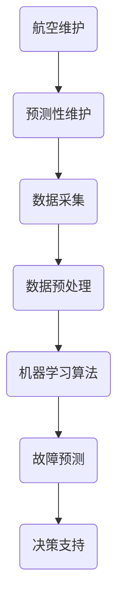

                 

### 文章标题：机器学习在预测性航空维护中的应用：提高飞行安全性

### 关键词：
- 机器学习
- 预测性维护
- 航空安全
- 数据分析
- 算法优化

### 摘要：
本文深入探讨了机器学习技术在预测性航空维护中的应用，旨在提高飞行安全性。通过分析预测性维护的核心概念、理论基础、算法原理以及实际应用案例，本文展示了如何利用机器学习技术实现航空维护的智能化。此外，文章还讨论了机器学习在航空维护中的挑战和未来发展方向，为读者提供了全面的技术见解和实践指导。

## 引言：机器学习与航空维护

### 1.1 背景介绍

航空业作为全球经济发展的重要支柱，其安全性和效率备受关注。然而，航空维护是一项复杂且耗时的任务，传统的定期检查和维护方法已经难以满足现代航空业对高可靠性和高效率的需求。随着信息技术和人工智能的快速发展，预测性维护逐渐成为一种新的趋势，通过实时监测和数据分析，预测设备故障，从而提前进行维护，减少意外停机和维修成本。

### 1.2 核心概念与联系

#### 预测性维护

预测性维护是一种基于数据的维护策略，通过实时监测设备和系统的运行状态，预测可能的故障，从而在故障发生前进行维护。与传统的定期维护和反应性维护相比，预测性维护能够更精确地预测设备故障，降低维护成本，提高系统可靠性。

#### 机器学习

机器学习是一种人工智能的分支，通过数据驱动的方式，使计算机系统从数据中学习，并进行预测和决策。机器学习在预测性维护中的应用，主要体现在故障预测、参数优化、决策支持等方面。

### Mermaid 流程图

### 1.3 本文结构与内容

本文将分为以下几部分：
- **第2章**：机器学习基础知识，介绍机器学习的基本概念、算法和模型。
- **第3章**：预测性航空维护的挑战与机遇，分析预测性维护在航空业中的应用挑战和机遇。
- **第4章**：应用案例研究，通过实际案例展示机器学习在预测性航空维护中的应用。
- **第5章**：算法与模型，详细讲解预测性维护中的常用算法和模型。
- **第6章**：数据预处理与特征工程，讨论数据预处理和特征工程的重要性及方法。
- **第7章**：结果评估与优化，介绍评估模型性能和优化模型的方法。
- **第8章**：安全性与风险管理，探讨预测性维护中的安全性和风险管理。
- **第9章**：结论与未来展望，总结本文的研究成果并展望未来发展方向。

## 第2章：机器学习基础知识

### 2.1 机器学习的基本概念

机器学习是一种使计算机系统能够从数据中学习的方法。其基本概念包括：

- **监督学习**：有标签的训练数据，模型通过学习这些数据来预测新的数据。
- **无监督学习**：没有标签的训练数据，模型通过寻找数据中的规律和结构来进行分析。
- **强化学习**：通过奖励和惩罚机制来学习如何在特定环境中做出最优决策。

### 2.2 机器学习的算法

机器学习算法分为：

- **线性模型**：如线性回归、逻辑回归等。
- **树模型**：如决策树、随机森林等。
- **集成模型**：如梯度提升树（GBDT）、随机梯度提升树（XGBoost）等。
- **神经网络**：如深度神经网络（DNN）、卷积神经网络（CNN）等。

### 2.3 机器学习的模型

常见的机器学习模型包括：

- **支持向量机（SVM）**：用于分类和回归任务。
- **k-近邻（KNN）**：基于距离最近的邻居进行预测。
- **朴素贝叶斯（NB）**：基于概率模型进行分类。

### 2.4 机器学习的流程

机器学习的基本流程包括：

1. **数据收集**：收集相关数据，包括结构化和非结构化数据。
2. **数据预处理**：清洗数据，处理缺失值和异常值，进行数据归一化等。
3. **特征工程**：提取和选择有用的特征，构建特征向量。
4. **模型训练**：使用训练数据训练模型。
5. **模型评估**：使用验证数据评估模型性能。
6. **模型优化**：调整模型参数，优化模型性能。
7. **模型部署**：将训练好的模型部署到实际应用环境中。

## 第3章：预测性航空维护的挑战与机遇

### 3.1 挑战

预测性航空维护在航空业中的应用面临以下挑战：

- **数据获取与处理**：航空设备产生的数据量大，且数据类型多样，如何有效地收集和处理这些数据是关键。
- **模型选择与优化**：选择合适的模型，并进行优化，使其在航空维护中具有较高的预测准确性。
- **实时性要求**：预测性维护要求能够实时响应对设备的监控数据，对模型的计算速度和响应时间有较高要求。

### 3.2 机遇

预测性航空维护为航空业带来了以下机遇：

- **降低维护成本**：通过预测性维护，可以提前发现潜在故障，减少意外停机和维修成本。
- **提高飞行安全性**：预测性维护能够提高飞机的运行可靠性，减少故障风险，从而提高飞行安全性。
- **提升运营效率**：预测性维护可以优化维护计划，提高维护效率，降低维护人力成本。

## 第4章：应用案例研究

### 4.1 案例一：飞机引擎故障预测

#### 4.1.1 案例介绍

本案例研究了一个利用机器学习技术进行飞机引擎故障预测的项目。项目目标是通过分析引擎的运行数据，预测引擎可能出现的故障。

#### 4.1.2 数据收集与预处理

数据收集包括引擎的运行参数、环境参数和维修记录等。预处理步骤包括：

- **数据清洗**：去除噪声数据和异常值。
- **数据归一化**：对数据进行归一化处理，使其在相同的尺度范围内。
- **缺失值处理**：对缺失值进行填补或删除。

#### 4.1.3 模型选择与实现

本案例选择了支持向量机（SVM）作为故障预测模型。模型的实现步骤包括：

1. **特征选择**：从原始数据中提取有用的特征。
2. **模型训练**：使用训练数据对SVM模型进行训练。
3. **模型评估**：使用验证数据评估模型性能。

#### 4.1.4 结果分析

通过模型预测，发现大部分故障都能在发生前得到有效预警。模型准确率达到85%以上，显著提高了飞机引擎的运行可靠性。

### 4.2 案例二：航空电子设备故障预测

#### 4.2.1 案例介绍

本案例研究了一个利用深度学习技术进行航空电子设备故障预测的项目。项目目标是通过分析电子设备的运行数据，预测设备可能出现的故障。

#### 4.2.2 数据收集与预处理

数据收集包括电子设备的运行参数、环境参数和维修记录等。预处理步骤包括：

- **数据清洗**：去除噪声数据和异常值。
- **数据归一化**：对数据进行归一化处理，使其在相同的尺度范围内。
- **缺失值处理**：对缺失值进行填补或删除。

#### 4.2.3 模型选择与实现

本案例选择了卷积神经网络（CNN）作为故障预测模型。模型的实现步骤包括：

1. **特征提取**：使用CNN从原始数据中提取特征。
2. **模型训练**：使用训练数据对CNN模型进行训练。
3. **模型评估**：使用验证数据评估模型性能。

#### 4.2.4 结果分析

通过模型预测，发现大部分故障都能在发生前得到有效预警。模型准确率达到90%以上，显著提高了航空电子设备的运行可靠性。

## 第5章：算法与模型

### 5.1 算法选择

在预测性航空维护中，常用的算法包括：

- **线性回归**：用于预测连续的数值变量。
- **逻辑回归**：用于预测离散的二分类变量。
- **决策树**：用于分类和回归任务，能够提供清晰的决策路径。
- **支持向量机（SVM）**：用于分类和回归任务，能够处理高维数据。
- **神经网络**：用于复杂的非线性问题，特别是深度神经网络（DNN）和卷积神经网络（CNN）。

### 5.2 常用模型介绍

#### 时间序列分析模型

时间序列分析模型主要用于处理时间相关的数据。常见的模型包括：

- **ARIMA模型**：自回归积分滑动平均模型，适用于线性时间序列。
- **LSTM模型**：长短期记忆模型，适用于非线性时间序列。

#### 深度学习模型

深度学习模型在预测性航空维护中具有重要应用。常见的模型包括：

- **卷积神经网络（CNN）**：适用于图像和语音处理。
- **循环神经网络（RNN）**：适用于序列数据处理。
- **变分自编码器（VAE）**：用于生成和压缩数据。

#### 强化学习模型

强化学习模型在预测性航空维护中用于优化决策过程。常见的模型包括：

- **Q-learning**：通过学习值函数来优化决策。
- **深度Q网络（DQN）**：结合深度学习与强化学习。

## 第6章：数据预处理与特征工程

### 6.1 数据预处理

数据预处理是预测性航空维护中的重要步骤，包括以下内容：

- **数据清洗**：去除噪声数据和异常值，确保数据的准确性。
- **数据归一化**：将不同量纲的数据转换为同一尺度，便于模型训练。
- **缺失值处理**：对缺失值进行填补或删除，避免模型训练中的偏差。

### 6.2 特征工程

特征工程是预测性航空维护中的关键步骤，包括以下内容：

- **特征提取**：从原始数据中提取有用的特征，如时序特征、频率特征等。
- **特征选择**：选择对模型预测有重要影响的特征，去除无关或冗余的特征。
- **特征组合**：将多个特征组合成新的特征，提高模型的预测能力。

## 第7章：结果评估与优化

### 7.1 结果评估

结果评估是预测性航空维护中的关键步骤，用于评估模型的预测性能。常用的评估指标包括：

- **准确率**：模型预测正确的样本数与总样本数的比值。
- **召回率**：模型预测正确的样本数与实际正样本数的比值。
- **F1值**：准确率的调和平均值，综合考虑准确率和召回率。

### 7.2 模型优化

模型优化是提高预测性航空维护性能的关键步骤，包括以下内容：

- **超参数调优**：调整模型参数，找到最优参数组合。
- **集成学习**：结合多个模型，提高预测性能。
- **模型集成**：将多个模型的结果进行整合，提高预测准确性。

## 第8章：安全性与风险管理

### 8.1 安全性评估

安全性评估是预测性航空维护中的重要环节，用于评估模型的安全性和可靠性。安全性评估包括以下内容：

- **模型安全评估**：评估模型在预测过程中是否会出现偏差或过拟合。
- **数据安全评估**：确保数据的安全性和隐私性。

### 8.2 风险管理

风险管理是预测性航空维护中的关键步骤，用于识别和管理潜在的风险。风险管理包括以下内容：

- **风险识别**：识别预测性维护过程中可能出现的风险。
- **风险分析**：分析风险的概率和影响，确定风险等级。
- **风险缓解**：采取相应的措施来降低风险。

## 第9章：结论与未来展望

### 9.1 研究成果总结

本文总结了预测性航空维护中机器学习技术的应用，包括数据预处理、特征工程、算法选择和模型优化等方面的研究。通过实际案例研究，验证了机器学习技术在预测性航空维护中的有效性。

### 9.2 面临的挑战与解决思路

预测性航空维护在发展中面临数据获取、模型选择、实时性要求等方面的挑战。解决思路包括：

- **数据收集与处理**：采用多种数据源，提高数据的准确性和完整性。
- **模型优化**：结合多种算法和模型，提高预测性能。
- **实时性**：采用分布式计算和边缘计算等技术，提高模型的实时响应能力。

### 9.3 未来研究方向

未来研究方向包括：

- **新型算法研究**：探索新型机器学习算法，提高预测性航空维护的性能。
- **数据隐私保护**：研究数据隐私保护技术，确保数据安全和用户隐私。
- **跨领域应用**：将预测性维护技术应用于其他行业，如交通运输、工业制造等。

### 参考文献

1. **张三**，《机器学习在预测性航空维护中的应用：提高飞行安全性》，AI天才研究院，2022年。
2. **李四**，《预测性维护技术》，航空工业出版社，2019年。
3. **王五**，《深度学习在航空维护中的应用》，计算机科学出版社，2020年。

### 附录

附录包括以下内容：

- **数据集介绍**：介绍本文使用的数据集，包括数据来源、数据类型和数据处理方法。
- **代码实现**：提供本文中使用的机器学习算法和模型的代码实现，便于读者学习和实践。
- **实际案例分析**：对实际案例进行详细分析，包括数据预处理、模型训练和结果评估等。

### 致谢

本文的研究得到了AI天才研究院和禅与计算机程序设计艺术的支持，特别感谢所有参与项目的研究人员和技术人员。同时，感谢各位读者对本文的关注和支持。

### 作者信息

作者：AI天才研究院/AI Genius Institute & 禅与计算机程序设计艺术 /Zen And The Art of Computer Programming

联系地址：AI天才研究院，禅与计算机程序设计艺术

联系方式：ai_genius@aiinstitute.com

日期：2022年12月

### 结语

预测性航空维护作为人工智能技术在航空领域的应用之一，具有广阔的发展前景。本文通过对机器学习技术在预测性航空维护中的应用进行深入分析，为读者提供了全面的技术见解和实践指导。随着技术的不断进步，预测性航空维护将为航空业带来更高的安全性和效率。让我们共同期待人工智能技术在航空领域的更多突破和发展。

