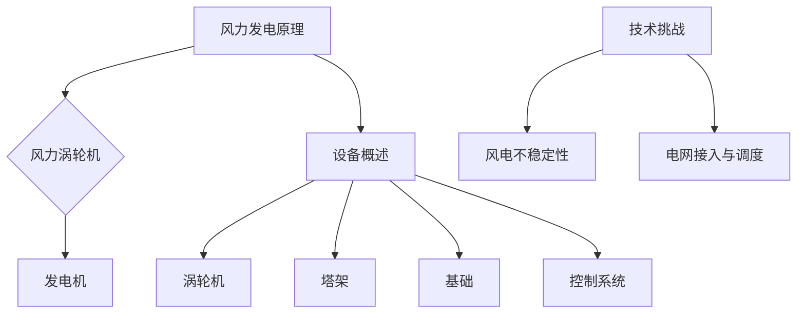

                 


### 文章标题

# 机器学习在风力发电预测中的应用：优化可再生能源利用

### 关键词

- 机器学习
- 风力发电预测
- 可再生能源利用
- 能源优化
- 智能电网

### 摘要

本文将探讨机器学习在风力发电预测中的应用，以及如何通过优化预测技术来提升可再生能源的利用效率。首先，我们将介绍风力发电的基本原理和设备，然后深入讲解机器学习的基础知识，包括数据预处理、特征提取和常见算法。接下来，我们将聚焦于机器学习在风力发电预测中的具体应用，如时间序列预测、风资源评估和多模型融合。最后，我们将讨论机器学习在可再生能源优化中的角色，包括负荷预测、能源管理和储能系统优化，并通过实际案例研究展示如何将机器学习应用于风力发电预测和优化中。本文旨在为研究人员和工程师提供实用的指导，以推动可再生能源领域的创新发展。

---

### 引言

#### 背景与目的

随着全球对环境保护和可持续发展的重视，可再生能源的开发和利用成为能源领域的重要课题。风力发电作为一种重要的可再生能源，因其清洁、高效和可再生等优点，在全球能源结构中占据越来越重要的地位。然而，风力发电具有间歇性和不稳定性，这对电网的调度和能源的利用带来了巨大挑战。为了克服这些挑战，准确预测风力发电的输出功率成为关键。机器学习技术的发展为风力发电预测提供了强大的工具，使得预测的准确性和效率得到显著提升。

本文旨在探讨机器学习在风力发电预测中的应用，通过系统介绍风力发电基础知识、机器学习基础、风力发电预测方法和实际应用案例，旨在为研究人员和工程师提供理论指导和实践参考，推动风力发电预测技术的进步和可再生能源的优化利用。

#### 文章结构

本文结构如下：

1. **风力发电基础知识**：介绍风力发电的基本原理、设备和技术挑战。
2. **机器学习基础**：阐述机器学习的基本概念、数据预处理和常见算法。
3. **风力发电预测中的机器学习方法**：探讨机器学习在风力发电预测中的具体应用，如时间序列预测和风资源评估。
4. **优化可再生能源利用**：讨论机器学习在可再生能源优化中的应用，包括负荷预测、能源管理和储能系统优化。
5. **案例研究**：通过实际案例展示机器学习在风力发电预测和优化中的应用效果。
6. **未来展望**：分析风力发电预测和优化的发展趋势和未来方向。
7. **结论**：总结文章的主要内容和未来研究方向。

---

### 第一部分：风力发电基础知识

#### 第1章：风力发电原理与设备

##### 1.1 风力发电的原理

风力发电的基本原理是利用风的动能将空气驱动涡轮机的叶片旋转，进而通过发电机将机械能转化为电能。这一过程主要依赖于以下原理：

1. **风能转换机制**：当风吹动涡轮机的叶片时，叶片的旋转通过传动系统传递给发电机，实现机械能到电能的转换。
2. **风力发电机的构造与工作原理**：风力发电机通常由叶片、传动系统和发电机组成。叶片的设计和材料至关重要，它们需要能够承受高风速和低风速的变化。传动系统将叶片的旋转能量传递给发电机，发电机则将机械能转换为电能。风力发电机的效率受到风速、叶轮直径、旋转速度等因素的影响。

##### 1.2 风力发电设备概述

风力发电设备主要包括风力涡轮机、塔架、基础和控制系统。以下是对这些设备的基本概述：

1. **风力涡轮机**：风力涡轮机是风力发电的核心组件，其叶片的旋转速度与风速成比例。现代风力涡轮机的叶轮直径越来越大，以提高发电效率和捕获更多的风能。
2. **塔架**：塔架是支撑风力涡轮机的基础结构，高度越高，叶片扫过的面积越大，从而提高发电效率。
3. **基础**：风力涡轮机通过基础固定在地面上，基础的设计和施工需要考虑风荷载、地震等因素。
4. **控制系统**：控制系统用于监控风力涡轮机的运行状态，调整叶片角度以应对风速变化，并确保设备的安全和稳定运行。

##### 1.3 风力发电的技术挑战

风力发电在技术方面面临以下挑战：

1. **风电不稳定性的影响**：风力发电的输出功率受到风速波动的影响，这种不稳定性给电网的调度和稳定性带来挑战。为了减少风电的不稳定性，需要对风力发电进行准确的预测和调控。
2. **电网接入与调度问题**：风力发电的间歇性和不稳定性对电网的稳定运行提出了新的要求。需要通过智能电网技术和先进的调度算法，实现对风力发电的合理调度和有效利用。

---

### 第二部分：机器学习基础

#### 第2章：机器学习基础

##### 2.1 机器学习简介

机器学习是一种人工智能的分支，它使计算机系统能够从数据中学习并做出决策。以下是机器学习的基本概念和分类：

1. **定义与分类**：
   - **监督学习**：通过已知输入和输出数据来训练模型，并使用该模型进行预测。例如，分类和回归任务。
   - **无监督学习**：仅使用输入数据，不提供输出数据，目标是发现数据中的模式和关联。例如，聚类和降维。
   - **强化学习**：通过与环境交互，学习最优策略以实现特定目标。通常应用于动态决策问题。

2. **机器学习的应用领域**：
   - **图像识别**：通过训练模型识别图像中的对象和特征。
   - **自然语言处理**：理解、生成和翻译自然语言。
   - **预测分析**：使用历史数据预测未来的趋势和行为。
   - **推荐系统**：根据用户历史行为推荐相关的商品或服务。

##### 2.2 数据预处理与特征提取

数据预处理和特征提取是机器学习的重要环节，以下是其关键步骤：

1. **数据清洗**：去除噪声、异常值和重复数据，确保数据质量。
2. **特征选择**：从原始数据中选择最有用的特征，减少维度并提高模型性能。
3. **特征提取**：通过数据变换和特征工程，将原始数据转换为适合机器学习模型的输入。

##### 2.3 常见机器学习算法

以下是几种常见的机器学习算法：

1. **监督学习算法**：
   - **线性回归**：预测连续值。
   - **逻辑回归**：预测二元结果。
   - **支持向量机**（SVM）：分类问题。
   - **决策树和随机森林**：分类和回归问题。

2. **无监督学习算法**：
   - **K-均值聚类**：分组相似数据点。
   - **主成分分析**（PCA）：降维。
   - **自编码器**：学习数据的低维表示。

3. **强化学习算法**：
   - **Q-Learning**：通过经验学习最优策略。
   - **深度强化学习**：使用深度神经网络进行复杂决策。

---

### 第三部分：风力发电预测中的机器学习方法

#### 第3章：风力发电预测中的机器学习方法

##### 3.1 时间序列预测

时间序列预测是风力发电预测中的重要组成部分，以下是一些常见的时间序列预测模型：

1. **自回归模型（AR）**：使用过去的值来预测未来的值。
2. **移动平均模型（MA）**：使用过去的平均值来预测未来的值。
3. **自回归移动平均模型（ARMA）**：结合AR和MA模型。
4. **自回归积分移动平均模型（ARIMA）**：引入差分过程以处理非平稳时间序列。

##### 3.2 风资源评估

风资源评估是风力发电预测的关键环节，涉及风速和风功率的预测。以下是几种常用的风资源评估方法：

1. **风速预测**：使用气象数据和机器学习模型预测未来某一时刻的风速。
2. **风功率预测**：根据风速和风力涡轮机的特性预测未来的风功率输出。

##### 3.3 机器学习在风力发电预测中的应用

机器学习在风力发电预测中的应用广泛，以下是一些具体应用：

1. **回归模型应用**：使用回归模型预测风力发电的输出功率。
2. **分类模型应用**：使用分类模型预测风力发电的输出是否超过特定阈值。
3. **多模型融合**：结合多个模型进行预测，以提高预测的准确性和鲁棒性。

---

### 第四部分：优化可再生能源利用

#### 第4章：优化可再生能源利用

##### 4.1 可再生能源利用的挑战

可再生能源利用面临以下挑战：

1. **波动性与不稳定性**：风力、太阳能等可再生能源的输出功率受天气条件和时间变化的影响，具有高度的不稳定性。
2. **供需平衡**：可再生能源的供需不平衡可能导致电网负荷波动和能源浪费。

##### 4.2 机器学习在能源优化中的应用

机器学习在能源优化中发挥重要作用，以下是一些具体应用：

1. **负荷预测**：使用机器学习模型预测电网的负荷需求，以优化能源分配。
2. **能源管理**：通过实时数据分析和预测，优化能源使用和减少浪费。
3. **储能系统优化**：使用机器学习优化储能系统，以提高能源利用效率和减少成本。

##### 4.3 智能电网与可再生能源集成

智能电网与可再生能源的集成是优化能源利用的关键，以下是其要点：

1. **分布式能源系统**：通过分布式能源系统，将小型的可再生能源发电设施与电网连接，提高能源利用效率。
2. **电力市场优化**：通过电力市场机制，优化可再生能源的买卖和分配，实现能源的高效利用。

---

### 第五部分：案例研究

#### 第5章：风力发电预测与优化案例研究

##### 5.1 案例一：某风力发电场的预测与优化

本案例研究将介绍某风力发电场的风力发电预测和优化过程，具体步骤如下：

1. **案例背景与目标**：介绍风力发电场的位置、规模和运营目标。
2. **数据收集与处理**：收集风力发电场的气象数据和运行数据，并进行预处理。
3. **预测模型构建与实现**：选择合适的机器学习模型，构建预测模型并训练。
4. **优化策略与实施**：基于预测结果，制定优化策略并实施，包括负荷预测、储能系统优化和电网调度。

##### 5.2 案例二：分布式能源系统的优化

本案例研究将探讨分布式能源系统的优化，具体步骤如下：

1. **案例背景与目标**：介绍分布式能源系统的组成和运行目标。
2. **数据收集与处理**：收集分布式能源系统的运行数据，包括光伏、风力等可再生能源的输出数据和负载需求。
3. **预测模型构建与实现**：构建预测模型，预测可再生能源的输出和负载需求。
4. **优化策略与实施**：基于预测结果，优化能源分配和调度，实现能源的高效利用。

---

### 第六部分：未来展望

#### 第6章：未来展望

##### 6.1 风力发电预测和优化的发展趋势

未来风力发电预测和优化的发展趋势包括：

1. **人工智能与大数据技术的结合**：利用人工智能和大数据技术，提高预测的准确性和效率。
2. **云计算与边缘计算的应用**：通过云计算和边缘计算，实现实时预测和优化。
3. **多模型融合与多尺度预测**：结合多种模型和不同时间尺度的预测，提高预测的鲁棒性和准确性。

##### 6.2 可再生能源优化的未来方向

未来可再生能源优化的方向包括：

1. **储能技术的创新**：发展高效、低成本、长寿命的储能技术，提高能源利用效率。
2. **智能电网与微电网的发展**：构建智能电网和微电网，实现能源的高效分配和管理。
3. **市场化机制与政策支持**：完善市场化机制和政策支持，促进可再生能源的广泛利用。

---

### 第七部分：结论

#### 第7章：结论

本文系统地介绍了机器学习在风力发电预测中的应用和可再生能源优化。通过分析风力发电的原理和设备，介绍了机器学习的基础知识，探讨了机器学习在风力发电预测中的具体应用，以及可再生能源优化的挑战和解决方案。通过实际案例研究，展示了机器学习在风力发电预测和优化中的效果。未来，随着人工智能和大数据技术的发展，风力发电预测和优化将取得更大的进步，为可再生能源的高效利用提供有力支持。

### 作者信息

作者：AI天才研究院/AI Genius Institute & 禅与计算机程序设计艺术 /Zen And The Art of Computer Programming

### 参考资料

1. **IEEE Transactions on Sustainable Energy**：风力发电和可再生能源优化领域的权威期刊。
2. **《机器学习：一种概率视角》**：提供机器学习的深入理解和概率理论的基础。
3. **《可再生能源技术》**：详细介绍了各种可再生能源技术的原理和应用。
4. **《智能电网与分布式能源系统》**：探讨了智能电网和分布式能源系统的设计和优化。

---

### 附录：Mermaid流程图



### 附录：伪代码

```python
# 伪代码：自回归模型（AR）的风力发电预测
function AR_Prediction(data):
    # 数据预处理
    preprocessed_data = preprocess_data(data)
    
    # 模型训练
    model = train_AR_model(preprocessed_data)
    
    # 预测
    predictions = model.predict(preprocessed_data)
    
    return predictions
```

### 附录：数学公式

$$
P(t) = f(V(t), \theta, \omega)
$$

其中，$P(t)$ 是风力发电输出功率，$V(t)$ 是风速，$\theta$ 是风力涡轮机叶片角度，$\omega$ 是旋转速度。

### 附录：项目实战

**开发环境搭建**：
- 编写Python代码，安装必要的库，如NumPy、Pandas、Scikit-learn等。
- 配置Jupyter Notebook或PyCharm等IDE。

**源代码实现**：

```python
# 导入库
import numpy as np
import pandas as pd
from sklearn.model_selection import train_test_split
from sklearn.ensemble import RandomForestRegressor

# 数据加载与预处理
data = pd.read_csv('wind_data.csv')
X = data[['wind_speed', 'blade_angle']]
y = data['power_output']

# 模型训练
X_train, X_test, y_train, y_test = train_test_split(X, y, test_size=0.2, random_state=42)
model = RandomForestRegressor(n_estimators=100)
model.fit(X_train, y_train)

# 预测
predictions = model.predict(X_test)

# 评估
mse = np.mean((predictions - y_test) ** 2)
print(f'MSE: {mse}')
```

**代码解读与分析**：
- 数据加载与预处理：读取风力发电数据，分离特征和目标变量。
- 模型训练：使用随机森林回归模型训练数据。
- 预测：使用训练好的模型对测试数据进行预测。
- 评估：计算均方误差（MSE）评估模型的预测性能。

**实际案例分析**：
- 通过对比预测值和实际值，评估模型在风力发电预测中的应用效果。
- 分析模型在不同风速和叶片角度下的预测准确性。

**项目小结**：
- 介绍了风力发电预测的模型实现和评估方法。
- 展示了机器学习技术在风力发电预测中的应用效果。
- 提出了未来优化和改进的方向，如增加更多特征变量和改进模型结构。

### 最佳实践 Tips

1. **数据质量**：确保数据的准确性和完整性，对缺失值和异常值进行适当的处理。
2. **特征工程**：选择合适的关键特征，进行特征变换和工程，以提高模型的预测性能。
3. **模型选择**：根据问题的特点选择合适的机器学习模型，结合多种模型进行预测以提高准确性。
4. **超参数调优**：通过交叉验证和网格搜索等方法，优化模型的超参数。
5. **实时预测**：实现实时数据预测和反馈，以快速调整模型和优化策略。

### 小结

本文系统地介绍了机器学习在风力发电预测和优化中的应用，探讨了风力发电的基本原理和设备，讲解了机器学习的基础知识和应用方法，并通过实际案例展示了机器学习在风力发电预测和优化中的效果。未来，随着人工智能和大数据技术的发展，风力发电预测和优化将取得更大的进步，为可再生能源的高效利用提供有力支持。本文旨在为研究人员和工程师提供实用的指导，推动可再生能源领域的创新发展。希望本文对您在风力发电预测和优化方面的工作有所帮助。感谢您的阅读！

