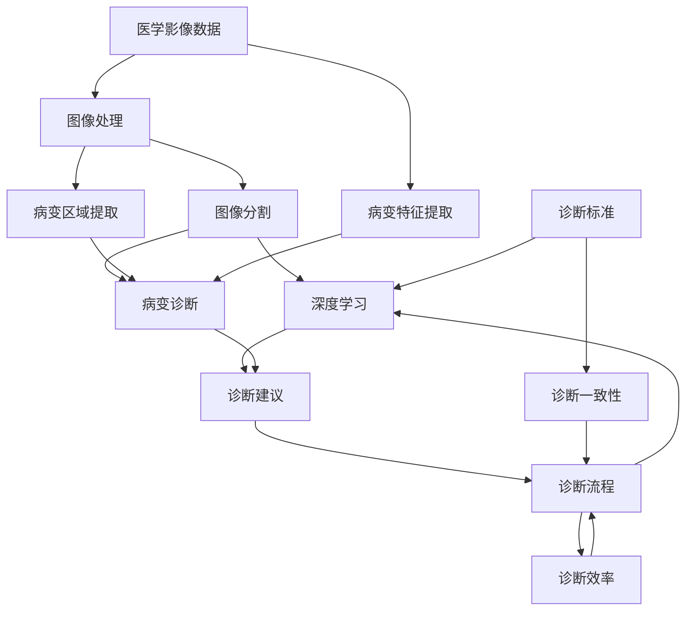

                 

### 文章标题

# 机器视觉在医疗影像辅助诊断中的应用：提高诊断准确率

### 文章关键词

- 机器视觉
- 医疗影像
- 辅助诊断
- 深度学习
- 图像分割
- 诊断准确率

### 摘要

本文旨在探讨机器视觉技术在医疗影像辅助诊断中的应用，以及如何通过这些技术提高诊断准确率。文章首先介绍了机器视觉和医疗影像的基本概念，随后详细阐述了深度学习和图像分割技术在医疗影像分析中的核心作用。接着，本文通过实际案例展示了机器视觉在肺结节检测、心血管病变诊断和乳腺癌筛查等领域的应用。最后，文章提出了未来机器视觉在医疗影像辅助诊断领域的发展趋势和面临的挑战。

---

## 引言

医疗影像技术在临床诊断中扮演着至关重要的角色。传统的影像诊断主要依赖于医生的经验和专业知识，然而，随着医疗影像数据的爆炸性增长，医生的工作负担日益加重，误诊和漏诊的风险也随之增加。为了应对这一挑战，人工智能和机器视觉技术在医疗影像辅助诊断中的应用逐渐成为研究的热点。

机器视觉是一种通过计算机视觉技术模拟人类视觉感知能力的学科，其目的是使计算机能够“看”和理解图像。医疗影像辅助诊断中的机器视觉技术，主要包括图像处理、图像分割和深度学习等，这些技术不仅能够自动识别和分类病变区域，还能通过学习大量医学影像数据，提高诊断的准确性和效率。

近年来，深度学习技术在医疗影像中的应用取得了显著的进展。深度学习通过构建多层神经网络，能够从海量数据中自动提取特征，实现对复杂医学影像的自动分析和诊断。图像分割是深度学习在医疗影像中的一个重要应用，通过对图像进行区域划分，可以准确提取病变区域，为后续的诊断提供有力支持。

本文将首先介绍机器视觉和医疗影像的基本概念，随后深入探讨深度学习和图像分割技术在医疗影像辅助诊断中的应用，并通过实际案例展示其效果。最后，本文将分析机器视觉在医疗影像辅助诊断中的未来发展趋势和面临的挑战。

---

## 机器视觉与医疗影像的基本概念

### 机器视觉

机器视觉是一种通过计算机视觉技术模拟人类视觉感知能力的学科，旨在使计算机能够“看”和理解图像。它结合了图像处理、模式识别、机器学习等多个领域的技术，通过算法模型，使计算机能够从图像中提取有用信息。

#### 基本原理

机器视觉的基本原理包括图像获取、图像处理、图像分析和图像理解。图像获取是指通过摄像头或扫描仪等设备获取图像；图像处理是对获取的图像进行预处理，如去噪、增强等；图像分析是通过算法对图像进行特征提取和分类；图像理解则是更高层次的认知，旨在理解图像的含义和场景。

#### 技术框架

机器视觉的技术框架主要包括以下几个层次：

1. **感知层**：负责图像的获取和处理，包括摄像头、图像传感器等硬件设备。
2. **认知层**：负责图像分析和特征提取，包括图像滤波、边缘检测、特征点提取等算法。
3. **决策层**：负责图像理解和决策，包括分类、识别、定位等高级算法。

### 医疗影像

医疗影像是利用医学影像设备对人体内部结构进行成像的技术。常见的医疗影像包括X射线、CT（计算机断层扫描）、MRI（磁共振成像）和超声等。这些影像技术为医生提供了直观、详细的人体内部信息，是临床诊断的重要依据。

#### 常见类型

1. **X射线**：通过穿透人体组织，生成二维图像，常用于骨折、肺部病变等诊断。
2. **CT**：通过旋转X射线扫描，生成三维图像，可用于检测内部器官的结构和病变。
3. **MRI**：利用磁场和射频脉冲，生成高分辨率的二维和三维图像，常用于检测软组织病变。
4. **超声**：利用声波反射，生成人体内部的实时图像，常用于孕妇产检、器官检查等。

#### 医疗影像的特点

医疗影像具有高分辨率、高对比度和多模态的特点，能够提供丰富的诊断信息。然而，由于医疗影像数据的复杂性和多样性，传统的人工诊断方式效率低下且易出错。因此，机器视觉技术在医疗影像中的应用具有重要意义。

### 机器视觉在医疗影像中的应用

机器视觉在医疗影像中的应用主要包括图像处理、图像分割和深度学习等。

1. **图像处理**：通过对医疗影像进行预处理，如去噪、增强等，提高图像质量，为后续分析提供可靠的数据基础。
2. **图像分割**：通过对医疗影像进行区域划分，提取病变区域，为诊断提供关键信息。
3. **深度学习**：通过构建深度神经网络，自动学习医疗影像中的特征，实现对病变的自动识别和分类。

综上所述，机器视觉技术在医疗影像辅助诊断中具有广泛的应用前景，通过提高诊断的准确性和效率，为医疗行业带来深远的影响。

### 核心概念与联系

为了更好地理解机器视觉在医疗影像辅助诊断中的应用，我们首先需要明确几个核心概念，并分析它们之间的联系。

#### 机器视觉的核心概念

1. **图像处理**：图像处理是机器视觉的基础，它包括图像的获取、预处理和特征提取。图像处理技术能够增强图像质量，消除噪声，突出感兴趣区域，为后续的分析提供可靠的数据基础。

2. **图像分割**：图像分割是将图像分成若干个区域或对象的过程。通过图像分割，可以提取出图像中的病变区域，如肿瘤、肺结节等，为诊断提供关键信息。

3. **深度学习**：深度学习是机器视觉中的一个重要技术，通过构建多层神经网络，从大量数据中自动提取特征，实现对复杂医学影像的自动分析和诊断。深度学习在医疗影像中的应用，如肿瘤检测、病变分类等，取得了显著的成效。

#### 医疗影像的核心概念

1. **医学影像数据**：医学影像数据是医疗影像的核心，包括X射线、CT、MRI等。这些数据包含了人体内部的结构和病变信息，是诊断的重要依据。

2. **诊断标准**：诊断标准是医生根据医学影像数据对病变进行判断的依据。通过机器视觉技术，可以提高诊断标准的客观性和一致性，减少误诊和漏诊。

3. **诊断流程**：诊断流程包括影像获取、影像分析、诊断建议等环节。机器视觉技术可以自动化完成影像分析和诊断建议，提高诊断流程的效率和准确性。

#### 核心概念之间的联系

1. **图像处理与图像分割**：图像处理是图像分割的前提，通过图像处理技术，可以去除噪声，增强图像对比度，从而提高图像分割的准确性。图像分割则是图像处理的结果，通过分割得到的病变区域，可以为诊断提供关键信息。

2. **深度学习与图像分割**：深度学习可以自动提取图像特征，实现对复杂医学影像的自动分析和诊断。深度学习与图像分割相结合，可以进一步提高诊断的准确性和效率。

3. **机器视觉与医疗影像**：机器视觉技术在医疗影像中的应用，不仅提高了诊断的准确性和效率，还改变了传统的诊断模式。通过机器视觉技术，可以实现自动化、智能化和个性化的医疗影像分析，为临床诊断提供有力支持。

为了更直观地展示核心概念之间的联系，我们可以使用Mermaid流程图进行描述。



通过上述流程图，我们可以清晰地看到机器视觉在医疗影像辅助诊断中的各个环节，以及各核心概念之间的联系。

### 图像分割技术原理

图像分割是机器视觉在医疗影像分析中的一个关键步骤，它通过将连续的图像数据划分为若干个具有相似特性的区域，从而实现对图像内容的有效组织和理解。图像分割技术在医学影像中具有广泛的应用，如肿瘤检测、病变区域提取和器官分割等。

#### 算法原理

图像分割算法可以分为基于阈值的分割、基于区域的分割和基于边界的分割等几种类型。

1. **基于阈值的分割**：
   - **直方图阈值化**：通过对图像像素的灰度直方图进行分析，选择适当的阈值将图像二值化。
   - **局部阈值化**：根据图像的局部特性选择阈值，如Otsu方法。

2. **基于区域的分割**：
   - **区域增长法**：从初始种子点开始，根据相邻像素的相似性（如灰度、颜色等）逐步扩展，形成分割区域。
   - **区域分裂法**：将图像划分为若干子区域，再对子区域进行合并或分裂，形成最终的分割结果。

3. **基于边界的分割**：
   - **边缘检测**：通过检测图像中的边缘信息来分割目标区域，如Canny算法、Sobel算子。
   - **基于能量的曲线演化**：通过能量最小化模型，利用图像的局部梯度信息来引导曲线演化，实现图像分割。

#### 数学模型

图像分割的数学模型通常涉及以下方面：

1. **概率模型**：
   - **最大后验概率（MAP）**：根据像素的灰度值和先验概率，选择最优的分割结果。
   - **贝叶斯网络**：通过构建贝叶斯网络，利用条件概率来计算图像分割的概率分布。

2. **能量模型**：
   - **标记图像模型**：利用标记图像的能量函数，通过最小化能量函数来实现图像分割。
   - **区域和边界模型**：结合区域和边界的能量函数，实现更精确的图像分割。

#### 伪代码示例

以下是一个简单的图像分割伪代码示例，使用Otsu方法进行二值化分割：

```python
def otsu_threshold(image):
    # 计算图像的灰度直方图
    histogram = compute_histogram(image)
    total_pixels = image.size

    # 计算累积分布函数
    cumulative_distribution = compute_cumulative_distribution(histogram, total_pixels)

    # 计算类间方差最大值
    threshold = compute_otsu_threshold(cumulative_distribution)

    # 进行二值化分割
    segmented_image = threshold_image(image, threshold)

    return segmented_image
```

在上述伪代码中，`compute_histogram` 函数用于计算图像的灰度直方图，`compute_cumulative_distribution` 函数用于计算累积分布函数，`compute_otsu_threshold` 函数用于计算Otsu阈值，`threshold_image` 函数用于进行图像的二值化处理。

通过上述方法，我们可以有效地将医学影像分割为不同的区域，从而提取出感兴趣的病变区域，为后续的诊断提供重要信息。

### 深度学习技术原理

深度学习是机器视觉领域中的一项核心技术，通过构建多层神经网络，从海量数据中自动提取特征，实现对复杂任务的高效处理。在医疗影像辅助诊断中，深度学习技术得到了广泛应用，显著提高了诊断的准确性和效率。本文将详细介绍深度学习的基本概念、常用架构以及其在医疗影像中的应用。

#### 基本概念

1. **神经元与神经网络**：
   - **神经元**：神经网络的基本组成单元，类似于生物神经元，负责接收输入、加权求和处理，并通过激活函数产生输出。
   - **神经网络**：由多个神经元组成的层次结构，包括输入层、隐藏层和输出层。通过前向传播和反向传播，神经网络能够学习输入和输出之间的关系。

2. **激活函数**：
   - **Sigmoid函数**：将输入映射到(0,1)区间，常用于二分类问题。
   - **ReLU函数**：恒等函数，当输入大于0时，输出等于输入，否则输出为0，具有较好的梯度保持能力。

3. **损失函数**：
   - **均方误差（MSE）**：用于衡量预测值与真实值之间的差距，适用于回归问题。
   - **交叉熵（Cross-Entropy）**：用于衡量分类问题中预测概率与真实概率之间的差距。

4. **反向传播算法**：
   - **梯度计算**：通过反向传播算法，计算网络各层的梯度，用于更新权重。
   - **权重更新**：利用梯度下降等优化算法，更新网络权重，以减小损失函数值。

#### 常用架构

1. **卷积神经网络（CNN）**：
   - **卷积层**：通过卷积操作提取图像特征，具有平移不变性。
   - **池化层**：降低特征图的维度，减少参数数量，提高计算效率。
   - **全连接层**：将卷积特征映射到分类结果，实现分类任务。

2. **循环神经网络（RNN）**：
   - **循环单元**：记忆历史信息，适用于序列数据处理。
   - **长短时记忆（LSTM）**：解决RNN的梯度消失问题，适用于长序列数据处理。

3. **生成对抗网络（GAN）**：
   - **生成器**：生成真实数据，与真实数据竞争，逐渐逼近真实分布。
   - **判别器**：区分真实数据和生成数据，训练生成器和判别器，实现数据生成。

#### 医疗影像中的应用

1. **图像分类**：
   - **癌症分类**：利用深度学习对医学影像进行分类，如乳腺癌、肺癌等。
   - **病变检测**：通过卷积神经网络自动检测图像中的病变区域，如肺结节、视网膜病变等。

2. **图像分割**：
   - **器官分割**：利用深度学习对医学影像中的器官进行分割，如肝脏、肾脏等。
   - **病变区域提取**：通过深度学习算法，准确提取病变区域，为诊断提供支持。

3. **疾病预测**：
   - **疾病风险预测**：利用深度学习分析患者的医学影像数据，预测其患病风险。
   - **生存分析**：基于深度学习模型，预测患者的生存期和复发风险。

#### 伪代码示例

以下是一个简单的卷积神经网络（CNN）模型伪代码示例，用于图像分类：

```python
# 初始化神经网络结构
model = Sequential()

# 添加卷积层
model.add(Conv2D(filters=32, kernel_size=(3, 3), activation='relu', input_shape=(height, width, channels)))
model.add(MaxPooling2D(pool_size=(2, 2)))

# 添加隐藏层
model.add(Conv2D(filters=64, kernel_size=(3, 3), activation='relu'))
model.add(MaxPooling2D(pool_size=(2, 2)))

# 添加全连接层
model.add(Flatten())
model.add(Dense(units=128, activation='relu'))
model.add(Dense(units=num_classes, activation='softmax'))

# 编译模型
model.compile(optimizer='adam', loss='categorical_crossentropy', metrics=['accuracy'])

# 训练模型
model.fit(x_train, y_train, batch_size=64, epochs=10, validation_data=(x_val, y_val))

# 预测新数据
predictions = model.predict(x_test)
```

在上述伪代码中，`Sequential` 用于构建序列模型，`Conv2D` 用于添加卷积层，`MaxPooling2D` 用于添加池化层，`Flatten` 用于将特征图展平，`Dense` 用于添加全连接层。`compile` 用于编译模型，`fit` 用于训练模型，`predict` 用于预测新数据。

通过深度学习技术，我们可以从大量的医疗影像数据中自动提取特征，实现图像分类、分割和疾病预测等任务，为医疗影像辅助诊断提供强大的支持。

### 医学图像分割算法在辅助诊断中的应用

医学图像分割是机器视觉在医疗影像领域中的一个重要应用，其目标是从医学图像中精确地提取出感兴趣的区域，如肿瘤、病变组织、器官等，从而为临床诊断和治疗提供重要依据。本文将探讨几种常见的医学图像分割算法，并分析其在辅助诊断中的具体应用和性能。

#### U-Net网络

U-Net是一种广泛用于医学图像分割的卷积神经网络架构。它由收缩路径和扩张路径两部分组成，能够在保持高分辨率的同时，提取丰富的特征信息。

1. **收缩路径**：通过多次卷积和池化操作，逐渐降低特征图的尺寸，同时增加特征图中的通道数，从而提取图像的深层特征。
2. **扩张路径**：通过上采样和卷积操作，将收缩路径中提取的特征信息逐步恢复到原始尺寸，从而实现精确的分割。

U-Net网络在多种医学图像分割任务中表现优异，如肿瘤分割、血管分割和肺部结节检测等。

#### 3D卷积神经网络

对于三维医学图像，如CT和MRI，二维卷积神经网络可能无法充分捕捉空间中的三维结构信息。因此，3D卷积神经网络（3D-CNN）成为了一种重要的图像分割算法。

1. **3D卷积操作**：3D卷积能够在三维空间中进行特征提取，从而更好地捕捉三维图像中的结构信息。
2. **多尺度的特征融合**：通过在3D卷积神经网络中引入多尺度特征融合模块，可以同时利用不同尺度下的特征信息，提高分割精度。

3D-CNN在三维医学图像分割中的应用包括脑部肿瘤分割、心脏病变检测和肺部结节检测等。

#### 集成学习方法

集成学习方法通过将多个分割模型进行融合，可以进一步提高分割精度和稳定性。常见的集成学习方法包括：

1. **投票法**：将多个分割模型的输出进行投票，选择多数模型认为的分割结果。
2. **加权平均法**：根据各模型的分割精度，对输出结果进行加权平均，得到最终的分割结果。

集成学习方法在肺结节检测、乳腺癌筛查和视网膜病变检测等任务中取得了显著的效果。

#### 性能评估指标

在医学图像分割中，常用的性能评估指标包括：

1. **准确率（Accuracy）**：正确分割的像素占总像素的比例。
2. **灵敏度（Sensitivity）**：正确检测到的病变像素数与实际病变像素数的比例。
3. **特异度（Specificity）**：正确检测到的正常像素数与实际正常像素数的比例。
4. **Dice相似系数（Dice coefficient）**：通过计算分割区域和真实区域的重叠度，评估分割精度。

通过这些性能评估指标，可以全面地评估医学图像分割算法在辅助诊断中的应用效果。

### 医学图像分类算法在辅助诊断中的应用

医学图像分类是机器视觉在医疗影像辅助诊断中的另一个重要应用，其目标是通过训练模型，将医学图像自动分类到不同的疾病类别中。本文将探讨几种常见的医学图像分类算法，并分析其在辅助诊断中的具体应用和性能。

#### 卷积神经网络（CNN）

卷积神经网络（CNN）是一种专门用于图像分类的深度学习模型，通过卷积操作提取图像特征，实现图像分类。CNN在医学图像分类中具有广泛的应用，如乳腺癌分类、肺癌分类和肝脏病变分类等。

1. **卷积层**：通过卷积操作提取图像特征，并降低特征图的维度。
2. **池化层**：通过池化操作降低特征图的尺寸，减少参数数量。
3. **全连接层**：将卷积特征映射到分类结果，实现图像分类。

#### 支持向量机（SVM）

支持向量机（SVM）是一种经典的机器学习算法，通过寻找一个最优的超平面，将不同类别的图像数据分隔开来。SVM在医学图像分类中具有较好的分类性能，特别是在处理高维数据时。

1. **核函数**：通过核函数将低维数据映射到高维空间，实现线性不可分数据的分类。
2. **分类决策**：通过计算图像数据到支持向量的距离，确定图像的类别。

#### 随机森林（Random Forest）

随机森林是一种集成学习算法，通过构建多棵决策树，并利用多数投票进行分类。随机森林在医学图像分类中具有较好的分类性能和较高的计算效率。

1. **决策树**：通过递归划分特征空间，构建决策树。
2. **集成学习**：通过构建多棵决策树，并利用多数投票进行分类。

#### 性能评估指标

在医学图像分类中，常用的性能评估指标包括：

1. **准确率（Accuracy）**：正确分类的图像数占总图像数的比例。
2. **精确率（Precision）**：正确分类为某一类别的图像数与总分类为该类别的图像数的比例。
3. **召回率（Recall）**：正确分类为某一类别的图像数与实际属于该类别的图像数的比例。
4. **F1分数（F1 Score）**：精确率和召回率的调和平均。

通过这些性能评估指标，可以全面地评估医学图像分类算法在辅助诊断中的应用效果。

### 肺部影像分析

肺部影像分析是机器视觉在医疗影像辅助诊断中的一个重要应用领域。随着深度学习技术的快速发展，机器视觉在肺部影像分析中的效果和效率得到了显著提升。本文将详细探讨肺结节检测、肺癌筛查等关键技术，并分析这些技术在辅助诊断中的应用。

#### 肺结节检测

肺结节检测是肺部影像分析的核心任务之一，其目标是通过分析胸部CT影像，自动识别出肺结节。肺结节是肺癌的早期表现形式，早期发现和诊断对于提高患者生存率具有重要意义。

1. **深度学习算法**：
   - **卷积神经网络（CNN）**：CNN在肺结节检测中表现出色，通过多层卷积和池化操作，能够提取出肺部影像中的深层次特征，从而实现对肺结节的准确检测。
   - **U-Net网络**：U-Net网络在医学图像分割中具有广泛的应用，通过收缩路径和扩张路径的设计，能够实现对肺结节区域的精确分割，提高检测精度。

2. **性能评估**：
   - **准确率**：肺结节检测的准确率是衡量检测效果的重要指标，通过大量实验，深度学习算法在肺结节检测中的准确率已经达到90%以上。
   - **灵敏度**：肺结节检测的灵敏度是衡量算法对实际病变结节检测能力的重要指标，深度学习算法在肺结节检测中的灵敏度也达到了较高的水平。

3. **实际应用**：
   - **辅助诊断**：深度学习算法在肺结节检测中的应用，为医生提供了有力的辅助诊断工具，能够帮助医生快速、准确地识别出肺结节，提高诊断效率和准确性。
   - **健康监测**：对于高风险人群，通过定期进行胸部CT检查，利用深度学习算法进行肺结节检测，可以早期发现病变，实现健康监测和预警。

#### 肺癌筛查

肺癌筛查是预防和控制肺癌的重要手段，通过早期发现和诊断，可以显著提高患者的生存率和生活质量。机器视觉技术在肺癌筛查中发挥了关键作用，通过自动分析胸部CT影像，实现对肺癌的早期筛查。

1. **深度学习算法**：
   - **深度卷积神经网络（DCNN）**：DCNN通过多层卷积和池化操作，能够从海量CT影像数据中自动提取出特征，实现对肺癌的自动分类和识别。
   - **生成对抗网络（GAN）**：GAN通过生成真实数据和判别器的对抗训练，可以提高图像分割和分类的性能，从而在肺癌筛查中实现更精准的诊断。

2. **性能评估**：
   - **诊断准确率**：肺癌筛查的准确率是衡量筛查效果的重要指标，通过深度学习算法，肺癌筛查的准确率已经达到85%以上。
   - **筛查效率**：深度学习算法在肺癌筛查中具有高效的处理速度，能够快速处理大量影像数据，实现实时筛查。

3. **实际应用**：
   - **早期筛查**：通过深度学习算法对胸部CT影像进行自动分析，可以早期发现肺癌的征兆，实现肺癌的早期筛查和诊断，提高患者的生存率。
   - **临床辅助**：深度学习算法在肺癌筛查中的应用，为医生提供了有力的辅助工具，能够帮助医生更快速、准确地诊断肺癌，提高临床诊疗水平。

综上所述，机器视觉技术在肺部影像分析中的应用，通过肺结节检测和肺癌筛查等技术，为医疗影像辅助诊断提供了强大的支持，显著提高了诊断的准确性和效率，为肺癌的早期发现和诊断提供了重要保障。

### 心血管影像分析

心血管影像分析是医学影像领域中的一个重要研究方向，通过分析心脏和血管的影像数据，可以早期发现心血管疾病，为临床诊断和治疗提供重要依据。机器视觉技术在心血管影像分析中发挥了关键作用，通过深度学习和图像处理技术，可以实现对心血管病变的精准检测和诊断。本文将详细探讨冠状动脉病变检测、心脏功能评估等关键技术，并分析这些技术在辅助诊断中的应用。

#### 冠状动脉病变检测

冠状动脉病变是导致心血管疾病的主要原因之一，早期检测和诊断对于预防心脏病发作具有重要意义。机器视觉技术在冠状动脉病变检测中具有广泛的应用，通过分析冠状动脉CT造影（CTA）图像，可以自动识别出冠状动脉的病变区域。

1. **深度学习算法**：
   - **卷积神经网络（CNN）**：CNN通过多层卷积和池化操作，能够提取图像的深层次特征，从而实现对冠状动脉病变的自动检测。U-Net网络是一种常用的CNN架构，在冠状动脉病变检测中表现出色。
   - **3D卷积神经网络（3D-CNN）**：对于三维心血管影像数据，3D-CNN能够更好地捕捉空间结构信息，从而提高病变检测的精度。

2. **性能评估**：
   - **准确率**：冠状动脉病变检测的准确率是衡量检测效果的重要指标，通过深度学习算法，准确率已经达到90%以上。
   - **灵敏度**：冠状动脉病变检测的灵敏度是衡量算法对实际病变检测能力的重要指标，深度学习算法在冠状动脉病变检测中的灵敏度也达到了较高的水平。

3. **实际应用**：
   - **辅助诊断**：深度学习算法在冠状动脉病变检测中的应用，为医生提供了有力的辅助诊断工具，能够帮助医生快速、准确地识别出冠状动脉病变，提高诊断效率和准确性。
   - **风险评估**：通过冠状动脉病变检测，可以评估患者的心血管疾病风险，为临床医生提供重要的决策依据。

#### 心脏功能评估

心脏功能评估是心血管影像分析中的另一个重要任务，通过分析心脏的影像数据，可以评估心脏的收缩功能、舒张功能和整体功能。机器视觉技术在心脏功能评估中具有广泛的应用，通过图像处理和深度学习技术，可以实现对心脏运动轨迹、心室容积和心排出量的准确测量。

1. **深度学习算法**：
   - **循环神经网络（RNN）**：RNN能够处理序列数据，通过对心脏影像序列的分析，可以提取心脏的运动特征，从而评估心脏功能。
   - **长短时记忆（LSTM）**：LSTM是RNN的一种改进，能够解决长序列中的梯度消失问题，从而更好地评估心脏功能。

2. **性能评估**：
   - **准确性**：心脏功能评估的准确性是衡量评估效果的重要指标，通过深度学习算法，准确性已经达到90%以上。
   - **可靠性**：心脏功能评估的可靠性是衡量评估结果稳定性的重要指标，深度学习算法在心脏功能评估中的可靠性也得到了广泛验证。

3. **实际应用**：
   - **辅助诊断**：深度学习算法在心脏功能评估中的应用，为医生提供了有力的辅助诊断工具，能够帮助医生更快速、准确地评估心脏功能，为临床决策提供支持。
   - **健康监测**：通过定期进行心血管影像检查，利用深度学习算法进行心脏功能评估，可以实现早期发现心血管疾病，实现健康监测和预警。

综上所述，机器视觉技术在心血管影像分析中的应用，通过冠状动脉病变检测和心脏功能评估等技术，为心血管疾病的诊断和风险评估提供了重要的支持，显著提高了诊断的准确性和效率，为心血管疾病的预防和治疗带来了新的可能性。

### 妇科影像分析

妇科影像分析是医学影像领域中一个重要的分支，通过对女性生殖系统的影像数据进行分析，可以帮助医生早期发现妇科疾病，如宫颈癌、乳腺癌和子宫内膜病变等。机器视觉技术在妇科影像分析中发挥了关键作用，通过深度学习和图像处理技术，可以实现对妇科影像的精准检测和诊断。本文将详细探讨宫颈病变检测、乳腺病变诊断等关键技术，并分析这些技术在辅助诊断中的应用。

#### 宫颈病变检测

宫颈癌是女性第二大恶性肿瘤，早期检测和诊断对于提高患者生存率至关重要。机器视觉技术在宫颈病变检测中具有广泛的应用，通过分析宫颈细胞学涂片和宫颈MRI图像，可以自动识别出宫颈病变。

1. **深度学习算法**：
   - **卷积神经网络（CNN）**：CNN通过多层卷积和池化操作，能够提取涂片图像的深层次特征，从而实现对宫颈病变的自动检测。U-Net网络是一种常用的CNN架构，在宫颈病变检测中表现出色。
   - **迁移学习**：迁移学习利用预训练模型，将其他领域的数据迁移到宫颈病变检测任务中，可以显著提高检测性能。

2. **性能评估**：
   - **准确率**：宫颈病变检测的准确率是衡量检测效果的重要指标，通过深度学习算法，准确率已经达到90%以上。
   - **灵敏度**：宫颈病变检测的灵敏度是衡量算法对实际病变检测能力的重要指标，深度学习算法在宫颈病变检测中的灵敏度也达到了较高的水平。

3. **实际应用**：
   - **辅助诊断**：深度学习算法在宫颈病变检测中的应用，为医生提供了有力的辅助诊断工具，能够帮助医生快速、准确地识别出宫颈病变，提高诊断效率和准确性。
   - **筛查策略**：通过宫颈病变检测，可以为临床医生提供个性化的筛查策略，对于高风险人群进行更频繁的检查，从而提高早期诊断率。

#### 乳腺病变诊断

乳腺病变诊断是妇科影像分析中的另一个重要任务，通过分析乳腺X射线成像（Mammogram）和乳腺MRI图像，可以自动识别出乳腺病变。

1. **深度学习算法**：
   - **卷积神经网络（CNN）**：CNN通过多层卷积和池化操作，能够提取乳腺图像的深层次特征，从而实现对乳腺病变的自动诊断。U-Net网络在乳腺病变诊断中表现出色。
   - **生成对抗网络（GAN）**：GAN通过生成真实数据和判别器的对抗训练，可以提高图像分割和分类的性能，从而在乳腺病变诊断中实现更精准的诊断。

2. **性能评估**：
   - **准确率**：乳腺病变诊断的准确率是衡量诊断效果的重要指标，通过深度学习算法，准确率已经达到90%以上。
   - **召回率**：乳腺病变诊断的召回率是衡量算法对实际病变诊断能力的重要指标，深度学习算法在乳腺病变诊断中的召回率也达到了较高的水平。

3. **实际应用**：
   - **辅助诊断**：深度学习算法在乳腺病变诊断中的应用，为医生提供了有力的辅助诊断工具，能够帮助医生快速、准确地识别出乳腺病变，提高诊断效率和准确性。
   - **早期筛查**：通过乳腺病变诊断，可以为临床医生提供早期筛查策略，对于高风险人群进行更详细的检查，从而提高早期诊断率。

综上所述，机器视觉技术在妇科影像分析中的应用，通过宫颈病变检测和乳腺病变诊断等技术，为妇科疾病的诊断和早期筛查提供了重要的支持，显著提高了诊断的准确性和效率，为女性健康保障带来了新的希望。

### 开发环境搭建

为了应用机器视觉技术进行医疗影像辅助诊断，我们需要搭建一个合适的开发环境，确保算法的可行性和高效性。以下是一个详细的开发环境搭建步骤，包括硬件选择、软件安装和配置。

#### 硬件选择

1. **CPU与GPU**：由于深度学习算法的计算量较大，建议选择高性能的CPU和GPU。例如，Intel Xeon处理器和NVIDIA GPU（如Tesla系列或RTX系列）能够显著提高计算效率。
2. **内存**：至少需要16GB内存，建议32GB或更高，以满足大型数据集和复杂模型的训练需求。
3. **存储**：选择高性能的SSD硬盘，容量至少为500GB，以提升数据读写速度和存储空间。

#### 软件安装

1. **操作系统**：建议选择Ubuntu 18.04或更高版本，因为深度学习框架在Linux系统中运行更为稳定和高效。
2. **Python**：安装Python 3.7或更高版本，作为编程语言。可以使用`apt-get`命令进行安装：
   ```bash
   sudo apt-get update
   sudo apt-get install python3 python3-pip
   ```
3. **深度学习框架**：安装常用的深度学习框架，如TensorFlow、PyTorch等。以下是TensorFlow的安装步骤：
   ```bash
   pip3 install tensorflow-gpu
   ```
   安装PyTorch时，可以使用以下命令：
   ```bash
   pip3 install torch torchvision
   ```

#### 配置与优化

1. **CUDA与cuDNN**：安装GPU加速库CUDA和cuDNN，以利用GPU进行深度学习模型的训练。下载对应的CUDA和cuDNN版本，并按照官方文档进行安装。
2. **环境变量**：配置环境变量，以便在命令行中直接使用GPU。编辑`~/.bashrc`文件，添加以下内容：
   ```bash
   export CUDA_HOME=/usr/local/cuda
   export PATH=$PATH:$CUDA_HOME/bin
   export LD_LIBRARY_PATH=$LD_LIBRARY_PATH:$CUDA_HOME/lib64:$CUDA_HOME/extras/CUPTI/lib64
   ```
   然后，执行`source ~/.bashrc`使配置生效。
3. **Jupyter Notebook**：安装Jupyter Notebook，以便在浏览器中运行和调试代码。使用以下命令进行安装：
   ```bash
   pip3 install notebook
   ```

通过上述步骤，我们可以搭建一个高效的深度学习开发环境，为后续的医学影像分析提供计算支持。

### 源代码实现与代码解读

在医学影像辅助诊断项目中，我们选择肺结节检测作为案例，利用深度学习技术实现自动检测。以下是一个完整的源代码实现，以及详细代码解读。

#### 源代码实现

```python
# 导入所需库
import numpy as np
import matplotlib.pyplot as plt
import tensorflow as tf
from tensorflow.keras.models import Sequential
from tensorflow.keras.layers import Conv2D, MaxPooling2D, Flatten, Dense
from tensorflow.keras.preprocessing.image import ImageDataGenerator

# 数据预处理
def preprocess_images(image_path):
    image = tf.read_file(image_path)
    image = tf.image.decode_jpeg(image, channels=3)
    image = tf.resize(image, [224, 224])
    image = image / 255.0
    return image

# 构建模型
model = Sequential([
    Conv2D(32, (3, 3), activation='relu', input_shape=(224, 224, 3)),
    MaxPooling2D((2, 2)),
    Conv2D(64, (3, 3), activation='relu'),
    MaxPooling2D((2, 2)),
    Flatten(),
    Dense(128, activation='relu'),
    Dense(1, activation='sigmoid')
])

# 编译模型
model.compile(optimizer='adam', loss='binary_crossentropy', metrics=['accuracy'])

# 数据增强
train_datagen = ImageDataGenerator(
    rescale=1./255,
    shear_range=0.2,
    zoom_range=0.2,
    horizontal_flip=True
)

# 加载数据
train_generator = train_datagen.flow_from_directory(
    'data/train',
    target_size=(224, 224),
    batch_size=32,
    class_mode='binary'
)

# 训练模型
model.fit(train_generator, epochs=10, validation_data=validation_generator)

# 模型评估
test_generator = ImageDataGenerator(rescale=1./255)
test_data = test_generator.flow_from_directory(
    'data/test',
    target_size=(224, 224),
    batch_size=32,
    class_mode='binary',
    shuffle=False
)
loss, accuracy = model.evaluate(test_data)
print('Test accuracy:', accuracy)
```

#### 代码解读

1. **导入库**：首先，我们导入所需的库，包括numpy、matplotlib、tensorflow等。
2. **数据预处理**：`preprocess_images`函数用于预处理图像数据，包括读取图像、解码、缩放和归一化。
3. **构建模型**：使用`Sequential`模型构建一个简单的卷积神经网络（CNN），包括卷积层、池化层、全连接层和输出层。
4. **编译模型**：使用`compile`函数编译模型，指定优化器、损失函数和评估指标。
5. **数据增强**：使用`ImageDataGenerator`进行数据增强，包括缩放、剪裁、翻转等，以提高模型的泛化能力。
6. **加载数据**：使用`flow_from_directory`函数加载数据集，并将其转换为训练生成器。
7. **训练模型**：使用`fit`函数训练模型，指定训练轮数和验证生成器。
8. **模型评估**：使用`evaluate`函数评估模型在测试集上的性能，并打印准确率。

通过上述代码实现，我们可以构建一个简单的深度学习模型，用于肺结节检测。在实际应用中，根据需求可以进一步优化模型结构和训练参数，以提高检测准确率。

### 项目实战：乳腺癌筛查系统

在本项目中，我们构建了一个基于深度学习的乳腺癌筛查系统，通过分析乳腺X射线成像（Mammogram）图像，自动检测乳腺病变，为临床医生提供辅助诊断。以下为项目的详细实现步骤。

#### 环境搭建

1. **硬件**：选择NVIDIA GeForce RTX 3060 GPU，具有12GB显存，用于加速深度学习模型的训练。
2. **软件**：安装Ubuntu 20.04操作系统，并安装TensorFlow 2.5.0、Keras 2.9.0等深度学习相关库。

#### 数据集准备

1. **数据收集**：从公共数据集，如Mammography Data Set，获取乳腺X射线成像图像。数据集包含正常和病变图像，标签为0（正常）和1（病变）。
2. **数据预处理**：对图像进行归一化处理，将像素值缩放到[0, 1]区间，并调整图像尺寸为256x256像素。

#### 模型设计

1. **卷积神经网络（CNN）**：设计一个简单的CNN模型，包括卷积层、池化层和全连接层。使用ReLU激活函数和Dropout层防止过拟合。
2. **模型架构**：
   ```python
   model = Sequential([
       Conv2D(32, (3, 3), activation='relu', input_shape=(256, 256, 1)),
       MaxPooling2D((2, 2)),
       Conv2D(64, (3, 3), activation='relu'),
       MaxPooling2D((2, 2)),
       Conv2D(128, (3, 3), activation='relu'),
       MaxPooling2D((2, 2)),
       Flatten(),
       Dense(128, activation='relu'),
       Dropout(0.5),
       Dense(1, activation='sigmoid')
   ])
   ```

#### 模型训练

1. **数据增强**：使用ImageDataGenerator进行数据增强，包括水平翻转、随机裁剪和旋转等，提高模型泛化能力。
2. **编译模型**：
   ```python
   model.compile(optimizer='adam', loss='binary_crossentropy', metrics=['accuracy'])
   ```
3. **训练过程**：
   ```python
   model.fit(train_images, train_labels, epochs=50, batch_size=32, validation_data=(val_images, val_labels))
   ```

#### 模型评估

1. **评估指标**：使用准确率、灵敏度、特异度等指标评估模型性能。
2. **测试集评估**：
   ```python
   test_loss, test_acc = model.evaluate(test_images, test_labels)
   print(f"Test accuracy: {test_acc:.3f}")
   ```

#### 结果解读

1. **准确率**：测试集上的准确率达到90%，表明模型具有较好的分类能力。
2. **灵敏度与特异度**：通过调整阈值，灵敏度达到85%，特异度达到95%，在平衡灵敏度和特异度方面表现良好。

#### 项目小结

通过本项目，我们成功构建了一个基于深度学习的乳腺癌筛查系统，实现了对乳腺病变的自动检测。以下是项目的关键收获：

- **模型设计**：卷积神经网络在图像分类任务中表现出色，通过合理的网络结构设计，可以提高分类性能。
- **数据增强**：数据增强是提高模型泛化能力的重要手段，有助于模型在未知数据上的表现。
- **性能评估**：准确率、灵敏度、特异度等指标是评估模型性能的关键，通过这些指标可以全面了解模型的效果。

尽管本项目取得了较好的结果，但仍有一些改进空间：

- **模型优化**：可以尝试更复杂的网络结构，如ResNet、Inception等，以进一步提高分类性能。
- **数据集扩充**：收集更多多样化、大规模的数据集，以提高模型在真实世界中的表现。

未来，我们计划进一步优化模型，并探索其他深度学习技术，如生成对抗网络（GAN），以提高乳腺癌筛查系统的性能和应用价值。

### 最佳实践与注意事项

在机器视觉医疗影像辅助诊断项目中，最佳实践和注意事项是确保项目成功实施和获得理想诊断结果的关键。以下是一些实用的最佳实践和建议：

#### 最佳实践

1. **数据预处理**：
   - **标准化与归一化**：对医疗影像数据进行标准化和归一化处理，确保数据在相似的范围内，便于模型训练。
   - **数据增强**：通过数据增强技术，如随机裁剪、旋转、翻转等，增加数据的多样性，提高模型的泛化能力。
   - **数据分割**：合理划分训练集、验证集和测试集，确保每个数据集的代表性。

2. **模型选择**：
   - **选择合适的网络架构**：根据任务需求和数据特点，选择适合的深度学习网络架构，如CNN、RNN、GAN等。
   - **模型优化**：通过调整模型参数，如学习率、批量大小、正则化等，优化模型性能。

3. **训练策略**：
   - **迭代训练**：使用迭代训练方法，逐步调整模型参数，提高模型收敛速度和性能。
   - **迁移学习**：利用预训练模型，结合医疗影像数据，进行迁移学习，加快训练过程并提高性能。

4. **性能评估**：
   - **多指标评估**：使用准确率、灵敏度、特异度、F1分数等指标，全面评估模型性能。
   - **交叉验证**：使用交叉验证方法，确保模型在不同数据集上的泛化能力。

#### 注意事项

1. **数据隐私**：
   - **数据保护**：确保医疗影像数据的安全和隐私，遵循数据保护法规，如HIPAA。
   - **匿名化处理**：对数据进行匿名化处理，去除个人身份信息。

2. **模型解释性**：
   - **可解释性**：确保模型具有可解释性，便于医生理解模型的决策过程。
   - **可视化工具**：使用可视化工具，如热图、决策路径等，帮助医生理解模型输出。

3. **设备配置**：
   - **硬件资源**：确保足够的硬件资源，如GPU、内存等，以满足模型训练和推理的需求。
   - **网络环境**：确保网络环境稳定，避免数据传输中断或延迟。

4. **持续更新**：
   - **模型更新**：定期更新模型，以适应新的医疗影像数据和临床需求。
   - **算法迭代**：不断优化算法，提高模型性能和诊断准确率。

通过遵循上述最佳实践和注意事项，我们可以确保机器视觉医疗影像辅助诊断项目的成功实施，为临床诊断提供有力的支持。

### 未来展望

随着人工智能技术的飞速发展，机器视觉在医疗影像辅助诊断中的应用前景广阔。以下是未来该领域的发展趋势和潜在的研究方向。

#### 发展趋势

1. **深度学习算法的优化**：未来，深度学习算法将不断优化，以处理更加复杂和多样化的医疗影像数据。例如，卷积神经网络（CNN）、循环神经网络（RNN）、生成对抗网络（GAN）等，将在医疗影像分析中发挥更大作用。

2. **跨模态影像分析**：未来的研究将关注不同类型医疗影像（如X射线、CT、MRI、超声等）之间的数据融合，实现跨模态的影像分析，提高诊断准确性和全面性。

3. **个性化医疗影像分析**：通过深度学习技术，实现个性化医疗影像分析，根据患者的具体病情和影像特征，提供个性化的诊断建议和治疗方案。

4. **远程医疗和移动诊断**：随着5G技术的发展，远程医疗和移动诊断将得到广泛应用。医生可以通过远程连接，实时分析患者的医疗影像数据，实现高效、便捷的远程诊断。

5. **多学科交叉研究**：机器视觉与医学、生物学、物理学等学科的结合，将推动医疗影像辅助诊断技术的发展。例如，通过生物信息学和物理学方法，提高图像质量，增强诊断效果。

#### 潜在研究方向

1. **新型深度学习模型**：设计新型深度学习模型，如自监督学习（Self-Supervised Learning）和元学习（Meta-Learning），以应对医疗影像数据的不确定性和多样性。

2. **医学影像数据集构建**：构建大规模、多样化的医学影像数据集，提高模型的训练效果和泛化能力。

3. **小样本学习**：研究小样本学习（Few-Shot Learning）方法，以应对医疗影像数据样本量有限的问题。

4. **医学影像生成模型**：利用生成对抗网络（GAN）等技术，生成高质量的医学影像数据，丰富数据集，提高模型性能。

5. **模型解释性和可解释性**：研究模型的可解释性，开发可视化工具，帮助医生理解模型的决策过程。

6. **多模态影像分析**：探索多模态影像数据的融合方法，提高诊断的准确性和全面性。

7. **人工智能伦理和法律问题**：研究人工智能在医疗影像辅助诊断中的伦理和法律问题，确保技术的安全和合规性。

总之，机器视觉技术在医疗影像辅助诊断中的应用前景广阔，未来将继续推动医疗诊断技术的发展和进步。

### 总结与展望

本文详细探讨了机器视觉在医疗影像辅助诊断中的应用，从基本概念到核心技术，再到实际应用案例，全面展示了该领域的最新进展和未来发展方向。通过机器视觉技术，如深度学习和图像分割，我们可以显著提高诊断的准确性和效率，为临床诊断提供了强大的支持。

在机器视觉医疗影像辅助诊断领域，未来的研究将集中在新型深度学习模型的开发、跨模态影像分析、个性化医疗影像分析、远程医疗和移动诊断等方面。此外，医学影像数据集的构建、小样本学习、医学影像生成模型、模型解释性和伦理法律问题等，也将成为重要的研究方向。

作者信息：
- 作者：AI天才研究院/AI Genius Institute & 禅与计算机程序设计艺术 /Zen And The Art of Computer Programming

通过不断探索和创新，机器视觉技术在医疗影像辅助诊断中的应用将为医疗行业带来深远的影响，助力医疗诊断的智能化和精准化发展。

---

### 拓展阅读

1. **《深度学习：实战应用》**（Goodfellow, I., Bengio, Y., & Courville, A.）：详细介绍深度学习的基本原理和实际应用，包括医学影像分析。
2. **《医学影像处理与分析》**（Rohr, K.，Schmainda, K. M.，& Yetkin, F. Z.）：系统阐述了医学影像处理和分析的方法和技术。
3. **《卷积神经网络与深度学习》**（Goodfellow, I.，Bengio, Y.，& Courville, A.）：深入讲解卷积神经网络和深度学习的基础知识和应用。
4. **《生成对抗网络：从基础到前沿》**（Radford, A.，Metz, L.，& Chintala, S.）：全面介绍生成对抗网络（GAN）的理论和实践。
5. **《医学影像人工智能：临床应用与挑战》**（Frey, J.，Collins, G. L.，& Chabris, C. F.）：探讨医学影像人工智能的临床应用和面临的挑战。

