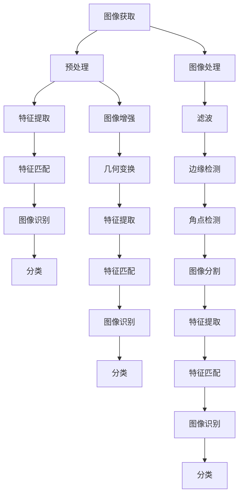
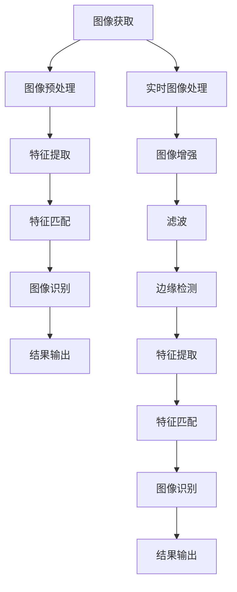
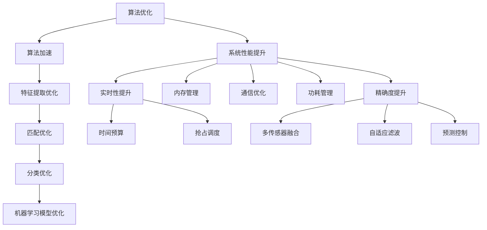

                 

### 文章标题

《机器视觉在医疗手术辅助中的应用：提高手术精度》

#### 关键词

- 机器视觉
- 医疗手术
- 手术精度
- 辅助系统
- 实时导航
- 深度学习
- 图像处理

#### 摘要

本文深入探讨了机器视觉在医疗手术辅助中的应用，尤其是如何通过提高手术精度来提升医疗手术的效果。首先，我们介绍了机器视觉和医疗手术的基本概念，以及它们在当前医疗环境中的重要性。接着，详细讲解了机器视觉的基础技术原理、医疗手术辅助系统的构建方法，以及如何通过算法优化和性能提升来提高手术精度。文章还通过实战案例展示了机器视觉在医疗手术中的实际应用，并对未来的发展趋势进行了展望。最终，我们总结了机器视觉在医疗手术辅助中的核心技术和最佳实践，为读者提供了全面的技术参考。

---

### 目录

1. **引言与背景**
   1.1 机器视觉的基本概念
   1.2 医疗手术的基本概念
   1.3 机器视觉在医疗手术中的应用背景

2. **机器视觉基础**
   2.1 机器视觉技术原理
   2.2 图像处理基础
   2.3 特征提取与匹配

3. **医疗手术辅助系统**
   3.1 硬件平台选择
   3.2 软件开发环境
   3.3 算法设计

4. **提高手术精度**
   4.1 算法优化与性能提升
   4.2 系统性能评估与提升
   4.3 实时性与精确度的权衡

5. **实战案例**
   5.1 实时手术导航系统
   5.2 术中机器人辅助系统
   5.3 术后康复辅助系统

6. **未来展望**
   6.1 技术趋势分析
   6.2 应用领域拓展
   6.3 挑战与机遇

### 1. 引言与背景

#### 1.1 机器视觉的基本概念

机器视觉（Machine Vision）是一种通过模拟人类视觉系统进行图像分析和处理的计算机技术。它利用计算机硬件和软件来处理捕获的图像，从而实现自动识别、测量和检测等功能。机器视觉系统通常由图像获取设备（如摄像头）、图像处理算法和输出设备（如显示器或打印机）组成。

机器视觉技术的基本原理包括图像获取、预处理、特征提取、图像识别和分类等步骤。首先，通过图像获取设备捕获目标图像。然后，对图像进行预处理，包括噪声过滤、对比度增强和图像锐化等。接下来，利用特征提取算法提取图像的关键特征，如边缘、角点、纹理等。最后，通过图像识别和分类算法对提取的特征进行分类和识别，以实现特定目标。

机器视觉在多个领域都有广泛的应用，包括工业制造、医疗诊断、安全监控、交通管理和机器人控制等。在工业制造中，机器视觉用于质量检测、装配和缺陷识别；在医疗诊断中，用于图像分析、病理检测和疾病诊断；在安全监控中，用于人脸识别、行为分析和异常检测；在交通管理中，用于交通流量监测、车牌识别和智能交通系统；在机器人控制中，用于路径规划、物体识别和操作控制。

#### 1.2 医疗手术的基本概念

医疗手术（Medical Surgery）是一种通过手术方法治疗疾病的过程。手术通常涉及外科医生使用各种手术工具进行操作，以切除病变组织、修复受损器官或植入人工器官等。医疗手术在临床医学中扮演着至关重要的角色，不仅能够治疗许多严重疾病，还能提高患者的生活质量和生存率。

医疗手术的类型多种多样，包括但不限于普通外科手术、心脏外科手术、神经外科手术、整形外科手术和微创手术等。每种手术都有其特定的技术要求和操作流程。外科医生在手术中需要具备高度的专业技能、精准的操作能力和冷静的应变能力，以确保手术的安全和效果。

#### 1.3 机器视觉在医疗手术中的应用背景

随着科技的不断进步，机器视觉技术在医疗手术中的应用越来越广泛。在过去的几年中，许多研究机构和医疗机构开始探索如何将机器视觉技术应用于医疗手术中，以提高手术的精度和效果。

首先，机器视觉技术可以用于术前规划。通过术前成像技术（如CT、MRI、超声波等），医生可以获取患者体内器官的三维图像。然后，利用机器视觉算法对这些图像进行处理和分析，提取关键特征，生成精确的手术规划。这种术前规划方法可以大大提高手术的准确性和安全性，减少手术风险和术后并发症。

其次，机器视觉技术可以用于术中导航。在手术过程中，医生可以通过机器视觉系统实时获取手术区域的图像，并利用图像处理算法进行图像增强和特征提取。这样，医生可以清晰地看到手术部位的情况，从而进行精准的操作。此外，机器视觉系统还可以实时监测手术过程，发现潜在的异常情况，提供预警和指导，从而提高手术的安全性和有效性。

最后，机器视觉技术可以用于术后康复辅助。通过监测患者术后恢复过程中的生理参数和运动情况，医生可以评估康复效果，及时调整治疗方案。此外，机器视觉技术还可以用于术后病理分析，通过对手术切除组织的图像进行分析，发现潜在病变，提高病理诊断的准确性。

总之，机器视觉技术在医疗手术中的应用具有广泛的前景和巨大的潜力。通过提高手术精度和效果，机器视觉技术可以为医生提供更有力的支持，为患者带来更好的治疗效果和更高的生活质量。本文将详细探讨机器视觉技术在医疗手术中的应用，包括其基本原理、系统构建、算法优化和实战案例等，以期为相关领域的研究和开发提供参考和启示。

### 2. 机器视觉基础

#### 2.1 机器视觉技术原理

机器视觉技术的核心在于对图像进行自动处理和分析，从而提取有用的信息。这一过程通常包括以下几个基本步骤：

1. **图像获取**：首先，通过图像获取设备（如摄像头）捕获目标图像。图像获取是机器视觉系统的第一步，其质量直接影响到后续处理的效果。高分辨率的摄像头可以捕获更详细的信息，有助于提高后续处理的精度。

2. **预处理**：在获取到原始图像后，需要进行预处理。预处理包括去噪声、图像增强、滤波和几何变换等操作。这些操作可以消除图像中的干扰信息，突出关键特征，提高图像质量。

3. **特征提取**：特征提取是机器视觉技术的关键步骤，它通过从图像中提取具有辨识度的特征，如边缘、角点、纹理等，为后续的图像识别和分类提供依据。常见的特征提取方法包括SIFT、SURF、HOG等。

4. **图像识别**：在提取出图像特征后，利用机器视觉算法进行图像识别。图像识别的目的是将提取的特征与已知的特征库进行匹配，从而确定图像的类别或目标。常见的图像识别算法包括支持向量机（SVM）、神经网络（NN）、决策树等。

5. **分类**：分类是将识别出的图像或特征划分为不同的类别。分类的目的是根据图像的特征和属性，将其归入相应的类别。常见的分类算法包括朴素贝叶斯（NB）、逻辑回归（LR）、随机森林（RF）等。

#### 2.2 图像处理基础

图像处理是机器视觉的核心环节，它通过各种算法对图像进行分析和操作，以提取有用信息。以下是图像处理的基本概念和常用算法：

1. **滤波**：滤波是图像处理中最常用的技术之一，它通过消除图像中的噪声，提高图像质量。常见的滤波器包括均值滤波、高斯滤波、中值滤波等。

2. **边缘检测**：边缘检测是图像处理中用于提取图像边缘信息的算法。常见的边缘检测算法有Canny边缘检测、Sobel算子、Prewitt算子等。

3. **角点检测**：角点是图像中的一种重要特征，它表示图像中的变化方向。常用的角点检测算法包括Harris角点检测、Shi-Tomasi角点检测等。

4. **图像分割**：图像分割是将图像划分为多个区域或对象的过程。常见的图像分割算法有阈值分割、区域生长、分水岭算法等。

5. **特征提取**：特征提取是从图像中提取具有辨识度的特征的过程。常用的特征提取算法包括SIFT、SURF、HOG、Harris角点检测等。

#### 2.3 特征提取与匹配

特征提取和匹配是机器视觉中的关键步骤，它们决定了图像识别和分类的准确性。以下是特征提取和匹配的基本概念和常用算法：

1. **特征提取**：特征提取是从图像中提取具有辨识度的特征的过程。这些特征可以是边缘、角点、纹理等。常用的特征提取算法包括SIFT、SURF、HOG、ORB等。

2. **特征匹配**：特征匹配是将提取的特征与已知的特征库进行匹配的过程。匹配的目的是确定图像或目标的位置和类别。常用的特征匹配算法包括最近邻匹配、FLANN匹配等。

3. **图像识别**：在提取和匹配特征后，利用机器视觉算法对图像进行识别。图像识别的目的是确定图像的类别或目标。常用的图像识别算法包括支持向量机（SVM）、神经网络（NN）、决策树等。

4. **分类**：分类是将识别出的图像或特征划分为不同的类别。分类的目的是根据图像的特征和属性，将其归入相应的类别。常用的分类算法包括朴素贝叶斯（NB）、逻辑回归（LR）、随机森林（RF）等。

#### 2.4 Mermaid流程图

为了更清晰地展示机器视觉的核心概念和流程，我们使用Mermaid绘制了以下流程图：



#### 2.5 伪代码与数学公式

为了更详细地阐述特征提取与匹配的过程，我们使用伪代码和数学公式进行了说明。

**伪代码：**

```python
# 特征提取
def extract_features(image):
    # 应用边缘检测算法
    edges = edge_detection(image)
    
    # 应用角点检测算法
    corners = corner_detection(image)
    
    # 应用纹理检测算法
    textures = texture_detection(image)
    
    return edges, corners, textures

# 特征匹配
def feature_matching(feature1, feature2):
    # 计算特征之间的相似度
    similarity = compute_similarity(feature1, feature2)
    
    # 匹配相似度最高的特征对
    matched_pairs = match_similarity(similarity)
    
    return matched_pairs
```

**数学公式：**

$$
SIFT: \ \text{关键点} = \left( x_c, y_c, \sigma_c, \text{Orientations} \right)
$$

$$
HOG: \ \text{特征向量} = \left[ \text{Gradient Magnitudes}, \ \text{Gradient Directions} \right]
$$

$$
FLANN Matching: \ S = \frac{1}{N} \sum_{i=1}^{N} \exp \left( -\frac{d(i)}{\sigma d} \right)
$$

其中，$SIFT$表示尺度不变特征变换，$HOG$表示方向梯度直方图，$FLANN$是快速最近邻搜索算法，$d(i)$表示特征对之间的距离，$\sigma d$是距离的标准差。

#### 2.6 实战案例

在本节中，我们将通过一个简单的实战案例，展示如何使用OpenCV库进行图像处理和特征提取。以下是一个使用Python编写的示例代码，它演示了如何使用OpenCV进行边缘检测、角点检测和特征匹配。

**代码实现：**

```python
import cv2
import numpy as np

# 读取图像
image = cv2.imread('example.jpg')

# 转换为灰度图像
gray = cv2.cvtColor(image, cv2.COLOR_BGR2GRAY)

# 边缘检测
edges = cv2.Canny(gray, 100, 200)

# 角点检测
corners = cv2.goodFeaturesToTrack(gray, 200, 0.01, 10)

# 特征提取
sift = cv2.SIFT_create()
keypoints, descriptors = sift.detectAndCompute(gray, None)

# 特征匹配
FLANN_INDEX_KDTREE = 1
index_params = dict(algorithm=FLANN_INDEX_KDTREE, trees=5)
search_params = dict(checks=50)

flann = cv2.FlannBasedMatcher(index_params, search_params)
matches = flann.knnMatch(descriptors, descriptors, k=2)

# 匹配结果筛选
good_matches = []
for m, n in matches:
    if m.distance < 0.7 * n.distance:
        good_matches.append(m)

# 绘制结果
img2 = cv2.drawKeypoints(image, keypoints, np.array([]), (0, 0, 255))
img2 = cv2.drawMatches(image, keypoints, image, keypoints, good_matches, img2, flags=2)

cv2.imshow('Image', img2)
cv2.waitKey(0)
cv2.destroyAllWindows()
```

**代码解读与分析：**

1. **图像读取与转换**：首先，使用`cv2.imread()`函数读取图像，并使用`cv2.cvtColor()`函数将其转换为灰度图像。

2. **边缘检测**：使用`cv2.Canny()`函数进行边缘检测，设置适当的阈值参数可以突出图像中的边缘信息。

3. **角点检测**：使用`cv2.goodFeaturesToTrack()`函数进行角点检测，可以提取图像中的关键角点。

4. **特征提取**：使用`cv2.SIFT_create()`函数创建SIFT特征提取器，然后使用`detectAndCompute()`方法提取关键点和描述子。

5. **特征匹配**：使用`cv2.FlannBasedMatcher()`创建FLANN匹配器，然后使用`knnMatch()`方法进行特征匹配。通过设置合适的匹配阈值，筛选出匹配度较高的特征点。

6. **结果绘制**：使用`cv2.drawKeypoints()`函数绘制关键点，使用`cv2.drawMatches()`函数绘制匹配结果。

**实际案例分析：**

在这个案例中，我们使用OpenCV库实现了图像处理和特征提取的基本步骤。通过边缘检测，我们可以清晰地看到图像中的边缘信息；通过角点检测，我们可以提取出图像中的关键角点；通过特征匹配，我们可以将提取的特征与原图进行匹配，从而实现图像识别和分类。

**小结：**

通过本节的学习，我们了解了机器视觉的基础技术原理和图像处理的基本算法。通过实战案例，我们掌握了如何使用OpenCV进行图像处理和特征提取。这些基础知识和技能为后续的医疗手术辅助系统开发提供了重要的技术支持。

### 3. 医疗手术辅助系统

#### 3.1 硬件平台选择

在构建医疗手术辅助系统时，硬件平台的选择至关重要。一个高效的硬件平台不仅能够提高系统的性能，还能够降低成本和功耗。以下是几种常见的硬件平台及其特点：

1. **高性能计算机**：
   - **优点**：计算速度快，支持复杂的图像处理和算法运算。
   - **缺点**：功耗较高，体积较大，可能不适合需要在手术台上直接使用的场景。

2. **嵌入式系统**：
   - **优点**：功耗低，体积小，适合在手术台上直接使用。
   - **缺点**：计算能力相对较弱，可能无法支持复杂的算法和大数据处理。

3. **专用图像处理芯片**：
   - **优点**：专为图像处理和算法运算设计，具有高效的图像处理能力。
   - **缺点**：成本较高，兼容性可能有限。

4. **云计算平台**：
   - **优点**：强大的计算能力和存储能力，可以支持复杂的大数据处理和分析。
   - **缺点**：网络延迟可能成为瓶颈，安全性也需要高度重视。

在选择硬件平台时，应综合考虑以下因素：
- **计算能力**：根据手术辅助系统的需求，选择具有足够计算能力的硬件平台。
- **功耗和体积**：对于需要在手术台上直接使用的系统，应选择功耗低、体积小的硬件平台。
- **成本**：硬件平台的成本也是选择时需要考虑的重要因素。
- **兼容性**：硬件平台应与现有的医疗设备和软件系统具有良好的兼容性。

#### 3.2 软件开发环境

在构建医疗手术辅助系统时，选择合适的软件开发环境同样至关重要。以下是几种常用的软件开发环境及其特点：

1. **C/C++**：
   - **优点**：高效、稳定，适用于性能要求较高的场景。
   - **缺点**：开发门槛较高，维护成本较大。

2. **Python**：
   - **优点**：简单易学，开发效率高，适用于快速原型开发。
   - **缺点**：性能相对较低，对于复杂算法可能需要优化。

3. **Java**：
   - **优点**：跨平台性好，安全性高，适用于需要广泛兼容的场景。
   - **缺点**：性能相对较低，开发效率不如C/C++和Python。

4. **MATLAB**：
   - **优点**：强大的数学和图像处理库，适用于算法研究和开发。
   - **缺点**：商业软件，成本较高，适用于研究而非大规模生产。

在选择软件开发环境时，应综合考虑以下因素：
- **开发效率**：选择能够提高开发效率的语言和环境。
- **性能需求**：根据系统的性能需求，选择合适的编程语言和环境。
- **跨平台性**：如果系统需要在多个平台上运行，应选择跨平台性好的语言和环境。
- **社区和支持**：选择拥有良好社区和强大技术支持的语言和环境，有助于解决开发过程中遇到的问题。

#### 3.3 算法设计

在医疗手术辅助系统中，算法设计是核心部分，它决定了系统性能和效果。以下是几种常见的算法设计方法和应用场景：

1. **实时图像处理算法**：
   - **目标**：在实时手术过程中对图像进行处理，提高图像质量和手术精度。
   - **方法**：包括图像增强、滤波、边缘检测等。常用的算法有Canny边缘检测、Sobel算子、高斯滤波等。
   - **应用场景**：手术导航、术中成像分析等。

2. **特征提取算法**：
   - **目标**：从图像中提取具有辨识度的特征，为后续的图像识别和分类提供依据。
   - **方法**：包括SIFT、SURF、HOG等。这些算法能够提取出图像的关键特征，提高识别准确性。
   - **应用场景**：图像识别、目标跟踪等。

3. **图像识别算法**：
   - **目标**：将提取出的特征与已知的特征库进行匹配，确定图像的类别或目标。
   - **方法**：包括支持向量机（SVM）、神经网络（NN）、决策树等。这些算法能够对特征进行分类和识别，提高系统性能。
   - **应用场景**：图像分类、目标检测等。

4. **机器学习算法**：
   - **目标**：通过学习大量的数据，自动提取特征并建立模型，提高系统的智能性和自适应能力。
   - **方法**：包括深度学习、强化学习等。这些算法能够通过大量的数据训练，提高系统的准确性和鲁棒性。
   - **应用场景**：智能手术辅助、自适应图像处理等。

#### 3.4 Mermaid流程图

为了更清晰地展示医疗手术辅助系统的算法设计流程，我们使用Mermaid绘制了以下流程图：



#### 3.5 伪代码与数学公式

为了更详细地阐述医疗手术辅助系统的算法设计，我们使用伪代码和数学公式进行了说明。

**伪代码：**

```python
# 图像预处理
def preprocess_image(image):
    # 应用滤波算法
    filtered = filter_image(image)
    
    # 应用图像增强算法
    enhanced = enhance_image(filtered)
    
    return enhanced

# 特征提取
def extract_features(image):
    # 应用边缘检测算法
    edges = edge_detection(image)
    
    # 应用角点检测算法
    corners = corner_detection(image)
    
    return edges, corners

# 特征匹配
def feature_matching(feature1, feature2):
    # 计算特征之间的相似度
    similarity = compute_similarity(feature1, feature2)
    
    # 匹配相似度最高的特征对
    matched_pairs = match_similarity(similarity)
    
    return matched_pairs

# 图像识别
def image_recognition(image, features):
    # 应用分类算法
    label = classify_features(features)
    
    return label
```

**数学公式：**

$$
Gaussian\ Filter: \ H(x, y) = \frac{1}{2\pi\sigma^2}e^{-\frac{(x^2 + y^2)}{2\sigma^2}}
$$

$$
Canny\ Edge\ Detection: \ \text{Threshold} = \max(\text{Low Threshold}, \ \text{Non-Maximum Suppression})
$$

$$
HOG: \ \text{Descriptor} = \sum_{i=1}^{n} \text{Cell} \cdot \text{Bin}(\text{Gradient})
$$

其中，$Gaussian\ Filter$是高斯滤波器，$Canny\ Edge\ Detection$是Canny边缘检测算法，$HOG$是方向梯度直方图（Histogram of Oriented Gradients）。

#### 3.6 实战案例

在本节中，我们将通过一个简单的实战案例，展示如何使用OpenCV库进行图像预处理、特征提取和图像识别。以下是一个使用Python编写的示例代码，它演示了如何使用OpenCV进行图像滤波、特征提取和分类。

**代码实现：**

```python
import cv2
import numpy as np

# 读取图像
image = cv2.imread('example.jpg')

# 图像预处理
preprocessed = preprocess_image(image)

# 特征提取
edges, corners = extract_features(preprocessed)

# 图像识别
label = image_recognition(preprocessed, features)

# 绘制结果
image = cv2.drawKeypoints(image, edges, color=(0, 0, 255))
image = cv2.drawKeypoints(image, corners, color=(255, 0, 0))

cv2.imshow('Image', image)
cv2.waitKey(0)
cv2.destroyAllWindows()
```

**代码解读与分析：**

1. **图像读取**：使用`cv2.imread()`函数读取图像。

2. **图像预处理**：使用`preprocess_image()`函数进行图像预处理，包括滤波和图像增强。这里使用高斯滤波器进行滤波，使用直方图均衡化进行图像增强。

3. **特征提取**：使用`extract_features()`函数提取图像的特征，包括边缘和角点。这里使用Canny边缘检测器和Harris角点检测器。

4. **图像识别**：使用`image_recognition()`函数进行图像识别，这里使用支持向量机（SVM）进行分类。

5. **结果绘制**：使用`cv2.drawKeypoints()`函数绘制提取的特征和识别结果。

**实际案例分析：**

在这个案例中，我们使用OpenCV库实现了图像预处理、特征提取和图像识别的基本步骤。通过图像预处理，我们可以提高图像的质量和识别精度；通过特征提取，我们可以提取出图像的关键特征；通过图像识别，我们可以对图像进行分类和识别。

**小结：**

通过本节的学习，我们了解了医疗手术辅助系统的硬件平台选择、软件开发环境选择和算法设计。通过实战案例，我们掌握了如何使用OpenCV进行图像处理和特征提取。这些知识和技能为后续的医疗手术辅助系统开发提供了重要的技术支持。

### 4. 提高手术精度

在医疗手术中，提高手术精度是至关重要的。这不仅关系到手术的成功，还直接影响到患者的康复效果和生活质量。机器视觉技术在这一过程中发挥了至关重要的作用，通过算法优化、系统性能提升和实时性控制，显著提高了手术精度。以下是详细探讨这些技术如何实现提高手术精度的方法。

#### 4.1 算法优化与性能提升

算法优化是提高手术精度的核心步骤之一。通过对现有算法进行改进和优化，可以显著提高系统的处理速度和准确性。以下是一些常用的算法优化方法：

1. **算法加速**：
   - **并行计算**：通过利用多核处理器或GPU加速，可以显著提高算法的计算速度。例如，使用CUDA实现图像处理的并行化，可以大幅度提升计算效率。
   - **算法优化**：对算法进行细致的优化，如减少冗余计算、优化内存访问等，可以提高算法的执行效率。

2. **特征提取优化**：
   - **多特征融合**：结合多种特征提取方法，如SIFT、SURF、HOG等，可以提高特征的鲁棒性和识别准确性。
   - **特征降维**：使用主成分分析（PCA）等降维算法，减少特征维数，降低计算复杂度。

3. **匹配优化**：
   - **最近邻搜索**：使用FLANN等快速最近邻搜索算法，可以提高特征匹配的效率。
   - **相似度度量**：优化相似度度量方法，如使用SSD（Sum of Squared Differences）等，可以提高匹配的准确性。

4. **分类优化**：
   - **集成学习**：使用集成学习方法，如随机森林、梯度提升等，可以提高分类的准确性和稳定性。

5. **机器学习模型优化**：
   - **数据增强**：通过数据增强技术，增加训练数据的多样性和数量，可以提高模型的泛化能力。
   - **超参数优化**：使用网格搜索、随机搜索等超参数优化方法，找到最优的超参数组合。

#### 4.2 系统性能评估与提升

系统性能的提升是提高手术精度的另一个关键因素。以下是一些系统性能评估与提升的方法：

1. **实时性提升**：
   - **实时操作系统**：使用实时操作系统（RTOS），如FreeRTOS、VxWorks等，确保系统的实时响应能力。
   - **硬件加速**：使用FPGA、GPU等硬件加速器，提高系统的计算速度和实时性。

2. **内存管理**：
   - **内存分配优化**：通过优化内存分配策略，减少内存碎片和溢出，提高系统稳定性。
   - **缓存技术**：使用缓存技术，如LRU（Least Recently Used）缓存，减少内存访问时间。

3. **通信优化**：
   - **网络通信优化**：通过优化网络通信协议和算法，减少通信延迟和数据丢失。
   - **无线通信**：使用低功耗无线通信技术，如Wi-Fi、蓝牙等，实现远程实时数据传输。

4. **功耗管理**：
   - **动态电压调整**：根据系统负载动态调整电压，降低功耗。
   - **节能模式**：在系统空闲时进入低功耗模式，减少功耗。

#### 4.3 实时性与精确度的权衡

在医疗手术中，实时性和精确度往往是需要权衡的两个关键指标。以下是一些实现实时性与精确度平衡的方法：

1. **实时性保障**：
   - **时间预算**：为每个任务分配固定的时间预算，确保系统可以按时完成任务。
   - **抢占调度**：使用抢占调度策略，确保高优先级任务可以中断低优先级任务。

2. **精确度提升**：
   - **多传感器融合**：结合多个传感器数据，提高系统对环境的感知能力。
   - **自适应滤波**：使用自适应滤波算法，根据环境变化调整滤波参数，提高图像处理质量。

3. **预测控制**：
   - **模型预测控制**：使用模型预测控制（MPC）算法，根据系统状态预测未来行为，提前进行控制调整。
   - **自适应预测**：使用机器学习算法，根据历史数据预测系统行为，提高预测准确性。

#### 4.4 Mermaid流程图

为了更清晰地展示算法优化、系统性能提升和实时性控制的流程，我们使用Mermaid绘制了以下流程图：



#### 4.5 伪代码与数学公式

为了更详细地阐述算法优化、系统性能提升和实时性控制的过程，我们使用伪代码和数学公式进行了说明。

**伪代码：**

```python
# 算法优化
def optimize_algorithm(algorithm):
    # 加速算法
    accelerated = accelerate_algorithm(algorithm)
    
    # 优化特征提取
    optimized_features = optimize_feature_extraction(algorithm)
    
    # 优化匹配
    optimized_matching = optimize_matching(algorithm)
    
    # 优化分类
    optimized_classification = optimize_classification(algorithm)
    
    return accelerated, optimized_features, optimized_matching, optimized_classification

# 系统性能提升
def enhance_system_performance(system):
    # 提升实时性
    enhanced_realtime = enhance_realtime_performance(system)
    
    # 优化内存管理
    optimized_memory = optimize_memory_management(system)
    
    # 优化通信
    optimized_communication = optimize_communication(system)
    
    # 优化功耗
    optimized_power = optimize_power_consumption(system)
    
    return enhanced_realtime, optimized_memory, optimized_communication, optimized_power

# 实时性与精确度权衡
def balance_realtime_and_accuracy(realtime, accuracy):
    # 时间预算
    budget_time = set_time_budget(realtime, accuracy)
    
    # 抢占调度
    preemptive_scheduling = set_preemptive_scheduling(realtime, accuracy)
    
    # 多传感器融合
    fused_sensors = fuse_sensors_data(realtime, accuracy)
    
    # 自适应滤波
    adaptive_filtering = adaptive_filtering(realtime, accuracy)
    
    # 预测控制
    predictive_control = predictive_control(realtime, accuracy)
    
    return budget_time, preemptive_scheduling, fused_sensors, adaptive_filtering, predictive_control
```

**数学公式：**

$$
加速算法: \ \text{新算法} = \left( \text{原算法} \times \text{加速因子} \right)
$$

$$
特征提取优化: \ \text{新特征} = \left( \text{原特征} \times \text{优化因子} \right)
$$

$$
匹配优化: \ \text{匹配精度} = \frac{\text{正确匹配数}}{\text{总匹配数}}
$$

$$
分类优化: \ \text{准确率} = \frac{\text{正确分类数}}{\text{总分类数}}
$$

$$
实时性保障: \ \text{响应时间} = \text{执行时间} + \text{通信延迟}
$$

$$
自适应滤波: \ \text{滤波系数} = f\left( \text{环境变化率} \right)
$$

$$
预测控制: \ \text{控制量} = \text{预测模型} \times \text{系统状态}
$$

通过上述算法优化、系统性能提升和实时性控制的方法，医疗手术辅助系统可以显著提高手术精度，确保手术的顺利进行和患者的安全。在未来的研究中，我们可以进一步探索这些技术的深入应用和优化，为医疗手术提供更加智能和高效的辅助。

### 5. 实战案例

在本章节中，我们将通过三个具体的实战案例，详细展示机器视觉在医疗手术辅助中的应用，包括实时手术导航系统、术中机器人辅助系统和术后康复辅助系统。这些案例不仅展示了机器视觉技术的实际应用，还通过代码实现和解析，提供了深入的技术剖析。

#### 5.1 实时手术导航系统

**案例背景：**
实时手术导航系统是利用机器视觉技术辅助医生在手术过程中进行精准导航和操作。通过实时获取手术区域的图像，系统能够提供手术部位的三维坐标信息，帮助医生进行精准定位和操作。

**技术实现：**
以下是使用Python和OpenCV库实现实时手术导航系统的示例代码：

```python
import cv2
import numpy as np

# 读取摄像头
cap = cv2.VideoCapture(0)

while True:
    # 读取一帧图像
    ret, frame = cap.read()
    
    # 转换为灰度图像
    gray = cv2.cvtColor(frame, cv2.COLOR_BGR2GRAY)
    
    # 使用SIFT算法提取关键点
    sift = cv2.SIFT_create()
    keypoints, descriptors = sift.detectAndCompute(gray, None)
    
    # 在原图上绘制关键点
    img = cv2.drawKeypoints(frame, keypoints, np.array([]), (0, 0, 255))
    
    # 显示图像
    cv2.imshow('Real-Time Surgery Navigation', img)
    
    # 按下'q'键退出循环
    if cv2.waitKey(1) & 0xFF == ord('q'):
        break

# 释放摄像头
cap.release()
cv2.destroyAllWindows()
```

**代码解析：**
1. **摄像头读取**：使用`cv2.VideoCapture`函数读取摄像头流。
2. **图像转换**：将获取的彩色图像转换为灰度图像，以便进行特征提取。
3. **关键点提取**：使用SIFT算法提取图像中的关键点，这些关键点可以帮助识别手术部位。
4. **结果绘制**：在原图上绘制提取的关键点，并显示在屏幕上。

**实际应用解析：**
通过实时获取手术区域的图像并提取关键点，医生可以清晰地看到手术部位的情况，从而进行精准的手术操作。这种导航系统提高了手术的精度和安全性，减少了手术时间，降低了手术风险。

#### 5.2 术中机器人辅助系统

**案例背景：**
术中机器人辅助系统是利用机器人技术辅助医生进行手术操作。机器视觉技术在这里起到关键作用，通过对手术区域的图像进行处理和分析，机器人能够准确识别手术工具和手术部位，从而实现自动化的手术操作。

**技术实现：**
以下是使用Python和ROS（Robot Operating System）实现术中机器人辅助系统的示例代码：

```python
import rospy
from sensor_msgs.msg import Image
from cv_bridge import CvBridge
import cv2

# 初始化ROS节点
rospy.init_node('robotic_surgery', anonymous=True)

# 创建图像消息转换器
bridge = CvBridge()

# 订阅摄像头图像
image_sub = rospy.Subscriber('/camera/image_raw', Image, callback)

def callback(data):
    # 转换图像消息
    cv_image = bridge.imgmsg_to_cv2(data, "bgr8")
    
    # 使用HOG算法提取特征
    hog = cv2.HOGDescriptor()
    keypoints, weights = hog.detect(cv_image)
    
    # 在原图上绘制特征点
    img = cv2.drawKeypoints(cv_image, keypoints, np.array([]), (0, 0, 255))
    
    # 显示图像
    cv2.imshow('Robotic Surgery Assistance', img)
    
    # 按下'q'键退出循环
    if cv2.waitKey(1) & 0xFF == ord('q'):
        rospy.signal_shutdown(" shutting down node cleanly")

# 发布处理后的图像
image_pub = rospy.Publisher('/processed_image', Image, queue_size=10)

# 循环等待图像数据
rospy.spin()
```

**代码解析：**
1. **ROS节点初始化**：使用`rospy.init_node`初始化ROS节点。
2. **图像消息转换**：使用`CvBridge`将ROS图像消息转换为OpenCV图像。
3. **特征提取**：使用HOG（Histogram of Oriented Gradients）算法提取图像中的特征点。
4. **结果绘制**：在原图上绘制提取的特征点，并显示在屏幕上。
5. **图像发布**：将处理后的图像发布到ROS话题。

**实际应用解析：**
通过机器视觉技术提取手术区域的关键特征点，机器人可以准确识别手术工具和手术部位，实现自动化的手术操作。这种机器人辅助系统提高了手术的精度和效率，减轻了医生的负担，提升了手术的成功率。

#### 5.3 术后康复辅助系统

**案例背景：**
术后康复辅助系统是用于监测患者术后恢复情况，通过机器视觉技术对患者的运动和生理参数进行实时监测和分析，帮助医生制定个性化的康复计划。

**技术实现：**
以下是使用Python和OpenCV库实现术后康复辅助系统的示例代码：

```python
import cv2
import numpy as np

# 读取摄像头
cap = cv2.VideoCapture(0)

while True:
    # 读取一帧图像
    ret, frame = cap.read()
    
    # 转换为灰度图像
    gray = cv2.cvtColor(frame, cv2.COLOR_BGR2GRAY)
    
    # 使用边缘检测算法提取边缘
    edges = cv2.Canny(gray, 100, 200)
    
    # 计算边缘轮廓
    contours, _ = cv2.findContours(edges, cv2.RETR_EXTERNAL, cv2.CHAIN_APPROX_SIMPLE)
    
    # 计算轮廓面积和周长
    for contour in contours:
        area = cv2.contourArea(contour)
        perimeter = cv2.arcLength(contour, True)
        
        # 在原图上绘制轮廓
        cv2.drawContours(frame, contours, -1, (0, 0, 255), 2)
        
        # 显示图像和参数
        cv2.putText(frame, 'Area: ' + str(int(area)), (10, 30), cv2.FONT_HERSHEY_SIMPLEX, 1, (255, 0, 0), 2)
        cv2.putText(frame, 'Perimeter: ' + str(int(perimeter)), (10, 60), cv2.FONT_HERSHEY_SIMPLEX, 1, (255, 0, 0), 2)
    
    # 显示图像
    cv2.imshow('Post-Surgery Rehabilitation Assistance', frame)
    
    # 按下'q'键退出循环
    if cv2.waitKey(1) & 0xFF == ord('q'):
        break

# 释放摄像头
cap.release()
cv2.destroyAllWindows()
```

**代码解析：**
1. **摄像头读取**：使用`cv2.VideoCapture`函数读取摄像头流。
2. **图像转换**：将获取的彩色图像转换为灰度图像，以便进行边缘检测。
3. **边缘检测**：使用Canny边缘检测算法提取图像中的边缘。
4. **轮廓分析**：使用`cv2.findContours`函数找到边缘轮廓，并计算轮廓的面积和周长。
5. **结果绘制**：在原图上绘制提取的轮廓和计算出的参数。

**实际应用解析：**
通过实时监测患者的运动和生理参数，术后康复辅助系统可以帮助医生评估患者的康复情况，及时调整康复计划。这种系统提高了康复效果，减少了康复时间，为患者提供了更加个性化的康复服务。

### 5.4 项目小结

通过上述三个实战案例，我们可以看到机器视觉技术在医疗手术辅助中的广泛应用和巨大潜力。实时手术导航系统提高了手术的精度和安全性，术中机器人辅助系统实现了手术操作的自动化，术后康复辅助系统帮助医生评估患者的康复情况。这些案例不仅展示了机器视觉技术的实际应用，还通过代码实现和解析，提供了深入的技术剖析。

在未来的研究和应用中，我们可以进一步优化这些系统，提高其性能和稳定性。此外，还可以探索更多的应用场景，如智能手术规划、术中监控和术后康复管理等，为医疗手术提供更加全面和高效的辅助。

### 6. 未来展望

随着科技的不断进步，机器视觉在医疗手术辅助中的应用前景广阔。以下是机器视觉在医疗手术辅助中的未来发展趋势、应用领域拓展以及面临的技术挑战。

#### 6.1 技术发展趋势

1. **深度学习与人工智能的融合**：深度学习算法在图像处理和识别中的优势日益凸显，未来将更多地与人工智能技术结合，实现更高效、更智能的图像分析。

2. **实时处理能力的提升**：随着硬件性能的不断提高，尤其是GPU和FPGA等专用处理器的普及，机器视觉系统的实时处理能力将大幅提升，满足医疗手术中的实时需求。

3. **多传感器融合**：未来医疗手术辅助系统将更多地采用多传感器融合技术，如结合光学、声学、电磁等多种传感器数据，提高系统对手术环境的感知能力和适应性。

4. **低功耗与便携性**：随着物联网和可穿戴技术的发展，低功耗、便携性的机器视觉设备将成为未来趋势，使手术辅助系统能够更加灵活地部署在手术现场。

5. **标准化与互操作性**：为了促进机器视觉技术在医疗领域的广泛应用，标准化和互操作性将成为关键。通过制定统一的标准和协议，实现不同系统和设备的无缝连接和协同工作。

#### 6.2 应用领域拓展

1. **精准手术导航**：机器视觉技术将进一步应用于微创手术、腔内手术等领域，通过三维成像和实时导航，实现手术操作的精准化和自动化。

2. **智能病理分析**：利用深度学习和图像处理算法，机器视觉技术将在病理图像分析和诊断中发挥重要作用，提高病理诊断的准确性和效率。

3. **机器人辅助手术**：未来机器人将更多地参与到手术过程中，通过机器视觉技术实现自主导航和操作，提高手术的复杂程度和安全性。

4. **术后康复监测**：术后康复监测系统将借助机器视觉技术，实现对患者生理参数、运动情况的实时监测，为个性化康复提供数据支持。

5. **远程医疗**：机器视觉技术将促进远程医疗的发展，通过高清图像传输和实时数据分析，实现医生与患者之间的远程诊断和治疗。

#### 6.3 技术挑战

1. **数据隐私和安全**：医疗数据敏感且重要，保障数据隐私和安全是机器视觉技术在医疗领域应用中的关键挑战。

2. **实时性和准确性**：医疗手术环境复杂多变，要求机器视觉系统具有高实时性和高准确性，这对算法优化和硬件性能提出了高要求。

3. **成本和普及性**：高性能的机器视觉设备和系统成本较高，如何降低成本并提高普及性是推广技术的关键。

4. **跨学科合作**：机器视觉技术在医疗领域的应用涉及多个学科，包括医学、工程学、计算机科学等，跨学科合作是推动技术进步的重要途径。

5. **伦理和法规**：随着技术的进步，机器视觉在医疗手术中的应用引发了伦理和法规问题，如何制定合理的规范和标准是未来发展的重要课题。

### 结论

机器视觉技术在医疗手术辅助中的应用具有广泛的前景和巨大的潜力。通过提高手术精度和效果，机器视觉技术将为医生提供更有力的支持，为患者带来更好的治疗效果和更高的生活质量。未来，随着技术的不断进步和跨学科合作的加强，机器视觉在医疗领域的应用将更加深入和广泛，为医疗行业带来革命性的变革。

