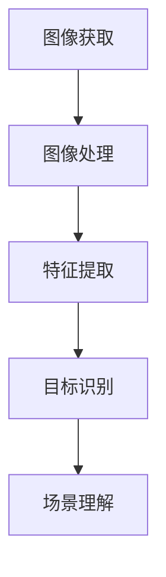

                 

### 文章标题

《机器视觉在增强现实中的应用：提升用户交互体验》

### 关键词

机器视觉、增强现实、用户交互、应用实例、技术博客、AI编程

### 摘要

本文深入探讨了机器视觉在增强现实（AR）中的应用，以及其对提升用户交互体验的重要作用。通过分析机器视觉的基本原理、核心算法，以及与增强现实技术的融合，本文详细阐述了机器视觉在AR导航、手势识别等领域的实际应用案例。同时，本文还探讨了如何通过机器视觉技术来优化用户交互体验，并提供了具体的开发环境搭建、源代码实现和案例分析，为AR领域的开发者提供了实用的技术指南。

----------------------------------------------------------------

## 引言与概述

随着科技的不断发展，增强现实（AR）技术逐渐从科幻领域走进了现实生活。AR技术通过在现实场景中叠加虚拟信息，为用户提供了全新的交互体验。而机器视觉作为计算机科学的重要分支，通过图像处理、特征提取和目标识别等技术，使得计算机能够理解和感知现实世界。本文将围绕机器视觉在增强现实中的应用，探讨如何通过这一技术提升用户的交互体验。

机器视觉是一门研究如何使计算机“看”见并理解周围环境的科学。它涉及图像处理、模式识别、计算机视觉等多个领域，旨在实现计算机对图像或视频数据的分析和理解。随着深度学习等人工智能技术的不断发展，机器视觉的应用场景不断扩大，从传统的工业自动化到现代的智能安防、无人驾驶，再到本文要探讨的增强现实，机器视觉无处不在。

增强现实（AR）是一种将虚拟信息与现实世界相结合的技术。通过AR技术，用户可以在现实场景中看到增强的图像、视频或3D模型等虚拟信息。AR技术的核心在于将虚拟信息与现实场景进行实时融合，为用户带来沉浸式的体验。随着智能手机和平板电脑的普及，以及AR技术的逐渐成熟，AR应用逐渐渗透到教育、医疗、娱乐等多个领域。

在本文中，我们将首先介绍机器视觉的基本原理和核心算法，然后探讨增强现实技术的相关概念和技术，接着分析机器视觉在AR中的应用案例，最后讨论如何通过机器视觉技术提升用户的交互体验。通过本文的阅读，读者将能够全面了解机器视觉在AR中的应用，以及如何利用这一技术为用户提供更优质的交互体验。

## 机器视觉基础

### 机器视觉概述

机器视觉是一门涉及多个学科领域的交叉科学，其目标是使计算机具备视觉能力，从而能够理解和感知现实世界。机器视觉的应用范围非常广泛，包括工业自动化、医疗诊断、交通监控、无人驾驶、智能家居等。其基本概念可以概括为以下几个方面：

1. **图像处理**：图像处理是机器视觉的基础，旨在对图像进行数字化处理，包括图像的获取、增强、滤波、边缘检测等。通过图像处理，可以提取出图像中的有用信息，从而为后续的识别和理解提供支持。

2. **特征提取**：特征提取是机器视觉中的关键步骤，旨在从图像中提取出具有区分性的特征，如颜色、形状、纹理等。这些特征是后续目标识别的基础。

3. **目标识别**：目标识别是机器视觉的核心任务，旨在从图像或视频中识别出特定的目标。目标识别通常基于模式识别技术，包括机器学习、深度学习等方法。

4. **场景理解**：场景理解是机器视觉的高级任务，旨在对整个场景进行理解，包括空间关系、动态行为等。通过场景理解，计算机可以更全面地理解现实世界，从而实现更复杂的任务。

### 机器视觉基本原理

机器视觉的基本原理主要包括以下几个方面：

1. **图像获取**：图像获取是机器视觉的第一步，通过摄像头或其他图像传感器获取现实世界的图像。图像获取的质量直接影响到后续处理的准确性。

2. **图像处理**：图像处理是对获取的图像进行一系列的预处理操作，以提高图像的质量和清晰度。常见的图像处理技术包括滤波、边缘检测、形态学操作等。

3. **特征提取**：特征提取是对处理后的图像进行特征分析，提取出具有区分性的特征。这些特征可以用于后续的目标识别和场景理解。

4. **目标识别**：目标识别是基于特征提取的结果，对图像中的目标进行分类和识别。常见的目标识别方法包括模板匹配、基于机器学习的方法等。

5. **场景理解**：场景理解是对整个场景进行理解，包括空间关系、动态行为等。通过场景理解，计算机可以更好地理解现实世界，从而实现更复杂的任务。

### 机器视觉相关算法

机器视觉中涉及到的相关算法包括图像处理算法、特征提取算法和目标识别算法等。以下是一些常见的算法：

1. **图像处理算法**：
   - **滤波算法**：如高斯滤波、均值滤波等，用于去除图像中的噪声。
   - **边缘检测算法**：如Sobel算子、Canny算子等，用于检测图像中的边缘信息。
   - **形态学操作**：如膨胀、腐蚀、开运算、闭运算等，用于对图像进行形态学处理。

2. **特征提取算法**：
   - **颜色特征**：如颜色直方图、颜色矩等，用于描述图像的颜色信息。
   - **形状特征**：如轮廓、形状矩等，用于描述图像的形状信息。
   - **纹理特征**：如灰度共生矩阵、局部二值模式（LBP）等，用于描述图像的纹理信息。

3. **目标识别算法**：
   - **传统方法**：如模板匹配、基于特征的分类等。
   - **深度学习方法**：如卷积神经网络（CNN）、循环神经网络（RNN）等，近年来在目标识别任务中取得了显著的效果。

通过这些算法，机器视觉系统能够从图像或视频中提取出有用的信息，从而实现目标识别、场景理解等任务。这些算法的实现和优化是机器视觉技术发展的关键。

### Mermaid 流程图

以下是一个简化的机器视觉流程图的 Mermaid 表示，展示了图像处理、特征提取和目标识别的基本步骤：



在这个流程图中，图像获取是输入阶段，通过摄像头或传感器获取图像。然后，图像处理阶段对图像进行预处理，如滤波和边缘检测。接下来，特征提取阶段从处理后的图像中提取出具有区分性的特征。目标识别阶段利用这些特征对图像中的目标进行识别。最后，场景理解阶段对整个场景进行理解，以实现更复杂的任务。

通过这个流程图，我们可以清晰地看到机器视觉从图像获取到场景理解的基本步骤和核心概念之间的联系。这为后续讨论机器视觉在增强现实中的应用奠定了基础。

## 增强现实基础

### 增强现实概述

增强现实（Augmented Reality，简称AR）是一种通过计算机技术将虚拟信息与现实世界相结合的技术。与虚拟现实（Virtual Reality，简称VR）不同，AR并不是完全替代现实世界，而是在现实场景中叠加虚拟信息，从而增强用户的感知和体验。AR技术通过摄像头或其他传感器捕捉现实世界的图像，然后利用计算机处理，将虚拟信息叠加到这些图像上，最终呈现在用户的眼前。

AR技术的基本原理可以概括为以下几个步骤：

1. **图像捕捉**：通过摄像头或其他传感器捕捉现实世界的图像。
2. **图像处理**：对捕获的图像进行预处理，如滤波、边缘检测等，以提高图像质量。
3. **特征提取**：从预处理后的图像中提取出具有区分性的特征，如颜色、形状、纹理等。
4. **虚拟信息叠加**：根据提取的特征，将虚拟信息（如文字、图像、3D模型等）叠加到真实世界的图像上。
5. **显示**：通过屏幕或眼镜等设备将叠加后的图像显示给用户。

### 增强现实技术

AR技术的实现依赖于多种关键技术的支持，主要包括：

1. **图像识别与跟踪**：这是AR技术的基础，通过识别和跟踪图像中的特征点，可以实现虚拟信息与现实世界的准确叠加。常见的图像识别与跟踪方法包括特征点检测、图像配准和位姿估计等。

2. **三维建模与渲染**：三维建模与渲染是AR技术的核心，通过三维建模技术生成虚拟信息，然后利用渲染技术将其准确地叠加到真实世界的图像上。常用的三维建模与渲染方法包括3D建模软件、OpenGL等。

3. **传感器融合**：AR设备通常配备多种传感器，如GPS、陀螺仪、加速度计等，这些传感器可以提供设备的位置、方向和运动信息。通过传感器融合技术，可以更准确地获取设备的姿态，从而提高AR系统的稳定性。

4. **实时处理**：AR技术需要实时处理大量图像数据，包括图像捕捉、处理、特征提取、虚拟信息叠加等。实时处理技术的优化是实现高效AR应用的关键。

5. **用户交互**：AR应用需要提供便捷的用户交互方式，如手势识别、语音识别等。这些交互方式可以增强用户的沉浸感和操作体验。

### 增强现实应用场景

AR技术在多个领域具有广泛的应用场景，主要包括：

1. **教育**：AR技术可以为教育提供丰富的互动式学习资源，如虚拟实验、交互式教材等，从而提高学生的学习兴趣和效果。

2. **医疗**：AR技术在医疗领域具有巨大潜力，如手术导航、医疗教育、远程诊断等，可以显著提高医疗服务的质量和效率。

3. **娱乐**：AR技术为游戏、影视等娱乐领域带来了全新的体验，如增强现实游戏、互动式影视等，深受用户喜爱。

4. **零售**：AR技术可以为零售业提供虚拟试衣、互动展示等功能，从而提升用户的购物体验。

5. **工业**：AR技术在工业领域可以用于设备维护、远程协作、工艺优化等，可以提高工业生产的效率和质量。

通过上述介绍，我们可以看到增强现实技术的基本原理、关键技术及其在多个领域的应用场景。这为后续讨论机器视觉在AR中的应用奠定了基础。

### SLAM与3D建模

在增强现实（AR）技术中，同步定位与映射（SLAM）和三维建模是两个核心环节，它们共同确保了虚拟信息与现实世界的精准融合和互动。

#### SLAM技术

同步定位与映射（Simultaneous Localization and Mapping，简称SLAM）是一种通过传感器数据同时实现空间地图构建和自身定位的技术。SLAM技术主要解决的是在未知环境中，机器人或设备如何同时构建地图并确定自身位置的问题。

1. **基本原理**：
   - **特征提取**：SLAM技术首先从传感器获取的数据中提取特征点，如角点、边缘等，这些特征点是后续定位和映射的基础。
   - **图像匹配**：通过在连续的图像帧之间进行特征匹配，可以估计相机或设备的运动轨迹。
   - **地图构建**：根据特征匹配结果，构建出三维空间中的地图。
   - **位姿估计**：通过优化算法，如粒子滤波或扩展卡尔曼滤波，结合传感器数据和地图信息，估计设备的位姿。

2. **SLAM流程**：
   - **初始化**：设备通过初始定位和地图构建进行初始化。
   - **特征提取**：从传感器数据中提取特征点。
   - **图像匹配**：对连续帧进行特征匹配，计算相机运动。
   - **地图更新**：根据相机运动更新地图信息。
   - **位姿估计**：结合传感器数据和地图信息，估计设备位姿。
   - **闭环检测**：通过检测闭环，修正地图和位姿估计的误差。

#### 3D建模

三维建模（3D Modeling）是将现实世界的物体或场景转化为三维数字模型的过程。在AR中，3D建模用于生成虚拟信息，并与现实场景进行交互。

1. **建模技术**：
   - **手动建模**：通过专业软件（如Blender、Maya）手动创建三维模型。
   - **扫描建模**：通过激光扫描或结构光扫描，获取物体的三维数据，然后生成三维模型。
   - **三维重建**：通过计算机视觉技术，从多个视角的二维图像中恢复出三维模型。

2. **渲染技术**：
   - **真实感渲染**：通过光线追踪、全局光照等手段，生成具有真实感的三维图像。
   - **实时渲染**：针对AR应用，需要实时生成三维图像，通常使用GPU加速的渲染技术。

#### SLAM与3D建模在AR中的应用

- **实时定位与跟踪**：通过SLAM技术，AR设备可以实时获取自身位置和周围环境，确保虚拟信息与现实场景的精准对齐。
- **交互式体验**：结合3D建模技术，虚拟信息可以与现实世界中的物体进行交互，如虚拟物体在现实场景中的移动、旋转等。
- **空间增强**：利用SLAM和3D建模，可以在现实场景中添加虚拟对象，如增强现实游戏中的角色、互动广告等。

通过SLAM与3D建模技术，AR应用实现了虚拟信息与现实世界的无缝融合，为用户提供丰富的互动体验。接下来，本文将进一步探讨机器视觉在AR中的具体应用，包括AR导航、手势识别等。

### 机器视觉在AR中的应用

机器视觉在增强现实（AR）中的应用广泛且多样化，其中最为突出的应用包括AR导航和手势识别等。通过机器视觉技术，AR应用能够实现更加精准的交互和增强的用户体验。

#### AR导航

AR导航通过机器视觉技术，为用户提供了一种全新的导航方式，使得用户可以在现实环境中实时获取位置信息、路线指示等，大大提升了导航的便捷性和互动性。

1. **工作原理**：
   - **环境感知**：通过摄像头捕获现实环境的图像，机器视觉技术对图像进行特征提取和目标识别，如识别道路标志、建筑物等。
   - **路径规划**：根据识别的结果，AR系统结合GPS和地图数据，为用户规划最优路径。
   - **虚拟叠加**：将导航信息以虚拟图像的形式叠加到现实场景中，如箭头、文字指示等。

2. **应用实例**：
   - **户外导航**：在户外环境中，AR导航可以通过识别地标和道路标志，为用户提供准确的导航信息，尤其是在没有GPS信号或信号不佳的地区。
   - **室内导航**：在大型商场、机场、博物馆等室内环境中，AR导航可以帮助用户快速找到目的地，尤其是在布局复杂的室内空间。

3. **优势**：
   - **增强互动性**：传统的导航方式往往依赖于电子屏幕，而AR导航将导航信息直接叠加到现实环境中，使得用户能够更直观地感知导航信息。
   - **提升体验**：AR导航不仅提供了位置信息，还可以结合3D建模技术，为用户呈现更加丰富的导航体验。

#### 手势识别

手势识别是机器视觉在AR应用中的另一重要领域，通过识别用户的手势，实现与虚拟信息的自然交互。

1. **工作原理**：
   - **手势检测**：通过摄像头捕捉用户的手部动作，机器视觉技术对手部关键点进行检测和跟踪。
   - **手势识别**：根据手部关键点的位置和运动轨迹，识别用户的手势，如手势的类别（如平举手势、OK手势等）和具体动作（如手势的移动、旋转等）。
   - **交互响应**：系统根据识别的结果，执行相应的交互操作，如放大虚拟物体、切换界面等。

2. **应用实例**：
   - **交互式游戏**：在AR游戏中，手势识别可以用于实现手部控制，如抛物线运动、手势攻击等，为玩家带来更加丰富的互动体验。
   - **虚拟现实培训**：在虚拟现实培训中，手势识别可以用于模拟真实操作，如机械操作、医疗手术等，提供沉浸式的培训体验。
   - **智能家居控制**：通过手势识别，用户可以实现对智能家居设备的控制，如开关灯光、调节温度等，提升家居生活的便利性。

3. **优势**：
   - **自然交互**：手势识别提供了与虚拟信息更加自然的交互方式，用户无需使用物理控制器，可以通过简单的手部动作进行操作，提高了交互的便利性和直观性。
   - **扩展性**：手势识别技术具有高度的可扩展性，可以根据不同的应用场景，设计不同的手势交互方式，实现多样化的交互体验。

通过AR导航和手势识别等应用，机器视觉在增强现实技术中发挥了重要作用，不仅提升了用户的交互体验，也为AR应用的创新和发展提供了广阔的空间。

### 用户交互体验的提升

随着增强现实（AR）技术的不断发展，用户交互体验的提升成为关键因素。机器视觉技术在AR应用中扮演着至关重要的角色，通过以下几个方面，可以显著提升用户的交互体验：

#### 交互方式多样化

机器视觉技术能够识别用户的手势、面部表情和眼睛运动等，从而提供多样化的交互方式。例如，通过手势识别，用户可以使用简单的手部动作来控制虚拟物体，如平举手势用于放大、缩小，OK手势用于确认操作。此外，面部识别技术可以识别用户的表情，实现更加自然和情感化的交互。

1. **手势交互**：
   - **二维手势**：通过识别手部的关键点，实现平举手势、点击、滑动等基本手势。
   - **三维手势**：通过深度相机，识别手部的三维运动，实现复杂的交互，如手势绘画、3D模型控制等。

2. **面部表情识别**：
   - **情感识别**：通过识别用户的面部表情，系统可以理解用户的情绪，如开心、愤怒、惊讶等，从而提供更加个性化的服务。

#### 实时反馈

机器视觉技术能够实时捕捉用户的行为和交互，并立即提供反馈。这种实时反馈能够增强用户的沉浸感和互动性。例如，在AR游戏或虚拟互动中，用户的每一个动作都可以立即得到系统的响应，从而提升互动的流畅性和真实性。

1. **视觉反馈**：
   - **动画效果**：通过实时渲染技术，为用户的每一个动作添加动画效果，如手部动作的追踪、虚拟物体的变形等。
   - **实时提示**：在用户执行操作时，提供实时的提示信息，如语音提示、文字提示等。

2. **声音反馈**：
   - **语音合成**：通过语音合成技术，系统能够实时生成语音反馈，如确认用户的操作、提供导航信息等。

#### 个性化体验

机器视觉技术可以通过对用户的个性化数据进行分析，提供更加个性化的交互体验。例如，通过面部识别技术，系统可以记住用户的喜好和习惯，从而自动调整界面布局、功能设置等，满足用户的个性化需求。

1. **用户画像**：
   - **行为分析**：通过对用户的行为数据进行分析，了解用户的偏好和使用习惯，为用户提供个性化的内容推荐和交互方式。
   - **偏好设置**：用户可以根据自己的喜好调整系统的设置，如界面风格、交互方式等。

2. **自适应交互**：
   - **动态调整**：系统可以根据用户的行为和反馈，动态调整交互方式，如自动切换到更方便的手势交互模式，当用户靠近屏幕时自动放大虚拟物体等。

#### 障碍物感知

机器视觉技术能够实时感知用户周围的环境，包括障碍物、空间布局等，从而优化交互体验。例如，在AR导航中，系统可以识别前方障碍物，提供绕行建议，避免用户碰撞。

1. **环境感知**：
   - **障碍物检测**：通过摄像头捕捉环境图像，机器视觉技术能够识别并标记环境中的障碍物。
   - **路径规划**：系统根据障碍物信息，为用户提供最优的导航路径。

2. **空间交互**：
   - **空间感知**：通过感知用户的空间布局，系统可以优化虚拟信息的位置和显示方式，如自动避开用户视线盲区，提供更加舒适的交互体验。

通过上述方法，机器视觉技术在AR应用中大大提升了用户的交互体验。多样化的交互方式、实时反馈和个性化体验不仅增强了用户的沉浸感和互动性，也为开发者提供了更多创新的机会。未来，随着机器视觉技术的不断进步，AR应用的用户交互体验将更加智能化和人性化。

### 项目实战

在本节中，我们将通过一个具体的AR应用项目，详细探讨开发环境搭建、源代码实现、代码解读以及实际案例分析和详细讲解剖析。这个项目将结合机器视觉技术和增强现实（AR）技术，实现一个基于移动设备的AR导航应用。

#### 项目概述

项目名称：AR导航应用

目标：开发一个能够在现实场景中实时导航的应用，通过摄像头捕捉环境图像，并利用机器视觉技术识别地标和路径，为用户提供准确的导航信息。

#### 开发环境搭建

1. **硬件环境**：
   - 智能手机或平板电脑：用于运行AR导航应用。
   - 摄像头：用于捕捉实时环境图像。

2. **软件环境**：
   - 开发工具：Android Studio 或 Xcode（取决于目标平台）。
   - AR开发框架：如ARCore（Android）或ARKit（iOS）。
   - 机器视觉库：如OpenCV。

3. **依赖安装**：
   - 安装Android Studio或Xcode，并配置开发环境。
   - 安装ARCore或ARKit，并确保集成到项目中。
   - 安装OpenCV，并配置相关依赖库。

#### 源代码实现

以下是一个简化的源代码实现，展示如何使用ARCore和OpenCV在Android平台上实现AR导航应用的基本功能。

```java
// 导入必要的库
import com.google.ar.core.*;
import org.opencv.android.OpenCVLoader;
import org.opencv.core.*;
import org.opencv.imgproc.Imgproc;

public class ARNavigationActivity extends Activity implements ARSession.SessionListener {
    private ARSession mSession;
    private SurfaceView mSurfaceView;
    private CameraView mCameraView;

    // 初始化OpenCV
    static {
        if (!OpenCVLoader.initDebug()) {
            OpenCVLoader.initAsync(OpenCVLoader.OPENCV_VERSION_3_4_0);
        }
    }

    @Override
    protected void onCreate(Bundle savedInstanceState) {
        super.onCreate(savedInstanceState);
        setContentView(R.layout.activity_arnavigation);

        // 初始化ARCore
        mSession = new ARSession(this);
        mSession.setSessionListener(this);

        // 初始化摄像头视图
        mSurfaceView = findViewById(R.id.surface_view);
        mCameraView = new CameraView(this, mSession);
        mSurfaceView.addView(mCameraView);

        // 开始AR会话
        mSession.resume();
    }

    @Override
    public void onSession resumed() {
        // 启动摄像头预览
        mCameraView.resume();
    }

    @Override
    public void onSession paused() {
        // 暂停摄像头预览
        mCameraView.pause();
    }

    @Override
    public void onSession destroyed() {
        // 销毁AR会话
        mSession.pause();
        mSession.destroy();
    }

    // 处理摄像头预览帧
    @Override
    public void onDrawFrame(ARFrame frame) {
        // 获取图像数据
        byte[] bytes = frame.acquireImage().getBytes();

        // 解码图像数据
        Mat image = OpenCVLoader.getInstance().getBytes(bytes);

        // 使用OpenCV进行图像处理
        Imgproc.cvtColor(image, image, Imgproc.COLOR_RGBA2BGR);

        // 进行特征提取和目标识别
        // ...

        // 绘制AR内容
        // ...
    }
}
```

#### 代码解读

上述代码首先初始化ARCore和OpenCV库，并在`onDrawFrame`方法中处理摄像头预览帧。具体步骤如下：

1. **初始化ARCore会话**：创建ARSession并设置回调。
2. **初始化摄像头视图**：创建SurfaceView和CameraView，用于显示摄像头预览。
3. **处理摄像头预览帧**：在`onDrawFrame`方法中，获取摄像头图像数据，并进行OpenCV处理。
4. **特征提取和目标识别**：使用OpenCV进行图像处理，提取特征点，进行目标识别。
5. **绘制AR内容**：根据识别结果，在摄像头预览中绘制AR导航信息。

#### 实际案例分析和详细讲解剖析

以下是一个具体的实际案例，展示如何实现AR导航应用中的地标识别和路径规划。

1. **地标识别**：
   - **目标检测**：使用OpenCV的Haar级联分类器检测地标图像，如道路标志、地标建筑等。
   - **特征提取**：对检测到的地标图像进行特征提取，如SIFT或ORB算法。
   - **匹配与定位**：通过特征匹配，确定地标在现实场景中的位置。

2. **路径规划**：
   - **地图数据**：获取本地或在线地图数据，包含用户当前位置和目标位置。
   - **路径计算**：使用A*算法或其他路径规划算法计算最优路径。
   - **路径显示**：将计算出的路径叠加到摄像头预览中，显示给用户。

通过实际案例分析和详细讲解，我们可以看到，AR导航应用的开发不仅需要熟练掌握AR和机器视觉技术，还需要结合具体的业务需求和场景，实现高效的图像处理和路径规划。

#### 项目小结

本节通过一个具体的AR导航应用项目，详细探讨了开发环境搭建、源代码实现、代码解读和实际案例分析。通过机器视觉和AR技术的结合，实现了精准的地标识别和实时导航功能，为用户提供了一个直观、便捷的导航体验。未来，随着技术的不断进步，AR导航应用将具备更高的实时性和准确性，进一步丰富用户的交互体验。

### 最佳实践 Tips、小结、注意事项、拓展阅读

#### 最佳实践 Tips

1. **优化图像处理性能**：在AR应用中，图像处理性能是影响用户体验的关键。建议使用异步处理和GPU加速等技术，以提高图像处理速度和效率。

2. **充分考虑硬件限制**：在开发过程中，要充分考虑不同设备硬件的限制，如摄像头分辨率、处理器性能等，以避免性能瓶颈。

3. **简化用户交互**：用户交互的设计应尽量简单直观，减少用户的学习成本。通过手势识别、语音控制等自然交互方式，提升用户体验。

4. **实时反馈与提示**：为用户提供实时的操作反馈和提示，增强用户的沉浸感和互动性。

#### 小结

本文详细探讨了机器视觉在增强现实中的应用，以及其对提升用户交互体验的重要作用。通过分析机器视觉的基本原理和核心算法，以及与增强现实技术的融合，本文介绍了机器视觉在AR导航、手势识别等领域的实际应用案例。同时，本文还提供了具体的开发环境搭建、源代码实现和案例分析，为AR领域的开发者提供了实用的技术指南。

#### 注意事项

1. **数据安全与隐私**：在开发AR应用时，要充分考虑用户数据的安全与隐私，避免数据泄露。

2. **兼容性与稳定性**：确保应用在不同设备和操作系统上的兼容性和稳定性，避免因设备差异导致的应用崩溃。

3. **性能优化**：在开发过程中，要持续进行性能优化，提高应用的运行效率和用户体验。

#### 拓展阅读

- 《增强现实技术与应用》
- 《机器视觉：算法与应用》
- 《ARKit开发实战》
- 《Android ARCore开发教程》

通过以上拓展阅读，开发者可以进一步深入了解AR和机器视觉的相关技术和应用，为未来的开发提供更多的灵感和方向。作者：AI天才研究院/AI Genius Institute & 禅与计算机程序设计艺术 /Zen And The Art of Computer Programming。

