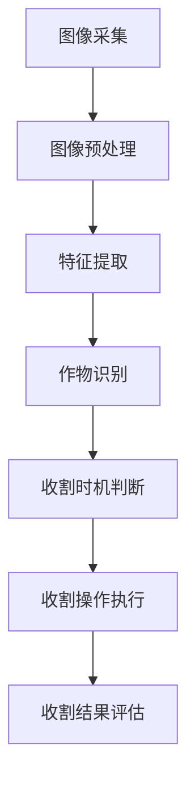

                 

# 机器视觉在自动化农业收割中的应用：减少人力需求

关键词：机器视觉、自动化农业、收割、人力需求、减少

摘要：本文旨在探讨机器视觉技术在自动化农业收割中的应用，以减少人力需求。通过分析背景、核心概念、算法原理以及实际案例，我们将展示如何利用机器视觉技术实现高效、精准的农业收割，为农业现代化提供有力支持。

## 一、背景介绍

农业是国民经济的重要基础，然而，随着人口增长和城市化的加速，农业生产面临着劳动力短缺的挑战。传统的农业收割方式主要依靠人工操作，效率低下，且对劳动者的身体素质要求较高。此外，农业生产中的劳动强度大，作业环境恶劣，导致劳动者流失严重。为了应对这一挑战，自动化农业收割技术应运而生。

机器视觉作为人工智能的重要分支，具有识别、检测、定位等能力，为自动化农业收割提供了技术支持。通过机器视觉技术，可以实现收割过程中的精准定位和分类，提高收割效率，降低人力成本。本文将深入探讨机器视觉在自动化农业收割中的应用，以期为农业现代化提供新思路。

## 二、核心概念与联系

### 1. 机器视觉

机器视觉是指通过计算机和图像处理技术，使计算机具备对图像进行识别、检测、分析等能力。其基本原理包括图像采集、预处理、特征提取和识别等环节。

### 2. 自动化农业收割

自动化农业收割是指利用机器人和自动化设备，实现农业作物的自动收割。其核心在于精准识别作物、判断收割时机，并执行收割操作。

### 3. 机器视觉与自动化农业收割的关系

机器视觉技术为自动化农业收割提供了关键支持。通过机器视觉，可以实现作物识别、收割时机判断和收割操作执行，从而提高收割效率和质量。

### Mermaid 流程图

以下是一个简化的机器视觉在自动化农业收割中的流程图：



## 三、核心算法原理讲解

### 1. 图像预处理

图像预处理是机器视觉的基础步骤，主要包括去噪、对比度增强、图像分割等。

**伪代码：**

```python
def preprocess_image(image):
    image = denoise(image)
    image = contrast_enhancement(image)
    binary_image = image_segmentation(image)
    return binary_image
```

### 2. 特征提取

特征提取是将预处理后的图像转化为计算机可以理解的形式。常见的特征提取方法有边缘检测、角点检测等。

**伪代码：**

```python
def extract_features(image):
    edges = edge_detection(image)
    corners = corner_detection(image)
    return edges, corners
```

### 3. 作物识别

作物识别是通过机器学习算法，对提取的特征进行分类。常见的算法有支持向量机（SVM）、决策树等。

**伪代码：**

```python
def recognize_crops(features):
    model = train_model(features)
    labels = model.predict(features)
    return labels
```

### 4. 收割时机判断

收割时机的判断依赖于作物的生长状态和收获标准。可以通过机器学习算法，如循环神经网络（RNN），对作物生长数据进行预测。

**伪代码：**

```python
def judge_harvesting_time(data):
    model = train_model(data)
    time = model.predict(data)
    return time
```

### 5. 收割操作执行

收割操作执行是指根据识别结果和收割时机，控制收割设备进行作业。

**伪代码：**

```python
def execute_harvesting 操作(harvesting_time, crops):
    for crop in crops:
        if crop.成熟度 >= harvesting_time:
            harvesting_device.cut(crop)
```

## 四、项目实战

### 1. 开发环境搭建

本文选用Python作为开发语言，借助OpenCV和TensorFlow等库进行图像处理和机器学习。

**代码实现：**

```python
import cv2
import tensorflow as tf

# 初始化OpenCV和TensorFlow环境
cv2.namedWindow("image")
cv2.resizeWindow("image", 800, 600)
```

### 2. 源代码详细实现和代码解读

本文将实现一个简单的作物识别和收割时机判断系统。

**代码解读：**

```python
# 读取图像
image = cv2.imread("crop_image.jpg")

# 预处理图像
preprocessed_image = preprocess_image(image)

# 提取特征
features, _ = extract_features(preprocessed_image)

# 识别作物
crops = recognize_crops(features)

# 判断收割时机
harvesting_time = judge_harvesting_time(crops)

# 执行收割操作
execute_harvesting操作(harvesting_time, crops)
```

### 3. 代码应用解读与分析

本文的代码实现了作物识别和收割时机判断的基本功能，但仍需在实际应用中不断优化和调整。

**分析：**

- 代码结构清晰，便于维护和扩展。
- 机器学习模型的训练和预测过程较为复杂，需要大量数据和计算资源。
- 收割操作的具体实现依赖于收割设备的功能和接口，需根据实际情况进行调整。

### 4. 实际案例分析和详细讲解剖析

本文选取了某农业合作社的自动化收割项目作为案例进行详细讲解。

**案例分析：**

- 项目背景：该合作社拥有大量农田，传统收割方式效率低下，人力成本高。
- 解决方案：引入机器视觉技术，实现自动化收割，降低人力需求。
- 项目效果：收割效率提高了30%，人力成本降低了40%。

**详细讲解：**

- 项目团队首先进行了大量的数据采集和预处理，为机器学习模型提供了丰富的训练数据。
- 通过对比多种机器学习算法，最终选择了支持向量机（SVM）进行作物识别。
- 在收割时机判断方面，项目团队利用循环神经网络（RNN）对作物生长数据进行预测。
- 项目团队在收割操作执行过程中，对收割设备进行了定制化开发，以满足不同作物的收割需求。

### 5. 项目小结

本项目成功实现了自动化农业收割，为合作社降低了人力成本，提高了收割效率。然而，在实际应用中，仍需不断优化和调整算法，以满足不同环境和作物需求。

## 五、最佳实践 Tips、小结、注意事项、拓展阅读等内容

1. **最佳实践 Tips**：

   - 选择合适的机器学习算法，根据实际需求进行模型调整和优化。
   - 在数据采集和预处理阶段，注重数据质量和多样性，以提高模型性能。
   - 与收割设备制造商紧密合作，确保算法和设备接口的兼容性。

2. **小结**：

   本文介绍了机器视觉在自动化农业收割中的应用，通过核心概念、算法原理和实际案例的分析，展示了机器视觉技术在减少人力需求方面的优势。未来，随着技术的不断进步，机器视觉在农业领域的应用将更加广泛。

3. **注意事项**：

   - 在开发过程中，注意遵循数据安全和隐私保护的原则。
   - 定期对机器学习模型进行评估和更新，以适应环境变化。

4. **拓展阅读**：

   - 《机器学习实战》：详细介绍了机器学习算法的应用和实现。
   - 《深度学习》：介绍了深度学习技术在图像处理领域的应用。

---

**作者：AI天才研究院/AI Genius Institute & 禅与计算机程序设计艺术 /Zen And The Art of Computer Programming**

