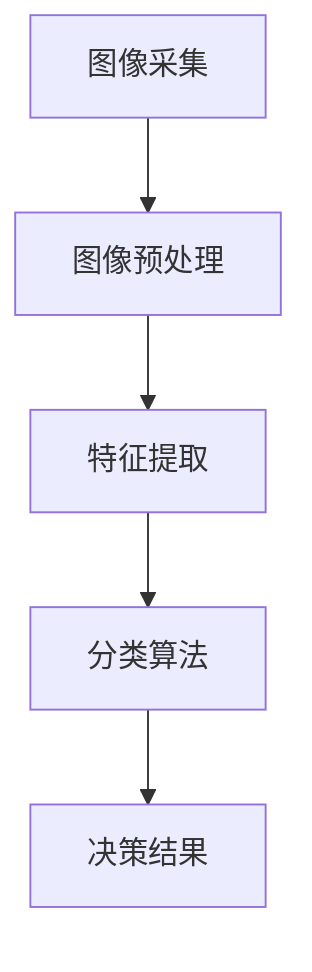
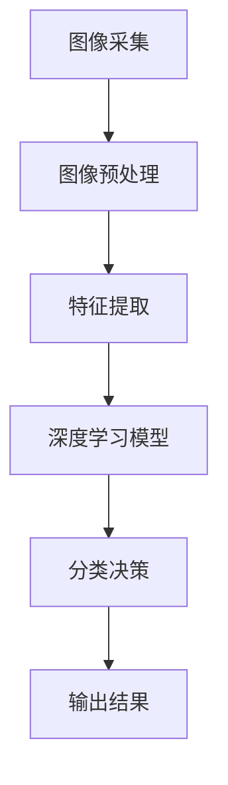

                 


### 文章标题：机器视觉在自动化农作物分级中的应用：提高农产品质量

#### 关键词：机器视觉、农作物分级、自动化、农产品质量、深度学习、图像处理

#### 摘要：
本文深入探讨了机器视觉在自动化农作物分级中的应用，分析了其在提高农产品质量方面的潜力。通过概述机器视觉技术基础、自动化农作物分级的挑战与机遇，以及核心算法和实际项目实践，本文旨在为读者提供一套完整的理解和应用机器视觉技术的框架，以推动农业生产智能化、提高农产品质量。

---

## 目录

### 第一部分：机器视觉与农作物分级概述

### 第二部分：核心技术

### 第三部分：项目实践

### 第四部分：案例分析

### 第五部分：总结与展望

---

### 第一部分：机器视觉与农作物分级概述

#### 第1章：机器视觉技术基础

#### 1.1 机器视觉的基本概念

**机器视觉的定义与工作原理**

- 机器视觉是一种通过计算机技术模拟人类视觉功能的技术，它能够使计算机“看懂”并处理图像信息。
- 机器视觉系统通常包括图像采集设备、图像处理算法和计算机分析系统。

**机器视觉的分类与应用领域**

- **按用途分类**：可分为工业视觉、医疗视觉、安全监控等。
- **按技术分类**：可分为光学机器视觉、电子机器视觉、热成像视觉等。
- **应用领域**：广泛应用于生产制造、医疗诊断、安全监控、交通管理等多个行业。

#### 1.2 图像处理与特征提取

**图像处理的基本操作**

- **滤波**：用于去除噪声，如高斯滤波、中值滤波。
- **边缘检测**：用于提取图像的边缘信息，如Canny算法、Sobel算子。
- **形态学操作**：如膨胀、腐蚀、开运算、闭运算等。

**特征提取技术及其应用**

- **灰度特征**：如像素值、均值、方差等。
- **纹理特征**：如方向梯度直方图（HOG）、灰度共生矩阵等。
- **形状特征**：如尺寸、周长、面积等。

**核心概念与联系**

- **流程图**：使用Mermaid流程图展示机器视觉系统的整体工作流程。



#### 1.3 深度学习在机器视觉中的应用

**深度学习的基础知识**

- **神经网络结构**：包括卷积神经网络（CNN）、循环神经网络（RNN）、生成对抗网络（GAN）等。
- **激活函数**：如ReLU、Sigmoid、Tanh等。

**深度学习模型在机器视觉中的应用**

- **目标检测**：如YOLO、Faster R-CNN等。
- **图像分割**：如U-Net、DeepLab等。
- **图像增强**：用于提高图像质量和可视化效果。

**核心概念与联系**

- **联系**：深度学习通过大规模数据训练，能够自动提取图像的复杂特征，从而提高分类和检测的准确性。

---

### 第二部分：核心技术

#### 第2章：图像采集与预处理

#### 2.1 图像采集设备与传感器

**图像采集设备**

- **相机类型**：如CCD相机、CMOS相机等。
- **分辨率与帧率**：高分辨率和高速帧率对图像质量有重要影响。

**传感器**

- **光谱范围**：包括可见光、红外、紫外等。
- **灵敏度**：影响传感器在不同环境下的性能。

**核心算法原理讲解**

- **预处理算法**：包括去噪、对比度增强、大小调整等，以确保图像质量。

#### 2.2 图像预处理技术

**图像增强**

- **直方图均衡化**：用于改善图像的对比度。
- **边缘增强**：使用Sobel算子或Canny算法进行边缘检测。

**图像滤波**

- **高斯滤波**：用于平滑图像，减少噪声。
- **中值滤波**：用于去除图像中的椒盐噪声。

**核心算法原理讲解**

- **伪代码**：展示图像增强和滤波算法的基本原理。

```python
# 直方图均衡化伪代码
def histogram_equalization(image):
    # 计算图像的直方图
    histogram = calculate_histogram(image)
    # 计算累积分布函数（CDF）
    cdf = cumulative_distribution_function(histogram)
    # 归一化CDF
    normalized_cdf = normalize_cdf(cdf)
    # 根据CDF进行图像变换
    equalized_image = apply_transform(image, normalized_cdf)
    return equalized_image

# 高斯滤波伪代码
def gauss_filter(image, sigma):
    # 创建高斯滤波器
    filter = create_gaussian_filter(sigma)
    # 应用滤波器
    filtered_image = apply_filter(image, filter)
    return filtered_image
```

---

### 第三部分：项目实践

#### 第3章：农作物分级系统的设计与实现

#### 3.1 系统设计

**硬件选择**

- **相机**：选择适合农作物图像采集的高分辨率相机。
- **光源**：根据农作物特性选择合适的光源，提高图像质量。

**软件架构**

- **数据预处理**：图像采集后，进行图像增强和滤波等预处理。
- **特征提取**：使用深度学习模型提取图像特征。
- **分类与决策**：根据提取的特征进行分类和决策。

**核心概念与联系**

- **架构图**：使用Mermaid流程图展示系统架构。



#### 3.2 系统实现

**开发环境搭建**

- **工具与库**：配置Python、TensorFlow等开发环境。
- **数据集准备**：收集并标注农作物图像数据。

**源代码详细实现**

- **图像预处理**：包括图像读取、增强、滤波等操作。

```python
import cv2
import numpy as np

def preprocess_image(image_path):
    image = cv2.imread(image_path)
    image = cv2.cvtColor(image, cv2.COLOR_BGR2RGB)
    image = cv2.resize(image, (224, 224))
    image = cv2.equalizeHist(image)
    return image
```

**代码解读与分析**

- **特征提取与分类**：使用深度学习模型进行特征提取和分类。

```python
from tensorflow.keras.applications import VGG16
from tensorflow.keras.preprocessing.image import ImageDataGenerator

# 加载预训练的VGG16模型
model = VGG16(weights='imagenet')

# 定义数据生成器
datagen = ImageDataGenerator(rescale=1./255)

# 预处理图像数据
def preprocess_image(image):
    image = datagen.flow(image.reshape(1, 224, 224, 3), batch_size=1).next()
    return image

# 特征提取与分类
def classify_image(image):
    processed_image = preprocess_image(image)
    features = model.predict(processed_image)
    prediction = model.predict_classes(features)
    return prediction
```

**实际案例分析和详细讲解剖析**

- **案例展示**：分析一个实际的农作物分级案例，展示系统如何工作。

#### 3.3 系统测试与优化

**系统测试**

- **准确率与召回率**：评估模型在不同农作物分类任务中的性能。
- **速度与效率**：测试系统在处理大量图像时的速度和效率。

**优化策略**

- **模型调优**：调整学习率、批量大小等超参数。
- **数据增强**：使用数据增强技术提高模型的泛化能力。

**项目小结**

- **经验总结**：总结项目中的关键经验和教训。

---

### 第四部分：案例分析

#### 第4章：成功案例研究

#### 4.1 案例研究

- **项目背景**：介绍一个成功的农作物分级项目。
- **项目目标**：明确项目目标和预期成果。
- **解决方案**：详细描述解决方案，包括技术路线和实施过程。
- **实施效果**：展示项目实施后的效果，包括性能指标和用户反馈。

#### 4.2 案例经验总结

- **成功经验**：总结项目中的成功经验和关键因素。
- **教训与改进**：分析项目中的问题和改进措施。

---

### 第五部分：总结与展望

#### 第5章：未来趋势与研究方向

- **未来趋势**：分析机器视觉在农作物分级领域的未来发展趋势。
- **研究方向**：探讨机器视觉技术的潜在研究方向和挑战。

---

### 作者信息

- **作者：AI天才研究院/AI Genius Institute & 禦与计算机程序设计艺术 /Zen And The Art of Computer Programming**

---

## 结束语

本文系统地介绍了机器视觉在自动化农作物分级中的应用，从基础概念到核心技术，再到实际项目实践，为读者提供了一个全面的视角。通过本文，读者可以了解到机器视觉技术在提高农产品质量中的巨大潜力，以及如何将其应用到实际生产中。随着人工智能技术的不断发展，机器视觉在农业生产中的应用前景将更加广阔，有望为农业现代化作出更大的贡献。

