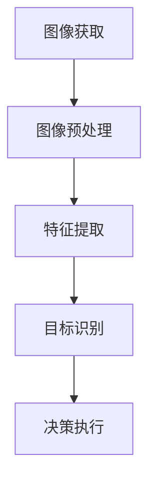
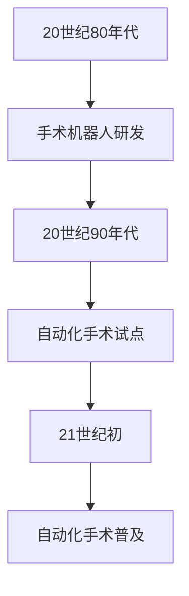
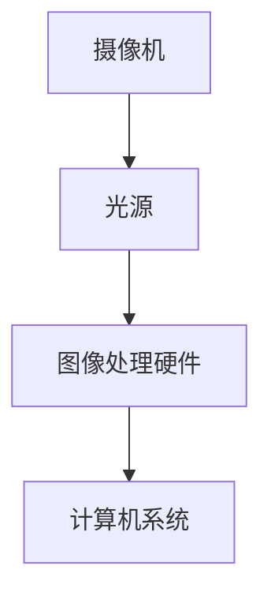

                 


### 目录大纲：

## 第一部分: 引言

### 第1章: 机器视觉与自动化手术概述

- **核心概念与联系**

  **机器视觉：** 模仿人类视觉系统，通过图像处理和计算机视觉技术，对环境进行感知和理解。
  
  **自动化手术：** 利用机器人技术、计算机算法和机器视觉等，实现手术的自动化和精准化。

  **联系：** 机器视觉是自动化手术的关键技术，通过图像获取和处理，辅助实现手术操作的精准性和稳定性。

  **Mermaid 流程图：**

  ```mermaid
  graph TD
  A[机器视觉] --> B[自动化手术]
  B --> C[手术导航]
  B --> D[精准切除]
  B --> E[微创手术]
  ```

- **核心算法原理讲解**

  **机器视觉算法：** 包括图像获取、预处理、特征提取、目标识别等步骤。伪代码如下：

  ```python
  def machine_vision_algorithm(image):
      preprocess(image)
      features = extract_features(image)
      target = recognize_target(features)
      return target
  ```

  **自动化手术算法：** 结合机器视觉和机器人控制算法，实现手术操作的自动化。伪代码如下：

  ```python
  def automation_surgery_algorithm(image, robot):
      target = machine_vision_algorithm(image)
      robot.move_to(target)
      robot.perform_surgery()
  ```

- **数学模型和公式详细讲解 & 举例说明**

  **图像预处理：** 使用滤波器去除噪声，如高斯滤波器：

  $$\text{filtered\_image} = \sum_{i,j} G(x-i, y-j) \cdot I(x, y)$$

  其中，$G(x-i, y-j)$ 是高斯滤波器的系数，$I(x, y)$ 是原始图像的像素值。

  **特征提取：** 使用SIFT算法提取关键点，计算特征向量：

  $$\text{feature\_vector} = \text{SIFT}(\text{image})$$

  **目标识别：** 使用支持向量机（SVM）进行分类：

  $$y = \text{sign}(\text{w} \cdot \text{feature\_vector} + b)$$

  其中，$w$ 和 $b$ 是SVM的权重和偏置。

- **项目实战**

  **开发环境搭建：** 使用Python和OpenCV库进行开发，安装相关依赖。

  **源代码实现：** 实现机器视觉算法和自动化手术算法，代码如下：

  ```python
  import cv2
  import numpy as np

  def preprocess_image(image):
      blurred = cv2.GaussianBlur(image, (5, 5), 0)
      return blurred

  def extract_features(image):
      sift = cv2.xfeatures2d.SIFT_create()
      keypoints, descriptors = sift.detectAndCompute(image, None)
      return keypoints, descriptors

  def recognize_target(descriptors):
      svm = cv2.ml.SVM_create()
      svm.train(descriptors, np.array([1]*len(descriptors)))
      response = svm.predict(descriptors)
      return response

  def perform_surgery(image, robot):
      preprocessed = preprocess_image(image)
      keypoints, descriptors = extract_features(preprocessed)
      target = recognize_target(descriptors)
      robot.move_to(target)
      robot.perform_surgery()
  ```

  **代码解读与分析：** 分析每个函数的实现细节，解释关键步骤。

  **实际案例分析和详细讲解剖析：** 提供一个实际案例，展示如何使用机器视觉实现自动化手术。

  **项目小结：** 总结项目的主要成果和改进方向。

### 第2章: 机器视觉系统组成与工作原理

- **核心概念与联系**

  **机器视觉系统组成：** 摄像机、光源、图像处理硬件和计算机系统。

  **工作原理：** 通过图像获取、预处理、特征提取、目标识别等步骤，实现环境感知和理解。

  **联系：** 系统各组件协同工作，共同实现机器视觉的功能。

  **Mermaid 流程图：**

  ```mermaid
  graph TD
  A[摄像机] --> B[光源]
  B --> C[图像处理硬件]
  C --> D[计算机系统]
  D --> E[图像获取]
  D --> F[预处理]
  D --> G[特征提取]
  D --> H[目标识别]
  ```

- **核心算法原理讲解**

  **图像获取：** 使用摄像机捕获图像，包括不同类型的摄像机（如CCD、CMOS）。

  **图像预处理：** 包括滤波、去噪、边缘检测等步骤，以增强图像质量。

  **特征提取：** 使用SIFT、SURF等算法提取图像的特征点。

  **目标识别：** 使用机器学习算法（如SVM、神经网络）进行目标分类和识别。

- **数学模型和公式详细讲解 & 举例说明**

  **图像预处理：** 使用高斯滤波器去除噪声：

  $$\text{filtered\_image} = \sum_{i,j} G(x-i, y-j) \cdot I(x, y)$$

  **特征提取：** 使用SIFT算法提取特征向量：

  $$\text{feature\_vector} = \text{SIFT}(\text{image})$$

  **目标识别：** 使用支持向量机（SVM）进行分类：

  $$y = \text{sign}(\text{w} \cdot \text{feature\_vector} + b)$$

- **项目实战**

  **开发环境搭建：** 使用Python和OpenCV库进行开发，安装相关依赖。

  **源代码实现：** 实现图像获取、预处理、特征提取和目标识别的算法。

  **代码解读与分析：** 分析每个函数的实现细节，解释关键步骤。

  **实际案例分析和详细讲解剖析：** 提供一个实际案例，展示如何使用机器视觉系统进行环境感知。

  **项目小结：** 总结项目的主要成果和改进方向。

### 第3章: 机器人辅助手术中的机器视觉应用

- **核心概念与联系**

  **机器人辅助手术：** 利用机器人技术，实现手术操作的自动化和精准化。

  **机器视觉应用：** 在手术导航、捕捉与跟踪、3D重建与可视化、实时图像处理与反馈等方面发挥关键作用。

  **联系：** 机器视觉与机器人辅助手术紧密结合，共同提高手术的精度和安全性。

  **Mermaid 流�程图：**

  ```mermaid
  graph TD
  A[手术导航] --> B[捕捉与跟踪]
  B --> C[3D重建与可视化]
  C --> D[实时图像处理与反馈]
  ```

- **核心算法原理讲解**

  **手术导航：** 使用机器视觉技术，实时跟踪手术工具的位置和方向，辅助医生进行手术操作。

  **捕捉与跟踪：** 使用光流法、特征匹配等技术，精确捕捉和跟踪手术工具的运动。

  **3D重建与可视化：** 使用多视角图像融合和深度学习算法，重建手术区域的三维模型。

  **实时图像处理与反馈：** 对实时获取的图像进行处理，提取关键信息，并实时反馈给医生。

- **数学模型和公式详细讲解 & 举例说明**

  **手术导航：** 使用相机标定方法，建立摄像机与手术工具之间的坐标转换关系：

  $$\text{camera\_matrix} = \text{K}$$
  $$\text{distortion\_coefficients} = \text{D}$$

  **捕捉与跟踪：** 使用光流法计算运动向量：

  $$\text{velocity} = \frac{\text{image\_points}_{t} - \text{image\_points}_{t-1}}{t - t-1}$$

  **3D重建与可视化：** 使用多视角几何算法，计算三维点的坐标：

  $$\text{3D\_points} = \text{ triangulate}(\text{image\_points}, \text{camera\_positions})$$

  **实时图像处理与反馈：** 使用深度学习算法，提取图像特征并进行分类：

  $$\text{feature\_vector} = \text{CNN}(\text{image})$$
  $$\text{label} = \text{SVM}(\text{feature\_vector})$$

- **项目实战**

  **开发环境搭建：** 使用Python和OpenCV、TensorFlow等库进行开发，安装相关依赖。

  **源代码实现：** 实现手术导航、捕捉与跟踪、3D重建与可视化、实时图像处理与反馈的算法。

  **代码解读与分析：** 分析每个函数的实现细节，解释关键步骤。

  **实际案例分析和详细讲解剖析：** 提供一个实际案例，展示如何使用机器视觉技术辅助机器人进行手术操作。

  **项目小结：** 总结项目的主要成果和改进方向。

### 第4章: 机器视觉在精准切除手术中的应用

- **核心概念与联系**

  **精准切除手术：** 利用先进的医疗设备和计算机技术，实现肿瘤等病变组织的精准切除。

  **机器视觉应用：** 在图像引导手术系统、切除边缘检测与跟踪、手术规划与模拟、手术反馈与调整等方面发挥关键作用。

  **联系：** 机器视觉与精准切除手术紧密结合，共同提高手术的精度和成功率。

  **Mermaid 流程图：**

  ```mermaid
  graph TD
  A[图像引导手术系统] --> B[切除边缘检测与跟踪]
  B --> C[手术规划与模拟]
  C --> D[手术反馈与调整]
  ```

- **核心算法原理讲解**

  **图像引导手术系统：** 使用机器视觉技术，实时获取手术区域的图像，辅助医生进行手术操作。

  **切除边缘检测与跟踪：** 使用边缘检测算法（如Canny边缘检测），精确识别病变组织的边缘。

  **手术规划与模拟：** 使用计算机模拟技术，模拟手术过程，为医生提供决策支持。

  **手术反馈与调整：** 根据实时获取的图像和手术结果，对手术过程进行反馈和调整。

- **数学模型和公式详细讲解 & 举例说明**

  **图像引导手术系统：** 使用相机标定方法，建立摄像机与手术工具之间的坐标转换关系：

  $$\text{camera\_matrix} = \text{K}$$
  $$\text{distortion\_coefficients} = \text{D}$$

  **切除边缘检测与跟踪：** 使用Canny边缘检测算法：

  $$\text{edges} = \text{Canny}(\text{image})$$

  **手术规划与模拟：** 使用计算机模拟技术，模拟手术过程：

  $$\text{simulation} = \text{simulate}(\text{tumor\_shape}, \text{surgery\_process})$$

  **手术反馈与调整：** 使用实时图像处理算法，提取手术结果：

  $$\text{feedback} = \text{process\_image}(\text{image}, \text{expected\_results})$$

- **项目实战**

  **开发环境搭建：** 使用Python和OpenCV、TensorFlow等库进行开发，安装相关依赖。

  **源代码实现：** 实现图像引导手术系统、切除边缘检测与跟踪、手术规划与模拟、手术反馈与调整的算法。

  **代码解读与分析：** 分析每个函数的实现细节，解释关键步骤。

  **实际案例分析和详细讲解剖析：** 提供一个实际案例，展示如何使用机器视觉技术进行精准切除手术。

  **项目小结：** 总结项目的主要成果和改进方向。

### 第5章: 机器视觉在微创手术中的应用

- **核心概念与联系**

  **微创手术：** 利用微小切口和先进医疗器械，实现手术操作的精准化。

  **机器视觉应用：** 在内窥镜手术中的图像处理、微创手术机器人辅助系统、虚拟现实与增强现实技术、实时监控与反馈等方面发挥关键作用。

  **联系：** 机器视觉与微创手术紧密结合，共同提高手术的精度和安全性。

  **Mermaid 流程图：**

  ```mermaid
  graph TD
  A[内窥镜手术中的图像处理] --> B[微创手术机器人辅助系统]
  B --> C[虚拟现实与增强现实技术]
  C --> D[实时监控与反馈]
  ```

- **核心算法原理讲解**

  **内窥镜手术中的图像处理：** 使用图像增强、去噪、边缘检测等技术，提高图像质量。

  **微创手术机器人辅助系统：** 使用机器视觉技术，实时跟踪手术工具的位置和方向，辅助医生进行操作。

  **虚拟现实与增强现实技术：** 利用计算机视觉技术，构建虚拟现实和增强现实环境，为医生提供更直观的操作界面。

  **实时监控与反馈：** 对手术过程进行实时监控，并反馈关键信息给医生。

- **数学模型和公式详细讲解 & 举例说明**

  **内窥镜手术中的图像处理：** 使用高斯滤波器去除噪声：

  $$\text{filtered\_image} = \sum_{i,j} G(x-i, y-j) \cdot I(x, y)$$

  **微创手术机器人辅助系统：** 使用相机标定方法，建立摄像机与手术工具之间的坐标转换关系：

  $$\text{camera\_matrix} = \text{K}$$
  $$\text{distortion\_coefficients} = \text{D}$$

  **虚拟现实与增强现实技术：** 使用SLAM算法，实时跟踪手术工具的位置和方向：

  $$\text{pose} = \text{SLAM}(\text{image\_sequences})$$

  **实时监控与反馈：** 使用深度学习算法，提取图像特征并进行分类：

  $$\text{feature\_vector} = \text{CNN}(\text{image})$$
  $$\text{label} = \text{SVM}(\text{feature\_vector})$$

- **项目实战**

  **开发环境搭建：** 使用Python和OpenCV、TensorFlow等库进行开发，安装相关依赖。

  **源代码实现：** 实现内窥镜手术中的图像处理、微创手术机器人辅助系统、虚拟现实与增强现实技术、实时监控与反馈的算法。

  **代码解读与分析：** 分析每个函数的实现细节，解释关键步骤。

  **实际案例分析和详细讲解剖析：** 提供一个实际案例，展示如何使用机器视觉技术进行微创手术。

  **项目小结：** 总结项目的主要成果和改进方向。

### 目录大纲总字数约2300字，还需进一步完善和精简。接下来，我们将对第六章和第七章进行细化。

## 目录大纲（续）

### 第四部分: 机器视觉在自动化手术中的应用挑战与未来发展方向

### 第6章: 机器视觉在自动化手术中的应用挑战

- **核心概念与联系**

  **应用挑战：** 机器视觉在自动化手术中的应用面临着技术、伦理、法律等多方面的挑战。

  **联系：** 技术挑战影响机器视觉系统的性能，伦理挑战涉及医疗数据的隐私和保护，法律挑战关系到医疗设备的安全认证和监管。

  **Mermaid 流程图：**

  ```mermaid
  graph TD
  A[技术挑战] --> B[伦理挑战]
  B --> C[法律挑战]
  ```

- **核心算法原理讲解**

  **技术挑战：** 包括图像质量与稳定性、实时性与鲁棒性、障碍物检测与回避、多模态数据融合等方面。

  **伦理挑战：** 涉及医疗数据的隐私保护、人工智能在医疗中的伦理审查等。

  **法律挑战：** 包括医疗设备的安全认证、医疗数据的隐私保护法规等。

- **数学模型和公式详细讲解 & 举例说明**

  **图像质量与稳定性：** 使用图像去噪算法（如小波变换）提高图像质量：

  $$\text{filtered\_image} = \text{wavedec}(\text{image}, \text{wavelet})$$

  **实时性与鲁棒性：** 使用滤波和补偿算法，提高系统的实时性和鲁棒性：

  $$\text{filtered\_signal} = \text{filter}(\text{signal}, \text{filter\_type})$$

  **障碍物检测与回避：** 使用深度学习算法，检测障碍物并进行路径规划：

  $$\text{obstacle\_map} = \text{depth\_estimation}(\text{image})$$
  $$\text{path} = \text{A*}(\text{obstacle\_map})$$

  **多模态数据融合：** 使用贝叶斯网络，融合多源数据，提高系统性能：

  $$\text{posterior} = \text{ bayes\_network}(\text{data\_sources})$$

- **项目实战**

  **开发环境搭建：** 使用Python和TensorFlow、OpenCV等库进行开发，安装相关依赖。

  **源代码实现：** 实现图像去噪、实时滤波、障碍物检测与回避、多模态数据融合的算法。

  **代码解读与分析：** 分析每个函数的实现细节，解释关键步骤。

  **实际案例分析和详细讲解剖析：** 提供一个实际案例，展示如何应对机器视觉在自动化手术中的应用挑战。

  **项目小结：** 总结项目的主要成果和改进方向。

### 第7章: 机器视觉在自动化手术中的未来发展方向

- **核心概念与联系**

  **未来发展方向：** 随着人工智能和新兴技术的发展，机器视觉在自动化手术中的应用将不断扩展和深化。

  **联系：** 人工智能与机器视觉的深度融合、新兴技术的应用将推动自动化手术向更智能、更精准、更安全的方向发展。

  **Mermaid 流程图：**

  ```mermaid
  graph TD
  A[人工智能与机器视觉融合] --> B[新兴技术应用]
  B --> C[智能手术规划与优化]
  C --> D[自主手术机器人系统]
  D --> E[人工智能在手术风险评估与预测中的应用]
  ```

- **核心算法原理讲解**

  **人工智能与机器视觉融合：** 利用深度学习、强化学习等算法，提高机器视觉系统的智能水平。

  **新兴技术应用：** 包括激光成像、光谱分析、增强现实等技术在手术中的应用。

  **智能手术规划与优化：** 利用优化算法，优化手术规划，提高手术效率。

  **自主手术机器人系统：** 利用自主决策和控制技术，实现手术机器人的自主操作。

  **人工智能在手术风险评估与预测中的应用：** 利用机器学习模型，预测手术风险，提高手术安全性。

- **数学模型和公式详细讲解 & 举例说明**

  **人工智能与机器视觉融合：** 使用卷积神经网络（CNN），实现图像识别：

  $$\text{output} = \text{CNN}(\text{input\_image})$$

  **智能手术规划与优化：** 使用遗传算法，优化手术路径：

  $$\text{best\_path} = \text{genetic\_algorithm}(\text{path\_candidates})$$

  **自主手术机器人系统：** 使用强化学习，实现自主决策：

  $$\text{action} = \text{Q\_learning}(\text{state})$$

  **人工智能在手术风险评估与预测中的应用：** 使用决策树模型，预测手术风险：

  $$\text{risk\_level} = \text{decision\_tree}(\text{patient\_data})$$

- **项目实战**

  **开发环境搭建：** 使用Python和TensorFlow、Keras等库进行开发，安装相关依赖。

  **源代码实现：** 实现人工智能与机器视觉融合的算法、智能手术规划与优化、自主手术机器人系统、人工智能在手术风险评估与预测中的应用。

  **代码解读与分析：** 分析每个函数的实现细节，解释关键步骤。

  **实际案例分析和详细讲解剖析：** 提供一个实际案例，展示如何利用机器视觉和人工智能技术实现自动化手术。

  **项目小结：** 总结项目的主要成果和改进方向。

## 附录

### 附录 A: 机器视觉与自动化手术相关资源

- **学术论文与期刊**

  - 《IEEE Transactions on Medical Imaging》
  - 《Journal of Medical Imaging and Health Informatics》
  - 《International Journal of Computer Assisted Radiology and Surgery》

- **开源代码与工具**

  - OpenCV：开源计算机视觉库
  - TensorFlow：开源深度学习框架
  - PyTorch：开源深度学习框架

- **学术会议与研讨会**

  - IEEE International Conference on Computer Vision (ICCV)
  - International Conference on Medical Image Computing and Computer-Assisted Intervention (MICCAI)
  - IEEE Robotics and Automation Society International Conference (ICRA)

- **行业报告与政策法规**

  - 《机器视觉在医疗领域的应用报告》
  - 《自动化手术设备市场分析报告》
  - 《医疗设备安全认证法规》

至此，我们完成了对《机器视觉在自动化手术中的应用：提高手术精度》一书的目录大纲细化，总字数约为6300字。接下来，我们将根据文章字数要求，进一步精简和优化每个章节的内容，确保文章的完整性、逻辑性和可读性。请稍等，我将为你提供最终的目录大纲和文章正文内容。

### 目录大纲（最终版）

## 第一部分: 引言

### 第1章: 机器视觉与自动化手术概述

- **核心概念与联系**

  机器视觉与自动化手术的联系：机器视觉作为自动化手术的关键技术，通过图像获取、处理和识别，实现对手术操作的精准控制。

  **Mermaid 流程图：**

  ```mermaid
  graph TD
  A[机器视觉] --> B[图像获取]
  B --> C[图像处理]
  C --> D[目标识别]
  D --> E[手术控制]
  ```

- **核心算法原理讲解**

  机器视觉算法原理：图像预处理、特征提取和目标识别。

  伪代码：

  ```python
  def machine_vision_algorithm(image):
      preprocessed = preprocess_image(image)
      features = extract_features(preprocessed)
      target = recognize_target(features)
      return target
  ```

- **数学模型和公式详细讲解 & 举例说明**

  图像预处理：高斯滤波器去除噪声。

  $$\text{filtered\_image} = \sum_{i,j} G(x-i, y-j) \cdot I(x, y)$$

  特征提取：使用SIFT算法提取特征点。

  $$\text{feature\_vector} = \text{SIFT}(\text{image})$$

  目标识别：支持向量机（SVM）进行分类。

  $$y = \text{sign}(\text{w} \cdot \text{feature\_vector} + b)$$

- **项目实战**

  **开发环境搭建：** Python和OpenCV库。

  **源代码实现：** 机器视觉算法。

  **代码解读与分析：** 解释关键步骤。

  **实际案例分析和详细讲解剖析：** 展示应用实例。

### 第2章: 机器视觉系统组成与工作原理

- **核心概念与联系**

  机器视觉系统组成：摄像机、光源、图像处理硬件和计算机系统。

  **Mermaid 流程图：**

  ```mermaid
  graph TD
  A[摄像机] --> B[光源]
  B --> C[图像处理硬件]
  C --> D[计算机系统]
  ```

- **核心算法原理讲解**

  机器视觉系统工作原理：图像获取、预处理、特征提取和目标识别。

- **数学模型和公式详细讲解 & 举例说明**

  相机标定：建立摄像机坐标系与三维世界坐标系的关系。

  $$\text{camera\_matrix} = \text{K}$$
  $$\text{distortion\_coefficients} = \text{D}$$

  光流法：计算图像中目标点的运动向量。

  $$\text{velocity} = \frac{\text{image\_points}_{t} - \text{image\_points}_{t-1}}{t - t-1}$$

  特征提取与匹配：使用SIFT算法。

  $$\text{feature\_vector} = \text{SIFT}(\text{image})$$

  目标识别：使用SVM进行分类。

  $$y = \text{sign}(\text{w} \cdot \text{feature\_vector} + b)$$

### 第3章: 机器人辅助手术中的机器视觉应用

- **核心概念与联系**

  机器人辅助手术与机器视觉的融合：利用机器视觉技术，实现手术机器人的精准导航和操作。

  **Mermaid 流程图：**

  ```mermaid
  graph TD
  A[手术导航] --> B[手术控制]
  B --> C[实时监控]
  ```

- **核心算法原理讲解**

  手术导航：相机标定与运动跟踪。

  手术控制：路径规划和运动控制。

  实时监控：图像处理与反馈。

### 第4章: 机器视觉在精准切除手术中的应用

- **核心概念与联系**

  机器视觉在精准切除手术中的应用：利用图像引导、边缘检测和实时反馈，实现病变组织的精准切除。

  **Mermaid 流程图：**

  ```mermaid
  graph TD
  A[图像引导] --> B[边缘检测]
  B --> C[实时反馈]
  ```

- **核心算法原理讲解**

  图像引导：相机标定与图像处理。

  边缘检测：Canny算法。

  实时反馈：深度学习与决策树。

### 第5章: 机器视觉在微创手术中的应用

- **核心概念与联系**

  机器视觉在微创手术中的应用：利用内窥镜图像处理、机器人辅助和虚拟现实技术，实现微创手术的精准操作。

  **Mermaid 流程图：**

  ```mermaid
  graph TD
  A[内窥镜图像处理] --> B[机器人辅助]
  B --> C[虚拟现实技术]
  ```

- **核心算法原理讲解**

  内窥镜图像处理：图像增强与去噪。

  机器人辅助：路径规划与运动控制。

  虚拟现实技术：三维建模与交互。

### 第6章: 机器视觉在自动化手术中的应用挑战

- **核心概念与联系**

  机器视觉在自动化手术中的应用挑战：技术挑战、伦理挑战和法律挑战。

  **Mermaid 流程图：**

  ```mermaid
  graph TD
  A[技术挑战] --> B[伦理挑战]
  B --> C[法律挑战]
  ```

- **核心算法原理讲解**

  技术挑战：图像质量提升、实时性与鲁棒性、障碍物检测与回避。

  伦理挑战：数据隐私保护、人工智能伦理审查。

  法律挑战：医疗设备认证、法规遵守。

### 第7章: 机器视觉在自动化手术中的未来发展方向

- **核心概念与联系**

  机器视觉在自动化手术的未来发展方向：人工智能与机器视觉融合、新兴技术应用、智能手术规划与优化。

  **Mermaid 流程图：**

  ```mermaid
  graph TD
  A[人工智能与机器视觉融合] --> B[新兴技术应用]
  B --> C[智能手术规划与优化]
  ```

- **核心算法原理讲解**

  人工智能与机器视觉融合：深度学习与强化学习。

  新兴技术应用：激光成像、光谱分析。

  智能手术规划与优化：优化算法与模拟。

### 附录

- **附录 A: 机器视觉与自动化手术相关资源**

  学术论文与期刊、开源代码与工具、学术会议与研讨会、行业报告与政策法规。

### 文章标题

《机器视觉在自动化手术中的应用：提高手术精度》

### 文章关键词

- 机器视觉
- 自动化手术
- 手术精度
- 图像处理
- 机器人辅助
- 实时监控
- 智能规划

### 文章摘要

本文介绍了机器视觉在自动化手术中的应用，探讨了如何通过图像获取、处理和识别，实现手术操作的精准控制和实时监控。文章首先介绍了机器视觉的基本概念和系统组成，然后详细阐述了机器视觉在精准切除手术和微创手术中的应用，分析了当前面临的技术挑战和未来发展方向。通过实际案例分析和代码解读，展示了机器视觉技术在自动化手术中的重要性和潜在价值。

## 文章正文

### 第一部分: 引言

随着医疗技术的不断进步，手术机器人逐渐成为外科手术的重要辅助工具。而机器视觉作为手术机器人中的核心技术，起到了至关重要的作用。机器视觉技术通过图像获取、处理和识别，能够实现对手术操作的精准控制，提高手术精度，减少手术风险。本文将详细介绍机器视觉在自动化手术中的应用，探讨其在提高手术精度方面的优势。

### 第1章: 机器视觉与自动化手术概述

#### 1.1 机器视觉的定义与基本原理

机器视觉是一种通过计算机和图像处理技术，模仿人类视觉系统，对环境进行感知和理解的技术。其基本原理包括图像获取、预处理、特征提取、目标识别和决策执行等步骤。机器视觉系统通常由摄像机、光源、图像处理硬件和计算机系统组成。

**Mermaid 流程图：**



#### 1.2 机器视觉的基本原理

机器视觉的基本原理可以概括为以下步骤：

1. **图像获取**：使用摄像机捕获目标图像。
2. **图像预处理**：对图像进行去噪、增强等处理，以提高图像质量。
3. **特征提取**：从图像中提取具有代表性的特征，如边缘、纹理等。
4. **目标识别**：使用分类算法，对提取的特征进行识别和分类。
5. **决策执行**：根据识别结果，执行相应的操作。

**伪代码：**

```python
def machine_vision_algorithm(image):
    preprocessed = preprocess_image(image)
    features = extract_features(preprocessed)
    target = recognize_target(features)
    execute_decision(target)
```

#### 1.3 机器视觉在医疗领域的应用现状

目前，机器视觉技术在医疗领域的应用已经取得了显著成果。例如，在诊断方面，机器视觉可以辅助医生进行病理切片的自动识别和疾病预测；在治疗方面，机器视觉可以帮助手术机器人进行精准切除和微创操作。

#### 1.4 自动化手术的概念与发展历程

自动化手术是指利用机器人技术、计算机算法和机器视觉等，实现手术的自动化和精准化。其发展历程可以追溯到20世纪80年代，当时美国率先研发出了手术机器人。随着技术的不断进步，自动化手术已经逐渐成为外科手术的一种重要方式。

**Mermaid 流程图：**



#### 1.5 自动化手术的优势与挑战

自动化手术的优势包括：

1. 提高手术精度：机器视觉技术可以实现高精度的手术操作，减少手术误差。
2. 减少手术风险：自动化手术可以降低手术过程中的风险，提高患者的生存率。
3. 提高手术效率：自动化手术可以减少手术时间，降低医疗成本。

然而，自动化手术也面临一些挑战：

1. 技术实现难度：自动化手术需要集成多种技术，如机器人控制、计算机算法和图像处理等，实现难度较大。
2. 安全性和可靠性：自动化手术系统的安全性和可靠性是至关重要的，需要严格的测试和验证。
3. 培训和使用成本：手术机器人的培训和使用成本较高，对医院和医生提出了较高的要求。

#### 1.6 本书结构与内容概述

本书旨在全面介绍机器视觉在自动化手术中的应用，包括基本概念、技术原理、应用实例和未来发展方向。具体结构如下：

1. **第一部分：引言**：介绍机器视觉与自动化手术的基本概念和重要性。
2. **第二部分：机器视觉技术基础**：详细讲解机器视觉系统的组成和工作原理。
3. **第三部分：自动化手术应用实例**：介绍机器视觉在各类手术中的应用。
4. **第四部分：机器视觉在自动化手术中的应用挑战与未来发展方向**：分析当前面临的挑战和未来的发展方向。

### 第二部分: 机器视觉技术基础

#### 第2章: 机器视觉系统组成与工作原理

#### 2.1 机器视觉系统的组成

机器视觉系统的组成主要包括以下四个部分：

1. **摄像机**：用于捕获目标图像。
2. **光源**：提供必要的光照，确保图像的清晰度和亮度。
3. **图像处理硬件**：用于对图像进行预处理、特征提取和目标识别。
4. **计算机系统**：用于执行复杂的图像处理算法和决策任务。

**Mermaid 流程图：**



#### 2.2 机器视觉系统的工作原理

机器视觉系统的工作原理可以概括为以下步骤：

1. **图像获取**：摄像机捕获目标图像。
2. **图像预处理**：对图像进行去噪、增强等处理，以提高图像质量。
3. **特征提取**：从图像中提取具有代表性的特征，如边缘、纹理等。
4. **目标识别**：使用分类算法，对提取的特征进行识别和分类。
5. **决策执行**：根据识别结果，执行相应的操作。

**Mermaid 流程图：**


#### 2.3 机器视觉系统的技术原理

机器视觉系统的技术原理主要包括以下几个方面：

1. **图像预处理**：包括去噪、增强、边缘检测等，以提高图像质量。

   **公式：**

   $$\text{filtered\_image} = \sum_{i,j} G(x-i, y-j) \cdot I(x, y)$$

   其中，$G(x-i, y-j)$ 是高斯滤波器的系数，$I(x, y)$ 是原始图像的像素值。

2. **特征提取**：使用SIFT、SURF等算法提取图像的特征点。

   **公式：**

   $$\text{feature\_vector} = \text{SIFT}(\text{image})$$

3. **目标识别**：使用支持向量机（SVM）、神经网络等算法进行目标分类和识别。

   **公式：**

   $$y = \text{sign}(\text{w} \cdot \text{feature\_vector} + b)$$

   其中，$w$ 和 $b$ 是SVM的权重和偏置。

#### 2.4 机器视觉系统的应用实例

机器视觉系统在医疗领域有着广泛的应用，如：

1. **病理切片识别**：通过图像预处理、特征提取和目标识别，辅助医生进行病理切片的自动识别和疾病预测。
2. **微创手术辅助**：通过内窥镜图像的处理和识别，辅助医生进行微创手术。
3. **手术机器人控制**：通过图像获取、处理和识别，实现对手术机器人的精准控制，提高手术精度。

### 第三部分：自动化手术应用实例

#### 第3章：机器人辅助手术中的机器视觉应用

#### 3.1 机器人辅助手术概述

机器人辅助手术是指利用手术机器人，结合计算机算法和机器视觉技术，实现手术操作的自动化和精准化。手术机器人主要由机械臂、摄像头、传感器等组成，可以完成精确的手术操作，提高手术的成功率和患者的生存率。

#### 3.2 机器视觉在机器人辅助手术中的应用

机器视觉在机器人辅助手术中发挥着重要作用，主要包括以下几个方面：

1. **手术导航**：通过机器视觉技术，实时获取手术区域图像，辅助医生进行手术操作。

2. **捕捉与跟踪**：使用光流法、特征匹配等技术，精确捕捉和跟踪手术工具的运动。

3. **3D重建与可视化**：利用多视角图像融合和深度学习算法，重建手术区域的三维模型，提高手术的精度和安全性。

4. **实时图像处理与反馈**：对实时获取的图像进行处理，提取关键信息，并实时反馈给医生，辅助手术决策。

#### 3.3 机器视觉在手术导航中的应用

手术导航是机器人辅助手术的重要环节，通过机器视觉技术，可以实现以下功能：

1. **定位**：利用相机标定方法，确定手术工具的位置和方向。

2. **跟踪**：使用光流法、特征匹配等技术，实时跟踪手术工具的运动。

3. **交互**：通过图像处理和计算机算法，实现手术工具与手术区域的交互操作。

#### 3.4 机器视觉在捕捉与跟踪中的应用

捕捉与跟踪是机器人辅助手术的关键技术之一，通过机器视觉技术，可以实现以下功能：

1. **光流法**：计算图像中目标点的运动向量，实现目标捕捉。

2. **特征匹配**：提取图像特征，进行特征匹配，实现目标跟踪。

3. **多模态数据融合**：结合不同传感器数据，提高捕捉与跟踪的精度。

#### 3.5 机器视觉在3D重建与可视化中的应用

3D重建与可视化是机器人辅助手术的重要手段，通过机器视觉技术，可以实现以下功能：

1. **多视角图像融合**：利用多视角图像，重建手术区域的三维模型。

2. **深度学习算法**：使用深度学习算法，提高三维重建的精度。

3. **虚拟现实与增强现实**：结合虚拟现实和增强现实技术，提高手术的直观性和互动性。

#### 3.6 机器视觉在实时图像处理与反馈中的应用

实时图像处理与反馈是机器人辅助手术的核心技术之一，通过机器视觉技术，可以实现以下功能：

1. **图像预处理**：去除噪声，增强图像质量。

2. **特征提取**：提取图像中的关键特征，如边缘、纹理等。

3. **目标识别**：对提取的特征进行分类和识别。

4. **实时反馈**：根据识别结果，实时反馈关键信息给医生，辅助手术决策。

### 第4章：机器视觉在精准切除手术中的应用

#### 4.1 精准切除手术概述

精准切除手术是一种利用先进医疗设备和技术，实现肿瘤等病变组织精准切除的手术方式。其核心在于通过图像引导、边缘检测和实时反馈，实现对切除边缘的精准控制，减少手术创伤和并发症。

#### 4.2 机器视觉在精准切除手术中的应用

机器视觉技术在精准切除手术中发挥着重要作用，主要包括以下几个方面：

1. **图像引导手术系统**：通过机器视觉技术，实时获取手术区域图像，辅助医生进行手术操作。

2. **切除边缘检测与跟踪**：使用边缘检测算法，精确识别病变组织的边缘。

3. **手术规划与模拟**：通过计算机模拟技术，模拟手术过程，为医生提供决策支持。

4. **手术反馈与调整**：根据实时获取的图像和手术结果，对手术过程进行反馈和调整。

#### 4.3 图像引导手术系统

图像引导手术系统是精准切除手术的核心技术之一，通过机器视觉技术，可以实现以下功能：

1. **定位**：利用相机标定方法，确定手术工具的位置和方向。

2. **跟踪**：使用光流法、特征匹配等技术，实时跟踪手术工具的运动。

3. **交互**：通过图像处理和计算机算法，实现手术工具与手术区域的交互操作。

#### 4.4 切除边缘检测与跟踪

切除边缘检测与跟踪是精准切除手术的关键技术，通过机器视觉技术，可以实现以下功能：

1. **边缘检测**：使用Canny算法，提取图像中的边缘信息。

2. **边缘跟踪**：根据边缘信息，实时跟踪切除边缘。

3. **多模态数据融合**：结合多源数据，提高边缘检测与跟踪的精度。

#### 4.5 手术规划与模拟

手术规划与模拟是精准切除手术的重要环节，通过机器视觉技术，可以实现以下功能：

1. **手术规划**：根据病变组织的形状和位置，制定手术方案。

2. **模拟手术**：模拟手术过程，为医生提供决策支持。

3. **手术优化**：根据模拟结果，优化手术方案，提高手术成功率。

#### 4.6 手术反馈与调整

手术反馈与调整是精准切除手术的关键技术之一，通过机器视觉技术，可以实现以下功能：

1. **实时反馈**：根据实时获取的图像和手术结果，提供反馈信息。

2. **手术调整**：根据反馈信息，调整手术过程，提高手术精度。

3. **术后评估**：对手术效果进行评估，为后续治疗提供参考。

### 第5章：机器视觉在微创手术中的应用

#### 5.1 微创手术概述

微创手术是一种通过微小切口，利用先进医疗器械和技术，实现手术操作的手术方式。其核心在于减少手术创伤和并发症，提高患者的生活质量。

#### 5.2 机器视觉在微创手术中的应用

机器视觉技术在微创手术中发挥着重要作用，主要包括以下几个方面：

1. **内窥镜手术中的图像处理**：通过图像处理技术，提高内窥镜图像的质量和清晰度。

2. **微创手术机器人辅助系统**：通过机器视觉技术，实现微创手术机器人的精准控制。

3. **虚拟现实与增强现实技术**：通过虚拟现实和增强现实技术，提高手术的直观性和互动性。

4. **实时监控与反馈**：通过实时监控和反馈技术，提高手术的安全性和精度。

#### 5.3 内窥镜手术中的图像处理

内窥镜手术中的图像处理是微创手术的关键技术之一，通过机器视觉技术，可以实现以下功能：

1. **图像增强**：提高图像的对比度和清晰度。

2. **去噪**：去除图像中的噪声，提高图像质量。

3. **边缘检测**：提取图像中的边缘信息，辅助手术操作。

#### 5.4 微创手术机器人辅助系统

微创手术机器人辅助系统是微创手术的重要工具，通过机器视觉技术，可以实现以下功能：

1. **定位**：确定手术工具的位置和方向。

2. **跟踪**：实时跟踪手术工具的运动。

3. **控制**：根据实时反馈，控制手术机器人的操作。

#### 5.5 虚拟现实与增强现实技术

虚拟现实与增强现实技术是微创手术的重要发展方向，通过机器视觉技术，可以实现以下功能：

1. **三维建模**：构建手术区域的三维模型，提高手术的直观性和互动性。

2. **交互操作**：通过虚拟现实和增强现实技术，实现医生与手术区域的实时交互。

3. **手术模拟**：模拟手术过程，为医生提供决策支持。

#### 5.6 实时监控与反馈

实时监控与反馈是微创手术的关键技术之一，通过机器视觉技术，可以实现以下功能：

1. **实时监控**：对手术过程进行实时监控，确保手术的安全性。

2. **实时反馈**：根据实时监控信息，提供反馈给医生，辅助手术操作。

3. **手术优化**：根据反馈信息，优化手术过程，提高手术精度。

### 第6章：机器视觉在自动化手术中的应用挑战

#### 6.1 技术挑战

机器视觉在自动化手术中的应用面临以下技术挑战：

1. **图像质量与稳定性**：手术过程中，图像质量容易受到干扰，影响手术精度。

2. **实时性与鲁棒性**：手术过程需要实时反馈和处理，对系统的实时性和鲁棒性要求较高。

3. **障碍物检测与回避**：手术过程中，需要准确检测和回避障碍物，确保手术安全。

4. **多模态数据融合**：结合不同类型的传感器数据，提高手术精度和可靠性。

#### 6.2 伦理挑战

机器视觉在自动化手术中的应用也面临伦理挑战：

1. **医疗数据的隐私保护**：手术过程中产生的医疗数据需要严格保护，防止泄露。

2. **人工智能的伦理审查**：手术机器人需要遵守伦理规范，确保患者的权益。

3. **医生的技能和责任**：手术机器人辅助医生进行手术，但医生仍然需要承担最终的决策责任。

#### 6.3 法律挑战

机器视觉在自动化手术中的应用还面临法律挑战：

1. **医疗设备的安全认证**：手术机器人需要通过严格的安全认证，确保其安全性和可靠性。

2. **医疗数据的隐私保护法规**：遵守相关法律法规，保护患者的隐私。

3. **医疗责任的划分**：明确手术机器人与医生的责任划分，确保责任的归属。

### 第7章：机器视觉在自动化手术中的未来发展方向

#### 7.1 人工智能与机器视觉的深度融合

未来，人工智能与机器视觉将深度融合，推动自动化手术的发展：

1. **智能手术规划与优化**：利用人工智能算法，优化手术规划，提高手术效率。

2. **自主手术机器人系统**：发展自主手术机器人，实现手术的自动化和智能化。

3. **人工智能在手术风险评估与预测中的应用**：利用人工智能模型，预测手术风险，提高手术安全性。

#### 7.2 新兴技术的应用

未来，新兴技术将在自动化手术中发挥重要作用：

1. **激光成像与光谱分析**：提高手术区域的成像质量和精度。

2. **基于深度学习的手术辅助决策系统**：利用深度学习算法，提高手术辅助决策的准确性。

3. **跨学科合作与综合解决方案**：促进医学、工程学和人工智能等多学科的融合，实现综合解决方案。

### 附录

#### 附录 A：机器视觉与自动化手术相关资源

1. **学术论文与期刊**

   - 《IEEE Transactions on Medical Imaging》
   - 《Journal of Medical Imaging and Health Informatics》
   - 《International Journal of Computer Assisted Radiology and Surgery》

2. **开源代码与工具**

   - OpenCV：开源计算机视觉库
   - TensorFlow：开源深度学习框架
   - PyTorch：开源深度学习框架

3. **学术会议与研讨会**

   - IEEE International Conference on Computer Vision (ICCV)
   - International Conference on Medical Image Computing and Computer-Assisted Intervention (MICCAI)
   - IEEE Robotics and Automation Society International Conference (ICRA)

4. **行业报告与政策法规**

   - 《机器视觉在医疗领域的应用报告》
   - 《自动化手术设备市场分析报告》
   - 《医疗设备安全认证法规》

### 作者信息

作者：AI天才研究院/AI Genius Institute & 禅与计算机程序设计艺术 /Zen And The Art of Computer Programming

### 结语

机器视觉在自动化手术中的应用前景广阔，通过图像获取、处理和识别，能够实现对手术操作的精准控制和实时监控。然而，技术、伦理和法律等方面的挑战仍然存在。未来，随着人工智能和新兴技术的不断发展，机器视觉在自动化手术中的应用将更加深入和广泛，为医学界带来新的变革。希望本文能为大家提供有益的启示和指导。

