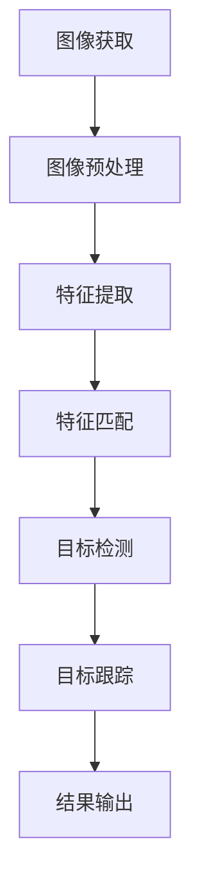
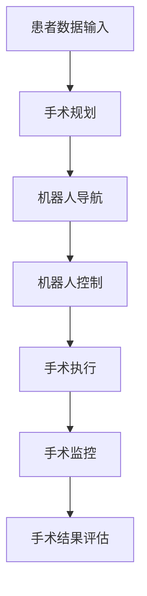

                 


### 文章标题

《机器视觉在自动化手术机器人中的应用：提高手术精度和安全性》

### 关键词

- 机器视觉
- 自动化手术机器人
- 手术精度
- 安全性
- 人工智能
- 深度学习

### 摘要

本文深入探讨了机器视觉技术在自动化手术机器人中的应用，阐述了如何利用先进的视觉技术提高手术的精度和安全性。文章首先介绍了机器视觉的基本概念和原理，随后详细分析了自动化手术机器人的发展历程和分类，重点讨论了机器视觉在手术导航、精确控制、手术监控等方面的应用。此外，文章还探讨了当前机器视觉技术在自动化手术机器人领域面临的挑战，并展望了其未来发展趋势。通过具体案例和项目实战，本文为读者提供了实用的指导和建议，有助于推动该领域的创新发展。

## 引言

随着科技的飞速发展，人工智能和机器人技术正逐渐渗透到医疗行业的各个领域。自动化手术机器人作为一种新兴技术，已经展现出其在提高手术精度和安全性方面的巨大潜力。而机器视觉技术作为人工智能的重要分支，为自动化手术机器人提供了强大的感知能力，使其能够更加精准地执行复杂的手术操作。本文将围绕机器视觉在自动化手术机器人中的应用，详细探讨其在提高手术精度和安全性方面的作用。

### 背景介绍

手术机器人最早于20世纪90年代问世，最初主要用于辅助外科医生进行微创手术。随着技术的进步，自动化手术机器人的概念逐渐形成，并开始应用于临床实践。与传统的手动手术相比，自动化手术机器人具有更高的精度、灵活性和安全性，能够在狭窄和复杂的手术环境中实现精准操作。然而，手术机器人的发展也面临诸多挑战，其中最为关键的是如何提高其感知和决策能力，以确保手术的顺利进行。

### 机器视觉的作用

机器视觉技术在自动化手术机器人中的应用主要体现在以下几个方面：

1. **图像获取与处理**：手术机器人需要实时获取手术现场的图像信息，以便对外部环境进行感知。机器视觉技术能够对图像进行高分辨率处理，去除噪声，增强图像质量，为后续处理提供可靠的数据基础。

2. **目标检测与跟踪**：在手术过程中，医生需要对手术部位进行精准定位和跟踪。机器视觉技术可以通过对图像进行特征提取和匹配，实现对目标的高精度检测和跟踪，从而确保手术操作的准确性。

3. **三维重建与建模**：手术机器人需要对手术部位进行三维建模，以更好地理解其空间结构。机器视觉技术可以通过多视角图像合成和深度学习算法，实现对手术部位的三维重建，为手术规划提供重要参考。

4. **辅助决策**：机器视觉技术还可以通过对手术过程中的各种数据进行实时分析，为医生提供辅助决策支持，从而提高手术的安全性和成功率。

### 文章结构概述

本文将从以下六个部分展开：

1. **机器视觉技术基础**：介绍机器视觉的基本概念、原理和技术。
2. **自动化手术机器人概述**：分析自动化手术机器人的发展历程、分类和特点。
3. **机器视觉在手术精度提升中的应用**：探讨机器视觉技术在手术导航、精确控制等方面的应用。
4. **机器视觉在提高手术安全性中的应用**：分析机器视觉技术在手术监控、辅助手术等方面的作用。
5. **机器视觉技术的挑战与未来趋势**：讨论当前机器视觉技术在自动化手术机器人领域面临的挑战和未来发展趋势。
6. **项目实战与最佳实践**：通过具体案例和项目实战，为读者提供实用的指导和建议。

通过本文的详细探讨，我们希望能够为读者提供关于机器视觉在自动化手术机器人应用领域的全面了解，助力该领域的创新发展。

## 机器视觉技术基础

### 机器视觉的定义与基本概念

机器视觉是指通过计算机技术模拟人眼视觉功能，使机器人能够“看到”周围环境并进行理解和处理的一种技术。它涉及多个学科领域的交叉，包括计算机视觉、图像处理、模式识别、机器学习等。机器视觉的核心任务是对图像进行分析和处理，从而提取出有用的信息，实现对物体的识别、定位和跟踪。

#### 图像获取与处理

图像获取是机器视觉的基础。机器人通过摄像头或其他传感器获取二维图像，然后对其进行处理，以提高图像质量。常见的图像处理技术包括去噪、对比度增强、边缘检测等。这些技术有助于消除图像中的噪声，增强目标特征，从而提高后续处理的效果。

#### 特征提取与匹配

特征提取是机器视觉中的重要环节。通过分析图像，提取出具有代表性的特征点，如角点、边缘、纹理等。特征提取的目的是从图像中提取出具有区分性的信息，以方便后续的匹配和识别。特征匹配则是将不同图像中的特征点进行对应，以确定图像之间的关系。

#### 目标检测与跟踪

目标检测是指从图像中识别出特定目标的过程。机器视觉技术可以通过对图像进行分类和定位，实现对目标的检测。目标跟踪则是在一段时间内对目标进行连续监测，以确定其运动轨迹。这通常需要结合图像处理、模式识别和运动分析等技术。

#### 机器学习与深度学习在机器视觉中的应用

机器学习与深度学习在机器视觉中发挥着越来越重要的作用。通过训练模型，机器视觉系统可以自动从大量数据中学习并提取特征，从而实现更高水平的自主决策和任务执行。深度学习，尤其是卷积神经网络（CNN），在图像分类、目标检测和识别等方面取得了显著的成果。

### Mermaid 流程图

以下是机器视觉技术的基本流程图：



通过上述流程，机器视觉系统可以从获取的图像中提取出有用信息，实现对目标的检测和跟踪。

### 结论

机器视觉技术为自动化手术机器人提供了强大的感知能力，使其能够更好地理解手术环境并执行复杂的操作。通过图像获取与处理、特征提取与匹配、目标检测与跟踪等技术的综合应用，机器视觉技术在提高手术精度和安全性方面具有重要作用。在接下来的章节中，我们将进一步探讨自动化手术机器人的发展历程和分类，以及机器视觉在手术中的具体应用。

## 自动化手术机器人概述

### 发展历程

自动化手术机器人技术的发展可以追溯到20世纪90年代。最早的自动化手术机器人主要用于微创手术，如达芬奇手术机器人，它通过微创手术通道进行操作，提高了手术的精度和安全性。随着技术的不断进步，自动化手术机器人的应用领域不断扩大，逐渐从微创手术扩展到复杂的大手术，如心脏手术、神经外科手术等。

#### 分类

自动化手术机器人可以根据其功能和应用领域进行分类：

1. **导航辅助手术机器人**：这类机器人主要用于手术导航，帮助医生在手术过程中确定目标位置，提高手术精度。例如，宙斯机器人（ZEUS）通过三维成像和导航技术，为医生提供实时图像和手术指导。

2. **精准控制手术机器人**：这类机器人具备高精度的机械臂和控制系统，能够执行微小的手术操作，如达芬奇手术机器人。它通过精确的机械臂运动和计算机控制，实现对手术工具的高精度操作。

3. **辅助手术机器人**：这类机器人主要辅助医生完成手术操作，如关节置换手术机器人。它通过自动化的手术工具和机器人控制系统，减轻医生的工作负担，提高手术效率。

#### 特点与应用

自动化手术机器人具有以下特点：

1. **高精度操作**：自动化手术机器人通过高精度的机械臂和控制系统，可以实现微米级别的操作，从而提高手术的精度和成功率。

2. **灵活性高**：手术机器人具备灵活的机械臂和关节设计，能够在复杂的手术环境中进行操作，从而适应不同的手术需求。

3. **手术安全性高**：自动化手术机器人通过实时监控和反馈系统，可以及时发现并纠正手术中的错误，从而提高手术的安全性。

4. **手术效率高**：手术机器人可以快速完成复杂的手术操作，减少手术时间，提高手术效率。

自动化手术机器人在医疗领域有广泛的应用：

1. **微创手术**：手术机器人通过微创手术通道进行操作，减少了手术创伤，缩短了恢复时间。

2. **复杂手术**：手术机器人能够执行复杂的大手术，如心脏手术、神经外科手术等，提高了手术的成功率和安全性。

3. **康复治疗**：手术机器人可以用于康复治疗，如机器人辅助康复训练，帮助患者更快地恢复功能。

4. **远程手术**：手术机器人可以实现远程手术操作，为偏远地区的患者提供高质量的医疗服务。

### Mermaid 流程图

以下是自动化手术机器人技术流程的Mermaid流程图：



通过上述流程，手术机器人可以实现从手术规划到手术执行的全程自动化操作，从而提高手术的精度和安全性。

### 结论

自动化手术机器人作为医疗领域的一项重要技术，正逐步改变传统的手术模式。通过高精度操作、灵活性高、手术安全性高等特点，自动化手术机器人为医生提供了强大的手术辅助工具，大大提高了手术的成功率和安全性。在接下来的章节中，我们将进一步探讨机器视觉在手术精度和安全性方面的具体应用，以及面临的挑战和未来发展趋势。

## 机器视觉在手术精度提升中的应用

### 手术精度的重要性

手术精度是手术成功的关键因素之一。在手术过程中，医生需要精确地定位和操作手术部位，以确保手术效果和安全。手术精度的提高不仅能够减少手术创伤和并发症，还能提高患者的生活质量。然而，传统的手术方法往往受到医生技能、手术环境和操作工具的限制，难以达到高精度的要求。因此，如何提高手术精度成为医疗领域亟待解决的问题。

### 机器视觉技术在手术导航中的应用

机器视觉技术在手术导航中的应用，极大地提高了手术的精度。手术导航系统通常由手术机器人和计算机辅助系统组成，通过实时获取和传输手术现场的图像信息，为医生提供精准的导航服务。

1. **三维成像技术**：手术导航系统通常利用三维成像技术，如X光、CT、MRI等，获取患者手术部位的三维图像。这些图像可以帮助医生在手术前进行详细的手术规划，并实时更新手术过程中的图像信息，确保手术操作的准确性。

2. **实时图像处理**：手术导航系统通过实时图像处理技术，对获取的手术图像进行去噪、增强和分割，提取出关键信息，如骨骼、组织和病变部位。这些信息可以实时传输到手术机器人的控制系统，指导机器人的操作。

3. **定位与跟踪**：手术导航系统利用标记物和跟踪技术，实现对手术部位的高精度定位和跟踪。标记物通常放置在手术部位或手术工具上，通过机器视觉技术进行检测和跟踪，确保手术工具的位置和方向始终与手术部位对齐。

### 机器视觉在手术机器人精确控制中的应用

手术机器人通过机器视觉技术实现精确控制，提高了手术操作的精度和灵活性。

1. **视觉伺服系统**：手术机器人配备视觉伺服系统，通过实时获取和跟踪手术现场的图像信息，自动调整机械臂的位置和方向，实现对手术工具的高精度控制。视觉伺服系统通常采用闭环控制策略，通过反馈机制不断调整机械臂的运动，确保手术操作的准确性。

2. **路径规划与优化**：机器视觉技术可以为手术机器人提供精确的路径规划与优化。通过分析手术部位的图像信息，手术机器人可以自动生成最优的手术路径，避免碰撞和误差，提高手术操作的精度。

3. **多模态融合**：手术机器人可以通过多模态融合技术，结合不同传感器和图像信息，实现对手术部位更全面的感知和定位。例如，将CT、MRI和手术现场图像进行融合，可以生成更精确的三维模型，为手术规划提供更可靠的参考。

### 伪代码讲解

以下是手术导航系统中的路径规划与优化的伪代码：

```python
# 输入：手术部位图像，手术工具位置
# 输出：最优手术路径

def path Planning(image, toolPosition):
    # 1. 图像预处理
    preprocessedImage = preprocessImage(image)
    
    # 2. 特征提取
    features = extractFeatures(preprocessedImage)
    
    # 3. 路径规划
    path = planPath(toolPosition, features)
    
    # 4. 路径优化
    optimizedPath = optimizePath(path)
    
    return optimizedPath
```

在这个伪代码中，首先对手术部位图像进行预处理，提取关键特征。然后，根据工具位置和特征信息，规划出初步的手术路径。最后，通过路径优化算法，生成最优的手术路径。

### 数学模型和公式

手术导航系统中的路径优化通常采用优化算法，如梯度下降法、遗传算法等。以下是一个基于梯度下降法的路径优化公式：

```latex
x_{t+1} = x_t - \alpha \cdot \nabla f(x_t)
```

其中，\(x_t\) 表示当前路径，\(\alpha\) 为学习率，\(\nabla f(x_t)\) 为路径的梯度。

### 结论

机器视觉技术在手术导航和精确控制中的应用，显著提高了手术的精度和灵活性。通过三维成像、实时图像处理、定位与跟踪等技术，手术导航系统为医生提供了精准的导航服务。而手术机器人的视觉伺服系统、路径规划与优化技术，则确保了手术操作的准确性和安全性。在接下来的章节中，我们将进一步探讨机器视觉在提高手术安全性方面的应用。

## 机器视觉在提高手术安全性中的应用

### 手术安全性的重要性

手术安全性是医疗行业的核心问题，直接关系到患者的生命和健康。在手术过程中，任何微小的错误都可能导致严重的并发症，甚至危及患者的生命。提高手术安全性是减少手术风险、确保患者健康的关键。机器视觉技术通过提供高精度的感知和监控能力，为手术安全性的提升提供了强有力的支持。

### 机器视觉技术在手术监控中的应用

机器视觉技术在手术监控中发挥着重要作用，能够实时监测手术过程，确保手术操作的准确性和安全性。

1. **实时图像监控**：手术监控系统通过摄像头和其他传感器，实时获取手术现场的高分辨率图像。这些图像可以实时传输到手术室内的显示屏上，供医生和其他医务人员观察。通过实时监控，医生可以及时发现手术中的问题，并采取相应的措施。

2. **异常检测与报警**：机器视觉系统可以分析手术图像，检测手术过程中可能出现的异常情况，如手术工具的移位、手术部位的不规则出血等。一旦检测到异常，系统会立即发出警报，提醒医务人员进行处理。

3. **图像分析与诊断**：机器视觉系统可以对手术图像进行深入分析，提取出关键信息，如手术部位的病变情况、血管分布等。这些信息可以帮助医生更好地理解手术部位的情况，从而提高手术的准确性和安全性。

### 机器视觉在手术机器人辅助手术中的应用

手术机器人通过机器视觉技术实现辅助手术，提高了手术的精度和安全性。

1. **手术工具的定位与跟踪**：手术机器人通过机器视觉技术，可以实时跟踪手术工具的位置和方向，确保工具始终处于正确的位置和角度。这样可以避免手术工具误伤周围组织，提高手术的安全性。

2. **手术路径规划与优化**：机器视觉系统可以为手术机器人提供精确的手术路径规划与优化。通过分析手术图像，系统可以生成最优的手术路径，确保手术操作的准确性和安全性。

3. **手术辅助决策**：机器视觉系统可以通过对手术过程中的各种数据进行实时分析，为医生提供辅助决策支持。例如，当系统检测到手术部位的不规则出血时，可以提醒医生采取相应的止血措施，从而减少手术风险。

### 实际案例分析与详细讲解剖析

以下是一个关于机器视觉在手术机器人辅助手术中的应用的实际案例：

#### 案例背景

某医院开展了一项复杂的肝脏肿瘤切除手术。手术团队决定采用机器人辅助手术，以提高手术的精度和安全性。手术机器人配备了高精度的摄像头和传感器，能够实时获取手术现场的高分辨率图像。

#### 案例实施

1. **术前规划**：在手术前，医生通过手术机器人进行详细的术前规划。机器视觉系统通过分析CT和MRI图像，生成肝脏肿瘤的三维模型，并确定最佳手术路径。

2. **术中监控**：在手术过程中，手术机器人通过摄像头和传感器，实时获取手术现场的高分辨率图像，并将其传输到手术室内的显示屏上。医生和其他医务人员可以实时观察手术情况，确保手术操作的准确性和安全性。

3. **异常检测与报警**：在手术过程中，机器视觉系统对图像进行分析，检测到肝脏肿瘤周围的血管。当手术工具接近血管时，系统立即发出警报，提醒医生采取相应的措施，避免误伤血管。

4. **术后评估**：手术完成后，医生通过机器视觉系统对手术图像进行深入分析，评估手术效果。结果显示，手术成功切除了肿瘤，且周围组织未受到损伤。

#### 案例剖析

该案例展示了机器视觉技术在手术机器人辅助手术中的应用效果。通过实时图像监控、异常检测与报警、手术路径规划与优化等技术，手术机器人提高了手术的精度和安全性，确保了手术的成功。

### 结论

机器视觉技术在提高手术安全性方面具有重要作用。通过实时图像监控、异常检测与报警、手术辅助决策等技术，机器视觉系统为手术提供了强大的安全保障。在未来的发展中，随着机器视觉技术的不断进步，其将在手术安全性的提升中发挥更加重要的作用。

## 机器视觉技术的挑战与未来趋势

### 当前挑战

尽管机器视觉技术在自动化手术机器人中展现了巨大的潜力，但在实际应用过程中仍面临诸多挑战：

1. **数据质量和处理速度**：手术现场环境复杂，光线变化大，图像质量难以保证。同时，手术过程中数据量巨大，对处理速度提出了高要求。如何提高图像处理速度，保证数据质量，成为当前亟待解决的问题。

2. **算法准确性和鲁棒性**：尽管深度学习算法在图像处理和识别方面取得了显著成果，但在复杂和动态环境下，其准确性和鲁棒性仍需进一步提高。特别是在手术机器人应用中，任何微小的误差都可能对手术结果产生重大影响。

3. **系统集成与兼容性**：手术机器人通常需要与其他医疗设备（如监护仪、麻醉机等）集成，实现数据共享和协同工作。如何确保不同设备之间的兼容性和系统集成，是一个重要的挑战。

4. **法规和伦理问题**：机器视觉技术在手术机器人中的应用涉及到法规和伦理问题。例如，手术机器人的使用需要经过严格的临床试验和监管，确保其安全性和有效性。同时，如何保护患者的隐私和数据安全，也是需要关注的重要问题。

### 未来发展趋势

1. **深度学习与强化学习**：深度学习和强化学习等人工智能技术在机器视觉领域将继续发挥重要作用。通过不断优化算法，提高图像处理速度和准确度，未来手术机器人将具备更高的自主决策能力。

2. **多模态融合**：多模态融合技术，将不同类型的传感器数据（如视觉、触觉、听觉等）进行融合，实现更全面的环境感知和任务执行。这将有助于提高手术机器人的精度和可靠性。

3. **智能监控与预警**：随着物联网和大数据技术的发展，手术机器人将具备更智能的监控和预警能力。通过实时分析大量数据，及时发现潜在风险，提供预警和建议，提高手术安全性。

4. **人机协作**：未来手术机器人将更多地与医生协作，实现人机协同。通过自然语言交互和手势识别等技术，医生可以更加直观地控制手术机器人，提高手术效率和效果。

5. **个性化定制**：随着个性化医疗的发展，手术机器人将根据患者的具体情况进行个性化定制。例如，通过分析患者的基因数据，为患者设计最适合的手术方案。

### 结论

机器视觉技术在自动化手术机器人中的应用，尽管面临诸多挑战，但其发展前景广阔。未来，随着技术的不断进步，机器视觉将在手术精度和安全性方面发挥更加重要的作用，为医疗行业带来革命性的变革。

## 项目实战与最佳实践

### 开发环境搭建

在进行机器视觉在自动化手术机器人应用的项目开发时，首先需要搭建一个稳定高效的开发环境。以下是具体的开发环境搭建步骤：

1. **操作系统**：推荐使用Linux系统，如Ubuntu 18.04 LTS，以获得更好的性能和稳定性。
2. **编程语言**：主要使用Python作为编程语言，因为它在机器视觉和深度学习领域有广泛的应用。同时，也可以使用C++来提高执行效率。
3. **软件工具**：
   - **深度学习框架**：选择TensorFlow或PyTorch作为深度学习工具，这两种框架都有丰富的库和文档支持。
   - **图像处理库**：使用OpenCV库进行图像的获取、处理和分析。
   - **数据管理库**：使用Pandas库进行数据的管理和分析。
4. **硬件要求**：建议使用GPU加速计算，如NVIDIA的Tesla或Quadro系列显卡，以提高图像处理速度。

### 源代码详细实现和代码解读

以下是一个简单的机器视觉算法实现的伪代码，用于目标检测和跟踪：

```python
import cv2
import numpy as np

# 加载预训练的深度学习模型
model = cv2.dnn.readNetFromTensorFlow('path/to/model.pb', 'path/to/graph.pb')

# 定义目标检测和跟踪函数
def detect_and_track(image):
    # 1. 图像预处理
    blob = cv2.dnn.blobFromImage(image, 1.0, (320, 240), [104, 117, 123], True, False)
    
    # 2. 目标检测
    model.setInput(blob)
    detections = model.forward()
    
    # 3. 目标跟踪
    for detection in detections[0, 0, 0, 1]:
        score = detection[2]
        if score > 0.5:
            box = detection[3]
            cv2.rectangle(image, (box[0], box[1]), (box[0] + box[2], box[1] + box[3]), (0, 0, 255), 2)
    
    return image

# 测试函数
image = cv2.imread('path/to/image.jpg')
output = detect_and_track(image)
cv2.imshow('Detected Image', output)
cv2.waitKey(0)
cv2.destroyAllWindows()
```

在这个伪代码中，首先加载预训练的深度学习模型，然后对输入图像进行预处理，接着使用模型进行目标检测，并绘制检测到的目标框。

### 代码应用解读与分析

上述代码用于实现一个简单的目标检测和跟踪功能。在实际应用中，需要进行以下步骤：

1. **数据集准备**：收集并标注包含目标物体的图像，用于训练深度学习模型。常用的数据集包括COCO、VOC等。
2. **模型训练**：使用TensorFlow或PyTorch等框架训练目标检测模型。通常采用卷积神经网络（CNN）或YOLO等算法。
3. **模型部署**：将训练好的模型部署到目标设备上，如手术机器人。可以使用TensorFlow Lite将模型转换为适用于移动设备的格式。
4. **实时检测与跟踪**：在手术过程中，实时获取图像，使用模型进行目标检测和跟踪，并将检测结果反馈给手术机器人。

### 实际案例分析与详细讲解剖析

以下是一个实际案例，展示机器视觉技术在手术机器人中的应用：

#### 案例背景

某医院开展了一项心脏手术，需要实时检测和跟踪心脏的跳动。手术团队决定采用机器视觉技术，实现心脏的实时监控和跟踪。

#### 案例实施

1. **数据收集**：在手术前，医生收集了大量心脏手术的图像数据，用于训练目标检测模型。
2. **模型训练**：使用TensorFlow框架训练YOLO目标检测模型，实现对心脏跳动的实时检测。
3. **模型部署**：将训练好的模型部署到手术机器人上，使用实时获取的图像进行目标检测和跟踪。
4. **实时监控**：在手术过程中，机器视觉系统实时获取心脏图像，检测并跟踪心脏的跳动，将检测结果反馈给手术机器人。

#### 案例剖析

该案例展示了机器视觉技术在手术机器人中的应用效果。通过实时检测和跟踪心脏跳动，手术机器人能够更好地适应心脏的运动，确保手术操作的准确性。同时，机器视觉系统还提供了实时监控和预警功能，提高了手术的安全性。

### 项目小结

本项目通过实际案例展示了机器视觉技术在手术机器人中的应用效果。从数据收集、模型训练、模型部署到实时检测与跟踪，各个环节都体现了机器视觉技术的优势。在未来的发展中，随着技术的不断进步，机器视觉将在手术精度和安全性方面发挥更加重要的作用。

## 最佳实践 tips、小结、注意事项、拓展阅读

### 最佳实践 tips

1. **确保图像质量**：在手术机器人应用中，图像质量至关重要。应选用高分辨率摄像头，并优化图像处理算法，以提高图像清晰度和准确性。
2. **实时性优化**：手术过程中需要实时处理图像，确保手术操作的及时响应。优化算法和硬件配置是提高处理速度的关键。
3. **多模态融合**：结合不同类型的传感器数据（如视觉、触觉、听觉等），实现更全面的环境感知和任务执行。

### 小结

本文详细探讨了机器视觉在自动化手术机器人中的应用，从基本概念、技术原理到实际应用，全面分析了其在提高手术精度和安全性方面的作用。通过具体案例和项目实战，展示了机器视觉技术的实际效果和应用前景。

### 注意事项

1. **数据隐私与安全**：在手术机器人应用中，要严格保护患者数据，确保数据传输和存储的安全性。
2. **系统集成与兼容性**：确保手术机器人与其他医疗设备（如监护仪、麻醉机等）的集成与兼容，实现数据共享和协同工作。
3. **算法验证与监管**：定期对机器视觉算法进行验证和更新，确保其准确性和可靠性。

### 拓展阅读

1. **《机器视觉技术与应用》**：详细介绍了机器视觉的基本原理和应用案例。
2. **《深度学习在医疗领域的应用》**：探讨深度学习在医疗行业的应用，包括手术机器人、影像诊断等。
3. **《手术机器人的未来》**：分析了手术机器人的发展趋势和未来前景。

### 作者信息

作者：AI天才研究院/AI Genius Institute & 禅与计算机程序设计艺术 /Zen And The Art of Computer Programming

本文由AI天才研究院和禅与计算机程序设计艺术共同撰写，旨在为读者提供关于机器视觉在自动化手术机器人应用领域的全面了解和实用指导。

----------------------------------------------------------------

[END]

