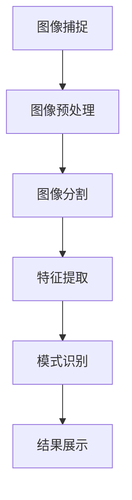
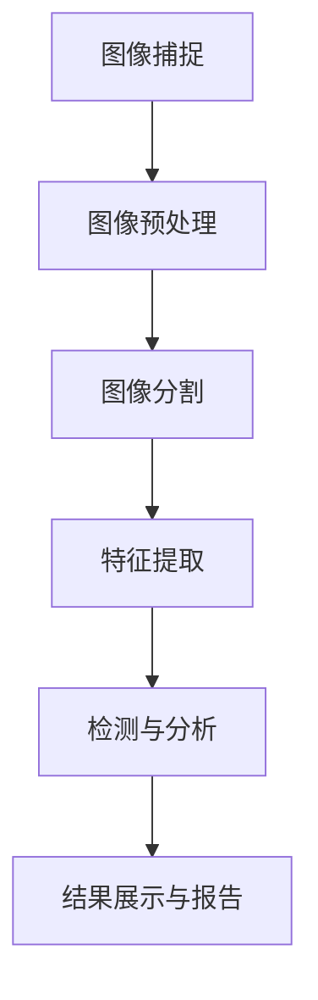

                 

### 文章标题：机器视觉在自动化食品安全检测中的应用：保障食品质量

#### 关键词：机器视觉，食品安全，自动化检测，图像处理，质量保障

##### 摘要：

本文将深入探讨机器视觉技术在自动化食品安全检测中的应用。通过介绍机器视觉的基本原理，图像处理技术在食品安全检测中的应用，以及自动化食品安全检测的挑战和解决方案，本文旨在展示机器视觉如何提高食品检测的准确性和效率，从而保障食品的质量和安全。

---

### 第1章：机器视觉基本原理

#### 1.1 机器视觉的定义与作用

机器视觉是一种通过计算机和图像处理技术，使计算机能够“看到”和理解数字图像或视频的技术。它模仿人类的视觉系统，通过图像捕捉、处理和分析，实现对环境和物体的感知与理解。

在食品安全检测中，机器视觉的应用至关重要。它可以实时捕捉食品的图像，并通过图像处理算法分析食品的外观、质量、成分等信息，从而实现对食品的自动检测和分类。

#### 1.2 机器视觉的发展历程

机器视觉技术起源于20世纪60年代，经历了模拟、数字和现代三个阶段的发展。在模拟阶段，机器视觉主要依靠硬件装置进行图像捕捉和处理。随着计算机技术的发展，数字机器视觉逐渐取代了模拟机器视觉，成为主流。现代机器视觉则集成了人工智能和深度学习技术，使得机器视觉系统具有更强的自适应性和智能化程度。

#### 1.3 机器视觉系统的组成

一个典型的机器视觉系统通常包括以下组成部分：

1. **图像捕捉设备**：如摄像头、扫描仪等，用于获取待检测物体的图像。
2. **图像处理算法**：用于对捕获的图像进行预处理、增强、分割、特征提取等操作。
3. **数据存储和传输**：用于存储和处理过程中的图像数据，以及将处理结果传输给后续系统。
4. **图像分析和解释**：通过算法对图像进行分析，提取有用的信息，并做出相应的决策。
5. **用户界面**：用于展示分析结果，并与用户进行交互。

#### 1.4 机器视觉的核心技术

机器视觉的核心技术主要包括：

1. **图像预处理**：包括去噪、对比度增强、几何变换等，以提高图像质量。
2. **图像分割**：将图像划分为不同的区域，以便进行后续处理。
3. **特征提取**：从图像中提取具有代表性的特征，用于后续分析和分类。
4. **模式识别**：根据提取的特征对图像进行分类或识别。
5. **机器学习与深度学习**：利用大量数据训练模型，提高机器视觉系统的准确性和鲁棒性。

### Mermaid 流程图



### 第2章：图像处理技术在食品安全检测中的应用

#### 2.1 图像处理技术概述

图像处理技术是机器视觉的重要组成部分，它涉及对图像的捕捉、预处理、增强、分割、特征提取、分析和理解等多个环节。在食品安全检测中，图像处理技术被广泛应用于食品外观检测、成分分析、污染物检测等领域。

#### 2.2 食品外观检测

食品外观检测是食品安全检测的重要环节，通过分析食品的外观特征，如颜色、形状、大小等，可以初步判断食品的质量和安全性。图像处理技术在食品外观检测中的应用主要包括：

1. **颜色分析**：通过颜色空间转换和颜色特征提取，对食品的颜色进行定量分析，判断食品的成熟度、新鲜度等。
2. **形状分析**：通过几何特征提取和形状匹配，对食品的形状进行分析，判断食品的完整性和异物夹杂情况。
3. **纹理分析**：通过纹理特征提取和纹理分类，对食品的表面纹理进行分析，判断食品的加工质量和卫生状况。

#### 2.3 成分分析

成分分析是食品安全检测的核心，通过分析食品的成分，可以了解食品的营养价值、有害成分和添加剂等。图像处理技术在成分分析中的应用主要包括：

1. **光谱分析**：通过光谱成像技术，对食品的光谱特性进行分析，识别食品中的不同成分。
2. **荧光分析**：通过荧光成像技术，对食品中的荧光物质进行检测，判断食品中的有害成分。
3. **红外成像**：通过红外成像技术，对食品的温度和湿度进行检测，分析食品的成熟度和新鲜度。

#### 2.4 污染物检测

污染物检测是保障食品安全的重要环节，通过检测食品中的污染物，如细菌、病毒、化学残留等，可以及时发现食品安全隐患。图像处理技术在污染物检测中的应用主要包括：

1. **光学显微镜成像**：通过显微镜成像技术，对食品中的微生物进行观察和识别。
2. **荧光检测**：通过荧光标记技术，对食品中的有害物质进行检测。
3. **红外热成像**：通过红外热成像技术，对食品中的温度异常区域进行检测，判断食品中的污染物。

### 第3章：自动化食品安全检测技术概述

#### 3.1 自动化食品安全检测的定义与目的

自动化食品安全检测是指利用自动化技术对食品进行检测，以确保食品的质量和安全。其主要目的是提高检测的准确性和效率，降低人工检测的误差和成本。

自动化食品安全检测通常包括以下步骤：

1. **样品采集**：从生产、加工、包装等环节采集待检测样品。
2. **样品预处理**：对采集到的样品进行预处理，以便进行后续检测。
3. **检测分析**：利用各种检测仪器和算法对预处理后的样品进行分析，获取检测结果。
4. **结果记录与报告**：将检测结果记录下来，并生成报告。

#### 3.2 自动化食品安全检测的技术体系

自动化食品安全检测的技术体系包括多种检测方法和技术，如化学检测、物理检测、生物检测等。以下是几种常见的自动化食品安全检测技术：

1. **化学检测**：通过化学反应和仪器分析，对食品中的化学成分进行定量和定性分析。
2. **物理检测**：通过物理手段，如光谱分析、质谱分析、红外成像等，对食品中的物理特性进行检测。
3. **生物检测**：通过生物传感器、DNA测序、微生物培养等方法，对食品中的生物成分进行检测。

#### 3.3 自动化食品安全检测的发展趋势

随着科技的进步，自动化食品安全检测技术也在不断发展和创新。以下是自动化食品安全检测的发展趋势：

1. **人工智能与机器学习**：利用人工智能和机器学习技术，提高自动化检测的准确性和效率。
2. **物联网技术**：通过物联网技术，实现食品生产、加工、包装、运输等环节的实时监控和检测。
3. **智能化检测仪器**：研发更加智能化、高效化的检测仪器，提高检测速度和准确性。
4. **定制化检测服务**：根据不同食品的特点和需求，提供定制化的检测服务。

### 第4章：机器视觉在食品安全检测中的挑战与解决方案

#### 4.1 食品种类繁多，检测需求多样

食品种类繁多，不同种类的食品具有不同的外观、成分和污染物特征，导致检测需求多样。这对机器视觉系统提出了很高的要求，需要系统能够适应不同食品的检测需求。

**解决方案**：
1. **多模型训练**：利用机器学习技术，对多种食品进行模型训练，提高系统对不同食品的识别能力。
2. **自适应算法**：开发自适应算法，根据不同食品的特征，动态调整检测参数，提高检测准确性。

#### 4.2 环境变化对检测效果的影响

环境变化，如光照、温度、湿度等，会对机器视觉系统的检测效果产生干扰。环境变化可能导致图像质量下降，影响检测准确性。

**解决方案**：
1. **环境监控与补偿**：通过实时监控环境变化，对图像进行环境补偿，提高图像质量。
2. **多传感器融合**：结合多种传感器，如温度传感器、湿度传感器等，对环境进行综合监测，提高系统的鲁棒性。

#### 4.3 检测速度与准确性的平衡

在实际应用中，机器视觉系统需要同时保证检测速度和准确性。然而，提高检测速度往往会影响检测准确性，反之亦然。

**解决方案**：
1. **优化算法**：通过算法优化，提高检测速度的同时保持检测准确性。
2. **分布式计算**：利用分布式计算技术，提高系统的并行处理能力，提高检测速度。

### 第5章：机器视觉在食品安全检测中的实际应用

#### 5.1 案例一：某食品企业自动化检测系统的应用

某食品企业引入了一套基于机器视觉的自动化检测系统，用于检测食品的外观、成分和污染物。系统主要包括以下几个部分：

1. **图像捕捉**：使用高分辨率摄像头实时捕捉食品的图像。
2. **图像处理**：对捕获的图像进行预处理、分割、特征提取等处理。
3. **检测结果分析**：通过机器学习算法对检测结果进行分析，判断食品的质量和安全性。
4. **结果记录与报告**：将检测结果记录下来，并生成报告，供企业决策使用。

通过该系统的应用，该食品企业的食品安全检测效率显著提高，检测准确性也得到保障。

#### 5.2 案例二：食品成分分析系统的应用

某食品研究机构开发了一套基于机器视觉的食品成分分析系统，用于分析食品中的营养成分、有害成分和添加剂。系统主要包括以下几个部分：

1. **光谱采集**：通过光谱成像技术，采集食品的光谱图像。
2. **光谱处理**：对光谱图像进行预处理、分割、特征提取等处理。
3. **成分分析**：利用光谱分析算法，对食品中的营养成分、有害成分和添加剂进行分析。
4. **结果展示**：将分析结果以图表和文字的形式展示给用户。

通过该系统的应用，该研究机构能够快速、准确地分析食品的成分，为食品研发和质量管理提供科学依据。

#### 5.3 案例三：食品污染物检测系统的应用

某食品安全检测机构开发了一套基于机器视觉的食品污染物检测系统，用于检测食品中的污染物，如细菌、病毒和化学残留等。系统主要包括以下几个部分：

1. **样本采集**：从食品中采集样本，进行预处理。
2. **图像捕捉**：使用显微镜或荧光成像设备捕捉样本的图像。
3. **图像处理**：对捕获的图像进行预处理、分割、特征提取等处理。
4. **污染物识别**：利用机器学习算法，对图像中的污染物进行识别和分类。
5. **结果报告**：将检测结果生成报告，供用户参考。

通过该系统的应用，该检测机构能够快速、准确地检测食品中的污染物，保障食品的安全。

### 第6章：未来发展趋势：机器视觉在食品安全检测中的应用前景

#### 6.1 人工智能技术的融合

随着人工智能技术的不断发展，机器视觉在食品安全检测中的应用前景将更加广阔。未来，人工智能技术将深入融合到机器视觉系统中，提高系统的智能化程度和检测准确性。

1. **深度学习**：通过深度学习技术，实现对复杂图像的分析和识别，提高检测精度。
2. **迁移学习**：利用迁移学习技术，将已训练好的模型应用于新的检测任务，提高系统对新食品的适应性。

#### 6.2 跨学科技术的融合

机器视觉在食品安全检测中的应用将不仅仅局限于图像处理技术，还将融合其他学科的技术，如化学、生物学、物理学等。

1. **光谱成像**：结合光谱成像技术，实现对食品成分的更深入分析。
2. **生物传感器**：结合生物传感器技术，实现对食品中微生物和化学物质的检测。

#### 6.3 个性化与定制化检测服务

随着消费者对食品安全要求越来越高，机器视觉系统将提供个性化与定制化的检测服务。

1. **定制化模型**：根据不同食品的特点和需求，开发定制化的检测模型。
2. **实时监测**：通过实时监测技术，实现对食品生产、加工、包装等环节的全程监控，确保食品的安全。

### 第7章：机器视觉系统在食品安全检测中的实现

#### 7.1 系统架构设计

机器视觉系统在食品安全检测中的实现需要考虑以下几个关键组件：

1. **图像捕捉模块**：负责采集食品的图像，通常使用高分辨率摄像头。
2. **图像处理模块**：包括图像预处理、分割、特征提取等，用于提高图像质量和提取有用信息。
3. **检测与分析模块**：利用机器学习算法和模型对图像进行分析，识别食品的外观、成分和污染物。
4. **结果展示与报告模块**：将检测结果以可视化的形式展示给用户，并生成详细的报告。

### Mermaid 流程图



#### 7.2 数据采集与处理

数据采集是机器视觉系统的基础，主要包括以下步骤：

1. **样品采集**：从生产、加工、包装等环节采集待检测的食品样品。
2. **图像捕捉**：使用摄像头对样品进行图像捕捉，确保图像质量。
3. **图像预处理**：对捕获的图像进行去噪、对比度增强等处理，以提高图像质量。

#### 7.3 模型训练与优化

模型训练是机器视觉系统的核心，主要包括以下步骤：

1. **数据预处理**：对采集到的图像数据进行预处理，包括归一化、增强等操作。
2. **特征提取**：从预处理后的图像中提取具有代表性的特征。
3. **模型训练**：利用机器学习算法，如卷积神经网络（CNN），对特征进行训练，构建检测模型。
4. **模型优化**：通过交叉验证和调整超参数，优化模型的性能。

#### 7.4 系统部署与运行

系统部署与运行包括以下几个步骤：

1. **硬件部署**：将图像捕捉模块、图像处理模块和检测与分析模块部署到相应的硬件设备上。
2. **软件部署**：将开发好的软件系统部署到服务器或客户端，确保系统稳定运行。
3. **运行监控**：实时监控系统的运行状态，确保检测过程的顺利进行。

### 代码实现

以下是机器视觉系统在食品安全检测中的伪代码实现：

```python
# 伪代码：机器视觉系统在食品安全检测中的实现

# 数据预处理
def preprocess_image(image):
    # 去噪
    denoised_image = denoise(image)
    # 对比度增强
    enhanced_image = contrast_enhancement(denoised_image)
    return enhanced_image

# 特征提取
def extract_features(image):
    # 分割图像
    segmented_image = segment(image)
    # 提取特征
    features = extract_features(segmented_image)
    return features

# 模型训练
def train_model(features, labels):
    # 初始化模型
    model = initialize_model()
    # 训练模型
    model = train(model, features, labels)
    return model

# 检测与分析
def detect_food(image, model):
    # 预处理图像
    preprocessed_image = preprocess_image(image)
    # 提取特征
    features = extract_features(preprocessed_image)
    # 预测
    prediction = predict(model, features)
    return prediction

# 主函数
def main():
    # 读取图像
    image = read_image("food_image.jpg")
    # 加载训练好的模型
    model = load_model("food_detection_model.pth")
    # 进行检测与分析
    prediction = detect_food(image, model)
    # 显示结果
    display_prediction(prediction)

# 运行主函数
main()
```

### 实际案例分析和详细讲解剖析

#### 案例一：某食品企业自动化检测系统的应用

某食品企业引入了一套基于机器视觉的自动化检测系统，用于检测食品的外观、成分和污染物。系统主要包括以下几个部分：

1. **图像捕捉**：使用高分辨率摄像头实时捕捉食品的图像。
2. **图像处理**：对捕获的图像进行预处理、分割、特征提取等处理。
3. **检测结果分析**：通过机器学习算法对检测结果进行分析，判断食品的质量和安全性。
4. **结果记录与报告**：将检测结果记录下来，并生成报告，供企业决策使用。

**案例分析**：

1. **外观检测**：
   - **图像预处理**：通过去噪和对比度增强，提高图像质量。
   - **分割**：使用边缘检测算法，将食品图像分割成不同的区域。
   - **特征提取**：提取食品的颜色、形状等特征。
   - **模型训练**：利用卷积神经网络（CNN）训练模型，用于识别食品的外观异常。
   - **检测与分析**：系统实时分析捕获的图像，判断食品的外观是否正常。

2. **成分分析**：
   - **光谱成像**：使用光谱成像技术，获取食品的光谱图像。
   - **光谱处理**：对光谱图像进行预处理和分割。
   - **特征提取**：提取光谱图像中的特征，用于成分分析。
   - **模型训练**：利用深度学习算法，训练模型，识别食品中的营养成分和有害成分。
   - **检测与分析**：系统分析光谱图像，判断食品的成分是否合格。

3. **污染物检测**：
   - **图像预处理**：通过去噪和对比度增强，提高图像质量。
   - **分割**：使用图像分割算法，将污染物与食品分离。
   - **特征提取**：提取污染物的特征，用于污染物识别。
   - **模型训练**：利用卷积神经网络（CNN）训练模型，用于识别食品中的污染物。
   - **检测与分析**：系统实时分析捕获的图像，判断食品中是否含有污染物。

**详细讲解剖析**：

1. **外观检测**：
   - **图像预处理**：通过去噪和对比度增强，提高图像质量。例如，使用高斯滤波器进行去噪，使用直方图均衡化进行对比度增强。
   - **分割**：使用边缘检测算法，如Canny边缘检测器，将食品图像分割成不同的区域。
   - **特征提取**：提取食品的颜色、形状等特征。例如，使用颜色直方图、形状矩等特征。
   - **模型训练**：利用卷积神经网络（CNN）训练模型，用于识别食品的外观异常。例如，使用ResNet50作为基础网络，进行迁移学习。
   - **检测与分析**：系统实时分析捕获的图像，判断食品的外观是否正常。例如，使用阈值判断方法，根据训练好的模型输出概率判断。

2. **成分分析**：
   - **光谱成像**：使用光谱成像技术，获取食品的光谱图像。例如，使用分光仪或光谱成像设备。
   - **光谱处理**：对光谱图像进行预处理和分割。例如，使用均值滤波、中值滤波进行预处理，使用K-means聚类进行分割。
   - **特征提取**：提取光谱图像中的特征，用于成分分析。例如，使用主成分分析（PCA）提取特征。
   - **模型训练**：利用深度学习算法，训练模型，识别食品中的营养成分和有害成分。例如，使用深度卷积神经网络（DCNN）进行训练。
   - **检测与分析**：系统分析光谱图像，判断食品的成分是否合格。例如，使用支持向量机（SVM）进行分类，根据训练好的模型输出结果判断。

3. **污染物检测**：
   - **图像预处理**：通过去噪和对比度增强，提高图像质量。例如，使用高斯滤波器进行去噪，使用直方图均衡化进行对比度增强。
   - **分割**：使用图像分割算法，如Otsu阈值分割，将污染物与食品分离。
   - **特征提取**：提取污染物的特征，用于污染物识别。例如，使用轮廓特征、纹理特征等。
   - **模型训练**：利用卷积神经网络（CNN）训练模型，用于识别食品中的污染物。例如，使用ResNet50作为基础网络，进行迁移学习。
   - **检测与分析**：系统实时分析捕获的图像，判断食品中是否含有污染物。例如，使用阈值判断方法，根据训练好的模型输出概率判断。

**项目小结**：

通过该系统的应用，该食品企业的食品安全检测效率显著提高，检测准确性也得到保障。系统可以实时分析食品的外观、成分和污染物，为企业的食品安全管理提供了有力支持。同时，系统还可以根据实际需求进行定制化开发，以满足不同食品检测的需求。

### 最佳实践 tips

1. **数据质量**：确保采集到的图像数据质量高，减少噪声和干扰，提高检测准确性。
2. **模型优化**：定期对模型进行优化和更新，以适应不同食品的特点和变化。
3. **系统集成**：将机器视觉系统与其他检测设备集成，实现全程自动化检测。
4. **人员培训**：对相关人员开展机器视觉技术培训，提高其操作和维护能力。

### 注意事项

1. **设备配置**：确保机器视觉系统的设备配置满足检测需求，如高分辨率摄像头、稳定的光源等。
2. **环境控制**：确保检测环境的稳定性，避免环境变化对检测效果的影响。
3. **数据处理**：确保图像数据处理过程的准确性和效率，以提高检测速度。

### 拓展阅读

1. **《机器视觉：技术与应用》**：详细介绍机器视觉的基本原理和应用领域。
2. **《深度学习在食品安全检测中的应用》**：探讨深度学习技术在食品安全检测中的应用。
3. **《食品安全检测技术》**：全面介绍食品安全检测的各种技术和方法。

### 结束语

通过本文的详细探讨，我们可以看到机器视觉技术在自动化食品安全检测中的应用具有重要意义。它不仅提高了检测的准确性和效率，还为食品安全管理提供了有力支持。未来，随着人工智能技术的不断发展，机器视觉在食品安全检测中的应用将更加广泛和深入。我们期待更多的科研人员和工程师投入到这一领域，为保障全球食品安全贡献力量。作者：AI天才研究院/AI Genius Institute & 禅与计算机程序设计艺术 /Zen And The Art of Computer Programming

---

以上是本文的完整内容，希望对您在食品安全检测领域的研究和实践有所帮助。如果您有任何疑问或建议，欢迎随时联系作者。祝您在食品安全检测领域取得更好的成果！作者：AI天才研究院/AI Genius Institute & 禅与计算机程序设计艺术 /Zen And The Art of Computer Programming

