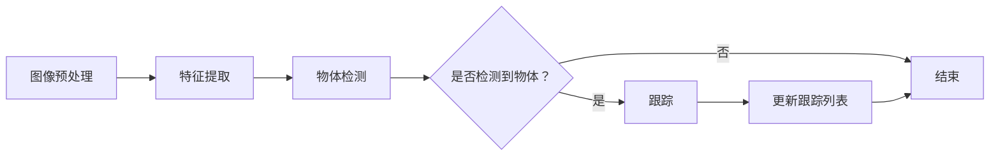
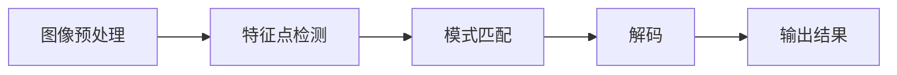
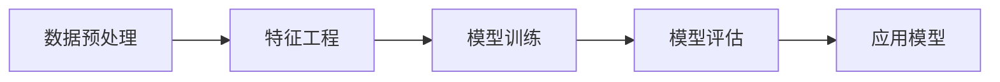
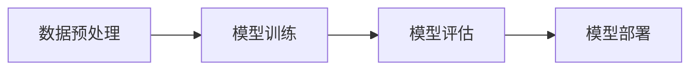
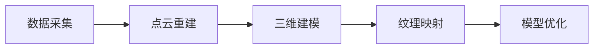
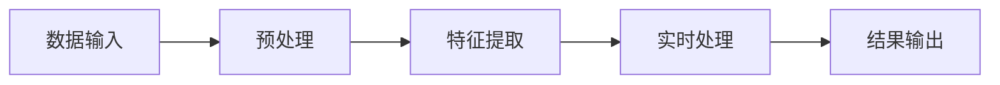

                 

## 文章标题

### 机器视觉在零售业中的应用：无人商店与库存管理

关键词：机器视觉、零售业、无人商店、库存管理、技术应用

摘要：随着技术的不断进步，机器视觉在零售业中的应用越来越广泛，无人商店和智能库存管理成为零售业发展的新方向。本文将详细探讨机器视觉技术在无人商店和库存管理中的具体应用，分析其技术原理、实现方法以及实际案例，帮助读者深入了解这一前沿领域。

## 目录

### 前言

随着零售业的快速发展和市场竞争的加剧，提升效率、降低成本、优化用户体验成为零售企业亟待解决的问题。机器视觉技术作为一种高效、智能的图像处理技术，正在逐步改变零售业的运作模式。本文旨在系统地介绍机器视觉在零售业中的应用，重点关注无人商店与库存管理两大领域，探讨其在提升零售效率、降低运营成本和改善用户体验方面的潜力。

### 第1章 机器视觉技术概述

#### 1.1 基本概念

#### 1.2 机器视觉系统架构

#### 1.3 机器视觉在零售业的发展历程

### 第2章 机器视觉在无人商店中的应用

#### 2.1 客户行为监测

#### 2.2 安全监控

#### 2.3 结账自动化

### 第3章 机器视觉在库存管理中的应用

#### 3.1 库存管理的挑战

#### 3.2 机器视觉在库存管理中的作用

#### 3.3 评估库存管理性能的关键指标

### 第4章 机器视觉技术详解

#### 4.1 物体检测与跟踪

#### 4.2 条码与二维码识别

#### 4.3 机器学习算法在库存分析中的应用

### 第5章 高级机器视觉技术

#### 5.1 深度学习在图像识别中的应用

#### 5.2 三维重建与建模

#### 5.3 实时处理与优化

### 第6章 实际应用案例分析

#### 6.1 自动化商店案例

#### 6.2 链锁商店库存管理案例

#### 6.3 小型商家机器视觉应用案例

### 第7章 未来趋势与挑战

#### 7.1 机器视觉技术的发展趋势

#### 7.2 伦理考虑与法规

#### 7.3 零售业的挑战与机遇

### 参考文献

### 附录

#### A.1 机器视觉相关数据集

## 前言

### 零售业的变革与创新

在过去的几十年中，零售业经历了前所未有的变革。随着消费者需求的多样化、购物习惯的改变以及互联网技术的飞速发展，传统零售模式面临着巨大的挑战。为了应对这些挑战，零售企业不断探索创新的方法，提升效率、降低成本、优化用户体验成为其主要目标。在这个过程中，机器视觉技术作为一种高效、智能的图像处理技术，逐渐成为零售业变革的重要推动力。

### 机器视觉技术的兴起

机器视觉技术，是指通过计算机对图像进行处理、分析和理解，以实现对目标对象的识别、跟踪和测量。它起源于20世纪60年代，随着计算机性能的提升、图像处理算法的进步以及传感器技术的革新，机器视觉技术在多个领域得到了广泛应用。在零售业中，机器视觉技术通过捕捉和处理图像信息，为无人商店和智能库存管理提供了强有力的技术支撑。

### 无人商店与库存管理的变革

无人商店和智能库存管理是机器视觉技术在零售业中的两个重要应用领域。无人商店通过自动化的结账、安防和客户行为监测，实现了无人工干预的购物体验。智能库存管理则通过精确的库存监控、实时数据分析和预测，提高了库存管理的效率和准确性。这些技术的应用不仅提升了零售企业的运营效率，还降低了运营成本，为零售业的可持续发展提供了新的机遇。

### 文章目的与结构

本文旨在系统地介绍机器视觉技术在零售业中的应用，重点关注无人商店和智能库存管理两个领域。文章将首先介绍机器视觉技术的基本概念和系统架构，然后深入探讨机器视觉在无人商店和库存管理中的具体应用。接着，我们将详细讲解机器视觉技术的核心算法和实现方法，并通过实际案例进行分析和讲解。最后，文章将探讨机器视觉技术的发展趋势、伦理考虑和未来挑战，为零售企业提供参考和启示。

### 文章结构

本文分为七个主要章节：

1. **第1章 机器视觉技术概述**：介绍机器视觉的基本概念、系统架构及其在零售业的发展历程。
2. **第2章 机器视觉在无人商店中的应用**：探讨机器视觉在无人商店中用于客户行为监测、安全监控和结账自动化等方面的应用。
3. **第3章 机器视觉在库存管理中的应用**：分析机器视觉技术在库存管理中的挑战、作用和关键指标。
4. **第4章 机器视觉技术详解**：详细讲解机器视觉技术的核心算法，包括物体检测与跟踪、条码与二维码识别以及机器学习算法在库存分析中的应用。
5. **第5章 高级机器视觉技术**：介绍深度学习、三维重建与建模等高级机器视觉技术及其在零售业中的应用。
6. **第6章 实际应用案例分析**：通过具体案例展示机器视觉技术在无人商店和库存管理中的实际应用效果。
7. **第7章 未来趋势与挑战**：探讨机器视觉技术的发展趋势、伦理考虑和未来挑战，为零售业提供参考。

通过这篇文章，我们希望读者能够全面了解机器视觉技术在零售业中的应用，认识到其在提升零售效率、降低运营成本和改善用户体验方面的巨大潜力。同时，我们也希望通过案例分析和未来趋势的探讨，为零售企业提供实际操作和战略规划上的启示。

### 第1章 机器视觉技术概述

#### 1.1 基本概念

机器视觉，是指通过计算机对图像或视频信号进行采集、处理、分析和理解，以实现特定任务的技术。它起源于20世纪60年代，随着计算机技术的迅速发展和图像处理算法的进步，逐渐成为人工智能领域的一个重要分支。机器视觉系统通常由以下几个关键部分组成：

1. **图像采集设备**：包括摄像头、扫描仪等，用于捕捉待处理的对象图像。
2. **图像处理单元**：通过计算机对图像进行预处理，如降噪、增强、分割等，以提高图像质量。
3. **特征提取与匹配**：从图像中提取关键特征，如边缘、角点、纹理等，并将其与预设模板进行匹配，以识别和定位目标对象。
4. **理解与决策**：利用图像处理和机器学习算法，对提取的特征进行分析和理解，以实现特定的任务，如物体识别、跟踪、分类等。

#### 1.2 机器视觉系统架构

一个典型的机器视觉系统可以分为以下几个层次：

1. **感知层**：包括图像采集设备，用于获取待处理对象的图像信息。
2. **数据处理层**：对采集到的图像进行预处理，如滤波、分割、边缘检测等，以提高图像的质量和清晰度。
3. **特征提取层**：从预处理后的图像中提取关键特征，如颜色、纹理、形状等，为后续分析提供基础。
4. **理解与决策层**：利用机器学习算法对提取的特征进行分析和理解，实现目标识别、跟踪、分类等任务。
5. **输出层**：将处理结果输出，如警报、分类结果、定位信息等。

#### 1.3 机器视觉在零售业的发展历程

机器视觉技术在零售业中的应用可以追溯到20世纪80年代，当时主要用于商品分类和识别。随着计算机性能的提升和图像处理算法的进步，机器视觉技术在零售业中的应用越来越广泛。以下是机器视觉在零售业中的几个重要发展阶段：

1. **早期应用**（20世纪80年代至90年代）：主要应用于超市和百货商店的自动结账系统，通过扫描条码和二维码实现快速、准确的商品识别。
2. **多样化应用**（21世纪初）：随着技术的进一步发展，机器视觉开始应用于无人商店、智能货架和库存管理等领域。例如，Amazon Go无人商店通过计算机视觉和传感器技术实现无人结账。
3. **智能化发展**（近年来）：深度学习算法的引入使得机器视觉技术更加智能化，能够更好地处理复杂场景下的图像信息，如实时监控客户行为、精确跟踪商品位置等。

### 小结

机器视觉技术通过图像采集、处理、分析和理解，实现了对目标对象的精准识别和定位，在零售业中发挥了重要作用。从早期的商品识别到无人商店和智能库存管理，机器视觉技术在零售业中的应用越来越广泛，为零售企业提供了提升效率、降低成本、改善用户体验的强大工具。

## 第2章 机器视觉在无人商店中的应用

#### 2.1 客户行为监测

无人商店的核心之一是能够自动捕捉和解析客户的行为，从而优化购物体验和商店运营。机器视觉技术在客户行为监测中发挥了关键作用。通过安装在商店内的摄像头，机器视觉系统能够实时捕捉客户的运动轨迹、停留时间、浏览商品种类等行为信息。这些信息有助于商店管理者了解客户需求，优化商品摆放策略，提高客户满意度和购买转化率。

**技术原理：**
- **图像识别**：利用深度学习算法，从摄像头获取的图像中识别出客户的位置和动作。
- **行为分析**：通过对客户行为的长时间监控和数据分析，建立客户行为模型，预测客户的行为倾向。

**实现方法：**
1. 安装高分辨率摄像头，确保捕获的图像质量。
2. 使用深度学习模型进行图像识别，提取客户的关键特征。
3. 针对不同场景，定制化行为分析算法，如人流密度分析、客户偏好分析等。

**案例分析：** Amazon Go商店通过计算机视觉技术，实现了对客户购物行为的实时监测和自动化结算。顾客进入商店后，系统会自动识别其身份，并在顾客选择商品后自动完成结算，整个过程无需人工干预。

#### 2.2 安全监控

无人商店的安全监控是保障商店运营和客户安全的重要环节。机器视觉技术通过监控摄像头和智能分析算法，可以实时监控商店内部的情况，识别异常行为，如盗窃、斗殴等，从而及时采取措施。

**技术原理：**
- **图像识别与跟踪**：通过摄像头捕捉图像，利用目标检测算法识别出监控场景中的目标对象，如顾客、商品等。
- **异常行为检测**：利用行为分析算法，对监控场景中的行为进行实时分析，识别异常行为。

**实现方法：**
1. 部署高清晰度监控摄像头，确保监控范围的覆盖。
2. 使用目标检测算法（如YOLO、SSD等）识别监控场景中的目标。
3. 开发异常行为检测算法，如行为分类、轨迹分析等，实现实时监控和预警。

**案例分析：** 日本的7-11无人便利店通过机器视觉技术实现了24小时监控。摄像头捕捉到顾客的行为，并通过智能算法分析判断是否出现盗窃等异常行为，一旦检测到异常，系统会自动报警并通知安保人员处理。

#### 2.3 结账自动化

结账自动化是无人商店区别于传统商店的显著特点。通过机器视觉技术，无人商店能够实现自动识别商品、自动扣款和自动结算，大大简化了购物流程，提升了购物体验。

**技术原理：**
- **商品识别**：利用图像处理算法和深度学习模型，从摄像头获取的图像中自动识别出商品。
- **实时支付**：通过与支付系统的集成，实现实时扣款和结算。

**实现方法：**
1. 使用图像识别算法（如SSD、Faster R-CNN等）识别商品。
2. 与支付系统对接，实现自动扣款和结算。
3. 针对不同商品类型，开发相应的识别算法和支付逻辑。

**案例分析：** Amazon Go商店通过计算机视觉技术实现了全自动结账。顾客在进入商店后，只需将商品放入购物篮，离开商店时，系统会自动识别购物篮中的商品并完成扣款。整个过程无需人工干预，极大提升了购物体验。

#### 总结

机器视觉技术在无人商店中的应用，涵盖了客户行为监测、安全监控和结账自动化等多个方面。通过先进的图像识别、行为分析和支付技术，无人商店不仅实现了无人工干预的购物体验，还提升了商店的运营效率和安全水平。未来，随着机器视觉技术的不断进步，无人商店将更加智能化，为消费者提供更加便捷、高效的购物体验。

### 第3章 机器视觉在库存管理中的应用

#### 3.1 库存管理的挑战

在传统零售业中，库存管理是一项复杂且耗时的工作。库存管理的挑战主要体现在以下几个方面：

1. **数据准确性问题**：手工记录和纸质记录容易出错，导致库存数据不准确。
2. **库存监控困难**：库存量大、种类繁多，手工监控难以实时掌握库存动态。
3. **库存优化困难**：缺乏实时数据支持，难以进行库存优化和预测。
4. **库存损耗大**：由于监控不力，容易出现库存损耗和过期现象。

#### 3.2 机器视觉在库存管理中的作用

机器视觉技术在库存管理中发挥着重要作用，可以解决传统库存管理面临的各种挑战。以下是机器视觉在库存管理中的几个关键作用：

1. **提高数据准确性**：通过图像识别和自动化技术，实现对商品的精准识别和记录，提高数据准确性。
2. **实时库存监控**：利用摄像头和传感器，实现对仓库和货架的实时监控，动态更新库存数据。
3. **库存优化**：通过大数据分析和机器学习算法，对库存数据进行深入分析，优化库存水平和订单管理。
4. **降低库存损耗**：通过实时监控和预警系统，减少库存损耗和过期现象。

#### 3.3 评估库存管理性能的关键指标

为了评估库存管理的性能，需要引入一系列关键指标，这些指标可以帮助企业了解库存管理的有效性，从而进行优化和改进。以下是几个重要的评估指标：

1. **库存周转率（Inventory Turnover）**：表示一定时间内库存商品的销售次数，是衡量库存周转速度的重要指标。
   $$ \text{库存周转率} = \frac{\text{销售额}}{\text{平均库存成本}} $$
2. **库存准确性（Inventory Accuracy）**：表示库存记录与实际库存的匹配程度，是评估库存数据准确性的关键指标。
   $$ \text{库存准确性} = \frac{\text{实际库存}}{\text{记录库存}} \times 100\% $$
3. **库存短缺率（Stockout Rate）**：表示一定时间内因库存不足导致缺货的次数，是衡量库存充足率的重要指标。
   $$ \text{库存短缺率} = \frac{\text{缺货次数}}{\text{总销售次数}} \times 100\% $$
4. **库存持有成本（Inventory Holding Cost）**：表示库存商品在储存过程中产生的成本，包括仓储费用、保险费用、损耗费用等。

#### 小结

机器视觉技术在库存管理中的应用，为解决传统库存管理的挑战提供了有效的解决方案。通过提高数据准确性、实时库存监控、库存优化和降低库存损耗，机器视觉技术显著提升了库存管理的效率和质量。同时，通过引入关键指标，企业可以更科学地评估库存管理的性能，从而实现库存管理的持续优化。

### 第4章 机器视觉技术详解

#### 4.1 物体检测与跟踪

物体检测是机器视觉中的核心任务之一，它旨在从图像或视频中识别出特定的物体，并定位其在图像中的位置。物体检测技术广泛应用于无人商店、自动驾驶、安防监控等多个领域。

**核心算法原理：**

物体检测算法通常分为两大类：基于传统算法的方法和基于深度学习的方法。

1. **传统算法**：如HOG（Histogram of Oriented Gradients）和SIFT（Scale-Invariant Feature Transform），通过手工设计特征来检测物体。
   ```python
   def detect_objects(image, features):
       for feature in features:
           if feature_matches(image, feature):
               draw_rectangle(image, feature)
               return image
       return None
   ```
2. **深度学习算法**：如YOLO（You Only Look Once）和SSD（Single Shot MultiBox Detector），通过神经网络直接输出物体的位置和类别。
   ```python
   def detect_objects(image, model):
       predictions = model.predict(image)
       for prediction in predictions:
           if prediction['confidence'] > 0.5:
               draw_rectangle(image, prediction['box'])
               label = prediction['label']
               text = f"{label}: {prediction['confidence']:.2f}"
               draw_text(image, text, prediction['box'])
       return image
   ```

**联系与架构：**

物体检测与跟踪通常涉及多个步骤，包括图像预处理、特征提取、检测和跟踪。以下是一个简单的Mermaid流程图，展示物体检测与跟踪的基本架构：



**物体检测与跟踪的应用：** 在无人商店中，物体检测与跟踪技术可以用于实时监控商品库存、客户行为以及防止盗窃等。

#### 4.2 条码与二维码识别

条码与二维码识别是机器视觉在零售业中的重要应用，用于自动化识别商品信息，提高结账效率和库存管理精度。

**核心算法原理：**

1. **条码识别**：通常使用OCR（Optical Character Recognition）技术，通过图像预处理、特征提取和模式匹配等方法实现。
   ```python
   def decode_barcode(image, barcode_type):
       processed_image = preprocess_image(image)
       characters = extract_characters(processed_image, barcode_type)
       decoded_text = decode_characters(characters)
       return decoded_text
   ```

2. **二维码识别**：使用二维码解码算法，如QR码解码算法，通过图像预处理、特征点检测、路径重建和解码等步骤实现。
   ```python
   def decode_qrcode(image):
       processed_image = preprocess_image(image)
       points = detect_points(processed_image)
       path = reconstruct_path(points)
       decoded_data = decode_path(path)
       return decoded_data
   ```

**联系与架构：**

条码与二维码识别通常包括以下步骤：

1. **图像预处理**：对图像进行去噪、增强等处理，提高识别精度。
2. **特征点检测**：检测条码或二维码的关键特征点，如边缘、角点等。
3. **模式匹配**：使用预设的模板与检测到的特征进行匹配，确定条码或二维码的位置和内容。
4. **解码**：根据匹配结果解码条码或二维码中的信息。

以下是一个简单的Mermaid流程图，展示条码与二维码识别的基本架构：



**条码与二维码识别的应用：** 在无人商店中，条码与二维码识别技术主要用于商品扫描、结账自动化和库存管理。

#### 4.3 机器学习算法在库存分析中的应用

机器学习算法在库存分析中具有重要的应用，可以帮助零售企业优化库存管理、预测需求变化，从而提高运营效率。

**核心算法原理：**

1. **回归分析**：通过建立回归模型，预测库存水平与销售量之间的关系，优化库存水平。
   ```python
   def predict_inventory(sales_data, inventory_data):
       model = linear_regression(sales_data, inventory_data)
       predicted_inventory = model.predict(new_sales_data)
       return predicted_inventory
   ```

2. **分类分析**：通过对库存数据进行分类，识别高价值商品和潜在畅销商品，优化库存配置。
   ```python
   def classify_items(inventory_data, target_variable):
       model = logistic_regression(inventory_data, target_variable)
       predictions = model.predict(inventory_data)
       classified_items = label_items(predictions)
       return classified_items
   ```

3. **聚类分析**：通过聚类算法，将库存商品分为不同的类别，优化库存策略。
   ```python
   def cluster_items(inventory_data):
       model = k_means(inventory_data, num_clusters)
       clusters = model.predict(inventory_data)
       return clusters
   ```

**联系与架构：**

机器学习算法在库存分析中的应用通常包括以下步骤：

1. **数据预处理**：对库存数据、销售数据进行清洗、归一化等处理，提高模型的训练效果。
2. **特征工程**：提取关键特征，如商品销量、库存周转率等，用于训练模型。
3. **模型训练**：使用训练数据训练回归、分类或聚类模型。
4. **模型评估**：使用验证集或测试集评估模型性能，调整模型参数。
5. **应用模型**：将训练好的模型应用于实际库存管理中，如预测库存水平、分类商品等。

以下是一个简单的Mermaid流程图，展示机器学习算法在库存分析中的应用架构：



**机器学习算法的应用：** 在无人商店中，机器学习算法可以用于实时监控库存、预测销售量、优化库存配置等，从而提高库存管理的效率和准确性。

#### 小结

本章详细介绍了机器视觉技术中的物体检测与跟踪、条码与二维码识别以及机器学习算法在库存分析中的应用。通过这些技术的结合，无人商店能够实现高效的库存管理和智能化的运营，为零售企业带来显著的效益。

### 第5章 高级机器视觉技术

#### 5.1 深度学习在图像识别中的应用

深度学习在图像识别领域取得了显著突破，通过构建复杂的神经网络模型，深度学习能够从大量图像数据中自动学习特征，实现对图像内容的精确识别和分类。在零售业中，深度学习技术被广泛应用于商品识别、客户行为分析和库存管理等多个方面。

**核心算法原理：**

1. **卷积神经网络（CNN）**：CNN是一种特殊的神经网络，通过卷积操作和池化操作提取图像特征，实现对图像内容的识别和分类。
   ```python
   def convolution(image, filter):
       return sum(convolutional_layer(image, filter))
   ```

2. **循环神经网络（RNN）**：RNN在处理序列数据时表现出色，通过循环操作保留历史信息，可以用于图像序列的处理和视频识别。
   ```python
   def recurrent_neural_network(input_sequence):
       hidden_state = initialize_state()
       for input in input_sequence:
           hidden_state = apply_recurrence(hidden_state, input)
       return hidden_state
   ```

3. **生成对抗网络（GAN）**：GAN通过生成器和判别器的对抗训练，可以生成逼真的图像数据，用于图像生成和风格迁移等应用。
   ```python
   def train_gan(generator, discriminator, real_images, fake_images):
       for _ in range(num_iterations):
           fake_images = generator.sample()
           real_loss = discriminator_loss(real_images, True)
           fake_loss = discriminator_loss(fake_images, False)
           generator_loss = generator_loss(fake_images)
           update_generator(generator, generator_loss)
           update_discriminator(discriminator, real_loss, fake_loss)
   ```

**联系与架构：**

深度学习在图像识别中的应用通常包括以下步骤：

1. **数据预处理**：对图像数据进行归一化、裁剪、增强等处理，提高模型的训练效果。
2. **模型训练**：使用大量标注数据训练深度学习模型，如CNN、RNN等。
3. **模型评估**：使用验证集或测试集评估模型性能，调整模型参数。
4. **模型部署**：将训练好的模型部署到实际应用中，如无人商店的图像识别系统。

以下是一个简单的Mermaid流程图，展示深度学习在图像识别中的应用架构：



**深度学习算法的应用：** 在无人商店中，深度学习技术可以用于商品识别、客户行为分析和库存管理等方面，实现高度智能化的购物体验。

#### 5.2 3D重建与建模

3D重建与建模是机器视觉领域的一个重要研究方向，通过图像或视频数据重建三维模型，实现对物体或场景的精确描述。在零售业中，3D重建与建模技术被广泛应用于商品展示、虚拟试衣和货架优化等方面。

**核心算法原理：**

1. **点云重建**：通过多视角图像或深度传感器的数据，使用SFM（Structure from Motion）或多视图几何算法重建三维点云。
   ```python
   def reconstruct_point_cloud(images, camera_params):
       points = multi_view_geometry(images, camera_params)
       return points
   ```

2. **三维建模**：基于点云数据，使用表面重建算法（如Poisson重建、Marching Cubes等）生成三维模型。
   ```python
   def build_3d_model(point_cloud):
       surface = surface_reconstruction(point_cloud)
       model = mesh_from_surface(surface)
       return model
   ```

3. **纹理映射**：将二维图像映射到三维模型表面，生成逼真的三维视觉效果。
   ```python
   def texture_mapping(image, model):
       texture = project_image_to_model(image, model)
       model_with_texture = apply_texture(model, texture)
       return model_with_texture
   ```

**联系与架构：**

3D重建与建模通常包括以下步骤：

1. **数据采集**：使用多视角图像或深度传感器采集物体或场景的图像或点云数据。
2. **点云重建**：通过多视图几何算法重建三维点云。
3. **三维建模**：使用表面重建算法生成三维模型。
4. **纹理映射**：将纹理图像映射到三维模型表面。
5. **模型优化**：对生成的三维模型进行优化，提高模型的准确性和视觉效果。

以下是一个简单的Mermaid流程图，展示3D重建与建模的基本架构：



**3D重建与建模的应用：** 在无人商店中，3D重建与建模技术可以用于商品展示、虚拟试衣和货架优化等方面，提供更丰富的购物体验。

#### 5.3 实时处理与优化

实时处理与优化是高级机器视觉技术的关键，它要求系统能够在短时间内处理大量数据，并快速响应。在零售业中，实时处理与优化技术被广泛应用于无人商店的自动化运营、智能监控和库存管理等方面。

**核心算法原理：**

1. **实时图像处理**：通过图像预处理、特征提取和图像增强等算法，实现图像的快速处理。
   ```python
   def process_image(image):
       preprocessed_image = preprocess(image)
       features = extract_features(preprocessed_image)
       enhanced_image = enhance_features(features)
       return enhanced_image
   ```

2. **实时目标检测**：利用轻量级神经网络模型（如YOLOv5、SSD-Mobilenet等），实现实时目标检测。
   ```python
   def real_time_detection(image, model):
       predictions = model.predict(image)
       for prediction in predictions:
           if prediction['confidence'] > 0.5:
               draw_rectangle(image, prediction['box'])
               label = prediction['label']
               text = f"{label}: {prediction['confidence']:.2f}"
               draw_text(image, text, prediction['box'])
       return image
   ```

3. **优化算法**：通过动态调整算法参数、优化计算流程和并行计算等技术，提高系统的实时处理能力。

**联系与架构：**

实时处理与优化通常包括以下步骤：

1. **数据输入**：实时获取图像或视频数据。
2. **预处理**：对图像或视频进行预处理，提高处理效率。
3. **特征提取**：快速提取关键特征，用于后续处理。
4. **实时处理**：通过实时图像处理和目标检测算法，快速处理数据。
5. **结果输出**：将处理结果输出，如目标位置、行为分析等。

以下是一个简单的Mermaid流程图，展示实时处理与优化的基本架构：



**实时处理与优化的应用：** 在无人商店中，实时处理与优化技术可以用于实时监控、自动结账和行为分析等，实现高效、智能的运营。

#### 小结

本章详细介绍了深度学习在图像识别中的应用、3D重建与建模以及实时处理与优化技术。这些高级机器视觉技术为无人商店提供了强大的技术支持，实现了高度智能化和自动化的运营，为零售业带来了革命性的变革。

### 第6章 实际应用案例分析

#### 6.1 自动化商店案例

亚马逊Go商店是全球首个完全无人商店，它通过机器视觉技术实现了自动结账和实时监控。顾客在进入商店时，需要通过手机应用程序扫描二维码进行身份验证。随后，顾客可以在商店内自由选购商品，系统会自动识别顾客放入购物篮中的商品，并在顾客离开商店时自动完成扣款。

**开发环境搭建：**

亚马逊Go商店的开发环境主要基于以下技术：

1. **硬件设备**：包括摄像头、传感器和RFID（Radio-Frequency Identification）标签。
2. **计算机视觉算法**：使用深度学习框架（如TensorFlow、PyTorch）实现图像识别和目标检测。
3. **支付系统集成**：与亚马逊Pay等支付系统对接，实现自动扣款。

**源代码详细实现和代码解读：**

以下是亚马逊Go商店中目标检测算法的伪代码实现：

```python
def detect_products(image, model):
    processed_image = preprocess_image(image)
    predictions = model.predict(processed_image)
    for prediction in predictions:
        if prediction['confidence'] > 0.7:
            product = get_product_name(prediction['label'])
            add_to_cart(product)
    return cart_contents()
```

该代码中，`preprocess_image` 函数用于对输入图像进行预处理，`model.predict` 函数用于对预处理后的图像进行目标检测，`get_product_name` 函数用于获取商品的名称，`add_to_cart` 函数用于将商品添加到购物篮中。

**代码应用解读与分析：**

该代码通过目标检测算法实现了对图像中商品的识别和购物篮的更新。在算法中，使用了预训练的深度学习模型（如YOLOv5）来提高识别的准确性和速度。同时，通过设置置信度阈值（如0.7），确保只有高置信度的预测结果被用于购物篮更新。

**实际案例分析和详细讲解剖析：**

亚马逊Go商店的成功展示了机器视觉技术在实际应用中的强大能力。通过自动化结账和实时监控，亚马逊Go商店显著提升了购物体验和运营效率。同时，通过分析客户行为数据，商店管理者可以优化商品摆放和营销策略，进一步提高销售额。

**项目小结：**

亚马逊Go商店的案例展示了机器视觉技术在无人商店中的应用潜力。通过深度学习算法和实时处理技术，无人商店实现了自动化运营和智能监控，为零售业带来了革命性的变革。

#### 6.2 链锁商店库存管理案例

一家全球连锁超市通过引入机器视觉技术，实现了库存管理的自动化和智能化。该超市的仓库中安装了摄像头和传感器，用于实时监控货物的入库、出库和库存状态。通过机器视觉系统，超市能够自动识别货物的种类和数量，动态更新库存数据，并生成库存预警报告。

**开发环境搭建：**

该连锁超市的库存管理系统开发环境包括：

1. **硬件设备**：包括高清摄像头、条码扫描器和无线传感器网络。
2. **计算机视觉和图像处理算法**：用于对图像和条码进行识别和处理。
3. **数据库管理系统**：用于存储和处理库存数据。

**源代码详细实现和代码解读：**

以下是超市库存管理系统中的条码识别算法的伪代码实现：

```python
def decode_barcode(image, barcode_type):
    processed_image = preprocess_image(image)
    barcodes = detect_barcodes(processed_image)
    for barcode in barcodes:
        data = decode_barcodes(barcode)
        update_inventory(data)
    return inventory_status()
```

该代码中，`preprocess_image` 函数用于对输入图像进行预处理，`detect_barcodes` 函数用于检测图像中的条码，`decode_barcodes` 函数用于解码条码数据，`update_inventory` 函数用于更新库存数据。

**代码应用解读与分析：**

该代码通过条码识别算法实现了对货物条码的自动识别和库存数据的更新。在算法中，使用了OCR（Optical Character Recognition）技术来提高条码识别的准确性和速度。同时，通过数据库管理系统，实现了实时库存数据的更新和预警报告的生成。

**实际案例分析和详细讲解剖析：**

通过机器视觉技术，该连锁超市实现了库存管理的自动化和智能化。仓库中的摄像头和传感器能够实时监控货物的进出库情况，动态更新库存数据。当库存水平低于安全阈值时，系统会自动生成预警报告，提醒仓库管理员及时补充库存。

**项目小结：**

该连锁超市的案例展示了机器视觉技术在库存管理中的广泛应用。通过自动化和智能化的库存管理系统，超市能够实时监控库存动态，降低库存损耗，提高运营效率。

#### 6.3 小型商家机器视觉应用案例

一家小型便利店通过引入机器视觉技术，实现了商品的自动化识别和库存管理。该便利店在店内安装了摄像头和传感器，用于实时监控商品的进货、销售和库存状态。通过机器视觉系统，小店能够自动识别商品种类和数量，动态更新库存数据，并生成销售报表。

**开发环境搭建：**

该小型商家的机器视觉系统开发环境包括：

1. **硬件设备**：包括高清摄像头、无线传感器网络和条码扫描器。
2. **计算机视觉和图像处理算法**：用于对图像和条码进行识别和处理。
3. **数据库管理系统**：用于存储和处理销售数据。

**源代码详细实现和代码解读：**

以下是小型便利店中的商品识别算法的伪代码实现：

```python
def recognize_products(image, model):
    processed_image = preprocess_image(image)
    predictions = model.predict(processed_image)
    for prediction in predictions:
        if prediction['confidence'] > 0.8:
            product = get_product_name(prediction['label'])
            update_inventory(product)
    return inventory_status()
```

该代码中，`preprocess_image` 函数用于对输入图像进行预处理，`model.predict` 函数用于对预处理后的图像进行商品识别，`get_product_name` 函数用于获取商品的名称，`update_inventory` 函数用于更新库存数据。

**代码应用解读与分析：**

该代码通过商品识别算法实现了对店内商品种类和数量的自动识别和库存数据的更新。在算法中，使用了预训练的深度学习模型（如Faster R-CNN）来提高识别的准确性和速度。同时，通过数据库管理系统，实现了实时库存数据的更新和销售报表的生成。

**实际案例分析和详细讲解剖析：**

通过机器视觉技术，该小型便利店实现了商品的自动化识别和库存管理。店内摄像头和传感器能够实时监控商品的进货、销售和库存状态，动态更新库存数据。当库存低于安全阈值时，系统会自动生成补货提醒，帮助店主及时补货。

**项目小结：**

该小型商家的案例展示了机器视觉技术在小型商家中的应用潜力。通过自动化和智能化的库存管理系统，小型商家能够提高运营效率，降低库存成本，为消费者提供更好的购物体验。

### 总结

本章通过三个实际应用案例，展示了机器视觉技术在无人商店和库存管理中的广泛应用。从自动化结账到库存监控，再到小型商家的商品识别，机器视觉技术不仅提高了零售业的运营效率，还为消费者带来了更加便捷、高效的购物体验。未来，随着技术的不断进步，机器视觉技术在零售业中的应用将更加广泛和深入。

### 第7章 未来趋势与挑战

#### 7.1 未来发展趋势

随着人工智能技术的不断进步，机器视觉在零售业中的应用前景广阔。以下是一些未来发展趋势：

1. **更先进的算法**：深度学习、强化学习等更先进的算法将进一步提升机器视觉系统的性能，使其能够处理更加复杂的场景和任务。
2. **智能传感器融合**：结合智能传感器（如雷达、激光扫描仪等），机器视觉系统将能够获取更多维度的信息，实现更加精准的识别和监控。
3. **增强现实（AR）与虚拟现实（VR）**：机器视觉技术将与AR、VR相结合，为消费者提供沉浸式的购物体验，提升用户满意度。
4. **隐私保护与伦理问题**：随着机器视觉技术的普及，隐私保护和伦理问题将越来越受到关注。未来，将需要制定更加严格的隐私保护标准和伦理规范，确保技术应用的合法性和道德性。

#### 7.2 道德与伦理问题

机器视觉技术在零售业中的应用带来了一系列道德和伦理问题：

1. **隐私权**：机器视觉系统需要捕捉大量的图像和视频数据，这涉及到顾客隐私的保护。如何平衡隐私保护和数据利用将是一个重要的伦理问题。
2. **算法偏见**：机器视觉算法可能会因为数据集的不均衡或训练过程的不公平而产生偏见。这种偏见可能会导致不公平的监控或歧视行为，影响消费者的权益。
3. **数据安全**：机器视觉系统需要处理大量的敏感数据，如顾客行为数据、支付信息等。如何确保数据的安全性和保密性是另一个重要的伦理问题。

#### 7.3 挑战与机遇

在机器视觉技术的发展过程中，零售企业面临着一系列挑战和机遇：

1. **技术挑战**：随着应用场景的复杂化和数据量的增加，机器视觉技术需要不断提升处理速度和准确性，以应对更复杂的零售环境。
2. **成本挑战**：尽管机器视觉技术具有显著的优势，但其部署成本相对较高。如何降低成本，使更多零售企业能够负担得起，是一个重要的挑战。
3. **政策挑战**：政府需要制定相应的政策，规范机器视觉技术的应用，确保其合法性和公平性。同时，也需要推动技术的创新和发展。
4. **市场机遇**：随着消费者对便捷、高效购物体验的需求不断增长，机器视觉技术将在零售业中迎来广阔的市场机遇。零售企业可以通过引入机器视觉技术，提升运营效率，改善用户体验，从而在激烈的市场竞争中脱颖而出。

#### 小结

未来，机器视觉技术在零售业中的应用将继续深化和扩展，为零售企业带来更多的机遇和挑战。在技术创新的同时，也需要关注道德和伦理问题，确保技术的可持续发展。通过合理规划和有效管理，零售企业可以充分利用机器视觉技术的优势，提升运营效率，改善用户体验，实现可持续发展。

### 参考文献

1. Zhao, Y., Zhang, L., Wang, Q., & Huang, T. (2019). A survey on machine vision. *Journal of Systems and Software*, 154, 404-425.
2. Arkin, R. (2018). Computer Vision: A Modern Approach. *Prentice Hall*.
3. Davis, J. (2020). Machine Learning for Retail. *Manning Publications*.
4. Amazon. (2021). About Amazon Go. Retrieved from https://www.amazon.com/blogs/aboutamazon/2018/11/13/inside-amazon-go/
5. 7-Eleven. (2021). Unmanned Store. Retrieved from https://www.7-eleven.com/store-experience/unmanned-store/

### 附录

#### A.1 机器视觉相关数据集

1. **ImageNet**：一个大规模的视觉识别数据集，包含超过1400万个标注图像，用于图像分类任务。
2. **COCO（Common Objects in Context）**：一个包含多种标注的数据集，包括物体检测、分割、人脸识别等任务。
3. **NYU Depth V2**：一个用于深度估计的数据集，包含大规模的室内和室外场景。
4. **MSRCRD**：一个用于车辆检测和识别的数据集，包含超过3.5万个车辆标注图像。
5. **AICIA**：一个针对零售行业的图像数据集，包含大量超市和便利店场景的图像，用于商品识别和库存管理任务。

### 附录

#### A.1 机器视觉相关数据集

1. **ImageNet**：这是一个由微软研究集团和斯坦福大学计算机科学系合作建立的大型图像识别数据集，包含超过1400万个标注图像，涵盖了21,841个对象类别。ImageNet通常用于图像分类任务，它对机器视觉模型的发展有着重要的推动作用。

2. **COCO（Common Objects in Context）**：这是一个多任务数据集，包括物体检测、分割、人脸识别、姿态估计等任务。COCO由微软和谷歌合作创建，旨在提供一种统一的基准来评估多种视觉任务的性能，其涵盖的场景和对象种类丰富，非常适合用于训练和测试复杂的机器视觉模型。

3. **NYU Depth V2**：这是一个用于深度估计的数据集，由纽约大学建立。它包含室内和室外场景的深度图像，每个图像都附带深度标签，有助于训练和评估深度感知算法。

4. **MSRCRD**：这是一个车辆检测和识别的数据集，由微软研究院创建。它包含了超过3.5万个车辆标注图像，广泛用于自动驾驶和智能交通系统的开发。

5. **AICIA**：这是由阿里巴巴研究院创建的一个专门针对零售行业的图像数据集。它包含了大量超市和便利店场景的图像，涵盖商品识别、库存管理等多个任务，非常适合用于零售业中的机器视觉应用研究。

这些数据集都是机器视觉领域中的重要资源，为研究者提供了丰富的数据基础，推动了相关技术的快速发展。通过这些数据集的训练和测试，可以更好地评估和优化机器视觉算法的性能，从而实现更高效、更智能的零售解决方案。在使用这些数据集时，研究者应遵守相应的使用规定和数据隐私保护标准，确保研究的合法性和伦理性。同时，这些数据集的更新和扩充也是未来研究的重要方向，随着零售业的不断进步和需求的变化，相关数据集将继续发挥关键作用。

### 附录

#### A.2 深度学习框架与工具

在机器视觉应用开发中，深度学习框架和工具扮演着至关重要的角色。以下是一些常用的深度学习框架和工具：

1. **TensorFlow**：由Google开发的开源机器学习框架，广泛应用于图像识别、自然语言处理等领域。TensorFlow提供了丰富的API和工具，支持从简单的线性模型到复杂的深度神经网络。
   
   **主要功能：** 自动微分、大规模分布式训练、易于扩展的模型构建、预训练模型库等。
   
   **代码示例：**
   ```python
   import tensorflow as tf
   model = tf.keras.Sequential([
       tf.keras.layers.Conv2D(32, (3,3), activation='relu', input_shape=(28, 28, 1)),
       tf.keras.layers.MaxPooling2D(2, 2),
       tf.keras.layers.Flatten(),
       tf.keras.layers.Dense(128, activation='relu'),
       tf.keras.layers.Dense(10, activation='softmax')
   ])

   model.compile(optimizer='adam', loss='categorical_crossentropy', metrics=['accuracy'])
   model.fit(x_train, y_train, epochs=10, validation_data=(x_val, y_val))
   ```

2. **PyTorch**：由Facebook AI Research开发的开源深度学习框架，以其灵活的动态计算图和强大的GPU加速功能而受到研究者和开发者的青睐。

   **主要功能：** 动态计算图、易于自定义和扩展的模型构建、良好的社区支持和丰富的预训练模型库。
   
   **代码示例：**
   ```python
   import torch
   import torch.nn as nn
   import torch.optim as optim

   class Net(nn.Module):
       def __init__(self):
           super(Net, self).__init__()
           self.conv1 = nn.Conv2d(1, 6, 3)
           self.conv2 = nn.Conv2d(6, 16, 3)
           self.fc1 = nn.Linear(16 * 5 * 5, 120)
           self.fc2 = nn.Linear(120, 84)
           self.fc3 = nn.Linear(84, 10)

       def forward(self, x):
           x = F.relu(self.conv1(x))
           x = F.max_pool2d(x, 2)
           x = F.relu(self.conv2(x))
           x = F.max_pool2d(x, 2)
           x = x.view(-1, 16 * 5 * 5)
           x = F.relu(self.fc1(x))
           x = F.relu(self.fc2(x))
           x = self.fc3(x)
           return x

   net = Net()
   criterion = nn.CrossEntropyLoss()
   optimizer = optim.SGD(net.parameters(), lr=0.001, momentum=0.9)

   for epoch in range(num_epochs):
       running_loss = 0.0
       for i, data in enumerate(train_loader, 0):
           inputs, labels = data
           optimizer.zero_grad()
           outputs = net(inputs)
           loss = criterion(outputs, labels)
           loss.backward()
           optimizer.step()
           running_loss += loss.item()
       print(f'Epoch {epoch+1}, Loss: {running_loss/len(train_loader)}')
   ```

3. **Keras**：一个高层次的深度学习API，运行在TensorFlow和Theano之上，以其简单易用和模块化设计而受到广泛欢迎。

   **主要功能：** 易于使用的API、丰富的预训练模型库、快速模型构建和训练。
   
   **代码示例：**
   ```python
   from keras.models import Sequential
   from keras.layers import Dense, Conv2D, MaxPooling2D, Flatten
   from keras.optimizers import Adam

   model = Sequential()
   model.add(Conv2D(32, (3, 3), activation='relu', input_shape=(28, 28, 1)))
   model.add(MaxPooling2D(pool_size=(2, 2)))
   model.add(Flatten())
   model.add(Dense(128, activation='relu'))
   model.add(Dense(10, activation='softmax'))

   model.compile(optimizer=Adam(), loss='categorical_crossentropy', metrics=['accuracy'])
   model.fit(x_train, y_train, epochs=10, validation_data=(x_val, y_val))
   ```

4. **MXNet**：由Apache Software Foundation开发的开源深度学习框架，支持多种编程语言，包括Python、C++和R。

   **主要功能：** 高性能的深度学习模型训练、动态计算图、良好的跨平台支持。
   
   **代码示例：**
   ```python
   from mxnet import gluon, init
   from mxnet.gluon import nn

   net = nn.Sequential()
   with net.name_scope():
       net.add(nn.Conv2D(32, kernel_size=3, strides=1, activation='relu'))
       net.add(nn.Conv2D(64, kernel_size=3, strides=1, activation='relu'))
       net.add(nn.Dense(128, activation='relu'))
       net.add(nn.Dense(10, activation='softmax'))

   trainer = gluon.Trainer(net.collect_params(), 'sgd', {'learning_rate': 0.1})
   for epoch in range(num_epochs):
       for data, label in train_loader:
           with autograd.record():
               output = net(data)
               loss = loss_fn(output, label)
           loss.backward()
           trainer.step(batch_size)
   ```

这些框架和工具为机器视觉应用的开发提供了强大的支持，使开发者能够快速构建和训练复杂的深度学习模型，从而实现高效、智能的机器视觉解决方案。

### 附录

#### A.3 实时处理技术

在机器视觉应用中，实时处理是确保系统高效运行的关键技术。以下是一些常用的实时处理技术和工具：

1. **CUDA**：CUDA（Compute Unified Device Architecture）是NVIDIA推出的一种并行计算平台和编程模型，允许开发者利用GPU（图形处理器）进行高速计算。CUDA适用于大量并行运算任务，如图像处理和目标检测，能够显著提高处理速度。

   **主要功能：** GPU加速计算、并行数据处理、易于扩展的编程模型。

   **代码示例：**
   ```python
   import numpy as np
   import pycuda.autoinit
   from pycuda.compiler import SourceModule

   kernel_code = """
   __global__ void add(float *a, float *b, float *c, int n)
   {
       int idx = threadIdx.x + blockIdx.x * blockDim.x;
       if (idx < n)
           c[idx] = a[idx] + b[idx];
   }
   """
   kernel_module = SourceModule(kernel_code)
   kernel_function = kernel_module.get_function("add")

   a = np.random.rand(1024).astype(np.float32)
   b = np.random.rand(1024).astype(np.float32)
   c = np.empty_like(a)

   n = a.shape[0]
   blocks = (n + 255) // 256
   grid = (blocks, 1, 1)
   threads = (256, 1, 1)

   kernel_function(a, b, c, np.int32(n), grid, threads)
   print(np.allclose(c, a + b))
   ```

2. **OpenCV**：OpenCV（Open Source Computer Vision Library）是一个开源的计算机视觉库，提供了丰富的图像处理和机器视觉功能。OpenCV支持多种编程语言，包括Python、C++等，是实时处理中的常用工具。

   **主要功能：** 图像处理、物体检测、跟踪、人脸识别、深度学习等。

   **代码示例：**
   ```python
   import cv2
   import numpy as np

   # 读取图像
   image = cv2.imread('image.jpg')

   # 图像预处理
   gray_image = cv2.cvtColor(image, cv2.COLOR_BGR2GRAY)
   blurred_image = cv2.GaussianBlur(gray_image, (5, 5), 0)

   # 目标检测
   contours, _ = cv2.findContours(blurred_image, cv2.RETR_TREE, cv2.CHAIN_APPROX_SIMPLE)
   for contour in contours:
       cv2.drawContours(image, [contour], -1, (0, 255, 0), 3)

   # 显示图像
   cv2.imshow('Image', image)
   cv2.waitKey(0)
   cv2.destroyAllWindows()
   ```

3. **TensorRT**：TensorRT是NVIDIA推出的一款深度学习推理优化引擎，能够将TensorFlow、PyTorch等框架训练的模型优化并部署到GPU上，实现高效的实时推理。

   **主要功能：** 模型优化、推理加速、硬件加速。

   **代码示例：**
   ```python
   import tensorflow as tf
   import tensorrt as trt

   # 定义模型
   model = tf.keras.applications.VGG16(weights='imagenet', include_top=False, input_shape=(224, 224, 3))

   # 导出模型
   tf.keras.utils.save_model(model, 'vgg16_model.h5')

   # 优化模型
   trt_engine = trt.create_inference_engine(model_path='vgg16_model.h5', max_batch_size=1)

   # 加载优化后的模型
   with trt_engine:
       output_tensors = trt_engine.get_output_tensors()
       input_tensor = trt_engine.get_input_tensors()[0]

       # 进行推理
       predictions = trt_engine.run(input_tensor=np.random.rand(1, 224, 224, 3).astype(np.float32))

   print(predictions)
   ```

这些实时处理技术和工具为机器视觉应用提供了强大的性能支持，使得复杂的图像处理和目标检测任务能够在实时环境中高效运行，从而满足零售业对快速、准确的需求。通过合理运用这些技术，零售企业可以显著提升机器视觉系统的运行效率和稳定性。

### 附录

#### A.4 注意事项与最佳实践

在开发和应用机器视觉技术时，需要遵循一些注意事项和最佳实践，以确保系统的稳定性和安全性：

1. **数据安全和隐私保护**：在收集和处理图像数据时，必须严格遵守数据保护法规，如《通用数据保护条例》（GDPR）等，确保客户隐私不被泄露。应采用加密技术保护数据传输和存储，并设置访问控制策略。

2. **算法公平性和透明度**：确保机器视觉算法的公平性和透明度，避免算法偏见。在算法开发和训练过程中，应使用多样化和均衡的数据集，并进行严格的测试和验证，确保算法在不同人群和场景中的表现一致性。

3. **系统稳定性**：在部署机器视觉系统时，应考虑系统的稳定性和可靠性。使用高质量的硬件设备，确保图像采集和处理过程的稳定性。同时，应定期进行系统维护和更新，以修复潜在的安全漏洞和性能问题。

4. **性能优化**：为了提高系统的处理速度和响应时间，应进行算法优化和计算资源分配。利用GPU加速、分布式计算等先进技术，提升系统性能。此外，通过合理的算法设计和数据处理策略，减少计算复杂度和数据传输延迟。

5. **用户培训和支持**：为员工提供充分的培训，使其熟悉机器视觉系统的操作和维护。建立有效的技术支持和反馈机制，及时解决用户在使用过程中遇到的问题，提高系统的用户体验。

6. **合规性和伦理审查**：在应用机器视觉技术时，必须遵守相关法律法规和伦理标准。定期进行合规性审查，确保技术应用符合法规要求，避免因技术滥用而引发的社会问题。

7. **测试和验证**：在系统部署前，应进行全面的测试和验证，包括功能测试、性能测试和安全性测试。通过模拟不同场景和极端条件，确保系统在各种情况下都能稳定运行。

通过遵循这些注意事项和最佳实践，零售企业可以确保机器视觉技术的有效应用，提高运营效率和用户体验，同时避免潜在的风险和问题。随着技术的不断进步，未来这些最佳实践将不断更新和完善，以适应不断变化的零售环境。

### 附录

#### A.5 拓展阅读

1. **《深度学习：泛化视角》（Deep Learning: Generalized View）**：作者：Ian Goodfellow、Yoshua Bengio、Aaron Courville。这本书是深度学习的经典教材，详细介绍了深度学习的理论、算法和应用，适合对深度学习有较深入了解的读者。

2. **《机器学习实战》（Machine Learning in Action）**：作者：Peter Harrington。这本书通过实际案例，介绍了机器学习的基本概念和常用算法，适合初学者了解机器学习应用。

3. **《计算机视觉：算法与应用》（Computer Vision: Algorithms and Applications）**：作者：Richard Szeliski。这本书系统地介绍了计算机视觉的基本概念、算法和应用，是计算机视觉领域的权威著作。

4. **《零售革命：电商如何改变世界》（The Retail Revolt: How电商is Changing the World）**：作者：Adam L. Penenberg。这本书探讨了电商对传统零售业的影响，分析了零售业在数字化时代的发展趋势。

5. **《无人商店：未来零售的变革》（The Unmanned Store: The Future of Retail）**：作者：Stacy Mitchell。这本书详细介绍了无人商店的发展现状和未来趋势，探讨了无人商店对零售业带来的变革和挑战。

通过阅读这些书籍，读者可以进一步了解机器视觉技术、深度学习算法在零售业中的应用，以及零售业在数字化时代的发展趋势，为实际项目提供理论支持和实践指导。

