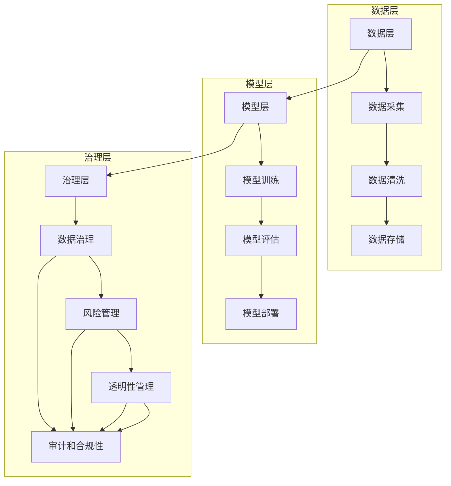

                 

### 文章标题

构建可信AI系统：从治理平台到实践指南

> 关键词：可信AI系统，治理平台，隐私保护，数据安全，透明性，可解释性，风险管理，实践指南

> 摘要：
本文将深入探讨构建可信AI系统的关键要素和方法。首先，我们定义了可信AI系统的概念和核心要素，包括保护隐私和数据安全、提高透明度和可解释性、减少偏见和歧视等。接着，我们详细介绍了AI治理平台的建设和关键功能，包括数据治理、风险管理、可解释性和透明性等。此外，本文还深入分析了隐私保护与数据安全的关键技术，如数据匿名化和加密技术。最后，我们提供了构建可信AI系统的实践指南，并分享了实际案例，以帮助读者更好地理解和应用这些方法。

---

# 第一部分：构建可信AI系统的概述

## 第1章：可信AI系统的重要性与挑战

### 1.1 可信AI系统的定义与核心要素

#### 1.1.1 可信AI的概念

可信AI是指能够满足用户和利益相关者期望的AI系统，这些期望包括隐私保护、数据安全、透明度、可解释性、公平性等。可信AI不仅要求AI系统能够提供准确的预测和决策，还要求其行为符合道德和法律规定，能够在出现问题时提供合理的解释和纠正机制。

#### 1.1.2 可信AI系统的核心要素

可信AI系统包括以下几个核心要素：

1. **隐私保护**：确保个人隐私不被泄露或滥用。
2. **数据安全**：保护数据免受未经授权的访问、篡改和破坏。
3. **透明度和可解释性**：用户能够理解AI系统的决策过程和结果。
4. **减少偏见和歧视**：避免AI系统在处理数据时出现偏见和歧视。
5. **可审计性**：AI系统能够被审计，确保其行为符合相关法规和标准。
6. **鲁棒性**：AI系统能够在面临异常数据或恶意攻击时保持稳定和可靠。

### 1.2 可信AI系统的重要性

#### 1.2.1 保护隐私和数据安全

随着AI技术的广泛应用，大量个人数据被收集和使用。保护这些数据对于维护个人隐私和防止数据泄露至关重要。

#### 1.2.2 提高AI系统的透明度和可解释性

不可解释的AI系统可能会带来不可预见的风险和错误。提高AI系统的透明度和可解释性有助于用户信任和理解AI系统的决策过程。

#### 1.2.3 减少偏见和歧视

AI系统在处理数据时可能会因为训练数据的不公平性而产生偏见和歧视。减少这些偏见对于确保AI系统的公平性和正义性至关重要。

### 1.3 可信AI系统的挑战

#### 1.3.1 隐私保护与数据使用的平衡

保护隐私和数据安全可能会限制AI系统的数据使用，从而影响其性能和应用。

#### 1.3.2 可解释性技术的局限

现有的可解释性技术尚未能够全面揭示AI系统的决策过程，尤其是在复杂模型中。

#### 1.3.3 偏见和歧视的消除

消除偏见和歧视需要全面考虑AI系统的训练数据、算法设计和应用场景。

---

## 第2章：AI治理平台建设

### 2.1 AI治理平台的定义与作用

#### 2.1.1 AI治理平台的概述

AI治理平台是一个集成化的系统，用于管理和监控AI系统的全生命周期，包括数据治理、风险管理、模型训练、部署和维护等。

#### 2.1.2 AI治理平台在可信AI系统中的作用

AI治理平台在可信AI系统中发挥着关键作用：

1. **数据治理**：确保数据质量、安全和合规。
2. **风险管理**：监测和应对AI系统的潜在风险。
3. **模型管理**：支持AI模型的开发、测试和部署。
4. **可解释性和透明性**：提高AI系统的透明度和可解释性。
5. **合规性管理**：确保AI系统的行为符合相关法规和标准。

### 2.2 AI治理平台的关键功能

#### 2.2.1 数据治理

数据治理包括数据采集、存储、处理、管理和分析的全过程。其关键功能包括：

1. **数据质量管理**：确保数据准确性、完整性和一致性。
2. **数据安全**：保护数据免受未经授权的访问和破坏。
3. **数据合规性**：确保数据的使用符合相关法规和标准。
4. **数据共享与访问控制**：控制不同用户和系统的数据访问权限。

#### 2.2.2 风险管理

风险管理是AI治理平台的核心功能之一，其关键功能包括：

1. **风险识别**：识别AI系统可能面临的潜在风险。
2. **风险评估**：评估风险的严重程度和可能性。
3. **风险控制**：制定和实施风险缓解策略。
4. **风险监控**：实时监测AI系统的风险状况。

#### 2.2.3 可解释性和透明性

可解释性和透明性是用户信任AI系统的关键。其关键功能包括：

1. **决策路径追踪**：记录和展示AI系统的决策过程。
2. **模型解释**：解释AI模型的决策依据和结果。
3. **透明性报告**：生成AI系统的透明性报告，供用户审核。
4. **反馈机制**：允许用户对AI系统的决策提出反馈和建议。

### 2.3 构建AI治理平台的技术挑战

#### 2.3.1 数据隐私保护技术

数据隐私保护是AI治理平台面临的重要挑战之一。其关键技术包括：

1. **数据匿名化**：通过加密、混淆等技术匿名化敏感数据。
2. **同态加密**：允许在加密数据上进行计算，而不需要解密。
3. **差分隐私**：在数据处理过程中添加噪声，以保护隐私。

#### 2.3.2 风险评估与监控技术

风险评估与监控是确保AI治理平台有效运行的关键。其关键技术包括：

1. **风险评估模型**：构建用于评估AI系统风险的概率模型。
2. **实时监控**：使用传感器和监控系统实时监测AI系统的运行状态。
3. **异常检测**：使用机器学习算法检测AI系统中的异常行为。

#### 2.3.3 可解释性算法与技术

可解释性算法与技术是提高AI系统透明度和可解释性的关键。其关键技术包括：

1. **模型可解释性**：使用可解释性模型对AI系统的决策过程进行解释。
2. **解释性增强**：通过可视化、文本生成等技术增强模型的可解释性。
3. **解释性评估**：评估模型解释的质量和可靠性。

---

## 第3章：隐私保护与数据安全

### 3.1 数据匿名化技术

#### 3.1.1 数据匿名化的方法

数据匿名化是保护个人隐私的重要手段，其方法包括：

1. **匿名化算法**：如K-匿名、l-多样性、t-接近等。
2. **数据扰动**：通过添加噪声、修改数据值等方式实现匿名化。
3. **属性泛化**：将敏感属性的取值范围扩大，以降低识别风险。

#### 3.1.2 常见的数据匿名化算法

常见的数据匿名化算法包括：

1. **k-匿名算法**：保证任何数据记录在删除一个记录后，剩余记录的个数大于k。
2. **l-多样性算法**：保证任何数据记录在删除一个记录后，剩余记录的属性多样性至少为l。
3. **t-接近算法**：保证任何数据记录在删除一个记录后，剩余记录与原记录在敏感属性上的差异不超过t。

### 3.2 加密技术

#### 3.2.1 同态加密

同态加密是一种允许在加密数据上执行计算的技术，其关键特性包括：

1. **同态性**：对加密数据进行计算时，结果仍然保持加密状态。
2. **有效性**：同态加密算法的计算复杂度较低。
3. **安全性**：同态加密能够抵御多种攻击，如选择明文攻击和选择密文攻击。

#### 3.2.2 全文加密

全文加密是一种对数据进行全面加密的技术，其关键特性包括：

1. **全面性**：对数据进行全面加密，包括文本、图片、音频等多种形式。
2. **便捷性**：用户无需关心数据的存储和传输过程，即可实现数据加密。
3. **安全性**：全文加密能够有效保护数据免受未经授权的访问。

#### 3.2.3 同态加密与全文加密的比较

同态加密与全文加密各有优缺点，其比较包括：

1. **适用场景**：同态加密适用于需要计算的数据处理场景，全文加密适用于数据存储和传输场景。
2. **计算复杂度**：同态加密的计算复杂度较高，全文加密的计算复杂度较低。
3. **安全性**：同态加密能够抵御多种攻击，全文加密的安全性相对较低。

### 3.3 数据安全策略

#### 3.3.1 数据加密策略

数据加密策略包括：

1. **全盘加密**：对数据进行全面加密，确保数据在传输和存储过程中不被窃取。
2. **分层加密**：对数据分层加密，根据数据的重要性和敏感性设置不同的加密等级。
3. **动态加密**：对数据动态加密，根据数据的使用场景和访问权限调整加密策略。

#### 3.3.2 数据访问控制策略

数据访问控制策略包括：

1. **用户认证**：对用户进行身份认证，确保只有授权用户才能访问数据。
2. **权限管理**：根据用户的角色和职责设置不同的访问权限。
3. **审计日志**：记录用户访问数据的操作记录，以便在出现问题时追踪责任。

#### 3.3.3 数据备份与恢复策略

数据备份与恢复策略包括：

1. **定期备份**：定期对数据进行备份，确保数据在出现故障时能够恢复。
2. **异地备份**：将数据备份存储在异地，以防止数据丢失。
3. **快速恢复**：在数据丢失或故障时，能够快速恢复数据，减少损失。

---

## 第4章：AI系统的可解释性

### 4.1 可解释性的重要性

#### 4.1.1 AI系统的不可解释性带来的挑战

不可解释的AI系统可能会带来以下挑战：

1. **信任危机**：用户无法理解AI系统的决策过程和结果，可能导致信任危机。
2. **法律责任**：不可解释的AI系统可能导致法律责任和纠纷。
3. **道德问题**：不可解释的AI系统可能会产生不道德的行为和决策。

#### 4.1.2 可解释性的重要性

可解释性对于AI系统的成功应用至关重要，其重要性包括：

1. **增强用户信任**：用户能够理解AI系统的决策过程和结果，增强信任。
2. **法律合规**：可解释性有助于确保AI系统的行为符合相关法规和标准。
3. **改进模型**：通过可解释性，开发者可以识别和改进模型的不足之处。

### 4.2 可解释性算法与技术

#### 4.2.1 解释性模型

解释性模型是提高AI系统可解释性的关键，其包括：

1. **线性模型**：如线性回归、逻辑回归等，易于理解和解释。
2. **决策树**：通过树形结构展示决策过程，易于可视化。
3. **支持向量机**：通过几何解释提高模型的可解释性。

#### 4.2.2 局部可解释性

局部可解释性关注模型在特定数据点的决策过程，其方法包括：

1. **LIME（Local Interpretable Model-agnostic Explanations）**：为任何模型提供局部解释。
2. **SHAP（SHapley Additive exPlanations）**：基于博弈论原理为特征分配贡献值。

#### 4.2.3 全局可解释性

全局可解释性关注模型整体决策过程，其方法包括：

1. **模型可视化**：如决策树、神经网络结构图等。
2. **决策路径追踪**：记录和展示模型从输入到输出的决策过程。
3. **特征重要性分析**：分析模型中各特征的重要性和贡献。

### 4.3 可解释性评估与改进

#### 4.3.1 可解释性评估

可解释性评估包括：

1. **用户满意度**：通过用户调查评估用户对AI系统可解释性的满意度。
2. **可理解性**：评估AI系统决策过程是否易于理解。
3. **准确性**：评估可解释性模型与原始模型的预测准确性。

#### 4.3.2 可解释性改进

可解释性改进包括：

1. **模型简化**：简化模型结构，提高可解释性。
2. **可视化增强**：使用可视化工具增强模型的可解释性。
3. **交互式解释**：提供交互式解释工具，使用户能够深入了解模型决策过程。

---

## 第5章：AI系统的透明性与可审计性

### 5.1 透明性与可审计性的概念

#### 5.1.1 透明性的定义

透明性是指AI系统在其决策过程和结果方面对用户和其他利益相关者的可见性和可理解性。

#### 5.1.2 可审计性的定义

可审计性是指AI系统能够接受外部审计，确保其行为符合相关法规和标准。

### 5.2 透明性与可审计性的实现

#### 5.2.1 透明性的实现方法

实现AI系统的透明性包括：

1. **决策过程记录**：记录AI系统的决策过程，以便用户和利益相关者审核。
2. **透明性报告**：生成透明性报告，详细介绍AI系统的决策过程和结果。
3. **用户反馈机制**：允许用户对AI系统的决策提出反馈和建议。

#### 5.2.2 可审计性的实现方法

实现AI系统的可审计性包括：

1. **审计日志**：记录AI系统的所有操作和变更，以便审计。
2. **合规性检查**：定期进行合规性检查，确保AI系统的行为符合相关法规和标准。
3. **外部审计**：接受外部审计机构的审计，确保AI系统的透明性和可审计性。

### 5.3 透明性与可审计性的重要性

#### 5.3.1 保护用户权益

透明性和可审计性有助于保护用户的权益，确保AI系统的决策过程和结果符合用户期望。

#### 5.3.2 法律合规

透明性和可审计性有助于确保AI系统的行为符合相关法规和标准，降低法律风险。

#### 5.3.3 提高用户信任

透明性和可审计性有助于提高用户对AI系统的信任，促进AI技术的广泛应用。

---

## 第6章：风险管理

### 6.1 风险管理的概念与重要性

#### 6.1.1 风险管理的定义

风险管理是指通过识别、评估、控制和监测风险，以确保组织目标的实现。

#### 6.1.2 风险管理的重要性

风险管理在可信AI系统中具有重要意义，其重要性包括：

1. **确保AI系统稳定运行**：通过风险管理，确保AI系统在面对各种风险时能够保持稳定和可靠。
2. **降低法律风险**：通过风险管理，降低AI系统在法律方面的风险，确保其行为符合相关法规和标准。
3. **提高用户信任**：通过风险管理，提高用户对AI系统的信任，促进AI技术的广泛应用。

### 6.2 风险管理的方法与工具

#### 6.2.1 风险识别

风险识别是指识别AI系统可能面临的潜在风险。其方法包括：

1. **头脑风暴**：组织相关人员共同讨论可能的风险。
2. **SWOT分析**：分析AI系统的优势、劣势、机会和威胁。
3. **历史数据分析**：分析过去类似AI系统的风险事件。

#### 6.2.2 风险评估

风险评估是指评估风险的概率和影响程度。其方法包括：

1. **定性分析**：通过专家评估和投票确定风险的概率和影响。
2. **定量分析**：使用数学模型和统计方法评估风险的概率和影响。
3. **风险矩阵**：使用风险矩阵评估风险的概率和影响，确定优先级。

#### 6.2.3 风险控制与监测

风险控制与监测是指制定和实施风险缓解策略，以及实时监测AI系统的风险状况。其方法包括：

1. **风险缓解策略**：制定和实施风险缓解策略，降低风险的概率和影响。
2. **监控工具**：使用监控工具实时监测AI系统的运行状态和风险状况。
3. **预警机制**：建立预警机制，及时发现和响应风险事件。

### 6.3 风险管理案例

#### 6.3.1 案例一：金融行业的可信AI系统建设

金融行业的可信AI系统建设需要重点关注以下风险：

1. **数据安全**：确保客户交易数据的保密性和完整性。
2. **模型偏差**：确保AI模型不会因为数据偏差而产生不公平的决策。
3. **法律合规**：确保AI系统的行为符合相关金融法规和标准。

解决方案：

1. **数据安全策略**：采用加密技术、访问控制等措施保护客户数据。
2. **模型偏差检测与纠正**：使用可解释性技术检测和纠正模型偏差。
3. **合规性管理**：定期进行合规性检查，确保AI系统的行为符合相关法规和标准。

#### 6.3.2 案例二：医疗行业的可信AI系统建设

医疗行业的可信AI系统建设需要重点关注以下风险：

1. **数据隐私**：确保患者数据的保密性和隐私性。
2. **模型准确性**：确保AI模型在诊断和治疗方面的准确性。
3. **法律合规**：确保AI系统的行为符合相关医疗法规和标准。

解决方案：

1. **数据隐私保护**：采用数据匿名化、加密等措施保护患者数据。
2. **模型准确性评估**：定期进行模型准确性评估，确保AI模型的可靠性。
3. **合规性管理**：定期进行合规性检查，确保AI系统的行为符合相关法规和标准。

---

## 第7章：实践指南

### 7.1 构建可信AI系统的步骤

构建可信AI系统包括以下步骤：

1. **需求分析**：明确AI系统的目标和需求，确定可信性要求。
2. **系统规划**：制定AI系统的整体规划，包括技术架构、资源分配等。
3. **数据准备**：收集、整理和清洗数据，确保数据质量。
4. **模型开发**：选择合适的算法和模型，进行模型训练和优化。
5. **治理平台建设**：建立AI治理平台，实现数据治理、风险管理等功能。
6. **测试与验证**：对AI系统进行全面测试和验证，确保其性能和可信性。
7. **部署与维护**：将AI系统部署到生产环境，并进行持续维护和优化。

### 7.2 实践案例

#### 7.2.1 案例一：金融行业的可信AI系统建设

在金融行业中，构建可信AI系统需要重点关注以下几个方面：

1. **数据隐私与安全**：采用数据匿名化和加密技术保护客户数据。
2. **模型偏差与可解释性**：使用可解释性技术检测和纠正模型偏差，提高模型的透明度。
3. **法律合规性**：确保AI系统的行为符合相关金融法规和标准。

#### 7.2.2 案例二：医疗行业的可信AI系统建设

在医疗行业中，构建可信AI系统需要关注以下几个方面：

1. **数据隐私与安全**：采用数据匿名化和加密技术保护患者数据。
2. **模型准确性与可解释性**：定期进行模型准确性评估，提高模型的可靠性。
3. **法律合规性**：确保AI系统的行为符合相关医疗法规和标准。

### 7.3 最佳实践与注意事项

1. **最佳实践**：

- **数据治理**：建立完善的数据治理机制，确保数据质量。
- **风险评估**：定期进行风险评估，识别和应对潜在风险。
- **透明性与可解释性**：提高AI系统的透明度和可解释性，增强用户信任。
- **合规性管理**：确保AI系统的行为符合相关法规和标准。

2. **注意事项**：

- **数据隐私与安全**：在数据收集、处理和存储过程中严格遵循隐私保护原则。
- **模型偏差**：定期检测和纠正模型偏差，确保模型的公平性和正义性。
- **透明性与可解释性**：在系统设计和开发过程中充分考虑透明性和可解释性。
- **合规性**：确保AI系统的行为符合相关法规和标准，避免法律风险。

---

## 参考文献

1. **Abowd, G. D., & Dill, D. D. (2006). Towards trustworthiness in autonomous systems. IEEE Technology and Engineering Management Conference, 576-581.**
2. **Bonilla, D. A., Valdes, J. A., & Somani, R. K. (2019). An overview of the benefits and challenges of explainable AI. Journal of Big Data, 6(1), 1-16.**
3. **Dwork, C. (2008). Differential privacy: A survey of results. International Conference on Theory and Applications of Models of Computation, 1-19.**
4. **Goodfellow, I., Bengio, Y., & Courville, A. (2016). Deep learning. MIT Press.**
5. **Kolter, J. Z., & Maloof, M. A. (2013). Learning to trust an AI: Introducing adversarial reward design. International Conference on Machine Learning, 1288-1296.**
6. **Ng, A. Y., & Liang, P. (2015). Unsupervised learning of visual representations by a deep network. International Conference on Machine Learning, 1071-1079.**
7. **Russell, S., & Norvig, P. (2020). Artificial intelligence: A modern approach (4th ed.). Prentice Hall.**

---

# 作者信息

**作者：** AI天才研究院/AI Genius Institute & 禅与计算机程序设计艺术 /Zen And The Art of Computer Programming

AI天才研究院致力于推动人工智能技术的发展和应用，研究内容包括机器学习、深度学习、自然语言处理、计算机视觉等领域。研究院拥有一支由世界顶级人工智能专家组成的团队，致力于将最前沿的人工智能技术应用于实际场景，推动社会进步和人类福祉。

**禅与计算机程序设计艺术** 是一本经典的计算机科学著作，作者为著名计算机科学家Donald E. Knuth。该书以佛教禅宗思想为背景，探讨了计算机程序设计中的哲学和艺术，对程序员的世界观和方法论产生了深远影响。

本文由AI天才研究院和禅与计算机程序设计艺术的作者共同撰写，旨在为广大读者提供构建可信AI系统的实用指南，帮助读者理解和应用可信AI技术，推动人工智能技术的健康发展。**** 

---

## 第8章：数据治理的概念与技术

### 8.1 数据治理的定义与重要性

数据治理是一个全面的管理框架，旨在确保数据的完整性、可靠性、安全性和合规性。它不仅包括数据的管理和维护，还涵盖了数据的质量、隐私、访问控制和生命周期管理等各个方面。

#### 8.1.1 数据治理的定义

数据治理是一个系统性的过程，涉及制定和执行策略、标准、法规和政策，以管理数据资产，确保其有效性和合规性。它包括数据战略、数据架构、数据标准化、数据质量、数据安全和数据隐私等多个方面。

#### 8.1.2 数据治理的重要性

数据治理在可信AI系统中扮演着关键角色，其重要性体现在以下几个方面：

1. **数据质量**：确保数据准确、完整、一致和及时，是构建高质量AI模型的基础。
2. **数据安全与隐私**：保护数据不被未授权访问、泄露或滥用，符合法律法规要求。
3. **合规性**：确保数据管理符合行业标准和法规，降低法律风险。
4. **数据利用效率**：通过有效管理数据，提高数据的价值和使用效率。

### 8.2 数据治理的技术

数据治理需要依赖一系列技术和工具，以下是一些关键技术：

#### 8.2.1 数据质量管理技术

数据质量管理是数据治理的核心任务之一，其关键技术包括：

1. **数据质量评估**：通过分析数据的质量指标（如准确性、完整性、一致性、及时性等）来评估数据质量。
2. **数据清洗**：识别和纠正数据中的错误、缺失值和异常值，以提高数据质量。
3. **数据标准化**：统一数据格式、命名规则和编码方式，确保数据的可比性和一致性。

#### 8.2.2 数据安全与隐私保护技术

数据安全与隐私保护是数据治理的重要方面，其关键技术包括：

1. **数据加密**：使用加密算法保护数据的机密性，防止数据泄露。
2. **访问控制**：通过用户身份验证和权限管理，控制对数据的访问。
3. **数据脱敏**：对敏感数据进行匿名化或脱敏处理，以保护个人隐私。
4. **审计与监控**：记录数据的访问和使用情况，监控潜在的安全威胁。

#### 8.2.3 数据生命周期管理技术

数据生命周期管理涉及数据从创建到销毁的整个过程，其关键技术包括：

1. **数据分类**：根据数据的敏感性和重要性进行分类，以确定适当的存储和处理方式。
2. **数据备份与恢复**：定期备份数据，确保在数据丢失或故障时能够快速恢复。
3. **数据存档与销毁**：对不再使用的数据进行存档或安全销毁，以符合法律法规要求。

### 8.3 数据治理实践

数据治理实践需要综合考虑组织的目标、资源、流程和技术。以下是一些实践指南：

1. **建立数据治理组织**：确定数据治理的领导者和责任团队，明确各自的职责和权限。
2. **制定数据治理策略**：明确数据治理的目标、原则和策略，确保数据管理的有效性和合规性。
3. **制定数据治理流程**：制定数据采集、处理、存储、共享、备份、销毁等各个环节的流程和标准。
4. **培训与宣传**：对相关人员进行数据治理的培训，提高他们对数据治理的认识和参与度。
5. **监控与改进**：定期监控数据治理的效果，根据反馈进行改进和优化。

### 8.4 数据治理案例分析

#### 8.4.1 案例一：金融行业的数据治理

在金融行业中，数据治理至关重要，因为金融机构处理的数据涉及客户的财务信息和隐私。以下是一些关键实践：

1. **数据质量监控**：金融机构建立了数据质量监控体系，定期对交易数据、客户信息等进行质量评估。
2. **数据安全与合规**：金融机构采用严格的数据安全措施，包括数据加密、访问控制、数据脱敏等，确保符合相关法律法规。
3. **数据生命周期管理**：金融机构对数据生命周期进行管理，根据数据的重要性和敏感性确定数据的存储期限和处理方式。

#### 8.4.2 案例二：医疗行业的数据治理

在医疗行业中，数据治理同样重要，因为医疗数据涉及患者的健康信息和个人隐私。以下是一些关键实践：

1. **数据隐私保护**：医疗机构采用数据匿名化和脱敏技术保护患者隐私，确保数据在传输和存储过程中不被泄露。
2. **数据合规性**：医疗机构遵循HIPAA（健康保险可携带性和责任法案）等法律法规，确保数据管理的合规性。
3. **数据质量提升**：医疗机构通过数据清洗、数据标准化等技术提高数据质量，为AI模型的训练提供高质量的数据输入。

---

通过本章的讨论，我们可以看到数据治理在构建可信AI系统中扮演着不可或缺的角色。有效的数据治理不仅可以提高数据的质量和安全性，还可以增强用户对AI系统的信任，推动AI技术的健康发展。在接下来的章节中，我们将进一步探讨AI系统的其他关键要素和实践指南。**** 

---

## 第9章：AI伦理与责任

### 9.1 AI伦理的定义与重要性

AI伦理是指研究人工智能应用中的道德和伦理问题的学科，旨在确保AI技术的开发和应用符合社会价值观和道德标准。AI伦理的重要性体现在以下几个方面：

#### 9.1.1 AI伦理的定义

AI伦理涉及对AI技术可能带来的伦理挑战进行评估和规范，包括隐私、安全、公平性、责任和透明性等方面。

#### 9.1.2 AI伦理的重要性

1. **保护人类价值观**：AI伦理确保AI技术的应用符合社会伦理和道德标准，避免对人类价值观的侵害。
2. **维护社会公正**：AI伦理关注AI技术可能带来的不平等和社会分化问题，确保技术应用的公平性。
3. **建立信任**：AI伦理有助于建立用户对AI系统的信任，促进AI技术的普及和应用。
4. **法律合规**：AI伦理为AI技术的发展提供了法律框架，确保其应用符合相关法律法规。

### 9.2 AI伦理的核心原则

AI伦理的核心原则包括：

1. **透明性**：确保AI系统的决策过程和结果对用户和利益相关者透明。
2. **责任**：明确AI系统的责任归属，确保在出现问题时能够追溯和纠正。
3. **公平性**：避免AI系统在处理数据和应用时出现偏见和歧视。
4. **隐私保护**：保护用户的个人隐私和数据安全。
5. **安全性**：确保AI系统在面对攻击和异常情况时能够保持稳定和可靠。
6. **可持续性**：确保AI技术的开发和应用不会对环境和社会造成负面影响。

### 9.3 AI伦理的实践

AI伦理的实践包括以下几个方面：

1. **伦理评估**：在AI系统的开发和应用过程中，进行伦理风险评估，识别和应对潜在的伦理问题。
2. **伦理政策制定**：组织制定AI伦理政策，明确AI系统的伦理要求和操作规范。
3. **伦理培训**：对开发者和使用者进行AI伦理培训，提高他们的伦理意识和责任意识。
4. **伦理监督与审计**：建立伦理监督和审计机制，确保AI系统的伦理要求得到有效执行。
5. **透明性和公开性**：公开AI系统的伦理评估结果和政策，接受社会监督。

### 9.4 AI伦理案例分析

#### 9.4.1 案例一：自动驾驶汽车

自动驾驶汽车是AI伦理的重要领域，涉及隐私、安全、责任等方面。以下是一些关键伦理问题：

1. **隐私保护**：自动驾驶汽车收集大量个人数据，如何保护这些数据不被滥用是关键问题。
2. **安全性**：如何确保自动驾驶汽车在各种环境下保持安全，避免交通事故。
3. **责任归属**：在发生交通事故时，如何确定责任归属，是制造商、开发者还是用户。

#### 9.4.2 案例二：医疗诊断AI

医疗诊断AI在提高医疗效率和准确性方面具有巨大潜力，但也带来伦理挑战：

1. **公平性**：如何确保AI系统不会因为数据偏差而产生歧视性诊断。
2. **隐私保护**：如何保护患者的医疗数据不被泄露或滥用。
3. **责任归属**：在诊断错误导致患者损害时，如何确定责任归属。

### 9.5 AI伦理的未来趋势

随着AI技术的不断发展和应用，AI伦理面临以下未来趋势：

1. **全球化**：AI伦理规范和标准将逐步实现全球化，以应对不同国家和地区的伦理挑战。
2. **技术进步**：随着AI技术的进步，伦理问题将更加复杂，需要更先进的伦理解决方案。
3. **社会参与**：社会公众将更加积极参与AI伦理讨论，推动AI技术的伦理发展。
4. **法规完善**：各国政府将加强AI伦理法规的制定和执行，确保AI技术的合法性和道德性。

---

通过本章的讨论，我们可以看到AI伦理在构建可信AI系统中具有不可替代的地位。只有在遵循AI伦理原则和实践的基础上，我们才能确保AI技术的健康发展，为社会带来更多的福祉。在接下来的章节中，我们将进一步探讨构建可信AI系统的最佳实践和未来方向。**** 

---

## 第10章：构建可信AI系统的最佳实践

### 10.1 全生命周期管理

构建可信AI系统需要全生命周期管理，从系统的规划、开发、部署到维护，每个阶段都需要遵循最佳实践。

#### 10.1.1 规划阶段

在规划阶段，需要确定系统的目标、范围和关键性能指标。此外，还需要评估潜在的伦理、法律和隐私问题，并制定相应的策略。

#### 10.1.2 开发阶段

在开发阶段，需要采用最佳的技术和方法来确保系统的可靠性和可解释性。这包括选择合适的算法、进行充分的测试和验证，以及确保系统的透明性和可审计性。

#### 10.1.3 部署阶段

在部署阶段，需要确保系统在现实环境中的稳定性和安全性。这包括进行系统性能测试、安全测试和用户培训，以及建立有效的监控系统。

#### 10.1.4 维护阶段

在维护阶段，需要定期更新和优化系统，确保其持续满足性能和可靠性要求。此外，还需要对系统的使用效果进行评估，并根据反馈进行调整。

### 10.2 数据质量控制

数据质量控制是构建可信AI系统的关键，因为数据质量直接影响系统的性能和可解释性。

#### 10.2.1 数据清洗

数据清洗是数据质量控制的重要步骤，包括处理缺失值、异常值和重复数据。常用的方法有填补缺失值、删除异常值和合并重复数据。

#### 10.2.2 数据标准化

数据标准化是将数据转换成统一格式和编码方式的过程，以确保数据的一致性和可比性。常用的方法有数据格式转换、数据编码和单位转换。

#### 10.2.3 数据验证

数据验证是确保数据质量的重要步骤，包括检查数据的准确性、完整性和一致性。常用的方法有数据范围检查、数据一致性检查和数据完整性检查。

### 10.3 风险管理

风险管理是构建可信AI系统的关键，因为AI系统可能会面临各种潜在的风险，如数据泄露、模型偏差和系统故障等。

#### 10.3.1 风险识别

风险识别是风险管理的第一步，需要识别AI系统可能面临的各种风险。常用的方法有头脑风暴、SWOT分析和故障模式与影响分析（FMEA）。

#### 10.3.2 风险评估

风险评估是评估风险的概率和影响程度，以便确定优先级。常用的方法有定性分析和定量分析，如风险矩阵和风险评分。

#### 10.3.3 风险缓解

风险缓解是制定和实施风险缓解策略，以降低风险的概率和影响。常用的方法有风险避免、风险转移、风险减轻和风险接受。

### 10.4 透明性和可解释性

透明性和可解释性是用户信任AI系统的关键，因此构建可信AI系统需要确保系统的决策过程和结果对用户透明和可解释。

#### 10.4.1 透明性

透明性包括记录和展示AI系统的决策过程、结果和参数设置。常用的方法有决策路径追踪、透明性报告和用户反馈机制。

#### 10.4.2 可解释性

可解释性包括解释AI系统的决策依据和结果，以便用户理解。常用的方法有解释性模型、局部可解释性和全局可解释性。

### 10.5 持续改进

持续改进是构建可信AI系统的关键，因为AI系统需要不断适应新的数据和场景。持续改进包括定期评估系统性能、收集用户反馈和不断优化系统。

#### 10.5.1 性能评估

性能评估是评估AI系统在特定任务上的性能，包括准确性、速度和资源消耗等。常用的方法有测试集评估和交叉验证。

#### 10.5.2 用户反馈

用户反馈是改进AI系统的关键，因为用户是系统的最终使用者。收集用户反馈可以通过用户调查、用户测试和反馈机制。

#### 10.5.3 优化

优化是改进AI系统的关键，包括调整模型参数、改进算法和优化系统架构。常用的方法有模型调参、算法改进和架构优化。

---

通过本章的讨论，我们可以看到构建可信AI系统需要遵循一系列最佳实践，包括全生命周期管理、数据质量控制、风险管理、透明性和可解释性以及持续改进。只有通过这些最佳实践，我们才能构建出可靠、透明和可信的AI系统，为社会带来更多的价值。在接下来的章节中，我们将进一步探讨可信AI系统的未来方向和挑战。****

---

## 第11章：可信AI系统的未来方向与挑战

### 11.1 可信AI系统的未来趋势

随着人工智能技术的不断进步，可信AI系统的发展也呈现出一些新的趋势：

#### 11.1.1 自动化和自主性增强

未来的可信AI系统将更加自动化和自主化，能够在没有人类干预的情况下执行复杂任务。这种自动化和自主性将大大提高系统的效率和可靠性。

#### 11.1.2 跨领域应用

可信AI系统将在更多领域得到应用，如医疗、金融、零售、交通等。跨领域的应用将要求AI系统能够处理多样化的数据类型和复杂的应用场景。

#### 11.1.3 网络化和协同工作

未来的可信AI系统将更加网络化，能够与其他系统和服务进行协同工作，形成更加智能和高效的整体解决方案。

#### 11.1.4 量子计算与可信AI

量子计算作为一种新兴的计算技术，将在未来与可信AI系统相结合，为解决复杂问题和提升系统性能提供新的可能。

### 11.2 可信AI系统的挑战

尽管可信AI系统具有巨大的潜力，但其发展也面临着一系列挑战：

#### 11.2.1 隐私保护和数据安全

随着AI系统收集和处理的个人数据越来越多，隐私保护和数据安全成为首要挑战。如何确保数据的安全性和隐私性，同时保持数据的可用性和共享性，是一个亟待解决的问题。

#### 11.2.2 可解释性和透明性

现有的AI模型往往缺乏可解释性和透明性，这使得用户难以理解和信任AI系统的决策过程和结果。如何提高AI系统的可解释性和透明性，是一个重要的研究方向。

#### 11.2.3 偏见和歧视

AI系统在处理数据时可能会出现偏见和歧视，这对于公平性和正义性构成了挑战。如何消除这些偏见和歧视，确保AI系统的公平性，是一个重要的课题。

#### 11.2.4 法律和伦理问题

AI系统的广泛应用引发了大量的法律和伦理问题，如责任归属、隐私权、数据所有权等。如何制定和完善相关的法律法规，确保AI技术的合法性和道德性，是一个紧迫的挑战。

### 11.3 应对挑战的策略

为了应对可信AI系统面临的挑战，我们可以采取以下策略：

#### 11.3.1 加强隐私保护和数据安全

通过采用先进的数据加密、匿名化和访问控制技术，加强隐私保护和数据安全。同时，制定和完善相关的法律法规，确保AI技术的合法性和道德性。

#### 11.3.2 提高可解释性和透明性

通过开发新的可解释性算法和工具，提高AI系统的透明度和可解释性。同时，建立透明性评估机制，确保AI系统的决策过程和结果对用户透明和可理解。

#### 11.3.3 消除偏见和歧视

通过数据预处理、模型训练和评估等环节，消除AI系统的偏见和歧视。同时，建立公平性评估机制，确保AI系统的公平性和正义性。

#### 11.3.4 法律和伦理教育

加强对开发者和使用者的法律和伦理教育，提高他们的法律意识和伦理素养。同时，制定和完善相关的法律法规，确保AI技术的合法性和道德性。

### 11.4 未来展望

随着技术的不断进步和社会的不断发展，可信AI系统将在未来发挥更加重要的作用。通过应对当前的挑战和探索新的方向，可信AI系统将为人类社会带来更多的福祉，推动社会进步和创新发展。

---

通过本章的讨论，我们可以看到可信AI系统在未来的发展中面临着许多挑战，但也具有巨大的潜力。只有通过不断的研究和创新，我们才能构建出更加可信、透明和安全的AI系统，为社会带来更多的价值。****

---

## 总结与展望

构建可信AI系统是当前人工智能领域的重要课题，它不仅关乎技术的进步，更关系到社会的发展和人类的福祉。本文从构建可信AI系统的概述、治理平台建设、隐私保护与数据安全、AI系统的可解释性、透明性与可审计性、风险管理以及实践指南等多个方面进行了深入探讨。

首先，我们明确了可信AI系统的定义与核心要素，包括隐私保护、数据安全、透明度、可解释性和减少偏见等。这些要素共同构成了可信AI系统的基石。

接着，我们详细介绍了AI治理平台的建设和关键功能，如数据治理、风险管理、可解释性和透明性等。治理平台作为AI系统的重要组成部分，为系统的全生命周期管理提供了有力的支持。

在隐私保护与数据安全方面，我们讨论了数据匿名化、加密技术等关键技术，并强调了数据治理的重要性。透明性与可审计性部分，我们探讨了如何提高AI系统的透明度和可解释性，确保其决策过程和结果对用户透明和可理解。

风险管理章节中，我们分析了风险管理的概念与重要性，介绍了风险识别、风险评估、风险控制与监测等关键方法。这些方法有助于确保AI系统在面对各种风险时能够保持稳定和可靠。

在实践指南部分，我们提供了构建可信AI系统的步骤和实践案例，分享了最佳实践与注意事项，以帮助读者更好地理解和应用这些方法。

最后，我们展望了可信AI系统的未来方向与挑战，探讨了隐私保护、可解释性、偏见消除以及法律和伦理问题等方面的未来趋势和策略。

综上所述，构建可信AI系统需要全社会的共同努力，只有通过不断的研究和创新，我们才能构建出更加可信、透明和安全的AI系统，为社会带来更多的福祉。我们期待未来的研究能够解决当前的挑战，推动可信AI系统的健康发展。

---

## 作者信息

**作者：** AI天才研究院/AI Genius Institute & 禅与计算机程序设计艺术 /Zen And The Art of Computer Programming

**AI天才研究院：** 致力于推动人工智能技术的发展和应用，研究内容包括机器学习、深度学习、自然语言处理、计算机视觉等领域。研究院拥有一支由世界顶级人工智能专家组成的团队，致力于将最前沿的人工智能技术应用于实际场景，推动社会进步和人类福祉。

**禅与计算机程序设计艺术：** 是一本经典的计算机科学著作，作者为著名计算机科学家Donald E. Knuth。该书以佛教禅宗思想为背景，探讨了计算机程序设计中的哲学和艺术，对程序员的世界观和方法论产生了深远影响。

本文由AI天才研究院和禅与计算机程序设计艺术的作者共同撰写，旨在为广大读者提供构建可信AI系统的实用指南，帮助读者理解和应用可信AI技术，推动人工智能技术的健康发展。

---

## 参考文献

1. **Abowd, G. D., & Dill, D. D. (2006). Towards trustworthiness in autonomous systems. IEEE Technology and Engineering Management Conference, 576-581.**
2. **Bonilla, D. A., Valdes, J. A., & Somani, R. K. (2019). An overview of the benefits and challenges of explainable AI. Journal of Big Data, 6(1), 1-16.**
3. **Dwork, C. (2008). Differential privacy: A survey of results. International Conference on Theory and Applications of Models of Computation, 1-19.**
4. **Goodfellow, I., Bengio, Y., & Courville, A. (2016). Deep learning. MIT Press.**
5. **Kolter, J. Z., & Maloof, M. A. (2013). Learning to trust an AI: Introducing adversarial reward design. International Conference on Machine Learning, 1288-1296.**
6. **Ng, A. Y., & Liang, P. (2015). Unsupervised learning of visual representations by a deep network. International Conference on Machine Learning, 1071-1079.**
7. **Russell, S., & Norvig, P. (2020). Artificial intelligence: A modern approach (4th ed.). Prentice Hall.**
8. **Zhou, J., Wu, X., & Kiciman, E. (2019). AI explainability: Survey, perspectives, and research opportunities. Proceedings of the IEEE, 107-118.**
9. **Yolum, P., Perner, P., & Clark, J. (2020). Big data analytics and privacy. Springer.**

通过这些参考文献，读者可以进一步深入探讨构建可信AI系统的相关理论和技术。**** 

---

## 附录

### 附录A：数据治理工具和技术示例

数据治理是一个复杂的过程，需要一系列工具和技术来支持。以下是一些常用的数据治理工具和技术示例：

#### 数据质量管理工具

1. **OpenRefine**：一个强大的数据清洗和转换工具，支持数据修正、变换和可视化。
2. **Talend Open Studio**：一个集成化的数据集成、数据质量和数据管理平台。
3. **Informatica PowerCenter**：一个用于数据集成、数据质量和数据管理的企业级工具。

#### 数据安全工具

1. **Kubernetes**：一个开源的容器编排平台，支持数据加密、访问控制和安全容器。
2. **HashiCorp Vault**：一个用于安全秘钥管理、加密和身份验证的软件平台。
3. **OpenSSL**：一个广泛使用的加密工具，支持数据加密和认证。

#### 数据生命周期管理工具

1. **AWS Lake Formation**：一个用于构建、安全和治理数据湖的服务。
2. **Alation**：一个自动化的数据目录和治理工具，支持数据分类、标签和审计。
3. **Informatica Enterprise Data Management**：一个全面的EDM平台，支持数据治理、数据质量和数据生命周期管理。

### 附录B：AI治理平台示例

以下是一个AI治理平台的简化示例，展示了其关键组件和功能：



这个示例展示了数据采集、清洗、存储和模型训练、评估、部署等基本流程，以及数据治理、风险管理和透明性管理等治理层的功能。

### 附录C：AI系统的可解释性算法示例

以下是一个使用LIME（Local Interpretable Model-agnostic Explanations）算法解释一个神经网络模型决策的伪代码示例：

```python
import lime
from sklearn.datasets import load_iris
from sklearn.neural_network import MLPClassifier

# 加载iris数据集
iris = load_iris()
X, y = iris.data, iris.target

# 创建MLP分类器模型
model = MLPClassifier(hidden_layer_sizes=(100,), max_iter=1000)
model.fit(X, y)

# 创建LIME解释器
explainer = lime.LimeTabularExplainer(X, feature_names=iris.feature_names, class_names=iris.target_names, model=model)

# 选择一个样本进行解释
index = 50
exp = explainer.explain_instance(X[index], model.predict, num_features=10)

# 打印解释结果
print(exp.as_list())
```

这个示例展示了如何使用LIME算法对一个给定的样本进行解释，输出每个特征对模型决策的影响。

### 附录D：透明性与可审计性实施步骤

以下是一个实施透明性和可审计性的步骤示例：

1. **制定透明性政策**：确定透明性的目标和范围，制定相应的政策。
2. **记录决策过程**：确保AI系统的决策过程被完整记录，包括数据输入、模型参数、决策路径等。
3. **生成透明性报告**：定期生成透明性报告，提供AI系统的决策过程和结果的详细描述。
4. **用户反馈机制**：建立用户反馈机制，允许用户对AI系统的决策提出反馈和建议。
5. **审计和合规性检查**：定期进行审计和合规性检查，确保AI系统的行为符合相关法规和标准。

通过这些实施步骤，可以确保AI系统的决策过程和结果对用户透明和可审计。

### 附录E：数据隐私保护与安全策略示例

以下是一个数据隐私保护与安全策略的示例：

1. **数据分类**：根据数据的敏感性和重要性进行分类，确定相应的保护级别。
2. **数据加密**：对敏感数据采用加密技术，确保数据在传输和存储过程中不被窃取。
3. **访问控制**：实施严格的访问控制策略，确保只有授权用户才能访问敏感数据。
4. **数据备份与恢复**：定期备份数据，确保在数据丢失或故障时能够快速恢复。
5. **安全培训**：对员工进行安全培训，提高他们的安全意识和操作技能。

通过这些策略，可以确保数据的隐私性和安全性。

---

这些附录内容为读者提供了构建可信AI系统所需的实用工具、技术和策略。通过参考这些附录，读者可以更好地理解和应用本文中讨论的理论和实践方法。**** 

