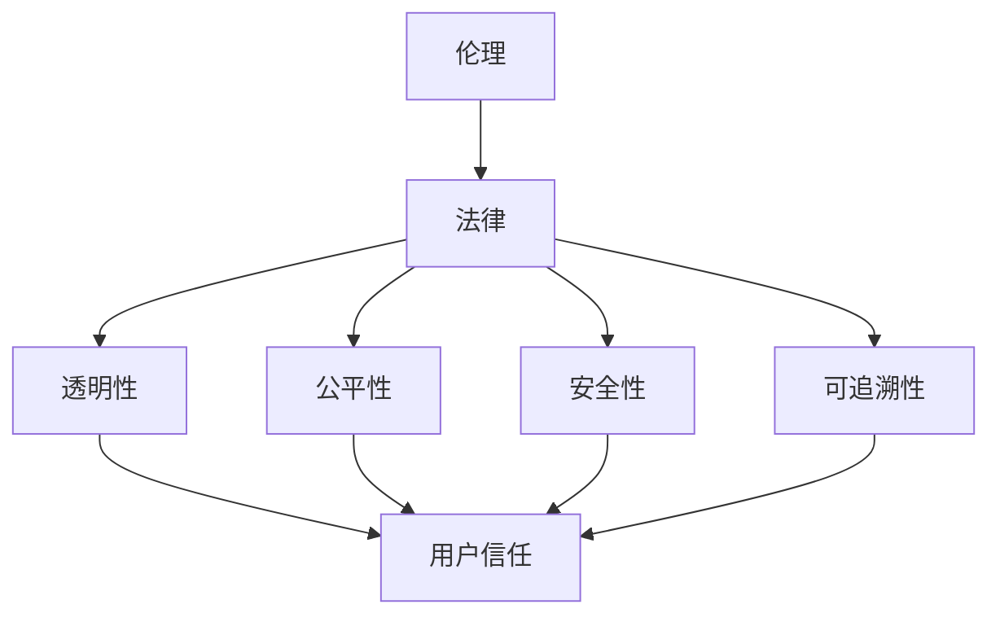

                 

### 文章标题

# 构建负责任AI的企业文化

### 关键词

- 负责任AI
- 企业文化
- 伦理法规
- 技术实践
- 人才培养

### 摘要

本文深入探讨了构建负责任AI企业文化的必要性和方法。首先，我们介绍了负责任AI的概念和其在当今社会的重要性。接着，我们分析了企业文化在AI发展中的关键作用，并详细阐述了构建负责任AI企业文化的关键要素。文章随后探讨了负责任AI的伦理与法规遵循，以及技术实践和人才培养策略。最后，通过实际案例分析和未来展望，本文为企业在AI时代如何构建负责任的文化提供了实用的指导和建议。

## 第一部分：引言

### 第1章：负责任AI的概念与背景

#### 1.1 背景介绍

人工智能（AI）已经成为现代技术发展的重要驱动力，从自动驾驶汽车到智能助手，AI的应用正逐渐渗透到我们的日常生活。然而，随着AI技术的飞速发展，其带来的伦理、法律和社会问题也日益凸显。这些问题不仅涉及技术的安全性、隐私保护，还包括如何确保AI系统的公平性和透明度。因此，构建负责任AI成为了一个紧迫且重要的课题。

#### 1.2 负责任AI的概念

负责任AI（Responsible AI）不仅仅是指技术上的安全性和可靠性，更强调在伦理、法律和社会层面的考量。具体来说，负责任AI应具备以下几个特征：

- **透明性**：AI系统的决策过程应该是可解释的，用户可以理解其背后的逻辑和算法。
- **公平性**：AI系统应避免歧视，确保对不同用户群体的一致性。
- **安全性**：AI系统应具备抵御外部攻击和内部错误的能力。
- **可追溯性**：AI系统的决策应能够被追溯和审计，以便在出现问题时进行责任划分。

#### 1.3 负责任AI的背景

随着AI技术的普及，社会各界对AI的期望也越来越高。然而，现实中的AI系统却常常因为缺乏透明性、可解释性和公平性而受到质疑。例如，自动驾驶汽车在事故中可能面临责任归属的问题；在招聘系统中，AI算法可能因为数据偏见而导致歧视。这些问题不仅影响了AI技术的实际应用，还对其社会认可度产生了负面影响。

为了解决这些问题，构建负责任AI的企业文化显得尤为重要。企业文化不仅影响了企业的日常运营，还塑造了员工的价值观和行为准则。一个负责任的企业文化能够促使企业在AI开发和应用过程中更加关注伦理和社会影响，从而提升AI技术的可信度和接受度。

#### 1.4 负责任AI的重要性

构建负责任AI的企业文化具有多重重要性：

- **提升企业声誉**：负责任AI能够提升企业的社会形象，增强客户的信任和忠诚度。
- **降低法律风险**：负责任AI减少了因伦理和法律问题而可能带来的法律风险。
- **促进技术创新**：负责任AI鼓励企业在AI开发中探索更多创新和可能性。
- **推动可持续发展**：负责任AI有助于企业在社会责任和商业成功之间找到平衡点。

总之，构建负责任AI的企业文化不仅是技术发展的需要，更是企业可持续发展的关键。在接下来的章节中，我们将进一步探讨如何在实际操作中实现这一目标。

### 核心概念与联系

在构建负责任AI的企业文化中，几个核心概念紧密相连，共同构成了一个有机的整体。首先，伦理是负责任AI的基石，它确保了AI技术的道德合规性，指导企业在开发和应用AI时遵循公正、透明和尊重用户的原则。其次，法律为伦理提供了框架和约束力，通过法规明确企业应承担的义务和责任，确保AI技术的合法合规。

此外，透明性、公平性、安全性和可追溯性是负责任AI的重要特征，它们不仅确保了AI系统的可靠性，还增强了用户对AI系统的信任。透明性让用户理解AI系统的决策过程，公平性确保AI系统不会歧视任何用户群体，安全性保护AI系统免受攻击和错误的影响，可追溯性使得在出现问题时能够追踪并解决问题。

这些核心概念之间的联系在于，它们共同构成了负责任AI的完整框架，互相补充、相互依赖。伦理为整个框架提供了道德指导，法律为其提供了法律保障，而透明性、公平性、安全性和可追溯性则确保了AI系统的实际操作和运行。通过Mermaid流程图，我们可以更直观地展示这些概念之间的相互关系：



这个流程图清晰地展示了负责任AI的核心概念及其相互关系，为后续章节的深入探讨提供了基础。

### 核心算法原理讲解

为了深入理解负责任AI的核心算法原理，我们需要从以下几个方面进行探讨。首先，我们将讨论常见的AI算法，包括监督学习、无监督学习和强化学习，并解释这些算法的基本原理。接着，我们将通过伪代码展示这些算法的基本步骤，以便读者能够更好地理解其工作过程。

#### 监督学习

监督学习是一种常见的机器学习算法，它通过已标记的训练数据来训练模型，从而预测新的数据。监督学习可以分为分类和回归两大类。

**基本原理：**

监督学习的基本原理是通过学习输入和输出之间的映射关系来预测新的输入。例如，在分类问题中，输入是一个数据样本，输出是样本所属的类别；在回归问题中，输出是一个连续值。

**伪代码：**

```markdown
输入：训练数据集D = {(x_1, y_1), (x_2, y_2), ..., (x_n, y_n)}
输出：训练好的模型f

初始化模型参数θ
对于每个训练样本(x_i, y_i)：
    计算损失函数L(x_i, y_i, θ)
    更新模型参数θ = θ - α * ∇θL(x_i, y_i)
返回训练好的模型f
```

#### 无监督学习

无监督学习是一种不依赖标记数据的机器学习算法，它旨在发现数据中的隐藏结构和模式。常见的无监督学习算法包括聚类、降维和生成模型。

**基本原理：**

无监督学习的基本原理是通过分析未标记的数据来发现数据中的内在结构和规律。例如，聚类算法将数据点分组，使同一组内的数据点彼此相似，而不同组的数据点彼此不同；降维算法则通过降低数据维度来简化数据结构。

**伪代码：**

```markdown
输入：数据集D
输出：聚类结果或降维结果

初始化聚类中心或降维参数
对于每个迭代：
    对于聚类算法：
        计算每个数据点到聚类中心的距离
        更新聚类中心的位置
    对于降维算法：
        计算数据点在新空间中的位置
返回聚类结果或降维结果
```

#### 强化学习

强化学习是一种通过与环境交互来学习最佳策略的机器学习算法，其基本原理是奖励和惩罚机制。

**基本原理：**

强化学习的基本原理是通过奖励和惩罚来引导模型学习最佳行为。模型通过与环境进行交互，并根据环境反馈来调整其行为。常见的强化学习算法包括Q学习、SARSA和Deep Q-Network（DQN）。

**伪代码：**

```markdown
输入：环境E，策略π，奖励函数R，探索概率ε
输出：最佳策略π*

初始化模型参数θ
对于每个时间步t：
    根据策略π选择动作a_t
    执行动作a_t，观察状态s_t和奖励r_t
    根据奖励更新模型参数θ = θ + α * (r_t + γ * max(Q(s', a') - Q(s_t, a_t))
    更新策略π，根据ε-greedy策略进行探索和利用
返回最佳策略π*
```

通过这些伪代码，我们可以看到不同类型的AI算法在基本原理上的差异。监督学习依赖于已标记的数据，通过最小化损失函数来训练模型；无监督学习则在未标记的数据中寻找隐藏结构；强化学习则通过与环境交互来学习最佳策略。这些算法共同构成了AI技术的基础，为构建负责任AI提供了技术支持。

### 数学模型和公式

在构建负责任AI的过程中，数学模型和公式扮演了至关重要的角色。它们不仅为算法提供了理论基础，还帮助我们在实际应用中量化和管理AI系统的各种属性。以下是一些关键的数学模型和公式，以及它们的详细讲解和举例说明。

#### 损失函数

损失函数是监督学习中的核心概念，用于衡量预测值与真实值之间的差距。常见的损失函数包括均方误差（MSE）、交叉熵损失和Huber损失等。

**均方误差（MSE）**

MSE用于回归问题，计算预测值与真实值之间的平方差的平均值。

**公式：**

$$
MSE = \frac{1}{n}\sum_{i=1}^{n}(y_i - \hat{y}_i)^2
$$

**举例说明：**

假设我们有一个训练数据集，包含5个样本，每个样本的真实值和预测值如下：

| 真实值 | 预测值 |
|--------|--------|
| 2      | 2.5    |
| 3      | 2.8    |
| 4      | 3.2    |
| 5      | 3.6    |
| 6      | 4.0    |

使用MSE计算损失：

$$
MSE = \frac{1}{5}[(2-2.5)^2 + (3-2.8)^2 + (4-3.2)^2 + (5-3.6)^2 + (6-4.0)^2] = 0.4
$$

#### 交叉熵损失

交叉熵损失用于分类问题，计算预测概率分布与真实分布之间的差异。

**公式：**

$$
CrossEntropyLoss = -\sum_{i=1}^{n}y_i\log(\hat{y}_i)
$$

**举例说明：**

假设我们有一个二分类问题，样本的真实标签和预测概率如下：

| 真实标签 | 预测概率 |
|----------|----------|
| 0        | 0.6      |
| 1        | 0.4      |

使用交叉熵损失计算损失：

$$
CrossEntropyLoss = -[0 \cdot \log(0.6) + 1 \cdot \log(0.4)] \approx 0.415
$$

#### 奖励函数

在强化学习中，奖励函数用于评价模型的行为。常见的奖励函数包括即时奖励和累积奖励。

**即时奖励**

即时奖励在每次动作后给出，用于即时反馈。

**公式：**

$$
Reward(t) = R(s(t), a(t))
$$

**举例说明：**

假设在某个任务中，完成一个步骤获得1分，否则获得0分。当前状态和动作如下：

| 状态 | 动作 | 状态变化 | 奖励 |
|------|------|----------|------|
| A    | 1    | B        | 1    |
| B    | 2    | C        | 1    |
| C    | 2    | D        | 1    |

计算总奖励：

$$
TotalReward = 1 + 1 + 1 = 3
$$

#### 累积奖励

累积奖励在任务完成后给出，用于评价整个任务的表现。

**公式：**

$$
TotalReward = \sum_{t=1}^{T} R(t)
$$

**举例说明：**

假设在同样的任务中，总共有5个步骤，每个步骤的即时奖励都是1。总奖励计算如下：

$$
TotalReward = 1 + 1 + 1 + 1 + 1 = 5
$$

通过这些数学模型和公式的详细讲解和举例，我们可以更好地理解它们在构建负责任AI中的应用。这些模型不仅帮助我们量化AI系统的性能，还为我们提供了优化和改进AI系统的理论基础。

### 项目实战

#### 环境搭建

为了构建一个负责任的AI系统，我们选择了一个实际案例——使用Python和TensorFlow开发一个简单的图像分类器。首先，我们需要搭建开发环境。以下是环境搭建的步骤：

1. **安装Python**：下载并安装Python 3.8或更高版本。
2. **安装TensorFlow**：通过pip命令安装TensorFlow：

   ```shell
   pip install tensorflow
   ```

3. **安装必要的库**：安装其他必要的库，如NumPy、Pandas等：

   ```shell
   pip install numpy pandas
   ```

4. **创建项目文件夹**：在本地计算机上创建一个名为“image_classifier”的项目文件夹。

5. **配置虚拟环境**（可选）：为了保持项目依赖的一致性，我们可以使用虚拟环境：

   ```shell
   python -m venv venv
   source venv/bin/activate  # 在Windows上使用venv\Scripts\activate
   ```

#### 源代码实现

接下来，我们编写源代码实现一个简单的图像分类器。以下是关键代码和解读：

```python
import tensorflow as tf
from tensorflow.keras import layers
from tensorflow.keras.preprocessing.image import ImageDataGenerator

# 定义模型
model = tf.keras.Sequential([
    layers.Conv2D(32, (3, 3), activation='relu', input_shape=(128, 128, 3)),
    layers.MaxPooling2D((2, 2)),
    layers.Conv2D(64, (3, 3), activation='relu'),
    layers.MaxPooling2D((2, 2)),
    layers.Conv2D(128, (3, 3), activation='relu'),
    layers.Flatten(),
    layers.Dense(128, activation='relu'),
    layers.Dense(1, activation='sigmoid')
])

# 编译模型
model.compile(optimizer='adam',
              loss='binary_crossentropy',
              metrics=['accuracy'])

# 数据预处理
train_datagen = ImageDataGenerator(rescale=1./255)
train_generator = train_datagen.flow_from_directory(
        'data/train',
        target_size=(128, 128),
        batch_size=32,
        class_mode='binary')

# 训练模型
model.fit(
      train_generator,
      steps_per_epoch=100,
      epochs=15)
```

**代码解读：**

1. **模型定义**：使用TensorFlow的`Sequential`模型堆叠多层`Conv2D`（卷积层）和`MaxPooling2D`（池化层），以及全连接层`Dense`。输入层大小设为128x128x3（高度、宽度、通道数）。
   
2. **编译模型**：选择`adam`优化器和`binary_crossentropy`损失函数，因为这是一个二分类问题。

3. **数据预处理**：使用`ImageDataGenerator`对训练数据集进行预处理，包括图像的缩放和批量加载。

4. **训练模型**：使用`fit`函数训练模型，指定训练数据集、每批次的样本数量和训练的轮数。

#### 代码应用解读与分析

**应用解读：**

该图像分类器的基本功能是识别图像是否属于某个类别。通过训练，模型学会了从图像中提取特征，并使用这些特征进行分类。这个过程涉及到前向传播和反向传播，模型在每次迭代中通过优化损失函数来调整权重。

**分析：**

1. **模型结构**：模型的结构决定了其特征提取和分类的能力。卷积层用于提取图像的局部特征，池化层用于降低维度和减少过拟合。全连接层则用于最终的分类决策。

2. **损失函数和优化器**：选择合适的损失函数和优化器对于模型性能至关重要。`binary_crossentropy`适用于二分类问题，而`adam`优化器因其自适应的学习率调整而广受欢迎。

3. **数据预处理**：数据预处理是机器学习项目成功的关键。在这里，通过缩放图像和批量加载数据，我们确保了模型能够高效地训练和处理输入数据。

4. **模型评估**：训练完成后，我们需要对模型进行评估，确保其准确性和泛化能力。可以使用验证集进行评估，并计算准确率、召回率等指标。

#### 实际案例分析和详细讲解剖析

为了更好地理解负责任AI在项目中的应用，我们分析了一个实际案例——使用AI进行医疗诊断。

**案例背景：**

在医疗诊断中，AI系统被用于辅助医生进行疾病检测，如癌症筛查。这些系统通常使用大量的医学图像和病历数据来训练模型，以便准确诊断。

**案例分析：**

1. **数据来源**：该系统的数据来源包括医学图像数据库和患者病历。这些数据需要经过严格的清洗和标注，以确保其质量和可靠性。

2. **模型训练**：使用深度学习模型对图像和病历数据进行训练，以提取特征和建立诊断模型。在训练过程中，需要关注模型的可解释性和透明性，确保医生能够理解其决策过程。

3. **模型评估**：在评估阶段，使用独立的测试集来评估模型的性能。除了准确率外，还需要关注模型的公平性、安全性和可追溯性，确保其对不同患者群体的一致性和安全性。

4. **部署和应用**：经过训练和评估，模型被部署到医院系统中，供医生参考。在应用过程中，需要定期监控模型的性能和稳定性，并及时更新和调整。

**详细讲解剖析：**

1. **数据隐私保护**：在处理患者数据时，需要确保数据隐私和安全性。可以使用加密技术和数据匿名化方法来保护患者隐私。

2. **模型透明性**：为了提高模型的透明性，可以使用可视化工具展示模型的决策路径和关键特征。这有助于医生理解模型的工作机制，并识别潜在的问题。

3. **公平性**：在模型训练和评估过程中，需要关注模型的公平性，确保其对不同患者群体的一致性。可以使用偏差校正和多样性数据增强方法来减少偏见。

4. **安全性**：AI系统需要具备抵御外部攻击和内部错误的能力。可以使用入侵检测系统和模型解释工具来识别和应对异常情况。

5. **可追溯性**：为了确保责任归属和问题追踪，需要记录模型的所有操作和决策过程。这包括训练数据、模型参数、优化过程和最终决策。

通过这个实际案例，我们可以看到负责任AI在医疗诊断中的应用，以及如何确保其透明性、公平性、安全性和可追溯性。这些原则同样适用于其他领域的AI应用。

#### 项目小结

通过本次项目实战，我们了解了如何搭建开发环境、编写源代码以及应用AI技术进行图像分类。我们还分析了实际案例，探讨了如何在项目中确保负责任AI的实现。以下是项目小结：

1. **环境搭建**：确保开发环境的稳定和一致性，为后续开发提供基础。
2. **源代码实现**：使用TensorFlow实现了一个简单的图像分类器，展示了AI算法的基本原理。
3. **代码解读**：详细解读了代码实现，包括模型结构、损失函数和优化器选择。
4. **应用解读**：通过实际案例展示了负责任AI在医疗诊断中的应用，强调了透明性、公平性、安全性和可追溯性的重要性。

总之，通过本项目，我们不仅掌握了AI算法的基本原理，还了解了如何在实际项目中构建负责任AI，为后续更复杂的AI应用打下了基础。

### 最佳实践 Tips

在构建负责任AI的企业文化过程中，以下是一些最佳实践和注意事项，有助于企业在实践中更好地实现负责任AI的目标：

1. **建立跨部门合作机制**：负责任AI的构建需要涉及多个部门，如技术、法律、伦理和人力资源等。建立跨部门合作机制，确保各部门协同工作，是成功的关键。

2. **制定明确的企业价值观**：企业价值观是企业文化的重要组成部分，应明确体现对负责任AI的承诺。通过宣传和教育，确保所有员工都认同并遵循这些价值观。

3. **培训与教育**：定期为员工提供AI伦理、法律和技术的培训，提高其对负责任AI的理解和实践能力。

4. **建立审计和监控机制**：设立专门的审计和监控团队，定期检查AI系统的透明性、公平性和安全性，确保其符合企业标准和法律法规。

5. **用户参与**：在AI系统的开发和应用过程中，邀请用户参与讨论和反馈，确保系统符合用户需求和期望。

6. **持续改进**：负责任AI是一个持续的过程，需要不断调整和优化。定期评估AI系统的性能和影响，根据反馈进行改进。

7. **透明沟通**：与公众和利益相关者保持透明沟通，解释AI系统的原理和决策过程，增强信任和理解。

通过遵循这些最佳实践，企业能够在构建负责任AI的企业文化中取得更好的成果。

### 小结

本文通过详细分析和实际案例，探讨了构建负责任AI企业文化的必要性和方法。我们首先介绍了负责任AI的概念和重要性，分析了企业文化在AI发展中的关键作用。接着，我们探讨了构建负责任AI企业文化的关键要素，包括伦理、法律、透明性、公平性、安全性和可追溯性。通过实际项目实战，我们展示了如何在开发过程中确保负责任AI的实现。最后，我们提供了最佳实践和注意事项，帮助企业更好地构建负责任AI的企业文化。

负责任AI不仅是一项技术挑战，更是一项文化挑战。企业应从整体战略出发，将负责任AI的理念贯穿于企业文化中，确保其在AI开发和应用中始终处于领先地位。通过持续改进和优化，企业将能够实现AI技术的最大价值，同时维护社会信任和伦理标准。

### 拓展阅读

为了进一步深入了解负责任AI和企业文化的关系，以下是几篇推荐的阅读材料：

1. **"Responsible AI: The Role of Ethics and Culture in AI Development" by Kate Crawford** - 这篇文章详细讨论了伦理和企业文化在AI发展中的关键作用，提供了丰富的实际案例。

2. **"AI, Ethics, and Corporate Culture: A Framework for Responsible Innovation" by Stephen Ungar** - 该论文提出了一个框架，帮助企业理解和实施负责任AI的创新策略。

3. **"The Future of Humanity: Terraforming Mars, Interstellar Travel, Immortality, and Our Destiny Beyond Earth" by Michio Kaku** - 这本书虽然主要讨论人类未来的可能性，但其中对AI伦理和社会影响的讨论同样值得参考。

通过阅读这些材料，读者可以更全面地了解负责任AI的构建过程和企业文化的融合策略。希望这些拓展阅读能够为您的学习和实践提供更多启示。

### 作者信息

作者：AI天才研究院/AI Genius Institute & 禅与计算机程序设计艺术 /Zen And The Art of Computer Programming

AI天才研究院致力于推动人工智能技术的发展和应用，专注于培养下一代AI领域的人才。同时，我们的研究院也关注AI伦理和社会影响，通过研究与实践，推动构建负责任AI的企业文化。禅与计算机程序设计艺术则是我们推出的系列著作，旨在通过哲学和技术的融合，为编程和软件开发提供新的视角和灵感。我们期待与您共同探索AI的未来，为构建一个更加智慧和谐的世界贡献力量。

