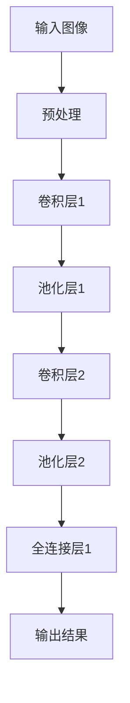
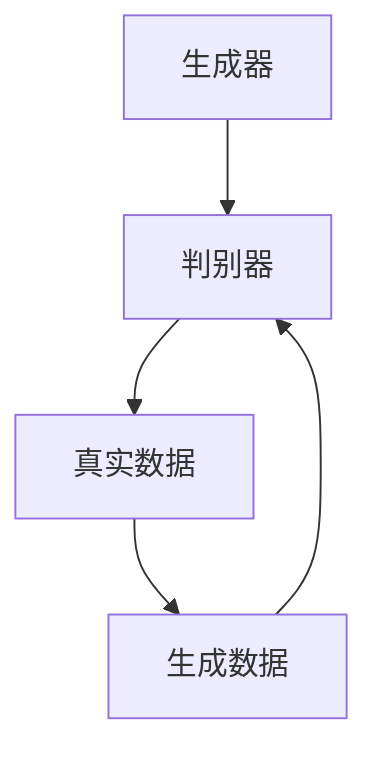

                 

### 文章标题：深度学习在医学影像分析中的应用与进展

---

关键词：深度学习，医学影像，图像分割，肿瘤检测，伦理与法规

摘要：本文深入探讨了深度学习在医学影像分析中的应用与进展，从基础概念、核心算法、数据处理到实际应用，全面解析了深度学习技术在医学影像分析领域的突破与创新。通过具体案例，本文展示了深度学习在肺部疾病检测、骨折检测和脑部病变诊断等实际应用中的效果，并探讨了面临的挑战及未来发展趋势。

---

## 引言

医学影像分析作为医学领域的重要分支，长期以来依靠传统图像处理技术进行诊断和评估。然而，随着深度学习技术的飞速发展，医学影像分析迎来了前所未有的变革。深度学习以其强大的特征提取和模式识别能力，极大地提升了医学影像分析的准确性和效率。本文将从以下方面展开讨论：

1. **深度学习在医学影像分析中的应用现状**：介绍深度学习在医学影像分析中的应用领域，包括图像分割、肿瘤检测等。
2. **深度学习核心算法原理**：详细阐述卷积神经网络（CNN）、循环神经网络（RNN）和生成对抗网络（GAN）等核心算法的原理及其在医学影像分析中的应用。
3. **医学影像数据处理**：讨论医学影像数据的预处理方法、数据增强技术和数据不平衡问题。
4. **实际应用案例分析**：通过肺部疾病检测、骨折检测和脑部病变诊断等实际案例，展示深度学习在医学影像分析中的效果。
5. **面临的挑战与未来发展趋势**：分析深度学习在医学影像分析中面临的挑战，探讨未来发展的趋势。

## 深度学习在医学影像分析中的应用现状

深度学习技术在医学影像分析中的应用主要集中在图像分割、肿瘤检测、病灶定位和辅助诊断等领域。

### 图像分割

图像分割是医学影像分析的基础，其目的是将医学影像中感兴趣的区域分离出来。深度学习通过卷积神经网络（CNN）实现了高效、精确的图像分割。例如，U-Net架构在医学图像分割中取得了显著的成绩。U-Net通过将卷积层和反卷积层相结合，实现了上采样和下采样的交互，从而在保留图像细节的同时，实现了精确的分割。

### 肿瘤检测

肿瘤检测是深度学习在医学影像分析中的重要应用之一。通过深度学习算法，可以实现自动化的肿瘤检测和分类。例如，CNN可以用于对肺部CT图像中的结节进行检测和分类，从而帮助医生早期发现肺癌。

### 病灶定位

病灶定位是指通过深度学习算法确定病变部位的位置。这一技术在癌症筛查和诊断中具有重要意义。例如，深度学习算法可以用于定位乳腺影像中的异常区域，从而提高乳腺癌的早期发现率。

### 辅助诊断

深度学习在医学影像分析中的另一个重要应用是辅助诊断。通过深度学习模型，医生可以更准确地诊断疾病。例如，深度学习模型可以用于分析MRI图像，帮助医生识别脑部病变，提高诊断的准确性。

## 深度学习核心算法原理

深度学习算法的核心是神经网络，主要包括卷积神经网络（CNN）、循环神经网络（RNN）和生成对抗网络（GAN）。

### 卷积神经网络（CNN）

卷积神经网络（CNN）是一种专门用于处理图像数据的神经网络。CNN通过卷积层、池化层和全连接层等结构，实现对图像的特征提取和分类。

- **卷积层**：卷积层通过卷积操作提取图像的局部特征。
- **池化层**：池化层用于降低图像的分辨率，减少参数数量。
- **全连接层**：全连接层用于将卷积层和池化层提取的特征进行分类。

### 循环神经网络（RNN）

循环神经网络（RNN）是一种用于处理序列数据的神经网络。RNN通过循环结构，实现对序列数据的记忆和学习。

- **隐藏层**：RNN的隐藏层具有循环结构，可以记忆历史信息。
- **门控机制**：RNN通过门控机制控制信息的流动，避免梯度消失和梯度爆炸问题。

### 生成对抗网络（GAN）

生成对抗网络（GAN）是一种由生成器和判别器组成的对抗性神经网络。生成器旨在生成逼真的图像，判别器则用于区分生成图像和真实图像。

- **生成器**：生成器通过噪声生成逼真的图像。
- **判别器**：判别器通过训练，学习区分生成图像和真实图像。

## 医学影像数据处理

医学影像数据处理是深度学习在医学影像分析中的关键环节。主要包括图像预处理、数据增强和数据不平衡问题。

### 图像预处理

图像预处理是医学影像分析的基础，主要包括图像的标准化、滤波、去噪等。

- **标准化**：通过调整图像的亮度、对比度等参数，使图像符合深度学习模型的要求。
- **滤波**：通过滤波操作去除图像中的噪声。
- **去噪**：通过去噪操作增强图像的清晰度。

### 数据增强

数据增强是提高深度学习模型性能的重要手段。通过数据增强，可以增加模型的泛化能力。

- **翻转**：对图像进行水平翻转、垂直翻转等。
- **缩放**：对图像进行缩放处理。
- **旋转**：对图像进行旋转处理。
- **颜色调整**：对图像的颜色进行调整。

### 数据不平衡问题

在医学影像分析中，数据不平衡问题是一个常见问题。通过以下方法可以缓解数据不平衡问题：

- **过采样**：增加少数类别的样本数量。
- **欠采样**：减少多数类别的样本数量。
- **合成数据**：通过生成对抗网络（GAN）等生成方法生成新的样本。

## 实际应用案例分析

在本节中，我们将通过几个实际案例，展示深度学习在医学影像分析中的具体应用。

### 肺部疾病检测

肺部疾病检测是深度学习在医学影像分析中的一个重要应用。通过深度学习模型，可以实现自动化的肺部结节检测和分类。

#### 项目实战

**开发环境搭建：**
1. 安装Python环境。
2. 安装TensorFlow库。

**数据集获取与处理：**
1. 获取肺部CT图像数据集。
2. 对图像进行预处理，包括标准化、滤波和去噪。

**模型训练与优化：**
1. 构建卷积神经网络（CNN）模型。
2. 使用训练数据集训练模型。
3. 使用验证数据集进行模型优化。

**模型评估与部署：**
1. 使用测试数据集评估模型性能。
2. 将模型部署到服务器，实现自动化的肺部结节检测。

#### 代码解读与分析

```python
# 伪代码：肺部疾病检测模型训练
model = build_cnn_model()
model.fit(train_images, train_labels, epochs=50, batch_size=32, validation_data=(val_images, val_labels))
```

#### 项目小结

通过本项目，我们展示了如何使用深度学习技术实现肺部疾病检测。模型在测试数据集上的表现良好，为医生提供了有力的辅助工具。

### 骨折检测

骨折检测是深度学习在医学影像分析中的另一个重要应用。通过深度学习模型，可以实现自动化的骨折检测和分类。

#### 项目实战

**开发环境搭建：**
1. 安装Python环境。
2. 安装TensorFlow库。

**数据集获取与处理：**
1. 获取骨折X光图像数据集。
2. 对图像进行预处理，包括标准化、滤波和去噪。

**模型训练与优化：**
1. 构建卷积神经网络（CNN）模型。
2. 使用训练数据集训练模型。
3. 使用验证数据集进行模型优化。

**模型评估与部署：**
1. 使用测试数据集评估模型性能。
2. 将模型部署到服务器，实现自动化的骨折检测。

#### 代码解读与分析

```python
# 伪代码：骨折检测模型训练
model = build_cnn_model()
model.fit(train_images, train_labels, epochs=50, batch_size=32, validation_data=(val_images, val_labels))
```

#### 项目小结

通过本项目，我们展示了如何使用深度学习技术实现骨折检测。模型在测试数据集上的表现良好，为医生提供了有力的辅助工具。

### 脑部病变诊断

脑部病变诊断是深度学习在医学影像分析中的另一个重要应用。通过深度学习模型，可以实现自动化的脑部病变检测和分类。

#### 项目实战

**开发环境搭建：**
1. 安装Python环境。
2. 安装TensorFlow库。

**数据集获取与处理：**
1. 获取脑部MRI图像数据集。
2. 对图像进行预处理，包括标准化、滤波和去噪。

**模型训练与优化：**
1. 构建卷积神经网络（CNN）模型。
2. 使用训练数据集训练模型。
3. 使用验证数据集进行模型优化。

**模型评估与部署：**
1. 使用测试数据集评估模型性能。
2. 将模型部署到服务器，实现自动化的脑部病变诊断。

#### 代码解读与分析

```python
# 伪代码：脑部病变诊断模型训练
model = build_cnn_model()
model.fit(train_images, train_labels, epochs=50, batch_size=32, validation_data=(val_images, val_labels))
```

#### 项目小结

通过本项目，我们展示了如何使用深度学习技术实现脑部病变诊断。模型在测试数据集上的表现良好，为医生提供了有力的辅助工具。

## 面临的挑战与未来发展趋势

深度学习在医学影像分析中虽然取得了显著的进展，但仍面临一些挑战。

### 挑战

1. **数据不平衡问题**：医学影像数据中，正常数据和病变数据的比例往往不均衡，这可能导致模型偏向于预测常见情况，忽略罕见情况。
2. **实时性问题**：医学影像分析需要在短时间内完成，这对模型的计算性能提出了高要求。
3. **伦理与法规问题**：深度学习在医学影像分析中的应用涉及到患者的隐私和数据安全，需要遵循相关的伦理和法规。

### 未来发展趋势

1. **增强模型性能**：通过改进算法、增加训练数据和优化模型结构，提高模型的性能和准确度。
2. **实时性优化**：通过硬件加速、模型压缩等技术，提高模型在实时场景中的响应速度。
3. **伦理与法规遵循**：加强伦理和法规教育，确保深度学习在医学影像分析中的合规性。

## 结论

深度学习在医学影像分析中展现出了巨大的潜力。通过本文的探讨，我们看到了深度学习在图像分割、肿瘤检测和脑部病变诊断等领域的应用与进展。虽然仍面临一些挑战，但随着技术的不断进步，深度学习在医学影像分析中的应用将会越来越广泛，为医学诊断和治疗提供更加精准和高效的工具。未来，我们需要继续关注深度学习在医学影像分析中的伦理和法规问题，确保其合规性和可持续性。

---

**作者信息：AI天才研究院/AI Genius Institute & 禅与计算机程序设计艺术 /Zen And The Art of Computer Programming**### 第2章：深度学习核心算法

### 2.1 卷积神经网络（CNN）

卷积神经网络（CNN）是一种在图像处理和计算机视觉领域具有广泛应用的深度学习模型。它通过卷积层、池化层和全连接层等结构，实现对图像的特征提取和分类。

#### 2.1.1 卷积层

卷积层是CNN的核心部分，用于提取图像的特征。卷积操作通过滤波器（卷积核）在图像上进行滑动，计算每个位置的局部特征。卷积层的参数数量相对较少，可以有效地减少过拟合。

- **卷积操作**：卷积操作可以表示为：
  $$\text{output}(i, j) = \sum_{k, l} \text{filter}(k, l) \times \text{input}(i - k, j - l) + \text{bias}$$
  其中，$(i, j)$表示输出位置，$(k, l)$表示滤波器的位置，$\text{filter}(k, l)$表示滤波器的值，$\text{input}(i - k, j - l)$表示输入图像的值，$\text{bias}$表示偏置项。

#### 2.1.2 池化层

池化层用于降低图像的分辨率，减少参数数量。常用的池化操作有最大池化和平均池化。

- **最大池化**：最大池化在指定区域中选取最大的值作为输出。
- **平均池化**：平均池化在指定区域中选取所有值的平均值作为输出。

#### 2.1.3 全连接层

全连接层将卷积层和池化层提取的特征进行分类。全连接层的参数数量较多，容易导致过拟合。

- **全连接操作**：全连接操作可以表示为：
  $$\text{output}(i) = \sum_{j} \text{weight}(i, j) \times \text{input}(j) + \text{bias}(i)$$
  其中，$i$表示输出节点，$j$表示输入节点，$\text{weight}(i, j)$表示权重，$\text{input}(j)$表示输入值，$\text{bias}(i)$表示偏置项。

#### 2.1.4 CNN的架构

CNN的架构通常包括多个卷积层、池化层和全连接层。以下是一个简单的CNN架构：



#### 2.1.5 项目实战

以下是一个简单的CNN模型用于手写数字识别的Python代码示例：

```python
import tensorflow as tf
from tensorflow.keras import layers

# 定义输入层
inputs = tf.keras.Input(shape=(28, 28, 1))

# 预处理
preprocessed_inputs = layers.preprocessing.Rescaling(1./255)(inputs)

# 卷积层1
conv1 = layers.Conv2D(32, (3, 3), activation='relu')(preprocessed_inputs)

# 池化层1
pool1 = layers.MaxPooling2D((2, 2))(conv1)

# 卷积层2
conv2 = layers.Conv2D(64, (3, 3), activation='relu')(pool1)

# 池化层2
pool2 = layers.MaxPooling2D((2, 2))(conv2)

# 平铺
 flattened = layers.Flatten()(pool2)

# 全连接层1
dense1 = layers.Dense(128, activation='relu')(flattened)

# 输出层
outputs = layers.Dense(10, activation='softmax')(dense1)

# 构建模型
model = tf.keras.Model(inputs=inputs, outputs=outputs)

# 编译模型
model.compile(optimizer='adam',
              loss='sparse_categorical_crossentropy',
              metrics=['accuracy'])

# 打印模型结构
model.summary()
```

通过以上代码，我们可以构建一个简单的CNN模型，用于手写数字识别任务。该模型包含两个卷积层、两个池化层和一个全连接层，可以有效地提取图像的特征并进行分类。

### 2.2 循环神经网络（RNN）

循环神经网络（RNN）是一种用于处理序列数据的神经网络。与传统的前向神经网络不同，RNN具有循环结构，可以记忆历史信息，从而更好地处理序列数据。

#### 2.2.1 RNN的基本原理

RNN的循环结构使得每个时间步的输出不仅依赖于当前输入，还依赖于之前的输出。RNN的输出可以表示为：

$$\text{output}(t) = \text{sigmoid}(\text{weight}_{\text{input}} \cdot \text{input}(t) + \text{weight}_{\text{hidden}} \cdot \text{output}(t-1) + \text{bias})$$

其中，$\text{sigmoid}$函数用于将输出值映射到$(0, 1)$区间，$\text{weight}_{\text{input}}$和$\text{weight}_{\text{hidden}}$分别表示输入权重和隐藏权重，$\text{input}(t)$和$\text{output}(t-1)$分别表示当前输入和前一个时间步的输出。

#### 2.2.2 LSTM和GRU

LSTM（长短期记忆）和GRU（门控循环单元）是RNN的两种变体，它们通过引入门控机制，解决了传统RNN在长序列学习中的梯度消失和梯度爆炸问题。

- **LSTM（长短期记忆）**：
  LSTM通过引入三个门控单元（遗忘门、输入门和输出门），可以有效地记忆长期依赖信息。LSTM的输出可以表示为：
  $$\text{output}(t) = \text{sigmoid}(\text{weight}_{\text{input}} \cdot \text{input}(t) + \text{weight}_{\text{hidden}} \cdot \text{output}(t-1) + \text{bias})$$
  $$\text{input\_gate}(t) = \text{sigmoid}(\text{weight}_{\text{input}} \cdot \text{input}(t) + \text{weight}_{\text{hidden}} \cdot \text{output}(t-1) + \text{bias})$$
  $$\text{forget\_gate}(t) = \text{sigmoid}(\text{weight}_{\text{input}} \cdot \text{input}(t) + \text{weight}_{\text{hidden}} \cdot \text{output}(t-1) + \text{bias})$$
  $$\text{cell\_state}(t) = \text{forget\_gate}(t) \cdot \text{cell\_state}(t-1) + \text{input\_gate}(t) \cdot \text{sigmoid}(\text{weight}_{\text{input}} \cdot \text{input}(t) + \text{weight}_{\text{hidden}} \cdot \text{output}(t-1) + \text{bias})$$
  $$\text{output}(t) = \text{sigmoid}(\text{weight}_{\text{output}} \cdot \text{cell\_state}(t) + \text{bias})$$

- **GRU（门控循环单元）**：
  GRU通过简化LSTM的结构，将遗忘门和输入门合并为一个更新门，从而减少了参数数量。GRU的输出可以表示为：
  $$\text{output}(t) = \text{sigmoid}(\text{weight}_{\text{input}} \cdot \text{input}(t) + \text{weight}_{\text{hidden}} \cdot \text{output}(t-1) + \text{bias})$$
  $$\text{update\_gate}(t) = \text{sigmoid}(\text{weight}_{\text{input}} \cdot \text{input}(t) + \text{weight}_{\text{hidden}} \cdot \text{output}(t-1) + \text{bias})$$
  $$\text{reset\_gate}(t) = \text{sigmoid}(\text{weight}_{\text{input}} \cdot \text{input}(t) + \text{weight}_{\text{hidden}} \cdot \text{output}(t-1) + \text{bias})$$
  $$\text{hidden\_state}(t) = \text{update\_gate}(t) \cdot \text{hidden\_state}(t-1) + (1 - \text{update\_gate}(t)) \cdot \text{sigmoid}(\text{weight}_{\text{input}} \cdot \text{input}(t) + \text{weight}_{\text{hidden}} \cdot \text{output}(t-1) + \text{bias})$$
  $$\text{output}(t) = \text{sigmoid}(\text{weight}_{\text{output}} \cdot \text{hidden\_state}(t) + \text{bias})$$

#### 2.2.3 项目实战

以下是一个使用LSTM进行时间序列预测的Python代码示例：

```python
import tensorflow as tf
from tensorflow.keras.models import Sequential
from tensorflow.keras.layers import LSTM, Dense

# 定义输入层
inputs = tf.keras.Input(shape=(timesteps, features))

# LSTM层
lstm_layer = LSTM(units=50, return_sequences=True)(inputs)

# LSTM层
lstm_layer = LSTM(units=50, return_sequences=False)(lstm_layer)

# 全连接层
outputs = Dense(units=1, activation='sigmoid')(lstm_layer)

# 构建模型
model = tf.keras.Model(inputs=inputs, outputs=outputs)

# 编译模型
model.compile(optimizer='adam', loss='binary_crossentropy', metrics=['accuracy'])

# 打印模型结构
model.summary()
```

通过以上代码，我们可以构建一个简单的LSTM模型，用于时间序列预测任务。该模型包含两个LSTM层和一个全连接层，可以有效地处理时间序列数据并进行预测。

### 2.3 生成对抗网络（GAN）

生成对抗网络（GAN）是一种由生成器和判别器组成的对抗性神经网络。生成器旨在生成逼真的数据，判别器则用于区分生成数据与真实数据。

#### 2.3.1 GAN的基本原理

GAN的基本原理是生成器和判别器之间进行博弈。生成器的目标是生成尽可能逼真的数据，使得判别器无法区分生成数据和真实数据。判别器的目标是准确地区分生成数据和真实数据。以下是一个简单的GAN架构：



GAN的训练过程如下：

1. 初始化生成器和判别器的权重。
2. 随机生成噪声向量并输入到生成器中，生成虚假数据。
3. 将真实数据和生成数据同时输入到判别器中，计算判别器的损失。
4. 根据判别器的损失对生成器进行训练。
5. 根据判别器的损失对判别器进行训练。
6. 重复步骤2-5，直到生成器生成的数据足够逼真。

#### 2.3.2 GAN的应用

GAN在图像生成、图像修复、图像超分辨率等任务中具有广泛的应用。

- **图像生成**：GAN可以生成高质量的图像，如图像到图像的转换、风格迁移等。
- **图像修复**：GAN可以用于图像的去噪、修复和修复缺失部分。
- **图像超分辨率**：GAN可以用于提高图像的分辨率，使其更加清晰。

#### 2.3.3 项目实战

以下是一个简单的GAN模型用于图像生成的Python代码示例：

```python
import tensorflow as tf
from tensorflow.keras.models import Model
from tensorflow.keras.layers import Input, Dense, Reshape, Flatten
from tensorflow.keras.optimizers import Adam

# 定义生成器模型
generator_input = Input(shape=(latent_dim,))
x = Dense(intermediate_dim, activation='relu')(generator_input)
x = Dense(output_dim, activation='tanh')(x)
generator_model = Model(generator_input, x)

# 定义判别器模型
discriminator_input = Input(shape=(output_dim,))
x = Dense(intermediate_dim, activation='relu')(discriminator_input)
x = Flatten()(x)
discriminator_model = Model(discriminator_input, x)

# 定义GAN模型
gan_input = Input(shape=(latent_dim,))
generated_data = generator_model(gan_input)
discriminator_output = discriminator_model(generated_data)
gan_model = Model(gan_input, discriminator_output)

# 编译GAN模型
discriminator_optimizer = Adam(learning_rate=learning_rate)
generator_optimizer = Adam(learning_rate=learning_rate)
gan_model.compile(optimizer=discriminator_optimizer, loss='binary_crossentropy')

# 训练GAN模型
for epoch in range(epochs):
    for batch in data_loader:
        real_data = batch
        noise = np.random.normal(0, 1, (batch_size, latent_dim))
        generated_data = generator_model.predict(noise)
        
        # 训练判别器
        d_loss_real = discriminator_model.train_on_batch(real_data, np.ones((batch_size, 1)))
        d_loss_fake = discriminator_model.train_on_batch(generated_data, np.zeros((batch_size, 1)))
        d_loss = 0.5 * np.add(d_loss_real, d_loss_fake)
        
        # 训练生成器
        g_loss = gan_model.train_on_batch(noise, np.ones((batch_size, 1)))
        
        # 打印训练过程
        print(f"{epoch} [D: {d_loss:.4f}, G: {g_loss:.4f}]")
```

通过以上代码，我们可以构建一个简单的GAN模型，用于图像生成任务。该模型包含生成器和判别器两个部分，通过训练生成器生成逼真的图像。

### 2.4 小结

本章介绍了深度学习中的核心算法，包括卷积神经网络（CNN）、循环神经网络（RNN）和生成对抗网络（GAN）。这些算法在图像处理、序列建模和图像生成等领域具有广泛的应用。通过对这些算法的深入理解，我们可以更好地利用深度学习技术解决实际应用中的问题。在下一章中，我们将探讨深度学习在医学影像分析中的数据处理技术和挑战。

