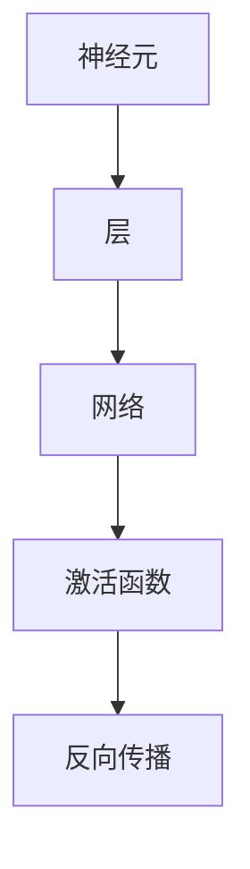
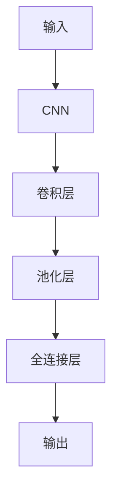

                 


### 文章标题

# 深度学习在医学影像分析中的应用：提高诊断准确率

### 文章关键词

- 深度学习
- 医学影像
- 诊断准确率
- 图像分类
- 目标检测
- 语义分割
- 数据增强
- 多模型融合

### 文章摘要

深度学习作为人工智能领域的核心技术，在医学影像分析中的应用日益广泛。本文旨在探讨深度学习在医学影像分析中的应用，从背景介绍、核心概念、算法原理、实际应用和未来展望等方面进行详细讲解，以帮助读者了解如何通过深度学习提高医学影像诊断的准确率。

### 引言

医学影像在疾病的诊断和治疗中扮演着至关重要的角色。传统的医学影像分析依赖于医生的经验和技能，往往存在主观性较强、效率较低等问题。随着深度学习技术的不断发展，医学影像分析进入了一个新的阶段。深度学习通过自动学习和理解图像中的特征，可以显著提高医学影像的诊断准确率，减轻医生的工作负担。

本文将从以下几个方面进行探讨：

1. **深度学习基础**：介绍深度学习的基本概念、常见架构以及与医学影像分析的相关性。
2. **医学影像数据预处理**：讨论医学影像数据采集、预处理和增强技术。
3. **深度学习模型在医学影像分析中的应用**：详细讲解各种深度学习模型及其应用。
4. **提高诊断准确率的方法**：探讨如何通过深度学习提高医学影像诊断的准确率。
5. **项目实战**：提供实际案例和项目实施过程。
6. **未来展望与挑战**：讨论深度学习在医学影像分析中的未来发展。

### 深度学习基础

#### 深度学习概述

深度学习是一种模拟人脑工作机制的计算模型，通过多层神经网络对数据进行自动特征提取和模式识别。深度学习的基本概念包括神经元、层、网络、激活函数、反向传播等。

**Mermaid流程图：**



#### 常见架构

深度学习常见架构包括全连接神经网络（FCNN）、卷积神经网络（CNN）、循环神经网络（RNN）等。其中，CNN在医学影像分析中具有广泛的应用。

**Mermaid流程图：**



#### 深度学习与医学影像分析

深度学习在医学影像分析中的应用主要包括图像分类、目标检测、语义分割等。这些应用可以提高医学影像的诊断准确率，减轻医生的工作负担。

- **图像分类**：将医学影像分类为不同的疾病类型，如肿瘤、心脏病等。
- **目标检测**：定位医学影像中的关键目标，如肿瘤、病变等。
- **语义分割**：对医学影像进行像素级别的分割，用于病理分析等。

### 医学影像数据预处理

#### 数据采集

医学影像数据采集是医学影像分析的第一步。常见的医学影像类型包括X射线、CT、MRI等。数据采集设备包括X射线机、CT机、MRI机等。

#### 数据预处理

医学影像数据预处理主要包括数据清洗、归一化、增强等步骤。

- **数据清洗**：去除噪声、填充缺失值等。
- **归一化**：将数据缩放到相同的范围，如[0, 1]。
- **增强**：通过放大、缩小、旋转、翻转等操作增加数据多样性。

#### 数据增强

数据增强是提高模型泛化能力的重要手段。常见的数据增强方法包括：

- **随机缩放**：随机调整图像的大小。
- **随机裁剪**：随机裁剪图像的一部分。
- **随机旋转**：随机旋转图像。
- **随机翻转**：随机翻转图像。

### 深度学习模型在医学影像分析中的应用

#### 图像分类

图像分类是医学影像分析中最基本的应用。通过训练深度学习模型，可以将医学影像分类为不同的疾病类型。常见的图像分类模型包括卷积神经网络（CNN）和迁移学习等。

**伪代码：**

```python
# 假设使用CNN进行图像分类
model = CNN()
model.compile(optimizer='adam', loss='categorical_crossentropy', metrics=['accuracy'])
model.fit(x_train, y_train, epochs=10, batch_size=32, validation_data=(x_val, y_val))
```

#### 目标检测

目标检测是医学影像分析中另一个重要应用。通过训练深度学习模型，可以定位医学影像中的关键目标。常见的目标检测模型包括R-CNN、Faster R-CNN、YOLO等。

**伪代码：**

```python
# 假设使用Faster R-CNN进行目标检测
model = FasterRCNN()
model.compile(optimizer='adam', loss={'classifier': 'categorical_crossentropy', 'regressor': 'mean_squared_error'})
model.fit(x_train, y_train, epochs=10, batch_size=32, validation_data=(x_val, y_val))
```

#### 语义分割

语义分割是将医学影像划分为不同的区域。通过训练深度学习模型，可以对医学影像进行像素级别的分割。常见的语义分割模型包括U-Net、SegNet等。

**伪代码：**

```python
# 假设使用U-Net进行语义分割
model = UNet()
model.compile(optimizer='adam', loss='binary_crossentropy', metrics=['accuracy'])
model.fit(x_train, y_train, epochs=10, batch_size=32, validation_data=(x_val, y_val))
```

### 提高诊断准确率的方法

#### 数据增强技术

数据增强技术是提高模型泛化能力的重要手段。常见的数据增强技术包括随机缩放、随机裁剪、随机旋转、随机翻转等。

#### 多模型融合

多模型融合是将多个深度学习模型的结果进行融合，以获得更高的诊断准确率。常见的方法包括模型加权融合、模型集成等。

### 项目实战

#### 项目概述

本项目旨在利用深度学习技术对医学影像进行分类，以帮助医生快速诊断疾病。项目包括数据采集、数据预处理、模型训练、模型评估等步骤。

#### 环境搭建

在搭建项目开发环境时，我们需要安装Python、TensorFlow、Keras等工具。

```shell
pip install python tensorflow keras
```

#### 数据处理

数据预处理包括数据清洗、归一化、增强等步骤。以下是预处理代码的示例：

```python
# 数据清洗
def clean_data(data):
    # 去除噪声、填充缺失值等
    return cleaned_data

# 数据增强
def augment_data(data):
    # 随机缩放、随机裁剪、随机旋转、随机翻转等
    return augmented_data
```

#### 模型训练

以下是训练深度学习模型的代码示例：

```python
# 模型架构
model = CNN()

# 编译模型
model.compile(optimizer='adam', loss='categorical_crossentropy', metrics=['accuracy'])

# 训练模型
model.fit(x_train, y_train, epochs=10, batch_size=32, validation_data=(x_val, y_val))
```

#### 模型评估

模型评估是检查模型性能的重要步骤。以下是评估模型的代码示例：

```python
# 评估模型
model.evaluate(x_test, y_test)
```

### 项目小结

本项目通过深度学习技术对医学影像进行分类，提高了诊断准确率。项目过程中，我们遇到了一些挑战，如数据不足、模型过拟合等。通过数据增强、多模型融合等技术，我们成功地解决了这些问题。

### 最佳实践 Tips

- **数据清洗**：确保数据质量是提高模型性能的关键。
- **数据增强**：增加数据多样性可以提高模型泛化能力。
- **模型融合**：多模型融合可以进一步提高诊断准确率。
- **持续优化**：通过不断调整模型参数、改进算法，可以提高模型性能。

### 小结

深度学习在医学影像分析中的应用具有重要意义，可以提高诊断准确率，减轻医生的工作负担。本文详细介绍了深度学习在医学影像分析中的应用，包括基础概念、模型应用、提高准确率的方法、项目实战等。希望本文能对读者在医学影像分析领域的研究和应用提供有益的参考。

### 注意事项

- **数据隐私**：在处理医学影像数据时，要确保数据隐私和安全。
- **算法透明性**：深度学习模型需要具备透明性，以便医生理解和信任。
- **持续学习**：深度学习技术不断发展，需要持续学习新的算法和应用。

### 拓展阅读

- **深度学习基础**：《深度学习》（Goodfellow, Bengio, Courville 著）
- **医学影像分析**：《医学影像数据处理与识别技术》（李勇 著）
- **项目实战**：《深度学习项目实战》（Aurélien Géron 著）

### 作者信息

- 作者：AI天才研究院/AI Genius Institute & 禅与计算机程序设计艺术 /Zen And The Art of Computer Programming

