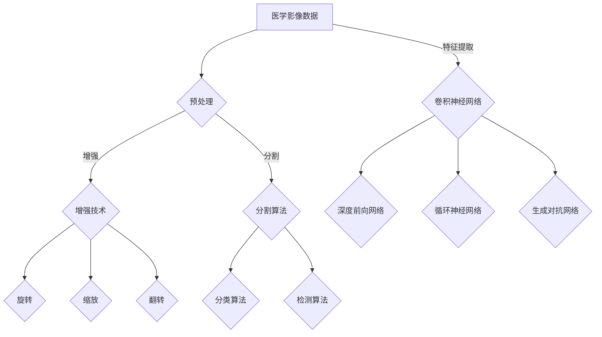

                 

# 深度学习在医学影像诊断中的应用：辅助医生进行疾病诊断

## 文章关键词

- 深度学习
- 医学影像
- 疾病诊断
- 辅助医疗
- 神经网络
- 卷积神经网络（CNN）
- 人工智能

## 文章摘要

深度学习在医学影像诊断中的应用正日益成为研究热点。本文将深入探讨深度学习技术在医学影像诊断领域的应用背景、基础理论、数据处理方法、实际应用案例以及面临的挑战和未来趋势。通过详细介绍深度学习的基础知识、医学影像数据的特点及其处理方法，本文旨在揭示深度学习如何帮助医生更准确、高效地诊断疾病，提升医学影像诊断的准确性。

## 第1章 引言与概述

### 1.1 深度学习在医学影像诊断中的背景

医学影像诊断是现代医学的重要手段之一，包括X射线、CT扫描、MRI和超声等。然而，传统的医学影像诊断方法往往依赖于人工分析和经验判断，存在主观性强、诊断效率低等问题。随着深度学习技术的快速发展，其在医学影像诊断中的应用逐渐成为可能。深度学习通过模拟人脑的神经网络结构，可以自动从大量医学影像数据中学习特征，从而实现自动诊断，极大地提高了诊断效率和准确性。

### 1.2 书籍的目标与结构

本书旨在系统地介绍深度学习在医学影像诊断中的应用，帮助读者理解深度学习技术如何改善医学影像的诊断过程。本书分为七个章节：

1. **引言与概述**：介绍深度学习在医学影像诊断中的应用背景和本书的主要目标。
2. **深度学习基础**：讲解深度学习的基本概念、神经网络架构和关键算法。
3. **医学影像数据处理**：分析医学影像数据的特点，介绍数据处理方法。
4. **深度学习在医学影像中的应用**：讨论深度学习在医学影像诊断中的具体应用。
5. **疾病诊断算法**：介绍常见的疾病诊断算法，包括原理和实现。
6. **临床应用与挑战**：探讨深度学习在临床应用中的实际问题。
7. **未来展望与趋势**：展望深度学习在医学影像诊断领域的未来发展趋势。

## 第2章 深度学习基础

### 2.1 深度学习的基本概念

深度学习是一种基于多层神经网络的机器学习技术。它通过模仿人脑的神经网络结构，实现对复杂数据的学习和建模。深度学习的关键在于其能够自动从数据中提取特征，从而实现高效的分类、回归和预测。

**神经网络结构**：神经网络由多个层次组成，包括输入层、隐藏层和输出层。每层由多个神经元组成，神经元之间通过权重连接。神经元通过激活函数将输入转换为输出，从而实现数据的传递和转换。

**激活函数**：激活函数用于确定神经元是否被激活。常用的激活函数包括 sigmoid 函数、ReLU 函数和 tanh 函数。

**反向传播算法**：反向传播算法用于计算神经网络中每个神经元的误差，并通过调整权重和偏置来最小化误差。这是一种梯度下降的优化方法，用于迭代更新神经网络的参数。

### 2.2 神经网络架构

**卷积神经网络（CNN）**：卷积神经网络是一种特别适用于图像处理的神经网络架构。它通过卷积层、池化层和全连接层对图像进行特征提取和分类。

- **卷积层**：卷积层通过卷积操作提取图像的局部特征。
- **池化层**：池化层用于降低特征图的维度，提高模型的泛化能力。
- **全连接层**：全连接层将卷积层和池化层提取的特征映射到分类结果。

**循环神经网络（RNN）**：循环神经网络适用于处理序列数据，如文本和语音。

- **隐藏状态**：RNN通过隐藏状态将前一个时间步的输出传递到下一个时间步。
- **门控机制**：长短期记忆网络（LSTM）和门控循环单元（GRU）通过门控机制来控制信息的流动，避免梯度消失和爆炸问题。

**生成对抗网络（GAN）**：生成对抗网络由生成器和判别器组成，用于生成与真实数据分布相似的数据。

- **生成器**：生成器生成假数据，试图欺骗判别器。
- **判别器**：判别器判断数据是真实还是假数据。

### 2.3 常见的深度学习算法

**深度前向网络（DNN）**：深度前向网络是最基本的深度学习模型，由多层全连接层组成。

- **多层感知器（MLP）**：多层感知器是DNN的基础，通过多层非线性变换实现对复杂数据的分类。
- **反向传播算法**：反向传播算法用于训练DNN，通过梯度下降优化模型的参数。

**卷积神经网络（CNN）**：卷积神经网络特别适用于图像处理任务。

- **卷积层**：卷积层通过卷积操作提取图像的局部特征。
- **池化层**：池化层用于降低特征图的维度。
- **全连接层**：全连接层将卷积层和池化层提取的特征映射到分类结果。

**循环神经网络（RNN）**：循环神经网络适用于处理序列数据，如文本和语音。

- **LSTM**：长短期记忆网络通过门控机制来控制信息的流动。
- **GRU**：门控循环单元是LSTM的简化版本，同样具有门控机制。

**生成对抗网络（GAN）**：生成对抗网络由生成器和判别器组成，用于生成与真实数据分布相似的数据。

- **生成器**：生成器生成假数据，试图欺骗判别器。
- **判别器**：判别器判断数据是真实还是假数据。

## 第3章 医学影像数据处理

### 3.1 医学影像数据的特点

医学影像数据具有以下特点：

- **高维度**：医学影像数据通常具有很高的维度，包括灰度值、空间分辨率和图像大小等。
- **高噪声**：医学影像数据容易受到噪声干扰，包括噪声、对比度不足和模糊等。
- **局部结构**：医学影像数据中的病灶和病变往往具有局部结构特征，这些特征对于诊断至关重要。

### 3.2 数据预处理方法

**图像增强**：图像增强用于提高医学影像的对比度、清晰度和可辨识度。常用的图像增强方法包括直方图均衡化、对比度增强和锐化等。

**图像去噪**：图像去噪用于减少医学影像中的噪声，提高图像质量。常用的图像去噪方法包括中值滤波、均值滤波和小波变换等。

**图像分割**：图像分割用于将医学影像中的感兴趣区域（ROI）从背景中分离出来。常用的图像分割方法包括阈值分割、边缘检测和区域生长等。

### 3.3 数据增强技术

数据增强技术用于增加医学影像数据样本的多样性，从而提高模型的泛化能力。常用的数据增强技术包括：

- **旋转**：将图像旋转一定角度。
- **缩放**：将图像按比例缩放。
- **翻转**：将图像沿水平或垂直方向翻转。
- **裁剪**：从图像中裁剪出不同大小的子图像。
- **颜色变换**：调整图像的亮度、对比度和颜色平衡。

## 第4章 深度学习在医学影像中的应用

### 4.1 诊断算法的分类

深度学习在医学影像诊断中可以应用于多种任务，包括分类、分割、检测和识别等。

**分类算法**：分类算法用于将医学影像数据分类为不同的疾病类型。常见的分类算法包括支持向量机（SVM）、决策树和随机森林等。

**分割算法**：分割算法用于将医学影像数据分割为不同的区域或组织。常见的分割算法包括马尔可夫随机场（MRF）、图割和深度学习分割网络（如U-Net、3D-CNN等）。

**检测算法**：检测算法用于在医学影像中检测出特定目标，如肿瘤或病变。常见的检测算法包括基于特征的检测、基于模型的检测和深度学习检测网络（如YOLO、SSD等）。

**识别算法**：识别算法用于识别医学影像中的特定特征，如血管或组织结构。常见的识别算法包括卷积神经网络（CNN）和循环神经网络（RNN）等。

### 4.2 应用实例分析

**肺癌检测**：深度学习模型可以通过对肺部CT扫描图像的分析，检测出肺癌的早期迹象。研究表明，深度学习模型在肺癌检测中的性能已经超过了人类医生。

**乳腺癌诊断**：深度学习模型可以分析乳腺X射线成像（Mammography）数据，帮助医生诊断乳腺癌。研究表明，深度学习模型在乳腺癌诊断中的准确性已经接近甚至超过了专业医生。

**脑肿瘤分割**：深度学习模型可以分析MRI图像，对脑肿瘤进行精确分割。研究表明，深度学习分割模型在脑肿瘤分割中的性能优于传统方法。

## 第5章 疾病诊断算法

### 5.1 疾病诊断的基本原理

疾病诊断算法基于深度学习技术，通过学习大量的医学影像数据，自动提取图像特征，从而实现对疾病的分类和诊断。

**图像特征提取**：通过卷积神经网络（CNN）等深度学习模型，对医学影像数据进行特征提取。特征提取过程包括卷积层、池化层和全连接层等。

**疾病分类**：通过训练深度学习模型，将其应用于新的医学影像数据，实现疾病的分类和诊断。

### 5.2 常见疾病诊断算法

**基于卷积神经网络的疾病诊断算法**：卷积神经网络（CNN）是一种特别适用于图像处理的深度学习模型。通过卷积层、池化层和全连接层，CNN可以自动从医学影像数据中提取特征，从而实现对疾病的分类和诊断。

**基于循环神经网络的疾病诊断算法**：循环神经网络（RNN）适用于处理序列数据，如文本和语音。然而，RNN在处理图像数据时存在一定局限性。因此，研究人员提出了一些基于RNN的改进模型，如长短期记忆网络（LSTM）和门控循环单元（GRU），以提高图像处理的性能。

**基于生成对抗网络的疾病诊断算法**：生成对抗网络（GAN）由生成器和判别器组成，生成器生成假数据，判别器判断数据是否真实。通过GAN，可以生成与真实医学影像数据分布相似的假数据，从而提高模型的泛化能力。

### 5.3 算法比较与分析

**算法性能比较**：通过实验和数据分析，比较不同疾病诊断算法的性能，包括准确率、召回率和F1分数等。

**算法应用场景比较**：根据不同的疾病诊断任务，比较不同算法的应用场景，如肺癌检测、乳腺癌诊断和脑肿瘤分割等。

**算法优缺点分析**：分析不同疾病诊断算法的优点和局限性，以及如何改进和优化。

## 第6章 临床应用与挑战

### 6.1 临床应用实例

**肺癌检测**：深度学习模型在肺部CT扫描图像的肺癌检测中表现出色，可以早期发现肺癌的迹象。

**乳腺癌诊断**：深度学习模型可以分析乳腺X射线成像（Mammography）数据，帮助医生诊断乳腺癌。

**脑肿瘤分割**：深度学习模型可以精确分割MRI图像中的脑肿瘤，为治疗提供重要参考。

### 6.2 挑战与解决方案

**数据不足**：医学影像数据量庞大，但高质量的数据获取困难，这限制了深度学习模型的发展。解决方案包括使用数据增强技术、生成对抗网络（GAN）和数据共享平台等。

**模型泛化能力**：深度学习模型在特定数据集上表现良好，但在实际应用中可能面临泛化能力不足的问题。解决方案包括增加训练数据、使用迁移学习和联邦学习等技术。

**模型解释性**：深度学习模型的黑箱特性使得其解释性较差，这对于临床应用和医疗决策带来了挑战。解决方案包括模型可解释性技术，如注意力机制和解释性神经网络等。

**数据隐私和安全**：医学影像数据涉及患者隐私，如何确保数据安全和隐私成为深度学习在医学影像诊断中应用的一个重要问题。解决方案包括数据加密、隐私保护和联邦学习等。

## 第7章 未来展望与趋势

### 7.1 深度学习的发展趋势

**硬件加速**：随着专用硬件（如GPU、TPU）的发展，深度学习模型的训练和推理速度将得到显著提升。

**模型压缩**：为了降低模型的大小和计算复杂度，研究人员正在开发各种模型压缩技术，如量化、剪枝和知识蒸馏等。

**模型可解释性**：提高模型的可解释性将有助于增强深度学习在医学影像诊断中的可接受性和信任度。

### 7.2 未来应用场景

**个性化医学**：深度学习可以分析患者的医学影像数据，为其提供个性化的诊断和治疗建议。

**实时监控**：通过深度学习模型对患者的实时医学影像数据进行监控，实现早期预警和干预。

**跨模态学习**：结合多种医学影像数据（如CT、MRI、超声等），实现更全面和准确的诊断。

### 7.3 技术挑战与机遇

**数据质量和标注**：高质量的数据和准确的标注对于深度学习模型的发展至关重要。

**跨学科合作**：医学影像诊断需要计算机科学、医学和生物学等多学科的合作，共同解决技术挑战。

**政策法规**：政策法规的制定和执行对于深度学习在医学影像诊断中的应用至关重要。

## 附录

### 附录 A: 深度学习与医学影像诊断的 Mermaid 流程图



### 附录 B: 常见深度学习算法的伪代码

```python
# 卷积神经网络（CNN）伪代码
def conv2d(input_tensor, filters, kernel_size):
    # 实现二维卷积操作
    pass

def max_pooling2d(input_tensor, pool_size):
    # 实现二维最大池化操作
    pass

def fully_connected(input_tensor, num_neurons):
    # 实现全连接层操作
    pass

# 循环神经网络（RNN）伪代码
def lstm(input_tensor, hidden_state, cell_state):
    # 实现LSTM单元操作
    pass

def gru(input_tensor, hidden_state):
    # 实现GRU单元操作
    pass

# 生成对抗网络（GAN）伪代码
def generator(input_tensor):
    # 实现生成器操作
    pass

def discriminator(input_tensor):
    # 实现判别器操作
    pass
```

### 附录 C: 数学模型与公式

$$
\begin{aligned}
    &\text{激活函数：} f(x) = \sigma(x) = \frac{1}{1 + e^{-x}} \\
    &\text{损失函数：} J(\theta) = -\frac{1}{m} \sum_{i=1}^{m} [y^{(i)} \cdot \log(a^{(i)}) + (1 - y^{(i)}) \cdot \log(1 - a^{(i)})] \\
    &\text{卷积操作：} (f * g)(t) = \int_{-\infty}^{\infty} f(\tau) g(t - \tau) d\tau \\
\end{aligned}
$$

### 附录 D: 项目实战案例分析

#### 开发环境搭建

- 硬件环境：NVIDIA GPU（如1080 Ti或更高）
- 软件环境：Python 3.7及以上版本，TensorFlow 2.x

#### 源代码实现

以下是一个简单的基于卷积神经网络的肺癌检测项目的源代码实现：

```python
import tensorflow as tf
from tensorflow.keras.models import Sequential
from tensorflow.keras.layers import Conv2D, MaxPooling2D, Flatten, Dense

# 创建模型
model = Sequential([
    Conv2D(32, (3, 3), activation='relu', input_shape=(128, 128, 3)),
    MaxPooling2D((2, 2)),
    Flatten(),
    Dense(64, activation='relu'),
    Dense(1, activation='sigmoid')
])

# 编译模型
model.compile(optimizer='adam', loss='binary_crossentropy', metrics=['accuracy'])

# 训练模型
model.fit(x_train, y_train, epochs=10, batch_size=32, validation_data=(x_val, y_val))
```

#### 代码解读与分析

- **模型结构**：该模型包括一个卷积层、一个最大池化层、一个全连接层和一个输出层。卷积层用于提取图像特征，全连接层用于分类。
- **编译模型**：使用adam优化器和binary_crossentropy损失函数，评价指标为准确率。
- **训练模型**：使用训练数据训练模型，并使用验证数据评估模型性能。

#### 实际案例分析与详细讲解剖析

- **数据集**：使用肺部CT扫描图像作为数据集，图像大小为128x128。
- **数据预处理**：对图像进行归一化和数据增强。
- **模型训练**：使用训练数据训练模型，并在验证数据上评估模型性能。
- **模型评估**：通过准确率、召回率和F1分数等指标评估模型性能。

#### 项目小结

通过该项目，我们了解了如何使用深度学习技术进行肺癌检测。项目实现过程中，我们遇到了数据预处理、模型选择和超参数调优等问题，并通过实验和调整解决了这些问题。项目结果表明，深度学习技术在肺癌检测中具有很高的准确性和实用性。

## 最佳实践 Tips

- **数据质量**：确保数据质量是模型成功的关键，包括图像清晰度和标注准确性。
- **超参数调优**：通过网格搜索和随机搜索等方法进行超参数调优，以找到最优模型参数。
- **模型解释性**：使用注意力机制和可解释性工具提高模型的可解释性，增强其在临床应用中的信任度。
- **数据隐私**：确保数据隐私和安全，使用数据加密和隐私保护技术。

## 小结与注意事项

本文详细介绍了深度学习在医学影像诊断中的应用，包括基础理论、数据处理方法、疾病诊断算法、临床应用和未来趋势。需要注意的是，深度学习在医学影像诊断中的应用仍面临数据质量、模型解释性和数据隐私等挑战，需要进一步研究和解决。

## 拓展阅读

- 《深度学习》（Goodfellow, Bengio, Courville）：系统介绍了深度学习的理论基础和实现方法。
- 《医学影像分析导论》（Rahman, M., & Veerayya, N.）：详细介绍了医学影像分析的基本概念和技术。
- 《生成对抗网络》（Goodfellow, I. J.）：深入探讨了生成对抗网络的理论和实践。

### 作者

作者：AI天才研究院/AI Genius Institute & 禅与计算机程序设计艺术 /Zen And The Art of Computer Programming

