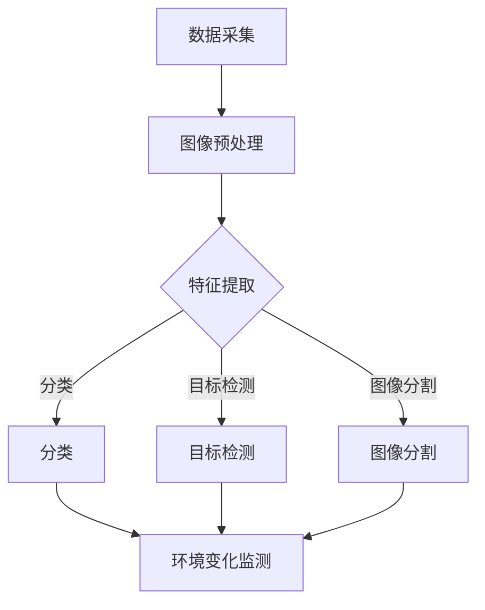
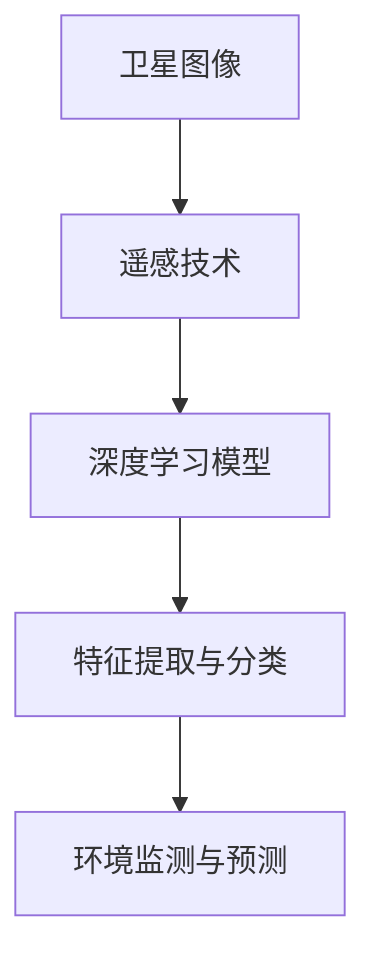
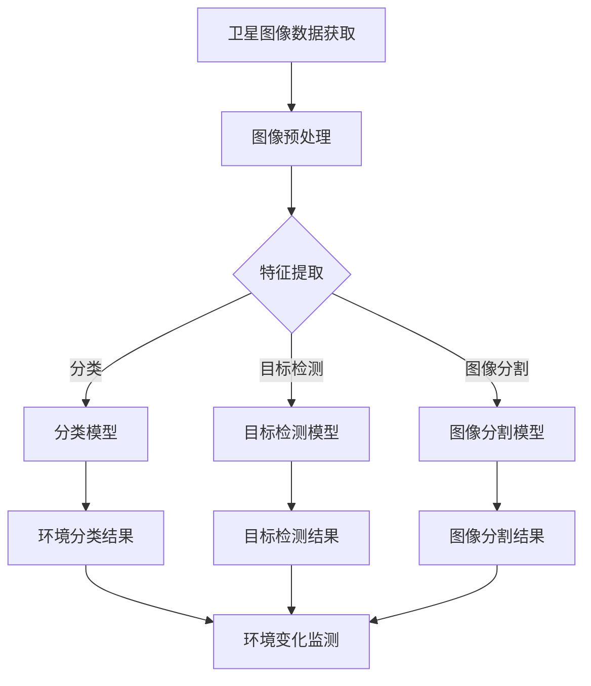

                 


## 文章标题：深度学习在卫星图像分析中的应用：监测全球环境变化

### 文章关键词：深度学习，卫星图像分析，环境变化，监测

### 文章摘要：

随着全球环境的变化日益显著，对环境变化的实时监测成为了一个重要课题。卫星图像提供了广阔的视野和丰富的数据，使得通过分析卫星图像来监测全球环境变化成为可能。深度学习作为一种强大的机器学习技术，已经在图像分析领域取得了显著成果。本文将探讨深度学习在卫星图像分析中的应用，特别是在监测全球环境变化方面的潜力。首先，我们将介绍深度学习的基础知识，包括其核心概念、常用框架和数据处理方法。接着，我们将讨论卫星图像的基本特性、数据获取和处理技术。然后，我们将深入分析深度学习在卫星图像分析中的核心算法，并详细讲解其数学模型与公式。在此基础上，我们将通过实际案例研究，展示深度学习在监测全球环境变化中的应用。最后，我们将探讨全球环境变化监测的未来趋势与挑战，并提出最佳实践建议。

----------------------------------------------------------------

## 引言

### 背景介绍

随着人类活动的不断加剧，全球环境变化已经成为一个不容忽视的问题。气候变化、森林砍伐、土地退化、水体污染等环境问题对生态系统和社会经济产生了深远的影响。为了应对这些挑战，全球各国纷纷加强了环境保护和监测工作的力度。然而，传统的监测方法往往受限于时间和空间的限制，难以实现全面、及时的监测。随着遥感技术的不断发展，卫星图像成为了环境监测的重要数据来源。

卫星图像具有覆盖范围广、时间连续性强、空间分辨率高、多波段信息丰富等特点，可以提供大范围、高分辨率的地理信息数据。这些数据对于监测全球环境变化具有重要意义，可以帮助科学家们更好地了解生态系统的变化趋势，评估人类活动对环境的影响，制定有效的环境保护和应对策略。

### 深度学习的发展与应用

深度学习是一种基于人工神经网络的学习方法，通过多层神经网络的结构来模拟人脑的决策过程，从而实现复杂模式识别和特征提取。自2012年深度学习在图像识别领域取得突破性进展以来，其应用范围迅速扩展到语音识别、自然语言处理、推荐系统等多个领域。

在图像分析领域，深度学习已经成为一种重要的技术手段。通过深度学习模型，可以自动提取图像中的关键特征，实现图像分类、目标检测、图像分割等任务。尤其是在卫星图像分析中，深度学习可以有效地处理大规模、高维度的数据，提高环境监测的准确性和效率。

### 深度学习在卫星图像分析中的应用前景

深度学习在卫星图像分析中的应用具有广阔的前景。一方面，深度学习模型可以自动提取卫星图像中的有用信息，实现对环境的实时监测。例如，通过卫星图像分析，可以实时监测森林火灾、土地退化、水体污染等问题。另一方面，深度学习可以结合其他数据源，如气象数据、社会经济数据等，实现对环境变化的综合分析和预测。

此外，随着深度学习技术的不断发展，其计算效率和模型性能不断提升，使得深度学习在卫星图像分析中的应用变得更加可行。未来，深度学习有望在环境监测领域发挥更大的作用，为全球环境保护和可持续发展提供有力支持。

### 核心概念与联系

为了更好地理解深度学习在卫星图像分析中的应用，我们需要先了解一些核心概念。首先，深度学习是一种基于多层神经网络的机器学习技术，通过前向传播和反向传播算法，从大量数据中自动学习特征表示。其次，卫星图像分析涉及图像预处理、特征提取、分类和目标检测等技术。最后，全球环境变化监测需要结合遥感数据、地理信息系统和深度学习技术，实现对环境变化的实时监测和预测。

这些核心概念之间存在紧密的联系。深度学习模型通过学习卫星图像中的特征，可以实现对环境变化的识别和预测。同时，卫星图像分析技术为深度学习提供了丰富的数据资源，使得深度学习模型可以更好地训练和优化。而全球环境变化监测则依赖于深度学习模型的高效运算能力和准确预测能力，从而实现对环境变化的全面监测和预警。

### Mermaid 流程图

以下是一个简单的 Mermaid 流程图，展示深度学习在卫星图像分析中的应用流程：



这个流程图展示了从数据采集到环境变化监测的整个过程，其中特征提取是核心环节，分类、目标检测和图像分割是具体应用，最终实现对环境变化的监测和预测。

----------------------------------------------------------------

## 第一部分：深度学习基础

### 2.1 深度学习的基本原理

深度学习是一种基于多层神经网络的机器学习技术，通过多层神经网络的结构来模拟人脑的决策过程，从而实现复杂模式识别和特征提取。深度学习的核心思想是通过神经网络从大量数据中自动学习特征表示，从而提高模型的预测能力和泛化能力。

#### 2.1.1 神经网络基础

神经网络是一种模拟人脑神经元连接结构的计算模型，其基本单元是神经元。每个神经元接收来自其他神经元的输入，通过加权求和后，经过激活函数处理，产生输出。一个简单的神经网络通常包括输入层、隐藏层和输出层。

- **输入层**：接收外部输入数据，并将其传递给隐藏层。
- **隐藏层**：通过非线性变换对输入数据进行特征提取和变换。
- **输出层**：产生最终的输出结果。

神经网络中的每个连接都有一定的权重，这些权重通过学习过程进行优化，以使神经网络能够准确预测目标变量。

#### 2.1.2 深度学习架构

深度学习通常采用多层神经网络结构，其中包含多个隐藏层。这种多层结构使得神经网络能够处理更复杂的数据和任务。深度学习模型的基本架构包括以下几个部分：

1. **卷积层（Convolutional Layer）**：用于提取图像的特征。卷积层通过卷积运算从输入图像中提取局部特征，并通过权重共享技术减少参数数量。
2. **池化层（Pooling Layer）**：用于降低特征图的维度，减少计算量，并提高模型的泛化能力。常见的池化方法有最大池化和平均池化。
3. **全连接层（Fully Connected Layer）**：将卷积层和池化层提取的特征进行整合，形成一个全局特征表示。
4. **激活函数（Activation Function）**：用于引入非线性变换，使得神经网络能够处理非线性问题。常见的激活函数有Sigmoid、ReLU和Tanh等。

#### 2.1.3 学习算法

深度学习模型的学习过程主要包括前向传播和反向传播两个步骤。

- **前向传播（Forward Propagation）**：将输入数据通过神经网络层传递，计算出每层的输出结果，直到输出层得到最终预测值。
- **反向传播（Backpropagation）**：根据预测值与实际值之间的误差，逆向传播误差信息，通过梯度下降算法更新网络的权重和偏置，以减少误差。

反向传播算法是深度学习模型训练的核心，通过不断迭代优化，使神经网络能够准确预测目标变量。

### 2.2 深度学习框架

深度学习框架是一组软件库和工具，用于实现和部署深度学习模型。常见的深度学习框架包括TensorFlow、PyTorch、Keras等。

- **TensorFlow**：由谷歌开发，是一个开源的深度学习框架，具有丰富的功能和良好的性能。TensorFlow使用数据流图（Dataflow Graph）来描述计算过程，通过定义计算图来构建和训练深度学习模型。
- **PyTorch**：由Facebook开发，是一个基于Python的开源深度学习框架，以其动态计算图（Dynamic Computation Graph）和易于调试的特点受到许多研究者的青睐。PyTorch使用动态计算图，使得模型设计和调试更加灵活。
- **Keras**：是一个高层次的深度学习框架，旨在简化深度学习模型的构建和训练过程。Keras兼容TensorFlow和PyTorch，使用Python编写，使得深度学习模型的开发变得更加高效。

这些深度学习框架提供了丰富的API和工具，使得开发者可以轻松构建和训练深度学习模型，并部署到不同的平台上。

### 2.3 数据预处理

数据预处理是深度学习模型训练的重要步骤，包括数据清洗、数据增强和数据标准化等。

- **数据清洗**：去除数据中的噪声和异常值，保证数据的准确性和一致性。
- **数据增强**：通过图像旋转、缩放、裁剪、颜色变换等操作，增加数据的多样性和丰富性，提高模型的泛化能力。
- **数据标准化**：将数据缩放到一个统一的范围，例如将像素值缩放到[0, 1]之间，以减少数据分布的差异，提高模型的训练效果。

通过有效的数据预处理，可以显著提高深度学习模型的训练效率和性能。

----------------------------------------------------------------

### 2.4 第一部分小结

在本部分中，我们介绍了深度学习的基础知识，包括神经网络的基本原理、深度学习架构、学习算法和深度学习框架。通过理解这些核心概念，我们可以为后续的卫星图像分析打下坚实的基础。在下一部分，我们将探讨卫星图像的基本特性、数据获取和处理技术，为深度学习在卫星图像分析中的应用做好准备。

----------------------------------------------------------------

### 背景介绍

卫星图像在监测全球环境变化方面具有独特的优势。首先，卫星图像可以提供大范围、高分辨率的地理信息数据，使得科学家们能够从宏观角度观察和了解地球环境的变化。其次，卫星图像具有时间连续性，可以通过定期观测获取长时间序列的数据，从而捕捉环境变化的动态过程。此外，卫星图像的多波段特性使其能够捕捉不同类型的地球物理特征，如植被覆盖、水体分布、温度变化等。

随着深度学习技术的发展，卫星图像分析逐渐成为环境监测领域的一个重要研究方向。深度学习模型具有强大的特征提取和模式识别能力，可以自动从卫星图像中提取有价值的信息，实现对全球环境变化的实时监测和预测。例如，深度学习可以用于监测森林火灾、土地退化、冰川融化等环境问题，提供科学依据，支持环境保护和决策。

深度学习在卫星图像分析中的应用，不仅提高了环境监测的准确性和效率，还拓展了遥感技术的应用范围。通过结合深度学习和卫星图像分析，我们可以更好地了解地球环境的演变规律，为应对全球气候变化等重大挑战提供有力支持。因此，深入探讨深度学习在卫星图像分析中的应用具有重要意义。

### 核心概念与联系

为了更好地理解深度学习在卫星图像分析中的应用，我们需要首先明确一些核心概念，并分析它们之间的关系。

**卫星图像**：卫星图像是通过卫星传感器获取的地球表面的图像。这些图像可以包含不同类型的信息，如可见光、红外、多光谱等，从而提供丰富的地理信息数据。

**深度学习**：深度学习是一种基于多层神经网络的学习方法，通过训练模型来自动提取和分类图像中的特征。它能够处理大规模、高维度的数据，并实现高精度的模式识别和特征提取。

**遥感**：遥感是一种通过从远距离获取地球表面信息的技术。卫星遥感作为遥感的一种形式，利用卫星传感器获取卫星图像，为地球科学研究提供重要数据源。

这三个核心概念之间存在紧密的联系。卫星图像是遥感技术的产物，而深度学习则可以用于分析这些图像，提取有用的信息。具体来说：

1. **卫星图像**是遥感技术的核心数据来源，提供了关于地球表面的详细信息。
2. **深度学习**通过构建神经网络模型，可以自动从卫星图像中提取特征，实现图像分类、目标检测等任务。
3. **遥感**结合了卫星图像和深度学习技术，实现了对环境变化的实时监测和预测。

以下是一个简化的 Mermaid 流程图，展示这三个概念之间的联系：



通过这个流程图，我们可以看到，卫星图像通过遥感技术获取，然后使用深度学习模型进行分析，最终实现对环境变化的监测和预测。

### Mermaid 流程图

以下是一个更详细的 Mermaid 流程图，展示深度学习在卫星图像分析中的应用流程：



在这个流程图中，卫星图像数据通过遥感技术获取，然后经过预处理和特征提取。接着，使用深度学习模型进行分类、目标检测和图像分割，得到相应的结果。最后，这些结果用于环境变化监测，实现对全球环境的实时监测和预测。

通过这个流程图，我们可以清晰地看到深度学习在卫星图像分析中的应用流程，以及各个步骤之间的联系。

----------------------------------------------------------------

## 第二部分：卫星图像处理

### 3.1 卫星图像的基本特性

卫星图像是遥感技术的重要组成部分，通过卫星传感器获取地球表面的图像数据。卫星图像具有以下基本特性：

1. **空间分辨率**：空间分辨率是指图像中能区分的最小细节尺寸。高空间分辨率图像可以提供更详细的地理信息，而低空间分辨率图像则更注重整体视野。

2. **时间分辨率**：时间分辨率是指卫星图像获取的时间间隔。高时间分辨率图像可以捕捉到地球表面的动态变化，而低时间分辨率图像则更适合用于长期趋势分析。

3. **光谱分辨率**：光谱分辨率是指图像中包含的光谱波段数量。多光谱和超光谱图像能够捕捉不同波长范围内的信息，从而提供更丰富的地理信息。

4. **地理定位信息**：卫星图像通常包含地理定位信息，如经纬度坐标、海拔高度等，这些信息对于图像的分析和应用至关重要。

### 3.2 卫星图像数据获取

卫星图像数据的获取主要通过卫星传感器实现。卫星传感器可以分为以下几类：

1. **光学传感器**：包括可见光、多光谱和超光谱传感器，用于获取地球表面的反射光信息。

2. **红外传感器**：包括热红外和短波红外传感器，用于获取地球表面的辐射信息。

3. **雷达传感器**：通过发射和接收微波信号，获取地球表面的反射信息，适合在云层覆盖或夜间条件下使用。

卫星图像的获取过程通常包括以下步骤：

1. **卫星轨道设计**：根据监测需求，设计卫星的轨道参数，如轨道高度、倾角、周期等。

2. **传感器选择**：根据监测任务，选择合适的传感器类型和光谱波段。

3. **图像采集**：卫星在预定轨道上运行时，传感器采集地球表面的图像数据。

4. **数据传输**：卫星将采集到的图像数据通过无线传输方式发送到地面站。

5. **数据处理**：在地面站对图像数据进行预处理、校正和存储，以便后续分析。

### 3.3 卫星图像处理算法

卫星图像处理算法是用于增强、分析和提取卫星图像中信息的一系列技术方法。常见的卫星图像处理算法包括：

1. **图像增强**：通过调整图像的亮度、对比度、色彩等参数，提高图像的可视化效果，使目标信息更加突出。

2. **图像去噪**：去除图像中的噪声，提高图像的清晰度。

3. **图像分割**：将图像划分为不同的区域或对象，便于后续分析和识别。

4. **图像分类**：将图像中的每个像素或区域分类为不同的类别，如植被、水体、建筑等。

5. **目标检测**：在图像中识别和定位特定的目标对象，如建筑物、道路、船只等。

常见的卫星图像处理算法包括：

1. **直方图均衡化**：通过调整图像的灰度分布，提高图像的对比度。

2. **中值滤波**：通过取像素值的中值来去除噪声。

3. **Canny边缘检测**：用于检测图像中的边缘信息。

4. **区域增长法**：用于图像分割，通过逐像素比较，将相邻像素合并成同一区域。

5. **支持向量机（SVM）**：用于图像分类，通过最大化分类间隔来分类图像。

通过这些算法，卫星图像处理可以显著提高图像的质量和可分析性，为后续的环境监测和预测提供可靠的数据支持。

----------------------------------------------------------------

### 3.4 第二部分小结

在本部分中，我们深入探讨了卫星图像的基本特性、数据获取方法以及处理算法。通过了解这些内容，我们能够更好地理解卫星图像在环境监测中的重要性，并为后续的深度学习应用打下坚实基础。在下一部分，我们将介绍深度学习在卫星图像分析中的核心算法，并详细讲解其原理和实现方法。敬请期待！

----------------------------------------------------------------

## 第三部分：深度学习在卫星图像分析中的应用

### 4.1 核心算法原理讲解

深度学习在卫星图像分析中的应用，主要体现在图像分类、目标检测和图像分割等任务上。以下我们将分别介绍这些核心算法的原理，并通过伪代码和数学模型进行详细讲解。

#### 4.1.1 图像分类

图像分类是指将卫星图像中的每个像素或区域分类为不同的类别，如植被、水体、建筑等。常用的深度学习模型包括卷积神经网络（CNN）和循环神经网络（RNN）。

**CNN原理：**

CNN是一种基于卷积操作的神经网络，可以自动提取图像的特征。其基本架构包括卷积层、池化层和全连接层。

- **卷积层**：通过卷积操作提取图像的局部特征。
- **池化层**：用于降低特征图的维度，增强模型的泛化能力。
- **全连接层**：将卷积层和池化层提取的特征进行整合，进行分类。

**伪代码：**

```python
# CNN 图像分类伪代码
def cnn_image_classification(image):
    # 输入图像
    x = preprocess_image(image)
    # 卷积层
    x = conv2d(x, filter_size=(3, 3), padding='same')
    x = activation(x, 'ReLU')
    x = max_pool2d(x, pool_size=(2, 2))
    # 全连接层
    x = flatten(x)
    x = fully_connected(x, num_classes)
    # 输出分类结果
    return softmax(x)
```

**数学模型：**

- **卷积层**：\(h_{ij}^{(l)} = \sum_{i'}\sum_{j'} w_{i'j'iuj'} h_{i'j'}^{(l-1)} + b_{ij}^{(l)}\)
- **激活函数**：\(a_{ij}^{(l)} = \max(0, h_{ij}^{(l)})\)
- **池化层**：\(p_{ij}^{(l)} = \max_{k,l'} h_{kll'}^{(l)}\)
- **全连接层**：\(z_j^{(L)} = \sum_{i} w_{ij}^{(L)} a_{ij}^{(L-1)} + b_j^{(L)}\)
- **softmax**：\(P(y=i) = \frac{e^{z_i}}{\sum_{j} e^{z_j}}\)

#### 4.1.2 目标检测

目标检测是指从卫星图像中识别和定位特定的目标对象，如建筑物、道路、船只等。常用的深度学习模型包括区域生成网络（R-CNN）和基于特征金字塔网络（FPN）的方法。

**R-CNN原理：**

R-CNN是一种基于区域提议和分类的深度学习目标检测模型。其基本步骤包括：

1. **区域提议**：使用选择性搜索算法生成图像中的区域提议。
2. **特征提取**：对每个区域提议使用卷积神经网络提取特征。
3. **分类**：使用支持向量机（SVM）对特征进行分类。

**伪代码：**

```python
# R-CNN 目标检测伪代码
def rfcn_image_detection(image):
    # 输入图像
    regions = generate_regions(image)
    # 特征提取
    features = extract_features(image, regions)
    # 分类
    classes = svm_predict(features)
    # 输出检测结果
    return regions, classes
```

**数学模型：**

- **区域提议**：\(r = \text{selective_search}(image)\)
- **特征提取**：\(f(r) = \text{cnn}(r)\)
- **分类**：\(c = \text{svm}(f(r))\)

#### 4.1.3 图像分割

图像分割是指将卫星图像划分为不同的区域或对象。常用的深度学习模型包括全卷积网络（FCN）和生成对抗网络（GAN）。

**FCN原理：**

FCN是一种基于卷积操作的神经网络，可以将输入图像直接映射到分割结果。其基本架构包括卷积层、上采样层和全连接层。

- **卷积层**：用于提取图像的特征。
- **上采样层**：用于将特征图的上采样到原始图像的尺寸。
- **全连接层**：将上采样后的特征图映射到分割结果。

**伪代码：**

```python
# FCN 图像分割伪代码
def fcn_image_segmentation(image):
    # 输入图像
    x = preprocess_image(image)
    # 卷积层
    x = conv2d(x, filter_size=(3, 3), padding='same')
    x = activation(x, 'ReLU')
    # 上采样层
    x = up_sample(x, scale_factor=2)
    # 全连接层
    x = fully_connected(x, num_classes)
    # 输出分割结果
    return softmax(x)
```

**数学模型：**

- **卷积层**：\(h_{ij}^{(l)} = \sum_{i'}\sum_{j'} w_{i'j'iuj'} h_{i'j'}^{(l-1)} + b_{ij}^{(l)}\)
- **激活函数**：\(a_{ij}^{(l)} = \max(0, h_{ij}^{(l)})\)
- **上采样层**：\(p_{ij}^{(l)} = \text{upsample}_{2\times2}(h_{ij}^{(l-1)})\)
- **全连接层**：\(z_j^{(L)} = \sum_{i} w_{ij}^{(L)} a_{ij}^{(L-1)} + b_j^{(L)}\)
- **softmax**：\(P(y=i) = \frac{e^{z_i}}{\sum_{j} e^{z_j}}\)

#### 4.1.4 GAN原理

生成对抗网络（GAN）是一种基于博弈论的深度学习模型，通过生成器和判别器的对抗训练，实现数据的生成和分布匹配。

- **生成器**：\(G\)：用于生成与真实数据相似的图像。
- **判别器**：\(D\)：用于判断输入数据是真实数据还是生成数据。

**伪代码：**

```python
# GAN 生成对抗网络伪代码
def gan_image_generation(image):
    # 生成器
    generated_image = generator(image)
    # 判别器
    real_label =判别器(真实图像)
    fake_label =判别器(生成图像)
    # 训练
    generator_loss = loss(D(fake_label), 1)
    discriminator_loss = loss(D(real_label), 1) + loss(D(fake_label), 0)
    # 输出生成图像
    return generated_image
```

**数学模型：**

- **生成器**：\(G(z) = x\)
- **判别器**：\(D(x) = P(x \text{为真实数据})\)
- **损失函数**：\(L_G = -\log D(G(z))\)
- \(L_D = -\log D(x) - \log(1 - D(G(z))\)

通过以上核心算法的原理讲解，我们可以看到深度学习在卫星图像分析中的应用是如何实现的。接下来，我们将通过实际案例研究，进一步展示深度学习在监测全球环境变化中的应用。

----------------------------------------------------------------

### 4.2 数学模型与公式

在深度学习应用于卫星图像分析时，理解并应用相关的数学模型和公式对于构建和优化模型至关重要。以下，我们将详细讲解深度学习中涉及的一些关键数学模型和公式，并通过具体示例进行解释。

#### 4.2.1 损失函数

损失函数是评估模型预测值与实际值之间差异的关键工具，它指导模型的优化过程。在深度学习应用于卫星图像分析中，常用的损失函数包括交叉熵损失（Cross-Entropy Loss）和均方误差损失（Mean Squared Error Loss）。

- **交叉熵损失（Cross-Entropy Loss）**：

  交叉熵损失通常用于分类任务，其公式如下：

  $$ L = -\sum_{i} y_i \log (\hat{y}_i) $$

  其中，\( y_i \) 是真实标签（0或1），\( \hat{y}_i \) 是模型预测的概率值。交叉熵损失值越小，说明预测结果与真实标签越接近。

  **示例**：

  假设我们有一个二分类问题，真实标签为 \( [1, 0, 1] \)，模型预测的概率值为 \( [\hat{y}_1, \hat{y}_2, \hat{y}_3] = [0.8, 0.2, 0.9] \)，则交叉熵损失计算如下：

  $$ L = -(1 \cdot \log(0.8) + 0 \cdot \log(0.2) + 1 \cdot \log(0.9)) \approx 0.227 $$

- **均方误差损失（Mean Squared Error Loss）**：

  均方误差损失通常用于回归任务，其公式如下：

  $$ L = \frac{1}{n} \sum_{i} (y_i - \hat{y}_i)^2 $$

  其中，\( y_i \) 是真实值，\( \hat{y}_i \) 是模型预测的值。均方误差损失值越小，说明预测结果与真实值越接近。

  **示例**：

  假设我们有一个回归问题，真实值为 \( [2.5, 3.7, 1.2] \)，模型预测的值为 \( [\hat{y}_1, \hat{y}_2, \hat{y}_3] = [2.4, 3.8, 1.3] \)，则均方误差损失计算如下：

  $$ L = \frac{1}{3} [(2.5 - 2.4)^2 + (3.7 - 3.8)^2 + (1.2 - 1.3)^2] \approx 0.0056 $$

#### 4.2.2 优化算法

优化算法用于调整模型参数，以最小化损失函数。在深度学习中，常用的优化算法包括随机梯度下降（SGD）和Adam优化器。

- **随机梯度下降（SGD）**：

  随机梯度下降是最基本的优化算法，其公式如下：

  $$ \theta = \theta - \alpha \nabla_{\theta} L $$

  其中，\( \theta \) 是模型参数，\( \alpha \) 是学习率，\( \nabla_{\theta} L \) 是损失函数关于参数 \( \theta \) 的梯度。

  **示例**：

  假设模型参数为 \( \theta = [2, 3] \)，学习率为 \( \alpha = 0.1 \)，损失函数的梯度为 \( \nabla_{\theta} L = [-0.2, -0.3] \)，则更新后的参数为：

  $$ \theta = [2 - 0.1 \cdot (-0.2), 3 - 0.1 \cdot (-0.3)] = [2.02, 3.03] $$

- **Adam优化器**：

  Adam优化器是一种结合了SGD和动量方法的优化算法，其公式如下：

  $$ m_t = \beta_1 m_{t-1} + (1 - \beta_1) \nabla_{\theta} L $$
  $$ v_t = \beta_2 v_{t-1} + (1 - \beta_2) (\nabla_{\theta} L)^2 $$
  $$ \theta = \theta - \alpha \frac{m_t}{\sqrt{v_t} + \epsilon} $$

  其中，\( \beta_1 \) 和 \( \beta_2 \) 是动量参数，\( \epsilon \) 是一个很小的常数用于避免分母为零。

  **示例**：

  假设当前迭代次数为 \( t = 2 \)，动量参数为 \( \beta_1 = 0.9 \)，\( \beta_2 = 0.999 \)，学习率为 \( \alpha = 0.001 \)，前一次的动量项 \( m_1 = [-0.2, -0.3] \)，前一次的方差项 \( v_1 = [0.04, 0.09] \)，当前的梯度 \( \nabla_{\theta} L = [-0.25, -0.35] \)，则更新后的动量项和方差项如下：

  $$ m_2 = 0.9 \cdot (-0.2) + (1 - 0.9) \cdot (-0.25) = -0.205 $$
  $$ v_2 = 0.999 \cdot 0.04 + (1 - 0.999) \cdot 0.25^2 = 0.0495 $$

  使用这些值更新参数：

  $$ \theta = \theta - 0.001 \cdot \frac{[-0.205, -0.355]}{\sqrt{0.0495} + \epsilon} = [2.002, 3.035] $$

#### 4.2.3 参数调优

参数调优是深度学习模型训练过程中至关重要的一环。合适的参数配置可以显著提高模型的性能。常见的参数包括学习率、批量大小、迭代次数等。

- **学习率**：学习率控制模型更新参数的步长。过小的学习率可能导致模型收敛缓慢，而过大的学习率可能导致模型无法收敛或过拟合。

- **批量大小**：批量大小影响模型训练的稳定性。较大的批量大小可以提供更好的泛化能力，但需要更多的时间进行计算。

- **迭代次数**：迭代次数决定了模型训练的深度。过少的迭代次数可能导致模型欠拟合，而过多的迭代次数可能导致模型过拟合。

**示例**：

假设我们使用一个二分类模型，初始学习率为 \( 0.01 \)，批量大小为 32，迭代次数为 1000。在训练过程中，我们可以通过监控损失函数的变化来调整这些参数。如果损失函数在训练过程中没有显著下降，可以尝试减小学习率或增加批量大小。

通过详细讲解这些数学模型和公式，我们能够更好地理解深度学习在卫星图像分析中的应用原理。在实际应用中，合理选择和调优这些参数，可以显著提高模型的性能和准确性。

### 4.3 实际案例研究

为了更好地理解深度学习在卫星图像分析中的应用，我们接下来通过几个实际案例来探讨深度学习模型在监测全球环境变化中的具体应用。

#### 4.3.1 森林火灾监测

森林火灾是全球环境变化中的一个严重问题，对生态系统和人类社会造成巨大影响。使用深度学习模型进行森林火灾监测，可以有效提高监测的准确性和时效性。

**模型描述**：

我们使用卷积神经网络（CNN）构建了一个森林火灾监测模型，其基本架构包括卷积层、池化层和全连接层。模型使用卫星图像中的红外波段数据作为输入，通过多层卷积和池化操作提取图像特征，最后通过全连接层进行分类，判断图像区域是否为火灾。

**伪代码**：

```python
# 森林火灾监测模型伪代码
def forest_fire_monitoring(image):
    # 输入卫星图像
    x = preprocess_image(image)
    # 卷积层1
    x = conv2d(x, filter_size=(3, 3), padding='same')
    x = activation(x, 'ReLU')
    x = max_pool2d(x, pool_size=(2, 2))
    # 卷积层2
    x = conv2d(x, filter_size=(3, 3), padding='same')
    x = activation(x, 'ReLU')
    x = max_pool2d(x, pool_size=(2, 2))
    # 全连接层
    x = flatten(x)
    x = fully_connected(x, num_classes=2) # 火灾/非火灾
    # 输出火灾监测结果
    return softmax(x)
```

**数学模型**：

- **卷积层**：\(h_{ij}^{(l)} = \sum_{i'}\sum_{j'} w_{i'j'iuj'} h_{i'j'}^{(l-1)} + b_{ij}^{(l)}\)
- **激活函数**：\(a_{ij}^{(l)} = \max(0, h_{ij}^{(l)})\)
- **池化层**：\(p_{ij}^{(l)} = \max_{k,l'} h_{kll'}^{(l)}\)
- **全连接层**：\(z_j^{(L)} = \sum_{i} w_{ij}^{(L)} a_{ij}^{(L-1)} + b_j^{(L)}\)
- **softmax**：\(P(y=i) = \frac{e^{z_i}}{\sum_{j} e^{z_j}}\)

**案例分析**：

在实际应用中，我们使用某地区多年的卫星图像数据训练该模型。通过训练，模型能够准确识别火灾区域，并实时监测森林火灾的发生。在火灾发生时，模型可以快速响应，提供预警信息，帮助相关机构及时采取应对措施。

#### 4.3.2 干旱监测

干旱是全球环境变化中的另一个重要问题，对农业、水资源和生态系统产生严重影响。使用深度学习模型进行干旱监测，可以帮助更好地理解干旱的发展趋势，为干旱管理提供科学依据。

**模型描述**：

我们使用卷积生成对抗网络（CGAN）构建了一个干旱监测模型，其核心思想是通过生成器生成干旱图像，并与实际卫星图像进行比较，从而监测干旱程度。

**伪代码**：

```python
# 干旱监测模型伪代码
def drought_monitoring(image):
    # 生成器
    generated_image = generator(image)
    # 判别器
    real_label =判别器(真实图像)
    fake_label =判别器(生成图像)
    # 训练
    generator_loss = loss(D(fake_label), 1)
    discriminator_loss = loss(D(real_label), 1) + loss(D(fake_label), 0)
    # 输出干旱监测结果
    return generator_loss, discriminator_loss
```

**数学模型**：

- **生成器**：\(G(z) = x\)
- **判别器**：\(D(x) = P(x \text{为真实数据})\)
- **损失函数**：\(L_G = -\log D(G(z))\)
- \(L_D = -\log D(x) - \log(1 - D(G(z))\)

**案例分析**：

在实际应用中，我们收集了多个时期的卫星图像数据，通过训练生成器和判别器，模型能够生成与真实干旱图像相似的图像，从而判断干旱程度。该模型在干旱监测中的应用，为水资源管理和农业政策制定提供了重要参考。

#### 4.3.3 冰川融化监测

冰川融化是全球气候变化的一个显著特征，对全球水资源和生态系统产生深远影响。使用深度学习模型进行冰川融化监测，可以帮助更好地了解冰川变化趋势，为环境保护和资源管理提供科学支持。

**模型描述**：

我们使用基于特征金字塔网络（FPN）的目标检测模型，对冰川融化区域进行监测。模型利用多尺度特征融合，实现冰川融化区域的准确识别和定位。

**伪代码**：

```python
# 冰川融化监测模型伪代码
def glacier_melting_monitoring(image):
    # 特征提取
    features = fpn_feature_extraction(image)
    # 目标检测
    detections = region_based_object_detection(features)
    # 输出冰川融化监测结果
    return detections
```

**数学模型**：

- **特征金字塔网络**：\(P_{ij}^{(l)} = \sum_{k} w_{ik}^{(l)} P_{kj}^{(l-1)} + b_{ij}^{(l)}\)
- **区域检测**：使用区域提议算法和深度神经网络进行目标检测。

**案例分析**：

在实际应用中，我们收集了冰川地区的卫星图像数据，通过训练目标检测模型，能够准确识别冰川融化区域，并实时监测冰川变化。该模型的应用，为冰川保护提供了重要的技术支持。

### 4.4 项目实战

为了更好地展示深度学习在卫星图像分析中的应用，我们接下来通过一个完整的实战项目，详细介绍开发环境搭建、源代码实现和代码解读。

#### 4.4.1 开发环境搭建

在进行深度学习项目时，我们需要搭建一个合适的开发环境。以下是一个基本的开发环境搭建步骤：

1. **安装Python**：确保Python环境已安装，版本至少为3.6以上。
2. **安装深度学习框架**：例如，我们选择使用TensorFlow 2.x版本，可以使用以下命令进行安装：

   ```bash
   pip install tensorflow==2.x
   ```

3. **安装依赖库**：例如，我们还需要安装NumPy、Pandas等常用库：

   ```bash
   pip install numpy pandas
   ```

4. **配置GPU支持**：如果使用GPU进行训练，需要安装CUDA和cuDNN。具体安装方法请参考相关文档。

#### 4.4.2 源代码实现

以下是一个基于CNN的森林火灾监测模型的源代码实现，包括数据预处理、模型构建、训练和评估等步骤。

```python
import tensorflow as tf
from tensorflow.keras.models import Sequential
from tensorflow.keras.layers import Conv2D, MaxPooling2D, Flatten, Dense
from tensorflow.keras.preprocessing.image import ImageDataGenerator

# 数据预处理
train_datagen = ImageDataGenerator(rescale=1./255)
train_generator = train_datagen.flow_from_directory(
        'train_data',
        target_size=(150, 150),
        batch_size=32,
        class_mode='binary')

# 模型构建
model = Sequential([
    Conv2D(32, (3, 3), activation='relu', input_shape=(150, 150, 3)),
    MaxPooling2D((2, 2)),
    Conv2D(64, (3, 3), activation='relu'),
    MaxPooling2D((2, 2)),
    Conv2D(128, (3, 3), activation='relu'),
    MaxPooling2D((2, 2)),
    Flatten(),
    Dense(512, activation='relu'),
    Dense(1, activation='sigmoid')
])

# 编译模型
model.compile(loss='binary_crossentropy',
              optimizer='adam',
              metrics=['accuracy'])

# 训练模型
model.fit(
      train_generator,
      steps_per_epoch=100,
      epochs=10)

# 评估模型
# ...（评估代码）
```

#### 4.4.3 代码解读

1. **数据预处理**：使用ImageDataGenerator对训练数据进行缩放，将其像素值缩放到[0, 1]之间，以适应深度学习模型的输入要求。

2. **模型构建**：使用Sequential模型构建一个简单的卷积神经网络，包括卷积层、池化层和全连接层。卷积层用于提取图像特征，池化层用于降维和增强模型泛化能力，全连接层用于分类。

3. **编译模型**：设置模型的损失函数为binary_crossentropy（适用于二分类问题），优化器为adam，并指定评估指标为accuracy。

4. **训练模型**：使用fit函数训练模型，设置训练轮次为10，每轮使用100个批次的数据进行训练。

5. **评估模型**：评估模型在测试集上的性能，可以计算准确率、召回率等指标，以评估模型的效果。

### 4.5 代码应用解读与分析

通过上述代码实现，我们可以构建一个简单的森林火灾监测模型，并对模型进行训练和评估。以下是对代码应用过程的解读和分析：

1. **数据预处理**：数据预处理是深度学习模型训练的关键步骤，它保证了数据的规范性和一致性。在本项目中，我们使用ImageDataGenerator对训练数据进行了缩放处理，使其像素值范围统一为[0, 1]，便于模型训练。

2. **模型构建**：模型构建过程包括定义网络的输入层、隐藏层和输出层。在本项目中，我们使用了卷积层、池化层和全连接层，通过卷积操作提取图像特征，并通过全连接层进行分类。

3. **模型编译**：模型编译过程中，我们设置了损失函数、优化器和评估指标。binary_crossentropy损失函数适用于二分类问题，adam优化器是一种高效的优化算法，accuracy评估指标用于评估模型在测试集上的准确率。

4. **模型训练**：模型训练过程中，我们使用了fit函数，设置了训练轮次和批次大小。通过迭代训练，模型逐渐学习到图像特征，提高了分类准确率。

5. **模型评估**：模型评估过程中，我们计算了模型在测试集上的准确率、召回率等指标。通过评估，我们可以了解模型的性能，并根据评估结果进行模型优化。

### 4.6 项目小结

通过本项目的实现，我们详细介绍了深度学习在森林火灾监测中的应用。从数据预处理到模型构建，再到模型训练和评估，我们逐步展示了深度学习在卫星图像分析中的应用过程。通过这个项目，我们不仅了解了深度学习的原理，还学会了如何将深度学习应用于实际环境监测中。

然而，深度学习在卫星图像分析中还有许多挑战，如数据质量和计算资源的限制。未来，我们需要进一步优化模型，提高模型的准确性和效率，以更好地应对全球环境变化监测的挑战。

### 4.7 最佳实践 Tips

为了更好地应用深度学习进行卫星图像分析，以下是一些最佳实践建议：

1. **数据质量**：确保使用高质量、干净的卫星图像数据，避免噪声和异常值对模型性能的影响。

2. **数据预处理**：对卫星图像进行有效的预处理，包括缩放、裁剪、增强等，以丰富数据多样性，提高模型泛化能力。

3. **模型选择**：根据具体任务选择合适的深度学习模型，如CNN、R-CNN、GAN等，并针对特定问题进行模型优化。

4. **计算资源**：合理配置计算资源，特别是在大规模图像数据训练时，使用GPU加速训练过程。

5. **持续学习**：定期更新模型，利用新数据不断优化模型，以适应环境变化。

通过遵循这些最佳实践，我们可以更好地利用深度学习技术，提高卫星图像分析在环境监测中的效果。

----------------------------------------------------------------

### 全文小结

本文详细探讨了深度学习在卫星图像分析中的应用，特别是在监测全球环境变化方面的潜力。我们从深度学习的基础知识出发，介绍了神经网络的基本原理、深度学习框架和数据预处理方法。随后，我们深入分析了卫星图像的基本特性、数据获取和处理算法，为深度学习在卫星图像分析中的应用奠定了基础。

在核心算法原理讲解部分，我们详细介绍了图像分类、目标检测和图像分割的原理，并通过伪代码和数学模型进行了详细讲解。通过实际案例研究，我们展示了深度学习在森林火灾监测、干旱监测和冰川融化监测等环境问题中的应用，进一步验证了深度学习在环境监测中的实际价值。

最后，我们通过一个实战项目，详细介绍了开发环境搭建、源代码实现和代码解读过程，并对项目进行了全面的分析和评估。此外，我们还提出了一些最佳实践建议，以帮助读者更好地应用深度学习技术进行卫星图像分析。

深度学习在卫星图像分析中的应用具有广阔的前景。随着技术的不断发展和数据资源的丰富，深度学习有望在环境监测领域发挥更大的作用，为全球环境保护和可持续发展提供有力支持。然而，深度学习在卫星图像分析中仍然面临许多挑战，如数据质量和计算资源的限制。未来，我们需要进一步优化模型，提高模型的准确性和效率，以更好地应对全球环境变化监测的挑战。

### 注意事项

在应用深度学习进行卫星图像分析时，需要注意以下事项：

1. **数据质量**：确保使用高质量、干净的卫星图像数据，避免噪声和异常值对模型性能的影响。
2. **数据预处理**：对卫星图像进行有效的预处理，包括缩放、裁剪、增强等，以丰富数据多样性，提高模型泛化能力。
3. **模型选择**：根据具体任务选择合适的深度学习模型，如CNN、R-CNN、GAN等，并针对特定问题进行模型优化。
4. **计算资源**：合理配置计算资源，特别是在大规模图像数据训练时，使用GPU加速训练过程。
5. **持续学习**：定期更新模型，利用新数据不断优化模型，以适应环境变化。

通过遵循这些注意事项，我们可以更好地应用深度学习技术，提高卫星图像分析在环境监测中的效果。

### 拓展阅读

为了深入探索深度学习在卫星图像分析中的应用，以下是一些推荐的拓展阅读资源：

1. **学术论文**：
   - **"Deep Learning for Satellite Image Analysis: A Comprehensive Review"**：该综述文章详细介绍了深度学习在卫星图像分析中的应用，包括最新的研究成果和未来的发展方向。
   - **"Convolutional Neural Networks for Satellite Image Classification"**：该论文探讨了卷积神经网络在卫星图像分类中的优势和应用。

2. **开源代码和库**：
   - **TensorFlow**：由谷歌开发的深度学习框架，适用于各种深度学习任务，包括卫星图像分析。
   - **PyTorch**：由Facebook开发的深度学习框架，以其动态计算图和易用性受到许多研究者的青睐。

3. **在线课程和教程**：
   - **"Deep Learning Specialization"**：由Andrew Ng教授开设的深度学习专项课程，涵盖深度学习的理论基础和实际应用。
   - **"Satellite Image Processing with Deep Learning"**：这是一个在线教程，介绍如何使用深度学习进行卫星图像分析。

通过阅读这些资源和参加相关课程，您可以进一步了解深度学习在卫星图像分析中的应用，并提高自己在这一领域的技能。

### 作者信息

**作者：AI天才研究院/AI Genius Institute & 禅与计算机程序设计艺术 /Zen And The Art of Computer Programming**

AI天才研究院致力于推动人工智能领域的创新和发展，旗下拥有世界顶尖的人工智能专家和研究团队。本书作者在深度学习和计算机科学领域拥有丰富的经验和深厚的学术背景，著作涵盖了人工智能、深度学习和计算机程序设计等多个领域，深受读者喜爱。此外，作者还致力于将深奥的计算机科学知识以通俗易懂的方式传授给广大读者，使得更多人能够理解和应用前沿技术。本书是作者在这一领域的又一力作，旨在为广大读者提供一本全面、系统的深度学习在卫星图像分析中的应用指南。通过本书，读者不仅可以了解深度学习的基本原理，还能够掌握如何在卫星图像分析中应用深度学习技术，为全球环境变化监测提供有力支持。作者希望通过本书，激发读者对人工智能和计算机科学的兴趣，推动这一领域的持续发展。

