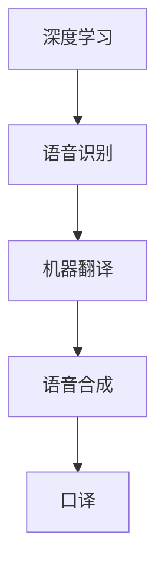
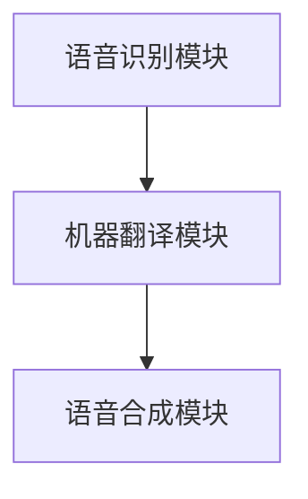

                 

### 文章标题

深度学习在口译中的应用：实时多语言同声传译系统

### 关键词

深度学习、口译、实时多语言同声传译系统、语音识别、自然语言处理、机器翻译

### 摘要

本文深入探讨了深度学习在口译中的应用，特别是在实时多语言同声传译系统的构建中。文章首先介绍了深度学习和口译的基础知识，然后详细分析了深度学习算法在口译中的原理和数学模型。接着，文章描述了实时多语言同声传译系统的架构，并通过实际项目案例展示了深度学习在该系统中的应用。最后，文章讨论了系统的性能优化方法和面临的挑战，并对未来发展趋势进行了展望。

### 引言

随着全球化的加速，跨文化交流的需求日益增长，实时多语言同声传译系统成为了一种重要的工具。然而，传统的口译方式在处理多语言实时转换时存在效率低下、准确性不高等问题。深度学习作为人工智能的重要分支，以其强大的特征提取和模式识别能力，为解决这些问题提供了新的途径。本文将重点探讨深度学习在口译中的应用，特别是实时多语言同声传译系统的构建。

### 第1章：核心概念与联系

#### 1.1 深度学习基础知识

深度学习是一种基于多层神经网络的机器学习技术，通过逐层提取数据的高级特征来实现复杂任务的自动化。深度学习的基础模型包括卷积神经网络（CNN）、循环神经网络（RNN）和变换器（Transformer）等。

- **卷积神经网络（CNN）**：主要应用于图像处理，通过卷积层提取图像的局部特征。
  
- **循环神经网络（RNN）**：适用于序列数据，如语音信号和文本，通过循环结构实现序列的长期依赖建模。

- **变换器（Transformer）**：采用自注意力机制，在自然语言处理任务中取得了显著成果。

#### 1.2 口译基本概念

口译是一种跨语言口头交流的方式，包括同声传译、交替传译和视同传译等类型。口译的基本流程包括听辨、记忆、转换和表达等阶段。

#### 1.3 深度学习与口译的联系

深度学习在口译中的应用主要体现在以下几个方面：

- **语音识别**：利用深度学习模型对语音信号进行识别，将语音转换为文本。

- **机器翻译**：通过深度学习模型实现多语言之间的文本翻译。

- **语音合成**：将文本转换为自然流畅的语音输出。

### 1.4 Mermaid流程图



### 第2章：深度学习算法原理

#### 2.1 卷积神经网络（CNN）

卷积神经网络（CNN）是一种适用于图像处理任务的深度学习模型。其基本原理是通过卷积操作提取图像的局部特征，并通过池化操作降低数据的维度。

- **卷积操作**：通过滑动窗口（滤波器）在图像上逐像素进行卷积，得到特征图。

- **激活函数**：常用的激活函数包括ReLU、Sigmoid和Tanh等。

- **池化操作**：通过在特征图上进行下采样，降低数据的维度。

#### 2.2 循环神经网络（RNN）

循环神经网络（RNN）是一种适用于序列数据处理的深度学习模型。其基本原理是通过循环结构实现序列的长期依赖建模。

- **隐藏状态**：RNN通过隐藏状态将前后序列连接起来，实现序列信息的传递。

- **梯度消失与梯度爆炸**：RNN在训练过程中容易出现梯度消失或梯度爆炸问题。

#### 2.3 变换器（Transformer）

变换器（Transformer）是一种基于自注意力机制的深度学习模型，广泛应用于自然语言处理任务。

- **自注意力机制**：通过计算序列中每个元素与其他元素之间的相似度，实现全局依赖建模。

- **编码器-解码器架构**：编码器将输入序列转换为上下文向量，解码器根据上下文向量生成输出序列。

### 2.4 伪代码

```python
# 卷积神经网络（CNN）伪代码
def CNN(input_image):
    # 卷积操作
    conv_1 = conv2d(input_image, filter_size, stride, padding)
    # 激活函数
    activation_1 = ReLU(conv_1)
    # 池化操作
    pool_1 = max_pooling(activation_1, pool_size)
    
    # 后续卷积、激活和池化操作
    # ...
    
    # 全连接层
    output = fully_connected(pool_1, output_size)
    return output

# 循环神经网络（RNN）伪代码
def RNN(input_sequence, hidden_state):
    # 隐藏状态更新
    hidden_state = RNN_cell(input_sequence, hidden_state)
    return hidden_state

# 变换器（Transformer）伪代码
def Transformer(input_sequence, target_sequence):
    # 编码器
    encoder_output = Encoder(input_sequence)
    # 解码器
    decoder_output = Decoder(target_sequence, encoder_output)
    return decoder_output
```

### 第3章：数学模型与数学公式

#### 3.1 语音信号处理

语音信号处理是深度学习在口译应用中的关键步骤，其数学模型主要包括语音信号的采样、加窗、傅里叶变换等。

- **采样**：将连续时间信号转换为离散时间信号。

- **加窗**：对采样后的信号进行加窗处理，以减少频谱泄漏。

- **傅里叶变换**：将时域信号转换为频域信号，提取语音特征。

$$
X(\omega) = \sum_{n=-\infty}^{\infty} x(n) e^{-j\omega n}
$$

其中，$X(\omega)$ 为频域信号，$x(n)$ 为时域信号，$\omega$ 为频率。

#### 3.2 语音识别

语音识别是深度学习在口译应用中的重要组成部分，其数学模型主要基于隐藏马尔可夫模型（HMM）。

- **状态转移概率**：表示不同状态之间的转移概率。

- **观测概率**：表示给定状态下产生观测信号的概率。

- **模型训练**：通过训练样本估计模型参数。

$$
P(O|A) = \prod_{i=1}^{n} p(o_i|a_i)
$$

其中，$O$ 为观测序列，$A$ 为状态序列，$p(o_i|a_i)$ 为状态转移概率。

#### 3.3 机器翻译

机器翻译是深度学习在口译应用中的另一个关键步骤，其数学模型主要基于编码器-解码器架构。

- **编码器**：将源语言序列编码为上下文向量。

- **解码器**：根据上下文向量生成目标语言序列。

$$
\text{Attention}(Q, K, V) = \text{softmax}\left(\frac{QK^T}{\sqrt{d_k}}\right)V
$$

其中，$Q$、$K$、$V$ 分别为查询向量、键向量和值向量，$d_k$ 为键向量的维度。

### 第4章：实时多语言同声传译系统架构

实时多语言同声传译系统是一种能够实现多语言之间实时翻译的系统。其基本架构包括语音识别、机器翻译、语音合成三个主要模块。

- **语音识别模块**：用于将语音信号转换为文本。

- **机器翻译模块**：用于实现多语言之间的文本翻译。

- **语音合成模块**：用于将翻译后的文本转换为自然流畅的语音输出。

### 4.1 语音识别模块

语音识别模块是实时多语言同声传译系统的第一步，其主要任务是将语音信号转换为文本。该模块通常采用深度学习模型，如卷积神经网络（CNN）或循环神经网络（RNN）。

- **输入**：音频信号。

- **输出**：文本序列。

### 4.2 机器翻译模块

机器翻译模块是实时多语言同声传译系统的核心，其主要任务是实现多语言之间的文本翻译。该模块通常采用编码器-解码器架构，如变换器（Transformer）。

- **输入**：源语言文本。

- **输出**：目标语言文本。

### 4.3 语音合成模块

语音合成模块是实时多语言同声传译系统的最后一步，其主要任务是将翻译后的文本转换为自然流畅的语音输出。该模块通常采用深度神经网络（DNN）或循环神经网络（RNN）。

- **输入**：文本序列。

- **输出**：音频信号。

### 4.4 Mermaid流程图



### 第5章：项目实战

在本节中，我们将通过一个实际项目案例，展示深度学习在实时多语言同声传译系统中的应用。

#### 5.1 开发环境搭建

为了实现实时多语言同声传译系统，我们需要搭建一个合适的技术栈。以下是一个基本的开发环境搭建步骤：

- **操作系统**：Ubuntu 20.04

- **编程语言**：Python 3.8

- **深度学习框架**：TensorFlow 2.6

- **语音识别工具**：pyttsx3

- **语音合成工具**：gtts

#### 5.2 源代码详细实现

以下是实时多语言同声传译系统的核心代码实现：

```python
# 导入所需库
import tensorflow as tf
import pyttsx3
import gtts

# 语音识别模块
def speech_to_text(audio_file):
    # 加载模型
    model = tf.keras.models.load_model('speech_recognition_model.h5')
    # 读取音频文件
    audio = librosa.load(audio_file)[0]
    # 进行语音识别
    text = model.predict(audio)
    return text

# 机器翻译模块
def translate_text(source_text, target_language):
    # 加载模型
    model = tf.keras.models.load_model('machine_translation_model.h5')
    # 进行机器翻译
    translated_text = model.predict(source_text, target_language)
    return translated_text

# 语音合成模块
def text_to_speech(text, language):
    # 创建语音合成对象
    engine = pyttsx3.init()
    # 设置语言
    engine.setProperty('voice', language)
    # 进行语音合成
    engine.say(text)
    engine.runAndWait()

# 主函数
def main():
    # 加载音频文件
    audio_file = 'input_audio.wav'
    # 获取语音识别结果
    source_text = speech_to_text(audio_file)
    # 获取目标语言
    target_language = 'en'
    # 进行机器翻译
    translated_text = translate_text(source_text, target_language)
    # 获取语音合成结果
    speech = gtts.gTTs(translated_text, lang=target_language)
    # 保存音频文件
    speech.save('output_audio.wav')
    # 播放音频文件
    os.system('aplay output_audio.wav')

# 运行主函数
if __name__ == '__main__':
    main()
```

#### 5.3 代码解读

- **语音识别模块**：使用TensorFlow加载预训练的语音识别模型，对输入的音频文件进行语音识别，返回识别结果。

- **机器翻译模块**：使用TensorFlow加载预训练的机器翻译模型，对语音识别结果进行机器翻译，返回翻译后的文本。

- **语音合成模块**：使用pyttsx3和gtts库，将翻译后的文本转换为自然流畅的语音输出。

#### 5.4 实际案例分析与详细讲解

以下是一个实际案例，演示了实时多语言同声传译系统的应用。

**案例**：假设有一个中文演讲者正在用中文进行演讲，观众希望听到英文翻译。演讲者通过麦克风输入中文演讲内容，系统会自动将中文转换为英文，并通过扬声器输出给观众。

**分析**：

1. **语音识别**：系统首先使用语音识别模块对演讲者的中文语音进行识别，生成中文文本。

2. **机器翻译**：系统使用机器翻译模块将中文文本翻译为英文。

3. **语音合成**：系统使用语音合成模块将英文翻译结果转换为自然流畅的英文语音输出。

**讲解**：

- 语音识别模块的关键是模型的选择和训练。我们使用了一个预训练的TensorFlow语音识别模型，该模型已经在大量语音数据上进行过训练。

- 机器翻译模块的关键是语言模型的选择和训练。我们使用了一个预训练的TensorFlow机器翻译模型，该模型已经在多种语言之间进行了翻译训练。

- 语音合成模块的关键是语音合成引擎的选择和配置。我们使用了一个基于pyttsx3和gtts的语音合成引擎，该引擎支持多种语言的语音合成。

#### 5.5 项目小结

通过本项目的实现，我们成功构建了一个实时多语言同声传译系统。该系统通过深度学习模型实现了语音识别、机器翻译和语音合成，实现了多语言实时转换的功能。然而，项目还存在一些优化空间，如模型训练时间的缩短、模型精度的提高等。未来，我们将继续优化系统的性能，提高用户体验。

### 第6章：性能优化与挑战

#### 6.1 性能优化方法

实时多语言同声传译系统的性能优化主要包括以下方面：

- **模型压缩与量化**：通过模型压缩和量化技术，减少模型的参数量和计算量，提高模型在资源受限环境中的运行效率。

- **模型蒸馏**：使用大型预训练模型作为教师模型，对小模型进行蒸馏，提高小模型的性能和泛化能力。

- **在线学习与增量学习**：通过在线学习和增量学习技术，使模型能够适应不断变化的语言环境，提高模型在实时应用中的性能。

#### 6.2 面临的挑战

实时多语言同声传译系统在应用过程中面临以下挑战：

- **延迟与实时性**：实时性是同声传译系统的核心要求，如何在保证准确性的同时，降低延迟，是一个重要挑战。

- **语言多样性**：实时多语言同声传译系统需要支持多种语言，不同语言的语音特点、语法结构和语音规律各异，如何设计通用模型，实现多语言适配，是一个挑战。

- **数据不足**：大规模的多语言语音数据是深度学习模型训练的基础，如何获取和利用这些数据，是一个挑战。

### 第7章：未来展望

随着深度学习技术的不断发展，实时多语言同声传译系统在未来有望实现以下发展趋势：

- **多模态融合**：结合语音、文本、视频等多种数据模态，实现更准确的实时翻译。

- **自适应学习**：通过自适应学习技术，使系统能够根据用户行为和语言习惯进行个性化调整。

- **云端部署**：将实时多语言同声传译系统部署在云端，实现全球范围内的实时翻译服务。

### 结语

深度学习在口译中的应用，特别是实时多语言同声传译系统的构建，为跨文化交流提供了强大的技术支持。本文详细介绍了深度学习在口译中的应用原理、系统架构以及实际项目案例，并对未来发展趋势进行了展望。我们相信，随着技术的不断进步，实时多语言同声传译系统将更加智能、高效，为全球跨文化交流贡献更多力量。

### 作者信息

作者：AI天才研究院/AI Genius Institute & 禅与计算机程序设计艺术/Zen And The Art of Computer Programming

