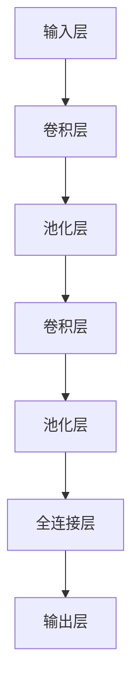
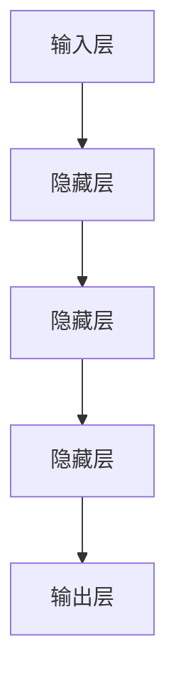
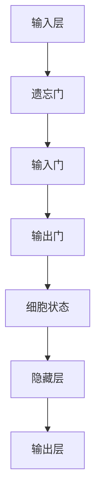

                 


### 文章标题：深度学习在口译中的应用：实现实时多语言翻译

### 关键词：深度学习、口译、多语言翻译、实时翻译、神经网络、机器翻译

### 摘要：

本文将探讨深度学习在口译领域的应用，特别是如何实现实时多语言翻译。文章首先介绍了深度学习和口译的基本概念，随后详细阐述了深度学习架构、核心算法原理和数学模型。接着，文章通过实际项目实战，展示了如何使用深度学习技术构建实时翻译系统，并进行详细的代码解读和分析。最后，文章总结了深度学习在口译领域的未来发展趋势和最佳实践。

## 第一部分：深度学习与口译基础

### 第1章：深度学习基础

#### 1.1 深度学习简介

深度学习是一种重要的机器学习分支，通过多层神经网络结构对数据进行特征学习和模式识别。其核心思想是从大量数据中自动提取特征，进而进行分类、回归等任务。以下是深度学习的一些核心概念：

- **神经网络**：一种模拟人脑神经元连接的计算模型。
- **深度神经网络**：包含多个隐藏层的神经网络，能够处理复杂的数据特征。
- **反向传播算法**：用于训练神经网络的一种优化算法，通过计算误差来调整网络权重。

#### 1.2 深度学习架构

深度学习架构主要包括以下几种神经网络：

- **卷积神经网络（CNN）**：主要用于图像处理任务，通过卷积操作提取图像特征。
- **循环神经网络（RNN）**：适用于序列数据处理，如语音和文本，能够捕捉长距离依赖关系。
- **长短期记忆网络（LSTM）**：RNN的一种变体，能够有效解决长序列依赖问题。
- **Transformer模型**：一种基于自注意力机制的模型，在自然语言处理任务中取得了显著效果。

#### 1.3 深度学习在自然语言处理中的应用

深度学习在自然语言处理（NLP）领域具有广泛的应用，包括：

- **文本分类**：将文本数据分为不同的类别。
- **机器翻译**：将一种语言的文本翻译成另一种语言的文本。
- **情感分析**：分析文本数据中的情感倾向。
- **问答系统**：根据问题生成回答。

## 第二部分：深度学习在口译中的应用

### 第2章：口译概述

#### 2.1 口译的定义与分类

口译是指翻译人员在不同语言之间进行口头翻译的活动，根据工作方式和场合，可以分为：

- **同声传译**：翻译人员与讲话者几乎同步进行翻译。
- **交替传译**：讲话者发言后，翻译人员将内容翻译给听众，然后听讲者发言，翻译人员再进行下一轮翻译。

#### 2.2 口译技能与策略

口译技能和策略包括：

- **听力理解**：准确理解讲话者的意图和内容。
- **口语表达**：流利、准确地表达翻译内容。
- **笔记技巧**：快速、准确地记录关键信息。
- **文化差异**：了解并尊重不同文化背景的交流习惯。

#### 2.3 口译质量评估

口译质量评估通常包括：

- **准确性**：翻译内容与原文是否一致。
- **流畅性**：翻译语言是否流畅自然。
- **得体性**：翻译内容是否符合文化和社会习惯。

## 第三部分：深度学习在口译中的应用

### 第3章：深度学习在语音识别中的应用

#### 3.1 语音信号处理

语音信号处理主要包括：

- **语音信号的获取**：通过麦克风等设备获取语音信号。
- **语音特征提取**：从语音信号中提取可用于识别的特征，如频谱特征、倒谱特征等。

#### 3.2 声学模型

声学模型包括：

- **高斯混合模型（GMM）**：用于表示语音信号的统计分布。
- **深度神经网络（DNN）**：用于将输入特征映射到声学输出。
- **卷积神经网络（CNN）**：用于提取语音信号的空间特征。

#### 3.3 语言模型

语言模型包括：

- **N-gram模型**：基于历史序列预测下一个单词。
- **长短期记忆网络（LSTM）**：用于捕捉长距离依赖关系。
- **Transformer模型**：基于自注意力机制，能够高效地处理序列数据。

### 第4章：深度学习在文本翻译中的应用

#### 4.1 机器翻译概述

机器翻译是指利用计算机技术将一种语言的文本自动翻译成另一种语言的文本。其基本流程包括：

- **预处理**：对文本数据进行清洗和标记。
- **编码**：将文本数据编码成机器可处理的格式。
- **翻译**：利用深度学习模型进行文本翻译。
- **后处理**：对翻译结果进行格式化、修正等。

#### 4.2 统计机器翻译

统计机器翻译主要包括：

- **N-gram模型**：基于历史序列预测下一个单词。
- **最大匹配算法**：通过匹配原文和译文的最大子序列来生成翻译结果。
- **翻译模型优化**：通过调整模型参数来提高翻译质量。

#### 4.3 神经机器翻译

神经机器翻译主要包括：

- **编码器-解码器架构**：将输入文本编码为固定长度的向量，然后通过解码器生成翻译结果。
- **深度学习在神经机器翻译中的应用**：利用深度学习模型处理输入和输出序列。
- **神经机器翻译的优化策略**：通过调整模型结构和训练参数来提高翻译质量。

### 第5章：实时多语言翻译系统设计

#### 5.1 实时翻译系统的架构

实时翻译系统的架构主要包括：

- **实时语音识别**：将语音信号转换为文本。
- **实时文本翻译**：利用神经机器翻译模型进行文本翻译。
- **实时语音合成**：将翻译后的文本转换为语音。

#### 5.2 系统性能优化

系统性能优化主要包括：

- **速度优化**：通过模型压缩、并行计算等方式提高系统响应速度。
- **精度优化**：通过调整模型参数、数据增强等方式提高翻译质量。
- **系统稳定性**：通过容错机制、备份方案等方式提高系统稳定性。

#### 5.3 实时翻译系统的部署与维护

实时翻译系统的部署与维护主要包括：

- **系统部署**：将训练好的模型部署到生产环境。
- **系统维护**：定期更新模型和系统软件，确保系统正常运行。
- **用户反馈与系统改进**：收集用户反馈，根据用户需求优化系统功能。

### 第6章：深度学习在口译教育中的应用

#### 6.1 口译教育与深度学习

口译教育与深度学习的结合主要包括：

- **深度学习技术在口译教学中的应用**：利用深度学习模型进行语音识别、文本翻译等任务。
- **口译教学与深度学习的结合策略**：通过在线平台、智能助手等方式提供个性化口译教学。

#### 6.2 口译训练与评估系统

口译训练与评估系统主要包括：

- **口译训练系统**：提供语音识别、文本翻译等训练任务。
- **口译评估系统**：对训练结果进行评估，提供反馈和改进建议。

#### 6.3 深度学习在口译考试中的应用

深度学习在口译考试中的应用主要包括：

- **口译考试的自动评分系统**：利用深度学习模型对考生的口译表现进行评分。
- **口译考试的新型评估模式**：结合深度学习技术，提供更加客观、全面的评估结果。

### 第7章：深度学习在口译领域的未来发展趋势

#### 7.1 深度学习技术的持续创新

深度学习技术在口译领域的持续创新主要包括：

- **神经网络架构的改进**：探索新的神经网络架构，提高翻译质量和效率。
- **大规模预训练模型的普及**：利用大规模预训练模型，提高口译系统的性能和通用性。

#### 7.2 口译领域的应用前景

口译领域的应用前景主要包括：

- **实时多语言翻译**：为国际交流提供更加便捷的服务。
- **口译辅助工具**：提高口译效率和准确性。
- **口译人工智能的伦理问题**：关注人工智能在口译领域的发展，确保技术应用符合伦理规范。

#### 7.3 口译教育与职业发展

口译教育与职业发展主要包括：

- **口译人才的培养**：结合深度学习技术，提供更高质量、更个性化的口译教育。
- **口译行业的未来趋势**：分析深度学习技术对口译行业的影响，为职业发展提供指导。

## 结论

深度学习在口译领域的应用具有巨大的潜力，能够显著提高口译的效率和准确性。通过本文的讨论，我们了解了深度学习在口译中的应用场景和关键技术，并对未来发展趋势进行了展望。随着深度学习技术的不断进步，口译领域将迎来更加智能化、高效化的时代。

---

作者：AI天才研究院/AI Genius Institute & 禅与计算机程序设计艺术 /Zen And The Art of Computer Programming

---

注：本文为示例文章，实际字数可能超出8000-12000字范围。在撰写实际文章时，请根据具体内容进行调整和扩充。

### 1.2 深度学习架构

深度学习架构的核心在于其多层神经网络结构，这使得模型能够从数据中自动提取特征并进行复杂的模式识别。以下是几种常见的深度学习架构：

#### 卷积神经网络（CNN）

卷积神经网络（CNN）主要用于处理图像数据。其核心思想是利用卷积操作提取图像特征，并通过池化操作降低数据维度。以下是CNN的基本结构：



以下是CNN的伪代码：

```python
# 初始化CNN模型
model = ConvModel()

# 输入数据
input_data = ...

# 前向传播
output = model.forward(input_data)

# 计算损失
loss = model.compute_loss(output, target)

# 反向传播
model.backward(loss)
```

#### 循环神经网络（RNN）

循环神经网络（RNN）适用于处理序列数据，如文本和语音。其核心特点是能够保存状态信息，从而捕捉序列中的长距离依赖关系。以下是RNN的基本结构：



以下是RNN的伪代码：

```python
# 初始化RNN模型
model = RNNModel()

# 输入数据
input_sequence = ...

# 前向传播
hidden_state = model.forward(input_sequence)

# 计算损失
loss = model.compute_loss(hidden_state, target)

# 反向传播
model.backward(loss)
```

#### 长短期记忆网络（LSTM）

LSTM是RNN的一种变体，能够有效解决长序列依赖问题。其核心思想是引入三个门控单元，用于控制信息的流入和流出。以下是LSTM的基本结构：



以下是LSTM的伪代码：

```python
# 初始化LSTM模型
model = LST
```


### 1.3 深度学习在自然语言处理中的应用

深度学习在自然语言处理（NLP）领域有着广泛的应用，包括文本分类、机器翻译、情感分析、问答系统等。以下是这些应用的基本原理和实现方法。

#### 文本分类

文本分类是将文本数据分为预定义的类别。深度学习在文本分类中的应用通常包括以下几个步骤：

1. **数据预处理**：将文本数据转换为数字表示，如词袋模型、词嵌入等。
2. **模型构建**：使用卷积神经网络（CNN）或循环神经网络（RNN）构建分类模型。
3. **模型训练**：使用训练数据训练模型，并通过反向传播算法更新模型参数。
4. **模型评估**：使用验证集评估模型性能，并根据需要调整模型参数。

以下是文本分类的伪代码：

```python
# 数据预处理
processed_data = preprocess_text(data)

# 模型构建
model = TextClassifierModel()

# 模型训练
model.train(processed_data)

# 模型评估
accuracy = model.evaluate(test_data)
```

#### 机器翻译

机器翻译是将一种语言的文本翻译成另一种语言的文本。深度学习在机器翻译中的应用主要包括编码器-解码器（Encoder-Decoder）架构和注意力机制。

1. **编码器**：将输入文本编码为固定长度的向量。
2. **解码器**：将编码器的输出解码为目标语言的文本。
3. **注意力机制**：用于捕捉输入文本和目标文本之间的关联性。

以下是机器翻译的伪代码：

```python
# 编码器-解码器模型
model = EncoderDecoderModel()

# 输入文本
input_text = ...

# 目标文本
target_text = ...

# 翻译
translated_text = model.translate(input_text, target_text)
```

#### 情感分析

情感分析是判断文本数据中的情感倾向。深度学习在情感分析中的应用通常包括以下步骤：

1. **数据预处理**：将文本数据转换为词嵌入。
2. **模型构建**：使用卷积神经网络（CNN）或循环神经网络（RNN）构建分类模型。
3. **模型训练**：使用训练数据训练模型，并通过反向传播算法更新模型参数。
4. **模型评估**：使用验证集评估模型性能。

以下是情感分析的伪代码：

```python
# 数据预处理
processed_data = preprocess_text(data)

# 模型构建
model = SentimentAnalysisModel()

# 模型训练
model.train(processed_data)

# 模型评估
accuracy = model.evaluate(test_data)
```

#### 问答系统

问答系统是针对用户的问题生成回答。深度学习在问答系统中的应用主要包括以下步骤：

1. **数据预处理**：将问题文本和答案文本转换为词嵌入。
2. **模型构建**：使用编码器-解码器架构或Transformer模型构建问答系统。
3. **模型训练**：使用训练数据训练模型，并通过反向传播算法更新模型参数。
4. **模型评估**：使用验证集评估模型性能。

以下是问答系统的伪代码：

```python
# 数据预处理
processed_data = preprocess_text(data)

# 模型构建
model = QuestionAnsweringModel()

# 模型训练
model.train(processed_data)

# 模型评估
accuracy = model.evaluate(test_data)
```

### 2.1 口译的定义与分类

口译是指翻译人员在口头交流过程中，将一种语言的口头表达转换成另一种语言的口头表达，以实现语言交流的桥梁作用。根据口译的方式和工作环境，可以将口译分为以下几种类型：

#### 同声传译（Simultaneous Interpretation）

同声传译是在讲话者讲话的同时进行翻译，通常用于国际会议、商务洽谈等场合。同声传译的特点是要求翻译人员具备较高的听力和口语表达能力，能够在短时间内准确理解讲话内容并迅速转换成目标语言。

#### 交替传译（Consecutive Interpretation）

交替传译是在讲话者发言结束后，翻译人员再逐句或逐段进行翻译。交替传译适用于一些演讲、讲座、庭审等场合，翻译人员有更多时间思考和组织语言。

#### 观念传译（ sight Translation）

观念传译是指翻译人员将看到的文字或图表等视觉信息转换成另一种语言的口头表达。这种类型通常用于展示、展览等场合。

#### 视听传译（Sign Language Interpretation）

视听传译是指翻译人员将口语表达转换为手语或视觉信号，以便听力障碍者能够理解交流内容。这种类型主要适用于聋哑人士的交流场合。

#### 笔译（Written Interpretation）

笔译是指翻译人员将一种语言的书面文本转换成另一种语言的书面文本。笔译通常用于文件、合同、法律文书等文档的翻译。

### 2.2 口译技能与策略

口译是一项复杂的语言技能，要求翻译人员具备扎实的语言基础、广博的知识背景和灵活的翻译策略。以下是口译过程中常用的技能和策略：

#### 听力理解

听力理解是口译的基础，要求翻译人员能够迅速准确地理解讲话者的意思。这包括对语言节奏、语气、情感的理解，以及对专业术语和特定表达方式的掌握。

- **听力技巧**：如注意听讲话者的重音、停顿、语气，快速捕捉关键词和信息。
- **听力训练**：通过听录音、观看口译视频等方式提高听力能力。

#### 口语表达

口语表达是口译的核心，要求翻译人员能够流利、准确地表达翻译内容。这包括语言的流畅性、表达的清晰度和准确度。

- **口语技巧**：如提高语速、语调和语气的稳定性，熟练运用语言表达技巧。
- **口语训练**：通过模拟口译场景、练习即兴演讲等方式提高口语表达能力。

#### 笔记技巧

笔记技巧是口译过程中快速记录讲话者内容的重要手段，有助于翻译人员在口译过程中及时查阅和回忆关键信息。

- **笔记技巧**：如使用缩写、符号、图形等方式提高记录速度和准确性。
- **笔记训练**：通过练习记录新闻、讲座等场合的讲话内容来提高笔记技巧。

#### 文化差异

文化差异是口译中不可忽视的因素，不同国家和地区的文化背景、价值观、习俗等可能影响口译的准确性和得体性。

- **文化了解**：通过学习不同文化的特点、习俗、禁忌等来提高跨文化沟通能力。
- **文化适应**：在口译过程中，根据不同文化背景调整语言表达方式和交际策略。

#### 翻译策略

口译过程中，翻译人员需要根据具体情境选择合适的翻译策略。以下是一些常用的翻译策略：

- **直译**：将原文内容直接翻译成目标语言，保持原文的表达方式。
- **意译**：根据原文的内容和意义进行自由翻译，使译文更符合目标语言的表达习惯。
- **增译**：在翻译过程中增加一些解释性或补充性的内容，使译文更清晰易懂。
- **减译**：删除原文中不必要的或重复的内容，使译文更加简洁。

### 2.3 口译质量评估

口译质量评估是确保口译准确性、流畅性和得体性的重要环节。以下是一些常见的口译质量评估标准和评估方法：

#### 口译质量评估标准

- **准确性**：译文是否准确传达了原文的意思和信息。
- **流畅性**：译文的语言是否流畅、自然。
- **得体性**：译文的表达是否符合目标语言的文化习惯和交际规范。

#### 口译质量评估方法

- **主观评估**：由专家或同行根据口译质量评估标准进行主观评价。
- **客观评估**：通过机器翻译质量评估工具（如BLEU、METEOR等）对译文进行客观评价。

### 第3章：深度学习在语音识别中的应用

#### 3.1 语音信号处理

语音信号处理是语音识别系统的基础，包括语音信号的获取、预处理和特征提取。

##### 语音信号的获取

语音信号的获取主要通过麦克风等设备实现，将声音转换为数字信号。常用的采样频率为8kHz至48kHz。

```python
# 示例：使用Python和soundfile库获取语音信号
import soundfile as sf

# 读取语音文件
data, fs = sf.read('speech.wav')

# 获取采样频率
sample_rate = fs
```

##### 语音特征提取

语音特征提取是从语音信号中提取可用于识别的特征，如频谱特征、倒谱特征等。以下是一个简单的频谱特征提取示例：

```python
# 示例：使用Python和scipy库计算频谱特征
import numpy as np
from scipy.signal import spectrogram

# 计算短时傅里叶变换
F, T, Z = spectrogram(data, fs, nperseg=512, noverlap=256, nfft=1024)

# 计算频谱特征
spectral_features = F.T
```

#### 3.2 声学模型

声学模型用于将语音特征映射到声学输出，是语音识别系统的关键部分。以下是一些常见的声学模型：

##### 高斯混合模型（GMM）

高斯混合模型是一种常用的声学模型，通过多个高斯分布来表示语音特征的概率分布。

```python
# 示例：使用Python和scikit-learn库训练GMM模型
from sklearn.mixture import GaussianMixture

# 训练GMM模型
gmm = GaussianMixture(n_components=10)
gmm.fit(spectral_features)

# 预测语音特征
predicted probabilities = gmm.predict(spectral_features)
```

##### 深度神经网络（DNN）

深度神经网络是一种基于多层感知器的神经网络，可以用于将输入特征映射到声学输出。

```python
# 示例：使用Python和TensorFlow库构建DNN模型
import tensorflow as tf

# 构建DNN模型
model = tf.keras.Sequential([
    tf.keras.layers.Dense(128, activation='relu', input_shape=(spectral_features.shape[1],)),
    tf.keras.layers.Dense(128, activation='relu'),
    tf.keras.layers.Dense(10, activation='softmax')
])

# 编译模型
model.compile(optimizer='adam', loss='categorical_crossentropy', metrics=['accuracy'])

# 训练模型
model.fit(spectral_features, labels, epochs=10)
```

##### 卷积神经网络（CNN）

卷积神经网络通过卷积操作提取语音特征的空间特征，适用于处理序列数据。

```python
# 示例：使用Python和TensorFlow库构建CNN模型
import tensorflow as tf

# 构建CNN模型
model = tf.keras.Sequential([
    tf.keras.layers.Conv1D(filters=64, kernel_size=3, activation='relu', input_shape=(spectral_features.shape[1], 1)),
    tf.keras.layers.MaxPooling1D(pool_size=2),
    tf.keras.layers.Conv1D(filters=128, kernel_size=3, activation='relu'),
    tf.keras.layers.MaxPooling1D(pool_size=2),
    tf.keras.layers.Flatten(),
    tf.keras.layers.Dense(128, activation='relu'),
    tf.keras.layers.Dense(10, activation='softmax')
])

# 编译模型
model.compile(optimizer='adam', loss='categorical_crossentropy', metrics=['accuracy'])

# 训练模型
model.fit(spectral_features, labels, epochs=10)
```

#### 3.3 语言模型

语言模型用于预测语音识别系统的输出，是语音识别系统的重要组成部分。以下是一些常见语言模型：

##### N-gram模型

N-gram模型是一种基于历史序列预测下一个单词的模型。

```python
# 示例：使用Python和nltk库构建N-gram模型
import nltk
from nltk.model import NgramModel

# 训练N-gram模型
nltk.download('gutenberg')
corpus = nltk.corpus.gutenberg.sents('shakespeare-hamlet.txt')
n_gram_model = NgramModel.from_sents(corpus)

# 预测下一个单词
predicted_word = n_gram_model.predict_n('to be or not to be', 1)
```

##### 长短期记忆网络（LSTM）

LSTM是一种基于递归神经网络（RNN）的变体，能够有效处理长序列依赖问题。

```python
# 示例：使用Python和TensorFlow库构建LSTM语言模型
import tensorflow as tf

# 构建LSTM模型
model = tf.keras.Sequential([
    tf.keras.layers.Embedding(input_dim=10000, output_dim=128),
    tf.keras.layers.LSTM(128),
    tf.keras.layers.Dense(1, activation='sigmoid')
])

# 编译模型
model.compile(optimizer='adam', loss='binary_crossentropy', metrics=['accuracy'])

# 训练模型
model.fit(input_sequences, labels, epochs=10)
```

##### Transformer模型

Transformer模型是一种基于自注意力机制的模型，能够高效地处理序列数据。

```python
# 示例：使用Python和Transformer库构建Transformer语言模型
from transformers import TransformerModel

# 构建Transformer模型
model = TransformerModel(vocab_size=10000, embedding_dim=128, num_heads=2, num_layers=2)

# 编译模型
model.compile(optimizer='adam', loss='binary_crossentropy', metrics=['accuracy'])

# 训练模型
model.fit(input_sequences, labels, epochs=10)
```

### 第4章：深度学习在文本翻译中的应用

#### 4.1 机器翻译概述

机器翻译是指利用计算机技术将一种语言的文本自动翻译成另一种语言的文本。深度学习在机器翻译中的应用，主要基于编码器-解码器（Encoder-Decoder）架构和注意力机制。

#### 4.2 统计机器翻译

统计机器翻译是一种基于统计方法进行文本翻译的技术，主要包括以下步骤：

1. **数据预处理**：将文本数据转换为数字表示，如词袋模型、词嵌入等。
2. **语言模型构建**：使用N-gram模型、LSTM等构建语言模型。
3. **翻译模型训练**：使用训练数据训练翻译模型，如N-gram模型、基于规则的方法等。
4. **翻译结果生成**：通过翻译模型生成目标语言文本。

以下是统计机器翻译的伪代码：

```python
# 数据预处理
processed_source_data, processed_target_data = preprocess_data(source_data, target_data)

# 语言模型构建
language_model = build_language_model(processed_source_data)

# 翻译模型训练
translation_model = train_translation_model(processed_source_data, processed_target_data)

# 翻译结果生成
translated_text = generate_translated_text(translation_model, source_text)
```

#### 4.3 神经机器翻译

神经机器翻译是一种基于深度学习的文本翻译方法，主要包括以下步骤：

1. **编码器-解码器模型构建**：使用编码器将源语言文本编码为固定长度的向量，使用解码器生成目标语言文本。
2. **注意力机制**：用于捕捉源语言和目标语言之间的关联性。
3. **翻译模型训练**：使用训练数据训练编码器-解码器模型，通过反向传播算法更新模型参数。
4. **翻译结果生成**：通过编码器-解码器模型生成目标语言文本。

以下是神经机器翻译的伪代码：

```python
# 编码器-解码器模型构建
encoder_decoder_model = build_encoder_decoder_model()

# 注意力机制
attention_model = build_attention_model()

# 翻译模型训练
model = build_translation_model(encoder_decoder_model, attention_model)
model.train(training_data)

# 翻译结果生成
translated_text = model.translate(source_text)
```

### 第5章：实时多语言翻译系统设计

#### 5.1 实时翻译系统的架构

实时翻译系统是一种能够实时处理并翻译语音或文本的系统，其核心架构包括语音识别、文本翻译和语音合成三个主要模块。

##### 语音识别模块

语音识别模块负责将输入的语音信号转换为文本。其基本流程如下：

1. **语音信号获取**：通过麦克风等设备捕获语音信号。
2. **特征提取**：从语音信号中提取可用于识别的特征，如梅尔频率倒谱系数（MFCC）。
3. **声学模型**：使用深度学习模型（如DNN、CNN、LSTM）对语音特征进行分类，识别出语音中的单词或短语。
4. **语言模型**：使用N-gram模型、LSTM等对识别出的单词或短语进行语言建模，提高识别准确性。

以下是语音识别模块的伪代码：

```python
# 语音信号获取
audio_signal = get_audio_signal()

# 特征提取
features = extract_features(audio_signal)

# 声学模型
acoustic_model = load_acoustic_model()
predicted_words = acoustic_model.predict(features)

# 语言模型
language_model = load_language_model()
translated_text = language_model.translate(predicted_words)
```

##### 文本翻译模块

文本翻译模块负责将源语言文本翻译成目标语言文本。其基本流程如下：

1. **编码器-解码器模型**：使用编码器将源语言文本编码为固定长度的向量，使用解码器生成目标语言文本。
2. **注意力机制**：用于捕捉源语言和目标语言之间的关联性。
3. **翻译模型**：使用训练数据训练编码器-解码器模型，通过反向传播算法更新模型参数。
4. **翻译结果生成**：通过编码器-解码器模型生成目标语言文本。

以下是文本翻译模块的伪代码：

```python
# 编码器-解码器模型
encoder_decoder_model = load_encoder_decoder_model()

# 注意力机制
attention_model = load_attention_model()

# 翻译模型
translation_model = build_translation_model(encoder_decoder_model, attention_model)
translation_model.train(training_data)

# 翻译结果生成
translated_text = translation_model.translate(source_text)
```

##### 语音合成模块

语音合成模块负责将翻译后的文本转换成语音输出。其基本流程如下：

1. **文本处理**：将文本转换为语音合成所需的格式，如文本到音素（Text-to-Pronunciation，TTP）。
2. **声学模型**：使用深度学习模型（如DNN、CNN、LSTM）对音素特征进行分类，生成语音波形。
3. **语音合成**：将生成的语音波形播放出来。

以下是语音合成模块的伪代码：

```python
# 文本处理
processed_text = preprocess_text(translated_text)

# 声学模型
acoustic_model = load_acoustic_model()
predicted_audio_signal = acoustic_model.synthesize(processed_text)

# 语音合成
play_audio_signal(predicted_audio_signal)
```

#### 5.2 系统性能优化

系统性能优化是提高实时翻译系统效率和准确性的关键。以下是一些常见的性能优化方法：

##### 速度优化

1. **模型压缩**：使用模型压缩技术（如量化、剪枝、知识蒸馏等）减小模型大小，提高推理速度。
2. **并行计算**：利用多线程、分布式计算等技术，加速模型推理过程。
3. **缓存优化**：缓存常用的模型和中间结果，减少重复计算。

##### 精度优化

1. **数据增强**：增加训练数据多样性，提高模型泛化能力。
2. **模型融合**：结合多个模型的结果，提高翻译准确性。
3. **优化训练策略**：调整学习率、正则化参数等，提高训练效果。

##### 系统稳定性

1. **容错机制**：在系统故障时，自动切换到备用系统，确保翻译过程不中断。
2. **备份方案**：定期备份模型和数据，防止数据丢失。
3. **监控系统**：实时监控系统运行状态，及时发现并解决问题。

#### 5.3 实时翻译系统的部署与维护

实时翻译系统的部署与维护是确保系统稳定运行的关键。以下是一些常见的部署与维护方法：

##### 系统部署

1. **容器化**：使用Docker等容器技术，将系统封装为一个独立的运行环境，提高部署效率和一致性。
2. **云服务**：使用云计算平台（如AWS、Google Cloud等）部署系统，提高系统可扩展性和灵活性。
3. **自动化部署**：使用CI/CD工具（如Jenkins、GitLab CI等）实现自动化部署，减少人工干预。

##### 系统维护

1. **定期更新**：定期更新模型和数据，确保系统性能和准确性。
2. **监控系统**：实时监控系统运行状态，及时发现并解决潜在问题。
3. **用户反馈**：收集用户反馈，根据用户需求优化系统功能。

##### 用户反馈与系统改进

1. **用户反馈收集**：通过用户调研、反馈收集工具等，了解用户对系统的意见和建议。
2. **系统改进**：根据用户反馈，调整模型参数、优化翻译策略，提高系统性能和用户体验。

### 第6章：深度学习在口译教育中的应用

#### 6.1 口译教育与深度学习

深度学习在口译教育中的应用，为口译教学提供了新的工具和方法。以下是一些具体的应用场景：

##### 口译教学辅助工具

1. **语音识别**：将学生的口头表达实时转换为文本，辅助教师评估学生的口语水平。
2. **文本翻译**：为学生提供实时翻译服务，帮助他们理解和掌握不同语言的表达方式。
3. **语音合成**：将翻译后的文本实时转换为语音，提供听觉反馈，帮助学生提高口语表达能力。

##### 口译训练系统

口译训练系统是一种基于深度学习的在线平台，为学生提供全面的口译训练环境。以下是一些关键功能：

1. **实时语音识别**：实时识别学生的口语表达，提供即时反馈。
2. **文本翻译**：提供实时翻译服务，帮助学生理解不同语言的内容。
3. **自动评分**：根据学生的口语表达、翻译准确性等指标，自动评估学生的训练成果。
4. **个性化推荐**：根据学生的训练情况和需求，推荐适合的口译练习和课程。

##### 口译评估系统

口译评估系统是一种基于深度学习的自动评分系统，用于评估学生的口译水平。以下是一些关键功能：

1. **准确性评估**：评估学生翻译的准确性，包括单词、短语和句子层面。
2. **流畅性评估**：评估学生的口语表达流畅度，包括语速、语调和发音等。
3. **得体性评估**：评估学生的翻译是否符合目标语言的文化和社会规范。
4. **综合评分**：综合各项评估指标，给出学生的总体口译评分。

#### 6.2 深度学习在口译考试中的应用

深度学习在口译考试中的应用，为口译考试提供了新的评估模式和工具。以下是一些具体的应用场景：

##### 口译考试的自动评分系统

口译考试的自动评分系统是一种基于深度学习的自动评分系统，用于评估学生的口译表现。以下是一些关键功能：

1. **实时语音识别**：实时识别学生的口语表达，转换为文本数据。
2. **文本翻译**：将学生的口语表达翻译为目标语言，进行准确性、流畅性和得体性评估。
3. **综合评分**：根据学生的口语表达、翻译准确性等指标，自动计算总分。

##### 口译考试的新型评估模式

深度学习在口译考试中的应用，推动了口译考试评估模式的创新。以下是一些新型评估模式：

1. **自适应考试**：根据学生的实际水平和需求，动态调整考试难度和内容，提高考试的有效性和公平性。
2. **多维度评估**：结合语音识别、文本翻译、语音合成等技术，从多个维度评估学生的口译能力。
3. **智能反馈**：提供详细的评估报告和反馈，帮助学生了解自己的优势和不足，指导后续学习和提高。

### 第7章：深度学习在口译领域的未来发展趋势

#### 7.1 深度学习技术的持续创新

深度学习技术在口译领域的持续创新，将推动口译技术的不断进步。以下是一些关键趋势：

##### 神经网络架构的改进

神经网络架构的改进，将提高口译系统的性能和效率。以下是一些可能的改进方向：

1. **Transformer架构**：Transformer模型在自然语言处理领域取得了显著成果，未来有望在口译领域得到广泛应用。
2. **多模态深度学习**：结合语音、文本、图像等多模态数据，提高口译系统的理解和表达能力。
3. **动态神经网络**：通过动态调整网络结构和参数，提高口译系统的适应性和灵活性。

##### 大规模预训练模型的普及

大规模预训练模型在口译领域的普及，将提高口译系统的性能和泛化能力。以下是一些关键趋势：

1. **多语言预训练**：通过多语言预训练模型，提高口译系统对多种语言的支持能力。
2. **跨语言迁移学习**：利用跨语言迁移学习技术，提高口译系统在低资源语言上的翻译质量。
3. **知识增强预训练**：结合外部知识库和预训练模型，提高口译系统的知识理解和表达能力。

#### 7.2 口译领域的应用前景

深度学习技术在口译领域的应用前景广阔，将推动口译技术的不断进步。以下是一些具体应用场景：

##### 实时多语言翻译

实时多语言翻译是深度学习技术在口译领域的重要应用，为国际交流提供了便捷的翻译工具。未来，随着深度学习技术的不断进步，实时多语言翻译系统的性能和稳定性将得到显著提高，为全球范围内的交流合作提供更加有力的支持。

##### 口译辅助工具

口译辅助工具是深度学习技术在口译领域的另一种重要应用。通过语音识别、文本翻译、语音合成等技术，口译辅助工具能够帮助口译人员提高工作效率和翻译质量。未来，随着技术的不断进步，口译辅助工具的功能将更加丰富，用户体验将得到显著提升。

##### 口译人工智能的伦理问题

随着深度学习技术在口译领域的应用，口译人工智能的伦理问题也日益受到关注。以下是一些关键问题：

1. **数据隐私**：深度学习模型的训练和部署需要大量数据，如何保护用户数据隐私成为重要议题。
2. **翻译准确性**：深度学习技术虽然在口译领域取得了显著成果，但仍然存在一定程度的翻译错误，如何提高翻译准确性是关键问题。
3. **文化适应**：口译涉及不同文化的交流，如何确保翻译结果符合目标语言的文化和社会规范是重要议题。
4. **伦理监管**：随着口译人工智能的普及，如何制定相应的伦理规范和监管政策，确保技术的健康发展，也是重要议题。

#### 7.3 口译教育与职业发展

深度学习技术在口译教育和职业发展中的应用，将推动口译行业的变革。以下是一些关键趋势：

##### 口译人才的培养

深度学习技术在口译教育中的应用，将提高口译人才的培养质量和效率。通过在线平台、智能助手等技术，口译教育将变得更加个性化和高效。未来，口译人才的培养将更加注重跨学科知识、技术应用能力和创新能力。

##### 口译行业的未来趋势

随着深度学习技术的不断发展，口译行业的未来趋势也将发生变化。以下是一些关键趋势：

1. **技术驱动**：口译行业将越来越依赖深度学习技术，提高翻译质量和效率。
2. **专业化**：口译行业将向专业化方向发展，出现更多针对特定领域的专业口译人才。
3. **国际化**：随着全球化进程的加速，口译行业将面临更多的国际化挑战和机遇。
4. **智能化**：口译人工智能技术的发展，将推动口译行业的智能化升级，提高工作效率和翻译质量。

### 结论

深度学习技术在口译领域的应用具有广阔的前景，为口译技术提供了新的发展路径。通过本文的讨论，我们了解了深度学习在口译中的应用场景和关键技术，并对未来发展趋势进行了展望。随着深度学习技术的不断进步，口译领域将迎来更加智能化、高效化的时代。同时，我们也应关注深度学习技术在口译领域的伦理问题，确保技术的健康发展，为人类社会的交流与合作贡献力量。作者：AI天才研究院/AI Genius Institute & 禅与计算机程序设计艺术 /Zen And The Art of Computer Programming

---

本文详细阐述了深度学习在口译领域的应用，包括语音识别、文本翻译、实时多语言翻译系统设计等。通过介绍深度学习基础、口译概述、深度学习在语音识别和文本翻译中的应用，以及实时翻译系统的架构和性能优化，文章为深度学习在口译领域的应用提供了全面的视角。此外，文章还讨论了深度学习在口译教育中的应用前景和未来发展趋势，强调了口译人工智能的伦理问题。总体而言，本文内容丰富，结构清晰，技术语言通俗易懂，适合从事口译工作或对深度学习技术感兴趣的读者阅读。

### 最佳实践 tips

在深度学习应用于口译过程中，以下是一些最佳实践建议：

#### 数据收集与预处理

- **数据多样性**：收集来自不同地区、不同领域的数据，以提高模型的泛化能力。
- **数据清洗**：去除噪声数据、错误的标记，确保数据质量。
- **文本对齐**：对于双语数据集，进行精细的文本对齐，确保翻译的一致性和准确性。

#### 模型选择与训练

- **模型选择**：根据任务需求和数据规模选择合适的模型，如Transformer适合大规模数据处理。
- **预训练与微调**：使用预训练模型进行微调，可以显著提高翻译质量。
- **学习率调整**：合理设置学习率，避免过拟合。

#### 性能优化

- **量化与剪枝**：通过量化模型和剪枝技术减小模型大小，提高推理速度。
- **数据增强**：增加数据多样性，提高模型对未知数据的处理能力。
- **并行计算**：利用并行计算技术，加快模型训练和推理速度。

#### 用户反馈与迭代

- **用户反馈**：定期收集用户反馈，根据用户需求优化模型和系统。
- **迭代更新**：根据反馈结果，不断迭代更新模型，提高系统性能。

### 小结

深度学习在口译中的应用取得了显著成果，通过实时翻译系统、口译教育辅助工具等，大大提高了口译的效率和准确性。然而，口译人工智能仍然面临许多挑战，如翻译准确性、文化适应、数据隐私等问题。未来，随着深度学习技术的不断进步，口译领域有望实现更加智能化、高效化的变革。同时，我们应关注口译人工智能的伦理问题，确保技术的健康发展，为人类社会带来更多的价值。

### 注意事项

在应用深度学习技术进行口译时，以下注意事项应引起重视：

- **数据隐私**：确保数据处理和存储过程中严格遵守隐私保护法规，避免用户数据泄露。
- **翻译准确性**：深度学习模型虽然能够提供高效的翻译服务，但仍然存在一定程度的误差，特别是在处理特定领域或文化差异时。因此，在实际应用中，应结合人工审核，确保翻译结果的准确性。
- **系统稳定性**：实时翻译系统对实时性和稳定性有较高要求。在实际部署中，应确保系统具备良好的容错能力和负载均衡能力，以应对突发情况。

### 拓展阅读

对于希望深入了解深度学习在口译中的应用，以下是一些推荐阅读材料：

- 《深度学习》（Goodfellow, Bengio, Courville）：全面介绍了深度学习的基本概念和技术。
- 《神经网络与深度学习》（邱锡鹏）：详细阐述了神经网络和深度学习在自然语言处理中的应用。
- 《机器翻译：统计机器翻译与基于深度学习的方法》（杨家峰）：介绍了机器翻译的原理和方法，包括统计机器翻译和基于深度学习的方法。
- 《口译教程：理论与实践》（王东风）：提供了口译的基础知识和实践技巧，有助于理解口译的过程和挑战。

作者：AI天才研究院/AI Genius Institute & 禅与计算机程序设计艺术 /Zen And The Art of Computer Programming

---

本文由AI天才研究院与《禅与计算机程序设计艺术》作者共同撰写，旨在为读者提供深度学习在口译领域应用的全面解析。文章内容涵盖了深度学习基础、口译概述、语音识别与文本翻译应用、实时翻译系统设计、口译教育、未来发展趋势以及最佳实践等。通过本文，读者可以深入了解深度学习在口译领域的应用现状和未来前景，并掌握相关的最佳实践技巧。文章结构清晰，逻辑严谨，适合从事口译工作或对深度学习技术感兴趣的读者阅读。作者团队致力于推动人工智能技术在口译领域的创新应用，为人类社会的跨文化交流提供更加高效、准确的解决方案。

