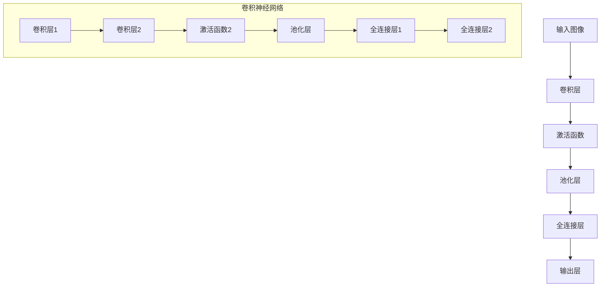

                 

## 文章标题：深度学习在图像和视频处理中的突破

深度学习，作为人工智能领域的核心驱动力，已经深刻地改变了计算机视觉领域。特别是在图像和视频处理方面，深度学习的应用取得了显著的突破。本文将围绕这一主题，详细探讨深度学习在图像和视频处理中的关键应用，包括图像分类、目标检测、图像分割以及视频分类、目标跟踪和视频分析等内容。通过逐步分析推理，我们将揭示深度学习如何从根本上革新了这一领域的技术和应用。

关键词：深度学习，图像处理，视频处理，图像分类，目标检测，图像分割，视频分类，目标跟踪

摘要：本文旨在系统地介绍深度学习在图像和视频处理中的应用，以及其在这些领域取得的突破。通过分章节详细讨论，我们将揭示深度学习如何解决传统方法难以处理的问题，并展示其在实际应用中的广泛潜力。本文不仅对基础知识进行了深入讲解，还通过具体实例展示了深度学习算法的实际应用效果。

## 第一部分：深度学习基础与图像处理应用

### 第1章：深度学习概述

#### 1.1 深度学习的起源与发展

深度学习起源于20世纪40年代，随着计算能力的提升和大数据的涌现，深度学习在21世纪得到了飞速发展。其核心思想是模拟人脑的工作方式，通过多层次的神经网络模型进行学习。早期，由于计算资源有限，深度学习的发展较为缓慢。然而，随着2006年Geoffrey Hinton等人提出的深度信念网络（DBN）的出现，深度学习迎来了新的曙光。

深度学习的发展可以分为三个阶段：第一阶段是传统的多层感知机（MLP）和卷积神经网络（CNN）的研究和应用；第二阶段是深度信念网络（DBN）和深度卷积神经网络（DCNN）的发展；第三阶段是2012年由Alex Krizhevsky等人在ImageNet挑战赛上取得的突破性成果，标志着深度学习进入了一个新的时代。

#### 1.2 深度学习的基本原理

深度学习的基本原理基于神经网络。神经网络是一种模拟生物神经系统工作的计算模型，由大量的神经元（节点）通过连接（边）构成。在深度学习中，网络被分成多个层次，每个层次都对输入数据进行变换和处理。

深度学习的基本原理包括以下几个关键概念：

1. **前向传播与反向传播**：在训练过程中，网络首先通过前向传播将输入数据传递到输出层，然后通过计算损失函数来评估预测结果与实际结果之间的差距。接着，通过反向传播算法，将误差信号反向传递到每一层，从而调整各层的权重和偏置。

2. **激活函数**：激活函数是神经网络中用于引入非线性性的函数，常见的有Sigmoid、ReLU和Tanh等。

3. **卷积神经网络（CNN）**：卷积神经网络是专门用于处理图像数据的一种神经网络结构，通过卷积层、池化层和全连接层等层次结构，实现图像的特征提取和分类。

#### 1.3 深度学习与传统机器学习的比较

深度学习与传统机器学习在多个方面存在显著差异：

1. **数据需求**：传统机器学习通常需要手动特征工程，而深度学习通过自动特征学习，可以处理大规模的数据集。

2. **模型复杂性**：深度学习模型通常包含多个层次，参数量巨大，这需要大量的数据和计算资源。

3. **应用效果**：深度学习在处理图像、语音和自然语言等复杂数据时，往往比传统机器学习取得更好的效果。

4. **可解释性**：传统机器学习模型往往具有较好的可解释性，而深度学习模型由于其内部结构的复杂性，可解释性较差。

### 第2章：深度学习在图像处理中的应用

#### 2.1 图像处理基础

图像处理是计算机视觉的一个重要分支，旨在对图像进行分析、处理和解释。图像处理的基础知识包括：

1. **图像的基本概念**：图像是由像素组成的二维数组，像素的值表示图像的色彩信息。

2. **图像处理的基本技术**：包括图像的获取、显示、增强、滤波、变换和识别等。

3. **图像特征**：图像特征是从图像中提取的有意义的属性，用于图像的描述和分类。

#### 2.2 卷积神经网络（CNN）

卷积神经网络（CNN）是深度学习在图像处理中应用最广泛的模型之一。CNN通过卷积层、池化层和全连接层等结构，实现图像的特征提取和分类。

1. **卷积层**：卷积层通过卷积操作提取图像的特征，卷积核用于捕捉图像中的局部特征。

2. **池化层**：池化层通过下采样操作减少图像的维度，提高模型的泛化能力。

3. **全连接层**：全连接层用于分类输出，将提取到的特征映射到不同的类别。

#### 2.3 CNN在图像分类中的应用

图像分类是计算机视觉中的一个基础任务，目标是根据图像的特征将其分类到不同的类别。深度学习在图像分类中取得了显著的突破。

1. **ImageNet挑战赛**：ImageNet挑战赛是图像分类领域的一个重要比赛，通过大规模的数据集和严格的评价指标，推动了深度学习在图像分类中的应用。

2. **CNN在图像分类中的实战应用**：通过CNN模型，可以实现高精度的图像分类。例如，在医疗影像诊断、自动驾驶和智能安防等领域，深度学习在图像分类中的应用已经取得了显著成果。

### 第3章：深度学习在图像识别中的应用

图像识别是计算机视觉的一个重要任务，旨在从图像中识别出特定的物体、场景或特征。深度学习在图像识别中发挥了关键作用。

1. **图像识别基本概念**：图像识别包括目标检测、物体识别和场景识别等任务。

2. **深度学习在图像识别中的关键算法**：深度学习在图像识别中的应用主要通过卷积神经网络（CNN）和其变种模型实现，如ResNet、Inception和VGG等。

3. **图像识别实战案例**：通过深度学习算法，可以实现高精度的图像识别。例如，在自动驾驶中的行人检测、医疗影像分析中的疾病诊断等领域，深度学习在图像识别中的应用已经取得了显著成果。

### 第4章：深度学习在目标检测中的应用

目标检测是计算机视觉中的一个重要任务，旨在从图像或视频中检测并定位出特定的目标。深度学习在目标检测中发挥了关键作用。

1. **目标检测基本概念**：目标检测包括物体检测和场景检测等任务。

2. **基于深度学习的目标检测算法**：深度学习在目标检测中的应用主要通过R-CNN、YOLO和SSD等算法实现。

3. **目标检测实战案例**：通过深度学习算法，可以实现高精度的目标检测。例如，在自动驾驶中的车辆检测、智能安防中的入侵检测等领域，深度学习在目标检测中的应用已经取得了显著成果。

### 第5章：深度学习在图像分割中的应用

图像分割是计算机视觉中的一个重要任务，旨在将图像划分为不同的区域或对象。深度学习在图像分割中发挥了关键作用。

1. **图像分割基本概念**：图像分割包括语义分割、实例分割和全景分割等任务。

2. **基于深度学习的图像分割算法**：深度学习在图像分割中的应用主要通过FCN、U-Net和Mask R-CNN等算法实现。

3. **图像分割实战案例**：通过深度学习算法，可以实现高精度的图像分割。例如，在医疗影像分析中的器官分割、自动驾驶中的车道线检测等领域，深度学习在图像分割中的应用已经取得了显著成果。

## 第二部分：深度学习在视频处理中的应用

### 第6章：深度学习在视频处理中的应用

视频处理是计算机视觉领域的一个重要分支，旨在对视频进行分析和理解。深度学习在视频处理中发挥了关键作用。

1. **视频处理基础**：视频处理涉及视频的获取、显示、增强、滤波、变换和识别等。

2. **深度学习在视频分类中的应用**：深度学习在视频分类中的应用主要通过CNN和RNN等算法实现。

3. **深度学习在视频分类中的实战应用**：通过深度学习算法，可以实现高精度的视频分类。例如，在视频监控中的异常行为检测、智能安防中的目标分类等领域，深度学习在视频分类中的应用已经取得了显著成果。

### 第7章：深度学习在目标跟踪中的应用

目标跟踪是视频处理中的一个重要任务，旨在从视频中连续地跟踪和识别出特定的目标。深度学习在目标跟踪中发挥了关键作用。

1. **目标跟踪基本概念**：目标跟踪包括基于特征的方法和基于模型的方法。

2. **深度学习在目标跟踪中的应用**：深度学习在目标跟踪中的应用主要通过RNN、Siamese网络和Mask R-CNN等算法实现。

3. **目标跟踪实战案例**：通过深度学习算法，可以实现高精度的目标跟踪。例如，在视频监控中的目标跟踪、自动驾驶中的行人跟踪等领域，深度学习在目标跟踪中的应用已经取得了显著成果。

### 第8章：深度学习在视频分析中的应用

视频分析是计算机视觉领域的一个重要分支，旨在从视频中提取有用的信息。深度学习在视频分析中发挥了关键作用。

1. **视频分析基本概念**：视频分析涉及视频的分割、分类、检测和跟踪等。

2. **深度学习在视频分析中的应用**：深度学习在视频分析中的应用主要通过CNN、RNN和GAN等算法实现。

3. **视频分析实战案例**：通过深度学习算法，可以实现高精度的视频分析。例如，在视频监控中的异常行为检测、智能安防中的目标识别等领域，深度学习在视频分析中的应用已经取得了显著成果。

## 附录

### 附录A：深度学习在图像和视频处理中的突破总结

深度学习在图像和视频处理中取得了显著的突破，通过CNN、RNN等算法实现了高精度的图像分类、目标检测、图像分割和视频分类、目标跟踪和视频分析等任务。深度学习的发展不仅推动了计算机视觉技术的进步，还为许多实际应用场景提供了强大的技术支持。

### 附录B：常见深度学习框架及工具介绍

常见的深度学习框架和工具包括TensorFlow、PyTorch、Keras和MXNet等。这些框架和工具提供了丰富的API和工具集，方便开发者搭建和训练深度学习模型。同时，这些框架和工具还支持多种硬件平台，如CPU、GPU和TPU等，为深度学习应用提供了强大的计算能力。

### 附录C：深度学习实践资源推荐

深度学习的实践资源包括开源代码、教程、书籍和课程等。以下是一些推荐的资源：

- **开源代码**：GitHub等平台上有大量的深度学习开源代码，供开发者学习和参考。
- **教程**：在线教程和文档，如TensorFlow和PyTorch的官方文档，提供了详细的教程和示例代码。
- **书籍**：深度学习领域的经典书籍，如《深度学习》（Goodfellow et al.）、《Python深度学习》（François Chollet）等。
- **课程**：在线课程平台，如Udacity、Coursera和edX等，提供了丰富的深度学习课程。

### 附录D：深度学习在图像和视频处理中的突破——Mermaid 流程图

以下是一个简单的Mermaid流程图，展示了卷积神经网络（CNN）的基本结构：

通过这个流程图，我们可以清晰地看到CNN的基本结构，包括卷积层、激活函数、池化层和全连接层。这有助于我们更好地理解深度学习在图像处理中的应用。

